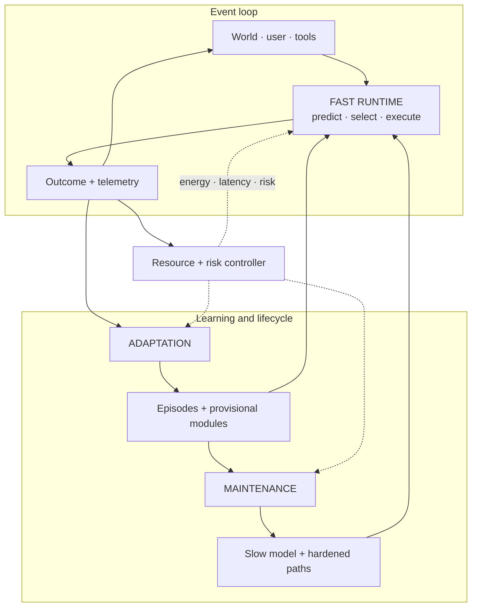
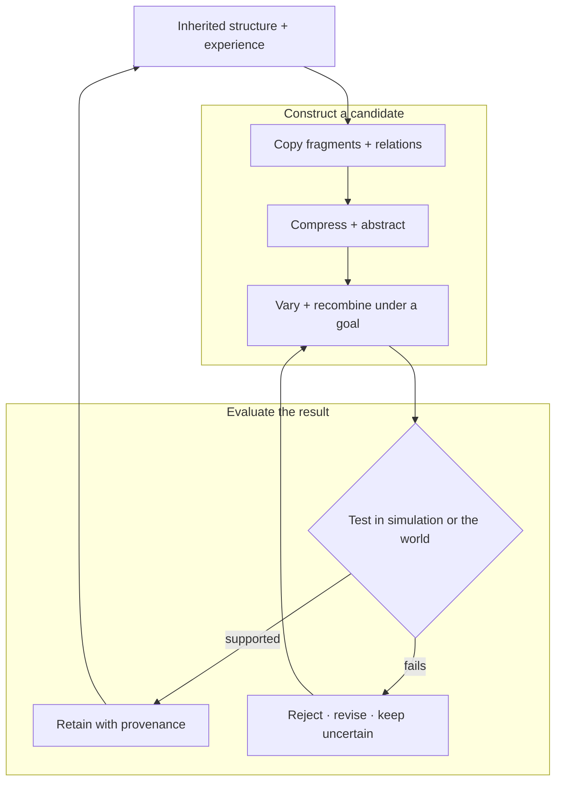
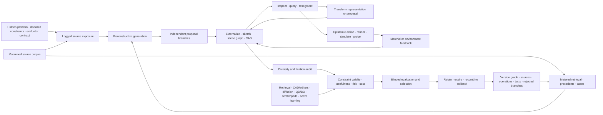

# Working architecture: three coupled loops

> A capable system should execute, adapt, and consolidate on different
> timescales while one controller prices energy, latency, and risk.

## Scope

This is the shortest complete description of the proposed system. It joins the
project's individual mechanisms into one operating architecture and shows where
information moves, where learning happens, and which decisions remain
reversible.

## Architecture at a glance

Editable source:
[`../assets/diagrams/three-coupled-loops.mmd`](../assets/diagrams/three-coupled-loops.mmd).

The three loops solve different problems:

| Loop | Timescale | Primary decision | Normal output |
| --- | --- | --- | --- |
| Fast runtime | event | What should run now? | action, answer, or escalation |
| Adaptation | episode to session | What did this outcome teach us? | attributable episode, hypothesis, or provisional module |
| Maintenance | replay to release cycle | What should become stable, move, weaken, or disappear? | consolidated memory and restructured execution |

The resource controller crosses all three. It can restrict an action because
of energy, latency, communication, or risk, but it cannot silently replace the
task objective. Measured outcomes return to the controller so estimated costs
can be corrected.

## Biological observation

Living systems repeatedly separate processes by timescale and locality:

- many components are available, while only a small subset is strongly active
  together ([C-001](../research/claims.md#c-001),
  [C-003](../research/claims.md#c-003));
- local circuits resolve routine events while larger systems coordinate
  exceptions ([C-017](../research/claims.md#c-017),
  [C-024](../research/claims.md#c-024));
- fast traces change behavior before slow structure is rewritten
  ([C-008](../research/claims.md#c-008),
  [C-019](../research/claims.md#c-019));
- replay, forgetting, and structural maintenance are selective processes
  ([C-036](../research/claims.md#c-036)–[C-042](../research/claims.md#c-042));
- stable structure can be protected and later reopened under bounded
  intervention ([C-043](../research/claims.md#c-043)–[C-045](../research/claims.md#c-045)); and
- local demand can recruit adjacent resource supply
  ([C-049](../research/claims.md#c-049)–[C-051](../research/claims.md#c-051)).

The shared principle is separation of concerns: execution, adaptation, memory,
structure, and physical supply change at different speeds and respond to
different signals. Digital systems add exact copying, external stores,
checkpoints, shadow evaluation, and rollback. Those capabilities make the
separations easier to test and safer to revise.

## Proposed AI translation

### 1. Fast runtime

For each event, the runtime forms a predictive state containing expected
observations, uncertainty, current goals, and relevant recent context. A
hierarchical selector then chooses the cheapest admissible path:

- a hardened low-cost path for a familiar, low-risk event;
- one or more conditionally active experts;
- another layer or reasoning step;
- episodic or factual retrieval;
- a sensor, tool, or environment intervention; or
- escalation to a human or a more capable controller.

The output is more than an answer. It includes measured latency, energy,
communication, calibration, and any observed consequence. That telemetry is
the input to later learning and resource decisions.

### 2. Adaptation

An outcome is captured with provenance before it can alter slow parameters. It
may update temporary state, create a provisional adapter, change a local
connection, or simply become a replay candidate. A surprising event is not
automatically a lesson; it may be noise, attack, contradiction, or evidence of
a new regime.

There is no ex-nihilo generator in this design. Every proposal is built from
inherited structure and experience: complete patterns, fragments, relations,
or abstractions are copied and transformed. The generative cycle is therefore
explicit:

Editable source:
[`../assets/diagrams/generative-recombination.mmd`](../assets/diagrams/generative-recombination.mmd).

Stochasticity can alter which variants are tried. Usefulness comes from the
entire cycle: decomposition, recombination, intervention, comparison, and
selection. The supporting evidence and unresolved distinctions are tracked in
the [endogenous generation audit](../research/audits/2026-08-05-endogenous-generation-creativity.md)
and is falsified first through
[Candidate 004](../experiments/candidates/004-closed-endogenous-curriculum.md).

#### Reconstructive adaptation through external state

Visual art and design cognition make the cycle more operational. Proposal
generation is reconstructive: learned categories, exemplars, relations,
styles, constraints, tools, and prior transformations shape what can be
proposed ([C-842](../research/claims.md#c-842)–[C-860](../research/claims.md#c-860)).
That does not reduce the process to nearest-neighbor retrieval. A system can
externalize a partial state, inspect consequences that were not explicit in
its preceding plan, change representation, probe the world, and use the result
to create a new branch. The novelty is relative to a declared history; the
validity comes from constraints and observed outcomes.

The adaptation loop therefore distinguishes seven event types:

1. **Exposure:** which sources, examples, styles, and constraints were
   available before the task;
2. **Retrieval:** which versioned sources were deliberately requested during
   the task and at what cost;
3. **Reconstruction:** which fragments, relations, or abstractions formed a
   proposal branch;
4. **Externalization:** which editable representation—text, sketch, scene
   graph, CAD state, program, simulation, or prototype—made the proposal
   inspectable;
5. **Epistemic action:** which render, measurement, simulation, query, or
   material intervention was selected to reduce a decision-relevant
   uncertainty;
6. **Evaluation and selection:** which hard constraints, qualified evaluators,
   risk limits, and selection rule admitted or rejected a version; and
7. **Retention:** which source, parent, operation, test, rejected branch,
   dependency, expiry, and rollback records were preserved.

Editable source:
[versioned-reconstructive-design.mmd](../assets/diagrams/versioned-reconstructive-design.mmd).

Several separations are non-negotiable. More proposals are not necessarily
better proposals; proposal diversity, constraint validity, selection regret,
and realized outcome are different measurements. Similarity to an example can
transfer a useful structural relation or cause fixation and negative transfer,
so similarity and task effect are both reported. A provenance graph can record
derivation without proving intention, authenticity, correctness, or
originality. Aesthetic response is observer-, context-, expertise-, and
history-qualified rather than a universal scalar.

Parallel branches are useful only if they remain genuinely independent before
critique. A shared canvas can coordinate work and simultaneously propagate an
early fixation. The comparison therefore includes private branches, delayed
reveal, source substitution, example removal, evaluator swap, material swap,
and representation conversion. Every alternative pays for retrieval,
proposals, tools, simulations, human critique, physical material, waste,
retention, and recovery.

[Fixture F-002](../experiments/fixtures/002-versioned-reconstructive-design.md)
tests this complete loop against a mature composition of retrieval, CAD and
editors, generative sampling, explicit search and quality-diversity,
scratchpads and shared workspaces, active learning, simulation, version
control, provenance, and independent reranking. The
[mathematical contract](../math/versioned-reconstructive-design.md) keeps
exposure, retrieval, relative novelty, reinterpretation, information gain,
fixation, negative transfer, constraint margins, evaluator qualification,
selection regret, lineage, reconstructability, and lifecycle cost separate.
If that ordinary stack ties, the additional architecture is removed while the
fixture remains as a negative result.

### 3. Maintenance

Maintenance receives a budgeted set of possible actions. For any memory,
module, or route it may:

- defer while collecting more evidence;
- replay against related and conflicting cases;
- merge redundant records while retaining provenance;
- externalize mutable propositions to an inspectable store;
- reduce influence or plasticity;
- delete state after retention and safety checks;
- reopen mature structure in a reversible branch;
- change logical topology or physical placement; or
- promote stable computation into a cheaper representation.

The formal action model is defined in
[`../math/memory-lifecycle.md`](../math/memory-lifecycle.md). Structural changes
remain shadowed and reversible until regression, calibration, and energy tests
pass.

### 4. One event end to end

1. A sensor, user, or tool changes the current state.
2. The runtime predicts what matters and estimates uncertainty.
3. The selector chooses depth, modules, memory, precision, and possible
   intervention under the current budget.
4. Execution produces an outcome and physical telemetry.
5. The adaptation loop stores an attributable episode and may construct a
   bounded hypothesis or provisional module.
6. The maintenance loop later replays the episode against related and
   conflicting evidence.
7. A validated regularity may be consolidated, compiled, quantized,
   externalized, relocated, or used to change future routing.
8. Regression or fragility tests can reject the change and restore the previous
   state.

### 5. State ownership

| State | Primary owner | Normal write path | Reason for separation |
| --- | --- | --- | --- |
| Current predictive state | runtime | every event | cheap, transient, task-specific |
| Attributable episodes | adaptation | observed outcome | preserves evidence before abstraction |
| Provisional hypotheses | adaptation | bounded generation and trials | permits novelty without global drift |
| Reusable skills and representations | slow model | validated consolidation | stable transfer across events |
| Mutable propositions | factual memory | sourced, versioned update | correction, attribution, and conflict |
| Hardened execution paths | compiled store | promotion pipeline | lower repeated interpretation cost |
| Lifecycle and fragility state | maintenance | replay, probes, regressions | repair remains separate from execution |
| Resource and risk policy | controller | calibrated policy update | local mechanisms cannot hide physical cost |

## Efficiency mechanism

Efficiency is an event-level constrained decision. At time $t$, the selector
chooses an admissible action $a$ from $\mathcal{A}_t$:

$$
a_t^*=\arg\max_{a\in\mathcal{A}_t}
\mathbb{E}[\Delta V(a)\mid s_t]
$$

subject to

$$
E(a)\le B_t^E,\qquad
L(a)\le B_t^L,\qquad
R(a)\le \epsilon_t^R.
$$

Here $s_t$ is the predictive state; $\Delta V(a)$ is expected task-value
improvement; $E(a)$ is energy in joules; $L(a)$ is latency in seconds; $R(a)$
is the declared risk measure; and $B_t^E$, $B_t^L$, and $\epsilon_t^R$ are
event-specific limits. Measured cost after execution recalibrates the
estimator.

Lifecycle comparison includes the work usually hidden outside inference:

$$
E_{\mathrm{life}}=
E_{\mathrm{run}}+E_{\mathrm{memory}}+E_{\mathrm{network}}+
E_{\mathrm{adapt}}+E_{\mathrm{maint}}+E_{\mathrm{recovery}}.
$$

An architecture advances only if it improves the joint frontier of quality,
risk, latency, and lifecycle energy against its strongest conventional
baseline. Skipped FLOPs alone are not an efficiency result.

## Evidence status

| Component | Current evidence | Translation status |
| --- | --- | --- |
| Conditional experts and early exit | C-003, C-004 | implemented mechanisms; physical benefit remains system-specific |
| Predictive residual allocation | C-005–C-007, C-022 | plausible composition; grounded experiment required |
| Fast/slow memory and replay | C-008–C-010, C-036–C-042 | scoped evidence; lifecycle controller experimental |
| Structural maturation and reopening | C-012, C-043–C-045 | biological interventions established; digital state machine speculative |
| External factual memory | C-014 | usable mechanism; conflict and energy policy unresolved |
| Local resource and context control | C-046–C-051 | biological observations established; proposed control planes experimental |
| Endogenous proposal generation | C-061–C-066 | constituent observations established; integrated curriculum speculative |
| Versioned reconstructive design | C-842–C-860 | constituent observations scoped; complete externalize–inspect–transform–evaluate loop unvalidated |
| Complete three-loop system | none | unvalidated synthesis |

The [engineering analogue audit](../research/audits/2026-08-05-engineering-analogues.md)
maps the architecture to feedback control, value of information, caches,
schedulers, change detection, adaptive routing, replicated state, and system
identification. Each experiment must compare against the strongest relevant
version of those methods.

## Speculative extensions

- Receiver-specific fast and slow context channels under a hard bit budget.
- Modules bidding for compute by expected value improvement while a global
  controller enforces physical and safety constraints.
- Active fragility probes on shadows or replicas before topology changes.
- Capability-gap repair that admits complementary modules instead of restoring
  arbitrary capacity.
- Joint learning of logical routing, memory placement, and hardware locality.

Each remains outside the core architecture until its isolated contract beats
the appropriate engineering baseline.

## Failure modes

- **Dense control disguised as sparsity:** routing, broadcast, or monitoring
  moves nearly as much state as dense execution.
- **Controller conflict:** runtime, adaptation, maintenance, and resource loops
  oscillate or optimize incompatible signals.
- **False maturity:** a shortcut appears stable and is hardened before
  compositional and intervention tests.
- **Memory laundering:** unsupported episodes become slow parameters without
  provenance or contradiction checks.
- **Maintenance dominates cost:** replay, probes, migrations, and regression
  testing consume the savings of conditional execution.
- **Fixation propagates through shared state:** early examples or collaborators
  collapse independent branches before alternatives are tested.
- **Generation impersonates evaluation:** the proposal model's own score is
  reported as independent evidence of validity or usefulness.
- **Lineage impersonates truth:** a complete derivation record is treated as
  proof of correctness, intention, authenticity, or originality.
- **Renaming without mechanism:** a familiar cache, controller, or scheduler
  receives a biological label without a different causal operation.

## Measurable predictions

The architecture earns implementation only if isolated experiments support the
following predictions:

1. Conditional execution reduces measured data movement and wall energy at
   matched quality, calibration, and tail risk.
2. Fast attributable memory improves adaptation latency while slow-model
   regression remains bounded.
3. Reversible maturity gates reduce catastrophic drift without blocking
   necessary relearning or newcomer admission.
4. Structured recombination plus targeted intervention produces more valid,
   useful novelty than matched-budget stochastic sampling alone.
5. Editable externalization, inspection, representation change, and epistemic
   action improve hidden-constraint validity, selection regret, and transfer
   beyond the complete retrieval/editor/generation/search/tool stack without
   increasing fixation or lifecycle cost.
6. Maintenance improves retention and adaptability after replay, monitoring,
   migration, and recovery costs are counted.
7. At least one proposed mechanism beats the strongest ordinary controller,
   scheduler, cache, router, or system-identification baseline.

Until those tests pass, this is a working architecture: precise enough to
reject, modular enough to simplify, and explicitly incomplete.
