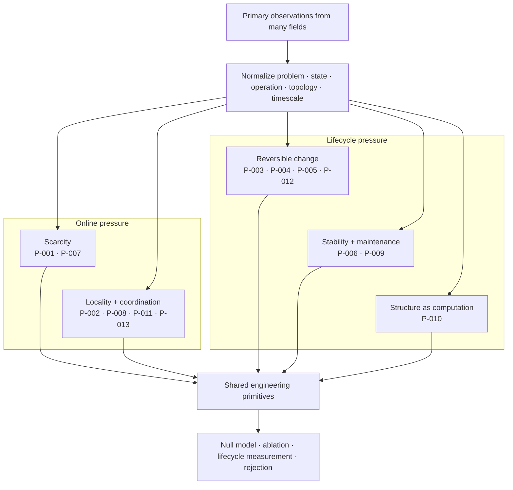

# Cross-domain convergence and principle deduplication

> Different sciences often describe the same constrained operation in different
> nouns. The architecture should pay for the operation once.

## Scope

This chapter turns the project's open-world research policy into an
architectural method. Findings may originate in neural tissue, plants, immune
systems, animal collectives, ecosystems, control theory, databases, or
materials. They enter the design only after their causal operation has been
normalized and compared with the principles already present.

The canonical unit is therefore neither a paper nor an organism. It is a
versioned problem–solution invariant with a stable `P-` identifier, scoped
evidence, an engineering null model, and an experiment that can reject its AI
translation. The detailed registry remains in the
[principle ledger](../research/principle-registry.md); this chapter explains how
its bundles compose into one system.

## Biological observation

The current evidence corpus repeatedly encounters five pressures.

1. **Scarcity:** more states, candidates, or possible actions exist than can be
   active at once. Examples include constrained cortical signaling
   ([C-001](../research/claims.md#c-001)), sparse insect odor codes
   ([C-025](../research/claims.md#c-025)), immune selection
   ([C-028](../research/claims.md#c-028)), and congestion-triggered reserve
   routes ([C-035](../research/claims.md#c-035)).
2. **Locality:** a complete central description is too slow or expensive.
   Dendritic branches integrate locally ([C-017](../research/claims.md#c-017));
   cephalopod limbs retain peripheral control
   ([C-024](../research/claims.md#c-024)); and collective systems can coordinate
   through sparse influence or shared environmental state
   ([C-031](../research/claims.md#c-031),
   [C-054](../research/claims.md#c-054)).
3. **Reversible change:** recent evidence must affect behavior before it
   deserves permanent structure. Eligibility traces
   ([C-019](../research/claims.md#c-019)), plant priming
   ([C-026](../research/claims.md#c-026)), selective replay
   ([C-036](../research/claims.md#c-036)), and retrieval-sensitive memory
   ([C-039](../research/claims.md#c-039)) all separate a temporary state from a
   later commitment decision.
4. **Stability:** selection and learning create positive feedback that must be
   bounded. Synaptic scaling ([C-018](../research/claims.md#c-018)), feedback
   inhibition ([C-025](../research/claims.md#c-025)), reconstruction around a
   target organization ([C-033](../research/claims.md#c-033)), and ecological
   recovery dynamics ([C-058](../research/claims.md#c-058),
   [C-059](../research/claims.md#c-059)) expose different parts of that control
   problem.
5. **Repeated work:** a stable solution should migrate from expensive general
   search into topology, placement, representation, or material. Relevant
   observations include body–controller co-development
   ([C-029](../research/claims.md#c-029)), structured pruning
   ([C-012](../research/claims.md#c-012)), lower-precision representation
   ([C-013](../research/claims.md#c-013)), and activity-dependent resource
   placement ([C-050](../research/claims.md#c-050)).

These recurrences do not make the underlying mechanisms identical. They reveal
where multiple fields expose the same engineering pressure and where one
shared experiment can replace several renamed proposals.

## Proposed AI translation

### From domain language to a mechanism record

Every retained observation is rewritten as the following tuple:

$$
M = \langle p, b, x, f, G, \tau, \rho, \phi \rangle,
$$

where:

| Symbol | Field | Required content |
| --- | --- | --- |
| $p$ | problem | the failure or objective faced by the observed system |
| $b$ | constrained budget | energy, bandwidth, material, time, risk, or capacity with declared units |
| $x$ | sensed state | what the mechanism can actually observe |
| $f$ | causal operation | the intervention-supported state transformation |
| $G$ | information topology | local, hierarchical, broadcast, pairwise, or environment-mediated flow |
| $\tau$ | timescale | event cadence or duration in declared steps or seconds |
| $\rho$ | reversibility | what can decay, reopen, roll back, or be reconstructed |
| $\phi$ | failure boundary | conditions under which the effect disappears, reverses, or becomes harmful |

The tuple is a structured research record, not a numerical embedding. Its
fields retain units and provenance. Two findings are candidates for one
principle only when their problem, causal operation, information topology, and
timescale agree at the abstraction needed by an experiment.

### Five solution families

The thirteen current `P-` principles remain distinct, but they compose into
five navigational families:



Editable source:
[`../assets/diagrams/recurring-solution-families.mmd`](../assets/diagrams/recurring-solution-families.mmd).

| Family | Included principles | Shared artificial primitive | Important separation inside the family |
| --- | --- | --- | --- |
| scarcity | [P-001](../research/principle-registry.md#p-001--selective-allocation), [P-007](../research/principle-registry.md#p-007--prediction-error-allocation) | budgeted selection plus the option to buy more evidence | selecting a candidate is different from deciding whether uncertainty warrants more work |
| locality and coordination | [P-002](../research/principle-registry.md#p-002--local-autonomy-with-exception-escalation), [P-008](../research/principle-registry.md#p-008--compartmentalized-interaction), [P-011](../research/principle-registry.md#p-011--transient-communication-coalitions), [P-013](../research/principle-registry.md#p-013--externalized-shared-state) | stateful local modules with typed, priced communication paths | escalation, temporal binding, and shared workspaces solve different coordination failures |
| reversible change | [P-003](../research/principle-registry.md#p-003--temporary-trace-before-commitment), [P-004](../research/principle-registry.md#p-004--diversity-selection-and-protection), [P-005](../research/principle-registry.md#p-005--use-dependent-topology), [P-012](../research/principle-registry.md#p-012--memory-matched-to-information-lifetime) | versioned candidates, traces, memories, and topology with explicit promotion or decay | delayed credit, episodic content, candidate diversity, and graph mutation require different state |
| stability and maintenance | [P-006](../research/principle-registry.md#p-006--homeostatic-negative-feedback), [P-009](../research/principle-registry.md#p-009--maintenance-plane) | a slower controller that observes aggregate state and can throttle, repair, replay, or reopen | regulating a variable online is different from scheduling lifecycle work |
| structure as computation | [P-010](../research/principle-registry.md#p-010--structural-offloading-and-co-design) | migrate mature recurring work into topology, placement, precision, or compiled paths | each target has different invalidation, migration, and recovery costs |

### Deduplicate before architecture expansion

A new finding passes through six decisions:

1. **Scope the evidence.** Record the observed system, intervention, result,
   uncertainty, and boundary as a `C-` claim.
2. **Normalize the mechanism.** Fill every field of $M$ without organism-themed
   names standing in for operations.
3. **Search the registry.** Compare against all existing `P-` records, including
   held candidates and negative evidence.
4. **Merge or discriminate.** Merge when the same control loop would be tested;
   otherwise name the smallest experiment that distinguishes the mechanisms.
5. **Name the strongest null.** A scheduler, cache, controller, estimator,
   database, routing rule, or standard learning method gets the same interface
   and budget.
6. **Change one canonical object.** Update a principle, primitive, equation,
   diagram, or experiment instead of adding another themed architecture.

This creates a many-to-one evidence graph:

```text
many observations → scoped claims → fewer principles → shared primitives → decisive experiments
```

### Composition without double counting

Principles can cooperate while remaining separately testable. For one event:

1. prediction-error allocation decides whether more evidence is valuable;
2. selective allocation chooses a module within the active budget;
3. local autonomy runs that module near its state;
4. a temporary trace records unresolved credit;
5. the maintenance plane later decides whether to replay, protect, merge, or
   forget it; and
6. structural offloading compiles only the recurring path that survives those
   tests.

Calling the entire chain “sparsity,” “memory,” or “homeostasis” would hide which
operation produced a gain. Each experiment therefore removes one principle at
a time while holding the other interfaces constant.

### Passive self-organization is a mandatory null

Efficient-looking structure does not establish sensing, represented goals, or
counterfactual action. Fracture sets, drainage networks, and river avulsions can
arise from local stress, gravity, flow, conservation, thresholds, and stored
geometry ([C-232](../research/claims.md#c-232)–[C-242](../research/claims.md#c-242)).
The project calls a mechanism adaptive control only when it specifies:

1. a service variable external to the adaptation law;
2. observations with spatial/temporal support and latency;
3. a decision that could choose differently under different evidence;
4. authority and an actuator;
5. movement, reserve, monitoring, and recovery budgets;
6. persistent state and reset cost; and
7. a guarantee or tested failure envelope.

This criterion makes passive physics a stronger baseline. If local flow–structure
feedback produces the same topology and service without a controller, the
controller must justify its sensing, decision, switching, and maintenance cost.
Connectivity is not throughput ([C-234](../research/claims.md#c-234)); material
removed by “pruning” must appear as transport, storage, or output elsewhere
([C-239](../research/claims.md#c-239)); and a topology change can reassign or
destroy service rather than improve it ([C-242](../research/claims.md#c-242)).

## Efficiency mechanism

Deduplication saves two different resources.

First, it reduces research duplication. If plant priming, eligibility traces,
and cache admission all motivate a temporary state before commitment, the
project maintains one promotion interface and tests the domain-specific
differences as variants. Papers and claims remain separate; architecture and
instrumentation are reused.

Second, the resulting families define where the runtime should avoid repeated
work:

- scarcity families reduce unnecessary activation and acquisition;
- locality families reduce movement and synchronization;
- reversible-change families prevent every event from rewriting durable state;
- maintenance families move repair and integration off the critical path; and
- structural offloading reduces the recurring cost of mature behavior.

For principle $j$, lifecycle acceptance uses the energy contract from
[chapter 80](80-energy-model.md):

$$
\Delta E_j(N)
= N\left(E_{B,\mathrm{event}}-E_{j,\mathrm{event}}\right)
- E_{j,\mathrm{introduce}}
- E_{j,\mathrm{maintain}}
- \mathbb{E}[E_{j,\mathrm{recover}}],
$$

where $N$ is a dimensionless count of qualified events, event terms are joules
per qualified event, and introduction, maintenance, and expected recovery are
joules over the same observation horizon. A positive $\Delta E_j(N)$ is only
an energy result; quality, risk, calibration, latency, and resilience must also
remain inside their declared envelopes.

## Evidence status

| Proposition | Status | Basis |
| --- | --- | --- |
| several scientific domains expose recurring scarcity, locality, memory, stability, and structural pressures | established within the current scoped corpus | [claims ledger](../research/claims.md) and [domain inventory](../research/domain-inventory.md) |
| the thirteen current principles are the correct deduplication | plausible working taxonomy | [principle registry](../research/principle-registry.md); boundaries remain revisionable |
| five families provide a useful navigation layer without erasing mechanism differences | proposed synthesis | must improve retrieval, experimental reuse, and reviewer agreement |
| recurrence across less-related domains predicts a useful artificial primitive | speculative | requires prospective tests against matched null models |
| the complete composition improves lifecycle efficiency | speculative | isolated and composed experiments have not yet established it |

## Speculative extensions

- Represent claims, principles, primitives, experiments, null models, and
  failures as a queryable versioned graph while keeping Markdown canonical.
- Track negative results as first-class edges so a rejected translation is not
  repeatedly rediscovered under another domain name.
- Estimate reviewer agreement on mechanism tuples before allowing a new
  principle ID.
- Search specifically for counterexamples: fields where the same pressure
  produces a different stable solution or where the recurring solution fails.
- Use contradictions between domains to generate new experiment regimes rather
  than averaging the difference away.
- Maintain silicon-native escape routes beside every principle: exact copying,
  direct addressing, typed storage, rollback, high-speed communication, and
  variable precision can change which operation is cheapest.

## Failure modes

- **Naming duplication:** the same feedback loop appears repeatedly as a new
  organism-inspired component.
- **False convergence:** similar diagrams hide different sensed variables,
  causal operations, or timescales.
- **Overcompression:** a family becomes so broad that no ablation can isolate
  its mechanism.
- **Evidence laundering:** recurrence is treated as proof of independence,
  optimality, or transfer to AI.
- **Null-model neglect:** a familiar cache, scheduler, controller, or estimator
  is omitted because the biological story sounds novel.
- **Interface drift:** two variants share a principle ID while receiving
  different inputs, budgets, or evaluation envelopes.
- **Positive-result bias:** failed translations disappear, so the same proposal
  returns with a new metaphor.
- **Double-counted savings:** two principles claim the same avoided operation or
  compare against different baselines.
- **Taxonomy lock-in:** stable IDs are mistaken for immutable scientific truth.

## Measurable predictions

1. Independent reviewers given only normalized mechanism records agree on
   merge-versus-separate decisions more often than reviewers given titles and
   domain descriptions alone.
2. As domain coverage grows, the number of supporting claims per accepted
   principle rises faster than the number of principles; a near one-to-one
   ratio signals failed deduplication.
3. At least one proposed organism-specific mechanism is experimentally
   indistinguishable from an existing primitive at matched interface and cost
   and is removed rather than renamed.
4. Experiments built around shared principles reuse telemetry, null models, and
   failure regimes across more than one source domain.
5. Per-principle ablations attribute lifecycle savings to distinct avoided
   operations; overlapping savings disappear when all variants use one common
   baseline and boundary.
6. A principle promoted from recurrent evidence survives at least one regime
   derived from a domain outside the one that originally motivated its AI
   translation.
