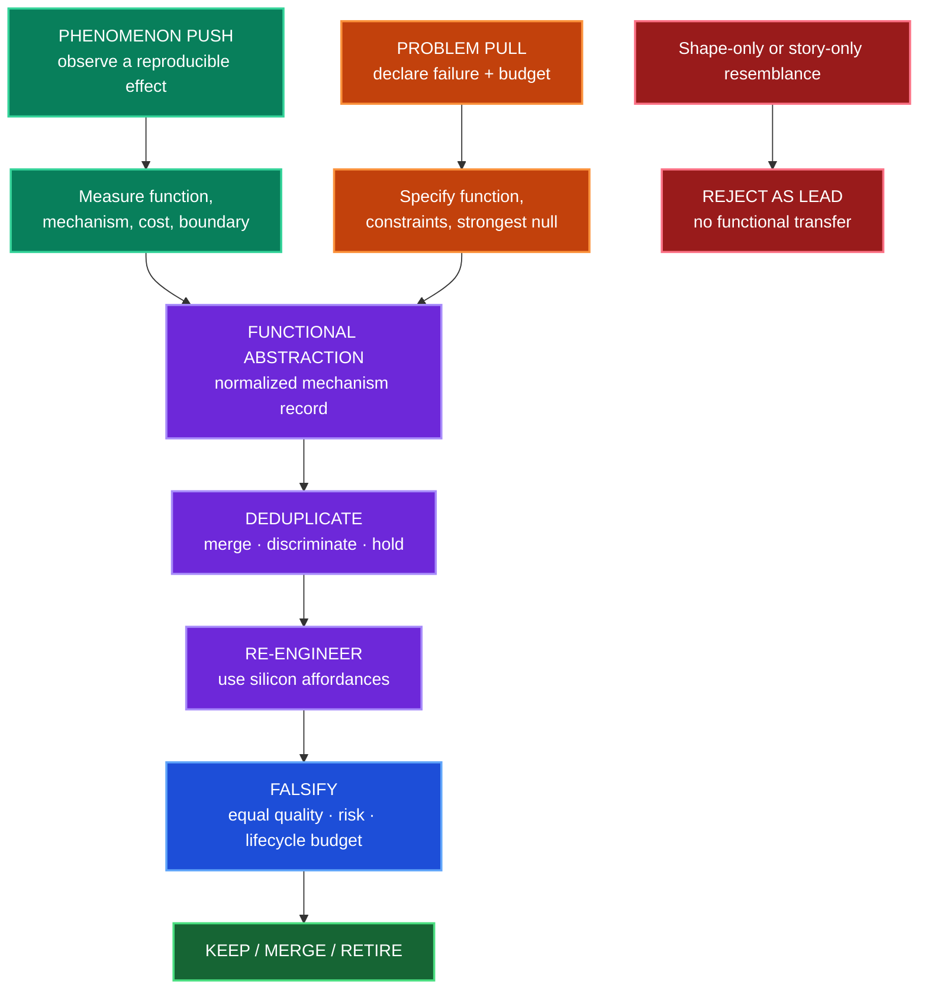
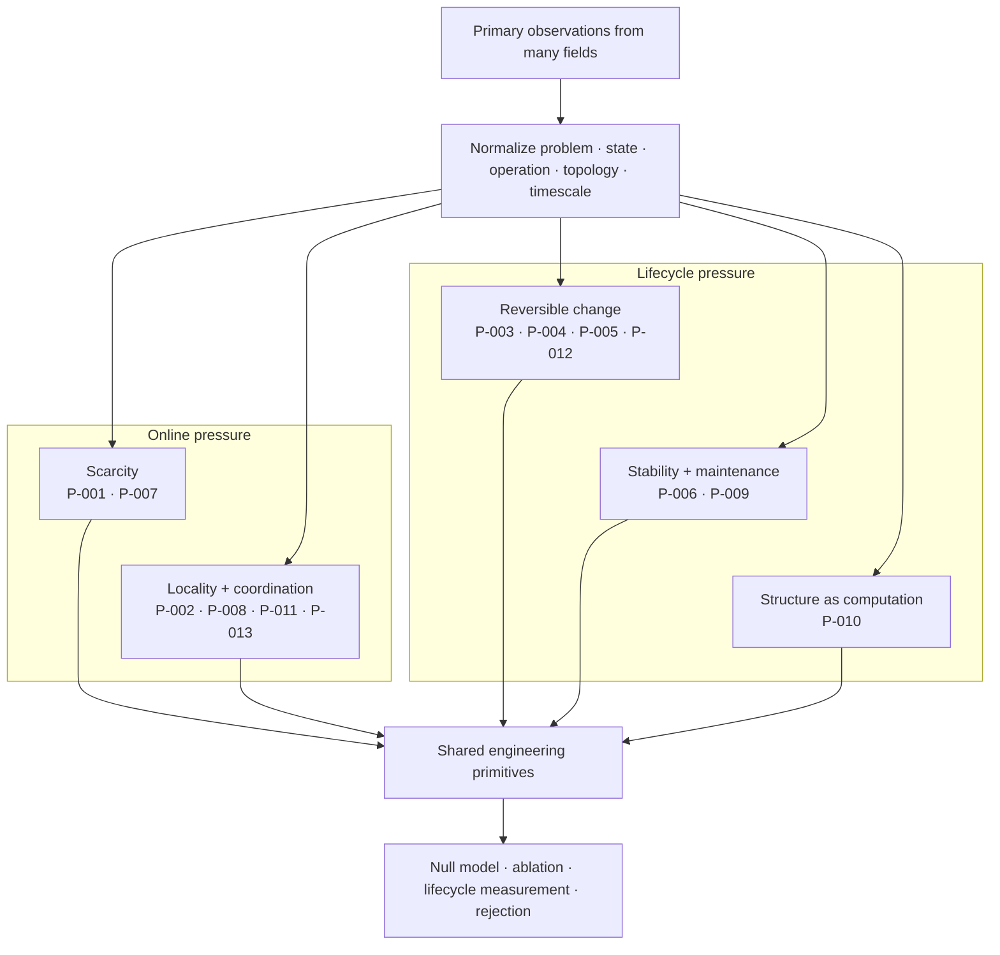
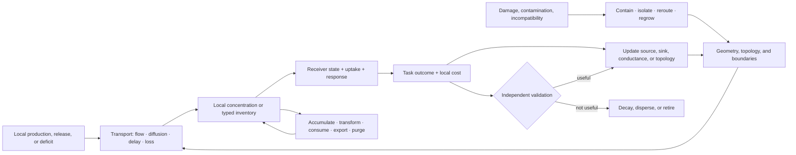
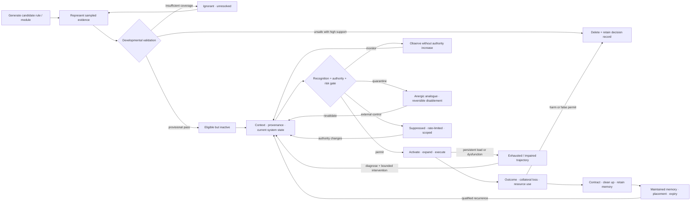
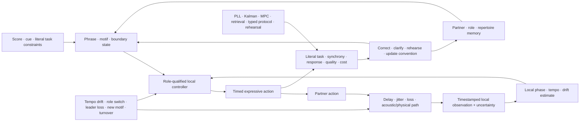
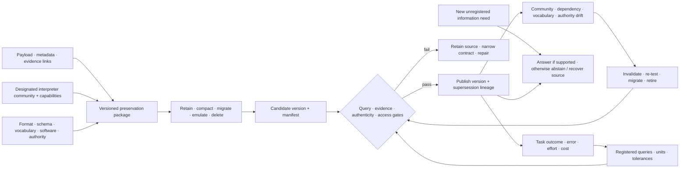
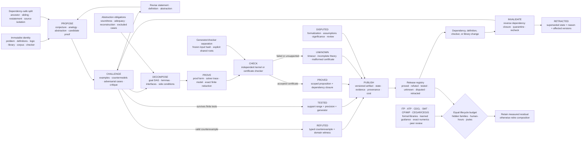

# Cross-domain convergence and principle deduplication

> Different sciences often describe the same constrained operation in different
> nouns. The architecture should pay for the operation once.

## Scope

This chapter turns the project's open-world research policy into an
architectural method. Findings may originate in neural tissue, plants, immune
systems, animal collectives, ecosystems, control theory, databases, or
materials. They enter the design only after their causal operation has been
normalized and compared with the principles already present.

The canonical unit is therefore neither a paper nor an organism. It is a
versioned problem–solution invariant with a stable `P-` identifier, scoped
evidence, an engineering null model, and an experiment that can reject its AI
translation. The detailed registry remains in the
[principle ledger](../research/principle-registry.md); this chapter explains how
its bundles compose into one system.

## Biological observation

The current evidence corpus repeatedly encounters five pressures.

1. **Scarcity:** more states, candidates, or possible actions exist than can be
   active at once. Examples include constrained cortical signaling
   ([C-001](../research/claims.md#c-001)), sparse insect odor codes
   ([C-025](../research/claims.md#c-025)), immune selection
   ([C-028](../research/claims.md#c-028)), and congestion-triggered reserve
   routes ([C-035](../research/claims.md#c-035)).
2. **Locality:** a complete central description is too slow or expensive.
   Dendritic branches integrate locally ([C-017](../research/claims.md#c-017));
   cephalopod limbs retain peripheral control
   ([C-024](../research/claims.md#c-024)); and collective systems can coordinate
   through sparse influence or shared environmental state
   ([C-031](../research/claims.md#c-031),
   [C-054](../research/claims.md#c-054)).
3. **Reversible change:** recent evidence must affect behavior before it
   deserves permanent structure. Eligibility traces
   ([C-019](../research/claims.md#c-019)), plant priming
   ([C-026](../research/claims.md#c-026)), selective replay
   ([C-036](../research/claims.md#c-036)), and retrieval-sensitive memory
   ([C-039](../research/claims.md#c-039)) all separate a temporary state from a
   later commitment decision.
4. **Stability:** selection and learning create positive feedback that must be
   bounded. Synaptic scaling ([C-018](../research/claims.md#c-018)), feedback
   inhibition ([C-025](../research/claims.md#c-025)), reconstruction around a
   target organization ([C-033](../research/claims.md#c-033)), and ecological
   recovery dynamics ([C-058](../research/claims.md#c-058),
   [C-059](../research/claims.md#c-059)) expose different parts of that control
   problem.
5. **Repeated work:** a stable solution should migrate from expensive general
   search into topology, placement, representation, or material. Relevant
   observations include body–controller co-development
   ([C-029](../research/claims.md#c-029)), structured pruning
   ([C-012](../research/claims.md#c-012)), lower-precision representation
   ([C-013](../research/claims.md#c-013)), and activity-dependent resource
   placement ([C-050](../research/claims.md#c-050)).

These recurrences do not make the underlying mechanisms identical. They reveal
where multiple fields expose the same engineering pressure and where one
shared experiment can replace several renamed proposals.

## Proposed AI translation

### From domain language to a mechanism record

Every retained observation is rewritten as the following tuple:

$$
M = \langle p, s, b, x, f, G, \tau, \rho, \phi \rangle,
$$

where:

| Symbol | Field | Required content |
| --- | --- | --- |
| $p$ | problem | the failure or objective faced by the observed system |
| $s$ | source organization and scale | form/material, process/organism, ecosystem/collective, or an explicit cross-scale interaction |
| $b$ | constrained budget | energy, bandwidth, material, time, risk, or capacity with declared units |
| $x$ | sensed state | what the mechanism can actually observe |
| $f$ | causal operation | the intervention-supported state transformation |
| $G$ | information topology | local, hierarchical, broadcast, pairwise, or environment-mediated flow |
| $\tau$ | timescale | event cadence or duration in declared steps or seconds |
| $\rho$ | reversibility | what can decay, reopen, roll back, or be reconstructed |
| $\phi$ | failure boundary | conditions under which the effect disappears, reverses, or becomes harmful |

The tuple is a structured research record, not a numerical embedding. Its
fields retain units and provenance. Two findings are candidates for one
principle only when their problem, causal operation, information topology, and
timescale agree at the abstraction needed by an experiment.

Source organization and scale are not optional metadata. A material structure,
an organism-level control loop, and an ecosystem-level interaction can deliver
a similar function through different causal paths, authority, and timescales;
they do not merge until those differences are shown irrelevant to the
discriminating experiment.

### Biomimetic transfer is a search method, not an evidence grade

Biomimetics gives this project useful process language, but it does not create
a shortcut through the evidence ledger. The search runs in both directions:

1. **Phenomenon push** begins with a measured effect in a living system and asks
   which artificial problem shares its function, constraints, causal operation,
   and failure boundary.
2. **Problem pull** begins with a measured artificial-system failure and asks
   which scientific fields contain a mechanism that solves the normalized
   problem under a comparable budget.

`Phenomenon push` broadens the established biology-push/solution-driven route;
`problem pull` broadens technology-pull/problem-driven design. The broader names
matter because this project searches physical, formal, social, and engineering
sciences as well as biology.

Both routes converge on $M$, then pass through deduplication, silicon-native
redesign, a strong conventional null, and a falsifiable equal-budget test. A
visual likeness without transferred function is rejected; a transferred
function without a causal and cost model remains only a lead; and a validated
source mechanism does not establish that its artificial translation works.



The public descriptions of biomimicry are useful for discovering biological
strategies and unifying themes, while [ISO 18458:2015](https://www.iso.org/standard/62500.html)
and [VDI 6220 Part 2](https://www.vdi.de/en/home/vdi-standards/details/vdi-6220-blatt-2-biomimetics-biomimetic-design-methodology-products-and-processes)
provide more precise terminology and process frames. None is evidence that a
particular mechanism transfers or improves efficiency. The dated
[method audit](../research/audits/2026-08-06-biomimetics-transfer-methodology.md)
records the source hierarchy and the parts adopted here.

### Five solution families

The thirteen current `P-` principles remain distinct, but they compose into
five navigational families:



Editable source:
[`../assets/diagrams/recurring-solution-families.mmd`](../assets/diagrams/recurring-solution-families.mmd).

| Family | Included principles | Shared artificial primitive | Important separation inside the family |
| --- | --- | --- | --- |
| scarcity | [P-001](../research/principle-registry.md#p-001--selective-allocation), [P-007](../research/principle-registry.md#p-007--prediction-error-allocation) | budgeted selection plus the option to buy more evidence | selecting a candidate is different from deciding whether uncertainty warrants more work |
| locality and coordination | [P-002](../research/principle-registry.md#p-002--local-autonomy-with-exception-escalation), [P-008](../research/principle-registry.md#p-008--compartmentalized-interaction), [P-011](../research/principle-registry.md#p-011--transient-communication-coalitions), [P-013](../research/principle-registry.md#p-013--externalized-shared-state) | stateful local modules with typed, priced communication paths | escalation, temporal binding, and shared workspaces solve different coordination failures |
| reversible change | [P-003](../research/principle-registry.md#p-003--temporary-trace-before-commitment), [P-004](../research/principle-registry.md#p-004--diversity-selection-and-protection), [P-005](../research/principle-registry.md#p-005--use-dependent-topology), [P-012](../research/principle-registry.md#p-012--memory-matched-to-information-lifetime) | versioned candidates, traces, memories, and topology with explicit promotion or decay | delayed credit, episodic content, candidate diversity, and graph mutation require different state |
| stability and maintenance | [P-006](../research/principle-registry.md#p-006--homeostatic-negative-feedback), [P-009](../research/principle-registry.md#p-009--maintenance-plane) | a slower controller that observes aggregate state and can throttle, repair, replay, or reopen | regulating a variable online is different from scheduling lifecycle work |
| structure as computation | [P-010](../research/principle-registry.md#p-010--structural-offloading-and-co-design) | migrate mature recurring work into topology, placement, precision, or compiled paths | each target has different invalidation, migration, and recovery costs |

### Deduplicate before architecture expansion

A new finding passes through six decisions:

1. **Scope the evidence.** Record the observed system, intervention, result,
   uncertainty, and boundary as a `C-` claim.
2. **Normalize the mechanism.** Fill every field of $M$ without organism-themed
   names standing in for operations.
3. **Search the registry.** Compare against all existing `P-` records, including
   held candidates and negative evidence.
4. **Merge or discriminate.** Merge when the same control loop would be tested;
   otherwise name the smallest experiment that distinguishes the mechanisms.
5. **Name the strongest null.** A scheduler, cache, controller, estimator,
   database, routing rule, or standard learning method gets the same interface
   and budget.
6. **Change one canonical object.** Update a principle, primitive, equation,
   diagram, or experiment instead of adding another themed architecture.

This creates a many-to-one evidence graph:

```text
many observations → scoped claims → fewer principles → shared primitives → decisive experiments
```

### Recurring outcomes still need a construct firewall

Different fields often expose the same broad problem while assigning different
causal content to it. Ecological succession describes ordered community
change; an ecological priority effect requires an arrival-order intervention;
continual-learning task order concerns sequential parameter updates; curriculum
learning chooses an order; and a scheduler may merely decide when unchanged
jobs execute. Calling all five “succession” would erase the experiment.

The [history-conditioned modular-succession audit](../research/audits/2026-08-26-history-conditioned-modular-succession.md)
therefore reuses C-008, C-056, C-057, C-574, Fixture F-014, and Candidates 004
and 019 without creating another principle. Its residual test holds the task
multiset, eligible module identity set, exogenous presentations, update ceilings, capacity,
optimizer, evaluator and budget fixed, randomizes order, and separately cuts
age, routed acceptance, capacity pre-emption, shared-state modification,
facilitation and lock-in. If canonical replay, a
non-learning scheduler, a mature continual-learning method, or a
search-budget-charged curriculum explains the outcome, the biological transfer
adds nothing.

### New mechanisms can sharpen a principle without multiplying it

The developmental, regenerative, plant-plasticity, and multiscale-reduction
depth passes add new failure boundaries without adding another universal
principle. That is a useful result, not a failed search.

- Positional memory and repair separate **what state says should exist** from
  **which workers can currently rebuild it**
  ([C-1506](../research/claims.md#c-1506),
  [C-1507](../research/claims.md#c-1507)). They sharpen P-005, P-009, and
  P-012 by making write authority, reconstruction capacity, and current
  context separately testable.
- Compensating sources, finite scaling, receiver geometry, delayed
  reinforcement, conditional redundancy, and local/global fields
  ([C-1508](../research/claims.md#c-1508)–[C-1515](../research/claims.md#c-1515))
  refine locality, maintenance, and structural offloading. They do not imply
  that every duplicated route, boundary, or organizer is useful.
- Plant memory divides population-level digital switching, lifecycle reset,
  writing, trace maintenance, retrieval, systemic route identity,
  action-conditioned growth, and joint environmental context
  ([C-1516](../research/claims.md#c-1516)–[C-1525](../research/claims.md#c-1525)).
  These are discriminating state and protocol dimensions inside P-002,
  P-005, P-006, P-009, P-012, and P-013—not a plant-themed architecture.
- Projection memory, normal-hyperbolicity limits, macro-to-micro queries, and
  lift dependence ([C-1526](../research/claims.md#c-1526)–[C-1529](../research/claims.md#c-1529))
  supply mathematical rejection tests for coarse state. They constrain when
  an existing runtime or memory primitive is valid; they are not biological
  claims at all.

The deduplicated output is therefore richer in contracts while remaining at
thirteen P-series principles. Fixtures
[F-022](../experiments/fixtures/022-regenerative-positional-memory.md),
[F-023](../experiments/fixtures/023-plant-plasticity-memory-signalling.md), and
[F-024](../experiments/fixtures/024-applied-multiscale-reduction.md) preserve
the distinctions so later implementations can test whether a proposed
composition adds value beyond its strongest ordinary null within a declared
workload and transfer boundary.

### Composition without double counting

Principles can cooperate while remaining separately testable. For one event:

1. prediction-error allocation decides whether more evidence is valuable;
2. selective allocation chooses a module within the active budget;
3. local autonomy runs that module near its state;
4. a temporary trace records unresolved credit;
5. the maintenance plane later decides whether to replay, protect, merge, or
   forget it; and
6. structural offloading compiles only the recurring path that survives those
   tests.

Calling the entire chain “sparsity,” “memory,” or “homeostasis” would hide which
operation produced a gain. Each experiment therefore removes one principle at
a time while holding the other interfaces constant.

### Interconnection is an intervention

A small or typed interface does not by itself make two modules dynamically
modular. In transcriptional regulation, covalent-modification cycles and yeast
synthetic circuits, attaching a downstream target can alter the upstream state
or transient response
([C-1550](../research/claims.md#c-1550)–[C-1555](../research/claims.md#c-1555)).
Substrate competition in *Drosophila* MAPK signalling supplies a distinct,
potentially functional case ([C-1559](../research/claims.md#c-1559)).
The shared mechanism record is **connection-induced back-action**; the
biochemical literature calls one important family retroactivity.

The domains do not collapse into one mechanism. Direct binding can sequester a
signal, multiple substrates can compete for an enzyme, and nominally separate
modules can instead couple through shared transcriptional, translational, CPU,
memory, or scheduler resources ([C-1558](../research/claims.md#c-1558)). The
causal intervention therefore crosses connection state and shared-resource
load independently. It also includes a genuinely nondestructive immutable-read
control, because silicon can often copy or address state without the molecular
consumption that motivated the analogy.

Insulation is bounded rather than automatically desirable. It must preserve
both the producer and useful downstream service while exposing latency,
staleness, copies, buffers, replicas, operations, maintenance and physical
energy. Weak coupling may spend less while losing tracking or robustness
([C-1556](../research/claims.md#c-1556),
[C-1557](../research/claims.md#c-1557)); substrate competition can also be a
useful integrator rather than a fault ([C-1559](../research/claims.md#c-1559)).
[Fixture F-027](../experiments/fixtures/027-interface-qualified-retroactivity-insulation.md)
therefore compares suppressing, preserving and deliberately using back-action.
If immutable messages, ordinary queues, resource isolation, explicit filters,
stop-gradient paths or conventional controllers reach the same frontier, the
translation is retired without adding a principle.

### Passive self-organization is a mandatory null

Efficient-looking structure does not establish sensing, represented goals, or
counterfactual action. Fracture sets, drainage networks, and river avulsions can
arise from local stress, gravity, flow, conservation, thresholds, and stored
geometry ([C-232](../research/claims.md#c-232)–[C-242](../research/claims.md#c-242)).
The project calls a mechanism adaptive control only when it specifies:

1. a service variable external to the adaptation law;
2. observations with spatial/temporal support and latency;
3. a decision that could choose differently under different evidence;
4. authority and an actuator;
5. movement, reserve, monitoring, and recovery budgets;
6. persistent state and reset cost; and
7. a guarantee or tested failure envelope.

This criterion makes passive physics a stronger baseline. If local flow–structure
feedback produces the same topology and service without a controller, the
controller must justify its sensing, decision, switching, and maintenance cost.
Connectivity is not throughput ([C-234](../research/claims.md#c-234)); material
removed by “pruning” must appear as transport, storage, or output elsewhere
([C-239](../research/claims.md#c-239)); and a topology change can reassign or
destroy service rather than improve it ([C-242](../research/claims.md#c-242)).
A closed-form branching law is therefore a regime-qualified physical null, not
a portable architecture rule ([C-1489](../research/claims.md#c-1489)).

### Transported fields are not messages

Microbial signals, metabolites, fungal nutrients, plant hormones, process
streams, queues, and network packets can all create a local field that later
receivers use. The common systems object is not “communication in nature.” It
is a transported, transformed, delayed, and locally decoded quantity whose
physical path may also change future capacity
([C-563](../research/claims.md#c-563),
[C-578](../research/claims.md#c-578),
[C-580](../research/claims.md#c-580)).

For transported type $k$, use the local balance

$$
\frac{\partial c_k}{\partial t}
=D_k\nabla^2c_k
-\mathbf u\cdot\nabla c_k
+p_k-q_k-r_kc_k,
$$

where concentration $c_k$ is mol/m³, diffusion coefficient $D_k$ is m²/s,
velocity $\mathbf u$ is m/s, production and uptake rates $p_k,q_k$ are
mol/(m³ s), and first-order loss $r_k$ is 1/s. Digital fields use an analogous
typed byte or item ledger; they do not inherit molecular units or diffusion
laws. Geometry, boundary conditions, sampling support, and receiver state are
part of the contract. Countercurrent orientation is one finite exchanger
arrangement inside that contract; it does not establish effectiveness or a
generic bidirectional-computation benefit by itself
([C-1490](../research/claims.md#c-1490)).

Several fields can be superposed at the same endpoints. If the observed
outcome is

$$
y=\sum_{g=1}^{G}h_g(c_g,\theta_g)+b+\varepsilon,
$$

where $G$ is the number of typed channels, $g$ indexes one channel, $c_g$ is
its transported concentration or inventory, $h_g$ is its receiver-dependent
effect, $\theta_g$ is channel state, $b$ is background, and $\varepsilon$ is
measurement error. Observing $y$ or cutting every channel together does
not identify any one $h_g$. Each claimed channel needs an independently
targetable intervention or a justified identification model. Rillig et al.'s
concurrent-fungal-network perspective makes this problem explicit for fungal
guilds sharing plant endpoints; the project adopts it as an engineering
inference, not as evidence that such guild combinations have a demonstrated
beneficial function ([DOI](https://doi.org/10.1111/nph.20418),
[C-217](../research/claims.md#c-217),
[C-584](../research/claims.md#c-584)).



Editable source:
[transported-field-contract.mmd](../assets/diagrams/transported-field-contract.mmd).

The diagram deliberately spans several fields while retaining their
differences:

- microbial quorum output depends on production, confinement, flow, loss, and
  receptor state; it is not a vote count ([C-563](../research/claims.md#c-563),
  [C-575](../research/claims.md#c-575));
- cross-feeding can help, harm, or create a weakest-link dependency, so local
  transfer is not system utility ([C-571](../research/claims.md#c-571));
- fungal flow can both deliver material and remodel conductance while rapid
  containment remains distinct from later bypass
  ([C-577](../research/claims.md#c-577)–[C-581](../research/claims.md#c-581));
  and
- distinct symbiotic partners can exchange unequally under conflicting
  objectives ([C-584](../research/claims.md#c-584)); and
- concurrent typed channels sharing endpoints remain causally unresolved when
  the experiment observes or disables only their aggregate.

The held fixture belongs jointly to P-011/P-013 and existing Candidates 001
and 013 ([C-585](../research/claims.md#c-585)). It must beat typed pub/sub or
queues, fixed-graph adaptive routing, backpressure/primal–dual allocation, and
make-before-break state transfer. Charge production, transport, storage,
cleanup, contamination, topology edits, failed delivery, reserve, and
measurement. If geometry and cleanup do not affect the task, use the simpler
digital primitive.

### Inactive is not one state

The immune evidence in
[C-727](../research/claims.md#c-727)–[C-747](../research/claims.md#c-747)
does not add another architecture principle. It contributes a stricter state
contract. Representation, recognition, authentication, authorization,
activation, suppression, deletion, impairment, contraction, memory, and
recovery answer different questions and have different reversal costs.



Editable source:
[typed-tolerance-lifecycle.mmd](../assets/diagrams/typed-tolerance-lifecycle.mmd).

An activation bit cannot distinguish an absent module from an unobserved one,
a policy-suppressed module from a damaged one, or post-response contraction
from retained memory. That ambiguity makes reactivation unsafe and makes
resource accounting wrong. Each transition therefore records evidence support,
authority, expected useful effect, collateral-loss terms, resource budget,
expiry, recovery target, and observed outcome.

Recognition supplies evidence; it does not grant authority. Deletion requires
a higher support threshold than reversible monitoring or quarantine because a
rare useful capability can be lost. Local copies pay maintenance, refresh,
invalidation, and inconsistency costs. Recovery ends only when useful service
and reserve are both restored.

The [typed lifecycle mathematics](../math/typed-tolerance-lifecycle.md) compares
this contract against a complete ordinary stack: typed state machines,
calibrated risk and abstention, least privilege, constrained control, anomaly
detection, evolutionary or ensemble search, replay, placement, and
resource-aware scheduling. If the ordinary stack reproduces the decisions and
frontier, the biological vocabulary is removed and the state contract remains.

### Coordination without a privileged clock

Music cognition provides a combined stress regime for mechanisms that already
exist elsewhere in the project: multiscale prediction, local timing control,
transformation-aware memory, constrained generation, role protocols, repair,
and cumulative transmission. The evidence in
[C-748](../research/claims.md#c-748)–[C-783](../research/claims.md#c-783)
does not justify a music-specific principle.

Its useful residue is a benchmark: agents must preserve literal phrase
constraints and bounded relative timing while tempo, expressive microtiming,
delay, roles, motifs, leaders, and partners change, without reading a privileged
shared clock. Synchrony still requires common-input controls, edge
interventions, and a protected functional endpoint before it can count as
useful coordination ([C-1495](../research/claims.md#c-1495)).



Editable source:
[shared-clock-free-coadaptation.mmd](../assets/diagrams/shared-clock-free-coadaptation.mmd).

The fixture refuses several easy substitutions:

- similar mean tempo is not pairwise synchronization;
- stimulus-frequency neural power is not evidence of endogenous prediction;
- low onset error is not the correct phrase or role;
- familiar-partner performance is not co-adaptation when retrieval explains it;
- novelty is not validity, responsiveness, or usefulness; and
- within-group convention compression is not cross-group task success.

[Fixture F-001](../experiments/fixtures/001-shared-clock-free-coadaptation.md)
compares the full composition with fixed correction, PLL/adaptive oscillator,
Kalman identification, distributed MPC, a paid centralized conductor,
transformation-aware retrieval, and typed role/version protocols. The
[mathematical contract](../math/predictive-temporal-coadaptation.md) keeps local
clock error, phase, phrase prediction, role safety, message bytes, latency,
rehearsal, recovery, and joules separate. If online estimation plus retrieval
and explicit protocol state ties, the residual is retired.

### Preserved bits are not preserved meaning

Library and archival science adds a dependency that storage abstractions often
hide: information remains useful only for a declared interpreter community
with the formats, schemas, vocabularies, identity mappings, authority evidence,
software, units, permissions, and practiced capability needed to use it. The
audit evidence will occupy [C-784](../research/claims.md#c-784)–[C-803](../research/claims.md#c-803).



Editable source:
[query-registered-preservation.mmd](../assets/diagrams/query-registered-preservation.mmd).

This separates several failure modes that are otherwise mistaken for one
success:

- fixity detects bit change; it does not establish truth or authenticity;
- provenance records lineage; it does not validate the assertion;
- a valid ontology constrains representation; it does not prove instance data;
- a citation edge is not endorsement or comparable impact;
- findability and interoperability do not establish correctness or safe reuse;
  and
- retaining records does not retain the tacit capability needed to interpret
  or act on them.

The [query-registered preservation mathematics](../math/query-registered-preservation.md)
defines finite native-unit tolerances, evidence reachability, interpreter and
dependency validity, migration regression, unregistered-query abstention, and
complete lifecycle cost. The
[Candidate 017 track](../experiments/candidates/017-contract-preserving-semantic-compaction.md#designated-community-and-representation-dependency-track)
must beat ordinary OAIS/PREMIS-style packaging, versioned schema/vocabulary,
retained-source recovery, and query-regression tests. If it does not, the
ordinary preservation stack remains the implementation.

### Candidate production is not acceptance

Mathematical practice supplies the sharpest version of a distinction already
needed throughout this project: producing a candidate and earning acceptance
are different operations. Conjectures, analogies, abstractions, proof sketches,
retrieved lemmas, numerical patterns, solver traces, and learned tactic choices
can all direct search. None of those origins establishes the resulting claim.
The evidence and formal-system boundaries are tracked in
[C-861](../research/claims.md#c-861)–[C-880](../research/claims.md#c-880).

The transferable lifecycle is typed:

1. **Propose.** Bind a candidate to the exact problem, definitions, logic,
   axioms, library, corpus, proposal ancestry, and accessible evidence.
2. **Challenge.** Search examples, counterexamples, countermodels, boundary
   cases, definition changes, and adversarial encodings before commitment.
3. **Decompose.** Turn the target into a dependency DAG whose child artifacts
   reconstruct the parent goal through named interfaces and side conditions.
4. **Prove or refute.** Produce a proof term, checked finite reduction, solver
   certificate, admissible model, or exact counterexample—not only a verdict.
5. **Check.** Bind the artifact to the exact instance and library version, then
   run a small independent checker while publishing shared trust roots.
6. **Publish.** Retain `proved`, `refuted`, `tested`, `unknown`, `disputed`, and
   `retracted` as different states with evidence, provenance, and cost.
7. **Invalidate.** A definition, axiom, checker, dependency, or library change
   quarantines its reverse-dependency closure until rebuild or recheck.



Editable source:
[versioned-proof-discovery-lifecycle.mmd](../assets/diagrams/versioned-proof-discovery-lifecycle.mmd).

This lifecycle prevents five common substitutions:

- finite agreement is evidence for a tested range, not a universal result;
- a counterexample rejects the encoded universal claim but does not choose its
  unique repair;
- individually plausible lemmas do not close a parent goal unless their proof
  artifacts reconstruct it;
- a checker establishes the encoded proposition relative to its logic,
  definitions, axioms, libraries, preprocessing, and trusted implementation;
  it does not validate the informal intent or importance; and
- participant or model count does not establish independent checking when
  sources, parsers, libraries, prompts, or failure modes are shared.

[Fixture F-004](../experiments/fixtures/004-versioned-proof-discovery.md)
compares the joined lifecycle with complete interactive and automated theorem
provers, formal libraries, CDCL SAT, DPLL(T) SMT, constraint and model finding,
CEGAR/CEGIS, learned premise/tactic guidance, exact numerical and exhaustive
methods, and ordinary expert review. The
[mathematical contract](../math/proof-discovery-verification-contract.md)
defines immutable identities, leakage closures, abstraction obligations,
proof-DAG reconstruction, certificate cost, typed states, invalidation, human
effort, and joules. If the mature stack ties, the composition is retired; the
state distinctions and negative result remain.

## Efficiency mechanism

Deduplication saves two different resources.

First, it reduces research duplication. If plant priming, eligibility traces,
and cache admission all motivate a temporary state before commitment, the
project maintains one promotion interface and tests the domain-specific
differences as variants. Papers and claims remain separate; architecture and
instrumentation are reused.

Second, the resulting families define where the runtime should avoid repeated
work:

- scarcity families reduce unnecessary activation and acquisition;
- locality families reduce movement and synchronization;
- reversible-change families prevent every event from rewriting durable state;
- maintenance families move repair and integration off the critical path; and
- structural offloading reduces the recurring cost of mature behavior.

For principle $j$, lifecycle acceptance uses the energy contract from
[chapter 80](80-energy-model.md):

$$
\Delta E_j(N)
= N\left(E_{B,\mathrm{event}}-E_{j,\mathrm{event}}\right)
- E_{j,\mathrm{introduce}}
- E_{j,\mathrm{maintain}}
- \mathbb{E}[E_{j,\mathrm{recover}}],
$$

where $N$ is a dimensionless count of qualified events, event terms are joules
per qualified event, and introduction, maintenance, and expected recovery are
joules over the same observation horizon. A positive $\Delta E_j(N)$ is only
an energy result; quality, risk, calibration, latency, and resilience must also
remain inside their declared envelopes.

## Evidence status

| Proposition | Status | Basis |
| --- | --- | --- |
| several scientific domains expose recurring scarcity, locality, memory, stability, and structural pressures | established within the current scoped corpus | [claims ledger](../research/claims.md) and [domain inventory](../research/domain-inventory.md) |
| candidate production and scoped formal acceptance are different artifact states | established or plausible within the audited formal systems and experiments | [C-861](../research/claims.md#c-861)–[C-879](../research/claims.md#c-879); the joined lifecycle in C-880 remains plausible |
| the thirteen current principles are the correct deduplication | plausible working taxonomy | [principle registry](../research/principle-registry.md); boundaries remain revisionable |
| five families provide a useful navigation layer without erasing mechanism differences | proposed synthesis | must improve retrieval, experimental reuse, and reviewer agreement |
| recurrence across less-related domains predicts a useful artificial primitive | speculative | requires prospective tests against matched null models |
| the complete composition improves lifecycle efficiency | speculative | isolated and composed experiments have not yet established it |

## Speculative extensions

- Represent claims, principles, primitives, experiments, null models, and
  failures as a queryable versioned graph while keeping Markdown canonical.
- Track negative results as first-class edges so a rejected translation is not
  repeatedly rediscovered under another domain name.
- Estimate reviewer agreement on mechanism tuples before allowing a new
  principle ID.
- Search specifically for counterexamples: fields where the same pressure
  produces a different stable solution or where the recurring solution fails.
- Use contradictions between domains to generate new experiment regimes rather
  than averaging the difference away.
- Maintain silicon-native escape routes beside every principle: exact copying,
  direct addressing, typed storage, rollback, high-speed communication, and
  variable precision can change which operation is cheapest.

## Failure modes

- **Naming duplication:** the same feedback loop appears repeatedly as a new
  organism-inspired component.
- **False convergence:** similar diagrams hide different sensed variables,
  causal operations, or timescales.
- **Overcompression:** a family becomes so broad that no ablation can isolate
  its mechanism.
- **Evidence laundering:** recurrence is treated as proof of independence,
  optimality, or transfer to AI.
- **Null-model neglect:** a familiar cache, scheduler, controller, or estimator
  is omitted because the biological story sounds novel.
- **Interface drift:** two variants share a principle ID while receiving
  different inputs, budgets, or evaluation envelopes.
- **Positive-result bias:** failed translations disappear, so the same proposal
  returns with a new metaphor.
- **Double-counted savings:** two principles claim the same avoided operation or
  compare against different baselines.
- **Verifier laundering:** checker acceptance is reported as truth about an
  informal statement without exposing formalization, axioms, dependencies, or
  the trusted implementation.
- **Finite-to-universal leakage:** a sampled numerical or test range is silently
  promoted from `tested` to `proved`.
- **Correlated checking:** producer and verifier share the parser, library,
  preprocessing, or defect that matters while being counted as independent.
- **Taxonomy lock-in:** stable IDs are mistaken for immutable scientific truth.

## Measurable predictions

1. Independent reviewers given only normalized mechanism records agree on
   merge-versus-separate decisions more often than reviewers given titles and
   domain descriptions alone.
2. As domain coverage grows, the number of supporting claims per accepted
   principle rises faster than the number of principles; a near one-to-one
   ratio signals failed deduplication.
3. At least one proposed organism-specific mechanism is experimentally
   indistinguishable from an existing primitive at matched interface and cost
   and is removed rather than renamed.
4. Experiments built around shared principles reuse telemetry, null models, and
   failure regimes across more than one source domain.
5. Per-principle ablations attribute lifecycle savings to distinct avoided
   operations; overlapping savings disappear when all variants use one common
   baseline and boundary.
6. A principle promoted from recurrent evidence survives at least one regime
   derived from a domain outside the one that originally motivated its AI
   translation.
7. A typed propose–challenge–prove–check lifecycle reduces bad acceptance,
   localizes repair, and improves dependency invalidation beyond a generator
   plus checker alone after search, certificates, libraries, human effort, and
   joules are charged; otherwise Fixture F-004 retires the composition.
