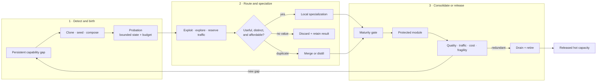
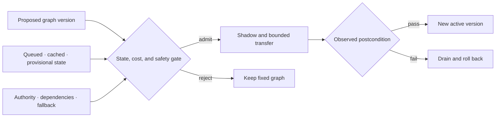
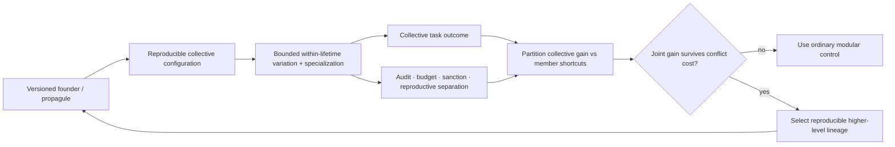

# Structural growth, specialization, and conditional routing

## Scope

Define how a modular system acquires new capacity without running, training, or
retaining every possible module for every event. Growth is admitted only for a
measured capability gap, new capacity earns traffic in probation, and mature
capacity remains eligible for merge, reopening, or retirement.

The central object is a **capacity lifecycle**, not a continuously expanding
pool. Birth, routing, specialization, placement, consolidation, and removal are
separate decisions with separate costs.

## Biological observation

Developing nervous systems generate and reorganize more cells and connections
than remain in mature circuits. In the studied mouse retinogeniculate system,
relative activity and complement signaling changed microglial engulfment and
retention of developing inputs ([C-043](../research/claims.md#c-043)). This
supports activity-sensitive structural refinement by a slower maintenance
process, without specifying one general pruning rule.

Protection is not necessarily permanent. Targeted extracellular and receptor
interventions reopened specific forms of adult visual-cortex plasticity
([C-044](../research/claims.md#c-044),
[C-045](../research/claims.md#c-045)). The resulting engineering states are
candidate, consolidating, protected, reopened, and retiring. A module can be
stable without becoming impossible to revise.

Other biological systems expose control operations that recur at different
scales:

- germinal-center affinity maturation combines variation, selection,
  expansion, and later protection of useful lineages
  ([C-028](../research/claims.md#c-028));
- *Physarum* and fungal networks couple use-dependent reinforcement,
  exploration, fusion, and contraction to changing flow
  ([C-027](../research/claims.md#c-027),
  [C-034](../research/claims.md#c-034));
- ants can open reserve routes under crowding before throughput falls
  ([C-035](../research/claims.md#c-035)); and
- activity can recruit local energy production, alter resource placement, and
  change local vascular supply in scoped neural preparations
  ([C-049](../research/claims.md#c-049)–[C-051](../research/claims.md#c-051)).

These mechanisms are not interchangeable. Together they impose a useful
system constraint: variation and reserve capacity consume resources; selection
needs an independent test; frequently used structure may stabilize; unused or
duplicated structure must be able to leave the hot path.

A defined microbial-community experiment adds a practical design tactic:
adding candidates selected for missing functions repaired the tested community
better than merely restoring organism count ([C-056](../research/claims.md#c-056)).
The inverse problem also matters. Functional redundancy was associated with
poor newcomer engraftment in two small reanalyzed human microbiome datasets
([C-057](../research/claims.md#c-057)). Mature capacity can resist both harmful
and beneficial entrants, so an artificial newcomer needs protected evaluation
traffic rather than permission from incumbent routing logits alone.

## Proposed AI translation

### The capacity lifecycle

Editable source:
[`../assets/diagrams/structural-growth-routing.mmd`](../assets/diagrams/structural-growth-routing.mmd).

The initial system contains modality encoders, predictive shared state,
conditionally addressable experts, hierarchical routers, episodic and factual
memory interfaces, and a declared reserve. Total addressable capacity may be
large, but each event receives only a bounded route. Reserve capacity is stored,
placed, and periodically tested; it is not free merely because it is inactive.

### 1. Detect a capability gap

Growth begins with a gap record, not a global loss spike. A valid record groups
attributable episodes that existing routes fail in a consistent way and asks
whether the failure is better explained by:

- missing capability;
- insufficient active compute or depth;
- missing context or memory;
- router error or capacity congestion;
- interference inside an existing module;
- distribution drift; or
- corrupted data, tools, or feedback.

The maintenance plane attempts the cheaper explanations first. New capacity is
eligible only when the gap persists across resampling or recurrence, existing
modules cannot absorb it inside their interference and resource bounds, and a
candidate has a declared validation contract. This ordering prevents every
hard example from becoming an expert.

### 2. Choose a birth operation

The proposal names both the new structure and what it is expected to repair:

| Birth operation | Best initial condition | Principal cost |
| --- | --- | --- |
| Clone and diverge | one incumbent is close but suffers interference | copied parameters, optimizer state, later deduplication |
| Activate a seed | the gap is genuinely outside active coverage | stored reserve, cold-start training, placement |
| Compose a module | existing primitives are adequate but repeatedly coordinated | router depth, boundary traffic, compilation work |
| Reopen a protected module | a previously valid skill must change | regression risk, branch validation, rollback |

Every birth creates a versioned provisional module. It cannot write the slow
model, replace an incumbent, or claim permanent memory during probation.
Initialization source, training episodes, expected role, resource ceiling, and
discard path are recorded before it receives traffic.

### 3. Give the candidate probation traffic

The router divides admitted work into three explicit budgets:

- **exploit traffic** goes to the strongest validated route;
- **exploration traffic** compares plausible candidates on informative events;
  and
- **reserve traffic** preserves failover and tests paths that would otherwise
  decay unnoticed.

A newcomer receives a capped share of gap-relevant episodes plus matched
control episodes. The control traffic reveals whether it learned a capability
or merely a narrow identifier for the failure cluster. Incumbents cannot reduce
the evaluation share through their own confidence, but the maintenance plane
can stop the trial for quality, risk, latency, memory, or energy violations.

For event $x$, use a dimensionless routing objective

$$
\mathcal{L}_{\mathrm{route}}(x)
= \mathcal{L}_{\mathrm{task}}(x)
+ \lambda_E\frac{\widehat E(x)}{E_0}
+ \lambda_B\frac{\widehat B(x)}{B_0}
+ \lambda_{\mathrm{bal}}\mathcal{L}_{\mathrm{balance}}(x)
+ \lambda_{\mathrm{churn}}\mathcal{L}_{\mathrm{churn}}(x),
$$

where $\widehat E(x)$ is estimated joules/event, $\widehat B(x)$ is estimated
bytes/event across named memory and network boundaries, and $E_0$ and $B_0$ are
declared reference scales with the same units. All $\lambda$ coefficients and
losses are dimensionless. The physical joule and byte measurements remain
separate reported outcomes; normalization does not turn them into task quality.

Balance keeps one expert from taking all traffic. Churn is applied only after a
route has accumulated evidence of stable specialization; penalizing early
movement would protect arbitrary initialization.

### When module reports become strategic

Ordinary routing remains the default. Shadow-price feedback already represents
scarcity under declared controller conditions ([C-133](../research/claims.md#c-133)),
and auction or matching language adds nothing when the router can observe costs
and every module shares the system objective. A market-like mechanism is in
scope only when a persistent module holds decision-relevant private information,
can improve its future traffic by misreporting, and faces a real opportunity
consequence it cannot reset or evade.

That regime creates specific failures. Selection pressure on a visible metric
can damage poorly measured substitute tasks ([C-139](../research/claims.md#c-139));
proper scoring needs an independently verified outcome and does not establish
competence or causal contribution ([C-140](../research/claims.md#c-140)); peer
agreement can reward shared error or collusion ([C-141](../research/claims.md#c-141));
and fixed-agent truthfulness does not solve false identities or a biased
allocator ([C-143](../research/claims.md#c-143)).

[Candidate 008](../experiments/candidates/008-contestable-modular-allocation.md)
therefore begins with a cooperative applicability control that it should not
beat. Only then does it introduce hidden costs, adaptive metric gaming,
protected outcomes, entrants, identity resets, collusion, and allocator
deviation. Withheld audits, lineage-bound consequences, protected entrant
traffic, and replayable commitments remain only if they improve external task,
risk, energy, and latency outcomes after their evaluation and storage costs.

### 4. Measure specialization rather than naming it

A candidate becomes useful when it improves a defined region of behavior while
remaining distinguishable from existing modules. Evidence includes:

- causal improvement when the candidate is admitted and regression when it is
  ablated;
- reduced interference on incumbents or protected history;
- consistent advantage on held-out gap and recurrence episodes;
- a stable but non-exclusive routing region;
- calibration and rare-case behavior inside its declared envelope; and
- physical cost that remains inside its allocation.

Low routing entropy alone is not specialization: a router can collapse onto a
module for the wrong reason. High activation diversity alone is not useful: a
pool can fragment one capability across many expensive duplicates. The test is
complementary causal contribution at a measured lifecycle cost.

### 5. Hand off to merge, protection, or retirement

At the end of probation, the candidate has three normal outcomes:

1. **Discard.** It adds no reliable capability. Preserve the negative result so
   the same proposal is not regenerated indefinitely.
2. **Merge or distill.** It reproduces an incumbent or several modules have
   converged on one operation. Build a compact branch, rerun intervention and
   recurrence tests, then drain duplicates.
3. **Consolidate.** It contributes a distinct reusable capability. Pass it to
   the [maturity lifecycle](50-grokking-and-pruning.md) for protection,
   reopening rules, structured pruning, and rollback.

A protected module remains monitored for traffic, unique contribution,
physical placement, recovery, and newcomer exclusion. Persistent redundancy
returns it to a merge-or-retire gate. Logical topology changes can be evaluated
with [Candidate 001](../experiments/candidates/001-adaptive-topology.md), which
charges reconfiguration, migration, reserve, controller, and recovery costs.

### Conventional null models

The growth controller must beat ordinary ways of allocating or restructuring
capacity, not only a frozen weak model:

| ID | Null model | What it tests |
| --- | --- | --- |
| N0 | Capacity-matched dense monolith | whether modular growth is needed at all |
| N1 | Fixed-capacity sparse MoE with tuned load balancing | whether conditional routing alone explains the gain |
| N2 | Fixed modules plus adapters or low-rank updates | whether new structure beats ordinary parameter-efficient adaptation |
| N3 | Periodic global architecture or topology optimization | whether a standard batch redesign explains local lifecycle control |
| N4 | Usage- or magnitude-prune/retrain cycle | whether causal merge/retire gates add value |
| N5 | Random valid birth, merge, and retirement under equal budgets | whether the lifecycle signals carry information |
| N6 | Trace-aware oracle with future gap labels | unattainable ceiling; never a superiority baseline |

Equalize initial capacity, maximum stored capacity, active work, optimizer
updates, training examples, router information, tuning trials, migration bytes,
validation work, and wall-clock opportunity. Charge candidate failures and
discarded births. Otherwise growth buys more search while the null models are
asked to solve the task in place.

### A topology change carries state

Changing an edge label is not the same as transferring a working system. The
process-engineering audit makes the missing state visible: an installed path
may hold inventory, energy, contamination, pending work, actuator authority,
wear, calibration, maintenance obligations, and shared protection dependencies
([C-501](../research/claims.md#c-501),
[C-510](../research/claims.md#c-510)). Two endpoint configurations can both be
feasible while the path between them is unsafe ([C-512](../research/claims.md#c-512)).

For digital modules, use a typed transition inventory rather than pretending
that bytes obey material conservation. For state class $k$,

$$
I_k(t_1)-I_k(t_0)
= A_k-D_k-X_k+R_k,
$$

where $I_k$ is bytes present at a named boundary, $A_k$ is admitted bytes,
$D_k$ is deliberately deleted bytes, $X_k$ is exported bytes, and $R_k$ is
internally replicated bytes over $[t_0,t_1]$. Each term is bytes and carries a
provenance, validity, and ownership version. This is an accounting contract,
not a claim that information is physically conserved
([C-517](../research/claims.md#c-517)).

Editable source:
[conservation-qualified-reconfiguration.mmd](../assets/diagrams/conservation-qualified-reconfiguration.mmd).

[Candidate 001](../experiments/candidates/001-adaptive-topology.md#process-domain-stress-track)
therefore includes a physical stress track. It must beat fixed-graph adaptive
control, multi-mode supervisory control, and offline redesign after installed
reserve, transition state, flushing, downtime, maintenance, and rollback are
charged. If those nulls tie it, “adaptive topology” describes an implementation
choice rather than an efficiency mechanism ([C-516](../research/claims.md#c-516)).

### When the unit of adaptation changes

A cooperating set of modules is not automatically a higher-level unit. The
claim becomes testable only after defining its boundary, child-configuration
event, inherited state, within-lifetime state, descendant relation, collective
performance, member-level incentives, and conflict-control cost. This separates
aggregation from individuality and a demographic bottleneck from a reproducible
founder boundary ([C-282](../research/claims.md#c-282)–[C-295](../research/claims.md#c-295)).

Editable source:
[conflict-bounded-unit-transition.mmd](../assets/diagrams/conflict-bounded-unit-transition.mmd).

For collective lineage $k$, let $Z_k$ be task-native collective performance and
$W_k$ its dimensionless admitted-descendant weight. The selection accounting is

$$
\Delta\bar Z=
\frac{\operatorname{Cov}(W_k,Z_k)}{\bar W}
+\frac{\mathbb E[W_k\Delta Z_k]}{\bar W}.
$$

The first term is change among declared collectives and the second is
transmission change. A nested partition separately reports member-level
shortcuts. The identity is accounting, not causal proof; group and descendant
definitions are preregistered. [Candidate 016](../experiments/candidates/016-conflict-bounded-unit-transition.md)
must beat typed modular systems, permissions and tests, clean versioning,
external evaluation, routed experts, and ensemble/population selection after
enforcement, false-sanction, interface, founder, reserve, and recovery costs.

## Efficiency mechanism

For experts $i=1\ldots n$, let $g_i(x)\in\{0,1\}$ be the dimensionless event
gate, $C_i(x)$ be executed operations/event under a declared precision, and
$C_{\mathrm{router}}(x)$ use the same convention:

$$
C_{\mathrm{active}}(x)
=C_{\mathrm{router}}(x)+\sum_{i=1}^{n}g_i(x)C_i(x).
$$

This separates addressable parameter capacity from executed work, as sparse
mixture-of-experts systems demonstrate in specific implementations
([C-003](../research/claims.md#c-003)). It does not price parameter reads,
dispatch, all-to-all communication, imbalance, cold starts, or maintenance.

The lifecycle energy per served event is therefore

$$
\bar E_{\mathrm{capacity}}
= E_{\mathrm{route}}+\sum_{i=1}^{n}g_iE_i+E_{\mathrm{comm}}
+\frac{
E_{\mathrm{birth}}+E_{\mathrm{train}}+E_{\mathrm{place}}
+E_{\mathrm{validate}}+E_{\mathrm{merge/retire}}
+\mathbb{E}[E_{\mathrm{recovery}}]
}{N_{\mathrm{served}}},
$$

where every $E$ term is in joules, $E_i$ is expert execution energy/event, and
$N_{\mathrm{served}}$ is the number of events over the comparison horizon.
Report stored parameter and optimizer bytes, bytes moved/event, latency,
utilization, quality, calibration, and risk alongside energy.

Growth is efficient only if conditional execution saves more than candidate
search, idle reserve, placement, validation, and later contraction consume.
Lottery-ticket results show that competitive sparse subnetworks can exist in
tested settings ([C-012](../research/claims.md#c-012)); they do not establish
that this lifecycle discovers them or realizes energy savings on a target
system.

## Evidence status

| Element | Status | Role in this chapter |
| --- | --- | --- |
| conditional expert routing ([C-003](../research/claims.md#c-003)) | established in published systems | capacity and active compute can be separated in suitable implementations |
| competitive sparse subnetworks ([C-012](../research/claims.md#c-012)) | established in tested settings | staged selection and pruning are viable operators |
| use-dependent biological topology ([C-027](../research/claims.md#c-027), [C-034](../research/claims.md#c-034)) | established in scoped organisms/models | motivates reinforcement, decay, exploration, and contraction tests |
| diversity, selection, and protection ([C-028](../research/claims.md#c-028)) | established in the cited immune experiment/model | motivates a bounded candidate lifecycle |
| congestion-triggered reserve use ([C-035](../research/claims.md#c-035)) | established in the cited ant setup/model | reserve paths should be priced and tested before overload |
| developmental refinement and reopening ([C-043](../research/claims.md#c-043)–[C-045](../research/claims.md#c-045)) | established in scoped neural preparations | supports distinct candidate, protected, and reopened states |
| local resource demand and placement ([C-049](../research/claims.md#c-049)–[C-051](../research/claims.md#c-051)) | established in scoped neural preparations | physical supply and movement belong in routing cost |
| shadow prices, matching, proper scoring, metric pressure, identity, and allocator credibility ([C-133](../research/claims.md#c-133)–[C-143](../research/claims.md#c-143)) | established under scoped economic models and experiments | ordinary routing remains the null; contestable allocation is conditional on a measured strategic-information problem |
| audit-backed contestable allocation ([C-144](../research/claims.md#c-144)) | speculative systems composition | Candidate 008 must lose its distinction when modules are cooperative and directly observable |
| capability-gap repair ([C-056](../research/claims.md#c-056)) | established for the defined mouse community and challenge | motivates selecting additions by missing function |
| functional redundancy and engraftment ([C-057](../research/claims.md#c-057)) | plausible association | motivates protected newcomer evaluation and a lock-in test |
| higher-level heredity and conflict accounting ([C-282](../research/claims.md#c-282)–[C-295](../research/claims.md#c-295)) | scoped population-genetic and evolutionary results; artificial composition speculative | Candidate 016 tests whether a collective becomes a useful adaptation unit beyond ordinary modular lifecycle controls |
| complete grow–route–specialize lifecycle | speculative synthesis | requires comparison with N0–N6 |

## Speculative extensions

- Let modules request a birth trial with a compact capability-gap certificate;
  maintenance allocates the trial, not the requesting module.
- Maintain seed modules at several parameter and precision scales so a new role
  need not start from the largest available structure.
- Learn placement jointly with specialization only after migration cost and
  rollback are measurable.
- Use recurrence-aware cold storage: retire a module from hot execution while
  retaining enough checkpoint and routing evidence to restore it if its regime
  returns.
- Allow two candidates to share an encoder or memory interface while keeping
  their update authority and resource accounts separate.
- Test local birth/retirement against periodic global architecture optimization
  under recurrent rather than one-way task sequences.

## Failure modes

| Failure | Observable signature | Required response or ablation |
| --- | --- | --- |
| Router collapse | one module takes most traffic; queue tails or overflow rise | fixed-capacity MoE and stronger load-balancing baseline |
| Candidate inflation | birth rate and stored bytes rise without held-out gap closure | cap trials; compare no-growth and random-birth nulls |
| Fragmentation | many modules show overlapping ablation effects and high boundary traffic | merge/distill branch with causal coverage tests |
| Incumbent lock-in | a superior newcomer cannot acquire evaluation traffic | reserved probation share; compare router-logit admission |
| Premature localization | modality-specific routes lose cross-modal transfer | shared-module and monolithic controls on compositional tests |
| Reserve starvation | no path remains for faults or new regimes | price and enforce declared reserve capacity |
| Reconfiguration thrash | repeated births, moves, merges, or retirements dominate cost | hysteresis and slower maintenance epochs |
| Stranded capacity | cold modules occupy memory but never serve, fail over, or restore | cold-storage, deletion, and restore-value comparison |
| Cosmetic sparsity | active gates fall while loaded bytes, communication, or joules do not | hardware trace and dense-kernel ablation |
| Maintenance inversion | search, validation, migration, and rollback cost exceeds runtime saving | full lifecycle equation and fixed-structure nulls |
| Rare-role deletion | average quality holds while rare or safety-critical cases regress | protected recurrence suite and reconstructable checkpoint |
| False higher-level unit | aggregate reward rises but collective inheritance is transient or member shortcuts dominate | preregister descendant relation; selection partition; ordinary modular and external-evaluator nulls |

## Measurable predictions

1. Capability-gap-driven births close held-out failure clusters with fewer
   admitted candidates and lower lifecycle energy than random birth, periodic
   fixed growth, and capacity-matched adapter baselines.
2. A protected probation share lets genuinely better newcomers establish causal
   value faster than incumbent-logit admission without increasing harmful
   promotions at the same validation budget.
3. Successful specialization produces a stable, non-exclusive routing region
   and positive unique ablation value; routing entropy alone predicts promotion
   less reliably.
4. Conditional growth reduces executed operations and bytes moved/event relative
   to a capacity-matched monolith while preserving quality, calibration, and
   rare-case performance.
5. Causal merge/retire gates preserve recurring and intervention capability
   better than usage- or magnitude-only pruning at matched hot capacity.
6. Reserve capacity improves recovery after faults or returning regimes enough
   to justify its stored bytes, idle energy, and periodic test traffic.
7. Joint routing and placement lowers communication energy only after migration,
   cold-start, and rollback work are included.
8. A collective lifecycle advances only when cost-adjusted between-collective
   selection and inherited capability persist under member shortcuts and
   turnover beyond ordinary lifecycle governance.
9. The complete lifecycle advances only if it improves the quality–risk–latency–
   energy–adaptability frontier over N0–N5; a parameter-count or FLOP reduction
   alone does not satisfy the prediction.
