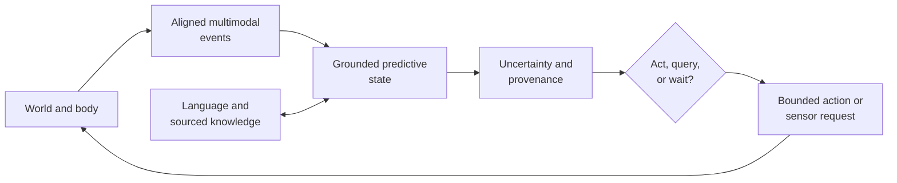

# Multimodal sensorimotor grounding

## Scope

Grounding means that a model’s state is constrained by temporally ordered
observation, action, and consequence—not that every concept must be reducible
to pixels or motor commands. This chapter defines the trajectory record from
which such state can be learned, how language attaches to it, and the tests that
separate action-conditioned structure from passive multimodal correlation.

The central unit is a versioned episode containing asynchronous sensor events,
commanded and realized interventions, exogenous events, and language with
provenance. The model must predict and act under missing modalities, timing
error, partial observability, and finite sensing energy. A representation is
treated as grounded only to the extent that it supports held-out prediction,
intervention, control, and reference at a declared uncertainty.

## Biological observation

Biological perception is embedded in a closed loop. During active whisker
exploration, measured contact mechanics predicted primary sensory-neuron firing
better than whisker angle alone in the scoped mouse experiment
([C-022](../research/claims.md#c-022)). The result establishes that
self-generated sensing mechanics can matter to the sensory code; it does not
make embodiment necessary for every capability.

Other evidence constrains parts of the translation:

- sparse coding can learn localized structure from natural images in the model
  studied under [C-002](../research/claims.md#c-002);
- latent target prediction can learn semantic image representations without
  pixel reconstruction under [C-006](../research/claims.md#c-006);
- children in a controlled toy study targeted actions toward unresolved causal
  structure under [C-062](../research/claims.md#c-062);
- pedagogical demonstration narrowed subsequent exploration in the scoped toy
  experiments under [C-063](../research/claims.md#c-063); and
- causal transparency changed copying of irrelevant demonstrated actions in a
  comparative puzzle-box experiment under
  [C-064](../research/claims.md#c-064).

Together these findings motivate aligned experience, active evidence
collection, and separation of imitation from outcome learning. They do not yet
establish the project-level hypothesis that embodied multimodal training yields
more general physical concepts than comparable text-centric training. That
claim remains speculative under [C-007](../research/claims.md#c-007).

## Proposed AI translation

### Canonical trajectory record

One episode is

$$
\tau=(\nu,\mathcal{O},\mathcal{A},\mathcal{X},\mathcal{Y}),
$$

where $\tau$ is an episode record and all five components are immutable after
publication; corrections create a new version.

| Symbol | Meaning | Unit or type |
| --- | --- | --- |
| $\nu$ | episode metadata | identifiers and versioned configuration |
| $\mathcal{O}$ | asynchronous observation-event set | timestamped records |
| $\mathcal{A}$ | commanded and realized action-event set | timestamped records |
| $\mathcal{X}$ | exogenous event set | timestamped records |
| $\mathcal{Y}$ | language-event set | timestamped text or token records |

Metadata $\nu$ contains episode and environment identifiers; train,
development, or test split; actor or policy version; simulator or device
version; clock domains; calibration versions; random seed when applicable; and
parent episode for a counterfactual branch. Frames from one episode never cross
data splits independently.

An observation event from modality $r$ is

$$
o_{r,k}=
(r,t^{\mathrm{cap}}_{r,k},t^{\mathrm{recv}}_{r,k},v_{r,k},m_{r,k},
q_{r,k},p_{r,k}),
$$

where:

- $r$ is a modality identifier such as vision, audio, touch, proprioception,
  force, temperature, or depth;
- $k$ is an event index;
- $t^{\mathrm{cap}}_{r,k}$ is physical capture time in seconds;
- $t^{\mathrm{recv}}_{r,k}$ is the time in seconds at which the learner could
  first access the event;
- $v_{r,k}$ is the sensor value with the sensor’s declared unit, shape,
  encoding, and quantization;
- $m_{r,k}$ is a dimensionless missingness/status code;
- $q_{r,k}$ is a quality record with named quantities and units, such as
  exposure time in seconds or signal-to-noise ratio in decibels; and
- $p_{r,k}$ is a provenance pointer to source, calibration, transformation,
  and checksum records.

Capture and receipt time are both required. Offline alignment uses capture
time; a deployable causal policy may use an event at time $t$ only when
$t^{\mathrm{recv}}_{r,k}\le t$. This prevents a delayed sensor packet from
becoming accidental future information.

An action event is

$$
\alpha_j=(t_j^{\mathrm{cmd}},t_j^{\mathrm{on}},t_j^{\mathrm{off}},
a_j,\widetilde{a}_j,\pi_j,p_j),
$$

where $t_j^{\mathrm{cmd}}$, $t_j^{\mathrm{on}}$, and $t_j^{\mathrm{off}}$ are
command, realized onset, and realized offset times in seconds; $a_j$ is the
commanded action; $\widetilde{a}_j$ is the measured realized action;
$\pi_j$ is the behavior-policy probability for a discrete action
(dimensionless) or probability density for a continuous action (in reciprocal
action-volume units) when it is known; and $p_j$ is its provenance pointer.
Each action component declares its physical unit—for example newtons,
newton-metres, metres/second, radians, or a discrete tool identifier. Command
and realization are never silently substituted for one another.

An exogenous event $x_l\in\mathcal{X}$ records event and receipt timestamps
$t_l^{\mathrm{event}}$ and $t_l^{\mathrm{recv}}$ in seconds, event type,
measured magnitude and unit, and provenance. Examples include another agent’s
action, an uncommanded collision, lighting change, or simulator reset. Known
simulator state $s_t^*$ may be stored for evaluation in its declared physical
units, but it is oracle information and is withheld from learned systems unless
a baseline explicitly receives it.

A language event is

$$
y_n=(t_n^{\mathrm{start}},t_n^{\mathrm{end}},w_n,c_n,r_n,p_n),
$$

where the two timestamps are seconds, $w_n$ is text or a token sequence, $c_n$
identifies speaker and communicative role, $r_n$ is a set of referent pointers
to objects, events, trajectory intervals, or external records, and $p_n$ is
source provenance. A retrospective caption, an instruction available before
action, a question, a report from another agent, and model-generated text have
different roles even when their words match.

### Missingness is observed state, not a zero tensor

For modality $r$ and decision time $t$, define
$M_t^{(r)}\in\{0,1,2,3,4\}$ as a dimensionless status:

| Code | Meaning |
| --- | --- |
| 0 | present and inside calibration range |
| 1 | absent by experimental design |
| 2 | unavailable because of sensor or transport failure |
| 3 | present but occluded, saturated, clipped, or outside calibration |
| 4 | status unknown |

The raw value is not imputed before status is retained. If an imputed value is
needed, the model receives both the imputation and $M_t^{(r)}$. Training dropout
is labeled as synthetic missingness and is sampled in contiguous outages as
well as isolated frames. Confirmatory tests include natural missingness,
failure, corruption, and combinations not seen during training.

Missingness may itself be informative—for example a tactile sensor becomes
available only after contact. Evaluation therefore distinguishes performance
gained from legitimate availability structure from shortcut prediction of a
label or environment identifier.

### Temporal alignment contract

Each modality has a calibrated clock offset $\delta_r$ in seconds and residual
jitter scale $\sigma_r$ in seconds. The corrected capture time is

$$
\bar t^{\mathrm{cap}}_{r,k}=t^{\mathrm{cap}}_{r,k}-\delta_r.
$$

Alignment does not mean forcing all modalities onto one frame rate. Encoders
consume timestamped events or aggregate them inside declared causal windows.
For a decision at time $t$, the available history is

$$
\mathcal{H}_t=
\{o_{r,k}:t^{\mathrm{recv}}_{r,k}\le t\}
\cup
\{\alpha_j^{\le t}:t_j^{\mathrm{cmd}}\le t\}
\cup
\{x_l:t_l^{\mathrm{recv}}\le t\}
\cup
\{y_n:t_n^{\mathrm{end}}\le t\},
$$

where $\mathcal{H}_t$ is a set of records, not a unit-bearing scalar, and
$\alpha_j^{\le t}$ contains only action fields measured by time $t$; a future
realized offset or actuator trace is not revealed with the earlier command.
The equation admits a language event after its end time; a streaming system
may instead add explicitly timestamped token prefixes. Outcome targets may use
later events, but the state used to choose an action may not.

Alignment robustness is tested by adding known per-modality offsets and jitter,
dropping clock-synchronization messages, and withholding one calibration
version. A mechanism that works only at exact simulator step boundaries has not
learned a robust temporal relation.

### Observation, intervention, and consequence

An action token is useful only when its consequence can be distinguished from
background change. Training retains four separable cases:

1. passive observation with no controlled action;
2. policy-chosen action with known or estimated behavior probability $\pi_j$;
3. randomized or scripted intervention with known assignment; and
4. paired simulator branch from the same saved initial state with one changed
   action.

Only the third and fourth directly support an interventional comparison.
Policy-chosen logs are confounded by the policy’s state and require a declared
system-identification, propensity, or model-based assumption. Exogenous events
remain separate from realized action so the model cannot credit itself for an
outside cause.

For a horizon $\Delta>0$ seconds, an action-conditioned predictor estimates

$$
p_\theta\!\left(z_{t+\Delta}\mid z_t,
\widetilde{a}_{[t,t+\Delta)},M_{\le t}\right),
$$

where $z_t\in\mathbb{R}^d$ is a dimensionless latent state of width $d$,
$\theta$ is the parameter vector, $\widetilde{a}_{[t,t+\Delta)}$ is the
realized action sequence over the interval with per-component physical units,
and $M_{\le t}$ is missingness history. The predictor is not called causal
merely because action is an input. Causal interpretation depends on the data
case and evaluation intervention.

This realized-action form is used for training and retrospective scoring. A
prospective rollout conditions on a candidate command $a$ and integrates over
the calibrated distribution of actuator delay and realized action; it does not
assume that a command is executed exactly.

### Predictive state and action loop

The observation encoder forms

$$
z_t=E_\phi(\mathcal{H}_t),
$$

where $E_\phi$ is an encoder with dimensionless parameters $\phi$ and $z_t$ is
dimensionless. Separate heads predict future latent state, selected sensor
targets, task outcomes, and calibrated uncertainty. Pixel or waveform
reconstruction is used only when the task requires that detail; normalized
latent prediction follows the narrower evidence in
[C-006](../research/claims.md#c-006).

For target-event set $\mathcal{G}$, a probabilistic prediction loss is

$$
\mathcal{L}_{\mathrm{pred}}
=-\frac{1}{|\mathcal{G}|}
\sum_{g\in\mathcal{G}}
\log p_\theta(v_g\mid\mathcal{H}_{t_g},
\widetilde{a}_{[t_g,t_g+\Delta_g)}),
$$

where $|\mathcal{G}|$ is a target count, $v_g$ is a declared target under a
declared quantization or likelihood on dimensionless normalized coordinates,
$t_g$ is target context time in seconds, $\Delta_g$ is its prediction horizon
in seconds, and
$\mathcal{L}_{\mathrm{pred}}$ is nats/target. A normalized latent-distance loss
may be reported in dimensionless units, but it is not added to negative log
likelihood without a declared conversion weight.

At a decision, the system may act on the world, request a modality, ask a
question, consult sourced memory, or wait. Let $b\in\mathcal{B}_t$ denote one
such acquisition or intervention choice. A conventional one-step
value-of-information policy chooses

$$
b_t^*=\arg\max_{b\in\mathcal{B}_t}
\left[V(b\mid\mathcal{H}_t)
-\lambda_E E(b)-\lambda_T T(b)\right],
$$

where $V$ is expected task-utility improvement in declared utility units,
$E(b)$ is full sensor, communication, and compute energy in joules, $T(b)$ is
added latency in seconds, $\lambda_E$ has units utility/joule, and $\lambda_T$
has units utility/second. `wait` is an explicit zero-acquisition option. This
is the strongest conventional null for claims that prediction error should
route sensing or compute, as described under
[P-007](../research/principle-registry.md#p-007--prediction-error-allocation)
and in the [engineering analogue audit](../research/audits/2026-08-05-engineering-analogues.md#p-007--prediction-error-allocation).

### Grounded learning loop

Editable source:
[`../assets/diagrams/grounded-learning-loop.mmd`](../assets/diagrams/grounded-learning-loop.mmd).

### Language attaches to grounded state

Language serves at least four different functions:

1. **reference:** name an object, relation, action, event, or trajectory span;
2. **instruction and query:** change the agent’s task or request information;
3. **compression and communication:** summarize learned regularity for another
   time, module, or agent; and
4. **testimony:** introduce facts and abstractions not available through direct
   sensorimotor experience.

Reference is trained from the $r_n$ links in language events, including
negative and ambiguous referents. Instructions are available only from their
receipt time and are treated as interventions that may change action. Testimony
retains source, version, trust policy, and retrieval trace; it is not forced
into a fictional physical observation. A concept can therefore combine direct
experience, action–outcome evidence, and sourced symbolic knowledge without
erasing which support came from where.

The staged design learns predictive physical state before or alongside a small
language adapter, then compares late attachment, joint training, and
language-first training under equal data and capacity budgets. Physical probes
use paraphrases and unseen names; language probes include relations with no
direct sensory referent. Demonstrated action and demonstrated outcome are
separate targets, following the distinction motivated by
[C-064](../research/claims.md#c-064).

### Uncertainty and provenance contract

Each prediction exposes a distribution or calibrated interval at the level at
which action is chosen. Report negative log likelihood in nats/target, Brier
score for declared categorical events, interval coverage in percent, and
calibration error with binning fixed before evaluation. Calibration is broken
out by modality status, prediction horizon, intervention type, environment,
and linguistic versus direct evidence.

A single confidence scalar does not replace modality-specific uncertainty.
The system records whether uncertainty arose from noisy observation, missing
modality, disagreement among plausible dynamics, unseen composition, ambiguous
language, or untrusted testimony when the estimator supports that distinction.
If it does not, the output remains an undifferentiated predictive uncertainty.

Every training and evaluation event resolves through $p_{r,k}$, $p_j$, or
$p_n$ to:

- raw or generated source identifier and checksum;
- simulator, device, actor, and policy version;
- capture and receipt clock domains;
- calibration and transformation chain;
- missingness and corruption operations;
- split assignment and counterfactual parent; and
- license or access policy where applicable.

Answers and plans can then cite direct observation, intervened outcome,
retrieved testimony, or model rollout separately. Provenance does not make a
prediction correct; it makes its evidential path inspectable and reversible.

## Strongest conventional baselines and nulls

| ID | Baseline | Question it answers |
| --- | --- | --- |
| B0 | Text-only model with matched language tokens and capacity | Does language alone explain the reported transfer? |
| B1 | Passive multimodal encoder on the same recorded sensor events | Does temporal multimodality help without action conditioning? |
| B2 | Synchronized masked/contrastive multimodal predictor | Does ordinary cross-modal prediction explain the gain? |
| B3 | Standard action-conditioned latent state-space/world model | Does the proposed data and uncertainty contract add value beyond a conventional world model? |
| B4 | Behavioral cloning and action-prediction model | Is copying the logged policy enough without predicting consequences? |
| B5 | Calibrated linear/nonlinear system-identification model on tasks where its assumptions apply | Is learned grounding better than an established dynamics estimator? |
| B6 | Random, entropy-seeking, and one-step EVSI acquisition policies | Does active sensing beat ordinary exploration and information purchasing? |
| B7 | Oracle-state predictor/controller | How much error comes from partial observation rather than dynamics or control? |
| B8 | Intact architecture with time, action, modality, or language links shuffled | Does performance depend on the claimed alignment and causal structure? |

B7 is an upper bound, not a superiority baseline. Comparisons match trajectory
seeds, raw sensor exposure where logically possible, model capacity, optimizer
updates, action count, sensor acquisitions, context bytes, latency ceiling,
and lifecycle energy. The active-data question and the action-conditioning
question are evaluated separately: hiding action tokens in the same log is not
the same experiment as allowing an agent to collect a different log.

## Staged experiment

### Stage 0 — Data and clock qualification

Build a deterministic replay harness before training a world model. It must
reproduce event order, verify checksums and split isolation, expose capture and
receipt time, reconstruct commanded versus realized actions, and audit every
missingness code. Inject known offsets, jitter, packet delay, dropped intervals,
and actuator lag. Reject a dataset version when these perturbations cannot be
recovered or bounded from its metadata.

### Stage 1 — Passive action-conditioned prediction

Use a controlled compositional environment with vision, audio, proprioception,
touch/force, and optional depth. Objects vary independently in shape, color,
mass, surface friction, and containment. Actions include look, approach, push,
lift, rotate, drop, occlude, and tool contact. The held-out split contains:

- unseen combinations of known object properties;
- new visual textures and camera placement;
- changed mass or friction under familiar appearance;
- action delays and partial actuator failure; and
- one-modality and multi-modality outages.

Training, development, and test split by episode seed, object combination, and
environment configuration—not by frames. Simulator state $s_t^*$ is stored for
evaluation and B7 only.

Train B1–B5 and the candidate predictive state on the same logged trajectories.
Compare intact realized actions with actions masked, time-shifted, and permuted
within episode. Primary outcomes are future-state and sensor NLL in nats/target,
physical-property probe error in declared units, held-out intervention error,
control success percent with a frozen small controller, calibration, bytes,
and joules/qualified episode.

### Stage 2 — Paired interventions and active acquisition

From a saved initial state, run paired branches differing in one action or
sensor request while holding the environment seed fixed. Separately allow each
active policy the same maximum world actions, sensor acquisitions, wall time,
and energy. Compare random exploration, entropy seeking, one-step EVSI, and the
candidate policy.

Measure prediction change in the correct physical direction, intervention
effect error, successful disambiguations/action, downstream task utility,
unsafe interventions, sensor byte, action energy, total joules, and latency.
This stage tests the open issue in [C-022](../research/claims.md#c-022) and the
targeted-exploration translation from
[C-062](../research/claims.md#c-062).

### Stage 3 — Language attachment

Attach language using trajectory-span and referent links. Compare late
attachment to a frozen physical core, joint training from initialization, and
language-first pretraining followed by grounded data. Equalize language tokens,
grounded episodes, trainable parameter count, optimizer updates, and tuning
budget.

Evaluate new names for known referents, paraphrased instructions, ambiguous
reference, imitation versus outcome emulation, physical questions about unseen
compositions, testimony-only facts with changed source versions, and removal of
language at control time. Report whether language improves sample efficiency
without becoming the only route to physical success.

### Stage 4 — Asynchronous physical transfer

Move the frozen comparison to one named real sensorimotor platform. Preserve
native clocks, packet delay, actuator mismatch, calibration changes, occlusion,
and sensor failure. Recalibrate energy at device and node boundaries using the
[energy evaluation contract](80-energy-model.md). Simulation-to-real transfer,
recovery, and negative results are reported by intervention and missingness
stratum rather than one average.

## Efficiency mechanism

Grounding adds sensors and interaction, so its efficiency claim is conditional:
the learned state must avoid more future sensing, compute, data movement, or
failed action than it costs to acquire and maintain.

The candidate levers are:

- **event-driven encoding:** update modality state on timestamped change rather
  than resampling every channel at the highest rate;
- **latent prediction:** predict task-relevant state without reconstructing
  every high-bandwidth detail;
- **local preprocessing:** reduce raw sensor traffic near the source while
  retaining calibration and uncertainty metadata;
- **conditional acquisition:** power, transmit, or process another modality
  only when its expected utility exceeds energy and latency cost;
- **temporal reuse:** carry forward stable state with an uncertainty increase
  instead of re-encoding unchanged observations; and
- **language compression:** communicate grounded referents and relations when
  sending the underlying sensor history is unnecessary.

Every experiment reports sensor-on time in seconds, sensor energy in joules,
raw and processed bytes by boundary, acquisitions/episode, world
actions/episode, encoder and world-model operations, latency in seconds,
controller energy, maintenance/calibration energy, and total lifecycle
joules/qualified episode. A lower model FLOP count is not a grounding-efficiency
result when sensor collection or interaction dominates.

The relevant efficiency comparison is a frontier over task utility, risk,
latency, energy, and physical interaction. One-step EVSI is the minimum null
for conditional acquisition. A passive model trained on a larger recorded
dataset is an additional null when interaction energy, not online autonomy, is
the proposed benefit.

## Evidence status

- Sparse natural-image representation under
  [C-002](../research/claims.md#c-002): **established for the cited model and
  images**.
- Joint-embedding image prediction under
  [C-006](../research/claims.md#c-006): **established for the cited image
  experiments**.
- Active sensor mechanics under [C-022](../research/claims.md#c-022):
  **established for the measured whisker task**.
- Targeted exploration under [C-062](../research/claims.md#c-062), pedagogical
  narrowing under [C-063](../research/claims.md#c-063), and imitation/emulation
  difference under [C-064](../research/claims.md#c-064): **established for the
  scoped behavioral tasks**.
- A generally useful predictive-coding abstraction under
  [C-005](../research/claims.md#c-005): **plausible**, not a complete grounding
  theory.
- Robust general physical concepts from the integrated multimodal curriculum
  under [C-007](../research/claims.md#c-007): **speculative**.

## Speculative extensions

### Controllability curriculum

Order early tasks by what an agent can reliably change and observe: persistence
and contact, motion and occlusion, material response, tools and other agents,
then linguistic abstraction. Curriculum order becomes an ablation rather than
an assumed developmental law.

### Learned morphology and sensor placement

Jointly adapt sensor placement, body parameters, and control only after the
fixed-body grounding loop is understood. The simulation evidence under
[C-029](../research/claims.md#c-029) motivates the question, while lifecycle
energy and reality-gap robustness remain required outcomes.

### Socially supplied interventions

Treat demonstration, correction, question answering, and pedagogy as actions
that change the learner’s evidence policy. The system can preserve uncertainty
after a demonstration and deliberately test affordances not shown, rather than
assuming instruction is exhaustive.

### Counterfactual branch memory

Store compact paired branches from matched initial states as high-value causal
records. Promotion into long-term memory depends on reuse and provenance, not
on intervention novelty alone.

## Failure modes

| Signature | Interpretation and required response |
| --- | --- |
| Action shuffling leaves held-out intervention error unchanged | the representation uses passive correlation; remove the action-grounding claim |
| Timestamp shuffling or large clock offsets cause no degradation | static identifiers or leakage dominate; audit split and alignment |
| Exact simulator timing wins but calibrated jitter collapses performance | temporal relation is brittle; retain time uncertainty or revise the encoder |
| Missingness code alone predicts task labels | acquisition policy or dataset artifacts leak the answer; rebalance and report the shortcut |
| One modality receives nearly all gradient or attention and its removal collapses all tasks | shared state has become single-modality state; enforce and test modality-specific competence |
| Commanded action predicts outcomes but realized action does not | actuator or logging shortcut; train and evaluate on realized intervention |
| B3 or B5 matches the candidate | conventional world modeling or system identification explains the result; use the simpler baseline |
| One-step EVSI matches active acquisition | no new sensing principle is supported; retain EVSI as the controller |
| Language removal destroys physical control learned before language | linguistic shortcut or catastrophic overwriting; separate adapters and replay physical probes |
| Fluent reports disagree with action-conditioned predictions | language head is not constrained by world state; expose uncertainty and provenance by source |
| Counterfactual performance is high only when oracle state leaks into input | the partial-observation problem remains unsolved; remove oracle fields and rerun |
| Active training wins only because it observed more frames or spent more action energy | data or resource exposure explains the result; compare at matched events, actions, and joules |
| Sensor and interaction energy erase compute savings | narrow the result to representation quality; do not claim system efficiency |
| Calibration fails specifically under missing modalities or novel interventions | uncertainty is not deployment-valid; block autonomous escalation in those strata |

## Measurable predictions

### H-G1 — Action-conditioned consequence

With identical logged sensor events, intact realized actions will improve
held-out intervention NLL and physical-effect error over masked, shifted, and
permuted actions. If only reconstruction or in-distribution probe accuracy
improves, the result does not support action grounding.

### H-G2 — Temporal alignment

Models trained with explicit capture/receipt time and calibrated clock
uncertainty will degrade more gradually under held-out offset, jitter, and
packet delay than fixed-step concatenation. The comparison reports error as a
function of injected milliseconds and identifies the offset at which the
quality envelope is crossed.

### H-G3 — Missing modalities

Typed missingness plus modality-specific predictive heads will preserve a
better quality–calibration frontier under contiguous sensor outages than zero
imputation or independent encoders fused only at the output. Performance is
reported separately for absence, failure, occlusion/corruption, and unknown
status.

### H-G4 — Active evidence collection

At the same action, acquisition, latency, and joule budgets, a learned active
policy will require fewer interventions to identify held-out mass, friction,
containment, or causal relations than random and entropy-seeking exploration.
It supports a new mechanism only if it also improves beyond calibrated one-step
EVSI; otherwise EVSI becomes the accepted implementation of P-007.

### H-G5 — Compositional physical transfer

Action-conditioned predictive state will yield lower sample count to a fixed
control-success threshold on unseen property combinations and dynamics than
text-only, passive multimodal, and behavioral-cloning baselines of matched
capacity. The threshold, maximum episodes, and unsuccessful runs are fixed
before evaluation.

### H-G6 — Language attachment

Late or joint language attachment with explicit referent and provenance links
will improve new-name, paraphrase, and testimony-version tests without reducing
pre-language physical probes beyond a preregistered equivalence margin. If
language-first training alone matches intervention transfer at equal grounded
episodes, the additional grounding curriculum has not earned its cost.

### H-G7 — Calibrated abstention

Prediction uncertainty will increase under unseen interventions, multi-sensor
failure, and ambiguous reference, and calibrated abstention or acquisition will
reduce high-cost physical errors at a declared false-abstention rate. Average
confidence without stratum calibration does not satisfy this prediction.

### H-G8 — Lifecycle efficiency

Conditional sensing, event-driven updates, and latent prediction will reduce
sensor byte, processed byte, and node joules/qualified episode at matched task
utility, risk, and latency relative to always-on sensing and fixed-rate
encoding. The claim is rejected if the confidence interval for lifecycle
energy includes the preregistered equivalence margin after collection,
calibration, language, maintenance, and failed-action costs are included.

Promotion requires H-G1 plus at least one transfer result from H-G3–H-G6,
valid uncertainty under H-G7, and no lifecycle contradiction under H-G8. A
positive result remains scoped to its trajectory schema, intervention family,
environment shift, hardware boundary, and evaluated language role.
