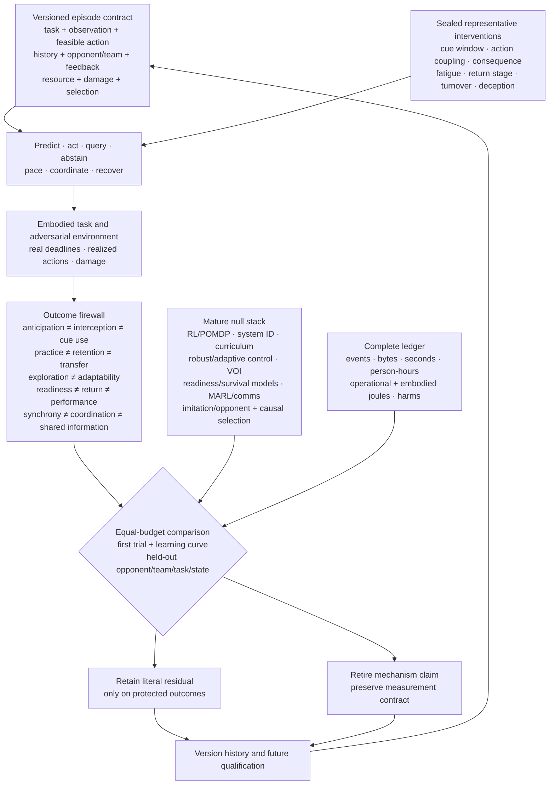

# Representative adaptive performance

## Scope

This chapter turns the [sports expertise, adaptive performance, and team
coordination audit](../research/audits/2026-08-05-sports-expertise-team-coordination.md)
into a system-wide performance contract. A result is interpretable only when
it travels with the information that was available, the actions that were
feasible, the history that produced the policy, the opponent and team it faced,
the feedback it received, its current resource and damage state, and the
selection process that determined which systems were observed.

The contract constrains:

1. sensing and observation provenance;
2. routing and allocation under deadlines;
3. action and closed-loop control;
4. memory of practice, opponents, damage, and recovery;
5. curriculum and online adaptation;
6. assurance, degradation, and staged return;
7. coordination and communication; and
8. population-level evaluation and lifecycle accounting.

It connects the [sensorimotor grounding chapter](20-sensorimotor-grounding.md),
[sparse predictive computation](30-sparse-predictive-compute.md),
[memory and consolidation](40-memory-and-consolidation.md),
[system synthesis](70-system-synthesis.md), and the
[energy model](80-energy-model.md). Its executable specification is
[Fixture F-006](../experiments/fixtures/006-representative-adaptive-performance.md),
with notation and derivations in the
[mathematical contract](../math/representative-adaptive-performance.md).

## Biological observation

### Perception is coupled to a possible response

Experts can extract predictive information from early opponent kinematics, but
the useful cue depends on the task, feature, opponent, prior, viewing window,
and response mode ([C-926](../research/claims.md#c-926)–[C-930](../research/claims.md#c-930)).
Predicting a label, moving a joystick, initiating a partial movement, and
intercepting a physical event under its real deadline are therefore different
experiments. Temporal or spatial occlusion can locate when or where information
becomes useful; it does not identify a unique representation.

Training transfers more reliably when relevant information and action coupling
are preserved, but “representative” is not synonymous with visually realistic
([C-931](../research/claims.md#c-931)–[C-932](../research/claims.md#c-932)).
Timing, feasible action, opponent response, consequence, and resource state can
matter even when surface appearance changes little.

### Practice is not one outcome

Practice variability can improve learning when it explores a relevant task
dimension at a useful challenge level; the effect is not universal, and larger
perturbations do not automatically help
([C-933](../research/claims.md#c-933)–[C-936](../research/claims.md#c-936)).
Accumulated practice correlates with expertise, yet amount, type, opportunity,
selection, survival, access, and retrospective classification are entangled
([C-937](../research/claims.md#c-937)–[C-939](../research/claims.md#c-939)).

This creates three separate questions:

1. Does performance improve while repetition, instruction, and feedback are
   present?
2. Does the change remain after a declared delay without that scaffold?
3. Does it survive a change in cue, opponent, body, task, rule, deadline, or
   resource state?

The answers are practice performance, delayed retention, and transfer. They
must not be substituted for one another.

### Performance follows a frontier, not a single score

Movement speed and accuracy trade off under task-specific conditions, and
throughput can appear stable while speed and error move in opposite directions
([C-940](../research/claims.md#c-940)–[C-941](../research/claims.md#c-941)).
Risk, physical work, latency, and recovery add further axes. Optimizing only
accuracy can hide slower action; optimizing only latency can hide errors or
unsafe events; optimizing only completed work can hide depletion.

Fatigue changes the state from which an action is controlled. Opponent
behavior, remaining work, feedback, recovery, and sleep can alter output, but
effects remain task- and outcome-specific
([C-942](../research/claims.md#c-942)–[C-948](../research/claims.md#c-948)).
Internal load, external load, readiness, damage, and injury risk are different
constructs. A workload ratio or a single measurement cannot certify an
individual system's safe capability
([C-949](../research/claims.md#c-949)–[C-950](../research/claims.md#c-950)).

### Recovery and return are staged and reversible

Return to participation, return to the full task, and sustainable recovery of
prior performance form a staged continuum. Time and functional evidence can
carry nonredundant information, while an apparently high function score can be
misleading after early return
([C-951](../research/claims.md#c-951)–[C-953](../research/claims.md#c-953)).
Each promotion exposes the recovering system to more load and therefore
creates new evidence. Deterioration must permit regression to a safer stage.

### Teams coordinate through information and adjustment

Joint practice can increase predictive knowledge, and shared displays can
change later team state. Yet synchrony is only an observable; similar movement
can follow common input without reciprocal coordination
([C-954](../research/claims.md#c-954)–[C-957](../research/claims.md#c-957)).
A coordination claim needs perturbation, lagged compensation, reduced task
error, turnover, and cross-play. A shared-information claim additionally needs
records of messages, observations, beliefs, and their discrepancies.

Deceptive behavior exploits an observer's cue policy. Expertise can reduce
some susceptibility without removing it, and confidence may rise while the
judgment becomes wrong
([C-958](../research/claims.md#c-958)–[C-960](../research/claims.md#c-960)).
Feedback effects are likewise conditional on content, timing, task, autonomy,
and whether the outcome is immediate performance or later learning
([C-961](../research/claims.md#c-961)–[C-962](../research/claims.md#c-962)).

### Selection changes the population it measures

Relative age, maturity, present capability, coaching access, playing time,
opponent quality, and later observation are coupled by selection. A talent
system can amplify early differences and then mistake the resulting population
for evidence that its original ranking was correct
([C-963](../research/claims.md#c-963)–[C-965](../research/claims.md#c-965)).
Excluded systems have missing counterfactual careers precisely because the
selection policy withheld the experience needed to produce them.

Finally, metabolic estimates and wearable estimates do not equal complete
system energy. Human attention, facilities, sensors, equipment, computation,
recovery, failed trials, maintenance, medical or safety work, and displaced
opportunity alter the efficiency comparison
([C-966](../research/claims.md#c-966)–[C-968](../research/claims.md#c-968)).
The transferable result is therefore an evaluation contract
([C-969](../research/claims.md#c-969)).

## Proposed AI translation

### Carry the state that makes a comparison valid

For agent $i$ in episode $e$, preserve

$$
\mathcal K_{i,e}=
(X_e,O_{i,e},A_{i,e},H_{i,e},M_e,F_{i,e},R_{i,e},D_{i,e},
G_{i,e},C_e,U_e,B_e),
$$

where:

- $X_e$ is physical state, task, rules, deadline, consequence, and hidden
  regime;
- $O_{i,e}$ is information actually received, including source, support,
  latency in seconds, occlusion, noise, loss, and calibration;
- $A_{i,e}$ is the feasible action set under the current body or actuator,
  equipment, authority, rate, range, and safety limits;
- $H_{i,e}$ is timestamped practice, feedback, opponent, teammate, damage,
  exclusion, reward, and opportunity history;
- $M_e$ is opponent and teammate composition, role, policy history, turnover,
  and communication topology;
- $F_{i,e}$ is feedback identity, information in bits, delay in seconds, and
  provider;
- $R_{i,e}$ is the resource and fatigue vector in its native units;
- $D_{i,e}$ is damage or fault state, diagnostic uncertainty, protected
  envelope, and return stage;
- $G_{i,e}$ is the selection and opportunity policy;
- $C_e$ is the intervention, paired control, counterfactual seed, and stopping
  rule;
- $U_e$ is the sampling unit, such as action, episode, agent, dyad, team, site,
  or cohort; and
- $B_e$ is the complete ceiling in events, bytes, seconds, person-hours,
  joules, damage, unsafe events, replacements, and opportunity.

For method $m$ and literal outcome $k$, the comparison target is

$$
Q_{m,k}(\mathcal K)=
\mathbb E\!\left[Y_k\mid do(m),\mathcal K\right],
$$

where $Y_k$ uses the registered unit for outcome $k$. If a baseline and a new
method receive different observations, actions, histories, opponents,
feedback, resources, or selection opportunities, $Q_{m,k}-Q_{b,k}$ does not
isolate method $m$ from baseline $b$.

### Treat representativeness as an inspectable vector

For training distribution $P_{\mathrm{tr}}$ and target distribution
$P_{\mathrm{te}}$, record

$$
\mathbf d_{\mathrm{rep}}=
(d_O,d_A,d_T,d_M,d_F,d_R,d_D,d_G),
$$

where the components compare actual observation $O$, feasible action $A$,
deadline and consequence $T$, teammate/opponent state $M$, feedback $F$,
resource state $R$, damage and return state $D$, and selection policy $G$.
Each $d_z$ is a declared divergence between the corresponding training and
target distributions: dimensionless for a statistical divergence or in the
declared ground-cost unit for optimal transport. The components remain visible;
one weighted “realism” number would conceal which relation transferred.

### Keep outcomes separate

| Outcome | Minimum evidence | Common false proxy |
| --- | --- | --- |
| anticipation | proper score by cue time and opponent; calibration; commitment latency | expert label or reaction time |
| physical interception | success, onset, trajectory, endpoint error, safety | video or joystick judgment |
| cue use | randomized removal, neutralization, conflict, or timing intervention | gaze or saliency |
| practice | acquisition curve by attempt and exposure time | end-of-practice score as retained learning |
| retention | delayed scaffold-free test | immediate post-practice score |
| transfer | first target trial and full source-to-target matrix | later target learning |
| exploration | action and outcome information, feasible coverage, later utility, cost | raw variance or entropy |
| adaptability | perturbation loss, recovery time, overshoot, recurrence, damage | stationary accuracy |
| pacing/readiness | output trajectory, state calibration, admissible actions, abstention | elapsed workload or one score |
| staged return | false promotion/withholding, dwell, recurrence, rollback, availability | calendar time or one test |
| coordination | perturbation-conditioned compensation, task stability, cross-play, repair | synchrony or proximity |
| shared information | messages, observations, predictive beliefs, discrepancies | similar behavior |
| deception | matched causal contrast, calibration, exploitability, regret, adaptation | confidence or surprise |
| talent prediction | prospective out-of-cohort calibration and counterfactual opportunity | current rank or selected-cohort accuracy |
| complete efficiency | protected outcomes plus all resource and harm axes | device energy or success/trial |

### Separate useful exploration from noise

For action variable $A$, reached-outcome variable $Z$, and method $m$, measure

$$
\mathcal X_m=
\left(H_m(A),H_m(Z),I_m(A;Z),K_m,Q^{\mathrm{tr}}_m,\mathbf C_m\right),
$$

where both entropies $H_m$ and mutual information $I_m$ are in bits, $K_m$ is
the dimensionless fraction of the registered feasible region covered,
$Q^{\mathrm{tr}}_m$ is later transfer in the task's literal unit, and
$\mathbf C_m$ is the complete cost vector. More action entropy is useful only
when it improves outcome information, transfer, or later task value at an
acceptable cost.

An adaptive curriculum therefore needs the initial skill and history stratum,
the perturbed task dimension, perturbation dose, retry cost, feedback bits,
criterion exposure, and delayed tests. This directly constrains
[Candidate 004](../experiments/candidates/004-closed-endogenous-curriculum.md)
and the memory boundary in the
[consolidation chapter](40-memory-and-consolidation.md).

### Route and act through resource-qualified state

The runtime policy should expose the state on which pacing and authority depend:

$$
a_t=\pi_m\!\left(o_{\le t},\widehat r_t,\widehat d_t,s_t,
\widehat\pi_{\mathrm{opp},t},\widehat b_{\mathrm{team},t},f_t\right),
$$

where $a_t$ is the commanded action or power target in its native unit,
$o_{\le t}$ is causally received observation history, $\widehat r_t$ is the
estimated resource/fatigue vector, $\widehat d_t$ the estimated damage state,
$s_t$ remaining work in metres, seconds, events, or joules,
$\widehat\pi_{\mathrm{opp},t}$ the opponent-policy estimate,
$\widehat b_{\mathrm{team},t}$ the teammate-state estimate, and $f_t$ available
feedback. Every estimate and channel receives a separate ablation.

This state conditions sensing, sparse routing, action authority, memory access,
and recovery. It sharpens [Candidate 002](../experiments/candidates/002-multiscale-context-broadcast.md),
[Candidate 006](../experiments/candidates/006-reversible-physical-skill.md),
[Candidate 007](../experiments/candidates/007-endogenous-observation-surveillance.md),
and [Candidate 012](../experiments/candidates/012-latency-qualified-authority.md).

### Compare a frontier, not a winner

For one task, retain

$$
\mathcal P_m=(T_m,\epsilon_m,p^{\mathrm{unsafe}}_m,
E^{\mathrm{life}}_m,H^{\mathrm{human}}_m),
$$

where $T_m$ is latency in seconds, $\epsilon_m$ task error in its declared
physical or task unit, $p^{\mathrm{unsafe}}_m$ dimensionless unsafe-event
probability, $E^{\mathrm{life}}_m$ lifecycle energy in joules, and
$H^{\mathrm{human}}_m$ role-stratified effort in person-hours. A method is more
efficient only through a preregistered utility or a Pareto improvement with
non-inferiority on protected outcomes.

### Make readiness an action envelope

At decision time $t$, admissible actions are

$$
\mathcal A^{\mathrm{ready}}_t(\alpha)=
\left\{a\in A_t:
\Pr(Z_{t:t+h}\in\mathcal Z_{\mathrm{safe}}\mid a,\mathcal I_t)
\ge 1-\alpha\right\},
$$

where $A_t$ is the currently feasible action set, $Z_{t:t+h}$ the multidomain
outcome vector over horizon $h$ in hours, $\mathcal Z_{\mathrm{safe}}$ the
registered safe envelope, $\mathcal I_t$ information available at time $t$,
and $\alpha$ the dimensionless tolerated risk. An empty envelope triggers
abstention or escalation.

Let $g_t\in\{0,1,2,3,4\}$ denote protected, modified, controlled, full-load,
and adversarial operation. Promotion requires the next stage's envelope; a
violation requires that $g_{t+1}<g_t$ remain possible. This turns staged return
into a concrete test for
[Candidate 009](../experiments/candidates/009-graded-assurance-envelopes.md)
rather than a one-time health classification.

### Distinguish coordination from shared input

For agent contributions $u_i(t)$ and $u_j(t)$, apply perturbation $do(\eta_i)$
to agent $i$ and estimate

$$
\Gamma_{ij}(\ell)=
\operatorname{Cov}\!\left(\Delta u_i(t),\Delta u_j(t+\ell)
\mid do(\eta_i),X_t\right),
$$

where lag $\ell$ is in seconds, $X_t$ is task state, $u_i$ and $u_j$ retain
their native contribution units, $\eta_i$ is a registered intervention in the
unit of $i$'s action or state, and $\Gamma_{ij}$ has the product unit of the
two contributions. A useful response must also reduce error in the protected
task variable without increasing risk. Teammate turnover, role reassignment,
message ablation, common-input controls, and never-co-trained cross-play
separate reciprocal adjustment from synchrony.

### Preserve selection and evaluator lineage

Population evaluation carries the policy that granted training, observation,
feedback, compute, role, and survival opportunity. Selected and rejected
systems remain in the analysis, with censoring and missing outcomes explicit.
Additional opportunity near selection thresholds is randomized when admissible
or handled with a declared causal design. This extends
[Candidate 019](../experiments/candidates/019-audited-cumulative-inheritance.md)
and the observation lineage in
[Candidate 014](../experiments/candidates/014-versioned-observation-contract.md).

Editable source:
[representative-resource-qualified-performance.mmd](../assets/diagrams/representative-resource-qualified-performance.mmd).

## Efficiency mechanism

The contract can improve efficiency through five measurable effects:

1. **Less proxy optimization.** Coupled perception/action tests prevent spending
   training and inference resources on a symbolic score that does not improve
   the physical or operational task.
2. **Higher-value variation.** History-qualified curricula direct perturbations
   toward task-relevant uncertainty instead of buying undirected entropy.
3. **Resource-aware allocation.** Routing, sensing, and authority respond to
   remaining work, fatigue, damage, opponent state, and recovery rather than
   treating every episode as fresh.
4. **Reversible exposure.** Staged return seeks a better
   availability--recurrence frontier than either permanent exclusion or an
   immediate full-load restart.
5. **Complete comparison.** Population selection, human effort, failure,
   recovery, and embodied resources are charged before a claimed saving is
   accepted.

Lifecycle energy for method $m$ is

$$
E^{\mathrm{life}}_m=
E^{\mathrm{train}}_m+E^{\mathrm{infer}}_m+E^{\mathrm{sense}}_m+
E^{\mathrm{act}}_m+E^{\mathrm{comm}}_m+E^{\mathrm{facility}}_m+
E^{\mathrm{recover}}_m+E^{\mathrm{maint}}_m+E^{\mathrm{emb}}_m,
$$

where every term is in joules under one declared service interval. The terms
are training, inference, sensing, actuation, communication, facility, recovery,
maintenance, and amortized embodied energy. Human design, demonstration,
coaching, labeling, tuning, monitoring, repair, safety, and medical effort are
reported separately in person-hours. A lower device-energy reading does not
establish a lifecycle saving.

## Evidence status

| Component | Evidence boundary | Architectural status |
| --- | --- | --- |
| early cue use and anticipation | task-, cue-, opponent-, and response-specific human studies; [C-926](../research/claims.md#c-926)–[C-930](../research/claims.md#c-930) | established scoped observations; transferable artificial mechanism unassigned |
| representative information/action coupling | transfer studies distinguish action coupling from visual similarity; [C-931](../research/claims.md#c-931)–[C-932](../research/claims.md#c-932) | plausible evaluation constraint |
| variability and practice | benefits depend on task dimension, dose, history, and outcome; [C-933](../research/claims.md#c-933)–[C-939](../research/claims.md#c-939) | established heterogeneity; adaptive curriculum residual speculative |
| speed--accuracy frontier | scoped task relations; [C-940](../research/claims.md#c-940)–[C-941](../research/claims.md#c-941) | established need for multi-axis reporting |
| fatigue, pacing, load, and readiness | outcome-specific interventions and measurement critiques; [C-942](../research/claims.md#c-942)–[C-950](../research/claims.md#c-950) | resource state is necessary metadata; learned controller untested |
| staged return | staged clinical framework and nonredundant criteria; [C-951](../research/claims.md#c-951)–[C-953](../research/claims.md#c-953) | plausible assurance translation; ordinary staged rollout remains the null |
| coordination and shared information | practice, shared display, synchrony, and coordination studies; [C-954](../research/claims.md#c-954)–[C-957](../research/claims.md#c-957) | perturbation and cross-play are evaluation requirements |
| deception and feedback | bounded effects under declared tasks; [C-958](../research/claims.md#c-958)–[C-962](../research/claims.md#c-962) | adversarial calibration requirement |
| selection bias and talent prediction | relative-age, maturity, and prospective-validity evidence; [C-963](../research/claims.md#c-963)–[C-965](../research/claims.md#c-965) | prospective causal evaluation requirement |
| complete efficiency | system-boundary and measurement evidence; [C-966](../research/claims.md#c-966)–[C-969](../research/claims.md#c-969) | required accounting contract; net advantage unknown |

The proposed composition remains a benchmark target until it beats the complete
ordinary stack in F-006. A complete stack includes calibrated prediction and
retrieval; model-free and model-based RL; POMDP/MPC; system identification;
domain randomization and curriculum; robust/adaptive control; value of
information and selective prediction; workload, readiness, survival, canary,
and rollback models; multi-agent control and explicit communication; imitation
and opponent models; and causal selection models.

## Speculative extensions

### Resource-conditioned sparse routing

Routing could condition on expected remaining work, resource uncertainty,
damage, and safe fallback rather than only token or task features. It must beat
a conventional estimator plus constrained control at equal sensing, compute,
reserve, and failure allowance.

### Retention-aware curriculum control

A curriculum controller could value a perturbation by delayed retention and
held-out transfer rather than practice loss. It must beat fixed augmentation,
domain randomization, active learning, Bayesian experimental design, novelty,
quality-diversity search, and automatic curriculum at equal attempt,
perturbation, feedback, evaluator, time, and energy budgets.

### Deception-calibrated opponent memory

Opponent memory could retain policy versions, cue conflicts, confidence,
change points, and abstention value. It must improve calibration and adaptation
on new deceptive opponents beyond Bayesian opponent models, fictitious play,
self-play, recurrent policies, retrieval, and conformal abstention.

### Turnover-resilient communication

Teams could compress communication after shared practice while retaining typed
repair, acknowledgements, and belief discrepancy when membership changes.
Lower message volume counts only if cross-play, repair latency, task quality,
and safety survive.

### Counterfactual development policies

Population management could compare selection with broad-development or
threshold-lottery policies and explicitly model opportunity-mediated outcomes.
It must predict later capability in new cohorts and recover false negatives
without hiding attrition or development cost.

## Failure modes

| Failure | Observable signature | Rejection or containment rule |
| --- | --- | --- |
| symbolic proxy win | label accuracy rises while interception, deadline, or safety does not | require coupled action and protected physical outcomes |
| realism scalar | transfer is attributed to a surface label without factorial manipulation | publish the representative-distance vector and causal source--target matrix |
| practice/learning substitution | end-of-practice score is reported as retention or transfer | freeze delayed tests and first target trial before updates |
| useless variability | action entropy rises without outcome information or later utility | retire the schedule or use the simpler fixed/null curriculum |
| state-blind pacing | policy depends on elapsed work and fails unseen resource pathways | compare with calibrated state estimation and constrained control |
| single-score readiness | one sensor or aggregate certifies broad capability | use action-specific calibrated envelopes with abstention |
| irreversible promotion | a damaged system cannot regress after deterioration | require monitored stage rollback and recurrence accounting |
| synchrony attribution | common-input correlation is called coordination | perturb one agent; require reciprocal compensation and lower task error |
| brittle team convention | co-trained teams work but turnover and cross-play fail | retain typed protocol, repair, and never-co-trained evaluation |
| deception overconfidence | confidence rises as calibration, regret, or safety worsens | add genuine/deceptive causal controls and calibrated abstention |
| selection self-fulfillment | selected systems receive more opportunity and later validate the selector | follow rejected units and estimate opportunity-mediated effects prospectively |
| survivor-only evaluation | dropout, failure, exclusion, or missing follow-up disappears | retain every assigned unit, censoring event, and stopping decision |
| budget leakage | human work, failed trials, recovery, facility, or embodied energy is omitted | withhold efficiency claim until the complete ledger closes |
| vocabulary-only residual | ordinary control, curriculum, or inference matches the result | keep the conventional mechanism and retire the added label |

## Measurable predictions

F-006 contains the full protocols and hard retirement rules. The chapter-level
commitments are:

| ID | Intervention and comparator | Measurements | Prediction and failure boundary |
| --- | --- | --- | --- |
| RAP-01 | cue-window/channel interventions versus calibrated sequence prediction, retrieval, Bayesian cue model, and POMDP | bits/event, calibration, commitment ms, endpoint m, unsafe events, J/event | residual must transfer to held-out deceptive opponents and full interception; a symbolic-only gain fails |
| RAP-02 | factorial information/action/deadline/consequence/resource changes versus domain randomization, system ID, robust optimization, curriculum, and equal-sample fine-tuning | complete source--target matrix, regret, calibration, adaptation samples, safety, lifecycle cost | a named factor must predict held-out transfer beyond distribution distance; “more realistic” alone fails |
| RAP-03 | history-qualified adaptive variability versus fixed schedules, augmentation, uncertainty-directed curriculum, and random search | practice curve, delayed retention, first-trial near/far transfer, information, failures, J/run | improve transfer at equal criterion exposure and perturbation dose; entropy without utility fails |
| RAP-04 | resource-aware pacing versus state-space readiness, system ID, MPC, robust/adaptive control, risk-sensitive RL, and fixed reserve | task value, output trajectory, state error, admissibility, recovery, recurrence, unsafe events, J | improve the frontier under unseen resource pathways; equality retains the ordinary estimator/controller |
| RAP-05 | reversible staged gate versus time-only, single-score, survival, canary, runtime-assurance, and hand-authored staged rollout | false promotion/withholding, dwell h, recurrence, rollback, availability, review person-hours, J | improve risk--availability on new fault classes and safely regress after deterioration |
| RAP-06 | perturbation and turnover test versus centralized/decentralized control, shared display, protocol, MARL, and common-input controller | task error, lagged compensation, belief bits/event, messages, repair s, cross-play, J | require useful reciprocal compensation and never-co-trained cross-play; synchrony alone fails |
| RAP-07 | deceptive-policy changes versus Bayesian opponent model, fictitious play, imitation, self-play, retrieval, robust and conformal prediction | opponent bits/action, calibration, exploitability, regret, abstention, adaptation s | improve calibrated adaptation at equal interactions, memory, search, and latency |
| RAP-08 | prospective selection policy versus adjusted regression, causal selection, survival, threshold lottery, and broad development | new-cohort calibration, capability, false-negative recovery, opportunity h, attrition, harm, person-hours, J | improve sustainable capability without manufacturing validity through unequal opportunity |
| RAP-09 | complete F-006 composition versus the strongest compatible conventional stack | all protected outcomes, events, steps, bytes, seconds, person-hours, lifecycle J, damage, withheld opportunity | require non-inferiority on protected outcomes and a preregistered Pareto resource gain across tasks, histories, opponents, states, sites, models, and hardware |

Mechanism ablations are selective: removing actual-channel state should damage
cue interventions; removing resource state should damage pacing and recovery;
removing reversible stages should damage recurrence or availability; removing
team-belief state should damage turnover and cross-play; removing selection
lineage should damage prospective calibration. If every ablation merely reduces
capacity and degrades every outcome, the proposed modules have not isolated
their claimed roles.
