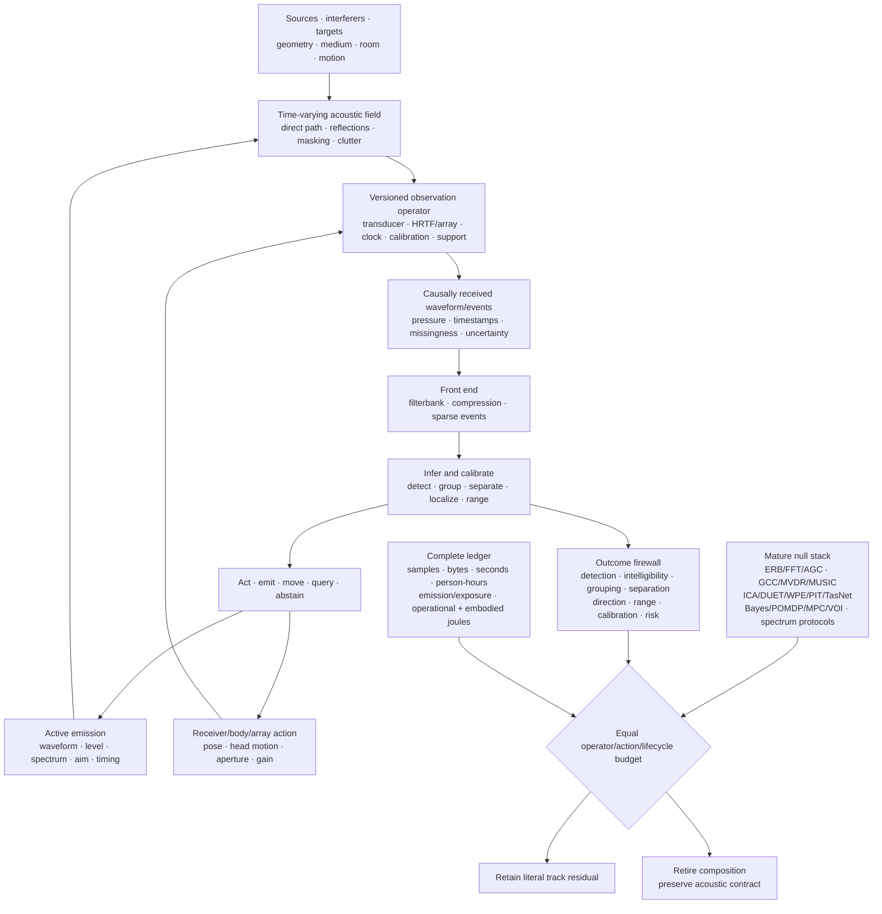

# Active acoustic inference

## Scope

Sound is not a ready-made sequence of objects. A receiver obtains pressure over
time through a medium, room, body, aperture, transducer, clock, calibration
state, and preprocessing chain. Sources overlap; direct paths mix with delayed
copies; motion changes the operator; an emitted probe changes both the evidence
and the physical scene. The system must therefore infer sources and task state
from a versioned, action-dependent measurement.

This chapter turns the [acoustics, hearing, and auditory-scene-analysis
audit](../research/audits/2026-08-05-acoustics-auditory-scene-analysis.md)
into an engineering contract. The detailed equations live in
[operator-qualified acoustic inference](../math/operator-qualified-acoustic-inference.md),
and [Fixture F-009](../experiments/fixtures/009-operator-qualified-active-acoustic-inference.md)
tests the contract across nine hostile tracks. The editable systems diagram is
kept in
[operator-qualified-active-acoustic-inference.mmd](../assets/diagrams/operator-qualified-active-acoustic-inference.mmd).

The chapter connects four existing parts of the project:

1. [sensorimotor grounding](20-sensorimotor-grounding.md), because head, body,
   receiver, and emitter actions change what can be known;
2. [operator-qualified sensing](24-operator-qualified-sensing.md), because
   acoustic inference is conditional on a physical forward operator;
3. [sparse predictive compute](30-sparse-predictive-compute.md), because
   multirate and event-driven representations can reduce traffic only under a
   complete task-and-energy test; and
4. the [energy model](80-energy-model.md), because sensing, emission, motion,
   communication, maintenance, and embodied hardware remain inside the service
   boundary.

The intended output is a calibrated decision, retained acoustic artifact, or
safe action—not one universal “hearing” score. Detection, discrimination,
intelligibility, grouping, separation, dereverberation, localization, ranging,
uncertainty, and lifecycle efficiency remain distinct outcomes.

## Biological observation

### The ear is a level-dependent, multirate measurement system

Acoustic level has meaning only with a reference pressure, frequency and time
weighting, integration interval, sensor position, calibration, and uncertainty
([C-1054](../research/claims.md#c-1054)). Room quantities likewise depend on a
declared procedure, frequency band, source-receiver geometry, and spatial and
temporal support ([C-1055](../research/claims.md#c-1055)). These constraints are
part of the biological stimulus, not bookkeeping added after a model runs.

The cochlea implements frequency-dependent mechanical filtering whose response
near characteristic frequency is compressively nonlinear. Outer-hair-cell
motility contributes causally to that amplification, while psychophysical
filter estimates depend on centre frequency and fitting assumptions
([C-1056](../research/claims.md#c-1056)–[C-1058](../research/claims.md#c-1058)).
Temporal coding also has regimes: envelope sensitivity is band-limited,
auditory-nerve phase locking degrades with frequency, and downstream circuitry
can sharpen synchrony in scoped low-frequency conditions
([C-1059](../research/claims.md#c-1059)–[C-1061](../research/claims.md#c-1061)).

“Cochlear,” “spiking,” and “neuromorphic” are therefore insufficient mechanism
descriptions. A transferable front end must state its filter shapes, bandwidths,
sample rates, level dependence, compression history, saturation, thresholds,
refractory periods, timestamp precision, and calibration state. FFT, wavelet,
mel, ERB, gammatone, gammachirp, modulation, and learned filters remain
competing implementations; cochlear-like filtering is already conventional
signal processing ([C-1095](../research/claims.md#c-1095)).

### Spatial hearing combines bounded cues with movement

Coincidence-sensitive circuits can encode interaural time differences, but the
useful cue changes with frequency content, head and pinna transfer functions,
room response, and source spectrum. Interaural level differences and spectral
cues contribute on different bands and geometries
([C-1062](../research/claims.md#c-1062)–[C-1063](../research/claims.md#c-1063)).
Head motion can disambiguate otherwise similar observations
([C-1064](../research/claims.md#c-1064)); it is an information-acquisition
action, not nuisance augmentation.

Early-arriving spatial information can dominate later copies, while spatial
separation can improve recognition under masking
([C-1065](../research/claims.md#c-1065)–[C-1066](../research/claims.md#c-1066)).
That does not make reverberation irrelevant. Stable spectrotemporal context and
prior room exposure can alter later judgments; monaural context can compensate
for some reverberant speech distortion; direct-to-reverberant energy contributes
to distance judgments ([C-1070](../research/claims.md#c-1070)–[C-1073](../research/claims.md#c-1073)).
The useful state therefore includes direct, early, and late components plus
their time-varying relation to source and receiver motion.

### Auditory objects are inferred under masking

Energetic masking concerns overlap at the receiver. Informational masking also
depends on whether target and masker are perceptually segregated, and selective
listening changes strongly with ear and source configuration
([C-1067](../research/claims.md#c-1067)–[C-1068](../research/claims.md#c-1068)).
Temporal coherence across frequency channels is a plausible grouping mechanism,
not a settled universal decomposition rule ([C-1069](../research/claims.md#c-1069)).

This makes four outcomes non-interchangeable:

- **detection:** whether task evidence is present;
- **grouping:** which events belong together and how uncertain that assignment
  is;
- **separation:** recovery of one or more waveforms under an explicit reference
  and permutation contract; and
- **causal identity:** which physical source produced a recovered component.

A separator can improve a waveform metric while switching identities, damaging
localization, or changing perceptually important structure. Published
separation metrics can hide severe waveform changes
([C-1094](../research/claims.md#c-1094)), so no one metric is allowed to stand in
for the scene.

### Sparse activity and efferent control have narrow causal interpretations

Awake auditory cortex can represent sounds with low population activity, and
sparse-coding objectives can learn cochlea-like kernels in some sound ensembles.
The learned code depends on the training ensemble
([C-1074](../research/claims.md#c-1074)–[C-1076](../research/claims.md#c-1076)).
Sparse activity is evidence about representation, not a direct measurement of
system joules. Sensors, clocks, memory traffic, event routing, decoding, idle
power, and training may dominate ([C-1097](../research/claims.md#c-1097)).

Efferent activation can causally reduce cochlear gain and improve masked-tone
auditory-nerve responses in the studied preparations
([C-1077](../research/claims.md#c-1077)). A general human speech-in-noise benefit
from medial olivocochlear strength remains disputed
([C-1078](../research/claims.md#c-1078)). An AI analogue earns the name only
when an intervention on task-conditioned front-end gain changes a registered
external endpoint after distortion, recovery time, calibration, and energy are
charged. An attention map or smaller hidden activation is not that evidence.

### Echolocation is active observation with physical consequences

Echolocators vary call timing with spatial task difficulty, adapt emission level
with distance, steer or reshape the acoustic field of view, and coordinate
head or pinna motion with emission
([C-1079](../research/claims.md#c-1079)–[C-1082](../research/claims.md#c-1082)).
Human experts can use self-generated echoes, but the demonstrated capability
includes extensive experience and neural reorganization
([C-1083](../research/claims.md#c-1083)). Spectral jamming avoidance in bats is
context-dependent rather than universal ([C-1084](../research/claims.md#c-1084)).

The transferable loop is emit, receive, infer, move or re-aim, and decide. Its
benefit is conditional on waveform ambiguity, target reflectivity, range,
clutter, association, other emitters, detectability, acoustic exposure, and
the energy required to produce and receive the probe
([C-1085](../research/claims.md#c-1085),
[C-1096](../research/claims.md#c-1096)).

## Proposed AI translation

### Preserve the episode, operator, and action identity

For episode $e$, retain the contract

$$
\mathcal A_e=(X_e,S_e,E_e,R_e,H_e,O_e,C_e,T_e,U_e,B_e),
$$

where:

| Symbol | Meaning and required units |
| --- | --- |
| $X_e$ | geometry and boundaries [m], medium, temperature [K], relative humidity [1], flow [m/s], occupancy, and time-varying material state |
| $S_e$ | target and interfering sources, waveforms [Pa], positions [m], velocities [m/s], directivity, identities, roles, and emission times [s] |
| $E_e$ | commanded and realized active emissions: waveform, spectrum [Hz], duration [s], aim [degree or rad], acoustic energy [J], and exposure |
| $R_e$ | receiver, body, and array pose; aperture [m]; morphology or manifold; transducer response; gain; health; saturation; and feasible motion |
| $H_e$ | prior exposure, room and source history, adaptation, training, feedback, previous actions, and their timestamps [s] |
| $O_e$ | versioned observation operator: impulse responses, sample rate [sample/s], precision [bit], clock, latency [s], preprocessing, support, and missingness |
| $C_e$ | calibration identity, reference pressure and distance, covariance, traceability, method, interval, and data vintage |
| $T_e$ | literal target construct, decision deadline [s], and registered loss or utility in its native unit |
| $U_e$ | independent waveform, event, source, room, receiver, body, array, device, site, or population unit |
| $B_e$ | componentwise limits on evidence, time, memory, communication, action, exposure, risk, human work, and lifecycle energy |

Calibration identity can become part of the learned task when a model depends on
device, room, or preprocessing state ([C-1098](../research/claims.md#c-1098)).
Train-test splits must group clean sources, convolved variants, neighboring
windows, impulse-response and renderer lineages, HRTF or array families,
devices, speakers or listeners, and derived labels. Capture time and receipt
time remain distinct, and only causally received observations may affect a
decision.

### Keep pressure, level, exposure, and energy separate

For pressure $p(t)$ in pascals over interval $T$ in seconds,

$$
p_{\mathrm{rms}}=
\sqrt{\frac{1}{T}\int_0^T p^2(t)\,dt},
\qquad
L_p=20\log_{10}\!\left(\frac{p_{\mathrm{rms}}}{p_0}\right),
$$

where $p_{\mathrm{rms}}$ is RMS pressure [Pa], reference pressure
$p_0=20\,\mu\mathrm{Pa}$ in air, and $L_p$ is sound-pressure level
[dB re $20\,\mu\mathrm{Pa}$]. Frequency weighting, time weighting, band,
position, orientation, and calibration must be explicit. Sound exposure
$\int p^2(t)dt$ has units $\mathrm{Pa^2\,s}$; it is not acoustic emission energy
[J], electrical energy [J], or a complete biological risk model.

For source pressure $x_s(t)$, received pressure $y_m(t)$, and noise $n_m(t)$,
all in pascals, use the time-varying mixture

$$
y_m(t)=\sum_{s=1}^{N_s}\int
h_{m,s}(t,\tau)x_s(t-\tau)\,d\tau+n_m(t),
$$

where $m$ is receiver-channel index [1], $s$ is source index [1], source count
$N_s$ is dimensionless, $t$ and delay $\tau$ are in seconds, and propagation
kernel $h_{m,s}(t,\tau)$ is in reciprocal seconds. A fixed convolution is only
a special case; moving sources, receivers, boundaries, media, and emitters make
the operator time-varying.

### Build a qualified multirate front end

The front end may combine:

1. an FFT, wavelet, constant-Q, mel, ERB, gammatone, gammachirp, modulation, or
   learned analysis bank;
2. level- and history-dependent compression with declared attack, release,
   saturation, and distortion;
3. masking and source-count hypotheses rather than a single global noise
   scalar;
4. dense samples or sparse onset, offset, change, phase, or threshold events
   with timestamp and refractory identity; and
5. a decoder or downstream task that is charged for reconstructing information
   discarded by the encoder.

Band selection and update rate should follow the causal time scales needed by
the task. Fine timing cannot be assumed above the supported band; weak sustained
signals and rare hazards cannot be discarded merely because an event count
falls.

### Fuse spatial evidence without erasing ambiguity

For path-length difference $\Delta r$ [m] and sound speed
$c_{\mathrm{snd}}$ [m/s], interchannel delay is

$$
\Delta t=\frac{\Delta r}{c_{\mathrm{snd}}},
$$

where $\Delta t$ is in seconds. For left and right RMS pressures $p_L,p_R$ [Pa],

$$
\mathrm{ILD}=20\log_{10}\!\left(\frac{p_L}{p_R}\right)
$$

is interaural level difference [dB]. Both cues are band-, source-, room-, body-,
and calibration-qualified. Spectral cues and head or receiver motion remain
separate intervention axes. A correlation surface under reverberation may be
multimodal; reducing it to one delay without calibrated uncertainty loses the
ambiguity the controller needs.

The learned path must be compared with generalized cross-correlation, matched
filtering, steered-response power, delay-and-sum, robust and minimum-variance
beamforming, MUSIC or ESPRIT, Bayesian delay estimation, and source tracking.
GCC, MVDR, and subspace localization are mature nulls, not discoveries created
by a biological label
([C-1086](../research/claims.md#c-1086)–[C-1088](../research/claims.md#c-1088)).

### Separate scene inference from metric substitution

Each output head declares one literal construct and uncertainty model. The
minimum firewall is:

| Construct | Required measurement | Invalid substitute |
| --- | --- | --- |
| detection | hit and false-alarm rates, criterion, calibration, and dimensionless $d'$ | recognition accuracy or mixture SNR |
| intelligibility or identification | confusion matrix and words, phonemes, or information units under a protocol | SI-SDR, loudness, or localization |
| grouping | event-to-source assignment, count, switch rate, ambiguity, and identity | separated waveform or attention weight |
| separation | SI-SDR plus waveform, perceptual, downstream-task, and identity measures | localization or intelligibility alone |
| dereverberation | direct, early, and late waveform/operator measures plus downstream effect | a “dry” label or one decay scalar |
| localization | azimuth and elevation error [degree], front-back error, coverage, and calibration | beam width, identity, or range |
| ranging | bias, absolute error, and interval coverage [m] | echo detection or direction |
| sparse timing | timestamp error [s], misses, false events, information, bytes, task value, and joules | event count or active fraction |
| active sensing | randomized emission or motion contrast, decision value, latency [s], detectability, exposure, risk, and energy [J] | action-success correlation |
| uncertainty | proper score, interval coverage, risk-coverage, and abstention value by held-out operator | confidence magnitude |

Independent-component methods, time-frequency sparsity methods, deep clustering,
permutation-invariant training, and time-domain separation are mature but
assumption-bound baselines
([C-1089](../research/claims.md#c-1089)–[C-1093](../research/claims.md#c-1093)).
The strongest compatible composition—not an isolated weak separator—is the
decisive null.

### Close the action loop

At decision time $t$, policy $\pi_q$ for method $q$ selects

$$
(a_t^{\mathrm{emit}},a_t^{\mathrm{body}},a_t^{\mathrm{sensor}},
a_t^{\mathrm{gain}},a_t^{\mathrm{task}})
=\pi_q(\mathcal H_t,\widehat X_t,\widehat O_t,
\widehat U_t,\mathcal A_t^{\mathrm{safe}},B_t),
$$

where $\mathcal H_t$ is causally received history, $\widehat X_t$ is estimated
scene state, $\widehat O_t$ is operator and calibration state,
$\widehat U_t$ is uncertainty, $\mathcal A_t^{\mathrm{safe}}$ is the feasible
action set, and $B_t$ is remaining componentwise budget. Emission actions set
waveform, spectrum [Hz], level [referenced dB], aim [degree or rad], and time [s];
body actions set pose and motion [m, rad, s]; sensor actions select aperture [m],
channels, and sample rate [sample/s]; gain is dimensionless or declared in dB;
the task action uses its native unit.

For monostatic echo emission and receipt times $t_{\mathrm{emit}}$ and
$t_{\mathrm{recv}}$ [s], nominal range is

$$
\widehat r=\frac{c_{\mathrm{snd}}}{2}
(t_{\mathrm{recv}}-t_{\mathrm{emit}}),
$$

where $\widehat r$ is range [m]. The interval must propagate clock error,
target motion, refraction, multipath, ringing, waveform ambiguity, association,
and detector threshold. Multiple emitters add collision, authentication,
fairness, adversarial imitation, and jamming state. The proposal must beat
TDMA, FDMA, CDMA, random access, listen-before-talk, power control, coded probes,
cancellation, authentication, and game-theoretic allocation at equal spectrum,
power, messages, and exposure.

### One system, tested against a complete null

Editable source:
[operator-qualified-active-acoustic-inference.mmd](../assets/diagrams/operator-qualified-active-acoustic-inference.mmd).

The contract is owned by existing components:

- [Candidate 002 — Multiscale context broadcast](../experiments/candidates/002-multiscale-context-broadcast.md)
  for multirate context;
- [Candidate 006 — Reversible physical skill](../experiments/candidates/006-reversible-physical-skill.md)
  for reusable analog or beamforming paths;
- [Candidate 007 — Endogenous observation surveillance](../experiments/candidates/007-endogenous-observation-surveillance.md)
  for action-dependent observation;
- [Candidate 009 — Graded assurance envelopes](../experiments/candidates/009-graded-assurance-envelopes.md)
  for calibration, uncertainty, exposure, and fallback;
- [Candidate 012 — Latency-qualified authority](../experiments/candidates/012-latency-qualified-authority.md)
  for travel time, evidence age, and decision authority; and
- [Candidate 014 — Versioned observation contract](../experiments/candidates/014-versioned-observation-contract.md)
  for operator and calibration identity.

## Efficiency mechanism

The proposed composition can improve efficiency through four literal pathways:

1. **Multirate analysis.** Slow envelopes and long context need not update at
   the rate required for fine timing. Savings must appear in samples, memory
   traffic, latency, and measured joules without degrading a protected band.
2. **Conditional events.** Onsets, offsets, changes, or uncertainty triggers can
   suppress redundant transport and downstream work. The decoder, timestamping,
   missed sustained signals, false events, and idle event hardware remain in
   the comparison.
3. **Selective physical action.** A head turn, receiver move, gain change, or
   acoustic probe can resolve an ambiguity more cheaply than processing another
   passive interval. Its motion, emission, exposure, delay, detectability, and
   interference costs must be lower than the decision value it creates.
4. **Reusable calibrated structure.** Stable filter, beamforming, correlation,
   or control paths can move to DSP, FPGA, ASIC, analog, or neuromorphic hardware
   when reuse amortizes conversion, characterization, drift monitoring, repair,
   and replacement.

For one registered service interval, lifecycle energy is

$$
E_q^{\mathrm{life}}=
E_q^{\mathrm{data}}+E_q^{\mathrm{train}}+E_q^{\mathrm{emit}}+
E_q^{\mathrm{sense}}+E_q^{\mathrm{infer}}+E_q^{\mathrm{move}}+
E_q^{\mathrm{comm}}+E_q^{\mathrm{store}}+E_q^{\mathrm{cal}}+
E_q^{\mathrm{maint}}+E_q^{\mathrm{emb}},
$$

where method $q$ has data-acquisition, training, acoustic-emission, sensing,
inference, motion, communication, storage, calibration, maintenance, and
amortized embodied-energy terms, each measured in joules over the same service
interval. The complete ledger also reports:

- pressure samples, sparse events, optimization steps, queries, and bytes;
- wall time [s], task latency [s], peak memory [byte], and network traffic
  [byte];
- acoustic exposure [$\mathrm{Pa^2\,s}$], unsafe-event count [1], and harm or
  detectability in a registered task-specific unit;
- emitted acoustic energy [J], electrical input [J], sensing [J], motion [J],
  compute [J], cooling [J], and facility allocation [J];
- recording, labeling, listening tests, calibration, tuning, monitoring,
  maintenance, and repair [person-hour]; and
- transducers, arrays, processors, actuators, replacements, wear, embodied
  hardware, and opportunity cost.

An arm that exceeds any binding budget is infeasible. Resources released by an
ablation remain unused. Lower event count, lower FLOPs, quieter emission, or a
faster accelerator is not an efficiency result unless accepted task service
improves on the complete protected vector.

## Evidence status

The stable claim ledger mirrors all 46 audit-local claims without promoting the
audit itself into evidence:

| Topic | Stable claims | Status | Consequence |
| --- | --- | --- | --- |
| calibrated acoustic and room measurement | [C-1054](../research/claims.md#c-1054)–[C-1055](../research/claims.md#c-1055) | established | reference, support, geometry, operator, and uncertainty are mandatory |
| cochlear mechanics, filters, timing, binaural cues, motion, precedence, masking, and selective listening | [C-1056](../research/claims.md#c-1056)–[C-1068](../research/claims.md#c-1068) | established | supplies scoped mechanisms and limits, not one front-end prescription |
| temporal coherence as a grouping mechanism | [C-1069](../research/claims.md#c-1069) | plausible | test against spatial, statistical, and learned grouping nulls |
| context, room adaptation, distance, and low population activity | [C-1070](../research/claims.md#c-1070)–[C-1074](../research/claims.md#c-1074) | established | motivates explicit context and sparsity tests while keeping outcomes separate |
| sparse coding learns cochlea-like kernels | [C-1075](../research/claims.md#c-1075) | plausible | representation result; no direct hardware-energy claim |
| ensemble dependence and causal efferent gain | [C-1076](../research/claims.md#c-1076)–[C-1077](../research/claims.md#c-1077) | established | qualify learned codes by data and test gain through intervention |
| general human speech-in-noise benefit from efferent strength | [C-1078](../research/claims.md#c-1078) | disputed | do not use as a broad task-benefit premise |
| adaptive biosonar, field steering, coordinated motion, and expert human echo use | [C-1079](../research/claims.md#c-1079)–[C-1083](../research/claims.md#c-1083) | established | motivates costed emission-reception-action loops |
| universal spectral jamming avoidance | [C-1084](../research/claims.md#c-1084) | disputed | use multi-emitter and adversarial controls rather than a universal law |
| waveform ambiguity and mature GCC, MVDR, MUSIC, ICA, sparse, deep, PIT, and time-domain separation nulls | [C-1085](../research/claims.md#c-1085)–[C-1093](../research/claims.md#c-1093) | established | compare with a complete competitive DSP and learned stack |
| metric failure, conventional cochlear-like DSP, and physical cost of active sensing | [C-1094](../research/claims.md#c-1094)–[C-1096](../research/claims.md#c-1096) | established | enforce the metric firewall and complete action ledger |
| sparse activity is not system energy; calibration identity can be learned task state | [C-1097](../research/claims.md#c-1097)–[C-1098](../research/claims.md#c-1098) | plausible | measure system energy and hold out operator versions |
| transferable residual is the operator- and action-qualified contract | [C-1099](../research/claims.md#c-1099) | speculative | preserve the benchmark; retire the composition if the mature null matches it |

No row establishes that the complete proposed system beats the conventional
stack. The evidence supports the physical constraints, biological phenomena,
and engineering nulls. The composition remains an experiment.

## Speculative extensions

### Operator-conditioned auditory state

Learn a compact state that jointly represents room response, body or array
transfer, clock uncertainty, source hypotheses, and front-end state. It must
predict held-out calibration probes and remain identifiable under scene changes.
Compare it with explicit system identification, adaptive filtering, room banks,
and Bayesian state-space models.

### Counterfactual acoustic action

Train the policy to predict not only what a probe or head turn might reveal but
also its exposure, detectability, collision, motion, and lifecycle cost. Use
paired simulator seeds and physical replay so action value is estimated against
the same latent scene, not easier episodes selected after acting.

### Cross-timescale front-end control

Let fast protection and compression, intermediate event routing, and slower
room or task adaptation share state without sharing unrestricted authority.
Test whether the joint controller beats independently tuned AGC, PCEN, adaptive
filters, selective prediction, and recurrent context after coordination cost.

### Population-qualified acoustic hardware

Route recurring transforms among digital, analog, array, and event-driven
front ends by measured device identity, calibration envelope, workload reuse,
and remaining service life. Hold out hardware classes, lots, transducers, and
array geometries. A nominal-device gain does not establish fleet-level benefit.

### Strategic multi-emitter sensing

Model emitters as cooperative, selfish, deceptive, imitating, colluding, or
turnover-prone agents. Joint waveform and scheduling policies must retain
source authentication and calibrated uncertainty under never-coordinated
population cross-play. Ordinary spectrum protocols remain the null.

## Failure modes

| Signature | Interpretation and required response |
| --- | --- |
| an unreferenced decibel value or unspecified integration interval drives the result | the stimulus and risk boundary are undefined; invalidate the comparison |
| train and test share a clean source, impulse response, renderer, HRTF, array family, device, or neighboring window | the result is an inverse crime or lineage leak; rebuild grouped splits |
| a fixed room convolution succeeds but moving-source, moving-receiver, or changing-boundary trials fail | the observation operator was misspecified; restrict the validity envelope |
| a cochlear label wins only against a weak mel front end | the mechanism was not isolated; restore FFT, wavelet, ERB, gammatone, learned, compression, and DSP nulls |
| sparse events lower active fraction but not bytes or joules | representation sparsity did not create system efficiency; retire the energy claim |
| event gating misses weak sustained signals, fine timing, or rare hazards | the threshold policy violates the protected outcome; retain a dense or hybrid path |
| localization collapses a multimodal GCC or beam surface to one confident point | estimator uncertainty is miscalibrated; preserve alternatives or abstain |
| apparent spatial super-resolution depends on source-count priors or training overlap outside aperture support | prior information is being reported as measured resolution; narrow the claim |
| SI-SDR rises while intelligibility, localization, identity, calibration, or downstream value worsens | metric optimization substituted for the task; fail the separation track |
| an efferent analogue changes gain or hidden activation without an external endpoint | no causal task benefit was demonstrated; remove the biological interpretation |
| active sensing wins only after extra samples, emission, exposure, motion, latency, or detectability | additional opportunity explains the result; match the full action ledger |
| echo range ignores clock drift, target motion, multipath, ringing, waveform ambiguity, or association | the interval is invalid; propagate those uncertainties or abstain |
| frequency shifting or timing changes fail against new emitters, collusion, authentication faults, or equal-power cross-play | the jamming policy is context-bound; retain conventional coordination |
| a learned path beats one beamformer or separator but not their strongest compatible composition | the baseline is incomplete; B7 in F-009 remains decisive |
| confidence fails in held-out rooms, bodies, arrays, clocks, calibration versions, sites, or hardware | the system learned operator identity without transferable calibration; restrict or retrain |
| an efficiency result omits recording, labels, calibration, failed trials, cooling, maintenance, replacement, or embodied hardware | the accounting boundary is incomplete; recompute the lifecycle result |

## Measurable predictions

The nine F-009 tracks convert the chapter into falsifiable predictions:

1. **Level-dependent front end.** A qualified nonlinear multirate front end
   improves registered detection or discrimination across held-out levels,
   bands, histories, sensors, and domains beyond the strongest fixed and learned
   filterbank-plus-compression stack at equal bytes, latency, and joules.
2. **Sparse timing.** Event encoding preserves protected timing, weak sustained
   sources, and rare hazards while reducing measured memory traffic and service
   energy beyond VAD, codecs, sparse convolution, and duty-cycled DSP.
3. **Active emission and reception.** Joint waveform, emission, and receiver
   action creates positive causal decision value after exposure, detectability,
   motion, interference, calibration, and lifecycle energy are charged.
4. **Localization under operator shift.** Calibrated direction and range remain
   better than GCC, Bayesian delay, SRP, MVDR, MUSIC, and tracking baselines on
   held-out HRTFs, arrays, bodies, apertures, rooms, spectra, faults, and clocks.
5. **Reverberation adaptation.** Context state improves literal waveform,
   intelligibility, event identity, distance, or calibration outcomes in new
   rooms beyond WPE, Wiener filtering, explicit operator estimation, and
   equal-sample adaptation without confusing compensation with recovery.
6. **Grouping and separation.** The model improves event-to-source grouping,
   source count, separation, causal identity, localization, uncertainty, and
   downstream value across new sources, rooms, counts, and cue conflicts beyond
   the complete ICA, IVA, DUET, NMF, WPE, PIT, deep-clustering, TasNet, and
   neural-beamforming stack.
7. **Efferent-like gain.** Randomized intervention on task-conditioned gain
   improves a protected external endpoint after distortion, false suppression,
   recovery, calibration, and energy are included; internal suppression alone
   predicts no pass.
8. **Multi-emitter interference.** Adaptive emission coordination improves
   ranging or detection, association, throughput, fairness, calibration, and
   exploitability under unseen cooperative and adversarial populations beyond
   mature spectrum-access and authentication protocols at equal power and
   messages.
9. **Complete lifecycle.** Any surviving benefit replicates across at least two
   source families, rooms or media, arrays or bodies, operator versions, scene
   types, model families, sites, and hardware classes after every acquisition,
   action, person-hour, risk, operational-energy, and embodied-energy term is
   charged.

Preregister protected outcomes, non-inferiority margins, material-improvement
thresholds, 95% intervals, multiplicity control, tail-failure ceilings, and
stopping rules. Randomize and analyze at the unit receiving the intervention;
adjacent samples and overlapping windows are not independent sources.

The hard decision is simple: if the complete conventional composition matches
the proposal at equal operator, action, calibration, uncertainty, exposure,
human-work, and lifecycle budgets—or if no ablation isolates value beyond that
stack—retire the architectural residual. Keep the measurement, operator,
action, metric, and accounting contract.
