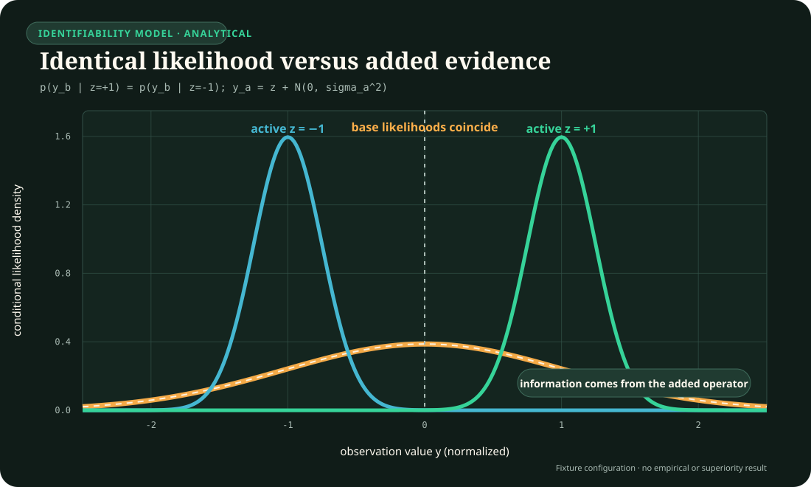

# Operator-qualified sensing and physical inference

## Scope

This chapter defines what an adaptive system is allowed to claim from a
physical measurement. A sensor does not deliver a scene, object, or fact. It
delivers a finite observation produced by an aperture, illumination pattern,
medium, detector, clock, calibration state, acquisition policy, and noise
process. Inference adds assumptions and prior information.

The architectural consequence is precise: decoded tensors may be convenient
runtime inputs, but they are not self-describing evidence. The system must keep
enough of the measurement operator, uncertainty, validity envelope, and
lineage to know what the observation could resolve, what it could not resolve,
and when another measurement is worth buying.

This chapter is operationalized by:

1. the [optics, photonics, and inverse-sensing
   audit](../research/audits/2026-08-05-optics-photonics-inverse-sensing.md);
2. the [operator-qualified optical-inference
   mathematics](../math/operator-qualified-optical-inference.md); and
3. [Fixture F-007](../experiments/fixtures/007-operator-qualified-optical-inference.md),
   which tests the full contract against inverse-method, active-sensing,
   calibration, control, digital-accelerator, and passive-optics baselines.

## Biological observation

Biological sensing is already physical inference. An eye has finite aperture,
spectral sensitivity, sampling density, integration time, dynamic range, blind
regions, motion, adaptation, and a body that can change viewpoint. A useful
percept can therefore depend on both received evidence and prior structure.
Movement can reveal a surface that one view leaves ambiguous; longer exposure
can buy photons while losing temporal resolution; adaptation can extend useful
operation while changing the response function.

The transferable observation is not a particular visual anatomy. It is the
closed coupling among:

- a bounded physical measurement channel;
- an internal estimate that remains conditional on that channel;
- actions that change future observability;
- calibration and adaptation over multiple timescales; and
- task-specific decisions made before every latent detail is known.

Optics makes those constraints measurable. Finite apertures, null spaces,
photon statistics, ambiguity classes, saturation, and drift are established
properties of physical sensing ([C-970](../research/claims.md#c-970)–[C-988](../research/claims.md#c-988)).
They prevent a fluent reconstruction from silently becoming stronger evidence
than the acquisition supplied.

## Proposed AI translation

### Preserve the evidence-producing operator

For latent physical state $x_e$ in episode $e$, let acquisition $t$ produce

$$
y_{e,t}=g_{e,t}\!\left(\mathcal H_{\nu_{e,t}}
(a_{e,t},c_{e,t})x_e\right)+n_{e,t},
$$

where:

- $y_{e,t}$ is the raw observation in detector counts [count] or another
  declared sensor unit;
- $a_{e,t}$ is the acquisition action, such as viewpoint, exposure, wavelength,
  or illumination pattern;
- $c_{e,t}$ is the calibrated parameter vector in declared native units;
- $\nu_{e,t}$ is the immutable operator-version identifier;
- $\mathcal H_{\nu_{e,t}}$ is the physical forward operator;
- $g_{e,t}$ is detector conversion, clipping, and readout response; and
- $n_{e,t}$ is only the residual noise represented by an explicit likelihood.

The observation record travels with operator version, calibration covariance,
saturation/dead-time mask, capture and receipt times, preprocessing lineage,
and validity envelope. A compact representation can replace the raw record
only for a registered family of future queries and only while reconstruction,
uncertainty, and provenance obligations remain satisfied. This connects the
[versioned observation contract](../experiments/candidates/014-versioned-observation-contract.md),
[semantic compaction](../experiments/candidates/017-contract-preserving-semantic-compaction.md),
and [value-aware retention](../experiments/candidates/018-value-reconstructability-aware-tiering.md).

### Separate measured information from prior-supported reconstruction

For a linearized operator $H=U\Sigma V^*$, a component along $v_j$ with
singular value $\sigma_j=0$ lies in the measurement null space. A decoder may
still propose a plausible value for that component, but the value comes from a
prior, another measurement, or a convention—not from this observation.

Every output therefore carries three distinguishable uncertainty sources:

| Source | What varies | Appropriate response |
| --- | --- | --- |
| measurement noise | photon arrivals, read noise, background, quantization | propagate the likelihood; change exposure or sensor when valuable |
| operator uncertainty | calibration, alignment, drift, response, timing | monitor residuals; recalibrate, downgrade, reroute, or abstain |
| prior or model uncertainty | training support, regularizer, latent family, task shift | expose support dependence; acquire discriminating evidence or retain alternatives |

The separation matters under compressed sensing, phase retrieval,
computational super-resolution, blind calibration, and learned reconstruction
([C-972](../research/claims.md#c-972), [C-976](../research/claims.md#c-976)–[C-981](../research/claims.md#c-981),
[C-985](../research/claims.md#c-985)). Pixel count, sharpness, or confidence
cannot substitute for newly identified physical information.

The existing Fixture F-007 likelihood plot makes that distinction explicit.
It is an analytical identifiability example, not an empirical superiority
result.

### Buy another measurement only when it changes the decision frontier

Let $b_t$ be the current belief, $a$ a safe acquisition action, $d$ a downstream
decision, and $U(d,\theta)$ task utility for uncertain state $\theta$. The
expected value of information is

$$
\operatorname{EVI}(a\mid b_t)=
\mathbb E_y\!\left[
\max_d\mathbb E[U(d,\theta)\mid b_t,a,y]
\right]
-
\max_d\mathbb E[U(d,\theta)\mid b_t].
$$

No scalar acquisition price is assumed. The controller compares EVI against a
cost vector containing at least photons [count], energy [J], latency [s], dose
or disturbance in its task-specific unit, actuator wear [cycles], and risk on
a declared scale. An action is admissible only inside its safety and authority
envelope.

This converts active perception from “collect more data” into a resource
allocation problem. The active path must beat fixed acquisition, greedy value
of information, Bayesian experiment design, POMDP planning, and model-predictive
control at equal opportunity and cost ([C-975](../research/claims.md#c-975)).

### Monitor validity instead of trusting calibration indefinitely

Calibration is versioned state, not a one-time property of a device. Reference
channels and task-independent residuals monitor alignment, gain, timing,
temperature, background, saturation, and component aging. A threshold crossing
does not identify the cause; it changes what action is permitted.

A validity transition can trigger, in order:

1. a qualified reduction in confidence or supported query set;
2. a new reference or calibration acquisition;
3. rerouting to a different sensor or computational path;
4. a digital or conservative fallback;
5. reset, repair, or replacement; and
6. abstention when none of those paths restores the evidence contract.

Blind self-calibration is tested for identifiability, and task residuals are not
allowed to conflate scene shift with device drift ([C-984](../research/claims.md#c-984)–[C-989](../research/claims.md#c-989)).

### Route a transform to the substrate that actually makes it cheap

Passive and active optical hardware can execute physically matched linear
transforms, sometimes before an observation becomes a large digital tensor.
That is valuable when the input is already optical, the transform is reusable,
conversion can be avoided, and required precision fits the device envelope.

It is not a general preference for an optical path. The route record declares:

- input locality and format;
- transform identity, reuse count, sparsity, and required precision;
- source, modulator, detector, ADC/DAC, control, thermal, and host work;
- device-specific calibration, mismatch, yield, drift, and age;
- accepted-output latency and quality; and
- fallback and migration cost.

Routing then compares passive optics, a photonic core, a digital accelerator,
and hybrid compositions on the same workload and service boundary. Optical
propagation is credited only for work it actually displaces
([C-989](../research/claims.md#c-989)–[C-999](../research/claims.md#c-999)).

### One closed contract

```mermaid
flowchart LR
    world["Hidden physical state<br/>scene · phase · spectrum · dynamics"] --> operator["Versioned measurement operator<br/>aperture · illumination · optics · detector · calibration"]
    action["Costed sensing action<br/>pattern · angle · wavelength · exposure"] --> operator
    regime["Hidden regime<br/>photon flux · background · drift · temperature · saturation"] --> operator
    operator --> raw["Raw observation + metadata<br/>counts · timestamps · masks · covariance · operator version"]
    raw --> ambiguity["Physical limits<br/>diffraction · shot noise · null space · phase ambiguity"]
    ambiguity --> reconstruct["Qualified inference<br/>inverse method · prior · uncertainty · abstention"]
    reconstruct --> query{"More information worth its cost?"}
    query -->|"yes, safe"| action
    query -->|"no"| decide["Decision or retained artifact"]
    monitor["Reference channel + residual monitor<br/>drift · alignment · gain · thermal state"] --> operator
    monitor --> gate{"Inside validity envelope?"}
    gate -->|"no"| recover["Recalibrate · reroute · digital fallback · reset"]
    recover --> operator
    route["Operator-qualified route<br/>passive optics · photonic core · digital accelerator"] --> transform["Physical or digital transform"]
    raw --> route
    transform --> reconstruct
    compact["Query-registered compaction<br/>raw · calibrated sufficient state · task output"] --> decide
    raw --> compact
    nulls["Mature null stack<br/>inverse methods · uncertainty · phase retrieval · compressed sensing<br/>computational imaging · AO/control · digital accelerators · passive optics"] --> compare{"Matched information + hardware + lifecycle budget"}
    decide --> firewall["Separate outcome firewall<br/>aperture · photons · phase · priors · drift · saturation · fusion<br/>transform · conversion · analog error · fabrication · safety · lifecycle"]
    ledger["Complete ledger<br/>samples · photons · dose · bytes · seconds · person-hours · joules"] --> compare
    fabrication["Device population<br/>yield · mismatch · trimming · thermal control · aging"] --> route
    firewall --> compare
    compare --> verdict["Retain measured residual<br/>or retire the composition"]
```

Editable source:
[operator-qualified-physical-inference.mmd](../assets/diagrams/operator-qualified-physical-inference.mmd).

## Efficiency mechanism

The contract permits four efficiency gains, each with a matching way to fail:

1. **Acquire selectively.** Spend photons, time, and motion only where another
   observation changes an accepted decision. It fails when the acquisition
   controller costs more than fixed sensing or shifts risk outside the ledger.
2. **Transform before expansion.** Use a physical operator to filter, aggregate,
   or project local optical information before high-volume digital movement. It
   fails when conversion, source, control, or recalibration erases the saving.
3. **Retain the sufficient level.** Store raw evidence, calibrated sufficient
   state, or task output according to registered future queries and recovery
   obligations. It fails when later queries expose discarded information.
4. **Route by validity and reuse.** Amortize a stable transform on hardware that
   suits its precision and repetition. It fails under workload shift,
   fabrication spread, thermal control, low utilization, or short lifetime.

For each accepted service unit,

$$
E_{\mathrm{service}}=
E_{\mathrm{source}}+E_{\mathrm{mod}}+E_{\mathrm{prop}}+
E_{\mathrm{detect}}+E_{\mathrm{ADC}}+E_{\mathrm{DAC}}+
E_{\mathrm{control}}+E_{\mathrm{digital}}+E_{\mathrm{thermal}}+
E_{\mathrm{facility}}+E_{\mathrm{embodied}},
$$

where every $E$ term is energy [J] measured over the same accepted-output
boundary. Embodied energy includes fabrication, packaging, yield loss,
replacement, and end-of-life treatment amortized over accepted lifetime
service. The comparison also reports quality, calibration, latency, risk,
photons, bytes moved, and human maintenance effort; joules alone cannot hide a
worse sensing contract.

## Evidence status

| Ingredient | Stable claims | Status and architectural use |
| --- | --- | --- |
| operator, aperture, null space, photon and precision limits | [C-970](../research/claims.md#c-970)–[C-974](../research/claims.md#c-974) | established physical constraints; mandatory measurement metadata |
| active illumination and structural priors | [C-975](../research/claims.md#c-975)–[C-980](../research/claims.md#c-980) | established scoped mechanisms; advantage remains task- and prior-qualified |
| multiplexing, coded acquisition, and adaptive correction | [C-981](../research/claims.md#c-981)–[C-984](../research/claims.md#c-984) | established tradeoffs; sensorless objective validity remains plausible |
| blind calibration, drift, saturation, and fusion | [C-985](../research/claims.md#c-985)–[C-988](../research/claims.md#c-988) | established constraints on identifiability and valid combination |
| physical transforms and avoided conversion | [C-989](../research/claims.md#c-989)–[C-990](../research/claims.md#c-990) | physical execution established; end-to-end benefit workload-dependent |
| system energy, conversion, and analog error | [C-991](../research/claims.md#c-991)–[C-993](../research/claims.md#c-993) | system-boundary constraints established; core-only efficiency claims disputed |
| fabrication, thermal control, and in-situ adaptation | [C-994](../research/claims.md#c-994)–[C-996](../research/claims.md#c-996) | variation and thermal cost established; recoverable mismatch is scoped |
| labels, routing, uncertainty, and lifecycle ranking | [C-997](../research/claims.md#c-997)–[C-1001](../research/claims.md#c-1001) | neuromorphic-label inference disputed; routing and uncertainty composition plausible; scoped lifecycle reversal established |

The sources support the constraints and component mechanisms. They do not yet
show that their full composition improves this project's quality–risk–latency–
energy frontier. F-007 is therefore a hostile fixture, not an architecture
promotion.

## Speculative extensions

### Learned operator compaction

Learn the smallest operator state that preserves a registered family of
likelihoods, counterfactual acquisitions, and calibration decisions. Compare it
with explicit metadata, sufficient-statistic storage, low-rank calibration,
and recomputation from raw evidence. A compact state that cannot answer a new
registered query is rejected.

### Joint query, sensor, and substrate routing

Let one controller decide whether to answer from retained state, acquire a new
physical observation, or move the transform to another substrate. The claim is
interesting only if joint control beats three separately optimized controllers
after coordination and monitoring cost.

### Population-calibrated physical modules

Treat fabrication variation as measured device identity rather than nominal
noise. Assign workloads by the calibrated envelope of each device, then test
whether characterization, placement, spares, and migration work less than
trimming every device to one specification.

### Future-query-aware sensing

Choose acquisitions that serve both the immediate decision and declared future
queries. This could favor a slightly more expensive measurement now if it
prevents reacquisition or unsafe inference later. The future-query distribution
must be registered before results are inspected.

## Failure modes

| Signature | Interpretation and required response |
| --- | --- |
| sharper reconstructions appear without improved held-out physical decisions or calibration | the prior changed appearance, not measured information; narrow the claim |
| null-space pairs receive confident different answers from the same observation | the decoder hides prior selection; expose alternatives or abstain |
| active sensing wins only with more photons, time, dose, or actuator work | extra opportunity explains the result; match the acquisition ledger |
| a multiplex advantage disappears when the dominant noise source changes | the result is regime-specific; retain the crossover, not a universal rule |
| drift monitoring reacts to scene shift or misses reference-channel failure | the validity detector is not identifiable; add controls or conservative fallback |
| fused confidence improves while shared calibration error remains unmodelled | covariance was double-counted; use robust fusion or keep sensors separate |
| an optical path wins on core propagation but loses sensor-to-decision energy | conversion, control, or movement dominates; retain the digital baseline |
| nominal-device accuracy hides die, package, temperature, and age spread | the hardware claim is not population-valid; stratify devices and lifetime |
| in-situ adaptation consumes unreported training measurements or human tuning | calibration work is omitted; charge it to deployment |
| compact storage answers current tasks but prevents a registered later query | compaction violated the preservation contract; retain raw or richer state |
| one scalar efficiency score hides worse risk, calibration, or maintenance | report the Pareto vector; do not average protected outcomes away |

## Measurable predictions

1. **Null-space honesty.** On paired physical states that share an observation
   under the tested operator, an operator-aware system will retain ambiguity or
   abstain more accurately than a tensor-only decoder without reducing
   identifiable-task performance.
2. **Prior-shift qualification.** Under held-out scene structure, operator-aware
   uncertainty will predict super-resolution and compressed-recovery failure
   better than confidence from the reconstruction model alone.
3. **Costed active acquisition.** At equal photons, dose, latency, action count,
   risk, and joules, active selection will improve accepted task utility beyond
   fixed acquisition and one-step EVI—or the learned acquisition mechanism is
   retired.
4. **Noise-regime crossover.** Multiplexed and focused acquisition will exchange
   rank at a reproducible noise boundary predicted before the confirmatory run.
5. **Drift-aware recovery.** Versioned monitoring will reduce invalid confident
   outputs and recovery time under hidden alignment, gain, timing, and thermal
   changes beyond periodic calibration at equal reference and maintenance cost.
6. **Heterogeneous crossover.** A physical path will improve end-to-end accepted
   outputs per joule only in preregistered regions of transform reuse, precision,
   input locality, utilization, and device validity; digital routing will win
   outside them.
7. **Device-population validity.** Routing by measured device envelope will
   improve yield-adjusted lifetime service beyond nominal routing and uniform
   trimming after characterization, migration, spare, and control costs.
8. **Query-preserving compaction.** A query-registered retained state will use
   fewer stored bytes and lifecycle joules than raw retention while meeting
   every registered reconstruction, uncertainty, provenance, and recalibration
   tolerance.

All predictions are evaluated through
[F-007](../experiments/fixtures/007-operator-qualified-optical-inference.md).
A positive result remains bounded to its measurement operator, physical regime,
query set, hardware population, workload, and lifecycle boundary.
