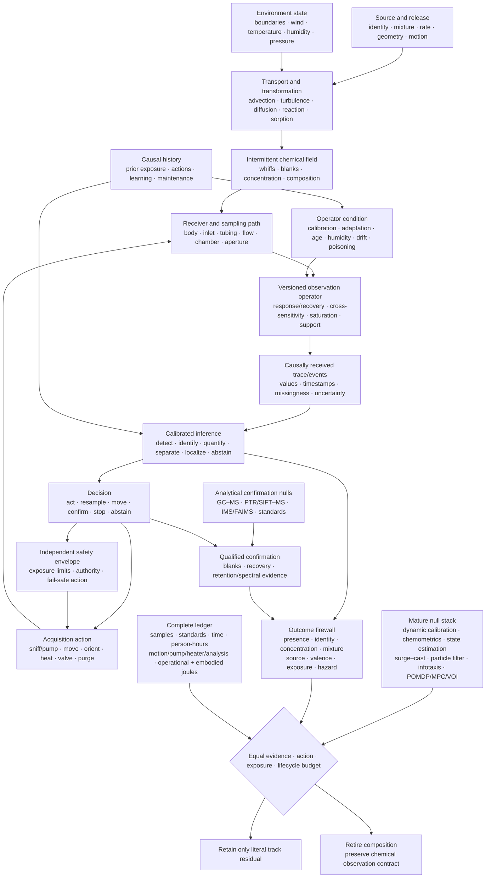

# Active chemical sensing

## Scope

A chemical sensor does not receive an odor, analyte identity, source, or hazard.
It receives a time-dependent response produced jointly by source release,
transport, reaction, surfaces, the receiver's path, the sampling action, the
inlet and chamber, sensor chemistry, temperature, humidity, calibration,
adaptation, ageing, contamination, and previous exposure. In a turbulent plume,
even the material reaching the receiver arrives as intermittent whiffs and
blanks rather than a smooth pointer to its source.

This chapter turns the [olfaction, chemical sensing, and plume-tracking
audit](../research/audits/2026-08-05-olfaction-chemical-sensing-plume-tracking.md)
into readable architecture. The detailed definitions live in
[operator-qualified chemical-sensing mathematics](../math/operator-qualified-chemical-sensing.md),
and [Fixture F-011](../experiments/fixtures/011-operator-qualified-active-chemical-sensing.md)
tests the architecture across fourteen hostile tracks. The editable diagram is
kept in
[operator-qualified-active-chemical-sensing.mmd](../assets/diagrams/operator-qualified-active-chemical-sensing.mmd).

The chapter connects existing project components rather than adding another
principle or candidate:

1. [sensorimotor grounding](20-sensorimotor-grounding.md), because sniffing,
   pumping, orientation, locomotion, and receiver geometry change the evidence;
2. [operator-qualified sensing](24-operator-qualified-sensing.md), because every
   chemical result remains conditional on a physical forward operator;
3. [sparse predictive compute](30-sparse-predictive-compute.md), because temporal
   events and sparse representations earn efficiency credit only through total
   task work and measured energy;
4. [memory and consolidation](40-memory-and-consolidation.md), because fast
   adaptation, learned associations, slow calibration, drift, and maintenance
   occupy different state and update timescales;
5. [reliability under mission profiles](26-reliability-under-mission-profiles.md),
   because humidity, contamination, ageing, poisoning, replacement, and
   out-of-support operation change the device rather than merely the data; and
6. the [energy model](80-energy-model.md), because motion, pumps, heaters,
   preconcentration, chromatography, vacuum/ionization, calibration gases,
   consumables, maintenance, human work, and embodied devices remain inside the
   service boundary.

The intended output is a calibrated decision, qualified retained observation,
safe action, or abstention. Presence, molecular identity, perceptual odor
identity, concentration, mixture composition, direction, source position,
source attribution, intensity, valence, hazard, exposure, and absorbed dose are
different outcomes. One may help predict another; none may silently replace it.

The evidence range for this chapter is [C-1152](../research/claims.md#c-1152)–[C-1203](../research/claims.md#c-1203):
50 claims are `established` within their stated experiments or authoritative
methods, [C-1188](../research/claims.md#c-1188) is `plausible`, and
[C-1192](../research/claims.md#c-1192) is `disputed`. Those statuses qualify the
claim boundaries; they are not votes for the architecture.

## Biological observation

### Receptor populations provide coverage, not self-describing identities

Mammalian olfaction begins with a large receptor family. Within the receptor
panel and odorants studied, individual receptors responded to multiple
odorants, individual odorants recruited multiple receptors, and the population
pattern changed with concentration
([C-1152](../research/claims.md#c-1152)–[C-1154](../research/claims.md#c-1154)).
This supports a distributed measurement basis. It does not supply a universal
odor code, open-world chemical coverage, or concentration-independent token.

Chemosensation itself is not one architecture. Manipulations of mammalian sweet
and umami pathways provide a scoped dedicated-cell counterexample
([C-1155](../research/claims.md#c-1155)). A receptor-like array must therefore
state which chemicals and concentrations it can distinguish, where responses
overlap, and which outcomes require another channel. “Combinatorial,”
“labelled-line,” or “olfactory” is a description of evidence organization, not
an implementation credit.

### Bulb and cortex transform concentration, gain, and timing

Divisive normalization in the studied fly antennal lobe scaled projection-neuron
responses with pooled receptor activity. Mouse olfactory-bulb and piriform
measurements show transformations that can make identity representations more
tolerant to concentration, while still preserving useful intensity or
concentration-change information in other activity
([C-1156](../research/claims.md#c-1156)–[C-1162](../research/claims.md#c-1162)).

Three constraints follow:

1. concentration tolerance is an outcome to measure, not an invariant built
   into an anatomical label;
2. suppressing absolute level can damage leak, dose, or safety tasks even when
   identity improves; and
3. pooled inhibition and recurrence must compete with robust scaling, explicit
   gain-state estimation, concentration-conditioned inference, and ordinary
   recurrent models at equal latency and energy.

Receptor adaptation includes causal calcium-dependent feedback, receptor
current and spike output can span different concentration ranges, and
habituation depends on duration, interval, and odor similarity
([C-1163](../research/claims.md#c-1163)–[C-1166](../research/claims.md#c-1166)).
Receptor adaptation, behavioral habituation, short-term sensor recovery,
calibration drift, and irreversible poisoning must remain separate states.

### Sniffing is part of the observation operator

Rats can alter sniff rate rapidly during discrimination; changing sniffing
changes the peripheral-to-bulb filter; early inhalation-locked activity can
carry information quickly; and mice can use millisecond-scale sniff-phase
differences under scoped protocols
([C-1167](../research/claims.md#c-1167)–[C-1171](../research/claims.md#c-1171)).
That timing cannot recover fluctuations already removed by tubing, a chamber,
or a slow sensor. End-to-end bandwidth, capture and receipt time, and the
realized sampling waveform set the usable support.

Spatial acquisition is also regime-dependent. Serial sampling sufficed in one
mouse gradient task, while bilateral temporal correlation supplied odor-motion
information in a fly preparation
([C-1172](../research/claims.md#c-1172)–[C-1173](../research/claims.md#c-1173)).
Neither result establishes universal stereo or universal serial sampling. Body
size, receptor spacing, movement, wind, range, plume intermittency, and sensor
bandwidth decide which comparison is informative.

### Turbulent plumes turn localization into inference under intermittent evidence

Theory tested against simulation, laboratory, and field observations describes
structured whiff and blank statistics rather than a smooth instantaneous
gradient. Fine plume structure requires fast ground truth; field gaps change
with environment; and several intuitive burst summaries converge too slowly or
vary too weakly to guide short-horizon search reliably
([C-1174](../research/claims.md#c-1174)–[C-1177](../research/claims.md#c-1177)).

Animals demonstrate multiple bounded strategies. Moths can surge after odor
contact and cast after loss. Walking flies use distinct odor-ON, odor-OFF, and
wind transforms, and in irregular plumes their stochastic turns and walk/stop
decisions depend on encounter timing rather than continuous steering
([C-1178](../research/claims.md#c-1178)–[C-1180](../research/claims.md#c-1180)).
Contact-correlated slowing in mice is an observation, not proof that slowing is
optimal ([C-1181](../research/claims.md#c-1181)).

Robotics already supplies strong nulls. Infotaxis, gas-plus-wind localization,
transient processing for slow metal-oxide sensors, reactive off-zigzag search,
geometry-aware modular policies, and particle-filter source belief have all
been demonstrated in scoped settings
([C-1182](../research/claims.md#c-1182)–[C-1187](../research/claims.md#c-1187)).
Compact temporal-memory reinforcement learning is only `plausible` for the
studied simulated plumes until unchanged embodied transfer is shown
([C-1188](../research/claims.md#c-1188)).

### Sparse piriform activity is not a hardware or energy conclusion

Piriform odor responses can be sparse and distributed rather than neatly
topographic; in one rat task, burst-count population information outperformed
some precise-pattern accounts
([C-1189](../research/claims.md#c-1189)–[C-1191](../research/claims.md#c-1191)).
The degree of sparsity is `disputed` as a universal characterization because it
changes with concentration and protocol
([C-1192](../research/claims.md#c-1192)). Longitudinal piriform ensembles can
also drift while behavior remains stable ([C-1193](../research/claims.md#c-1193)).

These observations motivate tests for sparse routing, event memory, and
remappable readouts. They do not establish fixed semantic neuron addresses,
low memory traffic, low organism energy, or a benefit over pruning, compression,
low precision, sparse convolution, or dense execution on suitable hardware.

### Association, valence, identity, and hazard are separable

Rapid reward-category coding appeared in olfactory tubercle within minutes in
one task, while posterior piriform lacked the same explicit code even after
overtraining. Arbitrary piriform ensembles could acquire opposite valence under
different reinforcement, and innate aversion could be disrupted while learned
detection or avoidance remained
([C-1194](../research/claims.md#c-1194)–[C-1196](../research/claims.md#c-1196)).
Cortical-amygdala pathways causally contributed to scoped innate odor behavior
([C-1197](../research/claims.md#c-1197)).

The architectural record must therefore preserve odor evidence, reinforcement,
context, action, feedback, acquisition time, retention, transfer, reversal, and
readout/module identity. Chemical identity, odor category, innate choice,
learned choice, pleasantness, irritation, toxicity, external exposure, and
hazard remain separately scored.

### Mixtures and instruments expose the same ambiguity problem

Animals can learn a target in variable mixtures, but performance degrades with
background count and overlap; chemically similar maskers can raise detection
thresholds more in the tested regime
([C-1198](../research/claims.md#c-1198)–[C-1199](../research/claims.md#c-1199)).
Cross-reactive artificial arrays are already an established sensing baseline,
not a novel consequence of receptor analogy ([C-1200](../research/claims.md#c-1200)).

Multi-year metal-oxide sensor data demonstrate drift. Humidity, stability,
selectivity, and poisoning belong to the operator state, and validated
analytical/safety workflows preserve sampling, calibration, recovery,
identification support, exposure units, and uncertainty
([C-1201](../research/claims.md#c-1201)–[C-1203](../research/claims.md#c-1203)).
A high closed-panel classifier score cannot turn an unsupported mixture into an
identified chemical, a library match into source attribution, or odor detection
into safety.

## Proposed AI translation

### Preserve the whole chemical episode

For episode $e$, preserve

$$
\mathcal C_e=(S_e,X_e,A_e,R_e,O_e,K_e,H_e,T_e,U_e,B_e),
$$

where:

- $S_e$ records source identity, mixture, release in moles per second,
  temperature in kelvins, geometry in metres, phase, and motion in metres per
  second;
- $X_e$ records domain, boundaries, surfaces, airflow in metres per second,
  pressure in pascals, relative humidity as a dimensionless fraction,
  temperature, turbulence, reaction, sorption, and chemical background;
- $A_e$ records commanded and realized motion, orientation, sniff/pump flow in
  cubic metres per second, heater power in watts, valve, preconcentration,
  purge, query, confirmation, stopping, and abstention;
- $R_e$ records receiver/body, bilateral or array geometry, pose, inlet, tubing,
  chamber, pump, heater, sensor, saturation, health, and feasible authority;
- $O_e$ is the versioned observation operator: response/recovery, cross-
  sensitivity, nonlinearity, hysteresis, support, clock, latency, quantization,
  preprocessing, missingness, and selection;
- $K_e$ records reference-gas composition and uncertainty, blanks, zero/span,
  flow, device and batch, compensation, age, drift, poisoning, maintenance,
  calibration validity, and traceability;
- $H_e$ records prior exposure, adaptation, habituation, contamination,
  cleaning, training, reinforcement, feedback, previous actions, and readout
  remapping with timestamps;
- $T_e$ declares the literal target, deadline in seconds, loss/utility,
  abstention policy, exposure rule, and safety constraint;
- $U_e$ names the independent unit: sample, stock, injection, device, batch,
  day, source, plume realization, site, body, animal/subject, or model seed; and
- $B_e$ is the componentwise ceiling in evidence, labels, standards, channels,
  actions, metres, seconds, bytes, searches, person-hours, joules, consumables,
  exposure, replacements, embodied devices, and opportunity.

This is the chemical instantiation of the
[versioned observation contract](../experiments/candidates/014-versioned-observation-contract.md).
The [endogenous-observation candidate](../experiments/candidates/007-endogenous-observation-surveillance.md)
owns the coupling between acquisition action and future evidence; the
[latency-qualified authority envelope](../experiments/candidates/012-latency-qualified-authority.md)
owns the action restriction when evidence is slow, stale, saturated,
miscalibrated, or poisoned.

### Model transport before interpreting the sensor

For analyte $i$, a minimum transport model is

$$
\frac{\partial c_i}{\partial t}
+\mathbf u\!\cdot\!\nabla c_i
=\nabla\!\cdot(D_i\nabla c_i)
+R_i(\mathbf c,T,P,H_r,\mathbf x,t)+q_i(\mathbf x,t),
$$

where amount concentration $c_i$ is in moles per cubic metre, position
$\mathbf x$ is in metres, time $t$ is in seconds, velocity $\mathbf u$ is in
metres per second, diffusivity or declared effective dispersion $D_i$ is in
square metres per second, relative humidity $H_r$ is dimensionless, and
reaction/loss/phase-transfer $R_i$ and volumetric source $q_i$ are in moles per
cubic metre per second. Every term has units of moles per cubic metre per
second. Boundaries, buoyancy, droplets, thermal stratification, deposition, and
unresolved turbulent fluxes remain explicit when they affect the task.

For channel $m$ sampled at $t_n$, the measured trace is

$$
y_{m,n}=g_{m,v}\!\left(
\sum_i\int_0^\infty h_{m,i,v}(\tau;\mathbf z_n)
c_i(\mathbf x_r(t_n-\tau),t_n-\tau)\,d\tau,
\mathbf z_n\right)+\epsilon_{m,n},
$$

where channel output $y_{m,n}$ and error $\epsilon_{m,n}$ use the calibrated
sensor unit, causal response kernel $h_{m,i,v}$ is in reciprocal seconds,
delay $\tau$ is in seconds, receiver path $\mathbf x_r$ is in metres, version
$v$ is dimensionless, and $\mathbf z_n$ contains flow, heater, temperature,
humidity, interferents, adaptation, age, drift, saturation, and poisoning. A
static feature vector is permitted only after this dynamic operator has been
tested or shown irrelevant inside the declared support.

### Represent non-identifiability instead of forcing a label

Let $G_v$ be the calibrated mixture-to-sensor forward operator and
$\mathcal S_c$ the supported set of nonnegative composition vectors in moles
per cubic metre. For observation $\mathbf y$, retain

$$
\mathcal N_v(\mathbf y)=
\left\{\mathbf c\in\mathcal S_c:
\left\|\mathbf y-G_v(\mathbf c;\mathbf z)\right\|_{\Sigma_y^{-1}}
\le\varepsilon_y\right\},
$$

where error covariance $\Sigma_y$ is in squared sensor-output units, the
Mahalanobis norm and tolerance $\varepsilon_y$ are dimensionless, and
$\mathcal N_v$ is the observation-equivalent composition set. If materially
different identities, concentrations, exposures, or hazard states remain in
that set, the result is ambiguous. The system can acquire another measurement,
request analytical confirmation, retain alternatives, or abstain; it cannot
convert a prior-selected label into new chemical evidence.

This state links to [reset-coupled staged verification](../experiments/candidates/010-reset-coupled-staged-verification.md):
an inexpensive array may screen, but escalation to GC--MS, PTR/SIFT--MS,
IMS/FAIMS, or another qualified method must add conditionally useful evidence
after sampling, standards, turnaround, analyst time, consumables, exposure, and
energy are charged. The analytical method is itself an operator with blanks,
recovery, retention, deconvolution, library support, calibration, and
uncertainty—not an oracle.

### Keep a literal outcome firewall

| Output | Native measurement | Must remain separate from |
| --- | --- | --- |
| presence | hits, false alarms, $d'$, criterion, matrix and concentration | identity or recognition accuracy |
| chemical identity | confusion/unknown set, standards, retention/spectral support and calibrated probability | odor name, valence or source |
| concentration | `mol/mol`, `mol/m^3`, or `kg/m^3`, temperature, pressure, bias/error and support | raw sensor output or perceived intensity |
| mixture | component identity/concentration, recovery, censoring and non-identifiable set | dominant label |
| direction/position | angular error; position error and coverage in metres; source-off false declarations | contact or instantaneous gradient |
| source attribution | competing emitters, transport evidence, association and posterior calibration | chemical identity or location alone |
| association/valence | learning curve, context, reinforcement, retention, transfer, reversal; innate and learned choices separately | identity, toxicity or hazard |
| exposure/dose | external concentration-time in `kg s/m^3`; absorbed dose only with dosimetry | detection or sampling duty cycle |
| hazard/safety | chemical-, route-, population-, endpoint- and averaging-time-specific rule | odor threshold, intensity, preference or aversion |
| efficiency | protected outcomes plus evidence, time, bytes, actions, person-hours, consumables, exposure and lifecycle joules | event count, inference power or organism metabolism |

### Use action to change observability, not to obtain a free second dataset

At decision time $t$, choose

$$
a_t=\pi_q(\mathcal H_t,\widehat{\mathbf c}_t,
\widehat{\mathbf s}_t,\widehat O_t,\widehat U_t,
\mathcal A_t^{\mathrm{safe}},\mathbf B_t),
$$

where $\mathcal H_t$ is causally received observation/action history,
$\widehat{\mathbf c}_t$ is concentration/mixture belief in moles per cubic
metre, $\widehat{\mathbf s}_t$ is source belief with position in metres and
release in moles per second, $\widehat O_t$ is operator/condition state,
$\widehat U_t$ is uncertainty, $\mathcal A_t^{\mathrm{safe}}$ is the
independently constrained action set, and $\mathbf B_t$ is remaining budget in
its component units.

The action may move or orient the body, change bilateral spacing, sniff or pump,
change heater or valve state, purge, resample, request confirmation, stop, or
abstain. Its causal value must be tested against fixed, random, replayed, and
dose-matched acquisition. Equal wall time is insufficient if one method inhales
or pumps more material, experiences more whiffs, travels farther, uses more
energy, or accepts more exposure.

For plume search, the system retains a joint belief

$$
p(\mathbf s,\mathbf c_{0:t},O_t\mid y_{1:t},a_{1:t},\mathcal C_e),
$$

not one gradient arrow. Surge--cast/off-zigzag rules, wind-only anemotaxis,
particle-filter belief control, infotaxis, finite-state search, POMDP/MPC/value
of information, and matched-memory reinforcement learning remain mandatory
nulls. Success, false source declarations, location error, posterior coverage,
path in metres, time in seconds, collisions, exposure, and joules are reported
separately.

### Maintain fast response and slow condition as different states

Use at least two state transitions:

$$
\mathbf r_{n+1}=f_r(\mathbf r_n,\mathbf c_n,a_n)+\boldsymbol\xi_n,
\qquad
\mathbf d_{e+1}=f_d(\mathbf d_e,\mathcal E_e,m_e)+\boldsymbol\omega_e,
$$

where within-episode state $\mathbf r_n$ includes response, adaptation, heater,
and recovery; between-episode state $\mathbf d_e$ includes calibration,
baseline/gain drift, contamination, ageing, and poisoning; concentration
$\mathbf c_n$ is in moles per cubic metre; cumulative stress/exposure
$\mathcal E_e$ retains its physical units; and maintenance action $m_e$ records
purge, cleaning, recalibration, repair, or replacement. A return to baseline
does not prove restored selectivity or calibration. A task residual cannot by
itself distinguish environmental change from device change.

The [graded assurance envelope](../experiments/candidates/009-graded-assurance-envelopes.md)
binds calibration and condition evidence to the exact operator version. The
[reversible physical-skill candidate](../experiments/candidates/006-reversible-physical-skill.md)
receives credit for coatings, inlets, chambers, filters, heaters, or other
physical transforms only after cross-sensitivity, reset, poisoning,
replacement, fallback, and fabrication burden are measured.

### Preserve evidence for recalibration and future interpretation

Raw traces, calibration/operator history, standards, sample lineage, analytical
evidence, and retained physical samples have different reconstruction value.
[Contract-preserving compaction](../experiments/candidates/017-contract-preserving-semantic-compaction.md)
may replace them only for registered future queries; [value- and
reconstructability-aware tiering](../experiments/candidates/018-value-reconstructability-aware-tiering.md)
must survive hidden recalibration, changed-library, changed-exposure-rule, and
poisoning-investigation queries without future-label leakage.

### One closed sensing-and-action contract

Editable source:
[operator-qualified-active-chemical-sensing.mmd](../assets/diagrams/operator-qualified-active-chemical-sensing.mmd).

## Efficiency mechanism

The architecture permits six distinct efficiency mechanisms. Each remains a
hypothesis until it improves a protected outcome under F-011's matched budget.

| Mechanism | Possible saving | Required accounting | Immediate retirement condition |
| --- | --- | --- | --- |
| selective acquisition | avoid samples, motion, pumping, heating, or confirmation that cannot change the decision | sampled volume/mass, whiffs, actions, path, latency, exposure, wear and joules | fixed, random, replayed, or dose-matched acquisition reaches the same frontier |
| transient/event processing | act on causal onsets, offsets, whiffs and blanks without waiting for slow steady state | physical bandwidth, missed sustained signals, false events, bytes, memory traffic, decoder work and total energy | dynamic deconvolution, derivatives, matched filters, or a finite-state history matches it |
| cross-reactive population coverage | reuse partially selective channels across chemicals and mixtures | sensor chemistry/area, response support, calibration standards, interferents, unknowns, saturation and replacement | gain follows coverage, SNR, sampled material, or labels rather than the decoder |
| calibrated normalization and multiscale state | stabilize some identity information while retaining concentration, change, and device condition | absolute-signal error, rare targets, state updates, recurrence, calibration, latency and energy | robust scaling or explicit gain/state estimation matches it, or safety information is erased |
| staged analytical escalation | use a low-cost screen for easy cases and buy stronger separation/identification only when valuable | aliquots, standards, blanks, turnaround, analyst work, carrier gas, sorbents/columns, vacuum/ionization, exposure and joules | always-confirm, never-confirm, sequential tests, or an ordinary calibrated cascade matches it |
| qualified compaction and maintenance | retain only evidence needed for registered future queries; recalibrate, clean, remap, or replace only when justified | raw/sample retention, update writes, future-query loss, downtime, labels, maintenance, replacement, people and embodied burden | future recalibration, changed-library, exposure-rule, or poisoning queries cannot be reconstructed |

Sparse or event-driven computation is not a seventh saving until its total
physical cost is lower. A top-$k$ or thresholded representation can reduce
arithmetic while adding normalization, sorting, indices, irregular memory
traffic, routing, remapping, idle hardware, missed-event risk, and maintenance.
The relevant numerator is accepted task service, not active-unit count.

Lifecycle energy for method $q$ over one accepted service interval is

$$
E_q^{\mathrm{life}}=
E_q^{\mathrm{data}}+E_q^{\mathrm{train}}+E_q^{\mathrm{move}}+
E_q^{\mathrm{pump}}+E_q^{\mathrm{heat}}+E_q^{\mathrm{sense}}+
E_q^{\mathrm{separate}}+E_q^{\mathrm{ionize}}+E_q^{\mathrm{infer}}+
E_q^{\mathrm{comm}}+E_q^{\mathrm{store}}+E_q^{\mathrm{cal}}+
E_q^{\mathrm{maint}}+E_q^{\mathrm{facility}}+E_q^{\mathrm{emb}},
$$

where every term is energy in joules and covers data acquisition, training,
receiver motion, pumping, heating, sensing, analytical separation,
ionization/vacuum, inference, communication, storage, calibration, maintenance,
facility overhead, and amortized embodied hardware. Carrier and calibration
gases, sorbents, columns, dopants, filters, cleaning agents, samples, emissions,
and disposal remain additionally reported in their native physical or lifecycle
units.

Human work is

$$
H_q^{\mathrm{human}}=
H_q^{\mathrm{design}}+H_q^{\mathrm{sample}}+H_q^{\mathrm{label}}+
H_q^{\mathrm{cal}}+H_q^{\mathrm{analyze}}+H_q^{\mathrm{tune}}+
H_q^{\mathrm{safety}}+H_q^{\mathrm{monitor}}+H_q^{\mathrm{maint}},
$$

where every term is in person-hours and roles are separated. An apparent
energy gain is rejected if it moves work into sample preparation, calibration,
chemical analysis, safety review, data curation, cleaning, or repair without
counting it.

## Evidence status

| Evidence bundle | Stable claims | Status | Architectural use and boundary |
| --- | --- | --- | --- |
| receptor family, combinatorial responses, concentration dependence, taste counterexample | [C-1152](../research/claims.md#c-1152)–[C-1155](../research/claims.md#c-1155) | 4 established | justify population-coverage and dedicated-channel comparisons; no universal chemical code |
| normalization, bulb/piriform concentration transforms, intensity/change and sniff-phase state | [C-1156](../research/claims.md#c-1156)–[C-1162](../research/claims.md#c-1162) | 7 established | test joint concentration--identity and explicit gain-state mechanisms; never erase safety-relevant level by default |
| receptor adaptation, transduction range and habituation | [C-1163](../research/claims.md#c-1163)–[C-1166](../research/claims.md#c-1166) | 4 established | require separate response, adaptation, habituation, recovery and slow-condition state |
| active sniffing, response timing, serial and bilateral acquisition | [C-1167](../research/claims.md#c-1167)–[C-1173](../research/claims.md#c-1173) | 7 established | justify causal sampling/body-action tests inside measured end-to-end bandwidth; no universal stereo/serial rule |
| plume intermittency, measurement bandwidth, environment and weak directional summaries | [C-1174](../research/claims.md#c-1174)–[C-1177](../research/claims.md#c-1177) | 4 established | require measured transport, whiff/blank statistics and temporal controls rather than smooth-gradient assumptions |
| animal and robotic plume navigation, reactive/belief/search nulls | [C-1178](../research/claims.md#c-1178)–[C-1187](../research/claims.md#c-1187) | 10 established | establish a regime-dependent policy library and strong robotics null stack; behavior is not optimality proof |
| compact temporal-memory RL in simulated plumes | [C-1188](../research/claims.md#c-1188) | 1 plausible | eligible only as a frozen simulation-to-embodiment hypothesis |
| sparse/distributed piriform codes and concentration-dependent sparsity | [C-1189](../research/claims.md#c-1189)–[C-1192](../research/claims.md#c-1192) | 3 established; C-1192 disputed | motivate causal sparse/readout tests; no fixed sparseness, hardware, or energy conclusion |
| representational drift, rapid value learning, flexible and innate valence pathways | [C-1193](../research/claims.md#c-1193)–[C-1197](../research/claims.md#c-1197) | 5 established | require remapping cost and separate association, region/readout, innate, learned and hazard outcomes |
| mixture foreground, masking, arrays, drift, condition and analytical/safety boundaries | [C-1198](../research/claims.md#c-1198)–[C-1203](../research/claims.md#c-1203) | 6 established | require unknown/mixture tests, future-device splits, calibration/poisoning state, qualified analytical confirmation and exposure rules |

The totals are exactly 50 established, one plausible, and one disputed claim.
The established status applies only to the cited biological preparation,
behavior, instrument, dataset, method, or authoritative standard. It does not
establish that the project composition improves an engineering frontier.

The complete mature null is a composition, not a token baseline:

1. traceable sampling, standards, blanks, duplicates, recovery, flow and
   calibration;
2. GC--MS/GC--FID/PID and GC×GC where justified, retention indices, authentic
   standards, PTR/SIFT--MS, IMS/FAIMS, electrochemical/PID, and targeted
   spectroscopy under their support;
3. dynamic system identification, response/recovery modelling, deconvolution,
   filtering, robust scaling and temperature/humidity compensation;
4. PCA/PLS, LDA/QDA, calibrated regression/classification, SVMs, trees,
   ensembles, neural models, open-set detection, conformal/selective prediction,
   mixture models, domain adaptation and abstention;
5. measured/validated flow models, Kalman/particle filtering, Gaussian-process
   plume inference, observability and posterior calibration;
6. correlated random walk, gradient and wind baselines, surge--cast,
   off-zigzag, infotaxis, particle-belief control, finite-state search,
   POMDP/dual control/MPC/value of information and matched-memory RL; and
7. detector health, poisoning/out-of-support alarms, staged verification,
   exposure constraints, independent authority, fallback, maintenance, sample
   lineage, human work, consumables, and lifecycle accounting.

F-011 compares against that full stack. A weak static classifier, uncalibrated
e-nose, single gradient controller, or instrument name is not the baseline.

## Speculative extensions

The following are experiment-generating compositions. None is promoted by this
chapter.

### Action-conditioned identifiability

Use the current observation-equivalent set $\mathcal N_v(\mathbf y)$ to select
the cheapest safe action expected to separate decision-relevant alternatives.
The action might change path, wind-relative orientation, bilateral geometry,
flow, heater state, temporal support, or analytical method. This joins
[Candidate 007](../experiments/candidates/007-endogenous-observation-surveillance.md)
with [Candidate 014](../experiments/candidates/014-versioned-observation-contract.md).
It survives only if explicit Bayesian design, value of information, POMDP/dual
control, and ordinary staged testing cannot reach the same calibrated decision
frontier.

### Dual identity--concentration state

Maintain shared evidence with separately protected readouts for chemical/odor
identity, absolute concentration, concentration change, and operator condition.
Normalization or recurrence may stabilize the identity readout while the other
paths preserve dose and condition. A useful implementation must beat
concentration-conditioned generative models and explicit gain-state estimators;
it is rejected when one task improves by destroying another.

### Remappable sparse population memory

Treat sensor/receptor channels and sparse learned units as replaceable evidence
contributors rather than permanent semantic addresses. A readout-maintenance
layer would detect drift, remap channels, preserve uncertainty, and request
labels or calibration selectively. It is worth retaining only if future-time
performance improves after update writes, labels, monitoring, downtime, memory
traffic, replacement, and energy are charged. Standard recalibration, domain
adaptation, ensemble remapping, pruning, compression, and dense low-precision
execution remain the nulls.

### Operator-matched event front end

Co-design inlet, chamber, sensor physics, heater/pump action, deconvolution, and
event thresholds so the retained trace preserves task-bearing whiff/blank and
transient information at lower traffic. This is a scoped extension of
[Candidate 006](../experiments/candidates/006-reversible-physical-skill.md), not
a claim that physical or event-driven sensing is intrinsically efficient. It
must transfer across hardware, humidity, drift and plume timescale and must
beat a calibrated dynamic model on the same device.

### Qualified screen--confirm--retain loop

Compose an inexpensive cross-reactive screen, calibrated abstention, conditional
analytical confirmation, and query-aware retention. The screen can provisionally
act only inside the
[latency-qualified authority envelope](../experiments/candidates/012-latency-qualified-authority.md);
[Candidate 010](../experiments/candidates/010-reset-coupled-staged-verification.md)
owns escalation; Candidates [017](../experiments/candidates/017-contract-preserving-semantic-compaction.md)
and [018](../experiments/candidates/018-value-reconstructability-aware-tiering.md)
own retained evidence. The composition is rejected if an ordinary calibrated
cascade or always-confirm policy matches protected risk, latency, and total cost.

### Regime-switching plume search

Use calibrated transport, sensor-condition and source beliefs to switch among
reactive ON/OFF behavior, wind-relative movement, local search, belief-driven
exploration, confirmation, and safe withdrawal. The controller must expose the
regime evidence that authorized the switch and must abstain when operator or
wind evidence is invalid. It is rejected if one finite-state controller,
particle-belief policy, infotaxis, POMDP/MPC, or matched-memory learner reaches
the same held-out source-search frontier.

## Failure modes

### Physics and operator failures

1. **Smooth-gradient fiction:** instantaneous concentration is treated as a
   stable source direction despite intermittent transport.
2. **Static-vector fiction:** inlet, chamber, response, recovery, hysteresis,
   saturation, humidity, and prior exposure are discarded before inference.
3. **Bandwidth invention:** millisecond or event information is claimed after
   the physical transport or sensor has filtered it away.
4. **Mixture over-identification:** a single label is emitted while materially
   different compositions, concentrations, exposures, or hazards remain
   observation-equivalent.
5. **Conversion error:** parts per million are converted to mass concentration
   without molar mass, temperature, pressure, and fraction definition.
6. **Transport/operator confounding:** policy performance is credited to the
   learner although one arm received better wind, likelihood, sensor dynamics,
   field truth, calibration, or source prior.

### Representation and learning failures

7. **Label-as-mechanism:** “receptor-like,” “bulb,” “piriform,” “sparse,”
   “temporal,” or “neuromorphic” replaces a causal ablation and literal endpoint.
8. **Coverage-as-decoder gain:** more sensor chemistry, area, concentration,
   standards, or SNR is attributed to architecture.
9. **Concentration erasure:** identity appears invariant because the system
   discarded information required for leak, exposure, or safety decisions.
10. **Stable-address assumption:** drifting or replaced sensor/representation
    units retain fixed semantic addresses without remapping cost.
11. **Event-count efficiency:** fewer active events are reported without bytes,
    memory traffic, routing, decoding, idle hardware, missed hazards, and
    lifecycle joules.
12. **Association collapse:** endpoint accuracy substitutes for acquisition
    curve, reinforcement/context, retention, transfer, reversal, and selective
    representation/readout intervention.
13. **Valence collapse:** innate choice, learned choice, pleasantness,
    irritation, toxicity, exposure, and hazard are merged into one score.

### Evaluation, reliability, and safety failures

14. **Temporal/batch leakage:** random rows or adjacent windows share stock,
    dilution, sample, plume seed, sensor, device, batch, calibration, day, site,
    subject, or analytical run across splits.
15. **Simulation inverse crime:** training and evaluation share CFD mesh,
    response kernel, source schedule, random seed, or post-test retuning.
16. **No-source omission:** every episode contains a source, so unconditional
    declarations look successful and false reassurance stays invisible.
17. **Compensation without condition detection:** expected drift is corrected
    while humidity, contamination, poisoning, replacement, or out-of-support
    state remains undetected.
18. **Instrument-as-oracle:** GC--MS or another method is credited without
    sample lineage, blanks, recovery, breakthrough/carryover, separation,
    retention/spectral support, standards, library scope, and uncertainty.
19. **Odor-as-safety:** detection threshold, intensity, preference, or aversion
    substitutes for a chemical-, route-, population-, endpoint-, and averaging-
    time-specific exposure rule.
20. **Self-certified authority:** the same uncertain sensor/inference path
    defines its own safety envelope and fallback.
21. **Free active sensing:** an adaptive method samples more material, sees more
    whiffs, moves farther, waits longer, consumes more pump/heater energy, or
    accepts more exposure than its baseline.
22. **Incomplete lifecycle boundary:** analytical preparation, standards,
    calibration gases, consumables, motion, pumps, heaters, chromatography,
    vacuum/ionization, facility power, cleaning, replacement, human work,
    embodied devices, emissions, and disposal disappear from the ledger.

Any failure that creates the reported advantage retires the architectural
claim for that track. The operator record can remain useful even when the
proposed mechanism does not.

## Measurable predictions

[Fixture F-011](../experiments/fixtures/011-operator-qualified-active-chemical-sensing.md)
implements these predictions with frozen splits, common operator/action budgets,
causal ablations, source-off trials, prospective device/time tests, and full
resource accounting.

| Track | Testable prediction | Strongest decisive comparison | Retire when |
| --- | --- | --- | --- |
| T1 concentration--identity | a shared qualified state improves identity across held-out concentration while retaining calibrated absolute concentration | raw/dynamic calibrated models, concentration-conditioned generative inference, divisive normalization and recurrence | identity gain disappears when concentration is protected or relies on seen concentration/matrix |
| T2 coverage versus architecture | the proposed decoder extracts more task value from an equal channel basis, area, bandwidth and SNR | dense/sparse linear, kernel, tree, Bayesian and neural decoders on matched arrays | gain follows broader chemistry, more sampled material, labels or SNR |
| T3 normalization | state-qualified normalization improves the joint identity--concentration--rare-target--calibration frontier under saturation and interferents | no normalization, robust scaling, explicit gain-state estimation, divisive and recurrent alternatives | a conventional method matches, or absolute/safety information worsens |
| T4 temporal code | causal temporal order adds held-out chemical/plume information beyond the measured response operator | instantaneous/derivative features, matched filters, state-space deconvolution and event models | advantage vanishes under held-out inlet/sensor operators or marginal-preserving shuffle |
| T5 adaptive sniff/pump | closed-loop acquisition improves literal decision value per sampled material, exposure, time and joule | fixed-rate, random, replayed and dose-matched schedules with VOI/POMDP control | it receives more dose/opportunity or fixed acquisition reaches the frontier |
| T6 bilateral/serial/wind | cue value changes predictably with range, plume regularity, body spacing and bandwidth | instantaneous bilateral gradient, lag correlation, unilateral history, wind-only and calibrated fusion | one cue is claimed universally or gain fails held-out bodies/regimes |
| T7 plume statistics | whiff/blank history contains source-bearing information not captured by simpler causal summaries | mean, peak, slope, duration, frequency, time-since-hit, bilateral lag and full history at equal window | a simpler statistic matches, or prediction uses downstream distance/leakage rather than source evidence |
| T8 source search | the composition improves success, false declaration, calibrated position, path, time, risk, exposure and energy jointly | random walk, gradient, wind, surge--cast/off-zigzag, infotaxis, particle belief, finite-state, POMDP/MPC and matched-memory RL | B10 or any simpler policy matches on held-out sources/plumes with failures included |
| T9 embodiment transfer | a frozen simulated policy retains value under measured tubing, sensor, humidity, drift, saturation and action latency | finite-state, system-identified belief control, domain-randomized and recurrent/RL baselines | gain requires post-test retuning or disappears under the physical operator |
| T10 sparse total cost | sparse/event representation lowers complete accepted-service cost without losing rare, sustained, calibration or hazard signals | dense low precision, pruning, compression, top-$k$, threshold events, sparse convolution and indexed retrieval | only active count/FLOPs fall, or total bytes/joules and protected task do not improve |
| T11 drift/readout maintenance | condition-aware remapping improves prospective future-device performance at lower full maintenance cost | frozen readout, scheduled recalibration, state estimation, orthogonal correction, domain adaptation, ensembles and replacement | future labels leak, or conventional maintenance reaches the frontier |
| T12 mixture/masking | the system recovers or correctly abstains on unseen compositions while preserving target detection and component concentration | calibrated multivariate, nonnegative/generative mixture, open-set and selective-prediction baselines | closed schedules or dominant labels create the score, or non-identifiability is hidden |
| T13 humidity/poisoning | the system distinguishes reversible condition, drift, contamination, poisoning, replacement and unknown input early enough for safe degradation | no correction, dynamic calibration, supervised/unsupervised adaptation, condition diagnostics, redundancy and fallback | correction works only on expected drift or cannot constrain unsafe action prospectively |
| T14 tiered analysis | screen--abstain--confirm reduces protected risk/latency/cost across knowns, unknowns, mixtures, blanks and exposure boundaries | always-confirm, never-confirm, sequential probability tests, calibrated cascades and VOI escalation | false reassurance exceeds its ceiling or analytical/human/consumable/lifecycle cost removes the gain |

For every track, report literal outcomes, calibrated uncertainty, independent
unit, failures, abstentions, unused budget, and the complete cost vector. A
residual must replicate across at least two target chemical families,
interferent/matrix families, concentration and source/plume regimes, sensor
chemistries, manufacture batches, operator/calibration versions, future times,
sites, model families, and hardware classes. Active tracks additionally require
unseen source positions, plume seeds, bodies, action limits, and paired
counterfactual seeds.

If the complete mature stack matches the composition, if no selective ablation
isolates value, or if the gain disappears after calibration, analytical work,
exposure, maintenance, human effort, consumables, facility and lifecycle energy
are charged, retire the architectural residual. Keep the chemical observation
contract and the negative result; create no new principle or candidate.
