# Reliability under mission profiles

## Scope

An AI system is not deployed on a nominal device. It is deployed on a physical
population: lots, wafers, dies, blocks, packages, boards, power paths, cooling
paths, memories, interconnects, converters, sensors, and controllers that begin
different and continue to change. Reliability is therefore a relation among a
required function, an acceptance criterion, a physical unit, its operating
history, its environment, and a time horizon—not a scalar property of a hardware
name ([C-1002](../research/claims.md#c-1002)).

This chapter defines the architecture required to preserve accepted AI service
under that reality. It separates:

1. time-zero variation;
2. reversible drift;
3. cumulative irreversible degradation;
4. abrupt permanent failure;
5. transient upset;
6. correction or compensation applied by the system; and
7. measurement, calibration, model-support, and classification error.

Those states are not interchangeable. Restored task score after recalibration
does not prove physical recovery. A transient error does not establish wear. A
monitor alarm does not identify a mechanism. A passed qualification does not
cover every future workload or environment ([C-1003](../research/claims.md#c-1003),
[C-1022](../research/claims.md#c-1022),
[C-1030](../research/claims.md#c-1030)).

The chapter joins four maintained artifacts:

1. the [semiconductor device and circuit reliability
   audit](../research/audits/2026-08-05-semiconductor-device-reliability.md),
   which establishes the evidence boundary;
2. the [mission-profile-qualified reliability
   mathematics](../math/mission-profile-qualified-device-reliability.md), which
   defines the observation, damage, service, and lifecycle ledgers;
3. [Fixture F-008](../experiments/fixtures/008-mission-profile-qualified-device-reliability.md),
   which tests ten hostile experiment tracks against the complete conventional
   reliability stack; and
4. the editable
   [degradation-and-recovery diagram](../assets/diagrams/mission-profile-qualified-degradation-recovery.mmd).

The result composes existing candidates. It does not allocate a new principle or
candidate ([C-1053](../research/claims.md#c-1053)). Its purpose is narrower and
more useful: make physical reliability a versioned runtime and lifecycle
contract rather than an assumption hidden below the model.

## Biological observation

Living systems maintain useful function while their physical components differ,
accumulate stress, repair imperfectly, and turn over at different rates. They do
not depend on every component remaining identical to an original specification.
They combine local maintenance, selective replacement, redundancy, reserve,
containment, feedback, and changes in activity. At larger scales, function can
persist even while particular molecules, organelles, cells, or tissue regions
are repaired, removed, replaced, or assigned less demanding work.

The useful abstraction is not a particular organ or biochemical mechanism. It
is a substrate-independent maintenance contract:

- components have individual histories and unequal remaining capability;
- current output does not reveal all accumulated damage;
- stress and repair occur at several timescales;
- local defects are tolerated only while they remain contained;
- surveillance consumes resources and can itself fail;
- recovery may restore function without restoring the original substrate;
- reserve is finite; and
- replacement is part of operation, not evidence that degradation never
  occurred.

The translation must stop at that contract. Semiconductor bias-temperature
instability, electromigration, radiation upset, solder fatigue, and memory-cell
endurance do not become biological processes because they share words such as
stress, repair, or recovery. Their causal models, units, evidence, and failure
criteria remain physical-domain specific. The analogy contributes questions—
what is damaged, what is observed, what can recover, what must be replaced, and
what function remains acceptable—not answers.

This boundary is especially important because equal present performance can
hide unequal remaining life. Some electrical effects partly recover after rest,
while interconnect voids, consumed endurance, package fatigue, and other damage
persist ([C-1014](../research/claims.md#c-1014),
[C-1017](../research/claims.md#c-1017),
[C-1019](../research/claims.md#c-1019),
[C-1022](../research/claims.md#c-1022)). The architectural lesson is to carry
native margin, reversible state, irreversible damage, compensation, and reserve
separately instead of naming every return of output quality “recovery.”

## Proposed AI translation

### Make the physical population part of system identity

Every deployed unit receives an immutable identity chain for fabrication lot,
wafer, wafer coordinates, die, block or array, package, board, power and clock
path, cooling path, tester, calibration, hardware, firmware, compiler, model,
repair map, and site. Replacement, remapping, recalibration, repair, or firmware
change adds a versioned transition; it does not overwrite history.

The population is the denominator. Production yield, accepted yield, early-life
failure, field reliability, and wear-out answer different questions
([C-1007](../research/claims.md#c-1007)). Critical area, clustered defects,
layout, repair, and edge structure affect yield
([C-1008](../research/claims.md#c-1008)). Spare rows, blocks, experts, or tiles
can raise accepted yield only when diagnosis and defect geometry permit repair,
and they consume area, routing, test, latency, and residual common-mode reserve
([C-1011](../research/claims.md#c-1011)).

For fabricated unit $i$ and jointly required criterion $q$, let
$A_{i,q}=1$ when the unit passes that criterion and $A_{i,q}=0$ otherwise. Joint
accepted yield is

$$
\widehat Y_{\mathrm{joint}}=
\frac{1}{N_{\mathrm{fab}}}
\sum_{i=1}^{N_{\mathrm{fab}}}
\prod_{q=1}^{Q}A_{i,q},
$$

where $N_{\mathrm{fab}}$ is the number of fabricated units [unit], $Q$ is the
number of required criteria [criterion], and
$\widehat Y_{\mathrm{joint}}$ is dimensionless. Dead-on-arrival, untestable,
unpackageable, screened-out, and discarded devices remain in
$N_{\mathrm{fab}}$. High marginal pass rates do not imply a high joint pass rate
when timing, power, noise, memory, and analog constraints are correlated
([C-1010](../research/claims.md#c-1010)).

Population evaluation groups data by lot, wafer, die, region, device, site, and
future time. Randomly splitting transactions can leak shared fabrication and
aging history ([C-1013](../research/claims.md#c-1013)). Per-device control is
credible only after it transfers across those grouped holdouts.

### Carry typed physical state

For physical unit $i$ at time $t$, maintain

$$
z_i(t)=\left(
\theta_i,
D_i^{\mathrm{perm}}(t),
R_i^{\mathrm{rev}}(t),
W_i(t),
\mathcal F_i(t),
Q_i^{\mathrm{res}}(t)
\right),
$$

where:

- $\theta_i$ is time-zero physical state in declared native units;
- $D_i^{\mathrm{perm}}$ is cumulative irreversible damage [declared damage
  unit];
- $R_i^{\mathrm{rev}}$ is reversible degradation [same declared damage unit];
- $W_i$ is consumed endurance [cycle, write, or normalized wear unit];
- $\mathcal F_i$ is abrupt or latent fault state [state]; and
- $Q_i^{\mathrm{res}}$ is remaining correction, timing, thermal, repair, and
  spare reserve [declared reserve unit].

Keep the evidence record separate:

$$
O_i(t)=\left(o_i,v_i,\Sigma_i^{\mathrm{cal}},m_i,
c_i^{L},c_i^{U},a_i^{\mathrm{ev}},\mathcal V_i\right),
$$

where $o_i$ is observed telemetry in sensor-native units, $v_i$ is calibration
and instrument version [version], $\Sigma_i^{\mathrm{cal}}$ is calibration
covariance in squared native units, $m_i$ is observation-availability mask
[dimensionless], $c_i^L$ and $c_i^U$ are censoring bounds in native units,
$a_i^{\mathrm{ev}}$ is evidence age [s], and $\mathcal V_i$ is the calibrated
validity envelope.

This is the physical-device specialization of the
[versioned observation contract](../experiments/candidates/014-versioned-observation-contract.md):
telemetry may be compacted, but calibration, missingness, censoring, mission
history, and version validity must remain available to the decisions they
support.

This separation prevents five common category errors:

| Observation | What it does not prove |
| --- | --- |
| a device began in a slow or leaky tail | that it has aged |
| a parameter moved and later returned | that irreversible damage was absent |
| a task output recovered after calibration | that native physical margin recovered |
| a fault disappeared after retry | that it was harmless or non-recurring |
| a monitor stayed quiet | that the protected path stayed inside margin |

Time-zero mismatch and systematic gradients do not reduce to one global offset
([C-1009](../research/claims.md#c-1009)). Device-specific trap activity can also
produce stochastic tails that a deterministic shift misses; that stronger claim
remains plausible rather than established
([C-1012](../research/claims.md#c-1012)). Tester accuracy, calibration, sampling,
guard bands, and the conformity rule determine false acceptance and rejection
near limits ([C-1006](../research/claims.md#c-1006)).

### Drive degradation models from the actual mission profile

For episode $e$, record the measured mission profile

$$
M_e=\left\{
u_n,V_n,f_n,T_n,J_n,a_n,\phi_n,\dot D_n^{\mathrm{ion}},
c_n,r_n,\Delta t_n
\right\}_{n=0}^{N_e-1},
$$

where $u_n$ is workload class [class], $V_n$ measured voltage [V], $f_n$
operation or clock rate [Hz], $T_n$ absolute temperature [K], $J_n$ current
density [A m$^{-2}$], $a_n$ activity [dimensionless], $\phi_n$ particle flux
[particle m$^{-2}$ s$^{-1}$], $\dot D_n^{\mathrm{ion}}$ ionizing-dose rate
[Gy s$^{-1}$], $c_n$ cooling state [state], $r_n$ route and protection state
[state], $\Delta t_n$ interval duration [s], and $N_e$ interval count
[interval]. Commanded voltage, nominal temperature, calendar age, and mean
utilization remain useful metadata but cannot replace the measured history.

The history matters because electric field and switching affect interface and
oxide damage ([C-1015](../research/claims.md#c-1015)); current density, waveform,
geometry, material, and temperature affect electromigration
([C-1017](../research/claims.md#c-1017)); local power changes temperature, which
feeds back into delay, leakage, material transport, and degradation
([C-1018](../research/claims.md#c-1018)); and thermal cycles can damage packages
even when average temperature is similar
([C-1019](../research/claims.md#c-1019)).

For physical mechanism $k$, a mission-qualified damage proxy is

$$
D_k(t)=\int_0^t
r_k\!\left(V(\tau),T(\tau),J(\tau),a(\tau),
\phi(\tau),u(\tau)\right)\,\mathrm d\tau,
$$

where $r_k$ is damage rate [damage unit s$^{-1}$], $\tau$ is time [s], and
$D_k(t)$ is accumulated mechanism-specific damage [damage unit]. A scalar
“hardware age” can summarize this vector for a particular decision, but it
cannot replace the underlying mechanism and support record.

### Treat accelerated tests as supported models, not timeless constants

Accelerated tests are useful only while stress and use conditions share the
relevant mechanism and the fitted model remains supported
([C-1004](../research/claims.md#c-1004)). Excessive temperature, field, current,
humidity, cycling, or radiation can change the failure mechanism. Dielectric
breakdown distributions, for example, require stable mechanism and spatial
assumptions for area or Weibull extrapolation
([C-1016](../research/claims.md#c-1016)).

Each extrapolation therefore travels with:

1. material stack, geometry, fabrication population, and failure criterion;
2. stress variables, waveforms, duty cycles, recovery intervals, and sampled
   range;
3. fitted mechanism, parameter intervals, residuals, and model version;
4. censored and failed units, missingness model, and failure-analysis agreement;
5. distance from training support and any detected mechanism transition; and
6. held-out use-like coverage and false-safe rate.

Zero observed failures is not zero hazard. Exposure, censoring, distribution,
sampling, and interval coverage determine the supported upper bound
([C-1005](../research/claims.md#c-1005)). Temperature, voltage, current,
fabrication state, and packaging may also interact; simple addition of constant
failure rates can then misstate system risk. That cross-mechanism claim is
plausible and must be tested rather than assumed
([C-1020](../research/claims.md#c-1020)).

### Couple sparse execution to temperature and wear

Conditional routing can reduce switching and data movement while repeatedly
selecting the same experts, memory banks, converters, links, or power regions.
The same logical sparsity may therefore lower total work but raise local duty
cycle, temperature, current density, droop, and accumulated wear. This
concentration effect is plausible, not yet an established universal outcome
([C-1021](../research/claims.md#c-1021)).

The [sparse and predictive compute chapter](30-sparse-predictive-compute.md)
therefore gains a physical routing state. Every routing decision observes or
estimates:

- spatial power and temperature;
- current density and voltage droop;
- thermal-cycle and recovery history;
- timing, SRAM, analog, and interconnect margin;
- write, program, erase, and remap counts;
- native degradation and compensation;
- remaining spares and repair paths; and
- migration, calibration, replay, cooling, and replacement cost.

A route is efficient only if it improves the lifetime-adjusted accepted-service
frontier. “Fewer active parameters” and “lower average chip power” are not
physical reliability results. Local temperature and thermal time constants also
constrain how quickly a controller may act
([C-1036](../research/claims.md#c-1036)).

### Put faults through a typed containment ladder

Radiation and electrical faults differ by environment, particle, energy,
cross-section, operating state, persistence, geometry, and consequence
([C-1023](../research/claims.md#c-1023)). A stored-state upset, transient pulse,
destructive latch-up, burnout, and cumulative dose degradation require different
responses ([C-1024](../research/claims.md#c-1024)). Field populations can also
violate convenient proxies: production DRAM and flash studies found error
relationships that did not reduce to simple transient or wear assumptions
([C-1025](../research/claims.md#c-1025),
[C-1047](../research/claims.md#c-1047)).

Every fault event therefore carries:

- physical or injected provenance;
- spatial geometry: bit, word, row, bank, chip, link, route, or domain;
- occurrence time and duration [s];
- persistence: transient, intermittent, or permanent;
- common-cause identity;
- activation and masking path; and
- external-side-effect state.

The containment ladder is explicit:

1. **detect:** syndrome, residual, shadow sample, watchdog, or reference channel;
2. **correct locally:** ECC, retry, refresh, verify-and-program, or bounded
   compensation;
3. **replay before commitment:** discard provisional work and repeat from a
   protected checkpoint;
4. **scrub or revalidate:** read, correct, rewrite, calibrate, or retest before
   errors accumulate;
5. **contain the domain:** isolate a codeword, block, expert, chiplet, clock,
   supply, or route;
6. **repair or remap:** consume a spare, migrate state, change mapping, or replace
   a failed component;
7. **derate or repurpose:** allow only work inside the reduced qualified
   envelope; and
8. **retire:** stop accepting protected work when containment or reserve fails.

A SEC–DED code has a specific one-error-correction and two-error-detection
contract; burst, chip, address, decoder, correlated, and higher-multiplicity
faults need different geometry or codes
([C-1027](../research/claims.md#c-1027)). Scrubbing shortens accumulation time but
costs bandwidth, energy, controller activity, and sometimes endurance
([C-1028](../research/claims.md#c-1028)). Replication works only outside shared
supply, clock, thermal, radiation, design, voter, software, and update failure
domains ([C-1029](../research/claims.md#c-1029)). Logical and application masking
are measured because they may suppress or amplify a device event before an
accepted output ([C-1026](../research/claims.md#c-1026)).

This ladder joins the [staged verification
candidate](../experiments/candidates/010-reset-coupled-staged-verification.md)
with [severity-ordered
containment](../experiments/candidates/005-severity-ordered-containment.md).
Detection alone never proves diagnosis, containment, repair, side-effect
absence, or future reliability ([C-1030](../research/claims.md#c-1030)). Fault
injection is accepted only to the extent that its location, timing, duration,
activation, workload, and observation represent the target physical population
([C-1031](../research/claims.md#c-1031)).

### Bind margin authority to fresh independent evidence

Lower voltage can reduce switching energy approximately with $V^2$, but also
increases delay and can trigger timing, memory, analog, or retention failure;
the useful point depends on device and workload
([C-1032](../research/claims.md#c-1032)). Shadow sampling, canaries, replica paths,
ring oscillators, and thermal sensors help only while they track the protected
circuits across space, data, time, aging, and regime
([C-1033](../research/claims.md#c-1033),
[C-1034](../research/claims.md#c-1034)). Body bias changes speed and leakage but
also junction and technology-specific limits
([C-1035](../research/claims.md#c-1035)).

Let $m_i^{\mathrm{lb}}(t)$ be a conservative lower bound on physical margin in a
declared unit, $c_i^{\mathrm{op}}(t)$ the margin consumed by the proposed
operating point in the same unit, $r_i^{\min}$ the required reserve, and
$a_i^{\mathrm{ev}}$ evidence age [s]. Adaptive authority is admissible only when

$$
m_i^{\mathrm{lb}}(t)-c_i^{\mathrm{op}}(t)\ge r_i^{\min},
\qquad
a_i^{\mathrm{ev}}\le a_{\max},
\qquad
x_i(t)\in\mathcal V_i,
$$

where $a_{\max}$ is the maximum allowed evidence age [s], $x_i(t)$ is the
current operating covariate vector, and $\mathcal V_i$ is the validated
envelope. If any condition fails, the controller moves to a preregistered safe
point, fallback route, or non-accepting state.

The optimizing controller is not its own final assurance authority. The claim
that a learned controller needs an independent protection layer is plausible
and is tested by corrupting controller, monitor, regulator, clock, firmware,
calibration, and fallback paths
([C-1037](../research/claims.md#c-1037)). Approximate state may cross into model
data or tolerant arithmetic only when exact addressing, control, accounting,
safety, and acceptance remain protected
([C-1038](../research/claims.md#c-1038)). This extends the
[latency-qualified authority
candidate](../experiments/candidates/012-latency-qualified-authority.md) and the
[graded assurance candidate](../experiments/candidates/009-graded-assurance-envelopes.md).

### Treat analog and in-memory computation as changing physical state

Resistive arrays can perform vector–matrix products through stored conductance
and circuit laws, reducing some weight movement while making device, wire, and
peripheral state part of the computation
([C-1039](../research/claims.md#c-1039)). The programmed matrix is therefore not
just a tensor checkpoint. For conductance matrix $G^0$ [S], write

$$
G(t)=G^0+\Delta G^{\mathrm{prog}}+
\Delta G^{\mathrm{drift}}(t,T)+
\Delta G^{\mathrm{cycle}}+\Delta G^{\mathrm{stuck}},
$$

where each $\Delta G$ term is in siemens [S] and denotes programming error,
time- and temperature-dependent drift, cycling variation, or stuck-cell error.
For input voltage vector $v$ [V], ideal current is $i=Gv$ [A], but the accepted
system result must include source and access resistance, line drop, sneak paths,
converter limits, peripheral noise, tiling, communication, digital completion,
and calibration ([C-1042](../research/claims.md#c-1042)).

Programming is state dependent and variable, and verify-and-program consumes
pulses, time, and endurance ([C-1040](../research/claims.md#c-1040)). PCM drift
depends on device, state, elapsed time, temperature, and reference
([C-1041](../research/claims.md#c-1041)). Endurance is finite, variable, and
acceptance-threshold dependent ([C-1045](../research/claims.md#c-1045)).
Hardware-aware training can recover performance for represented nonidealities
but does not establish transfer to unseen devices, lots, drift laws,
temperatures, faults, or correlations
([C-1043](../research/claims.md#c-1043)). A high-precision residual can correct a
physical proposal when conditioning and error bounds permit, but converters,
digital work, and iterations remain in the ledger
([C-1044](../research/claims.md#c-1044)).

The architecture therefore treats a physical array as a versioned, calibrated,
wearing service provider. The [reversible physical skill
candidate](../experiments/candidates/006-reversible-physical-skill.md) must expose
device population, program distribution, drift, endurance, peripheral work,
residual correction, revalidation, and digital fallback. The [adaptive topology
candidate](../experiments/candidates/001-adaptive-topology.md) may rotate or
migrate operators only after movement, recalibration, state reconstruction, and
wear are charged.

### Manage repair, placement, retention, and replacement together

Changing logical-to-physical mapping can spread wear, but it costs metadata,
movement, latency, energy, recovery logic, and resilience to adversarial writes
([C-1046](../research/claims.md#c-1046)). The
[value-and-reconstructability candidate](../experiments/candidates/018-value-reconstructability-aware-tiering.md)
may improve placement only if independently measured value or reconstruction
cost adds benefit beyond ordinary endurance-aware wear leveling. The
[semantic-compaction candidate](../experiments/candidates/017-contract-preserving-semantic-compaction.md)
must preserve fault, calibration, remap, firmware, and incident queries across
medium aging.

Each physical unit follows a lifecycle state machine:

| State | Allowed action | Evidence required |
| --- | --- | --- |
| qualified | accept work inside the current envelope | fresh calibration, margin, correction, and version evidence |
| degraded | derate voltage, frequency, precision, load, or duty cycle | bounded service and risk under the reduced envelope |
| repairable | scrub, reprogram, remap, replace a block, or consume a spare | diagnosed containment and successful post-repair qualification |
| repurposable | assign a less demanding service class | independent assurance that the new class fits remaining capability |
| replaceable | transfer state and service to another unit | replacement inventory, migration, embodied cost, and recovery evidence |
| retired | isolate and stop protected acceptance | any hard limit, uncontained fault, invalid evidence, or exhausted reserve |

No transition resets the ledger. Repair does not erase the original fabrication
burden; replacement adds another one. Whether guardbands, cooling, calibration,
refresh, repair, and longer life beat replacement across the whole lifecycle
remains plausible and case dependent
([C-1051](../research/claims.md#c-1051)).

### Close the loop

```mermaid
flowchart LR
    identity["Sealed physical identity<br/>lot · wafer · die · block · package · firmware"] --> mission["Actual mission profile<br/>workload · V/f · current · temperature · radiation · cooling · time"]
    mission --> substrate["Variable aging substrate<br/>time-zero variation · latent damage · reversible drift · wear · faults"]
    interactions["Coupled mechanisms<br/>electrical · thermal · mechanical · radiation · endurance"] --> substrate
    substrate --> observation["Qualified observations<br/>monitors · syndromes · calibration · uncertainty · censoring · evidence age"]
    calibration["Independent metrology<br/>tester lineage · failure analysis · reference structures"] --> observation
    observation --> estimator["Mechanism- and support-qualified estimator<br/>margin · fault class · remaining service · extrapolation validity"]
    estimator --> firewall{"Soft/hard error firewall<br/>correctable · replayable · contained · permanent · unsafe"}
    firewall -->|"correctable or replayable"| authority["Bounded authority<br/>voltage/frequency/body bias · route · scrub · verify · fallback"]
    firewall -->|"permanent but contained"| repair["Repair lifecycle<br/>remap · spare · derate · repurpose · replace"]
    firewall -->|"unsafe or uncontained"| retire["Hard retirement<br/>isolate · stop acceptance · preserve evidence"]
    authority --> execute["Protected execution<br/>exact control boundary · provisional effects · side-effect gate"]
    execute --> service["Accepted service<br/>quality · calibration · latency · availability · tail risk"]
    service --> telemetry["Outcome telemetry<br/>errors · replay · energy · temperature · degradation · work"]
    telemetry --> recovery["State update<br/>wear · adaptation · recovery · compensation · reserve consumption"]
    recovery --> substrate
    repair --> population["Population state<br/>yield · bins · spares · repairs · retired units"]
    population --> mission
    service --> ledgers["Complete ledgers<br/>service · operational/embodied energy · material · labor · replacement"]
    population --> ledgers
    nulls["Mature null stack<br/>qualification · guardbands · ECC/scrub · sparing · AVFS/Razor<br/>thermal control · calibration · wear leveling · lifecycle policy"] --> compare{"Matched budgets + held-out missions<br/>hierarchical splits · ablations · sensitivity cases"}
    ledgers --> compare
    compare --> verdict["Retain only a cross-candidate residual<br/>otherwise retire the composition"]
```

Editable source:
[mission-profile-qualified-degradation-recovery.mmd](../assets/diagrams/mission-profile-qualified-degradation-recovery.mmd).
The [working architecture](01-working-architecture.md) supplies the runtime
control plane; [system synthesis](70-system-synthesis.md) supplies execution and
maintenance timescales; the [energy model](80-energy-model.md) supplies the
accepted-service denominator; and [operator-qualified
sensing](24-operator-qualified-sensing.md) supplies the rule that physical
observations remain versioned and calibration-bound.

## Efficiency mechanism

Reliability work is not pure overhead. It can create efficiency by recovering
margin that would otherwise be reserved uniformly, preventing expensive
recomputation or replacement, and matching physical resources to the service
they can still provide. Each saving has a corresponding debit.

| Mechanism | Potential saving | Required debit and decisive null |
| --- | --- | --- |
| population-qualified operating points | less worst-case voltage, timing, cooling, and test margin | sensors, characterization, controller area, calibration, tail risk; compare corners, binning, AVS, Razor, and body bias |
| conditional routing | fewer switches and bytes moved | local heat, droop, migration, concentrated aging, monitoring, reserve; compare uniform and electrothermal-wear-aware routing |
| staged correction | avoid full replication or discard by correcting, scrubbing, or replaying locally | ECC bits, bandwidth, verification, latency, write endurance, common causes; compare the strongest fixed correction stack |
| repair and remapping | retain usable capacity after local defects or wear | spares, area, movement, metadata, recovery, requalification; compare mature redundancy and wear leveling |
| physical compilation | reduce repeated programmable movement or arithmetic | design, fabrication, yield, converters, calibration, drift, utilization, lifetime; compare matched digital hardware |
| derating and repurposing | extract safe service from reduced capability | lower throughput or quality, routing complexity, assurance work, longer operating energy; compare replacement and ordinary asset management |
| timely replacement | reduce use-stage energy or risk | new fabrication, packaging, migration, material, downtime, and stranded reserve; compare repair and life extension under sensitivity cases |

For transaction $j$, define $A_j=1$ only when quality, calibration, latency,
constraint, and fault-containment requirements are all satisfied; otherwise
$A_j=0$. Accepted service is

$$
S_{\mathrm{acc}}=\sum_{j=1}^{N_{\mathrm{tx}}}A_j\omega_j,
$$

where $N_{\mathrm{tx}}$ is transaction count [transaction] and $\omega_j$ is
registered service value [service unit/transaction]. Silent corruption,
miscorrection, or an escaped unsafe effect makes $A_j=0$ regardless of average
task score.

Complete lifecycle energy is

$$
E_{\mathrm{life}}=
E_{\mathrm{fab}}+E_{\mathrm{package}}+E_{\mathrm{test}}+
E_{\mathrm{op}}+E_{\mathrm{repair}}+E_{\mathrm{replace}}+
E_{\mathrm{eol}},
$$

where every term is energy [J] allocated by a published rule, and operational
energy includes compute, memory, movement, conversion, monitoring, correction,
calibration, cooling, idle, and recovery. Energy intensity is

$$
\eta_E=\frac{E_{\mathrm{life}}}{S_{\mathrm{acc}}}
\quad [\mathrm{J/accepted\ service}],
$$

and is undefined when $S_{\mathrm{acc}}=0$. Material [kg by category], carbon
[kg CO$_2$e under a versioned inventory], person-hours [person-hour by role],
availability [dimensionless], tail latency [s], data loss [event], repair
[repair], and replacement [replacement] remain separate protected outcomes.

Fabrication is inside the boundary. Primary inventories show substantial
electricity, fuels, ultrapure materials, gases, water, and infrastructure burden,
with strong process and allocation dependence
([C-1048](../research/claims.md#c-1048)). Facility idle and support energy make
energy per good die depend on yield, throughput, rework, and utilization
([C-1049](../research/claims.md#c-1049)). Process, idle, rest, and sleep modes and
non-electric utilities therefore require explicit rates, durations, conversions,
and boundaries ([C-1050](../research/claims.md#c-1050)).

Moving recurring work into an ASIC or physical array can reduce repeated
programmable work only when reuse, utilization, yield, lifetime, calibration,
and future stability amortize the commitment
([C-1052](../research/claims.md#c-1052)). That crossover—not nominal operations
per joule—is the efficiency claim tested by F-008.

## Evidence status

The stable ledger contains 52 claims for this chapter: 47 established and 5
plausible. It contains no speculative or disputed claim in this range.

| Claims | Ledger status | What the chapter may use them for |
| --- | --- | --- |
| [C-1002](../research/claims.md#c-1002)–[C-1011](../research/claims.md#c-1011) | 10 established | functional reliability scope, qualification limits, acceleration, censoring, metrology, yield, hierarchical population, joint constraints, and repair |
| [C-1012](../research/claims.md#c-1012) | 1 plausible | device-specific stochastic aging tails; must remain a tested model rather than a default |
| [C-1013](../research/claims.md#c-1013)–[C-1019](../research/claims.md#c-1019) | 7 established | hierarchical leakage control, reversible BTI observation, HCI, dielectric breakdown, electromigration, electrothermal feedback, and package fatigue |
| [C-1020](../research/claims.md#c-1020)–[C-1021](../research/claims.md#c-1021) | 2 plausible | cross-mechanism coupling and sparse-route aging concentration; require combined-stress and lifetime-frontier tests |
| [C-1022](../research/claims.md#c-1022)–[C-1036](../research/claims.md#c-1036) | 15 established | native recovery distinction, radiation, field evidence, masking, ECC, scrub, replication, containment, injection limits, voltage scaling, monitors, body bias, and thermal control |
| [C-1037](../research/claims.md#c-1037) | 1 plausible | independent protection for learned or optimizing hardware authority; test controller and fallback faults |
| [C-1038](../research/claims.md#c-1038)–[C-1050](../research/claims.md#c-1050) | 13 established | exact/approximate firewall, physical arrays, programming, drift, peripherals, transfer, residual correction, endurance, wear placement, field proxies, and lifecycle inventories |
| [C-1051](../research/claims.md#c-1051) | 1 plausible | lifecycle ranking of guardband, maintenance, repair, life extension, and replacement |
| [C-1052](../research/claims.md#c-1052)–[C-1053](../research/claims.md#c-1053) | 2 established | physical compilation as amortization and the no-new-invariant disposition |

The 47 established claims support the measurement constraints, physical
mechanisms, mature correction methods, and lifecycle boundary. They do not show
that this project's full composition beats the complete conventional stack. The
five plausible claims identify exactly where confirmatory work is needed:
stochastic device tails, coupled mechanisms, sparse-wear concentration,
independent authority protection, and lifecycle policy ranking.

F-008 therefore uses a complete mature null: fabrication statistics and design
margin; mechanism-based qualification; screening, binning, repair, and
redundancy; ECC, interleaving, scrub, replay, and replication; AVS, Razor, body
bias, droop and thermal control; degradation and wear management; approximate
and mixed-precision safeguards; measured analog/in-memory paths; endurance-aware
placement; and condition-based lifecycle management. A composition that beats a
weakened subset but not that stack has no residual.

## Speculative extensions

### Mechanism-qualified physical state estimator

Learn a compact state that predicts native margin, reversible drift,
irreversible damage, fault class, remaining reserve, and model-support distance
from sparse fleet telemetry. The estimator must expose which mechanism and
population support each prediction. Compare it with mechanism-specific
engineering models, hierarchical mixed effects, conventional prognostics, and a
generic learned health score. Retire it if the compact state gains apparent
accuracy by pooling incompatible mechanisms or leaking future failure evidence.

### Reliability-aware expert routing

Extend conditional routing so expert utility is divided by the marginal
electrothermal and wear consequence of choosing its physical location now. The
router may rotate, migrate, or derate experts, but must preserve quality,
calibration, latency, fault domains, and reconstruction obligations. Compare it
with energy-minimal, thermal-aware, wear-rotating, and cumulative-damage-aware
policies. The extension is useful only if a held-out lifetime frontier improves
after monitoring and migration are charged.

### Self-testing physical operators

Interleave task execution with low-cost reference operations that identify
array drift, converter change, stuck cells, timing loss, and monitor failure.
Reference scheduling becomes a value-of-information problem under endurance and
availability constraints. The self-test never becomes its own assurance root;
an independent reference or conservative fallback remains necessary for
protected decisions.

### Query-preserving reliability traces

Compress physical telemetry while preserving registered future queries: incident
reconstruction, acceleration-model refit, fault-geometry audit, calibration
lineage, repair qualification, lifecycle allocation, and replacement decision.
Compare the retained state with raw traces, conventional logs, sufficient-
statistic storage, and recomputation. If a later registered query cannot be
answered with qualified uncertainty, the compaction is rejected.

### Service-aware turnover market

Treat qualified hardware capability as a changing portfolio. A scheduler can
move precise, high-consequence, or high-write work toward units with appropriate
margin and move tolerant work toward derated units. Repair, repurpose, and
replacement decisions then optimize accepted service under separate risk,
energy, material, work, and inventory constraints. This remains speculative
until prospective cohorts outperform ordinary condition-based maintenance and
replacement optimization across registered sensitivity cases.

## Failure modes

| Signature | Interpretation | Required response |
| --- | --- | --- |
| nominal accuracy is reported from selected good devices | fabrication population and yield loss are hidden | restore all-unit denominator; group by lot, wafer, die, site, and future time |
| one deterministic aging shift fits the mean but misses per-device tails | time-zero state and stochastic variation were collapsed | retain hierarchical state and calibrated tail intervals; test C-1012 rather than assuming it |
| task score returns after rest, voltage increase, calibration, or remapping | compensation or reversible drift is being called physical recovery | report native margin, reversible state, irreversible damage, and compensation separately |
| accelerated data fit well but fail use-like low stress | model crossed support or mechanism | withdraw extrapolation and authority; repeat with mechanism-qualified design and censoring |
| zero failures are treated as zero risk | exposure and censoring were ignored | publish upper bounds, intervals, missingness, and all censored units |
| sparse routing saves dynamic energy while a few blocks heat and wear rapidly | logical activity was detached from physical placement | compare lifetime-adjusted accepted service with electrothermal and endurance ledgers |
| random bit flips show resilience | injection does not represent radiation, timing, burst, decoder, permanent, or common-cause geometry | calibrate the fault population and withhold physical classes |
| ECC corrects words but external side effects or controller state are corrupted | correction was not containment | add provisional execution, side-effect gates, replay, domain isolation, and incident tracing |
| replication fails under shared supply, clock, thermal, software, or voter state | copies share a failure domain | redraw physical domains or keep the failure unmitigated |
| voltage controller trusts a stale or co-degrading monitor | authority outlived its evidence | enforce evidence-age, tracking, independent lower bound, and fallback |
| learned controller suppresses alarms that would reduce its performance | assurance is inside the optimizer's objective loop | remove final authority from the learner; use a protected independent limit |
| analog core wins on array energy but loses after DAC/ADC, host, calibration, cooling, and writes | component work was substituted for service work | report complete sensor- or memory-to-accepted-output crossover |
| hardware-aware training fails on a new lot or combined nonideality | the device-error simulator was overfit | expose support distance, abstain, recalibrate, or route to digital fallback |
| wear leveling moves data more than it saves or exposes high-value placement | metadata, movement, or attack surface dominates | revert to the strongest endurance-aware null or narrow the value policy |
| a repaired unit returns to service without requalification | repair was treated as erasure of history | create a new version, preserve consumed reserve, and rerun the applicable envelope |
| old hardware is retained because manufacture is sunk, or replaced because the new device uses less power | lifecycle ranking uses one boundary | compare keep, derate, repair, repurpose, and replace with common inventories and sensitivity cases |
| one score combines energy, safety, reliability, material, and work | protected outcomes can compensate for each other invisibly | restore the outcome firewall and apply hard constraints before Pareto ranking |

Hard retirement applies when a protected effect escapes containment; the upper
risk bound exceeds its limit; native margin or reserve crosses a hard lower
bound; evidence, calibration, or version leaves the qualified envelope without a
safe fallback; a controller or repair path bypasses the transaction boundary; a
mechanism changes outside model support; or incident lineage is no longer
auditable. Retirement stops protected acceptance and preserves evidence. A unit
may still be isolated for analysis or later qualified for a different service.

## Measurable predictions

The predictions map one-to-one to the ten hostile tracks in
[F-008](../experiments/fixtures/008-mission-profile-qualified-device-reliability.md).
All comparisons use the same physical cohort or preregistered blocked allocation
and matched fabrication, sensing, protection, compute, energy, material, labor,
risk, reserve, and wall-time budgets.

1. **Hierarchical yield transfer.** A population-qualified mapper will improve
   joint accepted and post-aging yield beyond corners, screening, binning,
   repair, and regional calibration on held-out dies, wafers, lots, sites, and
   future time—or per-device adaptation is retired.
2. **Use-condition extrapolation.** A mechanism- and support-qualified survival
   model will achieve registered interval coverage and fewer false-safe
   predictions on withheld use-like low stress than a single apparent
   acceleration model, while retaining censored units and failure-analysis
   disagreement.
3. **Sparse lifetime frontier.** Electrothermal-wear-aware routing will improve
   lifetime-adjusted accepted service beyond uniform, energy-minimal,
   thermal-aware, and ordinary wear-rotation policies; short-run switching
   energy alone will not predict the winner.
4. **Fault-geometry match.** A typed correction, scrub, replay, sparing, and
   containment policy will reduce SDC and escaped effects on withheld fault
   geometries beyond the strongest fixed compatible stack at equal area,
   bandwidth, latency, energy, wear, reserve, and availability—or the adaptive
   composition is removed.
5. **Evidence-age authority.** A voltage controller with a fresh independent
   margin bound and hard fallback will deliver more accepted service per joule
   than datasheet voltage, characterized DVFS, canary AVS, and Razor/replay
   without exceeding timing, SRAM, analog, SDC, escape, or damage limits under
   monitor, regulator, clock, calibration, and policy faults.
6. **Approximation containment.** Typed approximation with exact control,
   verification, and fallback will preserve rare protected outcomes under error,
   distribution, and objective shift better than untyped approximation after
   verifier energy and latency are charged.
7. **Physical-compute crossover.** A measured analog or in-memory path will beat
   matched quantized digital hardware only in preregistered regions of operator
   shape, precision, reuse, device state, temperature, yield, endurance, and
   peripheral work; the digital route will win outside those regions.
8. **Nonideality support.** Hardware-aware training with support detection,
   residual monitoring, calibration, and fallback will produce fewer confident
   silent failures than ordinary hardware-aware training on held-out lots,
   drift ages, correlations, converter laws, stuck cells, wires, and compound
   nonidealities.
9. **Wear and value placement.** Independently qualified value and
   reconstructability will improve accepted service before failure beyond
   Start-Gap-class and endurance-aware placement under held-out skewed,
   shifting, burst, and adversarial writes—or value-aware placement is retired.
10. **Lifecycle crossover.** A telemetry-qualified keep, derate, repair,
    repurpose, or replace policy will remain Pareto-competitive across registered
    fabrication, electricity, utilization, repair-yield, workload-growth,
    material, and replacement cases. No universal maximum-life or replace-early
    rule is predicted.

The cross-candidate architecture passes only if at least one preregistered
accepted-service or lifecycle outcome improves beyond the complete mature null,
no hard constraint fails, the effect survives population and mission-profile
holdouts, and the gain remains after calibration, correction, recovery, failed
units, spare consumption, repair, replacement, embodied energy, material, and
human work are charged. Otherwise the relevant component—or the composition—is
retired without creating a new principle or candidate.
