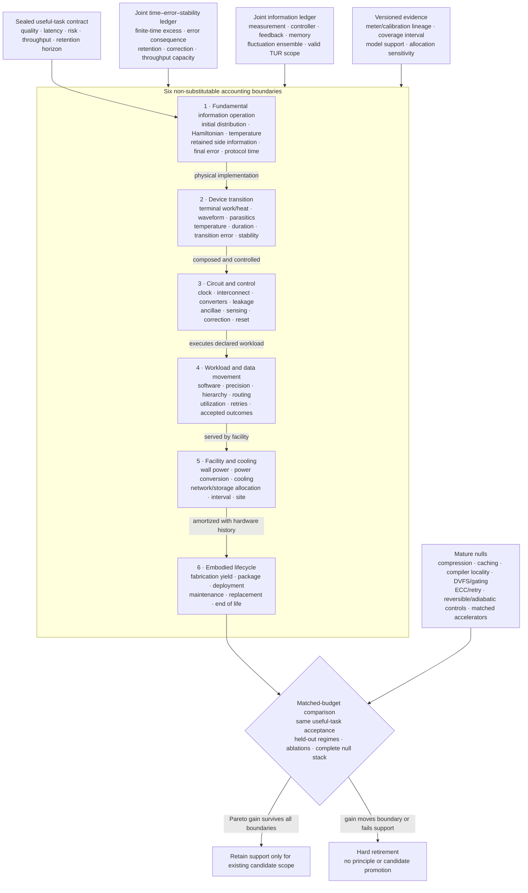

# Physical computation requires six boundaries

## Scope

“Energy per operation” is meaningful only after both *operation* and *energy
boundary* are fixed. A logical erasure bound, terminal energy of one device,
energy of a clocked circuit, wall-plug energy of a workload, facility energy,
and fabrication-to-retirement burden are related measurements, but they are not
substitutes. Crossing those boundaries without changing the claim is the main
category error this chapter prevents
([C-1100](../research/claims.md#c-1100),
[C-1151](../research/claims.md#c-1151)).

The working contract has six layers:

| Boundary | Question answered | Evidence required | Invalid shortcut |
| --- | --- | --- | --- |
| 1. fundamental generalized erasure | what is the minimum expected work for this declared physical-state transformation? | initial distribution, Hamiltonian, bath temperature, side information, correlations, final error, duration, controls, cycle closure | $k_BT\ln2$ per gate, FLOP, token, parameter, or model |
| 2. device transition | what energy or heat crossed this device boundary during the transition? | waveform, terminals, parasitics, duration, temperature, state preparation, transition-error distribution, calibrated instruments | theoretical minimum or simulated internal energy as measured device energy |
| 3. circuit and control | what did the complete physical circuit spend? | clock or power clock, control, wires, converters, leakage, sensing, ancillae, history, correction, I/O, reset | active element or reversible truth table alone |
| 4. workload and data movement | what did the implemented system spend per accepted useful outcome? | software, precision, hierarchy, bytes moved, routing, utilization, idle, retries, quality, latency, throughput | peak TOPS/W, TDP, arithmetic count, or one kernel |
| 5. facility and cooling | what facility energy is attributable under a declared interval and allocation? | IT and facility meters, cooling, power conversion, network/storage share, site, weather, interval, PUE category | generic PUE multiplier or PUE as carbon intensity |
| 6. embodied lifecycle | did operational savings repay fabrication and ownership burden over delivered service? | yield, packaging, transport, deployment, maintenance, utilization, support life, replacement, end of life, geography, uncertainty | operational electricity alone |

The evidence base is the
[information thermodynamics and physical computation audit](../research/audits/2026-08-05-information-thermodynamics-physical-computation.md),
normalized as [C-1100](../research/claims.md#c-1100) through
[C-1151](../research/claims.md#c-1151). The maintained quantitative definitions
are in the
[boundary-qualified mathematical contract](../math/boundary-qualified-physical-computation.md),
and the twelve hostile comparisons are in
[Fixture F-010](../experiments/fixtures/010-boundary-qualified-physical-computation.md).
The result composes current candidates; it adds no principle or candidate.

Editable source:
[boundary-qualified-physical-computation.mmd](../assets/diagrams/boundary-qualified-physical-computation.mmd).

The useful outcome is the firewall. Every lower-level saving must survive the
next boundary without lowering quality, raising unacceptable risk, missing the
latency/throughput contract, or exporting work.

## Biological observation

Biochemical sensing and adaptation make the boundary problem concrete. In the
audited models, copy number, integration time, receptor statistics, energy
supply, precision, and response speed remain distinct resources
([C-1135](../research/claims.md#c-1135),
[C-1136](../research/claims.md#c-1136)). A result for one biochemical network
does not become a universal information price, and it does not set accelerator
energy. Its useful contribution is a measurement discipline: name the physical
states, dynamics, observation interval, error variable, and supplied work.

Feedback experiments add a second lesson. A controlled subsystem can extract
work or cool while the sensor, memory, controller, actuator, or coupled demon
dissipates energy. The joint boundary restores the balance
([C-1130](../research/claims.md#c-1130),
[C-1131](../research/claims.md#c-1131),
[C-1132](../research/claims.md#c-1132),
[C-1133](../research/claims.md#c-1133)). Continuous information flow can be
assigned to parts only when the joint transition structure supports that
decomposition ([C-1134](../research/claims.md#c-1134)).

Three observations transfer:

1. sensing, state retention, response, and reset are physical parts of the same
   loop;
2. precision, speed, stability, and energy form a frontier, not one scalar; and
3. a subsystem benefit is provisional until the coupled system closes.

The transfer stops there. The audited biological models do not establish a
digital-training lower bound. Predictive-information and stochastic-learning
connections remain plausible rather than established for deployed AI
([C-1137](../research/claims.md#c-1137),
[C-1138](../research/claims.md#c-1138)).

## Proposed AI translation

### Begin with an accepted useful outcome

For requested outcome $j$, define a preregistered acceptance indicator

$$
A_j=\mathbf 1\!\left[
Q_j\succeq q_j\ \land\ L_j\le L_j^{\max}\ \land\
\rho_j\preceq\rho_j^{\max}\ \land\ \Theta\ge\Theta_j
\right],
$$

where $A_j\in\{0,1\}$ is acceptance [dimensionless], $Q_j$ and $q_j$ are
measured and required task-quality vectors in the same task-native units,
$L_j$ and $L_j^{\max}$ are measured and maximum latency [s], $\rho_j$ and
$\rho_j^{\max}$ are measured and maximum risk vectors [failure/request], and
$\Theta$ and $\Theta_j$ are delivered and required throughput [accepted
outcome/s]. Rejection, abstention, timeout, retry, silent corruption, and blocked
side effects remain in the request and resource ledgers.
$\mathbf 1[\cdot]$ is the dimensionless indicator; $\succeq$ and $\preceq$
mean that every registered vector component passes in its declared direction.

Let

$$
N_{\mathrm{acc}}=\sum_{j=1}^{N_{\mathrm{req}}}A_j,
$$

where $N_{\mathrm{req}}$ is requested outcomes [request] and
$N_{\mathrm{acc}}$ is accepted outcomes [accepted outcome]. Every energy
intensity in this chapter uses that denominator. If $N_{\mathrm{acc}}=0$, the
intensity is undefined and the arm fails; it is not zero.

### Carry six typed records

Each run produces six linked records rather than one “energy” field:

| Record | Minimum fields | Primary architectural owners |
| --- | --- | --- |
| `fundamental_operation` | logical map, physical encoding, $p_0$, $p_1$, Hamiltonians, $T$, correlations, error, duration, controls, theorem support | [Candidate 009](../experiments/candidates/009-graded-assurance-envelopes.md), [Candidate 014](../experiments/candidates/014-versioned-observation-contract.md) |
| `device_transition` | device identity, terminals, waveform, energy/heat sign, temperature, duration, error, stability, meter/calibration | [Candidate 006](../experiments/candidates/006-reversible-physical-skill.md), [Candidate 014](../experiments/candidates/014-versioned-observation-contract.md) |
| `circuit_control` | clock, power clock, wires, converters, leakage, sensing, controller, history, correction, reset, I/O | [Candidate 010](../experiments/candidates/010-reset-coupled-staged-verification.md), [Candidate 012](../experiments/candidates/012-latency-qualified-authority.md) |
| `workload_hierarchy` | software/model version, precision, bytes by level, routes, utilization, idle, retries, quality, latency, throughput | [Candidate 001](../experiments/candidates/001-adaptive-topology.md), [Candidate 017](../experiments/candidates/017-contract-preserving-semantic-compaction.md), [Candidate 018](../experiments/candidates/018-value-reconstructability-aware-tiering.md) |
| `facility_interval` | synchronized IT/facility meters, cooling, storage/network share, site, weather, PUE category, allocation sensitivity | [Candidate 014](../experiments/candidates/014-versioned-observation-contract.md) |
| `lifecycle_cohort` | started and accepted devices, yield, package, deployment, maintenance, utilization, lifetime, replacement, end of life | [Candidate 005](../experiments/candidates/005-severity-ordered-containment.md), [Candidate 006](../experiments/candidates/006-reversible-physical-skill.md), [Candidate 018](../experiments/candidates/018-value-reconstructability-aware-tiering.md) |

Every record carries immutable hardware/software/calibration versions,
timestamps, uncertainty, validity support, missingness, and the parent/child
identity needed to trace replacement or recalibration. This is the physical-
energy specialization of the project's
[versioned observation contract](../experiments/candidates/014-versioned-observation-contract.md).

### Make boundary escalation explicit

A result can support only its measured level:

1. theorem or ideal protocol result;
2. isolated device result;
3. closed circuit result;
4. accepted workload result;
5. allocated facility result; or
6. amortized lifecycle result.

Promotion from one level to the next requires a new measurement, not a larger
claim. This keeps the chapter aligned with
[reliability under mission profiles](26-reliability-under-mission-profiles.md),
where device population and history are part of the evidence, and with
[operator-qualified sensing](24-operator-qualified-sensing.md), where physical
observations remain tied to their operator, calibration, and support.

## Efficiency mechanism

### One vector, not one number

For a sealed run, report

$$
\mathbf E=
\left(E^{\mathrm{fund}},E^{\mathrm{dev}},E^{\mathrm{circ}},
E^{\mathrm{IT}},E^{\mathrm{fac}},E^{\mathrm{emb}}\right)
\quad [\mathrm J],
$$

where the components are respectively theorem-qualified fundamental lower bound,
device-terminal energy, complete circuit/control energy, workload IT energy,
allocated facility energy, and allocated embodied energy [J]. The vector is not
a sum: in many measurements
$E^{\mathrm{dev}}\subset E^{\mathrm{circ}}\subset E^{\mathrm{IT}}
\subset E^{\mathrm{fac}}$. For boundary $b$, useful intensity is

$$
e^b=\frac{E^b}{N_{\mathrm{acc}}}
\quad [\mathrm{J/accepted\ outcome}],
$$

where $b\in\{\mathrm{dev,circ,IT,fac,emb,life}\}$ and
$N_{\mathrm{acc}}$ is accepted outcomes [accepted outcome]. Distance between
$E^{\mathrm{fund}}$ and any measured component is descriptive only after their
operations and denominators match; it is not a system ranking
([C-1151](../research/claims.md#c-1151)).

### Boundary 1 — generalized erasure

For physical microstate $z\in\mathcal Z$, probability $p(z)$
[dimensionless], Hamiltonian $\mathcal H(z)$ [J], bath temperature $T$ [K], and
Boltzmann constant $k_B=1.380649\times10^{-23}$ J/K, define nonequilibrium free
energy

$$
\mathcal F[p,\mathcal H]
=\sum_{z\in\mathcal Z}p(z)\mathcal H(z)
+k_BT\sum_{z\in\mathcal Z}p(z)\ln p(z)
\quad [\mathrm J].
$$

For an isothermal transformation under the selected theorem's assumptions,
expected work on the system obeys

$$
\langle W_{\mathrm{on}}\rangle\ge
\Delta\mathcal F
=\mathcal F[p_1,\mathcal H_1]-\mathcal F[p_0,\mathcal H_0]
\quad [\mathrm J],
$$

where $p_0,p_1$ are initial and final microstate distributions,
$\mathcal H_0,\mathcal H_1$ are initial and final Hamiltonians [J], and
$W_{\mathrm{on}}$ is work on the system [J]. Logical entropy alone is
insufficient for nondegenerate or nonequilibrium memories
([C-1103](../research/claims.md#c-1103)). Side information, correlation, and a
finite reservoir change the accounting
([C-1105](../research/claims.md#c-1105),
[C-1107](../research/claims.md#c-1107)).

The familiar binary special case is

$$
E^{\mathrm{fund}}_{\mathrm{reset}}(T,\epsilon)
=k_BT\left[\ln2-h(\epsilon)\right] \quad [\mathrm J],
\qquad
h(\epsilon)=-\epsilon\ln\epsilon-(1-\epsilon)\ln(1-\epsilon),
$$

where $\epsilon\in[0,1/2]$ is symmetric reset-error probability
[error/transition] and $h(\epsilon)$ is binary entropy [nat]. At
$\epsilon=0$, a uniformly distributed degenerate bit yields $k_BT\ln2$
([C-1101](../research/claims.md#c-1101)). A biased state instead follows its
entropy ([C-1102](../research/claims.md#c-1102)). The system must still charge
the consequence of allowed errors ([C-1104](../research/claims.md#c-1104)).

Finite duration adds a separate coordinate. For protocol $\pi$ of duration
$\tau_\pi$ [s], define excess work

$$
W^{\mathrm{ex}}_\pi=
\langle W_{\mathrm{on},\pi}\rangle-\Delta\mathcal F
\quad [\mathrm J].
$$

Compare it only for matched initial/final state, error, bath, and allowed
controls. Finite-time excess, finite error, and stability are distinct
([C-1118](../research/claims.md#c-1118),
[C-1119](../research/claims.md#c-1119),
[C-1122](../research/claims.md#c-1122)).
Finite-time quantum erasure has additional model-specific cost and fluctuation
structure; classical quasistatic expressions cannot simply be relabeled
([C-1120](../research/claims.md#c-1120)).

### Information, fluctuations, and theorem scope

Individual trajectories below a mean bound are compatible with fluctuation
relations ([C-1106](../research/claims.md#c-1106),
[C-1127](../research/claims.md#c-1127),
[C-1128](../research/claims.md#c-1128),
[C-1129](../research/claims.md#c-1129)). The implementation therefore stores
the full work distribution, sample-selection rule, reverse protocol, rare-event
coverage, and estimator uncertainty rather than only a mean or minimum.

For feedback, close the physical loop:

$$
E^{\mathrm{joint}}_{\mathrm{feedback}}
=E^{\mathrm{plant}}+E^{\mathrm{sense}}+E^{\mathrm{record}}
+E^{\mathrm{control}}+E^{\mathrm{actuate}}+E^{\mathrm{reset}}
\quad [\mathrm J],
$$

where the six terms are energy crossing the plant, sensor, record memory,
controller, actuator, and reset boundaries [J]. Extracted plant work is signed;
it cannot cancel an unmeasured controller.

For a stationary continuous-time Markov jump process and registered integrated
current $J_t$ over time $t$ [s], the original steady-state thermodynamic
uncertainty relation has the scoped form

$$
\frac{\operatorname{Var}(J_t)}{\langle J_t\rangle^2}\Sigma_t\ge2,
$$

where $\Sigma_t$ is expected entropy production in units of $k_B$
[dimensionless] and $J_t$ is measured in its registered integrated-current unit.
The process, current, stationarity, Markov property,
time-reversal convention, observation support, and entropy-production estimator
must be established first ([C-1139](../research/claims.md#c-1139)). Other
finite-time, initial-state, non-Markovian, deterministic, or quantum settings do
not inherit this formula unchanged
([C-1140](../research/claims.md#c-1140),
[C-1141](../research/claims.md#c-1141)).

### Boundaries 2 and 3 — device, circuit, and real crossover

For device transition $k$ over $[t_k^0,t_k^1]$, terminal energy is

$$
E_k^{\mathrm{dev}}=
\sum_{c=1}^{C_k}\int_{t_k^0}^{t_k^1}V_{k,c}(t)i_{k,c}(t)\,dt
\quad [\mathrm J],
$$

where $C_k$ is supplied channels [channel], $V_{k,c}$ is calibrated voltage [V],
$i_{k,c}$ is signed current [A], and $t$ is time [s]. Heat requires a calibrated
thermal balance; terminal electrical energy is not relabeled as heat.

Logical reversibility can avoid compulsory erasure at intermediate steps
([C-1112](../research/claims.md#c-1112)), but history, ancillae, output copy,
communication, uncomputation, retention, and final reset remain physical
([C-1113](../research/claims.md#c-1113),
[C-1114](../research/claims.md#c-1114)). Its strongest comparison is therefore
against reversible pebbling, checkpoint/recompute, compiler elimination, and an
optimized irreversible circuit at equal service.

For an idealized adiabatic RC path, the crossover model is

$$
E^{\mathrm{adiabatic}}(\tau)
=\gamma\frac{RC}{\tau}CV^2+P_{\mathrm{leak}}\tau
+E^{\mathrm{clock}}(\tau)+E^{\mathrm{control}}
+E^{\mathrm{I/O}}+E^{\mathrm{reset}}
\quad [\mathrm J],
$$

where $R$ is resistance [ohm], $C$ is capacitance [F], $\tau$ is transition
duration [s], $V$ is voltage [V], $\gamma$ is a waveform coefficient
[dimensionless], $P_{\mathrm{leak}}$ is leakage power [W], and the remaining
terms are clock, control, I/O, and reset energy [J]. Resistive loss may decrease
approximately with $RC/\tau$ in its slow-ramp regime
([C-1115](../research/claims.md#c-1115)); leakage and power-clock costs can create
a finite optimum ([C-1116](../research/claims.md#c-1116)). A fabricated
energy-recovery processor establishes feasibility in its measured range, not
zero energy or universal superiority
([C-1117](../research/claims.md#c-1117)).

The crossover is real only when
$E^{\mathrm{adiabatic}}<E^{\mathrm{ordinary}}$ at matched quality, error,
throughput, capacity, layout/process, temperature, and cyclic closure. Here,
$E^{\mathrm{ordinary}}$ is complete energy of the conventional comparison [J].
The ordinary $CV^2$ switching-loss expression is a circuit model, not Landauer
erasure
([C-1147](../research/claims.md#c-1147)).

### Retention and correction

For memory tier $m$, charge

$$
E_m^{\mathrm{memory}}
=N_m^{\mathrm w}e_m^{\mathrm w}
+N_m^{\mathrm r}e_m^{\mathrm r}
+N_m^{\mathrm{ref}}e_m^{\mathrm{ref}}
+E_m^{\mathrm{ECC}}+E_m^{\mathrm{scrub}}+E_m^{\mathrm{move}}
+E_m^{\mathrm{idle}}
\quad [\mathrm J],
$$

where $N_m^{\mathrm w}$, $N_m^{\mathrm r}$, and $N_m^{\mathrm{ref}}$ are write,
read, and refresh counts [operation]; the corresponding $e$ terms are measured
energy [J/operation]; and the remaining terms are correction, scrub, movement,
and idle energy [J]. Report retention distribution, raw and post-correction
errors, miscorrection, silent loss, endurance, and accepted retrievals.

Retention depends on barrier, temperature, time, and loss probability in the
activated bistable null ([C-1121](../research/claims.md#c-1121)). Analog storage
adds thermal/device noise, finite usable precision, drift, calibration, and
conversion ([C-1123](../research/claims.md#c-1123),
[C-1124](../research/claims.md#c-1124)). Noise-assisted or stochastic advantage
is plausible only for selected workloads against matched deterministic and
pseudorandom nulls ([C-1125](../research/claims.md#c-1125)).

### Boundary 4 — workload and locality

For hierarchy link $\ell\in\mathcal L$, let $B_\ell$ be transferred bytes
[byte] and $\widehat e_\ell$ be calibrated energy [J/byte] at the registered
process, voltage, precision, distance, rate, and utilization. Movement energy is

$$
E^{\mathrm{move}}=
\sum_{\ell\in\mathcal L}B_\ell\widehat e_\ell
\quad [\mathrm J].
$$

Measure register, local memory, cache, on-chip network, off-package memory,
host, storage, and network separately. Sparse or modular execution also pays
indices, routing, load imbalance, synchronization, conversion, cache misses,
and idle capacity. Data movement can dominate arithmetic on measured
accelerators ([C-1145](../research/claims.md#c-1145)); a hierarchy-aware model's
transfer to another system remains plausible until wall-plug validation
([C-1146](../research/claims.md#c-1146)).

Modularity can save locality while losing accessible correlation or adding
reset and communication cost ([C-1142](../research/claims.md#c-1142)). A
physical process optimized for one input prior can add mismatch dissipation
under drift ([C-1143](../research/claims.md#c-1143)), and circuit topology can
change thermodynamic cost for the same logical function
([C-1144](../research/claims.md#c-1144)). These are direct constraints on
[sparse predictive computation](30-sparse-predictive-compute.md) and the
[working architecture](01-working-architecture.md).

### Boundaries 5 and 6 — facility and lifecycle

For a synchronized facility interval $r$,

$$
\operatorname{PUE}_r=
\frac{E_r^{\mathrm{fac}}}{E_r^{\mathrm{IT}}}
\quad [\mathrm{dimensionless}],
$$

where $E_r^{\mathrm{fac}}$ is total facility energy [J] and
$E_r^{\mathrm{IT}}$ is IT-equipment energy [J] under the declared ISO/IEC
30134-2 boundary and measurement category. PUE is neither task energy nor
carbon intensity ([C-1148](../research/claims.md#c-1148)). Workload attribution
still needs synchronized meters, accepted outcomes, network/storage shares,
weather, and sensitivity to cooling-overhead allocation.

For hardware cohort $h$, lifecycle energy is

$$
E_h^{\mathrm{life}}=
E_h^{\mathrm{fab}}+E_h^{\mathrm{pack}}+E_h^{\mathrm{transport}}
+E_h^{\mathrm{deploy}}+E_h^{\mathrm{op}}+E_h^{\mathrm{maint}}
+E_h^{\mathrm{replace}}+E_h^{\mathrm{EOL}}
\quad [\mathrm J],
$$

where the terms are fabrication, packaging, transport, deployment, operation
including facility share, maintenance, replacement, and end-of-life primary
energy [J]. Fabrication and packaging can change a use-phase ranking
([C-1149](../research/claims.md#c-1149)). Specialized hardware is superior only
when saved accepted-service energy outweighs new fabrication, low utilization,
support life, maintenance, and replacement across uncertainty
([C-1150](../research/claims.md#c-1150)).

## Evidence status

The ledger contains exactly **52 claims**:

- **46 established** within their stated theorem, experiment, device, circuit,
  workload, facility, or lifecycle boundary;
- **5 plausible** transfers that still require target-system evidence; and
- **1 disputed** system-level inference.

The status distribution is not a confidence score for one architecture. It
describes separate claims with separate support:

| Claim block | Status | What is supported |
| --- | --- | --- |
| [C-1100](../research/claims.md#c-1100)–[C-1124](../research/claims.md#c-1124) | 25 established | encoding dependence, generalized and finite-error erasure, finite reservoirs, four experimental platforms, reversible/adiabatic computation, finite-time cost, retention, switching error, and analog noise/precision |
| [C-1125](../research/claims.md#c-1125) | 1 plausible | selected stochastic/noise-assisted workloads may save energy against matched nulls |
| [C-1126](../research/claims.md#c-1126)–[C-1136](../research/claims.md#c-1136) | 11 established | AWGN communication scope, fluctuation relations, feedback/information engines, continuous information flow, and scoped sensing tradeoffs |
| [C-1137](../research/claims.md#c-1137)–[C-1138](../research/claims.md#c-1138) | 2 plausible | predictive-information and stochastic-learning transfer to deployed AI |
| [C-1139](../research/claims.md#c-1139)–[C-1145](../research/claims.md#c-1145) | 7 established | TUR scope, modularity/mismatch cost, circuit topology, and measured importance of data movement |
| [C-1146](../research/claims.md#c-1146) | 1 plausible | hierarchy-aware energy prediction across routed workloads and systems |
| [C-1147](../research/claims.md#c-1147)–[C-1149](../research/claims.md#c-1149) | 3 established | circuit charging differs from erasure, PUE scope, and fabrication/packaging burden |
| [C-1150](../research/claims.md#c-1150) | 1 plausible | lifecycle superiority of specialized low-operational-energy hardware |
| [C-1151](../research/claims.md#c-1151) | 1 disputed | using distance above $k_BT\ln2$ as an actionable AI-system ranking |

Four platforms experimentally approach or test Landauer-scale erasure: a
colloidal memory ([C-1108](../research/claims.md#c-1108)), a feedback trap
([C-1109](../research/claims.md#c-1109)), a nanomagnetic bit
([C-1110](../research/claims.md#c-1110)), and a cryogenic molecular nanomagnet
([C-1111](../research/claims.md#c-1111)).
They establish the physical principle in their declared protocols. They do not
measure complete computers. The same evidence discipline applies upward:

1. a theorem establishes a bound only for its model;
2. a device experiment establishes its controlled physical transition;
3. a processor or accelerator establishes its measured circuit/workload range;
4. facility metering establishes its interval and allocation; and
5. lifecycle assessment establishes its functional unit and inventory cases.

The unresolved scientific object is not another universal constant. It is the
measured crossover between implementations at equal accepted service. Fixture
F-010 preserves that question without promoting its evaluation contract into a
new `P-` bundle.

## Speculative extensions

Only the five plausible claims license active extension work.

### Physical stochasticity for matched workloads

Physical noise could be useful when the task already requires sampling,
probabilistic search, or exploration. The comparison must match stationary
distribution or target posterior, bias, mixing, tail coverage, latency, task
quality, device/circuit energy, and lifecycle cost against high-quality digital
pseudorandom sampling ([C-1125](../research/claims.md#c-1125)). A noisy device
does not earn credit merely for producing variation.

### Predictive retention rather than historical retention

If a continual system stores only state that improves prediction, it may avoid
updates whose information is nonpredictive. The surviving question is physical:
does the predictive objective reduce writes, movement, correction, and retained
capacity after ordinary predictive compression, caching, event-triggered
updates, and recomputation are matched
([C-1137](../research/claims.md#c-1137))? This joins
[memory and consolidation](40-memory-and-consolidation.md) with
[Candidate 017](../experiments/candidates/017-contract-preserving-semantic-compaction.md)
and
[Candidate 018](../experiments/candidates/018-value-reconstructability-aware-tiering.md).

### Thermodynamic learning efficiency on actual hardware

Toy stochastic-learning results can generate hypotheses about which updates
carry useful information, but they do not bind digital gradient training
([C-1138](../research/claims.md#c-1138)). A valid transfer would jointly measure
optimizer, arithmetic, activation/gradient memory, communication, data loading,
checkpointing, accepted validation outcomes, and hardware/facility energy under
the same learning contract.

### Hierarchy-aware conditional execution

A route-energy model could decide whether skipping arithmetic saves more than
its indices, movement, arbitration, synchronization, imbalance, and idle
capacity cost ([C-1146](../research/claims.md#c-1146)). It must transfer across
held-out model, sequence/graph length, sparsity pattern, cache-fit, precision,
topology, and utilization regimes. This is the energy test for
[Candidate 001](../experiments/candidates/001-adaptive-topology.md), not a new
routing candidate.

### Lifecycle-qualified physical compilation

Specialized hardware may move recurring computation into a lower-energy
substrate, but the gain becomes real only after yield, package, converters,
calibration, utilization, service life, software support, maintenance,
replacement, and displaced-hardware assumptions are propagated
([C-1150](../research/claims.md#c-1150)).
[Candidate 006](../experiments/candidates/006-reversible-physical-skill.md)
already owns that experiment. The governing quantity is accepted lifetime
service, not peak component efficiency.

## Failure modes

| Failure | Why the claim fails | Required repair |
| --- | --- | --- |
| assign $k_BT\ln2$ to every operation | Landauer attaches to a declared physical information reduction, not an operation label | state the physical encoding, distribution, Hamiltonian, bath, error, duration, and cycle |
| treat a biased or known bit as uniform | information erased depends on the prior and usable side information | measure $p_0$, correlations, and preparation/reset of helpers |
| call Landauer a power bound | work [J] lacks protocol time and throughput | report duration [s], useful rate [outcome/s], and capacity [device s] |
| claim a violation from one low-work trajectory | fluctuation relations constrain ensembles | preserve the full distribution, reverse protocol, rare-event support, and estimator uncertainty |
| reduce work by allowing errors | the transformation and accepted service changed | charge detection, correction, retry, fallback, silent loss, and harm |
| equate logical with physical reversibility | an invertible map says nothing about dissipative dynamics | close ancillae, history, output copy, uncomputation, clock, leakage, I/O, and reset |
| call adiabatic switching lossless | slower resistive loss can reveal leakage and power-clock cost | measure a real throughput-matched crossover across frequency, load, temperature, and utilization |
| omit memory stability | low write energy is useless if state expires or refresh dominates | measure retention distribution, refresh, correction, endurance, and accepted retrievals |
| treat analog state as an exact real number | useful precision depends on signal, noise, bandwidth, drift, calibration, and conversion | match end-to-end precision and tail quality with converters and host included |
| reuse $E_b/N_0\ge\ln2$ as a gate bound | it is an AWGN reliable-communication asymptote under a rate/coding regime ([C-1126](../research/claims.md#c-1126)) | include transmitter, receiver, bandwidth, code, latency, and error in the communication service |
| draw an information engine around the plant | sensing, record memory, controller, actuation, and reset were exported | use the joint feedback ledger |
| apply a TUR to arbitrary AI metrics | training loss or accuracy is not automatically a physical Markov current | prove process, observable, stationarity, reversal, and entropy-production support first |
| assume modules always save energy | boundaries can discard correlations and add communication/reset | compare joint, modular, and shared-sufficient-statistic implementations under shifted priors |
| quote component picojoules as constants | process, voltage, precision, hierarchy, distance, rate, and utilization differ | calibrate the energy model to the measured implementation and top-level meter |
| report skipped arithmetic as task savings | routing, metadata, movement, imbalance, synchronization, and idle capacity may dominate | report bytes and joules at every hierarchy level per accepted outcome |
| multiply by generic PUE | PUE is interval- and facility-bound and lacks a task denominator | synchronize IT/facility meters and test registered overhead allocations |
| report operational energy as lifecycle efficiency | fabrication, yield, utilization, lifetime, maintenance, and replacement may reverse the ranking | use one cradle-to-retirement functional unit and uncertainty cases |
| compare unlike useful tasks | lower quality, longer latency, narrower support, or more failures created the saving | apply the common outcome firewall before comparing energy |

The broader [energy model](80-energy-model.md) should consume these typed
records, while [reliability under mission profiles](26-reliability-under-mission-profiles.md)
supplies the device population, temperature, wear, correction, repair, and
retirement state. Neither chapter can replace the other's denominator.

## Measurable predictions

Fixture F-010 converts the chapter into twelve equal-budget experiments:

| Track | Prediction that may survive | Strong null | Hard retirement condition |
| --- | --- | --- | --- |
| T1 generalized erasure | a proposed protocol lowers the matched work distribution at fixed initial/final state, error, duration, bath, and controller boundary | best full/restricted-control protocol plus slow reference on the same memory | advantage vanishes when error, duration, correlation, finite reservoir, or controller is matched |
| T2 reversible kernel | closed reversible execution lowers circuit/workload joules for useful bijective, many-to-one, and iterative kernels | optimized irreversible, checkpoint/recompute, compiler elimination, reversible pebbling variants | history, ancillae, output copy, retained state, throughput replication, or final reset is external |
| T3 adiabatic crossover | a measured operating region beats conventional CMOS at equal service | ordinary, clock/power-gated, DVFS, and near-threshold circuits at matched process/layout | power clock, leakage, interconnect, capacity, or error removes the crossover |
| T4 retention frontier | a memory tier reduces lifetime retrieval energy at required retention and error | SRAM/DRAM/nonvolatile, recomputation, and tiering appropriate to the horizon | refresh, ECC, silent loss, endurance, reserve, or replacement erases the gain |
| T5 analog closure | an analog/physical path lowers wall-plug accepted-task energy at required precision | digital mixed precision and matched low-precision/stochastic paths | conversion, calibration, host, drift, shift, or tail-quality cost removes the gain |
| T6 information engine | net joint work remains favorable with the whole feedback loop inside the boundary | open loop, predictive control, and randomized action at matched sensing/actuation | gain exists only around the plant or depends on uncharged records/control |
| T7 TUR scope | a registered physical current satisfies an applicable precision--dissipation bound and constrains task-relevant behavior | finite-time/transient variants, hidden-state/non-Markov models, predictive empirical null | process assumptions fail, entropy production is unidentifiable, or task relevance is absent |
| T8 modularity/mismatch | modules save energy after cross-boundary correlation, traffic, reset, calibration, and prior shift | joint implementation and module system with shared sufficient statistics | advantage assumes the deployment prior or disappears under correlation/shift |
| T9 locality | sparse/conditional execution lowers IT energy after all movement and capacity terms | dense optimized, structured sparsity, compiler tiling/cache/data reuse | saved arithmetic is offset by bytes, metadata, sync, imbalance, conversion, or idle |
| T10 facility | workload improvement reduces synchronized facility energy per accepted outcome | matched randomized facility blocks or calibrated side-by-side system | result comes from TDP, generic PUE, short interval, or unstable allocation |
| T11 lifecycle | operational savings repay incremental embodied burden within supported service life | deployed general hardware, software optimization, and shared specialized service | break-even requires unsupported yield, utilization, demand, lifetime, or displaced-hardware credit |
| T12 full stack | one candidate-backed composition Pareto-improves quality, latency, risk, capacity, energy, and lifecycle under uncertainty | complete ordinary stack plus boundary and mechanism ablations | no Pareto gain survives held-out regimes, support gates, and required sensitivities |

All tracks use the same accepted-task contract and preserve failed devices,
rejected requests, timeouts, retries, uncorrectable errors, silent corruption,
abstention, idle capacity, maintenance, and replacement in their denominators.
Confirmation groups withhold physical devices, fabrication cohorts, waveform and
duration regimes, target errors, temperatures, retention horizons, workload
families, hierarchy patterns, controller versions, sites, seasons, lifecycle
cases, and future time.

The common result vector is

$$
\mathbf Y=
\left(f_{\mathrm{acc}},Q,L_{0.50},L_{0.99},\rho,
e^{\mathrm{IT}},e^{\mathrm{fac}},e^{\mathrm{life}},
E^{\mathrm{err}},C^{\mathrm{cap}},G,W,M\right),
$$

where $f_{\mathrm{acc}}$ is accepted fraction [dimensionless], $Q$ is task
quality [task-native unit], $L_{0.50}$ and $L_{0.99}$ are median and 99th
percentile latency [s], $\rho$ is risk [failure/request], the three $e$ terms
are energy intensity [J/accepted outcome], $E^{\mathrm{err}}$ is
error-consequence energy [J], $C^{\mathrm{cap}}$ is provisioned capacity
[device s], $G$ is greenhouse-gas inventory [kg CO$_2$e], $W$ is water
inventory [m$^3$], and $M$ is a material/labor vector in declared native units.

A physical-efficiency claim survives only when its simultaneous uncertainty
region is no worse on every hard-gated coordinate and strictly better on at
least one preregistered primary coordinate against the strongest compatible
null across required sensitivity cases. Passing supports only the existing
candidate scope named in F-010. Failure identifies the boundary that produced
the apparent saving and retires the wider claim.
