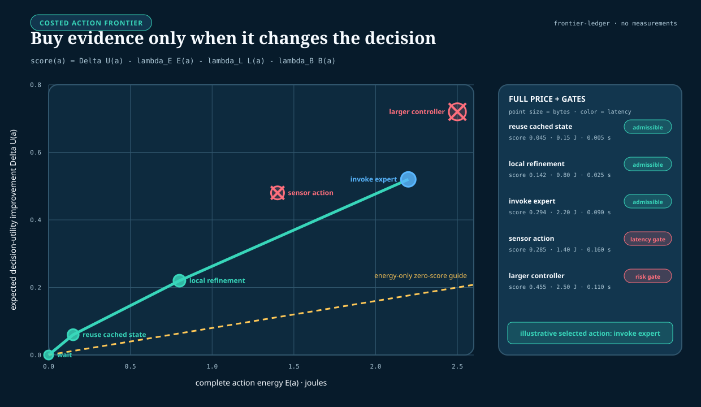
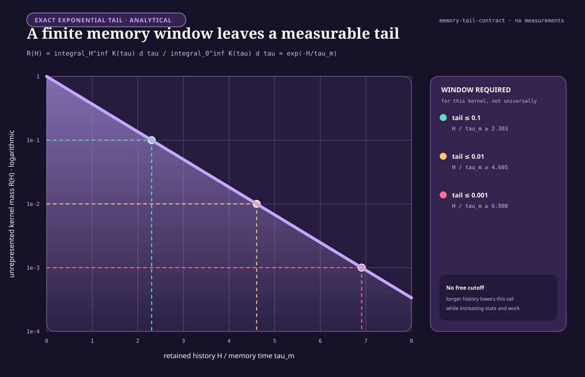
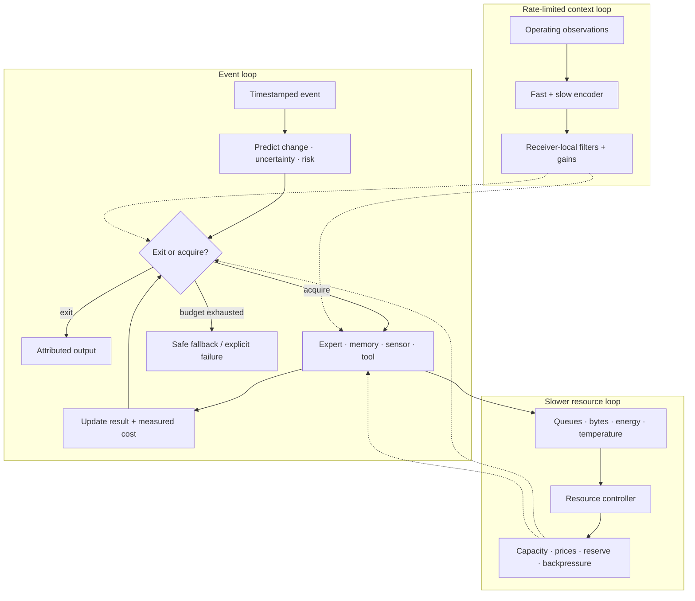
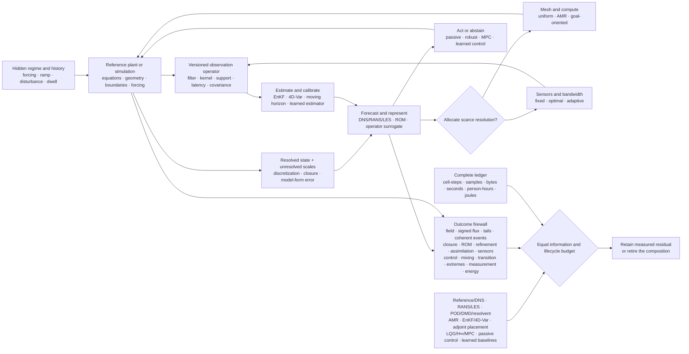

# Sparse prediction and adaptive compute

## Scope

This chapter specifies the online control path that decides, for each event,
whether to reuse an existing prediction, exit, invoke another module, read
memory, acquire another observation, or escalate. Its objective is not minimum
FLOPs. It is minimum measured resource use subject to explicit quality,
calibration, deadline, and safety constraints.

The runtime has three coupled but distinct jobs:

1. estimate what changed and what remains uncertain;
2. choose the next computation or observation by expected decision value; and
3. allocate physical capacity without making the fast task path unstable.

Training curricula, long-term consolidation, structural pruning, and skill
compilation are handled in other chapters. Their products may be invoked here,
but this runtime does not silently rewrite slow model state.

## Biological observation

The relevant evidence separates demand detection, distributed context, local
response, and physical supply.

### Activity is selective and regulated

Neural signaling operates under a strict metabolic budget, which constrains
the fraction of cortex that can be strongly active at once
([C-001](../research/claims.md#c-001)). In the *Drosophila* mushroom body,
feedback inhibition keeps odor codes sparse and decorrelated; disrupting that
loop impairs discrimination between similar learned odors
([C-025](../research/claims.md#c-025)). These results support selective activity
and active inhibition. They do not identify top-$k$ routing, a pruning ratio,
or a digital energy saving.

### Prediction, uncertainty, and action are different signals

Hierarchical prediction with feed-forward residuals accounts for selected
visual-cortical response properties
([C-005](../research/claims.md#c-005)). Active whisker sensing also shows why a
passive residual is incomplete: self-generated sensor mechanics affect the
observed neural code ([C-022](../research/claims.md#c-022)). A residual says
that a prediction was wrong. It does not by itself say whether the error is
irreducible noise, model ignorance, task-relevant novelty, or a reason to buy
another observation.

### Broad context is interpreted locally and temporally

Context-dependent disinhibition can change gain in a selected cortical
population ([C-020](../research/claims.md#c-020)). More direct causal work on
neuromodulation shows three constraints on a possible artificial abstraction:

- antagonistic signals can sustain different distributed behavioral modes
  ([C-046](../research/claims.md#c-046));
- the frequency and duration of one broad signal can produce different and
  non-monotonic system responses ([C-047](../research/claims.md#c-047)); and
- receptor identity and location can turn the same source into transient or
  sustained local responses ([C-048](../research/claims.md#c-048)).

The engineering candidate is therefore a rate-limited context broadcast whose
receivers own their gains, thresholds, and temporal filters. It is not a
central command containing a route for every module. Its evidence, limits, and
conventional analogues are developed in the
[neurodevelopment and global-control audit](../research/audits/2026-08-05-neurodevelopment-global-control.md).

### Demand and physical supply can be locally coupled

Presynaptic ATP production can be recruited by local activity
([C-049](../research/claims.md#c-049)); mitochondrial docking changes resource
placement and local synaptic dynamics ([C-050](../research/claims.md#c-050));
and neural activity can recruit an adjacent vascular response in the studied
rodent preparations ([C-051](../research/claims.md#c-051)). The transferable
constraint is modest: measure demand near work, account for placement, and let
an infrastructure layer adjust supply. The neurovascular paper's model-derived
percentage is not an architecture constant, and none of these cellular results
provides a conversion from ATP to accelerator joules.

Aggregate headroom is likewise not evidence of delivery or useful uptake at
the support where demand occurs; local deficit, arrival, consumption, and
export remain distinct records ([C-1488](../research/claims.md#c-1488)).

Taken together, the observations motivate a layered controller: fast local
prediction and gating, a narrow context path, and a slower resource plane. The
architecture still has to beat standard estimation, decision, routing, and
control methods.

## Proposed AI translation

### Separate the quantities before making a gate

Let $y_t$ be an observation in its declared sensor units and
$\hat y_{t|t-1}$ the prediction available before observing it. Define the raw
residual

$$
r_t = y_t-\hat y_{t|t-1}.
$$

If the predictor supplies a calibrated residual covariance $S_t$, the
normalized innovation is

$$
\nu_t = r_t^{\mathsf T}S_t^{-1}r_t.
$$

$r_t$ has the units of $y_t$; $\nu_t$ is dimensionless. A large $r_t$ with a
large expected $S_t$ may be unsurprising. Conversely, a small residual in a
safety-critical variable may justify action. The runtime therefore carries
separate fields for:

| Quantity | Meaning | Unit or representation |
| --- | --- | --- |
| residual $r_t$ | observed minus predicted state | observation units |
| normalized innovation $\nu_t$ | residual relative to predicted covariance | dimensionless |
| aleatoric uncertainty | expected irreducible variability | distribution in output units |
| epistemic uncertainty | model uncertainty or support deficit | calibrated probability or ensemble statistic |
| task risk | cost of acting or exiting incorrectly | probability and consequence in task units |
| expected acquisition value $\Delta U_t(a)$ | expected decision improvement from action $a$ | declared utility units |
| estimated energy $\hat E_t(a)$ | energy for acquisition and downstream work | joules |
| estimated latency $\hat L_t(a)$ | completion time including queueing | seconds |
| traffic $\hat B_t(a)$ | memory or network movement | bytes |
| context rate $R_b$ | transmitted global operating context | bits per second |

No implementation may collapse all of these into “confidence” and retain the
same claim. Residual magnitude, likelihood, expected value, and risk answer
different questions. Predictive regulation adds the same separation between
forecast value, feedback correction, integrated action exposure, reserve
debit, and later outcome ([C-1494](../research/claims.md#c-1494)).

### Command, interface work, transport, and observation are different stages

An adaptive gate often mistakes its command for the work that actually crossed
an interface. Electrochemistry supplies a sharp counterexample. In one common
charge-transfer form,

$$
j=j_0\left[
\exp\!\left(\frac{\alpha_a F\eta}{R_gT}\right)
-\exp\!\left(-\frac{\alpha_c F\eta}{R_gT}\right)
\right],
$$

where $j$ and $j_0$ are current densities in amperes per square metre,
$\eta$ is overpotential in volts, $\alpha_a$ and $\alpha_c$ are dimensionless
transfer coefficients, $F$ is the Faraday constant in coulombs per mole,
$R_g$ is the molar gas constant in joules per mole-kelvin, and $T$ is absolute
temperature in kelvin. Even when this local closure is correct, bulk
transport, double-layer state, and series loss still separate commanded
voltage from realized flux and terminal observation
([C-1530](../research/claims.md#c-1530)).

The corresponding artificial contract records a five-stage chain:

1. the controller issues a command under declared authority;
2. receiver-local state converts the command into a driving force;
3. an interface transfers bounded useful work;
4. internal transport accepts, delays, or saturates that transfer; and
5. an observation operator reports a noisy, delayed projection of the result.

A candidate may compress this chain only after an intervention shows that the
omitted stage is conditionally redundant. Otherwise, a low command error can
coexist with wrong realized service. A validity check may reject an observation
before interpretation, but passing such a check does not identify a unique
mechanism ([C-1532](../research/claims.md#c-1532)). Likewise, a low prediction
residual cannot give physical semantics to unidentifiable latent parameters
([C-1537](../research/claims.md#c-1537)).

### Observation is affected by action

The acquisition model must also represent how sensing and response change the
future observation channel. Operational telemetry can be delayed, incomplete,
pooled, or policy-coupled: robust residual methods remain strong nulls
([C-124](../research/claims.md#c-124)); current counts can omit events that
occurred but have not yet arrived ([C-126](../research/claims.md#c-126)); pooled
signals can trade attribution for coverage ([C-127](../research/claims.md#c-127));
and a fast behavioral proxy can drift with platform, attention, or policy
([C-128](../research/claims.md#c-128)).

More importantly, an action can alter both hidden state and telemetry. Isolation
may reduce propagation while also removing the isolated component's messages;
throttling can suppress an error count by suppressing all traffic; a warning can
change user behavior; and a new sensor policy changes which events can be
observed. The controller therefore versions coverage, delay, ascertainment,
observation-model state, and every sensing or response action. A drop in the
post-action residual is not independent recovery evidence
([C-131](../research/claims.md#c-131)).

[Candidate 007](../experiments/candidates/007-endogenous-observation-surveillance.md)
tests joint process/observation estimation against residual CUSUM/GLR,
nowcasting, maximum coverage, value-of-information sampling, and delay-aware
POMDP or model-predictive control. It must use true data vintages, preserve
subgroup coverage, estimate counterfactual observation paths, and charge
investigation and action capacity as well as compute.

### Price a menu of acquisitions

At event $t$, the system considers a finite action menu $\mathcal A_t$:

```text
exit | reuse cached state | run local refinement | invoke expert
     | read episodic/factual memory | acquire sensor action | call tool
     | escalate to a larger model or human
```

For acquisition $a$, estimate the expected improvement in decision utility
$\Delta U_t(a)$ and its full energy, latency, and traffic costs. A Lagrangian
form of the selection rule is

$$
a_t^* = \arg\max_{a\in\mathcal A_t}
\left[
\Delta U_t(a)
-\lambda_E\hat E_t(a)
-\lambda_L\hat L_t(a)
-\lambda_B\hat B_t(a)
\right],
$$

subject to hard task constraints such as

$$
\Pr(\text{unsafe outcome}\mid a,\mathcal I_t)\le\delta,
\qquad
\hat L_t(a)\le L_{\max}.
$$

$\mathcal I_t$ is the information legally available when event $t$ is
decided, $\delta\in[0,1]$ is the preregistered maximum conditional probability
of an unsafe outcome, and $L_{\max}$ is the latency ceiling in seconds.
$\lambda_E$, $\lambda_L$, and $\lambda_B$ have units utility/joule,
utility/second, and utility/byte respectively, converting the three costs into
the declared utility scale. When those conversions cannot be defended,
use constrained multi-objective selection and report a Pareto surface instead
of inventing a scalar score. An action with high information gain but no
expected decision benefit receives no credit.

The next figure uses a hypothetical action ledger to expose that rule. Point
positions, costs, probabilities, and the highlighted action are analytical
illustrations only; they are not measured values or a recommended controller.



### Three runtime timescales

| Loop | Typical cadence | State owned | Permitted actions |
| --- | --- | --- | --- |
| event loop | per sensor event or token | prediction, residual, uncertainty, risk, route | no-op, exit, acquire, route, escalate |
| context loop | one or more explicitly rate-limited cadences | small broadcast plus receiver-local filtered state | change local gain, threshold, mode, or compute eligibility |
| resource loop | slower than task execution and bounded by actuation delay | queues, utilization, temperature, energy, bandwidth prices | adjust local capacity, apply backpressure, reserve or release routes |

The event loop cannot raise its own power or bandwidth allocation. It requests
capacity through the resource plane. The resource plane cannot change task
semantics or fabricate confidence; it changes supply and prices. The context
loop cannot transmit a per-module command table under the name “broadcast.”
Equal mean state does not collapse delayed local regulation, anticipatory
action, and slow structural change into one loop
([C-1492](../research/claims.md#c-1492),
[C-1494](../research/claims.md#c-1494),
[C-1496](../research/claims.md#c-1496)).

### A timescale label is not a closure certificate

Calling a loop *fast*, *slow*, or *coarse* describes its schedule. It does not
show that the state exposed to that loop is sufficient to predict its own
future. Eliminating an unobserved variable can leave history, an unresolved
initial-condition term, or lift-dependent evolution behind. The runtime may
use a reduced path only after one of the following four contracts is made
literal; otherwise it retains or restores the fuller state.

#### Projection can move omitted state into memory

For the dimensioned linear example

$$
\dot{x}=-\alpha x+\beta y,
\qquad
\dot{y}=\gamma x-\lambda y,
$$

$x$ and $y$ share unit $U$, while
$\alpha,\beta,\gamma,\lambda$ have unit $\mathrm{s}^{-1}$. Eliminating $y$
does not generally give a history-free equation:

$$
\dot{x}(t)=-\alpha x(t)
+\beta e^{-\lambda t}y(0)
+\int_0^t\beta\gamma e^{-\lambda(t-s)}x(s)\,ds.
$$

The first term is instantaneous, the second retains unresolved initial state,
and the third is memory. The kernel
$K(\tau)=\beta\gamma e^{-\lambda\tau}$ has unit
$\mathrm{s}^{-2}$, so its integral has unit $U\,\mathrm{s}^{-1}$ like
$\dot x$. The general projection result also contains an orthogonal-dynamics
term; calling it “noise” does not make it independent, Gaussian, or negligible
([C-1526](../research/claims.md#c-1526)). A finite history window $H$ seconds
therefore needs a measured tail-error boundary, not a convenient buffer size.

For the single analytical kernel
$K(\tau)=K_0e^{-\tau/\tau_m}$, with memory time
$\tau_m$ seconds, the normalized mass omitted after retaining $H$ seconds is
$R(H)=e^{-H/\tau_m}$. The figure is an exact illustration of that one kernel;
it is not evidence that an artificial workload has exponential or finite
memory.



#### A slow manifold has a geometric boundary

A named fast/slow split also does not establish a slow manifold. In the
dimensionless fold normal form

$$
\varepsilon x'=y-x^2,
\qquad
y'=-1,
$$

prime denotes differentiation with respect to
$\theta=t/\tau_0$, where the declared reference time $\tau_0$ is measured in
seconds, and $\varepsilon$ is the dimensionless fast/slow timescale ratio. On
the attracting critical branch $x^*(y)=\sqrt y$, the dimensionless normal
spectral margin is $\gamma_N(y)=2\sqrt y$. It tends to zero as $y\to0^+$,
while the sensitivity
$|dx^*/dy|=1/(2\sqrt y)$ diverges. Ordinary normal-hyperbolic persistence is
therefore qualified only on a declared compact region whose margin stays away
from zero; it does not continue through the fold by naming the route “slow”
([C-1527](../research/claims.md#c-1527)).


#### Coarse computation must expose how detail returns

Two different execution contracts cover cases in which a coarse state remains
useful without pretending that fine detail vanished:

1. **Local micro-query contract.** A heterogeneous multiscale method declares
   a compression $Q_c:u\mapsto U$, a reconstruction
   $R(U,\xi)\mapsto u$, and the consistency residual
   $\|Q_cR(U,\xi)-U\|$. Here $u$ and $U$ retain their native fine- and
   coarse-state units and $\xi$ indexes admissible unresolved detail. When the
   macro update needs an unavailable datum such as a flux, it runs a bounded
   local microproblem to estimate that datum. Microcell support, boundary
   treatment, relaxation, sampling, failed solves, coefficient queries,
   iterations, bytes, and reconstruction error all remain in the cost and
   uncertainty ledger ([C-1528](../research/claims.md#c-1528)). “Local” is not
   synonymous with “cheaper.”
2. **Lift--heal--evolve--restrict contract.** With fine propagator
   $\Phi_T^f$ over burst time $T$ seconds, the lift-specific coarse map is
   $\Phi_T^c(U;\xi)=Q_c\Phi_T^f(R(U,\xi))$. Several admissible lifts with the
   same $U$ are evolved through a declared healing time $t_h$ seconds before
   restriction. Post-healing disagreement is measured in the native norm of
   $U$. If materially different lifts still give different coarse derivatives
   or rollouts, the proposed coarse variables are not closed at that state and
   horizon; the route must abstain, add state, or fall back to fine evolution
   while charging all attempted work ([C-1529](../research/claims.md#c-1529)).

The complete equations, dimensional checks, and non-overlapping compute,
traffic, and microstep ledgers are in the
[multiscale reduction contract](../math/multiscale-reduction-contract.md).
[Fixture F-024](../experiments/fixtures/024-applied-multiscale-reduction.md)
registers matched-information tests against Markov, full-state, analytic
homogenization, identified coarse-state, and continuously fine nulls.
`NO_RESULT`: the fixture is pre-implementation; neither plot contains
measurements, and this section establishes no accuracy, compute, traffic,
energy, or readiness result.

### Concrete per-event sequence

1. **Timestamp and classify the event.** Record source, modality, freshness,
   deadline, and risk class. Missing timestamps make prediction error and
   queue latency ambiguous.
2. **Run a local change test.** Compare the event with the last accepted local
   state using a sensor-noise model. Below-threshold change creates a no-op or
   cached-prediction candidate, not an automatic exit.
3. **Predict before incorporating the event.** Produce $\hat y_{t|t-1}$,
   residual covariance $S_t$, and the task outputs available at the cheapest
   depth.
4. **Decompose mismatch.** Compute $r_t$ and $\nu_t$; update a separate
   sequential change statistic for persistent drift; estimate epistemic
   uncertainty and task consequence.
5. **Test the cheapest valid exit.** Exit only if calibration for the event's
   risk stratum satisfies its error bound and no mandatory provenance,
   freshness, or tool check remains.
6. **Update the context receivers.** If a fast or slow broadcast update is due,
   each subscribed module applies its own causal filter, bounded gain, and
   local-state-dependent threshold. The received bitstream and local response
   are logged.
7. **Value the remaining acquisitions.** Estimate $\Delta U_t(a)$ and full
   costs for the available experts, memories, sensors, tools, and escalation
   paths. Reject actions whose expected value does not exceed their priced
   cost or whose completion misses the deadline.
8. **Route under capacity constraints.** Select the smallest useful set of
   modules. Include queue delay, expert load, communication, and state
   placement. Open reserve routes before tail latency collapses only if the
   measured congestion rule warrants it; the ant result in
   [C-035](../research/claims.md#c-035) is a lead, not the routing algorithm.
9. **Execute with local backpressure.** A module consumes its local compute,
   memory, and bandwidth budget. Exhaustion triggers deferral, a cheaper
   approximation, or escalation; it never silently drops a safety check.
10. **Reconcile prediction and cost.** Update output, uncertainty, and the
    measured resource ledger. If the risk bound is unmet and deadline and
    budget remain, return to acquisition valuation. The loop has a fixed
    maximum iteration count.
11. **Emit an attributable result.** Return prediction or action together with
    confidence calibration version, routes used, evidence provenance, elapsed
    time, and measured or allocated energy. Runtime telemetry enters later
    maintenance analysis; it does not directly rewrite slow weights.

### Control topology



Editable source:
[`../assets/diagrams/adaptive-compute-control.mmd`](../assets/diagrams/adaptive-compute-control.mmd).

### Authority follows information and remaining capability

Power-grid protection supplies a hard engineering version of local reflex and
global escalation. Local digital relays can act quickly inside a declared zone
([C-186](../research/claims.md#c-186)), while wide-area schemes add broader but
delayed and failure-prone evidence ([C-190](../research/claims.md#c-190)). Fast
response is still constrained by current, headroom, energy, duration, and
interacting controls ([C-196](../research/claims.md#c-196)). The
regional/global physiology boundary sharpens the same rule: a useful local
correction must still expose shared resistance, exported load, trigger
prevalence, and fallback cost ([C-1493](../research/claims.md#c-1493)).

The held translation assigns controller $i$ an admissible action set

$$
\mathcal U_i(t)=\mathcal E_i\!\left(
\tau_i(t),q_i(t),m_i(t),b_i(t),c_i(t)
\right),
\qquad u_i(t)\in\mathcal U_i(t),
$$

where $\tau_i$ is observation age in seconds, $q_i$ is integrity state, $m_i$
is operating-mode state, $b_i$ is remaining physical or compute headroom,
$c_i$ is coordination availability, $\mathcal E_i$ is a certified set-valued
map, and $u_i$ is the proposed action. The vector components retain their own
units, timestamps, uncertainty, and provenance; the notation does not make
them interchangeable.

Stale evidence, lost integrity, exhausted reserve, or lost coordination should
shrink authority toward an independently enforced fallback. A wider action
requires validated handoff and a checked postcondition. The candidate loses if
adaptive protection, gain scheduling, constrained control, barrier functions,
or runtime assurance reproduce the same frontier.
[Candidate 012](../experiments/candidates/012-latency-qualified-authority.md)
tests this under saturation, hidden failure, attack, communication loss,
partition, second events, and staged recovery.

### Context is a constrained interface

The context candidate sends a small quantized code at declared fast and slow
rates. Receivers expand it locally through distinct filters and bounded transfer
functions. This is useful only when receiver-local structure reconstructs
module-specific responses more cheaply than transmitting them.

[Candidate 002](../experiments/candidates/002-multiscale-context-broadcast.md)
tests that proposition against instantaneous and shared-filter FiLM, memoryless
and recurrent gates, bottleneck and standard global tokens, low-rank
hypernetworks, fixed multirate receiver banks, and gain-scheduled supervisory
control. Its primary channel is two 8-bit components at different cadences,
with an average logical rate of $825\ \mathrm{bit\,s^{-1}}$. That number is an
experiment setting, not a proposed universal bus rate.

### Deficit travels; feasibility remains local

Plant nitrogen acquisition supplies a precise three-part allocation loop:
nitrogen-starved roots send CEP deficit signals upward, shoot-derived CEPD
signals return global context, and high-affinity uptake increases only where a
root also encounters nitrate ([C-207](../research/claims.md#c-207)). This is
not evidence for a new controller. Backpressure and primal–dual allocation are
the strongest nulls.

For module $i$, let $d_i(t)$ be unmet task demand per second, $a_i(t)\in[0,1]$
be local capability availability, $u_i(t)$ be allocated compute-seconds per
second or watts, and $B(t)$ be the total budget in the same unit as $u_i$:

$$
\sum_{i=1}^{n}u_i(t)\le B(t),
\qquad
u_i(t)=0\ \text{when}\ a_i(t)=0.
$$

The possible advantage is communication structure: compress deficits upward,
return a small scarcity code downward, and keep the expensive feasibility
decision at the receiver. It should lose when complete state is fresh,
capability is uniform, or backpressure already carries the required deficit
and feasibility information more cheaply.
[C-1488](../research/claims.md#c-1488) therefore keeps aggregate supply, local
arrival, usable uptake, and export separate: a global balance cannot certify
receiver feasibility.
[Candidate 013](../experiments/candidates/013-deficit-capability-routing.md)
tests moving demand and resource patches, delay, topology churn, strategic
over-reporting, reversible allocation, slow growth, and second events.

Electrochemical depletion adds a geometry-sensitive failure case. A healthy
global mean can conceal a receiving boundary whose local carrier supply is
approaching zero; once the support assumptions change, positive feedback can
amplify a protrusion rather than merely serve more demand
([C-1536](../research/claims.md#c-1536)). The artificial analogue must therefore
bind every growth or allocation action to a local support estimate and expose
an `unknown` or fallback state when that estimate is not observable. Ordinary
queue, backpressure, and robust load controllers remain the nulls, and the
local estimator's sensing, messages, throttling, and false alarms are charged.

### Engineering null models

Biological language is removed when an established method explains the result
at the same cost.

| Proposed role | Null model that must be included | Result if null matches |
| --- | --- | --- |
| detect unexpected input | calibrated Kalman innovation or likelihood residual | call it residual gating |
| distinguish a persistent change | Page/CUSUM accumulate–reset detector | call it change detection |
| decide whether to buy more information | one-step expected value of sample information | call it value-of-information control |
| skip depth on easy cases | calibrated intermediate classifier / early exit | call it adaptive depth |
| select capacity | top-$k$ mixture-of-experts with load balancing | call it conditional routing |
| stabilize utilization or queue load | tuned PI and Kelly-style primal/dual allocation | call it feedback resource control |
| distribute operating context | FiLM, recurrent gates, learned global tokens, and hypernetworks | retain the simplest winning conditioner |
| separate fast and slow control | tuned multirate or gain-scheduled supervisory controller | call it multirate control |
| place recurring state near work | static placement, LRU/cache policy, and NUMA-aware scheduling | call it caching or placement |

The equations and unit requirements for innovation, value of information,
CUSUM, allocation, and energy are recorded in the
[engineering-analogue audit](../research/audits/2026-08-05-engineering-analogues.md#shared-equations-and-units).

### Adaptive resolution must be target- and regime-qualified

Fluid dynamics is a hostile test for “allocate more compute where prediction
error is high.” The governing equations can be known while the useful state is
still limited by unresolved scales, boundary and forcing uncertainty,
discretization, closure error, partial observation, chaotic amplification,
regime change, intermittency, and rare extremes. The audited evidence in
[C-881](../research/claims.md#c-881)–[C-925](../research/claims.md#c-925)
therefore tightens the allocator contract.

An allocation signal is valid only relative to a declared target and
measurement identity:

- **variable and support:** which physical or latent variable, spatial region,
  temporal window, and averaging kernel define the target;
- **filter and detector:** which scale, threshold, reference frame, event
  detector, and observation operator define a residual or coherent event;
- **signed relation:** whether energy, information, error, or another invariant
  should move toward larger or smaller scales under the current regime;
- **model boundary:** which part is resolved dynamics, closure, discretization,
  observation error, and out-of-support model-form discrepancy;
- **quantity of interest:** whether the reduced state must preserve average
  field reconstruction, control authority, transition timing, mixing, or an
  extreme tail; and
- **regime and history:** geometry, forcing, ramp direction, dwell, disturbance,
  prior occupancy, sensor drift, actuator condition, and current uncertainty.

A mean residual can be small while the signed scale flux is wrong, the tail is
miscalibrated, or the rare event that matters is missed. A high-energy reduced
basis can discard a weak direction that controls transition or actuation. A
mesh can use fewer cells at one instant while spending more on regridding,
subcycling, synchronization, load imbalance, data transfer, and failed solves.
These are different failures and stay separate in the outcome vector.



Editable source:
[regime-qualified-flow-inference-control.mmd](../assets/diagrams/regime-qualified-flow-inference-control.mmd).

[Fixture F-005](../experiments/fixtures/005-regime-qualified-flow-inference-control.md)
crosses ten adversarial tracks: signed multiscale transfer, closure portability,
target-qualified reduced state, adaptive resolution, assimilation, sensor
placement, closed-loop control, mixing, path-dependent transition, and extreme
prediction. Its decisive comparator is a complete composition of reference
simulation, classical RANS/LES closures, POD/DMD/resolvent or balanced
reduction, goal-oriented AMR, EnKF/4D-Var and moving-horizon estimation,
adjoint/Fisher/Gramian sensor placement, robust/MPC/passive control, and learned
operators or policies.

The [flow mathematics](../math/regime-qualified-flow-contract.md) binds every
result to geometry, equation, boundary, forcing, solver, grid, measurement,
filter, detector, data lineage, actuator, target, regime, and resource identity.
An adaptive mechanism earns credit only when it improves its preregistered
target beyond that complete stack without reversing flux, losing stability,
undercovering uncertainty, missing the sealed natural tail, or producing
negative net lifecycle energy. Otherwise the ordinary method remains and the
proposed composition is retired.

## Efficiency mechanism

### Sparse work has four independent levers

The runtime can save resources by:

1. suppressing unchanged events;
2. exiting at a cheaper validated depth;
3. activating fewer modules or memory paths; and
4. avoiding movement by keeping repeated work near its state.

These levers are not interchangeable. An early exit can reduce arithmetic while
leaving input and cache traffic unchanged. Sparse experts can reduce active
weights while increasing all-to-all communication. Local placement can reduce
bytes moved without reducing operations.

For module gates $g_i(x)\in[0,1]$ and declared operation costs $c_i(x)$, define
the operation-weighted active fraction

$$
\rho_{\mathrm{ops}}(x)=
\frac{\sum_i g_i(x)c_i(x)}{\sum_i c_i(x)}.
$$

Also report byte-weighted activity $\rho_{\mathrm{bytes}}$ from measured memory
and network traffic. Neither quantity is an energy estimate.

### Charge every control path

Over the same measurement interval,

$$
E_{\mathrm{adaptive}} =
E_{\mathrm{predict}}
+E_{\mathrm{gate}}
+E_{\mathrm{route}}
+E_{\mathrm{active}}
+E_{\mathrm{memory}}
+E_{\mathrm{network}}
+E_{\mathrm{context}}
+E_{\mathrm{control}}
+E_{\mathrm{idle}}.
$$

Every term is in joules. The runtime produces an efficiency gain only when

$$
E_{\mathrm{adaptive}} < E_{\mathrm{dense}}
$$

at matched quality, risk, latency class, batch opportunity, and hardware
boundary. Report board, node, and facility energy separately when measured;
do not infer one from another.

State movement and controller work must also amortize. For a placement,
compilation, or cache migration completed $N$ times, let
$E_{\mathrm{runtime}}$ be incremental runtime energy in joules per completed
use; let $E_{\mathrm{discover}}$, $E_{\mathrm{migrate}}$, and
$E_{\mathrm{validate}}$ be one-time energies in joules; and let $N$ be a
dimensionless completed-use count. Then

$$
\bar E_{\mathrm{use}} = E_{\mathrm{runtime}}
+\frac{E_{\mathrm{discover}}+E_{\mathrm{migrate}}+E_{\mathrm{validate}}}{N}.
$$

$\bar E_{\mathrm{use}}$ is joules per completed use.
If $N$ is not observed, report the break-even reuse count rather than claiming
a saving.

### Resource supply is a feedback problem

For one optimization instance, choose a single rate basis—requests per second,
tokens per second, or bits per second—and let $x_i$ be module $i$'s allocation
in that unit. Let $U_i(x_i)$ be a nondecreasing concave utility normalized to a
common dimensionless scale, let $R$ be a dimensionless resource-incidence
matrix, and let each component of $c$ be capacity in the same chosen rate unit.
A conventional allocation null is

$$
\max_{x\ge0}\sum_i U_i(x_i)
\quad\text{subject to}\quad Rx\le c.
$$

The slower resource plane observes queues, deadlines, utilization, energy, and
temperature, then adjusts capacity or prices. Any learned controller must beat
a tuned PI or primal/dual implementation on settling time, overshoot,
constraint violations, tail latency, and joules per control update. “Local
metabolism” is not a substitute for that comparison. Interacting loops with
gain and delay must also be tested for oscillation and stability rather than
accepted from their mean allocation ([C-1492](../research/claims.md#c-1492)).
Regime-dependent mediator supply must retain starvation, drag, leakage,
failure, and pumping terms ([C-1499](../research/claims.md#c-1499)); mean load
also cannot clear a state-delay instability such as stick--slip
([C-1501](../research/claims.md#c-1501)).

## Evidence status

| Component | Current support | Status for this architecture |
| --- | --- | --- |
| strict biological activity budget | [C-001](../research/claims.md#c-001) | established biological constraint; digital magnitude unassigned |
| sparse conditional capacity | [C-003](../research/claims.md#c-003) | established AI mechanism; end-to-end benefit workload-dependent |
| input-dependent early exit | [C-004](../research/claims.md#c-004) | established on evaluated BERT tasks; risk-stratified generality open |
| cortical residual hierarchy | [C-005](../research/claims.md#c-005) | plausible engineering lead, not a universal brain objective |
| event-driven on-chip learning | [C-015](../research/claims.md#c-015) | feasible on one published substrate; superiority not established |
| slower activity stabilization | [C-018](../research/claims.md#c-018) | established in cultured neurons; artificial set point open |
| context-dependent local gain | [C-020](../research/claims.md#c-020) | established for the studied mouse circuit; routing value open |
| active sensing mechanics | [C-022](../research/claims.md#c-022) | established for the whisker preparation; acquisition policy open |
| inhibitory sparse discrimination | [C-025](../research/claims.md#c-025) | established for the fly circuit and task; hardware benefit open |
| congestion-triggered reserve route | [C-035](../research/claims.md#c-035) | established in the ant experiment; conventional routing remains the null |
| multirate broadcast and local decoding | [C-046](../research/claims.md#c-046)–[C-048](../research/claims.md#c-048) | biological observations established; AI mechanism is Candidate 002 |
| local demand, placement, and supply | [C-049](../research/claims.md#c-049)–[C-051](../research/claims.md#c-051) | cellular observations established; artificial resource plane untested |
| sparse, delayed, pooled, and policy-coupled surveillance | [C-122](../research/claims.md#c-122)–[C-131](../research/claims.md#c-131) | scoped epidemiological and statistical evidence; AI-system translation is Candidate 007 |
| joint process/observation estimation with action provenance | [C-132](../research/claims.md#c-132) | speculative composition against POMDP, detection, nowcasting, and value-of-information nulls |
| regime-qualified closure, reduction, assimilation, refinement, and control | [C-881](../research/claims.md#c-881)–[C-925](../research/claims.md#c-925) | scoped fluid evidence and formal relations; integrated allocator remains Fixture F-005 |

The integrated runtime is speculative until its gates are tested separately
and then recombined under one measurement boundary. A combined win cannot
identify which control path caused it.

## Speculative extensions

### Residual queues instead of global lockstep

Each module could own a queue of unresolved residuals and wake only when local
work, context, or a deadline changes its priority. The comparator is an
efficient batched scheduler with the same queue and dispatch overhead. The
extension is abandoned if asynchronous launches reduce utilization or increase
p95 latency enough to erase skipped work.

### Predictive placement

Frequently reused expert weights, key–value state, and memories could move
toward their expected consumers. The hypothesis is about reuse-distance and
migration amortization, not artificial mitochondria. Static placement, LRU,
and NUMA-aware policies remain required baselines; every migration is charged
in bytes, seconds, and joules.

### Controlled recovery probes

A maintenance observer could inject small bounded perturbations and measure
recovery time, overshoot, and restoring margin before ordinary quality metrics
fail. This is specified in
[Candidate 003](../experiments/candidates/003-recovery-dynamics-fragility.md).
Recovery diagnostics do not themselves stabilize the runtime, and their probe
energy and task disturbance remain part of the cost.

### Cross-modal acquisition brokerage

A common valuation layer could choose between deeper internal computation, a
memory lookup, another sensor view, a physical action, a tool call, or a human
query. Each option needs a calibrated outcome model and a common decision
contract. Entropy reduction alone is not sufficient because an observation can
be surprising yet irrelevant to the pending action.

## Failure modes

| Failure | Observable signature | Rejection or containment rule |
| --- | --- | --- |
| residual–uncertainty conflation | high-noise inputs always buy more compute without improving decisions | compare against normalized innovation and EVSI; reject residual-only gate |
| overconfident early exit | average accuracy holds while rare or shifted strata fail calibration | impose risk-stratified exit bounds and safe fallback |
| router collapse | a few experts saturate, queues and p95 latency rise, reserve capacity idles | compare load-balanced MoE and constrained allocation; reject unstable router |
| granularity below hardware break-even | active FLOPs fall but kernel count, bytes, latency, or joules rise | coarsen gates or return to dense fused execution |
| broadcast becomes a hidden router | context rate, token width, or receiver traffic scales with module count | enforce quantization, cadence, and logged bit/byte budgets |
| receiver saturation or mode lock | stronger context produces non-monotonic failure, unrecoverable hysteresis, or uniform module response | bound gains, test impulse responses, retain redundant fallback |
| positive feedback between routing and supply | busy modules receive more capacity, attract more traffic, and monopolize service | separate router and resource objectives; test step, burst, and delay stability |
| controller oscillation | periodic queue, power, or route changes with excess settling time | include anti-windup and delay-aware PI/primal-dual nulls; reject learned loop if dominated |
| resource-proxy gaming | predicted “useful work” rises while task utility per joule falls | reconcile estimates against measured outcome and energy |
| state-migration thrash | repeated placement changes exceed saved memory traffic | require hysteresis and observed break-even reuse count |
| shortcut no-op | unchanged-input gate suppresses slow but important drift | maintain persistent-change statistic and scheduled freshness checks |
| accounting boundary leak | reported savings omit host, network, idle, context, or control energy | withhold efficiency claim until the missing boundary is measured |
| mean-fit tail failure | average field error falls while signed flux, transition, or extreme-event calibration worsens | retain the full outcome firewall; reject pooled-score improvement |
| closure/numerics cancellation | a learned residual wins only on one solver/grid and degrades under refinement | separate closure, discretization, and model-form support; test hidden solver and grid lineages |
| adaptive-resolution bookkeeping leak | cell count falls while regrids, rejected steps, transfers, imbalance, or sensing dominate | compare complete work, wall time, bytes, and joules at equal target error |
| control saving without net saving | task drag or loss falls but actuation, sensing, compute, auxiliary, installation, or maintenance erase it | report service-interval net energy and reject non-positive benefit |

## Measurable predictions

These are experiment commitments. Directional improvements require paired
uncertainty intervals and a predeclared practical margin; a lower theoretical
operation count is not a pass.

| ID | Intervention and comparator | Primary measurements | Prediction and failure boundary |
| --- | --- | --- | --- |
| AC-01 | calibrated early exit versus fixed depth and uncalibrated confidence threshold | error and calibration by risk stratum; layers/item; J/item; p95 ms | lower J/item at equivalent high-risk error and calibration; reject if gains come from degraded rare-event performance |
| AC-02 | residual/uncertainty/EVSI acquisition policy versus raw residual threshold, Kalman innovation, CUSUM, and one-step EVSI | downstream utility; acquisitions/item; false escalations/item; bytes/item; J/item | candidate must move the utility–energy–latency frontier beyond the strongest composed null; otherwise use the null |
| AC-03 | sparse expert and memory routing versus dense execution and load-balanced top-$k$ MoE | active operations; memory and network bytes; queue depth; p95 ms; J/item | physical bytes and joules must fall with active operations at matched quality; a FLOP-only reduction fails |
| AC-04 | Candidate 002 multiscale receiver versus FiLM, GRU gate, global token, hypernetwork, and multirate control | task error; impulse-kernel NRMSE; bit/s; bytes/step; J/step; p95 ms | require at least 5% task and 10% kernel improvement over the best equal-interface simple baseline, then task equivalence to the higher-bandwidth method with at least 25% fewer context bytes or 5% less energy and no more than 5% p95-latency increase |
| AC-05 | local resource plane versus tuned PI, Kelly/primal-dual, and centralized fixed allocation | settling s; overshoot %; violations/s; utilization %; J/control update; J/item | learned/local control must improve a quality–tail-latency–energy frontier under burst and delay; equality means merge into conventional control |
| AC-06 | predictive placement versus static placement, LRU, and NUMA-aware scheduling | migration bytes; cache misses/item; p95 ms; J/item; break-even reuse count | placement wins only after migration and validation amortize within observed reuse; otherwise retain the conventional policy |
| AC-07 | difficulty-controlled input sets with equal length but varied ambiguity, relevance, and risk | acquired work/item; J/item; task utility; calibration | work should track expected decision value and risk, not length or irrelevant noise; extra work without utility improvement falsifies the allocator |
| AC-08 | distribution shift and rare-event stress with every adaptive gate enabled | worst-stratum error; expected calibration error; missed-hazard probability; safe-fallback rate; J/item | adaptive savings must survive the declared risk bounds; a favorable average with a worse safety tail fails |
| AC-09 | Fixture F-005 complete regime-qualified composition versus its strongest classical/learned closure, ROM, AMR, assimilation, sensor, and controller stack | target-native field/flux/tail/event errors; calibration; stability; complete cell-steps, bytes, person-hours, and J/run | require a preregistered target improvement under hidden regime, solver, grid, observation, and hardware changes without degrading signed flux, sealed-tail calibration, stability, or net lifecycle energy; a tie retires the composition |

Mechanism ablations are interpreted selectively. Removing the exit gate should
increase depth without changing routing identity; removing sparse routing
should increase active modules and traffic; removing the context fast path
should selectively damage transient response; removing the slow path should
selectively damage sustained response; freezing resource control should worsen
burst recovery rather than semantic accuracy. If every ablation merely lowers
capacity and hurts everything, the architecture has not isolated its claimed
control loops.
