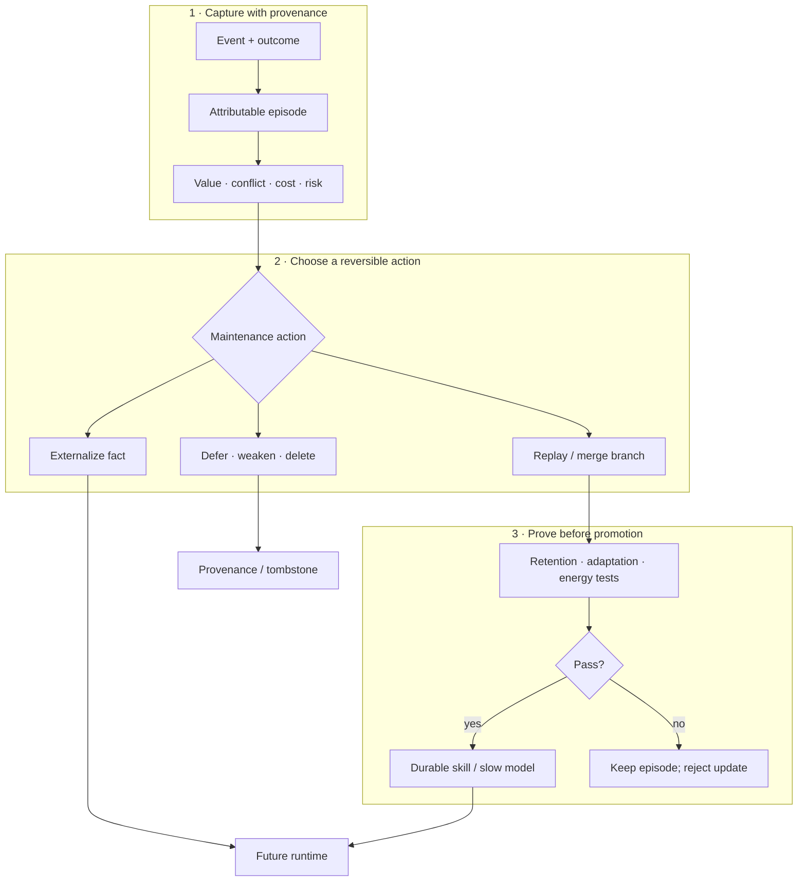
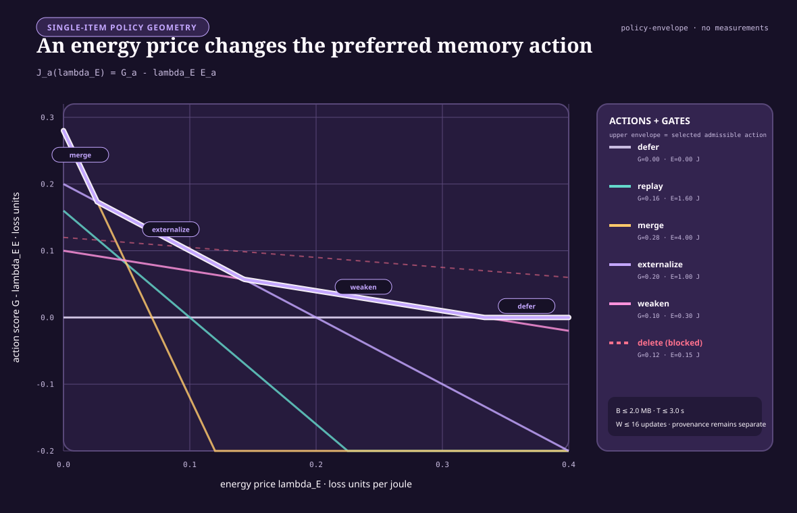
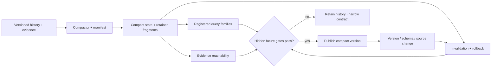
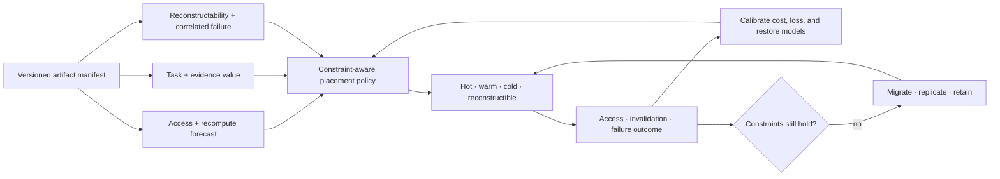
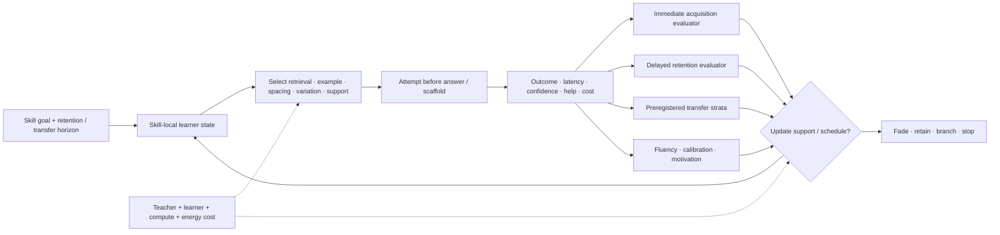

# Fast memory, replay, and consolidation

> Experience should change behavior immediately without receiving immediate
> permission to rewrite stable capability.

## Scope

Memory is a lifecycle: capture an event, preserve its origin, decide whether it
deserves more work, test an integration, then retain, transform, externalize,
weaken, or delete it. The objective is rapid adaptation without granting every
surprising event permission to rewrite stable capability.

## One memory lifecycle

Editable source:
[`../assets/diagrams/memory-lifecycle.mmd`](../assets/diagrams/memory-lifecycle.mmd).

The lifecycle separates two decisions often collapsed into “learning”:

1. **What should be remembered now?** Capture is fast, attributable, and
   reversible.
2. **What should change the durable system?** Consolidation is selective,
   tested, and budgeted.

## Biological observation

Complementary Learning Systems theory describes interacting fast hippocampal
and slower cortical learning processes ([C-008](../research/claims.md#c-008)).
The useful pattern is not only different storage speeds. It is controlled
transfer between a rapidly changing record of experience and structure whose
value depends on remaining stable.

The evidence also makes replay a selection problem:

- disrupting replay from a selected hippocampal assembly can selectively
  impair the associated rodent spatial memory
  ([C-036](../research/claims.md#c-036));
- replay allocation varies with reward, learning, familiarity, and memory
  weakness rather than following one universal priority
  ([C-037](../research/claims.md#c-037));
- existing relational structure can accelerate integration of compatible
  associations ([C-038](../research/claims.md#c-038));
- retrieval can make an established memory temporarily update-sensitive
  ([C-039](../research/claims.md#c-039)), although the exact human
  prediction-error gate remains disputed
  ([C-040](../research/claims.md#c-040)); and
- forgetting can be actively regulated by neural and glial mechanisms in
  specific preparations ([C-041](../research/claims.md#c-041),
  [C-042](../research/claims.md#c-042)).

Together they motivate a maintenance controller that allocates limited work
across capture, replay, integration, protection, and forgetting.

## Proposed AI translation

### 1. Separate stores by write authority

| Store | Update rate | Content | Normal mutation |
| --- | --- | --- | --- |
| Working state | every event | active context, goals, predictions | overwritten freely |
| Episodic store | rapid | sourced trajectories, outcomes, errors | append, expire, redact |
| Slow model | controlled | reusable representations and skills | validated consolidation |
| Factual store | independent | mutable, attributable propositions | explicit versioned update |

The separation is about authority, not hardware. A vector store, database,
recurrent state, adapter, and model weights may share a device while obeying
different write policies. One logical store may also span devices when locality
or retention requires it.

### 2. Capture evidence before abstracting it

Each episode records enough context to explain a later update:

- observation and relevant prior state;
- action, answer, or intervention;
- outcome and uncertainty;
- data and tool provenance;
- active modules and retrieved memories;
- physical telemetry; and
- privacy, retention, and safety constraints.

The episode need not contain every hidden activation. It must preserve enough
attributable evidence to reproduce, challenge, or reverse the lesson later
derived from it.

### 3. Allocate the maintenance budget

At a maintenance window, the controller estimates what each candidate action
could improve and what it would cost. Novelty, reward, uncertainty,
familiarity, conflict, interference, and schema fit are features—not
interchangeable definitions of importance.

The first controller should earn its complexity against ordinary policies:

1. uniform reservoir replay;
2. recency;
3. loss- or TD-error priority;
4. interference priority;
5. schema-fit priority; and
6. the proposed multi-signal lifecycle policy.

Every method receives the same episode bytes, replay examples, optimizer
updates, wall time, and energy boundary. This makes scheduling policy—not extra
maintenance—the independent variable.

The following single-item price envelope uses hypothetical gains and costs to
make the selection equation visible. It is not a fitted scheduler or an
empirical ranking of the listed actions.

### 4. Branch, test, then promote

Retrieval or replay opens a versioned candidate branch. It never makes the
durable state writable by itself. The branch may modify a local adapter,
module, route, representation, or factual record and is then tested for:

- retention of protected historical capability;
- acquisition of the proposed new capability;
- calibration and rare-case behavior;
- provenance and conflict handling;
- measured energy, bytes moved, and latency; and
- reversibility after rejection.

Replay and Elastic Weight Consolidation are distinct comparison mechanisms
([C-009](../research/claims.md#c-009),
[C-010](../research/claims.md#c-010)); neither is privileged as the final
protection policy.

A passed branch can merge into the slow model, remain provisional, or enter the
[maturity and structural-consolidation lifecycle](50-grokking-and-pruning.md).
A failed branch returns the episode with its negative result attached so the
same invalid integration is not proposed indefinitely.

### 5. Forgetting is an action

Unbounded retention consumes storage, retrieval bandwidth, replay capacity,
and attention. The controller therefore distinguishes:

| Action | Effect | Required safeguard |
| --- | --- | --- |
| Defer | preserve without more work | future reconsideration rule |
| Replay | spend work to test or strengthen | equal replay budget |
| Merge | compress compatible state | provenance survives compression |
| Externalize | move mutable information out of weights | source and version retained |
| Weaken | reduce retrieval or routing influence | rare-case regression probes |
| Delete | remove active state | reconstructable source or explicit retention exception |

Weakening is separate from deletion because many obsolete or interfering
memories should first lose influence while evidence accumulates. A tombstone or
provenance record prevents deleted state from becoming an unexplained absence.

### Storage contracts precede memory policy

Persistent state has several independent contracts:

| Contract | Question | Does not establish |
| --- | --- | --- |
| atomicity and recovery | which in-scope effects commit or abort after failure? | isolation, outside-effect reversal, or truth |
| isolation | which concurrent histories are visible? | real-time order or durability |
| durability | what survives acknowledged completion under the fault model? | correctness or indefinite retention |
| version visibility | which snapshot or temporal coordinate answers a read? | serializability or current-world truth |
| replication/coding | which exact bytes or log survive named faults? | independent judgment or semantic diversity |
| indexing/caching | where is a candidate copy found cheaply? | importance, authority, or source-of-truth status |
| retention/reclamation | which roots, readers, holds, and horizons keep state live? | future irrelevance or epistemic worth |

These boundaries are established by storage theory and systems evidence in
[C-325](../research/claims.md#c-325)–[C-338](../research/claims.md#c-338).
Versioning alone does not make a history serializable; a durable statement can
remain false; an agreed log can preserve a bad command; and event replay can
change meaning when handlers, schemas, configuration, nondeterministic inputs,
or outside effects are not version-compatible.

Valid time and system time remain separate. The first records when a proposition
is asserted to hold in the modeled world; the second records when the store
held that version ([C-337](../research/claims.md#c-337)). Capture, receipt,
processing, correction, and supersession may add more clocks.

### Semantic compaction has a finite preservation contract

Physical compaction preserves a declared storage view; it is not automatically
semantic consolidation ([C-334](../research/claims.md#c-334),
[C-341](../research/claims.md#c-341)). A semantic compactor may replace history
$H$ with $Z=C_\phi(H)$ only under registered query, evidence, uncertainty,
rollback, invalidation, deletion, and failure-degradation obligations.

Editable source:
[semantic-compaction-contract.mmd](../assets/diagrams/semantic-compaction-contract.mmd).

[Candidate 017](../experiments/candidates/017-contract-preserving-semantic-compaction.md)
freezes the compactor before generating hidden future queries and invalidation
requests. It compares with indexed history, snapshots plus suffix logs,
materialized views, key compaction, lossless compression, extractive evidence
summaries, and cold archives. Unsupported questions must be exposed, not filled
with invented detail.

### Placement separates access, value, and reconstructability

Recency and frequency are strong baselines, not definitions of importance
([C-333](../research/claims.md#c-333)). A rare cold artifact may still block a
safety audit, source invalidation, rollback, or recovery. Conversely, a hot
derived view may be cheap to reconstruct. The placement controller therefore
keeps access forecast, recomputation cost, task loss, evidence value, staleness,
and correlated-failure reconstructability as separately calibrated quantities.

Editable source:
[value-aware-artifact-tiering.mmd](../assets/diagrams/value-aware-artifact-tiering.mmd).

[Candidate 018](../experiments/candidates/018-value-reconstructability-aware-tiering.md)
must beat LRU/LFU, ARC, W-TinyLFU, size- and miss-cost-aware caching,
economic tiering, static optimization, and coded fault-domain placement without
future labels. Physical bytes, movement, metadata, endurance, p99 latency,
policy work, privacy, and failure costs remain inside the boundary.

### Learning is a horizon-indexed outcome vector

Immediate task success does not identify durable learning. A curriculum event
can improve acquisition while weakening delayed retention, novel transfer,
fluency, calibration, motivation, or total efficiency. The evaluator therefore
keeps those outputs separate and makes retention horizon and transfer distance
part of the claim.
The evidence boundaries are [C-627](../research/claims.md#c-627)–[C-658](../research/claims.md#c-658).

Editable source:
[horizon-qualified-learning.mmd](../assets/diagrams/horizon-qualified-learning.mmd).

For each skill, retain current acquisition estimate, retention estimates at
declared horizons, transfer by preregistered stratum, fluency/error frontier,
calibration, support/scaffold state, confusability/context, intervention
history, state version, and uncertainty. Difficulty is useful only when the
attempt is processed successfully enough to generate information; failure is
not beneficial merely because it was hard.

[Candidate 004](../experiments/candidates/004-closed-endogenous-curriculum.md)
must compare the adaptive sequence with tuned spacing, ordinary knowledge
tracing, fixed fading, hard-example mining, and fixed curricula at equal
attempt, feedback, time, storage, compute, and energy. Candidate
[019](../experiments/candidates/019-audited-cumulative-inheritance.md) must
compare interactive teaching with a versioned artifact plus tests, then measure
retention and novel transfer after actual learner/model turnover while charging
both teacher and learner effort. The
[learning-outcome mathematics](../math/learning-outcome-contract.md) defines
the common evaluator.

### 6. Follow one event through the lifecycle

Suppose a tool returns a surprising result. Working state can use it
immediately, while an attributable episode preserves the action, outcome,
uncertainty, source, and active path. The slow model does not change yet.
Related and conflicting outcomes accumulate until a maintenance window judges
the episode worth replaying. Replay opens a local branch and tests it against
protected history.

What happens next depends on the content. A reusable operation may become a
skill or provisional module. A mutable proposition belongs in factual memory.
Noise loses influence or expires under the retention policy. Later outcomes
measure whether that choice was correct and recalibrate the scheduler. This is
the feedback that turns a storage hierarchy into a lifecycle.

## Efficiency mechanism

Online operation avoids immediate full-model gradient updates. Maintenance
spends that work later and selectively, where expected future value justifies
the physical cost.

For $N_{\mathrm{served}}$ events between maintenance windows, amortized energy
per served event is

$$
\bar{E}_{\mathrm{event}}
= E_{\mathrm{online}}
+ \frac{E_{\mathrm{maintenance}}}{N_{\mathrm{served}}},
$$

where $E_{\mathrm{online}}$ is runtime energy per event in joules and
$E_{\mathrm{maintenance}}$ includes scheduler, replay, memory movement,
optimization, validation, and recovery energy in joules. A system saves energy
only when the second term remains below the online work avoided by delayed and
selective integration.

The full constrained action model—including joule, byte, second, and optimizer
update budgets—is defined in
[`../math/memory-lifecycle.md`](../math/memory-lifecycle.md).

## Evidence status

| Mechanism | Evidence | Current status |
| --- | --- | --- |
| Fast/slow learning split | C-008 | established theory and supporting results; system translation incomplete |
| Interference protection | C-009 | demonstrated in scoped sequential tasks |
| Replay for machine consolidation | C-010 | plausible mechanism with task-specific evidence |
| Content-specific replay | C-036 | established in the measured rodent intervention |
| Multi-signal replay allocation | C-037 | established constituent observations; unified policy experimental |
| Schema-sensitive integration | C-038 | established in scoped learning conditions |
| Retrieval-induced update window | C-039, C-040 | lability established narrowly; exact human mismatch gate disputed |
| Active forgetting | C-041, C-042 | established in scoped interventions; safe AI policy untested |
| Storage and temporal contracts | C-325–C-338 | mature engineered mechanisms; mandatory nulls and vocabulary |
| Semantic compaction and value-aware tiering | C-339–C-342 | held residual experiments under Candidates 017 and 018 |
| Complete lifecycle controller | none | speculative synthesis |

## Speculative extensions

- Generate counterfactual variants around high-value episodes rather than only
  replaying recorded inputs.
- Learn expected knowledge gain per joule while retaining hard resource and
  safety bounds.
- Perform module-local consolidation first and synchronize globally only when a
  cross-module invariant changes.
- Use exact checkpoints to test several consolidation outcomes in parallel and
  retain the cheapest one that passes.
- Learn memory placement jointly with replay policy so frequently paired state
  becomes physically local.

## Failure modes

- Replay amplifies biased, adversarial, or privacy-sensitive episodes.
- The scheduler starves quiet, rare, or safety-critical memories.
- A correlated shortcut is mistaken for schema compatibility.
- Generated replay drifts away from the environment.
- Retrieval becomes an adversarial write primitive.
- Weakening or deletion removes evidence later required for recovery or audit.
- A compact summary passes familiar queries but loses evidence, invalidation,
  rollback, deletion, or rare hidden-future obligations.
- A placement policy calls access frequency “importance,” leaks future value,
  or treats correlated replicas as independently reconstructible.
- Scheduler scans and telemetry consume the saved maintenance budget.
- The episodic store becomes an unbounded duplicate of the training corpus.

## Measurable predictions

1. Fast attributable memory reduces adaptation latency without increasing
   protected slow-model regression.
2. A multi-signal scheduler improves the retention–adaptation–energy frontier
   beyond uniform, recency, loss-priority, and interference-priority baselines
   at equal replay count and bytes moved.
3. Schema-compatible episodes require fewer optimizer updates to integrate than
   violations while shortcut-controlled transfer remains unchanged or improves.
4. Explicit weakening reduces obsolete-memory intrusions without exceeding the
   declared rare-case deletion bound.
5. Separating mutable propositions from reusable skills reduces correction cost
   and unsupported factual carryover.
6. Maintenance energy amortized per served event remains below the online
   training work it replaces.
7. Registered semantic compaction reduces physical bytes without reducing
   hidden-query, evidence, rollback, or invalidation coverage below threshold.
8. Value/reconstructability features improve shifted-workload artifact
   placement beyond strong cache and storage policies after migration cost.
