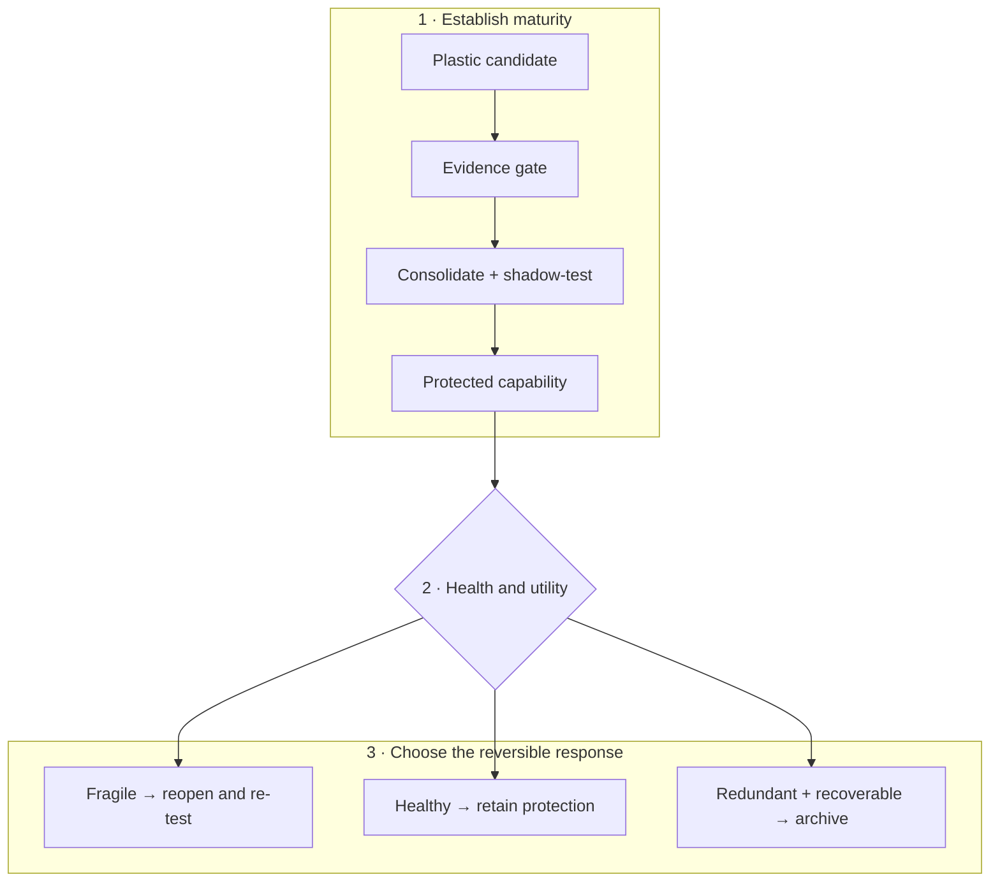

# Maturity, grokking, and reversible structural consolidation

## Scope

Define how a useful but plastic structure becomes protected, cheaper to run,
and eventually eligible for pruning—without mistaking age, low training loss,
or a grokking curve for proof of maturity.

Maturity is a lifecycle state, not a compliment. A mature module has earned a
narrower update surface because its behavior is understood inside a declared
validation envelope. That protection must remain reversible when the envelope
changes or the module becomes brittle.

## Biological observation

Development does not produce a final circuit by training every connection at a
constant rate forever. In the studied mouse retinogeniculate preparation,
relative activity and complement signaling affected microglial engulfment and
retention of developing inputs ([C-043](../research/claims.md#c-043)). The
useful abstraction is a slow maintenance process that helps refine structure
under local evidence; it is not a universal deletion rule.

Mature circuits can also carry local constraints on further change. Targeted
interventions on extracellular structure and a cholinergic brake reopened
specific forms of adult visual-cortex plasticity
([C-044](../research/claims.md#c-044),
[C-045](../research/claims.md#c-045)). Protection and plasticity are therefore
not opposite endpoints. They can be different operating states of the same
structure, controlled locally and revisited under an explicit intervention.

Two results from ecological systems sharpen the control problem. Recovery from
small perturbations slowed as one cyanobacterial microcosm approached a
controlled tipping point ([C-058](../research/claims.md#c-058)); warning
statistics also appeared during a manipulated whole-lake food-web transition
([C-059](../research/claims.md#c-059)). A system may look acceptable at rest
while its restoring dynamics weaken. Maturity therefore cannot be certified by
steady-state accuracy alone.

Nor is resilience one number. Greater species richness improved temporal
stability but reduced resistance to warming in a large ciliate-microcosm
experiment ([C-060](../research/claims.md#c-060)). In a separate microbiome
analysis, functional redundancy was associated with resistance to newcomer
engraftment ([C-057](../research/claims.md#c-057)). Stability, resistance,
recovery, and capacity to admit a better replacement can move in different
directions.

This makes grokking a useful phenomenon but a poor gate. Delayed generalization
has been observed in bounded algorithmic settings, yet the claim that extended
training reliably reveals the underlying rule and certifies readiness to prune
is disputed ([C-011](../research/claims.md#c-011)). The system needs evidence
about what a structure does, how uniquely it contributes, how it fails, and how
it recovers.

## Proposed AI translation

### A reversible maturity lifecycle

Every structurally changeable module, route, memory transform, or compiled path
has an explicit lifecycle state:

1. **Candidate:** highly plastic, attributable to its training episodes, and
   cheap to discard.
2. **Consolidating:** replayed against related, conflicting, rare, and
   intervention cases while its unique contribution is measured.
3. **Protected:** update rate and writable surface are reduced; structural
   changes require a versioned branch and shadow evaluation.
4. **Reopened:** a copy-on-write branch receives bounded adaptation while the
   protected version remains available for comparison and rollback.
5. **Retiring:** traffic is drained only after another path covers the required
   behavior and the physical execution graph can actually be compacted.
6. **Archived or removed:** provenance, validation envelope, and a reconstructable
   checkpoint remain for the declared retention period; hot execution state is
   released.

Editable source:
[`../assets/diagrams/maturity-fragility-cycle.mmd`](../assets/diagrams/maturity-fragility-cycle.mmd).

The lifecycle separates three decisions often collapsed into “pruning”:

- **protect:** this path is useful and should stop drifting;
- **reopen:** this path no longer responds adequately inside its required
  envelope; and
- **retire:** this path is no longer uniquely useful and can be removed without
  making the system irrecoverable.

Protection is not retirement. A path may be mature precisely because it is
important enough to preserve.

### Maturity is a vector gate

For module $i$, maintain a maturity record

$$
\mathbf{m}_i=
\left(Q_i,U_i,S_i,F_i,A_i,C_i,P_i\right),
$$

where:

- $Q_i$ is quality across the declared validation envelope;
- $U_i$ is unique causal contribution under ablation and rerouting;
- $S_i$ is behavioral and routing stability across time and environments;
- $F_i$ is fragility measured from recovery and margin estimates;
- $A_i$ is adaptation and newcomer-acceptance behavior under controlled shift;
- $C_i$ is full-lifecycle physical cost; and
- $P_i$ is provenance and rollback completeness.

The record remains a vector. A weighted score may rank candidates for review,
but it cannot hide a failed safety, provenance, recovery, or rollback
constraint. Thresholds are workload-specific and include uncertainty intervals;
there is no universal maturity age, pruning percentage, or recovery constant.

Protection requires evidence that the module is useful, stable, attributable,
and recoverable. Retirement reverses one condition: its *unique* contribution
must be low because another tested path covers its role. Low weight magnitude or
low average routing frequency is not enough.

### Structural consolidation before deletion

When several routes repeatedly implement the same stable computation, the
maintenance plane first tries to make their shared work explicit:

1. identify the recurrent subgraph and its boundary contract;
2. build a compact candidate through structured pruning, distillation,
   compilation, quantization, fusion, or relocation;
3. replay both common and conflicting cases through old and new graphs;
4. intervene on each source module to measure residual unique behavior;
5. shadow the compact path under live-like traffic;
6. drain old routes gradually while keeping rollback state; and
7. release tensors, optimizer state, routing entries, and communication only
   after the observation window passes.

Iterative pruning can reveal competitive sparse subnetworks in its tested
settings ([C-012](../research/claims.md#c-012)). Here it is one operator inside
the lifecycle, not the lifecycle policy itself. Magnitude pruning is a baseline;
causal coverage and end-to-end physical savings decide promotion.

### Reopening without overwriting the canonical path

A protected path is reopened only after a persistent signal, such as:

- calibrated error or intervention failure outside its historical variance;
- recurring novelty that existing candidates cannot absorb without
  interference;
- loss of recovery margin despite acceptable steady-state quality;
- repeated rollback or escalation around the same boundary; or
- evidence that protected redundancy prevents a superior newcomer from
  receiving a fair evaluation.

Reopening creates a branch. It does not make the canonical path globally
writable. The branch receives a declared update, data, compute, and duration
budget; the protected version continues on control traffic. The branch becomes
canonical only after retention, calibration, intervention, cost, and recovery
tests. Otherwise the branch is discarded and the trigger is retained as an
unresolved event.

### Recovery dynamics as a maturity signal

Snapshots answer whether a module is currently inside its envelope. Recovery
dynamics ask how strongly it returns after a small displacement. The
maintenance plane should begin with passive fluctuation analysis. If the state
is a shadow or replica and the service budget permits it, a bounded probe can
estimate return time or a local stability margin.

The proposed Stage-1 test is
[Candidate 003](../experiments/candidates/003-recovery-dynamics-fragility.md).
It compares bounded recovery probes with SLO dashboards, queueing headroom,
change detection, passive autoregressive estimates, and standard active system
identification under equal budgets. If ordinary system identification performs
as well, the system should use it; the design requirement is visibility into
restoring dynamics, not a special biological estimator.

Recovery is only one axis. A maturity record should expose at least:

| Dimension | Question | Example measure |
| --- | --- | --- |
| temporal stability | Does behavior fluctuate under a stationary regime? | quality variance per event |
| acute resistance | How far does quality fall during a bounded perturbation? | maximum quality loss, fraction |
| recovery | How quickly and completely does behavior return? | return time, s or events |
| adaptability | How much work is required to learn a valid new regime? | updates, examples, and J |
| newcomer acceptance | Can a better candidate receive traffic and prove itself? | time to useful routing share, s |
| rollback | Can the prior behavior be restored after a failed change? | success fraction and lost work |
| reserve | What capacity remains for unexpected demand or repair? | bytes, W, routing slots, or RE/s |

These quantities must be reported separately before any aggregate resilience
score is computed.

## Efficiency mechanism

Maturity can reduce recurring work in four places:

- protected modules need fewer parameter writes, optimizer states, and global
  synchronization events;
- stable routing can use smaller decision surfaces and better placement;
- recurring subgraphs can become fused, quantized, compiled, or cached paths;
  and
- retirement can release whole tensors, memory pages, routing entries, and
  network transfers.

The benefit is physical only when the runtime uses the new structure. Zero
weights inside a dense kernel and dormant experts that are still loaded or
synchronized do not count as structural consolidation.

For a proposed consolidation serving $N$ future events, let
$E_{\text{run,after}}$ and $E_{\text{run,before}}$ be steady runtime energy in
joules per served event. Let $E_{\text{consolidate}}$,
$E_{\text{validate}}$, $E_{\text{probe}}$, and $E_{\text{migrate}}$ be
one-time energies in joules, let $\mathbb{E}[E_{\text{recovery}}]$ be expected
recovery energy in joules including failed branches, and let $N$ be a
dimensionless future-event count. Compare amortized energy per event:

$$
\bar E_{\text{after}}
= E_{\text{run,after}}
+\frac{
E_{\text{consolidate}}+E_{\text{validate}}+E_{\text{probe}}
+E_{\text{migrate}}+\mathbb{E}[E_{\text{recovery}}]
}{N},
$$

against $\bar E_{\text{before}}=E_{\text{run,before}}$. The one-time numerator
divided by $N$ and both runtime terms are joules per event, so the comparison is
dimensionally closed. Storage, data movement, tail latency, quality,
calibration, and risk remain separate constraints rather than being silently
converted into energy.

A consolidation advances only if its observation horizon is long enough that
$\bar E_{\text{after}}<\bar E_{\text{before}}$ and it improves or preserves the
declared quality–risk–latency–resilience frontier. The expected recovery term
must include failed branches and rollback, not only successful releases.

## Evidence status

| Element | Status | What it supports here |
| --- | --- | --- |
| delayed generalization as universal maturity certificate ([C-011](../research/claims.md#c-011)) | disputed | grokking cannot be the gate |
| competitive sparse subnetworks ([C-012](../research/claims.md#c-012)) | established in tested settings | staged pruning is a valid operator, not a universal policy |
| activity-sensitive developmental refinement ([C-043](../research/claims.md#c-043)) | established in the cited preparation | a slower maintenance process can participate in structural contraction |
| reopening mature plasticity ([C-044](../research/claims.md#c-044), [C-045](../research/claims.md#c-045)) | established in the cited preparations | protection can be local and reversible under intervention |
| redundancy and newcomer engraftment ([C-057](../research/claims.md#c-057)) | plausible association | stability may obstruct beneficial replacement |
| recovery warning signals ([C-058](../research/claims.md#c-058), [C-059](../research/claims.md#c-059)) | established in scoped ecological systems | restoring dynamics are worth testing as a fragility signal |
| multidimensional stability tradeoff ([C-060](../research/claims.md#c-060)) | established in the cited microcosms | resilience dimensions must remain separate |
| complete digital lifecycle controller | speculative synthesis | requires isolated and composed experiments |

## Speculative extensions

- Learn a lifecycle policy from logged promotion, rollback, and recovery
  outcomes while retaining hard provenance and safety constraints.
- Preserve cheap seed capacity outside the hot graph so retirement does not
  eliminate the ability to specialize under a future regime.
- Distill a coalition into a compact composite module, then retain the sources
  in a cold checkpoint until the composite survives a full recurrence cycle.
- Let recovery margin determine degrees of protection: lower update rate,
  narrower writable interfaces, or more stringent branch validation.
- Use capability-gap analysis to decide whether a failing mature module should
  reopen, be complemented by a newcomer, or retire.
- Reuse mature relational structure as a prior for faster consolidation while
  routing violations to a longer validation path.

## Failure modes

- **False maturity:** a shortcut is stable on average and is protected before
  compositional, rare-event, or intervention tests expose it.
- **Brittle maturity:** quality remains inside its SLO while return time grows
  and the structure loses restoring margin.
- **Maturity monopoly:** protected redundant modules absorb all traffic and
  prevent a better newcomer from establishing evidence.
- **Rare-function erasure:** average routing and magnitude tests delete a path
  whose unique role appears only in a low-frequency or safety-critical regime.
- **Reopening thrash:** noisy triggers repeatedly create branches, retraining
  cost, and routing churn without a durable regime change.
- **Rollback rot:** checkpoints exist but dependencies, data schemas, or routing
  contracts have changed enough that restoration no longer works.
- **Cosmetic sparsity:** parameter count falls while bytes moved, kernel work,
  synchronization, and wall energy do not.
- **Maintenance inversion:** replay, probes, shadow traffic, migration, and
  regression testing consume more energy than mature execution saves.
- **Scalar resilience:** one score declares success while acute resistance,
  recovery, adaptability, or newcomer acceptance has deteriorated.
- **Causal misattribution:** a correlated low-usage path is pruned even though
  it stabilizes another module or handles a hidden confound.

## Measurable predictions

1. A vector maturity gate using causal contribution and cross-context tests
   preserves rare and intervention performance better than fixed schedules,
   magnitude pruning, or training-loss thresholds at matched retained capacity.
2. Protected modules require fewer update joules and suffer less interference
   than continuously plastic modules, while branch-based reopening reaches a
   valid new regime with less regression than full unfreezing.
3. Recovery features identify some hidden loss of stability margin before
   steady-state SLOs. They remain in the architecture only if they add value
   beyond passive monitoring and standard system identification at matched
   probe and compute cost.
4. Structured consolidation lowers parameter bytes resident, bytes moved per
   event, communication, and measured joules together. Parameter reduction
   without those physical changes is rejected.
5. Increasing redundancy improves some stability dimensions while degrading
   adaptation or newcomer admission in at least one controlled regime; the raw
   resilience vector reveals the tradeoff that a scalar score hides.
6. Copy-on-write reopening plus rollback reduces catastrophic update loss
   relative to in-place adaptation after monitoring, checkpoint, and shadow
   costs are counted.
7. Consolidation produces a net lifecycle energy benefit only above a measurable
   reuse horizon $N$; below that horizon, leaving the computation plastic or
   interpreted is cheaper.
