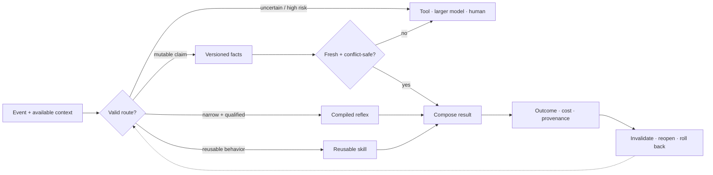

# Hardening, reflex paths, and factual memory

> Repeated transformations, reusable skills, and mutable propositions require
> different execution, update, and recovery contracts.

## Scope

This chapter defines the boundary between five runtime outcomes:

1. a **compiled reflex path** executes a narrow, qualified transformation;
2. a **reusable skill** handles variable situations without embedding volatile
   propositions in its parameters;
3. **versioned factual memory** supplies mutable claims with provenance and
   validity state;
4. **escalation** sends an unresolved or high-risk event to a more capable
   model, tool, or human; and
5. **rollback** restores a last-known-good path or record after invalidation.

Hardening is a promotion decision, not a synonym for freezing. Every promoted
artifact retains an applicability envelope, version, owner, regression set,
physical cost record, invalidation policy, and recovery target.

## Runtime paths and recovery

Editable source:
[`../assets/diagrams/hardening-memory-paths.mmd`](../assets/diagrams/hardening-memory-paths.mmd).

The gate selects authority, not merely compute. A reflex may execute but cannot
silently update a fact. A retrieved record may inform an answer but cannot
rewrite a skill. An escalated result enters durable state only through the
ordinary memory and consolidation lifecycle.

## Biological observation

Biological and computational evidence supports separating rapid acquisition
from slower integration ([C-008](../research/claims.md#c-008)). Retrieval can
also make an established memory temporarily update-sensitive in a scoped
preparation ([C-039](../research/claims.md#c-039)), while prediction error is
disputed as a precise general trigger for that transition
([C-040](../research/claims.md#c-040)). Separate intervention studies show that
mature constraints can be reopened under specific conditions
([C-044](../research/claims.md#c-044),
[C-045](../research/claims.md#c-045)).

The transferable requirements are multiple update timescales, guarded
promotion, local reopening, and recoverable versions. The compiled path,
factual schema, and escalation protocol below are engineering mechanisms tested
against conventional systems.

## Proposed AI translation

### Five distinct contracts

| Path | Stores | May do | Must not do |
| --- | --- | --- | --- |
| Compiled reflex | a narrow transformation, guard, and version | return a bounded result or action at low dispatch cost | answer outside its envelope or contain independently mutable facts |
| Reusable skill | a representation, policy, or parameterized transformation | generalize and compose across qualified contexts | present volatile propositions as current without retrieval |
| Factual memory | typed propositions and source relations | retrieve, supersede, dispute, revoke, or expire records | become true merely because retrieval ranked it highly |
| Escalation | no durable knowledge by itself | obtain more evidence or computation under a declared budget | bypass provenance, access, or promotion rules |
| Rollback | last-known-good versions, tombstones, and recovery metadata | restore routing and reconstruct prior state | erase the failed version or its affected-output trace |

### Compiled reflex paths

A compiled reflex is a versioned executable graph $h$ with:

- an input and output schema;
- a validity predicate $G_h(x,\mathcal I_t)\in\{0,1\}$;
- a declared applicability envelope $\mathcal A_h$;
- a deterministic or bounded-stochastic execution contract;
- a protected regression and adversarial set;
- a fallback route and last-known-good version; and
- a manifest for precision, kernels, placement, dependencies, and measured
  physical cost.

Here $x$ is one event, $\mathcal I_t$ is the information available at decision
time $t$, $G_h$ is dimensionless, and $\mathcal A_h$ names the permitted input,
environment, dependency, and risk strata. The runtime may dispatch $h$ only
when $G_h=1$ and every dependency version remains valid. Guard evaluation is
part of the path's latency, energy, and error budget.

Suitable candidates include parsing a fixed protocol, executing a stable local
control law, applying a verified transform, or serving a repeatedly observed
low-risk subgraph. Ordinary code, rules engines, memoization, and compiler
optimization remain the first alternatives. A learned compiler is useful only
if its generated guard and path outperform those alternatives under the same
coverage and recovery requirements.

### Compilation across physics

A mature reflex can also be stored in geometry, compliance, an analog transfer
function, a physical reservoir, or a reprogrammable material state. Demonstrated
components include passive task-specific dynamics
([C-112](../research/claims.md#c-112)), soft-body and physical-reservoir memory
([C-113](../research/claims.md#c-113), [C-114](../research/claims.md#c-114)),
mechanical logic and physical learning ([C-115](../research/claims.md#c-115),
[C-116](../research/claims.md#c-116)), and local material repair
([C-120](../research/claims.md#c-120)). These observations extend the set of
possible deployment substrates; they do not bypass the qualification gates.

The held systems candidate is a rewritable physical path whose input and output
remain locally coupled to the environment, while a versioned digital shadow
preserves its specification, protected tests, calibration envelope, fallback,
and output trace. The path is admitted only while health probes remain inside
that envelope. Drift or damage returns authority to the digital path before a
new substrate state is programmed and shadow-validated.

This path competes first with tuned passive mechanics, analog control, and
FPGA/ASIC implementation, not only with an inefficient general model. Its
lifecycle boundary includes design, fabrication, programming, drive,
conversion, readout, reset, calibration, maintenance, fallback, repair, failed
devices, and retirement. [Candidate 006](../experiments/candidates/006-reversible-physical-skill.md)
tests whether a measured conversion, transport, recurrence, or command path is
actually removed and whether break-even occurs before the qualified substrate
lifetime ends.

### Reusable skills

A reusable skill is broader than a reflex. It accepts variable inputs, may
consult current context or memory, and is evaluated for transfer outside the
episodes that created it. It normally remains a slow-model module, adapter,
tool policy, or callable subgraph.

Skill qualification asks whether the artifact preserves a reusable relation or
operation. A proposition such as a price, office holder, software version, or
medical recommendation is not a skill: its truth can change while the method
used to retrieve, compare, or explain it remains valid. If a skill emits a
mutable proposition, the output record must identify which factual version
supplied it.

A skill may later receive structured pruning or quantization. Iterative pruning
is evidence for competitive sparse subnetworks only in its tested settings
([C-012](../research/claims.md#c-012)). Ternary-weight language models are a
plausible candidate under [C-013](../research/claims.md#c-013); promotion still
depends on end-to-end quality, risk, latency, bytes, and joules on the project
workload.

### Qualification gates

Promotion is conjunctive: a candidate fails when any hard gate fails.

| Gate | Required record | Reject when |
| --- | --- | --- |
| Semantic class | reflex, skill, or factual record with one owner | the artifact mixes a stable transform with independently mutable claims |
| Applicability | schemas, $\mathcal A_h$, guard $G_h$, dependency versions | the guard cannot abstain before an out-of-envelope execution |
| Quality and risk | metrics by common, rare, safety, and shift stratum | average quality hides a stratum outside its tolerance |
| Causal contribution | ablation, reroute, and ordinary-code comparison | a cache, rule, smaller model, or router explains the gain |
| Physical accounting | guard, dispatch, execution, movement, idle, build, validation, and recovery costs | savings exist only in FLOPs or omit lifecycle work |
| Reversibility | immutable candidate version, atomic route switch, last-known-good target, rollback drill | prior behavior cannot be restored inside the recovery envelope |
| Provenance | source episodes, code/data versions, tests, approver, and artifact digest | the artifact or its qualification result cannot be reconstructed |

For candidate path $h$ and baseline $b$, let $Q_h$ and $Q_b$ be task quality in
one declared unit, $R_h$ and $R_b$ be risk in one declared unit, and
$\epsilon_Q$ and $\epsilon_R$ be preregistered tolerances in those respective
units. Let $p_{\mathrm{FA},h}$ be the dimensionless fraction of
out-of-envelope events incorrectly admitted by $G_h$, and let
$\alpha_{\mathrm{FA}}$ be its maximum permitted value. Qualification requires

$$
Q_h \ge Q_b-\epsilon_Q,
\qquad
R_h \le R_b+\epsilon_R,
\qquad
p_{\mathrm{FA},h}\le\alpha_{\mathrm{FA}}.
$$

These conditions are evaluated by stratum as well as in aggregate. A guard that
rejects almost everything is exposed by reporting its coverage
$c_h=N_{G_h=1}/N_{\mathrm{offered}}$, a dimensionless fraction. Coverage is a
result, not a target inferred after testing; $N_{G_h=1}$ and
$N_{\mathrm{offered}}$ are event counts.

### Reversible verification before commitment

Kinetic proofreading shows that recognition and commitment can be separated
by driven intermediate states with discriminatory rejection and reset
([C-159](../research/claims.md#c-159)). Its speed, error, and dissipation costs
form a model-specific frontier rather than a universal accuracy multiplier
([C-160](../research/claims.md#c-160)). The systems translation therefore has
four hard requirements:

1. temporary execution remains inside a declared rollback boundary;
2. the later verifier adds conditional information or a distinct detector;
3. rejected attempts, reset, delay, and provenance remain in the cost ledger;
4. irreversible authority is withheld until commitment.

For observations $z_1,\ldots,z_t$, the strongest statistical null conditions on
the evidence already seen:

$$
L_t=\sum_{i=1}^{t}
\log\frac{p(z_i\mid R,z_{<i})}{p(z_i\mid W,z_{<i})}.
$$

Here $L_t$ is the dimensionless cumulative log-likelihood ratio, $R$ and $W$
denote correct/safe and wrong/unsafe hypotheses, and $z_{<i}$ is prior evidence.
Ignoring that conditioning turns correlated rechecks into false confidence.

[Candidate 010](../experiments/candidates/010-reset-coupled-staged-verification.md)
tests reversible execution and risk-conditioned verification against this
sequential test, calibrated cascades, abstention, retries, redundant verifiers,
and error-detecting codes. It must tie or lose when the later stage is only a
correlated copy or when reset leaks irreversible effects.

### Graded assurance envelopes

Qualification records must state what kind of assurance each result provides.
The classes are not interchangeable:

| Assurance class | Supports | Does not establish |
| --- | --- | --- |
| type, refinement, or proof | a named property under declared semantics and trusted base | termination, unspecified behavior, security, task quality, or truth |
| effect description | operations the model may perform under the analysis | authority to perform them or their correctness |
| capability grant | enforced authority inside a complete-mediation boundary | intent, competence, or safe outcome |
| empirical evaluation | behavior on declared data, environment, slices, and uncertainty | untested distributions or future versions |
| runtime monitor | a verdict over observed events under one temporal formula | unobserved channels or arbitrary future behavior |
| provenance | artifact identity and derivation path | source truth or claim entailment |
| transaction or compensation | recovery of participating state or a declared compensating action | reversal of time, disclosure, physical effects, or third-party actions |

These boundaries are established in scoped programming-language and systems
results: type soundness ([C-145](../research/claims.md#c-145)), effects versus
capabilities ([C-148](../research/claims.md#c-148)), runtime-monitor scope
([C-152](../research/claims.md#c-152)), transactional rollback limits
([C-154](../research/claims.md#c-154)), and provenance without truth
([C-156](../research/claims.md#c-156)).

The held synthesis binds every assurance record to the same module version,
artifact digest, dependency graph, state migration, authority policy, monitor
schema, evidence set, and invalidation triggers. A dependency change rechecks
only its affected cone, but stale assurance escaping to production and
unnecessary rechecks are both measured. [Candidate 009](../experiments/candidates/009-graded-assurance-envelopes.md)
compares this envelope against a complete conventional stack of typed APIs,
sandbox/IAM, CI and static analysis, runtime policy monitoring, lineage,
canaries, transactions, schema migration, and build-system invalidation.

### Compromise-bounded authority and recovery

The security contract adds an adversary and trust boundary without collapsing
distinct stages. Authentication establishes a scoped protocol property;
authorization grants an action; detection classifies telemetry; containment
blocks covered future use; and recovery re-establishes declared invariants from
a tested root. None substitutes for the next
([C-250](../research/claims.md#c-250),
[C-262](../research/claims.md#c-262),
[C-265](../research/claims.md#c-265)).

For capability class $j$, let $g_j$ and $r_j$ be its grant and effective
revocation times in seconds, and let $w_j$ be a declared dimensionless severity
weight. Authority exposure is

$$
X_A=\sum_j w_j\max(0,r_j-g_j),
$$

with unit weighted-capability-seconds. The weights and individual intervals
remain visible because a single broad destructive capability is not equivalent
to many harmless reads. Sensitivity to plausible weights is reported.

Nominal credential lifetime is not the revocation result. If
$t_{\mathrm{comp}}$ is the bounded compromise time and
$t_{\mathrm{last}}$ is the last acceptance at every covered enforcement point,
then

$$
W_{\mathrm{rev}}=\max(0,t_{\mathrm{last}}-t_{\mathrm{comp}})
$$

is revocation exposure in seconds. Sessions, caches, delegation, offline
verifiers, propagation delay, clock rollback, and missing acknowledgements are
part of the measurement ([C-260](../research/claims.md#c-260)). The incident
record keeps four clocks separately: compromise interval, detection,
effective containment, and independently validated recovery.

The held profile binds principal and workload identity, capability scope,
credential/key/attestation epoch, revocation freshness, approval-domain
independence, observation age, adversary model, compromise horizon, and clean-
root evidence to the same versioned artifact. It survives only if
[Candidates 009](../experiments/candidates/009-graded-assurance-envelopes.md)
and [012](../experiments/candidates/012-latency-qualified-authority.md) reduce
harm or secure recovery time beyond mature short-lived IAM and a rehearsed
reimage–rotate–validate workflow at equal lifecycle cost.

### Versioned factual memory

A factual record $r$ contains at least

$$
r=(k,v,u,s,v_s,t_{\mathrm{obs}},[t_{\mathrm{from}},t_{\mathrm{to}}),
v_r,\pi,\sigma),
$$

where:

- $k$ is a typed key or subject–predicate identifier;
- $v$ is the typed value and $u$ is its declared unit, or `none` for a
  unitless value;
- $s$ is the source identifier and $v_s$ its source version;
- $t_{\mathrm{obs}}$ is the observation timestamp;
- $[t_{\mathrm{from}},t_{\mathrm{to}})$ is the asserted validity interval;
- $v_r$ is the immutable record version;
- $\pi$ is the access, retention, and jurisdiction policy; and
- $\sigma\in\{\text{active},\text{superseded},\text{revoked},
  \text{disputed}\}$ is record status.

Timestamps use UTC with declared resolution. Differences between timestamps
are reported in seconds. A record may also carry source-supplied confidence or
a calibrated probability, always dimensionless and never substituted for
source identity or conflict handling.

Let $t_{\mathrm{check}}$ be the last successful source check and let $\tau_k$
be the maximum unchecked age for key class $k$ in seconds. At query time $t$,
the freshness gate is

$$
F(r,t)=
\mathbb{1}[\sigma=\text{active}]
\mathbb{1}[t_{\mathrm{from}}\le t<t_{\mathrm{to}}]
\mathbb{1}[0\le t-t_{\mathrm{check}}\le\tau_k].
$$

$F(r,t)$ is dimensionless. The domain policy fixes $\tau_k$ before evaluation;
an unbounded value is permitted only when the domain explicitly defines the
record as non-expiring. Freshness means that the record passed its time and
status policy, not that its proposition is correct.

For a key $k$, the conflict set $\mathcal C_k(t)$ contains active, policy-
admissible records whose values cannot simultaneously hold at time $t$.
Resolution may use an explicit source-authority rule, a time rule, or a
domain-specific adjudicator. The system preserves losing records and the
resolution trace. When no preregistered rule applies, the retrieval path
abstains and escalates rather than averaging incompatible values.

Retrieval-augmented generation establishes that parametric generation can be
combined with inspectable and replaceable non-parametric memory on evaluated
knowledge-intensive tasks ([C-014](../research/claims.md#c-014)). This chapter
adds version, freshness, conflict, and lifecycle accounting as requirements to
test, not as evidence that retrieval is automatically correct.

### Invalidation and rollback

Invalidation is triggered by any of the following observable events:

- an input-schema, dependency, tool, hardware, or source version changes;
- a validity interval or freshness allowance expires;
- a protected regression, shift probe, calibration check, or outcome fails;
- an authoritative source revokes or supersedes a record;
- a new admissible record creates an unresolved conflict; or
- guard false admissions, fallbacks, or escalations exceed their declared
  control limits.

The response depends on the artifact:

| Artifact | Immediate action | Durable action |
| --- | --- | --- |
| Compiled reflex | atomically route new events to the last-known-good path | preserve failed binary, manifest, traces, and invalidation cause |
| Reusable skill | freeze the active version and open a copy-on-write branch | replay, validate, reconsolidate, or retire through maintenance |
| Factual record | remove the version from active retrieval and append a tombstone or dispute edge | retain prior values and rebuild an index version without destructive overwrite |
| Escalation policy | fall back to the conservative route and cap further delegated work | recalibrate on logged false admission, miss, cost, and outcome data |

Every served output records the path, model, dependency, and factual versions
that affected it. This makes the affected-output set enumerable after a defect.
Report rollback time $T_{\mathrm{rb}}$ in seconds, rollback energy
$E_{\mathrm{rb}}$ in joules at the declared boundary, lost or corrected events
$N_{\mathrm{loss}}$ as a count, and restoration success as a dimensionless
fraction.

### Severity-ordered containment and triage

Rollback is one response to one fault contract. A stateful modular system also
needs to keep the following actions distinct:

1. **Sense:** collect health evidence without treating a detector output as
   fault ground truth.
2. **Contain:** throttle inputs, revoke an interface, quarantine a route, or
   freeze a version to limit spread before diagnosis completes.
3. **Triage:** choose retry, local repair, selective reconstruction, restart,
   retirement, or replacement from the available evidence and declared cost.
4. **Verify:** test the affected behavior, protected rare behavior, provenance,
   and adjacent modules before restoring authority.
5. **Escalate:** move to a more destructive action only when verification fails
   or stronger evidence makes delay unsafe.
6. **Replenish:** restore validated capacity when a component is retired, rather
   than allowing maintenance to clean the system into capacity collapse.

The biological audit supplies scoped examples of fast load shedding
([C-087](../research/claims.md#c-087)), repair-versus-degradation triage
([C-090](../research/claims.md#c-090)), tag-dependent compartment routing
([C-091](../research/claims.md#c-091)), selective extraction
([C-092](../research/claims.md#c-092)), repair before removal
([C-094](../research/claims.md#c-094)), and removal coupled to replacement
([C-095](../research/claims.md#c-095), [C-096](../research/claims.md#c-096)).
The order is conditional: a rapidly spreading irrecoverable fault may require
immediate replacement, while a local reversible fault should not trigger a
global rebuild.

The engineering value of the composition remains unproven. Circuit breakers,
taint tracking, checkpoints, replica failover, microreboots, scrubbing,
rejuvenation, and Bayesian repair/replace policies are mandatory comparators.
[Candidate 005](../experiments/candidates/005-severity-ordered-containment.md)
tests the staged policy across locality, observability, repairability, and
correlated detector error while charging sensing, reserve, copying,
replacement, verification, downtime, and collateral loss.

### Escalation is a budgeted route

Escalation activates when the local guard abstains, required facts are stale or
conflicted, the event enters a protected risk stratum, or the available path
cannot meet its quality contract. The escalation target may be a larger model,
a deterministic tool, an authoritative data source, or a human.

The request carries the triggering uncertainty, attempted path and versions,
relevant evidence, allowed data disclosure, deadline, and remaining energy or
financial budget. Its result returns with provenance and observed cost.
Escalation does not grant write authority; durable change still requires a
versioned maintenance action.

## Efficiency mechanism

### Per-event and lifecycle accounting

For path version $h$ serving $N$ qualified events, define amortized energy

$$
e_h(N)=e_{\mathrm{guard}}+e_{\mathrm{dispatch}}+e_{\mathrm{execute},h}
+\frac{E_{\mathrm{build},h}+E_{\mathrm{validate},h}
+E_{\mathrm{migrate},h}+\mathbb{E}[E_{\mathrm{rollback},h}]}{N}.
$$

Lowercase $e$ terms are measured joules per qualified event. Capital $E$ terms
are one-time joules at the same device, node, cluster, or facility boundary;
$\mathbb{E}[E_{\mathrm{rollback},h}]$ includes failed promotions weighted by
their observed or preregistered probability. $N$ is a dimensionless event
count, so $e_h(N)$ is joules per qualified event. If the deployment horizon is
unknown, report the break-even event count rather than assuming amortization.

For event $x$, end-to-end latency is

$$
\ell_h(x)=\ell_{\mathrm{guard}}(x)+\ell_{\mathrm{dispatch}}(x)
+\ell_{\mathrm{execute},h}(x),
$$

with every $\ell$ term in seconds. Report the empirical end-to-end percentile
$L_{h,p}$ for a declared percentile $p\in(0,1)$ rather than adding separately
measured component percentiles. Report physical traffic $B_h$ in bytes per
qualified event across each named boundary. Energy, latency, and bytes remain
separate results.

The execution term expands by path:

| Path | Costs that must be visible |
| --- | --- |
| Compiled reflex | guard, dispatch, code and state loads, kernel execution, cache residency, precision conversion |
| Reusable skill | routing, parameter and activation movement, inference, memory/tool calls, synchronization |
| Factual memory | query encoding, index access, retrieval, reranking, freshness/conflict checks, evidence bytes, composition |
| Escalation | failed local attempt, serialization, network, remote or tool execution, waiting time; human time reported separately |
| Rollback reserve | retained versions, manifests, index generations, route switch, replay, correction, recovery validation |

A candidate advances only when quality and risk remain qualified and it improves
the preregistered energy–latency–traffic frontier after all listed costs are
included. Skipped model operations alone are insufficient.

### Provenance and freshness measurements

For $N_f$ outputs that use factual memory and $N_p$ of those outputs carrying a
complete record-to-source trace, provenance coverage is

$$
C_{\mathrm{prov}}=\frac{N_p}{N_f}.
$$

$C_{\mathrm{prov}}$ is dimensionless. Also report source-check age in seconds,
stale-use and unresolved-conflict rates as fractions, index and evidence bytes,
joules per lookup and update, and p50/p95 lookup latency in seconds.

If a source changes at $t_{\mathrm{source}}$ and the first correctly served
version is available at $t_{\mathrm{serve}}$, correction latency is

$$
T_{\mathrm{corr}}=t_{\mathrm{serve}}-t_{\mathrm{source}}
$$

in seconds. Record source polling or event-delivery cost alongside this value;
instant correction purchased by continuous high-cost polling is not free.

## Strongest null models

All nulls receive the same task stream, factual sources, safety policy, hardware
opportunity, and lifecycle horizon.

| ID | Null | Required comparison |
| --- | --- | --- |
| N0 | full capable model on every event | tests whether any dispatch hierarchy beats unconditional execution |
| N1 | calibrated early exit or static small/large cascade | tests ordinary adaptive depth under [C-004](../research/claims.md#c-004) |
| N2 | conventional rules engine, compiler, or memoization cache with TTL | tests whether a compiled reflex adds more than established software practice |
| N3 | separately trained smaller, distilled, or quantized model | tests whether path specialization beats a simpler fixed deployment |
| N4 | parametric-only knowledge with scheduled fine-tuning | tests factual correction cost, carryover, and provenance |
| N5 | strong hybrid-search RAG with reranking, citations, and ordinary freshness filters | tests whether version/conflict machinery improves the factual frontier |
| N6 | in-place skill update with checkpoint restore | tests copy-on-write promotion and rollback overhead against standard recovery |
| N7 | calibrated risk/confidence threshold using the same escalation target | tests whether the structured guard adds value beyond a scalar threshold |
| N8 | encoded redundancy, replica/quorum recovery, integrity scrub, or self-stabilizing legitimate-set repair | tests whether established exact or rule-encoded reconstruction dominates learned recovery under the declared fault model |
| N9 | circuit breaker, static isolation, microrestart, rejuvenation, or Bayesian repair/replace policy | tests whether ordered containment and triage add value beyond mature fault-management composition |

If ordinary code or a standard data system matches the candidate, keep the
conventional mechanism and retain only the qualification and accounting
contract.

## Evidence status

| Mechanism | Evidence | Status for this chapter |
| --- | --- | --- |
| adaptive early exit | [C-004](../research/claims.md#c-004) | established on evaluated BERT tasks; shift and rare-risk gating open |
| fast acquisition versus slow integration | [C-008](../research/claims.md#c-008) | plausible architectural separation; exact tiers unvalidated |
| structured consolidation and pruning | [C-012](../research/claims.md#c-012) | established in scoped experiments; physical saving not automatic |
| ternary-weight models | [C-013](../research/claims.md#c-013) | plausible preprint evidence; project workload and full energy unresolved |
| parametric plus non-parametric memory | [C-014](../research/claims.md#c-014) | established on evaluated RAG tasks; freshness and conflict remain open |
| retrieval-sensitive updating | [C-039](../research/claims.md#c-039), [C-040](../research/claims.md#c-040) | scoped observation; precise general mismatch gate disputed |
| reversible mature constraint | [C-044](../research/claims.md#c-044), [C-045](../research/claims.md#c-045) | scoped biological intervention; digital rollback contract experimental |
| exact restore, encoded repair, failure detection, and integrity scrubbing | [C-079](../research/claims.md#c-079)–[C-085](../research/claims.md#c-085) | established engineering nulls under explicit fault and cost models |
| constraint-guided functional reconstruction | [C-086](../research/claims.md#c-086) | speculative residual candidate for semantic or capability loss without a clean exact state |
| load shedding, tagged routing, selective extraction, repair/removal ordering, and replacement feedback | [C-087](../research/claims.md#c-087)–[C-096](../research/claims.md#c-096) | scoped cellular mechanisms; the composed systems policy remains a held candidate |
| morphology, physical reservoirs, mechanical memory/logic, local assembly, and material healing | [C-112](../research/claims.md#c-112)–[C-120](../research/claims.md#c-120) | established in scoped substrates; end-to-end advantage over passive, analog, FPGA/ASIC, and digital nulls remains workload-specific |
| reversible physical skill compilation | [C-121](../research/claims.md#c-121) | speculative lifecycle systems hypothesis tested by Candidate 006 |
| types, contracts, effects, capabilities, proof checking, static analysis, runtime monitoring, transactions, hot update, and provenance | [C-145](../research/claims.md#c-145)–[C-156](../research/claims.md#c-156) | established scoped assurance classes with explicit trusted bases and invalidation boundaries |
| versioned graded assurance envelopes | [C-157](../research/claims.md#c-157) | speculative systems composition tested by Candidate 009 |
| automatic reflex discovery and qualification | none | speculative until it beats the null models above |

## Speculative extensions

- Train a compiler to propose a small executable graph, applicability predicate,
  counterexample set, and rollback manifest as one candidate artifact.
- Learn source-check schedules from update hazard and consequence while keeping
  hard maximum ages for protected domains.
- Compile stable *relations* learned across factual versions while leaving the
  current proposition external and attributable.
- Use signed provenance graphs so a correction can enumerate dependent outputs,
  cached artifacts, and downstream derived records.
- Co-design path placement and precision with hardware only after the logical
  qualification gate passes on a conventional substrate.

## Failure modes

| Failure signature | Observable measure | Required response |
| --- | --- | --- |
| guard admits shifted input | $p_{\mathrm{FA},h}$ rises by stratum | disable version; route to fallback; add counterexample |
| guard rejects most valid traffic | coverage $c_h$ collapses while aggregate quality looks stable | report lost coverage; compare with N1/N7 |
| shortcut becomes a reflex | protected counterfactual or subgroup regression | invalidate and reopen source skill |
| volatile fact leaks into parameters or compiled code | correction requires retraining or old value persists after record update | demote proposition to factual memory; trace affected outputs |
| fresh but wrong source record | outcome error despite $F(r,t)=1$ | preserve source trace; dispute/revoke; strengthen authority policy |
| unresolved contradiction is silently merged | non-empty $\mathcal C_k(t)$ without a resolution trace | abstain and escalate |
| index and model disagree on active version | served $v_r$ differs from index-generation manifest | atomically roll back index and replay affected queries |
| promotion thrashes | repeated compile–invalidate cycles, migrations, or route flips | raise evidence horizon; charge churn energy; retain conventional path |
| quantization hides a rare regression | mean quality holds while protected-stratum $R_h$ rises | reject precision change |
| rollback is nominal only | $T_{\mathrm{rb}}$, $N_{\mathrm{loss}}$, or recovery tests exceed envelope | block future promotion until recovery is repaired |
| retrieval savings vanish physically | operations fall while bytes, latency, or joules do not | reject efficiency claim; keep stronger null |
| escalation becomes an unpriced default | escalation fraction and remote cost rise without risk improvement | recalibrate guard and expose full route cost |

## Measurable predictions

1. For recurrent, stable, low-risk transformations above a measurable
   break-even horizon, a qualified compiled path reduces joules per event or
   end-to-end latency relative to N0–N3 while preserving stratum-level quality,
   risk, and guard false-admission limits.
2. Reusable skills outperform memoization and rules on held-out compositions,
   while reflex paths outperform the skill only inside their narrower declared
   envelope.
3. Separating mutable propositions from skills reduces correction latency,
   retraining energy, and obsolete-value carryover relative to parametric-only
   N4 at matched task quality.
4. Version, freshness, and conflict gates reduce stale or contradictory factual
   use relative to strong N5; the result is rejected if lookup cost erases the
   quality–risk benefit.
5. A structured applicability guard reduces out-of-envelope false admissions
   under shift relative to N1 and N7 without achieving the result by rejecting
   nearly all traffic.
6. Complete provenance increases the fraction of factual outputs whose source
   and dependent artifacts can be enumerated after a correction, at a measured
   byte, latency, and energy cost.
7. Atomic route rollback and versioned factual tombstones reduce restoration
   time and lost events relative to in-place N6 after injected bad promotions
   and source revocations.
8. Quantized or compiled paths produce an end-to-end physical gain only when
   dispatch, memory movement, validation, retained rollback state, and failed
   promotions amortize within the observed deployment horizon.
