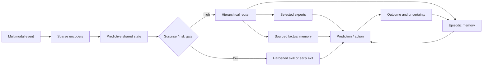

# System synthesis

## Scope

Combine the chapters into one candidate developmental and runtime architecture
without pretending the integration has already been validated.

## Biological observation

Brains integrate sensing, prediction, action, memory, attention, and learning
under shared resource constraints. The useful abstraction is coordinated
resource allocation across interacting timescales.

The system below is an engineering synthesis, not a mapped connectome.

## Proposed AI translation

### Runtime loop

Editable source: [`../assets/diagrams/system-runtime.mmd`](../assets/diagrams/system-runtime.mmd).

### Developmental loop

1. Initialize encoders, experts, routers, predictive state, and reserve capacity.
2. Learn from temporally aligned observation–action–outcome trajectories.
3. Price every route by estimated compute, data movement, and uncertainty.
4. Capture high-value episodes without immediately rewriting slow structure.
5. Consolidate under historical regression and interference controls.
6. Test compositional generalization, causal contribution, calibration, and
   real energy.
7. Prune only through reversible structural steps.
8. Quantize, compile, or externalize stable behavior under explicit promotion
   gates.
9. Continue operation with monitoring and the ability to demote hardened paths.

### State ownership

| State | Owner | Write path | Read path |
| --- | --- | --- | --- |
| Current latent context | working state | every event | selected runtime modules |
| Recent attributable experience | episodic memory | online capture | routing and consolidation |
| General reusable structure | slow model | validated consolidation | runtime experts and predictors |
| Mutable propositions | factual memory | versioned external update | retrieval router |
| Stable repeated transformation | hardened skill | promotion pipeline | cheap guarded dispatch |
| Resource and risk policy | budget controller | offline calibration | every gate and route |

## Efficiency mechanism

The budget controller prices a route before execution and reconciles its
estimate with measured energy afterward. It may choose fewer experts, an early
exit, a factual lookup, or deeper reasoning, but hard risk floors cannot be
traded away for average efficiency.

No component claims savings independently. The system accepts a mechanism only
when end-to-end measurement—including routing, memory, network, host, and
consolidation—improves the declared Pareto frontier.

## Evidence status

Individual ingredients have bounded evidence:

- conditional routing [C-003](../research/claims.md#c-003);
- early exit [C-004](../research/claims.md#c-004);
- joint-embedding prediction [C-006](../research/claims.md#c-006);
- continual-learning protection [C-009](../research/claims.md#c-009);
- pruning [C-012](../research/claims.md#c-012); and
- factual retrieval [C-014](../research/claims.md#c-014).

Their integration, control policy, and claimed compounding benefits are
speculative.

## Speculative extensions

- Market-like compute allocation where modules bid with expected uncertainty
  reduction per joule.
- Module-local clocks and queues rather than a global synchronous step.
- Physical placement learned jointly with routing so frequently communicating
  modules move closer in the memory and network topology.

## Failure modes

- Local improvements interact destructively and make the integrated system
  harder to train or debug.
- Budget control learns dataset-specific shortcuts.
- Shared state becomes a dense bottleneck that defeats modular sparsity.
- Consolidation and monitoring dominate lifecycle energy.
- Multiple memory tiers disagree without a conflict policy.
- The architecture accumulates mechanisms whose overhead exceeds their value.

## Measurable predictions

- Ablating adaptive routing increases energy more than it improves quality.
- Ablating consolidation improves short-term plasticity but increases retained
  capability loss.
- Ablating grounded trajectories reduces intervention generalization at matched
  data and capacity.
- The full system beats every component ablation on a quality–risk–energy Pareto
  surface, not merely one average score.
