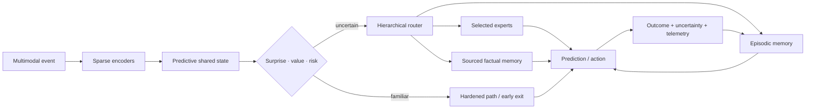
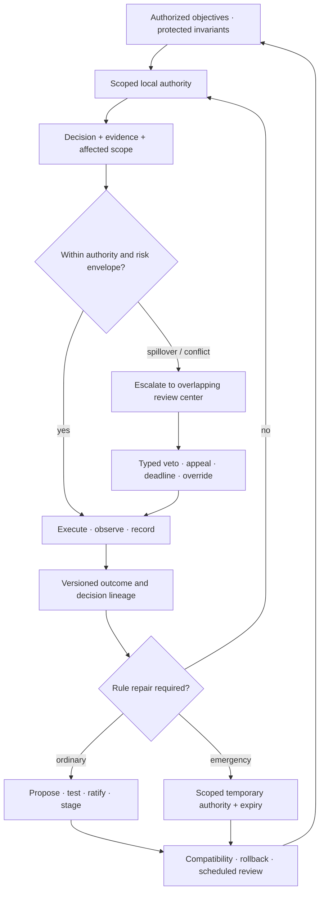
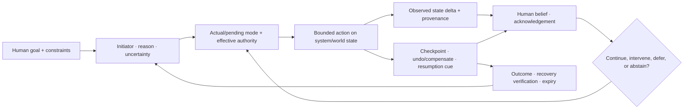
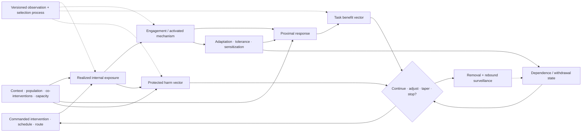
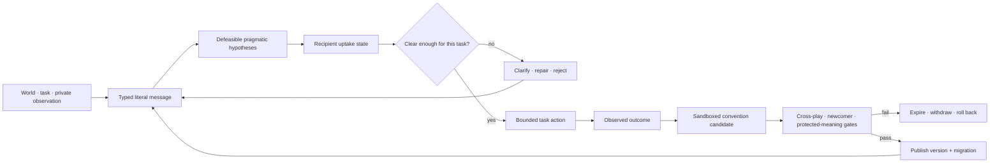
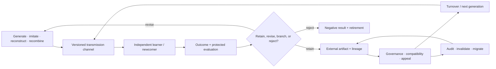

# System synthesis

> Intelligence is the coordinated movement of state through perception,
> prediction, action, memory, adaptation, and maintenance under a finite
> physical budget.

## Scope

The [working architecture](01-working-architecture.md) defines the runtime,
adaptation, and maintenance loops. This chapter follows information through
those loops, identifies who may write each kind of state, and gives the order in
which the integrated system should be assembled.

## Biological observation

Living intelligence coordinates sensing, action, memory, plasticity, resource
supply, and repair across different timescales. Local circuits handle repeated
work, broader signals alter priorities, fast traces change behavior before slow
structure moves, and maintenance continues during operation.

The transferable principle is **coordinated state ownership**. Reading a
result does not grant authority to overwrite its source. Fast behavior, rapid
learning, slow consolidation, and physical resource control can therefore
interact without becoming one global update rule.

## Proposed AI translation

### Runtime path

Editable source:
[`../assets/diagrams/system-runtime.mmd`](../assets/diagrams/system-runtime.mmd).

The path has six stages:

1. **Ground the event.** Encoders align perception with current action, timing,
   location, and tool state.
2. **Predict before expanding computation.** The shared state estimates what is
   likely, what is uncertain, and which goal currently matters.
3. **Choose the execution path.** A gate may dispatch a hardened skill, stop at
   an early exit, retrieve memory, activate selected experts, intervene through
   a tool, or escalate.
4. **Execute only admitted work.** Inactive capacity remains addressable without
   being loaded and operated on for the event.
5. **Measure the result.** Output is paired with observed consequence,
   calibration, latency, bytes moved, and energy.
6. **Capture an episode.** The adaptation loop receives an attributable record
   rather than an unexplained parameter change.

### Authority is split across control planes

The system uses four control planes with different authority:

| Plane | Controls | Reads | Cannot do alone |
| --- | --- | --- | --- |
| Task | goals, quality, permitted actions | predictive state, user/tool feedback | hide physical or risk cost |
| Resource | energy, latency, communication, placement | estimates and measured telemetry | redefine task success |
| Adaptation | episodes, hypotheses, provisional modules | outcomes, conflict, uncertainty | promote a global slow-model change |
| Maintenance | replay, merge, weakening, deletion, topology | history, regressions, fragility, lifecycle cost | bypass provenance or release gates |

The planes exchange compact declared state. A resource controller can deny an
expensive route but cannot declare the cheaper result equally correct. A task
controller can request deeper computation but cannot conceal the resulting
traffic from the energy ledger. Adaptation can propose; only maintenance can
promote a change into protected state.

### Governance is activated by a real authority problem

Aggregation rules, delegation, vetoes, constitutions, and participation are
not useful decorations for ordinary routing. They enter the architecture only
when persistent actors have decision-relevant private information, can benefit
from misleading reports, create spillovers across authority boundaries, hold
externally authorized protected standing, or must repair higher-order rules
without exposing them to ordinary updates.

When that applicability gate passes, the control plane records more than a
winning action:

1. the authorized objective and non-tradable invariants;
2. the actor's identity, scope, evidence, dependencies, and conflicts;
3. the proposal set, order, fallback, and omitted-alternative coverage;
4. every delegation edge, concentration measure, revocation, and cycle;
5. a veto's protected scope, severity, evidence, deadline, appeal, override,
   and expiry;
6. the decision and affected local and external interests; and
7. the rule version, amendment path, emergency authority, checked handoff,
   compatibility result, and rollback target.

Editable source:
[constitutional-control-plane.mmd](../assets/diagrams/constitutional-control-plane.mmd).

The formal and empirical boundaries in
[C-368](../research/claims.md#c-368)–[C-395](../research/claims.md#c-395)
forbid several shortcuts: an impossibility theorem does not select a moral
objective; stability is not quality; participation is not legitimacy;
popular or expert influence is not automatically capture; and an amendment
count is not repair. Normative standing and non-tradable harms remain explicit
authorized inputs.

[Candidate 020](../experiments/candidates/020-constitutional-control-plane.md)
therefore has a deliberately hostile null: constrained optimization, typed
IAM and interlocks, policy-as-code, independent evaluation, separation of
duties, append-only lineage, runtime assurance, and mature incident/change
management. If those match the result—or if every module shares one loss and
directly verifiable state—the institutional composition is removed.

### A person in the loop must have an executable control path

A visible approval step does not establish oversight. Effective mixed control
requires a person to receive relevant state before the response deadline,
understand the current and pending mode well enough for the task, hold actual
authority over the consequential effect, execute an intervention, and observe
whether the intended state changed. Explanation, confidence, trust, reliance,
agreement, preference, and correctness stay separate.

Each machine-initiated or shared-control transition can therefore carry a
recoverable initiative record:

1. initiator, reason, urgency, and calibrated uncertainty;
2. actual mode, pending mode, enabled effects, and response deadline;
3. effective human and machine authority, including silent arbitration;
4. intended action, observed state delta, and provenance;
5. acknowledgement or rejection and whether it changed execution;
6. checkpoint, undo, compensation, or safe-stop boundary;
7. resumption cue, pending goals, and assumptions that may have gone stale;
8. verified recovery result, expiry, and longitudinal-learning link; and
9. accessibility and assistive-technology conditions under which the path was
   tested.

Editable source:
[recoverable-initiative.mmd](../assets/diagrams/recoverable-initiative.mmd).

Human time is part of lifecycle cost. For interruptions $j=1,\ldots,n$,

$$
T_{\mathrm{complete}}=T_{\mathrm{active}}+
\sum_{j=1}^{n}\left(T_{\mathrm{interrupt},j}+
T_{\mathrm{resume},j}+T_{\mathrm{rework},j}\right),
$$

with every term measured in seconds under a declared coding rule. Error
severity, stress, frustration, workload, training, and person-minutes remain
separate outcomes; throughput alone cannot erase them.

The bounded evidence in
[C-396](../research/claims.md#c-396)–[C-416](../research/claims.md#c-416)
supports specific interruption, mode, automation-bias, recovery, accessibility,
and adaptive-interface constraints. The combined record is still speculative,
so it refines Candidates 009, 011, 012, and 015 rather than becoming another
registry principle.

### State ownership

| State | Owner | Normal write path | Normal readers |
| --- | --- | --- | --- |
| Current predictive context | runtime | every event | selected runtime modules |
| Recent attributable experience | episodic memory | observed outcome | routing, adaptation, maintenance |
| Provisional hypotheses and modules | adaptation | bounded generation and trials | shadow runtime and evaluators |
| Reusable representation and skill | slow model | validated consolidation | encoders, predictors, experts |
| Mutable proposition | factual memory | sourced versioned update | retrieval router and task modules |
| Stable repeated transformation | hardened store | promotion pipeline | guarded low-cost dispatch |
| Resource and risk policy | budget controller | calibrated policy update | every gate and route |
| Low-dimensional operating context | context bus | rate-limited controller update | subscribed modules through receiver-local filters |
| Lifecycle and fragility state | maintenance | replay, probes, regressions | admission, reopening, pruning, rollback |

The plane table says who controls an operation; the state table says who may
write durable state. Each boundary becomes an ablation point: remove it, widen
it, delay it, or replace it with a conventional baseline and measure the
consequence.

### Intervention is a stateful chain

A commanded change is not its realized effect. Training intensity, routing
quota, memory injection, tool access, fallback support, pruning pressure, and
human escalation can each be delivered incompletely, arrive late, alter later
observations, produce different useful and harmful effects, and change the
system's future response. The contract therefore keeps this chain explicit:
([C-607](../research/claims.md#c-607)–[C-610](../research/claims.md#c-610),
[C-616](../research/claims.md#c-616),
[C-626](../research/claims.md#c-626)).

Editable source:
[state-qualified-intervention.mmd](../assets/diagrams/state-qualified-intervention.mmd).

The held system record includes commanded schedule; realized state; mechanism
engagement; benefit and protected-harm vectors; adaptation, dependence, and
withdrawal state; population/task/context support; observation provenance;
uncertainty; reserve; and permitted continuation, adjustment, taper, or stop.
Its scientific bounds are recorded in
[C-611](../research/claims.md#c-611)–[C-625](../research/claims.md#c-625).
It rejects three shortcuts:

1. activation or occupancy is not downstream benefit or safety;
2. equal cumulative input does not imply equal peaks, spacing, state, or
   recovery; and
3. removing support is a new dynamical intervention, so rollback continues
   through rebound, recurrence, native-capability, and reserve checks.

The [state-qualified intervention mathematics](../math/state-qualified-intervention.md)
defines the unit-bearing state, authority, interaction, and withdrawal tests.
The composition remains a domain track under Candidates 005/007/012/014 and
must beat Bayesian state-space estimation, constrained MPC/POMDP, calibrated
harm monitoring, and staged decommissioning at equal lifecycle cost.

### After an outcome: adaptation proposes, maintenance decides

An outcome can influence the next event through working state or episodic
retrieval. Durable changes follow two paths with different authority:

| Path | Immediate work | Possible result |
| --- | --- | --- |
| Adaptation | capture an attributable episode; construct bounded proposals from existing fragments, relations, and abstractions | working-state change, hypothesis, or provisional module |
| Maintenance | score, replay, branch, compare, and account for lifecycle cost | retain, merge, externalize, weaken, delete, protect, reopen, relocate, prune, quantize, or compile |

Variation creates candidates; observed outcomes and controlled interventions
decide which survive. Bounded fragility probes remain on shadows or replicas and
are charged to the maintenance budget.

The system may also create learning events: propose a structured hypothesis or
latent rollout, choose a bounded intervention, and evaluate the outcome. This
closed endogenous curriculum composes the evidence in
[C-061](../research/claims.md#c-061)–[C-066](../research/claims.md#c-066);
random variation supplies candidates, not validation. Its operations are
separated under equal budgets in
[Candidate 004](../experiments/candidates/004-closed-endogenous-curriculum.md).

The [memory lifecycle](40-memory-and-consolidation.md) governs evidence and
retention. The
[maturity lifecycle](50-grokking-and-pruning.md) governs protection, reopening,
and structural consolidation. A proposal remains scoped and attributable until
maintenance promotes it.

Every promoted structural action records:

1. a declared trigger;
2. a versioned candidate state;
3. protected historical and rare-case evaluations;
4. measured migration, validation, and recovery cost;
5. a promotion or rejection decision; and
6. a rollback target.

### Communication is a versioned state transition

A fluent message is not one state variable. The runtime keeps at least six
separate records:

1. typed literal payload and protocol version;
2. external referent, query, action, or constraint;
3. defeasible hypotheses about sender intention;
4. recipient-generated uptake state—received, parsed, understood-enough,
   accepted, rejected, or unresolved;
5. repair and supersession lineage; and
6. any resulting authority decision, which communication alone cannot grant.

This separation follows the evidence boundaries in
[C-268](../research/claims.md#c-268)–[C-281](../research/claims.md#c-281).
Composition is relative to a grammar and interpretation; pragmatic inference
depends on context and incentives; acknowledgement is not identical belief;
channel capacity is not semantic value; and population convergence is not
grounding, truth, or safety.

Editable source:
[versioned-repairable-conventions.mmd](../assets/diagrams/versioned-repairable-conventions.mmd).

A local shorthand remains session-scoped until independent interpreters recover
its declared denotation, older and newcomer agents pass cross-play, corrupted
or version-mismatched messages trigger bounded repair, protected rare meanings
survive, and migration plus rollback have been exercised. The full lifecycle is
tested in
[Candidate 015](../experiments/candidates/015-versioned-repairable-conventions.md)
against typed protocols, schema registries, acknowledgements, replicated logs,
calibrated inference, standard coding, and explicit migration.

### Capability can cross learner turnover without staying inside one learner

A repository, demonstration, or popular practice is not yet cumulative
inheritance. The system must expose six different operations:

1. **Generate:** produce a variant by invention, reconstruction, imitation, or
   recombination.
2. **Transmit:** identify exactly which actions, outcomes, explanations,
   artifacts, tests, and environmental state reach the next learner.
3. **Evaluate:** test the reconstructed capability independently rather than
   crediting popularity, prestige, or successful transmission as usefulness.
4. **Retain:** place accepted capability, evidence, failures, and lineage in a
   form that a newcomer can retrieve and interpret.
5. **Govern:** control compatibility, authority, appeal, migration, and
   retirement without treating a convention as truth.
6. **Survive turnover:** repeat the cycle with a genuinely new learner and a
   protected test suite.

Editable source:
[audited-cumulative-inheritance.mmd](../assets/diagrams/audited-cumulative-inheritance.mmd).

For generation $g$, a deliberately simple capability ledger is

$$
K_{g+1}=q_gK_g+I_g+R_g-D_g,
$$

where $K_g$ is validated capability in a declared task-score unit, $q_g$ is
the dimensionless retained fraction, $I_g$ is independently generated
improvement, $R_g$ is validated recombination gain, and $D_g$ is degradation
or compatibility loss in the same task unit. These terms are accounting fields,
not a claim that capabilities are generally additive; protected outcomes stay
visible beside the aggregate.

Raw population size also overstates diversity when every learner sees the same
few lineages. If exposure weights are $\pi_i$ and $\sum_i\pi_i=1$, then

$$
N_{\mathrm{eff}}=\frac{1}{\sum_i\pi_i^2}
$$

is the dimensionless effective number of equally exposed models. It measures
attention concentration—not competence, independence, or complexity.

The evidence in [C-343](../research/claims.md#c-343)–[C-367](../research/claims.md#c-367)
supports bounded cultural accumulation, conditional social-information use,
material scaffolding, and severe archaeological inference limits. It does not
establish a population advantage for artificial learners. That residual is
isolated in
[Candidate 019](../experiments/candidates/019-audited-cumulative-inheritance.md),
which must beat centralized continual learning, replay, version control,
retrieval, workflow engines, quality-diversity search, and fixed governance at
equal cumulative effort.

### Live response and longitudinal learning are separate loops

The runtime may need to contain a failure before its cause is known. Later
analysis may identify a cause without improving the next live response. A
usable operational-assurance plane therefore connects two loops without
collapsing them:

| Loop | Deadline | Required state transition | Failure if measured alone |
| --- | --- | --- | --- |
| Live response | seconds to minutes | detect, acknowledge, assign scoped authority, contain, degrade, revoke, roll back, restore | fast containment can recur because no verified change enters future operation |
| Longitudinal learning | releases to months | retain competing traces, analyze, bind a finding to dependencies and an owner, test, deploy, verify, retrieve, retire | a complete report can arrive after preventable damage and may never change operation |

Report volume is observation-biased. Over a declared exposure interval,

$$
N_{\mathrm{report}}=N_{\mathrm{precursor}}
p_{\mathrm{detect}}p_{\mathrm{report}}p_{\mathrm{retain}},
$$

where both $N$ values are event counts and every $p$ is a dimensionless
conditional probability. A low count can mean low exposure, weak detection,
reporting friction, fear, or deletion; a high count can mean hazard, improved
coverage, duplication, or gaming ([C-178](../research/claims.md#c-178)).

Likewise, an incident archive becomes memory only when an applicable lesson is
retrieved, used, evaluated, invalidated, and retired
([C-184](../research/claims.md#c-184)). The held composition binds live traces
and precursor detections to scoped response, dependency-linked changes,
protected tests, verified outcomes, retrieval triggers, and retirement.
[Candidate 011](../experiments/candidates/011-dual-loop-operational-assurance.md)
compares it with a complete SRE stack and rejects it if role, interruption,
reviewer, storage, stale-memory, or coordination cost erases the gain.

### Build the system in dependency order

The full system should be assembled through progressively stronger contracts:

1. Establish dense and conventional modular baselines with one physical
   measurement boundary.
2. Align observation, action, outcome, location, and time before adding learned
   routing.
3. Introduce conditional execution and measure activation, data movement, and
   dispatch overhead.
4. Add attributable episodic memory without granting it slow-model write
   authority.
5. Add replay and consolidation under fixed maintenance budgets, then admit
   provisional modules only for measured capability gaps.
6. Test reversible protection, reopening, and structured pruning before
   promoting repeated behavior into cheaper paths.
7. Learn logical routing and physical placement together only after their
   separate baselines are stable.
8. Run continual operation with drift, conflict, newcomer admission, recovery,
   and complete lifecycle accounting.

Each stage keeps the strongest baseline from the previous one. A later
mechanism cannot hide an earlier regression behind a higher aggregate score.

## Efficiency mechanism

The architecture seeks three compounding reductions:

- **activation:** execute a small relevant subset of stored capacity;
- **movement:** keep repeated computation near the state it uses; and
- **reinterpretation:** convert stable repeated work into cheaper memory,
  precision, routing, or compiled paths.

Before execution, the resource plane prices the proposed route. Afterward,
measured telemetry corrects that estimate. Hard risk floors remain constraints
rather than terms that average efficiency can trade away.

Those reductions are useful only after control overhead is included. Lifecycle
energy is therefore

$$
E_{\mathrm{life}}
= E_{\mathrm{runtime}}
+ E_{\mathrm{memory}}
+ E_{\mathrm{network}}
+ E_{\mathrm{adaptation}}
+ E_{\mathrm{maintenance}}
+ E_{\mathrm{recovery}},
$$

with every term measured in joules over the same workload and system boundary.
The [energy model](80-energy-model.md) defines the full comparison contract.

## Evidence status

| Ingredient | Claim range | Status in this synthesis |
| --- | --- | --- |
| Conditional routing and early exit | C-003–C-004 | available engineered mechanisms |
| Predictive representation and residual allocation | C-005–C-007 | plausible runtime composition |
| Fast/slow memory and protection | C-008–C-010 | scoped evidence; lifecycle policy experimental |
| Structural pruning and hardening | C-012–C-015 | individual mechanisms available; promotion logic unvalidated |
| Sensorimotor control and local autonomy | C-017–C-024 | biological and engineered constituents |
| Replay, reconsolidation, and forgetting | C-036–C-042 | scoped observations; combined controller speculative |
| Maturation, reopening, and contextual control | C-043–C-051 | scoped interventions; digital translations experimental |
| Collective coordination and resilience | C-052–C-060 | scoped observations; quorum and fragility translations experimental |
| Endogenous generation and exploration | C-061–C-066 | constituent observations; integrated curriculum speculative |
| Communication and convention lifecycle | C-268–C-281 | constituent mechanisms established or scoped; versioned repairable composition speculative |
| Cumulative inheritance across turnover | C-343–C-367 | bounded constituents established or scoped; population advantage unvalidated |
| Institutional authority and rule repair | C-368–C-395 | formal constraints and bounded evidence; multi-level composition speculative |
| Human initiative, authority, and recovery | C-396–C-416 | bounded HCI effects; combined record speculative |
| Complete integrated system | none | unvalidated project synthesis |

## Speculative extensions

- Modules bid for compute using expected task-value improvement per joule while
  hard risk and communication limits remain external constraints.
- Local clocks and queues replace a global synchronous step where causality and
  hardware permit it.
- Routing, memory placement, interconnect, and precision are learned jointly.
- Replicas run alternative maintenance decisions and compare later outcomes
  before one state becomes canonical.
- External tools and sensors become active experiments chosen for information
  gain, not passive input channels.

## Failure modes

- A shared predictive state becomes a dense communication bottleneck.
- Task, resource, adaptation, and maintenance controllers oscillate or reward
  incompatible behavior.
- Routing overhead and scattered memory access erase activation savings.
- Episodic and factual stores disagree without an explicit conflict policy.
- Maintenance, regression, and recovery consume more energy than runtime saves.
- Premature hardening turns shortcuts or mutable facts into rigid behavior.
- Aggregate quality hides rare-case regression, fragility, or failed recovery.
- A scalar resilience score hides opposing resistance, recovery, adaptability,
  and newcomer-admission effects.
- Proposal generation collapses into high-temperature sampling without
  targeted intervention and outcome-based selection.
- Fluent exchange creates false common ground, silent semantic drift, or local
  conventions that newcomers and older versions cannot interpret or reject.
- A population receives credit for cumulative learning when it only performs
  more parallel search, preserves a headline score while losing rare skills,
  or copies one correlated lineage through every nominally independent agent.
- Governance vocabulary hides an ordinary optimizer, or veto, delegation,
  amendment, and participation add gridlock, capture, concentration, churn, or
  oversight cost without improving task-native or protected outcomes.
- A nominal human approval, explanation, or confidence display is credited as
  assurance even though state is stale, the mode is misunderstood, authority
  is ineffective, intervention arrives late, or recovery cannot change the
  world state.
- The architecture accumulates mechanisms faster than experiments can reject
  them.

## Measurable predictions

1. Conditional routing reduces measured runtime data movement and energy at
   matched quality, calibration, and tail risk.
2. Attributable episodic memory improves adaptation latency without increasing
   protected slow-model regression.
3. Maintenance and structural consolidation reduce lifecycle cost after replay,
   validation, migration, and recovery are counted.
4. Separating factual propositions from reusable skills lowers correction cost
   and unsupported factual carryover.
5. Reversible maturation gates improve retention and relearning relative to
   fixed regularization, fixed pruning schedules, and naive fine-tuning.
6. Versioned uptake, repair, and cross-play gates reduce silent semantic failure
   under agent and protocol drift beyond a complete fixed-protocol stack.
7. Audited turnover retains and recombines more protected capability than a
   centralized continual learner at equal cumulative learning, coordination,
   storage, migration, and energy cost—or the population mechanism is retired.
8. Multi-level authority improves an applicable task-native or protected-harm
   frontier beyond the complete ordinary governance stack after gridlock,
   capture, concentration, human attention, and lifecycle cost—or it is merged.
9. A recoverable initiative record predicts failures beyond polished mode
   labels, previews, confirmations, undo/history, logs, runtime assurance, and
   user testing on consequential and accessibility-stratified tasks—or only
   its individually supported fields remain.
10. The integrated system occupies a better quality–risk–latency–energy frontier
   than every component ablation and the strongest ordinary controller,
   scheduler, cache, and router baselines.
