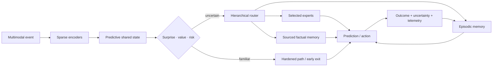

# System synthesis

> Intelligence is the coordinated movement of state through perception,
> prediction, action, memory, adaptation, and maintenance under a finite
> physical budget.

## Scope

The [working architecture](01-working-architecture.md) defines the runtime,
adaptation, and maintenance loops. This chapter follows information through
those loops, identifies who may write each kind of state, and gives the order in
which the integrated system should be assembled.

## Biological observation

Living intelligence coordinates sensing, action, memory, plasticity, resource
supply, and repair across different timescales. Local circuits handle repeated
work, broader signals alter priorities, fast traces change behavior before slow
structure moves, and maintenance continues during operation.

The transferable principle is **coordinated state ownership**. Reading a
result does not grant authority to overwrite its source. Fast behavior, rapid
learning, slow consolidation, and physical resource control can therefore
interact without becoming one global update rule.

## Proposed AI translation

### Runtime path

Editable source:
[`../assets/diagrams/system-runtime.mmd`](../assets/diagrams/system-runtime.mmd).

The path has six stages:

1. **Ground the event.** Encoders align perception with current action, timing,
   location, and tool state.
2. **Predict before expanding computation.** The shared state estimates what is
   likely, what is uncertain, and which goal currently matters.
3. **Choose the execution path.** A gate may dispatch a hardened skill, stop at
   an early exit, retrieve memory, activate selected experts, intervene through
   a tool, or escalate.
4. **Execute only admitted work.** Inactive capacity remains addressable without
   being loaded and operated on for the event.
5. **Measure the result.** Output is paired with observed consequence,
   calibration, latency, bytes moved, and energy.
6. **Capture an episode.** The adaptation loop receives an attributable record
   rather than an unexplained parameter change.

### Authority is split across control planes

The system uses four control planes with different authority:

| Plane | Controls | Reads | Cannot do alone |
| --- | --- | --- | --- |
| Task | goals, quality, permitted actions | predictive state, user/tool feedback | hide physical or risk cost |
| Resource | energy, latency, communication, placement | estimates and measured telemetry | redefine task success |
| Adaptation | episodes, hypotheses, provisional modules | outcomes, conflict, uncertainty | promote a global slow-model change |
| Maintenance | replay, merge, weakening, deletion, topology | history, regressions, fragility, lifecycle cost | bypass provenance or release gates |

The planes exchange compact declared state. A resource controller can deny an
expensive route but cannot declare the cheaper result equally correct. A task
controller can request deeper computation but cannot conceal the resulting
traffic from the energy ledger. Adaptation can propose; only maintenance can
promote a change into protected state.

### State ownership

| State | Owner | Normal write path | Normal readers |
| --- | --- | --- | --- |
| Current predictive context | runtime | every event | selected runtime modules |
| Recent attributable experience | episodic memory | observed outcome | routing, adaptation, maintenance |
| Provisional hypotheses and modules | adaptation | bounded generation and trials | shadow runtime and evaluators |
| Reusable representation and skill | slow model | validated consolidation | encoders, predictors, experts |
| Mutable proposition | factual memory | sourced versioned update | retrieval router and task modules |
| Stable repeated transformation | hardened store | promotion pipeline | guarded low-cost dispatch |
| Resource and risk policy | budget controller | calibrated policy update | every gate and route |
| Low-dimensional operating context | context bus | rate-limited controller update | subscribed modules through receiver-local filters |
| Lifecycle and fragility state | maintenance | replay, probes, regressions | admission, reopening, pruning, rollback |

The plane table says who controls an operation; the state table says who may
write durable state. Each boundary becomes an ablation point: remove it, widen
it, delay it, or replace it with a conventional baseline and measure the
consequence.

### After an outcome: adaptation proposes, maintenance decides

An outcome can influence the next event through working state or episodic
retrieval. Durable changes follow two paths with different authority:

| Path | Immediate work | Possible result |
| --- | --- | --- |
| Adaptation | capture an attributable episode; construct bounded proposals from existing fragments, relations, and abstractions | working-state change, hypothesis, or provisional module |
| Maintenance | score, replay, branch, compare, and account for lifecycle cost | retain, merge, externalize, weaken, delete, protect, reopen, relocate, prune, quantize, or compile |

Variation creates candidates; observed outcomes and controlled interventions
decide which survive. Bounded fragility probes remain on shadows or replicas and
are charged to the maintenance budget.

The system may also create learning events: propose a structured hypothesis or
latent rollout, choose a bounded intervention, and evaluate the outcome. This
closed endogenous curriculum composes the evidence in
[C-061](../research/claims.md#c-061)–[C-066](../research/claims.md#c-066);
random variation supplies candidates, not validation. Its operations are
separated under equal budgets in
[Candidate 004](../experiments/candidates/004-closed-endogenous-curriculum.md).

The [memory lifecycle](40-memory-and-consolidation.md) governs evidence and
retention. The
[maturity lifecycle](50-grokking-and-pruning.md) governs protection, reopening,
and structural consolidation. A proposal remains scoped and attributable until
maintenance promotes it.

Every promoted structural action records:

1. a declared trigger;
2. a versioned candidate state;
3. protected historical and rare-case evaluations;
4. measured migration, validation, and recovery cost;
5. a promotion or rejection decision; and
6. a rollback target.

### Live response and longitudinal learning are separate loops

The runtime may need to contain a failure before its cause is known. Later
analysis may identify a cause without improving the next live response. A
usable operational-assurance plane therefore connects two loops without
collapsing them:

| Loop | Deadline | Required state transition | Failure if measured alone |
| --- | --- | --- | --- |
| Live response | seconds to minutes | detect, acknowledge, assign scoped authority, contain, degrade, revoke, roll back, restore | fast containment can recur because no verified change enters future operation |
| Longitudinal learning | releases to months | retain competing traces, analyze, bind a finding to dependencies and an owner, test, deploy, verify, retrieve, retire | a complete report can arrive after preventable damage and may never change operation |

Report volume is observation-biased. Over a declared exposure interval,

$$
N_{\mathrm{report}}=N_{\mathrm{precursor}}
p_{\mathrm{detect}}p_{\mathrm{report}}p_{\mathrm{retain}},
$$

where both $N$ values are event counts and every $p$ is a dimensionless
conditional probability. A low count can mean low exposure, weak detection,
reporting friction, fear, or deletion; a high count can mean hazard, improved
coverage, duplication, or gaming ([C-178](../research/claims.md#c-178)).

Likewise, an incident archive becomes memory only when an applicable lesson is
retrieved, used, evaluated, invalidated, and retired
([C-184](../research/claims.md#c-184)). The held composition binds live traces
and precursor detections to scoped response, dependency-linked changes,
protected tests, verified outcomes, retrieval triggers, and retirement.
[Candidate 011](../experiments/candidates/011-dual-loop-operational-assurance.md)
compares it with a complete SRE stack and rejects it if role, interruption,
reviewer, storage, stale-memory, or coordination cost erases the gain.

### Build the system in dependency order

The full system should be assembled through progressively stronger contracts:

1. Establish dense and conventional modular baselines with one physical
   measurement boundary.
2. Align observation, action, outcome, location, and time before adding learned
   routing.
3. Introduce conditional execution and measure activation, data movement, and
   dispatch overhead.
4. Add attributable episodic memory without granting it slow-model write
   authority.
5. Add replay and consolidation under fixed maintenance budgets, then admit
   provisional modules only for measured capability gaps.
6. Test reversible protection, reopening, and structured pruning before
   promoting repeated behavior into cheaper paths.
7. Learn logical routing and physical placement together only after their
   separate baselines are stable.
8. Run continual operation with drift, conflict, newcomer admission, recovery,
   and complete lifecycle accounting.

Each stage keeps the strongest baseline from the previous one. A later
mechanism cannot hide an earlier regression behind a higher aggregate score.

## Efficiency mechanism

The architecture seeks three compounding reductions:

- **activation:** execute a small relevant subset of stored capacity;
- **movement:** keep repeated computation near the state it uses; and
- **reinterpretation:** convert stable repeated work into cheaper memory,
  precision, routing, or compiled paths.

Before execution, the resource plane prices the proposed route. Afterward,
measured telemetry corrects that estimate. Hard risk floors remain constraints
rather than terms that average efficiency can trade away.

Those reductions are useful only after control overhead is included. Lifecycle
energy is therefore

$$
E_{\mathrm{life}}
= E_{\mathrm{runtime}}
+ E_{\mathrm{memory}}
+ E_{\mathrm{network}}
+ E_{\mathrm{adaptation}}
+ E_{\mathrm{maintenance}}
+ E_{\mathrm{recovery}},
$$

with every term measured in joules over the same workload and system boundary.
The [energy model](80-energy-model.md) defines the full comparison contract.

## Evidence status

| Ingredient | Claim range | Status in this synthesis |
| --- | --- | --- |
| Conditional routing and early exit | C-003–C-004 | available engineered mechanisms |
| Predictive representation and residual allocation | C-005–C-007 | plausible runtime composition |
| Fast/slow memory and protection | C-008–C-010 | scoped evidence; lifecycle policy experimental |
| Structural pruning and hardening | C-012–C-015 | individual mechanisms available; promotion logic unvalidated |
| Sensorimotor control and local autonomy | C-017–C-024 | biological and engineered constituents |
| Replay, reconsolidation, and forgetting | C-036–C-042 | scoped observations; combined controller speculative |
| Maturation, reopening, and contextual control | C-043–C-051 | scoped interventions; digital translations experimental |
| Collective coordination and resilience | C-052–C-060 | scoped observations; quorum and fragility translations experimental |
| Endogenous generation and exploration | C-061–C-066 | constituent observations; integrated curriculum speculative |
| Complete integrated system | none | unvalidated project synthesis |

## Speculative extensions

- Modules bid for compute using expected task-value improvement per joule while
  hard risk and communication limits remain external constraints.
- Local clocks and queues replace a global synchronous step where causality and
  hardware permit it.
- Routing, memory placement, interconnect, and precision are learned jointly.
- Replicas run alternative maintenance decisions and compare later outcomes
  before one state becomes canonical.
- External tools and sensors become active experiments chosen for information
  gain, not passive input channels.

## Failure modes

- A shared predictive state becomes a dense communication bottleneck.
- Task, resource, adaptation, and maintenance controllers oscillate or reward
  incompatible behavior.
- Routing overhead and scattered memory access erase activation savings.
- Episodic and factual stores disagree without an explicit conflict policy.
- Maintenance, regression, and recovery consume more energy than runtime saves.
- Premature hardening turns shortcuts or mutable facts into rigid behavior.
- Aggregate quality hides rare-case regression, fragility, or failed recovery.
- A scalar resilience score hides opposing resistance, recovery, adaptability,
  and newcomer-admission effects.
- Proposal generation collapses into high-temperature sampling without
  targeted intervention and outcome-based selection.
- The architecture accumulates mechanisms faster than experiments can reject
  them.

## Measurable predictions

1. Conditional routing reduces measured runtime data movement and energy at
   matched quality, calibration, and tail risk.
2. Attributable episodic memory improves adaptation latency without increasing
   protected slow-model regression.
3. Maintenance and structural consolidation reduce lifecycle cost after replay,
   validation, migration, and recovery are counted.
4. Separating factual propositions from reusable skills lowers correction cost
   and unsupported factual carryover.
5. Reversible maturation gates improve retention and relearning relative to
   fixed regularization, fixed pruning schedules, and naive fine-tuning.
6. The integrated system occupies a better quality–risk–latency–energy frontier
   than every component ablation and the strongest ordinary controller,
   scheduler, cache, and router baselines.
