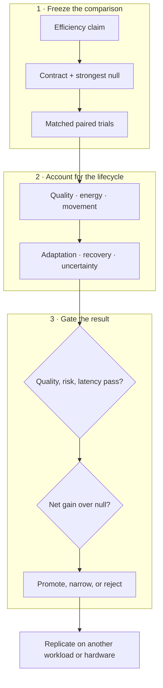

# Energy model and efficiency evaluation contract

## Scope

Energy efficiency is not a property of a model in isolation. It is a measured
relationship among a task, an input distribution, a quality and risk envelope,
a latency or throughput requirement, a hardware–software system, a lifecycle
horizon, and a physical measurement boundary.

This chapter defines the common contract for every efficiency result in the
project. It replaces operation-count headlines with equal-budget comparisons,
prices data movement and adaptation, and carries uncertainty through to an
explicit reject, revise, or promote decision. The detailed notation and first
models remain in [the mathematical notes](../math/README.md); experiment
contracts instantiate this chapter rather than inventing new accounting rules.

An efficiency result is identified by the record

$$
\mathcal{R}=(\mathcal{T},\mathcal{D},Q,R,L,\mathcal{B},\mathcal{H},
\mathcal{S},H,U),
$$

where:

| Symbol | Meaning | Unit or declaration |
| --- | --- | --- |
| $\mathcal{T}$ | task and target behavior | named benchmark or environment |
| $\mathcal{D}$ | evaluated input distribution | named dataset, stream, or generator |
| $Q$ | primary task quality | task-specific score |
| $R$ | declared risk or error measure | task-specific risk unit |
| $L$ | latency requirement | seconds, with percentile |
| $\mathcal{B}$ | physical accounting boundary | device, node, cluster, or facility |
| $\mathcal{H}$ | hardware configuration | device type, count, clocks, memory, and interconnect |
| $\mathcal{S}$ | software configuration | versions, precision, kernels, compiler, and runtime |
| $H$ | lifecycle horizon | seconds and qualified-event count |
| $U$ | uncertainty description | confidence interval and measurement model |

Two energy numbers with different records are not directly comparable. A
result may vary one field deliberately, but it must show the resulting curve
instead of silently carrying the old conclusion across the change.

## Biological observation

Neural signaling operates under metabolic constraints
([C-001](../research/claims.md#c-001)). Biological systems therefore provide
examples of computation shaped by the cost of activation, communication,
maintenance, and adaptation. Event-driven hardware also demonstrates that
local sparse activity can be implemented outside biology
([C-015](../research/claims.md#c-015)).

The observation does not define a common operation between a brain and a
digital accelerator. A spike, synaptic event, memory read, floating-point
multiply, token, and successful decision are different functional units. The
inherited brain-to-accelerator range remains disputed under
[C-016](../research/claims.md#c-016) because its numerator and denominator do
not share a task, quality target, physical boundary, or operation definition.

Here the brain establishes the feasibility of severe resource allocation. The
actionable translation is to make every proposed mechanism compete under a
complete physical and statistical contract.

## Proposed AI translation

### The qualified event is the functional unit

Let $x_j$ be deployment event $j$, and let $I_j\in\{0,1\}$ indicate that the
event was served inside the preregistered quality, risk, and latency envelope.
For a horizon containing $N$ offered events, the qualified count is

$$
N_q=\sum_{j=1}^{N} I_j.
$$

$N$, $N_q$, and $I_j$ are counts or dimensionless indicators. The envelope
must define whether qualification is event-level, stratum-level, or
run-level. Selectively dropping hard events cannot reduce the energy
denominator: offered events, rejected events, failed events, and qualified
events are all reported.

For tasks whose quality is defined only over a population, comparability is
established at the run level. Candidate $C$ and baseline $B$ are inside the
same envelope only if

$$
Q_C-Q_B\ge -\varepsilon_Q,
\qquad
R_C-R_B\le \varepsilon_R,
\qquad
L_{C,p}\le L_{\max},
$$

where $\varepsilon_Q$ is the allowed quality loss in quality units,
$\varepsilon_R$ is the allowed risk increase in risk units, $p$ is the
declared latency percentile, $L_{C,p}$ is candidate latency at that percentile
in seconds, and $L_{\max}$ is the latency ceiling in seconds. All margins are
fixed before confirmatory runs. Energy superiority is tested only after this
envelope is satisfied.

### Measurement boundary and gross energy

For boundary $b$ and measurement interval $[t_0,t_1]$, gross electrical energy
is

$$
E_b^{\mathrm{gross}}
=\int_{t_0}^{t_1}P_b(t)\,dt,
$$

where $P_b(t)$ is measured electrical power in watts, $t$ is time in seconds,
and $E_b^{\mathrm{gross}}$ is energy in joules. The instrument, sample rate in
hertz, clock alignment, integration method, and missing-sample policy are part
of $U$.

Incremental energy may also be reported:

$$
E_b^{\mathrm{inc}}
=\int_{t_0}^{t_1}\left[P_b(t)-P_b^{\mathrm{idle}}(t)\right]dt,
$$

where $P_b^{\mathrm{idle}}(t)$ is power in a separately measured, precisely
defined idle state in watts. Gross energy remains primary. Incremental energy
is meaningful only when candidate and baseline use the same idle definition
and the idle subtraction does not hide reserved or provisioned capacity.

Every reported number carries one provenance label:

- **measured:** produced by a named instrument or counter during this run;
- **modeled:** calculated from measured counts and versioned coefficients;
- **cited:** copied with its original system, boundary, and date; or
- **hypothesized:** a preregistered value or direction awaiting measurement.

Mixed totals expose the provenance of every component. They are not labeled
“measured energy” when any material term is modeled or cited.

The permitted boundaries are:

| Boundary | Included energy |
| --- | --- |
| Device | accelerator package or named component only |
| Node | accelerator, CPU, memory, local storage, power conversion, and attributable node cooling |
| Cluster | participating nodes, fabric, shared storage, and attributable cluster infrastructure |
| Facility | cluster energy plus contemporaneous attributable facility overhead |

If facility energy is derived from power usage effectiveness,

$$
E_{\mathrm{facility}}=\operatorname{PUE}\,E_{\mathrm{IT}},
$$

where $E_{\mathrm{IT}}$ and $E_{\mathrm{facility}}$ are joules and PUE is the
dimensionless ratio of facility power to IT-equipment power for the same site
and interval. A cited fleet average is not substituted for a measured node or
cluster result. Facility, carbon, water, and financial cost are separate
outcomes; none is used as a synonym for joules.

### Lifecycle energy

For candidate $C$ over horizon $H$, define the disjoint lifecycle total

$$
\begin{aligned}
E_C^{\mathrm{life}}(H)={}&E_C^{\mathrm{search}}
+E_C^{\mathrm{train}}
+E_C^{\mathrm{consolidate}}
+E_C^{\mathrm{compile}}\\
&+E_C^{\mathrm{serve}}(H)
+E_C^{\mathrm{maint}}(H)
+E_C^{\mathrm{migrate}}(H)
+E_C^{\mathrm{recover}}(H)
+E_C^{\mathrm{idle}}(H).
\end{aligned}
$$

Every $E$ term is energy in joules at the same boundary $\mathcal{B}$:

- $E^{\mathrm{search}}$ covers architecture search, hyperparameter tuning, and
  failed development runs attributable to the selected result;
- $E^{\mathrm{train}}$ covers final training and validation;
- $E^{\mathrm{consolidate}}$ covers pruning, replay, merging, or structural
  stabilization before service;
- $E^{\mathrm{compile}}$ covers compilation, quantization, layout generation,
  and deployment preparation;
- $E^{\mathrm{serve}}$ covers event execution during $H$;
- $E^{\mathrm{maint}}$ covers monitoring, replay, repair, indexing, and
  lifecycle control during $H$;
- $E^{\mathrm{migrate}}$ covers state serialization, transfer, warm-up, and
  reconfiguration not already assigned elsewhere;
- $E^{\mathrm{recover}}$ covers additional recovery work after a declared
  failure or regime change; and
- $E^{\mathrm{idle}}$ covers provisioned but inactive devices, memory,
  communication links, and reserve capacity during $H$.

An event is assigned to exactly one term. A migration byte, for example, may
appear in the movement ledger but its energy is not also charged as ordinary
serving traffic.

Lifecycle energy per qualified event is

$$
e_C^{\mathrm{life}}(H)=
\frac{E_C^{\mathrm{life}}(H)}{N_{q,C}(H)},
$$

where $N_{q,C}(H)$ is the candidate’s qualified-event count during $H$ and
$e_C^{\mathrm{life}}$ is joules/qualified event. The same result is also
reported per offered event so quality filtering remains visible.

### Break-even horizon

Let $\Delta E_0$ be candidate minus baseline one-time energy before service in
joules, and let $\delta e=e_B^{\mathrm{serve}}-e_C^{\mathrm{serve}}$ be the
measured steady serving saving in joules/qualified event. When
$\Delta E_0>0$ and $\delta e>0$, the event-count break-even point is

$$
N^*=\frac{\Delta E_0}{\delta e}.
$$

$N^*$ is a count. At qualified service rate $\lambda_q$ in events/second, the
time break-even is $T^*=N^*/\lambda_q$ seconds. Maintenance, migration,
recovery, and idle differences that grow with time must be included in the
full numerical break-even calculation; the simple quotient is valid only when
they are already represented in $\delta e$ or are negligible over the stated
horizon. If $\delta e\le0$, there is no energy break-even.

### Data movement ledger

Executed arithmetic and moved data remain separate observables. For one run,

$$
B_{\mathrm{total}}=
B_{\mathrm{cache}}+B_{\mathrm{device}}+B_{\mathrm{host}}
+B_{\mathrm{fabric}}+B_{\mathrm{storage}}+B_{\mathrm{migration}},
$$

where every $B$ term is bytes crossing the named, disjoint boundary: on-chip
cache levels, device memory, host–device interface, inter-device or inter-node
fabric, persistent storage, and migration path. The ledger additionally
reports byte-hops, defined as payload bytes multiplied by traversed logical or
physical links, in byte-hops. Reads and writes are separated when their costs
differ.

Operation and movement counts can support a calibrated model,

$$
\widehat{E}_{\mathrm{model}}
=\sum_{o\in\mathcal{O}}n_o\epsilon_o
+\sum_{\ell\in\mathcal{L}}B_\ell\epsilon_\ell
+\int_{t_0}^{t_1}\widehat{P}_{\mathrm{idle}}(t)dt,
$$

where $\mathcal{O}$ is the declared set of operation classes, $n_o$ is the
executed count for class $o$, $\epsilon_o$ is calibrated joules/operation,
$\mathcal{L}$ is the set of movement boundaries, $B_\ell$ is bytes crossing
boundary $\ell$, $\epsilon_\ell$ is calibrated joules/byte, and
$\widehat{P}_{\mathrm{idle}}$ is modeled idle power in watts. A hat marks an
estimate. The model is checked against gross measured energy; it never upgrades
modeled joules into measured joules.

Numerical energy-per-operation tables are tied to process, device, precision,
data locality, utilization, and year. The engineering audit therefore uses
them as an accounting method, not constants
([computer architecture analogue](../research/audits/2026-08-05-engineering-analogues.md#p-010--structural-offloading-and-co-design)).
The thermodynamic floor $k_B T\ln 2$ joules describes the minimum dissipation
associated with erasing one bit under its physical assumptions; $k_B$ is the
Boltzmann constant in joules/kelvin and $T$ is absolute temperature in kelvin.
It is not an estimator for an inference, multiply, or memory transfer.

### Equal-budget comparisons

Candidate and baseline receive matched opportunity to succeed. Each experiment
freezes:

1. training and evaluation data, stream order, changes, failures, and seeds;
2. quality, risk, latency, and availability requirements;
3. input information and look-ahead—an oracle is labeled and never used as a
   superiority baseline;
4. tuning trials and tuning compute in device-hours or joules;
5. provisioned parameter, memory, module, edge, or replica capacity;
6. service compute, controller compute, telemetry, and actuation cadence;
7. migration, topology-edit, replay, and reserve ceilings;
8. software optimization effort appropriate to both methods; and
9. measurement boundary, duration, warm-up, repetitions, and instrumentation.

Some mechanisms intentionally exchange one resource for another. They are not
forced into a single operation count; instead, all resource axes are recorded
and the quality–risk–latency–energy–movement frontier is compared. A method
that violates a hard budget is infeasible, not retroactively scaled into
compliance.

### Engineering null models

The relevant null model is the strongest standard solution to the same
constrained problem, not only a dense network:

| Proposed mechanism | Minimum null model |
| --- | --- |
| Conditional routing | tuned dense reference, fixed sparse model, and budgeted adaptive router |
| Prediction-error compute | calibrated residual/change detector plus value-of-information acquisition |
| Homeostatic allocation | tuned feedback or primal/dual resource controller |
| Adaptive topology | fixed topology with adaptive weights/routing and periodic global graph optimization |
| Temporal communication | fixed optimized schedule and work-conserving scheduler |
| Memory tiers | tuned cache/TTL/retrieval policy and, where possible, an oracle-lifetime upper bound |
| Maintenance plane | periodic/adaptive checkpoint, monitoring, and recovery controller |
| Structural specialization | profile-guided compilation, layout, quantization, and accelerator-aware kernel |

The full mapping and formal reference points are in the
[engineering analogue audit](../research/audits/2026-08-05-engineering-analogues.md).
Component ablations determine whether the claimed mechanism causes a gain.
An oracle supplies headroom, while a shuffled or random-action control detects
benefit from adaptation without useful information.

### Evaluation loop

Editable source:
[`../assets/diagrams/efficiency-evaluation-loop.mmd`](../assets/diagrams/efficiency-evaluation-loop.mmd).

### Uncertainty and missing costs

The primary comparison is paired. Candidate and baseline run the same workload
seed, event sequence, change schedule, and failure trace. For paired replicate
$k$, define relative lifecycle effect

$$
d_k=\frac{e_{C,k}^{\mathrm{life}}-e_{B,k}^{\mathrm{life}}}
{e_{B,k}^{\mathrm{life}}},
$$

where each $e$ is joules/qualified event and $d_k$ is dimensionless. Report the
paired point estimate and a confidence interval across independent full-run
seeds. Hierarchical bootstrap resampling is used when events are nested within
seeds or change episodes. Repeated samples from one power trace are not treated
as independent runs.

For a modeled scalar energy $\widehat{E}=f(\theta)$, where $f$ is the declared
energy-model function and $\theta$ is its coefficient-and-count vector, local
covariance propagation is

$$
\operatorname{Var}(\widehat{E})\approx J_f\Sigma_\theta J_f^\top,
$$

where $\theta$ is the vector of calibrated coefficients and measured counts,
$\Sigma_\theta$ is their covariance matrix in the corresponding squared mixed
units, and $J_f$ is the Jacobian row vector of partial derivatives of $f$ with
respect to $\theta$. The result is variance in joules squared. Bootstrap or
Monte Carlo propagation replaces this approximation for nonlinear, correlated,
or non-Gaussian estimates.

If a material category cannot yet be measured, let its energy lie in declared
interval $[E^-_u,E^+_u]$ joules. The conclusion must survive the least favorable
assignment within that interval. A result whose sign depends on assuming the
missing category is zero remains unresolved.

Uncertainty reporting includes:

- meter accuracy, resolution, sampling rate, clock error, and calibration date;
- run-to-run variation, warm-up state, thermal state, and background workload;
- coefficient covariance and extrapolation range for modeled components;
- seed, task-stratum, failure, and change-event variation; and
- censored failures to finish or recover.

The uncertainty interval accompanies the effect and the absolute values. A
large sample size does not repair a mismatched boundary or missing lifecycle
phase.

## Efficiency mechanism

The project’s mechanisms act on distinct terms of the lifecycle and movement
ledger. They must earn their complexity against the appropriate null model.

| Lever | Intended physical change | Necessary measurements | Common null explanation |
| --- | --- | --- | --- |
| Selective modules and early exit | fewer executed operations and avoided activation movement | operation classes, device/host bytes, gate energy, latency by difficulty | tuned smaller dense model or confidence threshold matches it |
| Compartmentalization and placement | fewer cross-boundary bytes and smaller blast radius | byte-hops, cut traffic, placement/migration energy, recovery | ordinary partitioning or cache-aware layout matches it |
| Adaptive logical topology | fewer idle links and shorter useful paths under drift | edge-seconds, byte-hops, controller work, migration, reserve, recovery | adaptive weights or periodic graph optimization matches it |
| Memory lifetime routing | fewer expensive writes, replays, and stale retrievals | tier bytes, reads/writes, migration, retention quality, maintenance energy | LRU/TTL/retrieval policy matches it |
| Quantization and compilation | less arithmetic and movement per stable path | executed precision, kernel mix, bytes, compile energy, break-even | standard profile-guided optimization matches it |
| Maintenance and consolidation | lower future update/recovery cost after paid background work | replay/checkpoint bytes, optimizer work, downtime, retained quality, lifecycle horizon | periodic maintenance matches it |
| Temporal communication | less broadcast while meeting deadlines | physical context bytes, synchronization power, jitter, schedule-update cost | optimized time-aware schedule matches it |

The first candidate experiments instantiate the shared contract:

- [adaptive topology](../experiments/candidates/001-adaptive-topology.md)
  prices edge updates, reserve, migration, and recovery against routing and
  graph-optimization baselines;
- [multiscale context broadcast](../experiments/candidates/002-multiscale-context-broadcast.md)
  separates logical bandwidth from physical tensor movement and board energy;
  and
- [recovery dynamics](../experiments/candidates/003-recovery-dynamics-fragility.md)
  prices active probes, telemetry, latency, and false alarms against standard
  monitoring and system-identification baselines.

An operation saving becomes an energy mechanism only if it removes physical
work at the chosen boundary. An arithmetic reduction that adds irregular
dispatch, cache misses, synchronization, or migration may move cost rather than
remove it.

## Result hierarchy

Every experiment reports the narrowest supported level:

1. **Proxy reduction:** fewer operations, bytes, active edges, or updates.
2. **Component reduction:** lower measured energy at a named device or link.
3. **System reduction:** lower gross node or cluster energy inside the matched
   quality, risk, and latency envelope.
4. **Lifecycle reduction:** lower $e^{\mathrm{life}}(H)$ after search,
   adaptation, maintenance, reserve, failure, and idle costs at a declared
   horizon.
5. **Transfer:** the lifecycle result replicates on another workload or
   hardware class without changing the claim after seeing the result.

Evidence at one level does not imply the next. This hierarchy makes a useful
proxy result publishable without inflating it into an end-to-end claim.

## Audit of the inherited comparison

The source discussion asserted that a 20-watt brain would correspond to
hundreds of kilowatts or megawatts of accelerator power. The calculation mixed
an assumed biological operation rate, peak accelerator arithmetic at varying
precisions, and a facility multiplier. Its formal shape,

$$
P_{\mathrm{counterfactual}}
=P_{\mathrm{brain}}
\frac{\eta_{\mathrm{brain}}}{\eta_{\mathrm{machine}}},
$$

is dimensionally valid only when $P_{\mathrm{brain}}$ is brain power in watts,
$P_{\mathrm{counterfactual}}$ is machine power in watts, and both efficiencies
$\eta$ measure the same qualified functional output per joule under the same
quality, risk, time, and boundary record $\mathcal{R}$. No such common output
has been established. The inherited values are retained as provenance for
[C-016](../research/claims.md#c-016), not as constants, bounds, or project
targets.

The title “20 Watts Was Enough” expresses the research constraint: useful
adaptive intelligence exists under a small biological power budget. The
project’s numerical claims will come from the measurement loop above.

## Evidence status

- Energy constrains biological signaling under the scoped evidence in
  [C-001](../research/claims.md#c-001): **established**.
- Local sparse learning can be implemented on event-driven neuromorphic
  hardware under [C-015](../research/claims.md#c-015): **established for the
  cited systems**, not proof of this architecture.
- The inherited biological-to-accelerator numerical range under
  [C-016](../research/claims.md#c-016): **disputed**.
- Data movement, control, maintenance, and idle provision can dominate or erase
  nominal arithmetic savings: **engineering null hypothesis to measure for
  each system**, not a fixed proportion.
- Lower lifecycle energy from the integrated architecture at matched quality,
  risk, and latency: **speculative** until candidate experiments clear their
  preregistered gates and measured system boundaries.

## Speculative extensions

### Calibrated marginal-energy control

A controller could estimate the marginal joules of another layer, sensor,
retrieval, replay, or route and compare it with expected decision improvement.
The proxy would be trained from counters but recalibrated against gross energy
measurements. Its calibration error and controller energy would be first-class
outcomes.

### Carbon- and scarcity-aware scheduling

Once joules are stable, execution time and placement could include marginal
carbon intensity, water stress, or resource scarcity. These quantities retain
their own units and uncertainty; they augment rather than replace the energy
ledger.

### Causal movement attribution

Hardware counters observe traffic but do not always identify which mechanism
caused it. Controlled placement, cache-flush, route-freeze, and migration
ablations could estimate the marginal bytes and joules caused by a gate,
memory tier, or topology update.

### Cross-substrate transfer model

A hierarchy of calibrated energy models could predict which mechanisms retain
their advantage across GPUs, CPUs, accelerators, and distributed nodes. The
transfer model would predict the sign and break-even horizon before the new
hardware run, then be scored on calibration rather than refit after every
result.

## Failure modes

- **Boundary drift:** device energy is described as node, cluster, or facility
  energy without measuring the added components.
- **Quality leakage:** the candidate saves energy by rejecting hard inputs,
  lowering rare-event quality, or exceeding the latency envelope.
- **Weak null model:** a new controller is compared only with dense execution
  when tuned routing, caching, control, scheduling, or compilation solves the
  same problem.
- **Unpriced adaptation:** search, telemetry, replay, state movement, reserve,
  rollback, and failed updates disappear from the ledger.
- **Double counting:** migration or maintenance energy appears in both serving
  traffic and its own lifecycle category.
- **Proxy substitution:** FLOPs, parameters, active modules, logical messages,
  TDP, peak throughput, or a vendor operation table is reported as measured
  energy.
- **Idle erasure:** baseline subtraction removes capacity that the candidate
  must keep powered for latency or recovery.
- **Amortization without demand:** a one-time optimization is divided by an
  assumed event count beyond the measured deployment horizon.
- **Uncertainty collapse:** samples within one power trace are treated as
  independent replicates, or missing components are assigned zero uncertainty.
- **Optimization asymmetry:** the candidate receives more tuning trials,
  future information, custom kernels, or favorable batch/precision settings.
- **Hardware overgeneralization:** an irregular sparse win or loss on one
  substrate is stated as an architecture-wide property.
- **Thermodynamic rhetoric:** the Landauer floor or a 20-watt biological value
  is used to estimate attainable contemporary system energy.

## Measurable predictions

### H-E1 — Conditional execution

At matched quality, risk, and latency, a conditional path will reduce gross
node joules/qualified event only after avoided module compute and physical data
movement exceed gating, dispatch, and lost-utilization overhead. A tuned
smaller dense model and fixed sparse model are required nulls. Reject the
mechanism-level energy claim if the saving exists only in operation counts.

### H-E2 — Data movement

Placement, compartmentalization, and structural consolidation will reduce
host–device and inter-device byte/qualified event as well as byte-hops. The
effect should predict a measured energy reduction after calibration. Reject
the placement explanation if bytes do not fall or an ordinary partition/layout
baseline matches it.

### H-E3 — Lifecycle break-even

Pruning, compilation, consolidation, or specialization will have a finite
$N^*$ and $T^*$ inside the measured deployment horizon. The result must remain
positive after search, failed runs, maintenance, and rollback are included.
Report “no break-even” when steady serving savings are non-positive or the
observed horizon ends first.

### H-E4 — Adaptive topology

Under recurrent changes and faults, use-dependent topology will reduce full
lifecycle modeled and then measured joules/timely utility unit without
violating quality or recovery margins. It must beat fixed topology with
adaptive routing and budget-matched periodic graph optimization, and its
frozen-topology ablation must lose the advantage. The Stage-1 thresholds are
defined in [Candidate 001](../experiments/candidates/001-adaptive-topology.md#rejection-and-promotion-rules).

### H-E5 — Memory lifecycle

Lifetime-aware memory actions will reduce replay, write, retrieval, and
migration energy at a declared retention and obsolete-intrusion envelope. A
tuned cache/TTL/retrieval policy is the null. The scheduling and provenance
overhead must be included in the break-even horizon described by the
[memory-lifecycle model](../math/memory-lifecycle.md).

### H-E6 — Recovery-aware efficiency

A system with lower normal-operation energy but materially slower or less
reliable recovery will not dominate. Energy, utility deficit in
utility-seconds, and recovery time in seconds are reported jointly under paired
faults and regime changes. Reserve capacity is charged in watt-seconds even
when unused.

### H-E7 — Substrate transfer

A mechanism promoted beyond one device will retain the direction of lifecycle
effect on at least one second hardware class using the same task envelope and
an independently calibrated movement model. If the sign changes, the result is
reported as substrate-specific and the counters responsible for the reversal
must be identified.

The project advances an efficiency claim only when the strongest engineering
null model is outside the preregistered equivalence margin and the full
lifecycle confidence interval clears the material-effect threshold. Otherwise
the result narrows the design space and the biological principle remains a
source of hypotheses rather than a performance claim.
