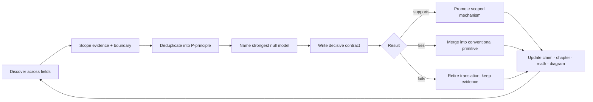

# Research roadmap

> A publication checkpoint records progress. Completion is earned by closing a
> gate, retiring a hypothesis, or producing a reproducible result.

## Scope

This roadmap converts an open-world research ambition into bounded iterations.
Breadth remains unlimited: any scientific field may contain a transferable
operation. Work remains finite because each iteration must change a canonical
claim, principle, chapter, equation, diagram, decision, or experiment—or record
that the new evidence changes none of them.

The stages are dependency gates rather than dates. Evidence discovery,
architecture writing, null-model comparison, and measurement design continue
in parallel, but an integrated system does not inherit a mechanism merely
because its audit is interesting.

## Biological observation

Development, adaptation, and maintenance operate on different timescales.
Variation precedes selection; temporary states can precede durable change;
stable organization remains repairable; and recurring behavior can migrate
into structure. Relevant observations are separated across
[P-003](../research/principle-registry.md#p-003--temporary-trace-before-commitment),
[P-004](../research/principle-registry.md#p-004--diversity-selection-and-protection),
[P-009](../research/principle-registry.md#p-009--maintenance-plane), and
[P-010](../research/principle-registry.md#p-010--structural-offloading-and-co-design).

The engineering consequence is progressive commitment. Cheap reversible work
comes first; expensive structural or hardware commitments require stronger
evidence and longer reuse horizons.

## Proposed AI translation

### One research iteration

Editable source:
[`../assets/diagrams/research-iteration-loop.mmd`](../assets/diagrams/research-iteration-loop.mmd).

An iteration has three independently reviewable outputs:

| Output | Minimum durable artifact | Meaningful completion |
| --- | --- | --- |
| evidence delta | dated audit, primary reference, scoped `C-` claim proposal | the observation and its boundary can be checked without the architecture prose |
| synthesis delta | merge into a `P-` principle or a written discriminating reason to keep it separate | another field name does not create another mechanism by default |
| decision delta | experiment contract, rejection, or explicit no-change record | the result changes what the project would build or test |

### Parallel workstreams

Four workstreams move continuously, with different exit conditions:

1. **Discovery and evidence.** Sample under-covered fields by constrained
   problem, audit primary sources, extract causal operations, and preserve
   boundary conditions.
2. **Principle synthesis.** Deduplicate observations using the mechanism tuple
   in [chapter 07](07-cross-domain-convergence.md), then update the shared
   primitive rather than accumulating themed components.
3. **Concept closure.** Turn retained principles into readable data contracts,
   control paths, state ownership, equations, null models, failure signatures,
   graphics, and measurable predictions.
4. **Decisive testing.** Compare one operation at a time against the strongest
   conventional method at equal interface, budget, hardware, and quality–risk
   envelope.

### Stage 0 — Evidence, synthesis, and contracts

Stage 0 is complete for a mechanism only when:

- its observation has at least one scoped claim and primary source;
- its nearest existing AI and engineering analogues are recorded;
- its normalized operation maps to a `P-` principle or a held candidate;
- the affected chapter exposes state, information flow, timescale, physical
  boundary, and failure behavior;
- every equation defines symbols and units;
- a conventional null, ablation, measurement envelope, and rejection condition
  exist; and
- imported discussions remain provenance rather than evidence.

The repository structure satisfies this workflow. Individual mechanisms remain
at different positions inside it; the
[domain inventory](../research/domain-inventory.md) and
[adoption matrix](../research/adoption-matrix.md) expose those differences.

### Historical evidence has a separate promotion gate

Longitudinal evidence enters the roadmap as one of four typed claims:

1. **Accounting identity:** the declared stocks and flows reconcile.
2. **Descriptive regularity:** a relation exists in a sampled period, place,
   coding system, and surviving archive.
3. **Causal estimate:** an intervention or design-specific contrast identifies
   an effect under explicit assumptions.
4. **Prospective prediction:** a frozen model succeeds on a period, place,
   lineage, or regime unavailable during development.

No row upgrades itself into the next. A cohort matrix can be arithmetically
correct and forecast poorly under changing rates. An adoption curve can fit
while influence, common cause, homophily, and command remain unidentified. A
historical instrument can estimate a local effect without predicting a future
system. A surviving record can support chronology while omitting destroyed or
never-produced evidence.

For interval $\Delta t$ seconds, the basic population identity is

$$
N_{t+\Delta t}=N_t+B_t-D_t+I_t-O_t,
$$

where $N$ is qualified units at a timestamp and $B,D,I,O$ are entry,
retirement, immigration, and outmigration counts during the interval. The
identity finds bookkeeping errors; it does not explain or forecast a flow.
The full cohort, selection, diffusion, collapse-vector, and prospective-test
contract is derived in
[population-observation math](../math/population-observation.md) and folded
into Candidate 014 rather than promoted as a new principle.

### Stage 1 — Isolated mechanism experiments

The first tests isolate control operations before composing them.

| Contract | Candidate operation | Strong null classes | Gate |
| --- | --- | --- | --- |
| [001 adaptive topology](../experiments/candidates/001-adaptive-topology.md) | reversible birth, routing, merge, and retirement | fixed sparse routing, periodic/global reoptimization, oracle bounds | structural changes improve a declared frontier after controller and migration cost |
| [002 context broadcast](../experiments/candidates/002-multiscale-context-broadcast.md) | rate-limited context decoded by receiver-local temporal filters | FiLM, recurrent gates, global tokens, low-rank hypernetworks, gain scheduling | extra temporal decoding value survives an equal bit-rate and state interface |
| [003 transition-class-aware recovery dynamics](../experiments/candidates/003-recovery-dynamics-fragility.md) | bounded probes estimate hidden restoring margin and reject inapplicable transition classes | SLO/headroom, change detection, state-space ID, observability analysis, mechanism-specific indicators | useful warning survives probe and false-action cost while noise, rate, boundary, hidden-mode, and jump cases receive calibrated abstention |
| [004 endogenous curriculum](../experiments/candidates/004-closed-endogenous-curriculum.md) | generate, intervene, evaluate, and retain structured proposals | imitation, matched stochastic sampling, active learning, model-based planning, evolutionary search | compositional or causal gain survives equal proposal, interaction, evaluation, memory, and energy budgets |
| [005 severity-ordered containment](../experiments/candidates/005-severity-ordered-containment.md) | contain spread, choose the least destructive qualified response, verify, escalate, and replenish | circuit breakers, static isolation, checkpoints, replicas, microrestart, scrubbing, rejuvenation, Bayesian repair/replace | collateral-loss and availability gains survive sensing, reserve, copying, replacement, and verification cost |
| [006 reversible physical skill](../experiments/candidates/006-reversible-physical-skill.md) | compile a mature physical mapping into a rewritable local substrate with health probes and digital fallback | passive mechanics, analog control, FPGA/ASIC, fixed physical and matched digital reservoirs | a measured conversion, transport, recurrence, or command path is removed and lifecycle break-even precedes qualified retirement |
| [007 endogenous-observation surveillance](../experiments/candidates/007-endogenous-observation-surveillance.md) | jointly estimate hidden state and action-altered observation while preserving sensing/action provenance | residual CUSUM/GLR, nowcasting, maximum coverage, value-of-information sampling, delay-aware POMDP/MPC | decisions improve on true data vintages without mistaking policy-induced telemetry suppression for recovery |
| [008 contestable modular allocation](../experiments/candidates/008-contestable-modular-allocation.md) | withheld audits, protected entrants, real opportunity consequences, and replayable commitments under measured strategic private information | calibrated routers, constrained/primal–dual control, contextual bandits, randomized evaluation, applicable matching/scoring mechanisms | tie or lose under cooperative direct observability; improve protected outcomes under gaming, identity, collusion, and allocator threats at equal cost |
| [009 graded assurance envelopes](../experiments/candidates/009-graded-assurance-envelopes.md) | bind distinct proof, effect, authority, evaluation, monitor, provenance, update, and recovery claims to a module version and invalidation graph | typed APIs, sandbox/IAM, CI/static analysis, runtime policy monitoring, lineage, canaries, transactions, schema/build invalidation | reduce unsafe admission, stale assurance, collateral rollback, and attribution time beyond the complete composed null at equal lifecycle budget |
| [010 reset-coupled staged verification](../experiments/candidates/010-reset-coupled-staged-verification.md) | create a reversible trace, invoke conditionally informative verification under commitment risk, then commit or reset with provenance | conditioned SPRT, calibrated cascade, abstention, retry plus rollback, redundant verifier, error-detecting code | improve false-commit, false-reject, latency, rollback, and energy frontiers only where later evidence is genuinely new and reset is cheaper than error |
| [011 dual-loop operational assurance](../experiments/candidates/011-dual-loop-operational-assurance.md) | connect bounded live command, containment, escalation, and restoration to dependency-linked verified learning, retrieval, and retirement | mature telemetry/tracing, SRE roles, IAM/interlocks, canaries, chaos drills, postmortems, action tracking, searchable runbooks | reduce tail containment and recurrence at equal authority, interruption, reviewer, storage, compute, human-time, and energy budgets |
| [012 latency-qualified authority](../experiments/candidates/012-latency-qualified-authority.md) | derive admissible local action from evidence age, integrity, mode, headroom, and coordination, then abstain, fall back, or hand off | adaptive protection, gain scheduling, supervisory/constrained/robust control, barrier functions, runtime assurance | improve service and risk without self-certification, unsafe envelope transitions, extra authority, privileged state, or uncharged reserve |
| [013 deficit–capability routing](../experiments/candidates/013-deficit-capability-routing.md) | send compressed unmet demand upward, return rate-limited scarcity context, and allocate or grow only where local capability is present | delayed centralized optimizer, backpressure, primal–dual allocation, learned routing, ordinary feasibility gates | improve fulfilled demand, tail starvation, regret, messages, oscillation, and energy without strategic capture or stale structural growth |
| [014 versioned observation contracts](../experiments/candidates/014-versioned-observation-contract.md) | preserve response, exposure, spatial/temporal support, preservation, intervention, selection, association, uncertainty, vintage, supersession, and follow-up dependencies with each inferred claim | typed/event-time evidence schema, state-space and Gaussian-process models, calibrated likelihood, selection function, lineage, multiplicity control, predictive checks, simulation calibration, surveillance schema, graded assurance | reduce overconfidence, invalid mixed-clock fusion, stale claims, and wasted follow-up beyond the complete composed null at equal lifecycle cost |
| [015 versioned repairable conventions](../experiments/candidates/015-versioned-repairable-conventions.md) | adapt local message forms while preserving typed literal meaning, uptake, repair lineage, protected meanings, compatibility, and rollback | typed protocol/DSL, schema registry, acknowledgement/retry, calibrated inference, replicated logs, standard coding, explicit migration and canary rollback | improve heterogeneous cross-play and drift adaptation without silent semantic failure or hidden decoder, repair, migration, and review cost |
| [016 conflict-bounded unit transition](../experiments/candidates/016-conflict-bounded-unit-transition.md) | define reproducible collective descendants, partition member and collective selection, and retain only conflict control with a net joint gain | ordinary modularity, typed interfaces, permissions/tests, clean versioning, external evaluation, routed experts, ensemble and population selection | demonstrate heritable collective capability and positive cost-adjusted between-collective selection under shortcuts, turnover, founder risk, and common-mode failure |
| [017 contract-preserving semantic compaction](../experiments/candidates/017-contract-preserving-semantic-compaction.md) | shrink histories under interpreter-, query-, representation-, evidence-, uncertainty-, rollback-, invalidation-, deletion-, access-, and corruption-degradation obligations | indexed history, snapshot plus suffix, views, key compaction, lossless compression, cold archive, extractive evidence summary, OAIS/PREMIS package, versioned schema/vocabulary, Candidate 014 | pass frozen hidden future-query, migration, dependency-turnover, and invalidation suites across workloads and hardware after complete physical, curatorial, and maintenance cost |
| [018 value-aware artifact tiering](../experiments/candidates/018-value-reconstructability-aware-tiering.md) | place artifacts using access/recompute forecast, task/evidence loss, invalidation value, and reconstructability under correlated failure | LRU/LFU, ARC, W-TinyLFU, size/miss-cost caching, static/economic tiering, coded fault-domain placement | improve leakage-free out-of-sample placement under shift after metadata, migration, tail, privacy, and failure costs |
| [019 audited cumulative inheritance](../experiments/candidates/019-audited-cumulative-inheritance.md) | preserve and recombine validated capability across learner turnover through separately versioned generation, transmission, evaluation, lineage, external state, and governance | centralized continual learning, replay/distillation, version control, retrieval, repositories, workflow engines, quality-diversity search, fixed governance | improve protected capability, recombination, compatibility, and newcomer learning at equal cumulative work after coordination and lifecycle cost |
| [020 constitutionalized multi-level control](../experiments/candidates/020-constitutional-control-plane.md) | scope local authority, escalate spillovers, type veto and appeal, revoke delegation, expose agenda, and repair higher-order rules under expiring emergency power | constrained optimization/MPC, IAM/interlocks, policy-as-code, separation of duties, independent evaluation, append-only lineage, runtime assurance, incident/change management | improve task-native or protected outcomes in two applicable task families after capture, gridlock, concentration, communication, oversight, and lifecycle cost |
| grounding loop | action-conditioned multimodal prediction and acquisition | passive multimodal learning, text-centric pretraining, standard world models | intervention and composition gains survive shortcut and missing-modality controls |
| memory lifecycle | capture, replay, externalize, weaken, or delete | reservoirs, prioritized replay, databases, caches, continual-learning regularizers | retention–adaptation improvement survives storage, maintenance, and deletion risk |
| mature hardening | compile, quantize, retrieve, or keep plastic through separate gates | compiler/autotuning, standard quantization, RAG, caching, distillation | each target produces a physical saving without freshness or recovery regression |

**Stage-1 exit gate:** at least one isolated operation changes the measured
quality–risk–latency–energy frontier relative to its strongest null. A tie
merges the biological translation into the conventional primitive; a loss
retires the translation while preserving the source evidence.

### Stage 2 — Runtime plus adaptation

Combine the event controller from [chapter 30](30-sparse-predictive-compute.md)
with attributable episodic capture from
[chapter 40](40-memory-and-consolidation.md). Keep slow structural state
protected while a branch adapts.

Required composed ablations:

- runtime only;
- adaptation only;
- runtime plus adaptation without maintenance pricing;
- full two-loop system with storage, replay, rollback, and controller cost; and
- dense or monolithic continual-learning baselines at the same capacity and
  observation stream.

**Stage-2 exit gate:** sequential adaptation improves a declared task stream
without a retention, calibration, rare-event, rollback, or lifecycle-energy
regression hidden by the average score.

### Stage 3 — Grounded developmental curriculum

Introduce temporally aligned perception, action, outcome, and language. Compare
passive observation, action-conditioned prediction, targeted acquisition, and
text-centric learning at matched capacity and interaction budget.

The environment must expose interventions, counterfactual structure, missing
modalities, sensor noise, delayed outcomes, and distribution shifts. Language
may describe, query, or compress the learned state; it cannot be the only path
by which every evaluation variable enters the model.

**Stage-3 exit gate:** held-out intervention, temporal prediction, transfer,
and composition gains survive leakage, memorization, simulator-state, and
language-shortcut controls.

### Stage 4 — Structural maturation

Apply the reversible maturity cycle from [chapter 50](50-grokking-and-pruning.md)
and the separated hardening targets from
[chapter 60](60-hardening-and-factual-memory.md). Candidate operations include
structured pruning, module fusion, compilation, placement, quantization,
retrieval externalization, write protection, and local reopening.

Every operation receives its own invalidation and recovery test. Parameter
count is diagnostic; resident bytes, transferred bytes, wall energy, tail
latency, maintenance, and rollback determine the system result.

**Stage-4 exit gate:** benefits remain positive after discovery, validation,
migration, shadow traffic, failed promotions, recovery, and the observed reuse
horizon are included.

### Stage 5 — Substrate co-design

Compare accepted mechanisms on optimized conventional hardware and on
event-driven, near-memory, neuromorphic, or other appropriate substrates.
[C-015](../research/claims.md#c-015) establishes feasibility for a scoped class
of event-driven systems; it does not select a winner for this workload.

Algorithm, precision, memory layout, interconnect, batching, cooling boundary,
and hardware control policy become joint experimental variables. The same
qualified event and quality–risk envelope apply to every substrate.

**Stage-5 exit gate:** an independently reproducible end-to-end lifecycle
advantage transfers beyond the workload or hardware used to tune it.

### Breadth-wave decisions and next queue

The latest completed audits already changed the architecture rather than merely
adding citations:

| Field cluster | Decision now recorded |
| --- | --- |
| endocrine and circadian control | most pulse decoding maps to P-002/P-006/P-011; persistent receiver-local phase remains held against clocks, timers, PLLs, and schedules in Candidate 002 |
| proteostasis and organelle quality control | sensing, containment, triage, repair, extraction, removal, replacement, and verification are separated; their ordered composition is Candidate 005 |
| fault tolerance and reconstruction | exact restore, coding, replication, detectors, scrubbing, and self-stabilization are mandatory nulls; only underdetermined functional repair remains speculative |
| Earth-system transition signals | Candidate 003 is narrowed to gradual observable stability loss and now includes noise, rate, flickering, hysteresis, spatial, hidden-mode, boundary, jump, and benign-slowing controls |
| adaptive materials and self-assembly | demonstrated physical computation, memory, patterning, assembly, and healing map to P-006/P-009/P-010; reversible physical skill compilation becomes Candidate 006 |
| epidemiology and surveillance control | placement, delay, ascertainment, pooled proxies, and intervention feedback map to P-001/P-007/P-009/P-013; endogenous observation becomes Candidate 007 |
| economics, market design, and incentives | prices, auctions, matching, scoring, bandits, sanctions, and ledgers map to existing bundles; contestable allocation becomes Candidate 008 only for persistent strategic private information |
| programming languages and verification | proof, monitored behavior, authority, rollback, provenance, and empirical evidence remain distinct assurance classes; their versioned binding and invalidation becomes Candidate 009 |
| chemistry and reaction networks | recognition, proofreading, nonequilibrium drive, autocatalysis, compartments, reaction–diffusion, transient assembly, molecular compute, oscillators, and integral control map to existing bundles; reset-coupled staged verification becomes Candidate 010 only where later evidence is conditionally new |
| high-reliability organizations and incident learning | field observations and doctrines do not transfer effect sizes; report denominators, topology, bounded escalation, incident command, and memory-in-use matter; the live/learning interface becomes Candidate 011 |
| power grids and protection | local protection, adaptive settings, estimation, synchronization, reserve, islanding, cascade, and black-start restoration become mature nulls; evidence- and headroom-qualified authority becomes Candidate 012 |
| plant distributed control | wound alarms, hydraulic/chemical drought response, patch foraging, tropisms, branching, source–sink flow, and mycorrhizal exchange map to existing bundles; organism, symbiosis, and community scales stay separate; deficit–capability routing becomes Candidate 013 |
| astronomy and planetary remote inference | the latent-to-measurement-to-selection-to-association chain becomes explicit; non-detection, trials, model support, predictive checks, computation calibration, and causal identification remain distinct; Candidate 014 tests dependency-bearing observation contracts |
| geology and geomorphology | efficient-looking fracture and drainage networks become passive-physics nulls; connectivity is not conductance, erosion implies relocation, topology change can destroy service, and mixed supports extend Candidate 014 rather than creating a new principle |
| security and cryptography | authentication, authorization, information flow, detection, containment, and clean recovery remain separate; adversary, epoch, revocation, independence, compromise-horizon, and clean-root fields refine Candidates 009 and 012 rather than creating a new principle |
| linguistics and communication | formal composition, pragmatic inference, common ground, repair, turn timing, coding, iterated learning, grounding, and convention formation remain separate; Candidate 015 tests their versioned lifecycle composition against mature protocol engineering |
| paleobiology and major transitions | demographic and reproductive bottlenecks, extinction and recovery, acquisition and integration, aggregation and individuality, exaptation, constraint, and fossil observation remain distinct; Candidate 016 retains only reproducible collective heredity plus costed conflict control |
| pathology and rehabilitation | local selection can oppose host goals; sampled response is not eradication; tolerance is layered; output can hide compensation or depleted reserve; plasticity and dose have no monotonic sign; compensation-aware recovery becomes a cross-candidate evaluation method rather than a new principle |
| databases and storage | transactions, isolation, real-time ordering, replication, access paths, caches, compaction, reclamation, replay, temporal coordinates, coded repair, and tiering remain distinct; Candidates 017 and 018 retain only finite semantic preservation and task/evidence value beyond mature storage nulls |
| cultural evolution and archaeology | generation, transmission, evaluation, retention, governance, accessible model diversity, path dependence, and archaeological formation remain distinct; Candidate 019 tests only the residual population-level inheritance advantage across turnover |
| social choice and institutional governance | theorem assumptions, empirical effects, and authorized normative commitments remain separate; aggregation, strategy, delegation, veto, agenda, capture, amendment, participation, and path dependence refine Candidates 008/011/012/015/016; Candidate 020 tests only the applicable multi-level composition |
| human–computer interaction and human factors | nominal human presence, trust, transparency, explanation, preference, and adaptation are not assurance; effective initiative binds timely state, actual/pending mode, executable authority, state delta, recovery, resumption, expiry, accessibility, and full human cost into Candidates 009/011/012/015 |
| quantitative history and demography | stock, flow, cohort, age, period, migration, replication, retirement, diffusion, archive selection, causal identification, collapse dimensions, and prospective validation remain distinct; their versioned composition strengthens Candidate 014 rather than creating another principle |
| aerospace, maritime, and safety-critical autonomy | stabilization, guidance, navigation, integrity, ODD, envelope protection, redundancy, fault stages, degraded service, fallback, collision avoidance, remote authority, certification, maintenance, and investigation remain distinct; validated asynchronous transfer refines Candidate 012 only |
| soft and active matter | passive relaxation, continuous fixed drive, external feedback, and adaptive policy remain separate; flocking, phase separation, defects, jamming, and assembly are physical mechanisms or nulls, while reversible phase-field compilation becomes only a Candidate-006 track |
| mechanical and civil resilience | compliant/passive mechanics, SHM, redundancy, robustness, graceful degradation, damage tolerance, fatigue/fracture, maintenance, max-flow/assignment, and transport recovery remain mature nulls; path-dependent residual capacity becomes a Candidates-005/012/014 test schema only |
| tribology, contact mechanics, lubrication, and adaptive interfaces | friction, real contact, film, wear, instability, third-body inventory, texture, adaptive coatings, and lifecycle transfer remain system-, operator-, support-, regime-, path-, and mission-qualified; [Fixture F-021](../experiments/fixtures/021-tribology-contact-adaptive-interfaces.md) carries [C-1497](../research/claims.md#c-1497)–[C-1505](../research/claims.md#c-1505) across Candidates 001/003/005/006/009/012/014/018 without promoting a principle or candidate |
| chemical and process engineering | conservation, nonlinear operation, separation, recycle, heat integration, MPC/RTO, fault stages, safety layers, operability, and plantwide control become mature nulls; only conservation-qualified flowsheet reconfiguration remains as a Candidate-001 stress track |
| metrology and measurement science | measurand, indication, calibration, adjustment, verification, validation, traceability, uncertainty, covariance, reproducibility, comparisons, decision rules, drift, software, and provenance remain distinct; their dependency-invalidating composition refines Candidates 009/014 and the energy model |
| developmental biology, morphogenesis, and regeneration | signal, competence, positional instruction, repair workforce, current context, field source, receiver geometry, scaling envelope, load path, boundary state, redundancy, local/global composition, and organizer selection remain distinct; [Fixture F-022](../experiments/fixtures/022-regenerative-positional-memory.md) carries [C-1506](../research/claims.md#c-1506)–[C-1515](../research/claims.md#c-1515) without promoting a principle or candidate |
| microbial ecology, biofilms, and fungal networks | molecular signaling, receiver response, cell physiology, transport, lineage ecology, selection, organismal flow, symbiosis, and ecosystem consequence remain distinct; one transported-field fixture refines P-011/P-013 and Candidates 001/013 |
| animal navigation, sensory ecology, biomechanics, and motor control | sensing policy, emitted signal, propagation, body mechanics, controller, calibration, environment, and task are bound explicitly; controlled observability and controller–plant binding refine Candidates 006/007/012/014 rather than becoming new principles |
| integrative comparative physiology | aggregate supply/local delivery, conditional branching, finite exchange, typed renal handling, delayed regulation, regional/global matching, predictive burden, synchrony/function, and fast/slow adaptation remain distinct; [Fixture F-020](../experiments/fixtures/020-integrative-comparative-physiology.md) carries [C-1488](../research/claims.md#c-1488)–[C-1496](../research/claims.md#c-1496) without promoting a principle or candidate |
| plant plasticity, memory, and systemic signalling | digital population memory, lifecycle reset, writer/trace/retrieval, regenerative placement, common alarm plus typed context, route identity, sense-by-growth admission, developmental resource state, boundary sensing, and integrated environmental state remain distinct; [Fixture F-023](../experiments/fixtures/023-plant-plasticity-memory-signalling.md) carries [C-1516](../research/claims.md#c-1516)–[C-1525](../research/claims.md#c-1525) without promoting a principle or candidate |
| applied multiscale reduction | exact projected memory, normal-hyperbolicity support, macro-to-micro reconstruction, and lift–heal–restrict closure remain distinct from generic averaging or fast/slow prose; [Fixture F-024](../experiments/fixtures/024-applied-multiscale-reduction.md) carries [C-1526](../research/claims.md#c-1526)–[C-1529](../research/claims.md#c-1529) and the [closure contract](../math/multiscale-reduction-contract.md) without promoting a principle or candidate |
| pharmacology and toxicology | commanded intervention, realized exposure, engagement, response, benefit, harm, adaptation, dependence, withdrawal, interaction null, and population support remain separate; a state-qualified intervention fixture refines Candidates 005/007/012/014 |
| operations research, supply chains, and learning science | confidence and inventory records share one proxy-versus-state firewall, but instructional events and material commitments remain different transitions; horizon-qualified learning refines Candidates 004/019 while material service refines existing allocation/recovery candidates |
| legal evidence and procedure | normative authority, doctrine, empirical effect, formal inference, authentication, admissibility, weight, sufficiency, challenge, review, remedy, and finality remain distinct; a burden-qualified contestable-decision record refines Candidates 009/010/011/014/015/020 |
| built environments and urban systems | accessibility, spatial configuration, passive physics, occupancy, controls, information models, commissioning, life safety, accessibility, infrastructure dependency, lifecycle burden, and recovery remain separate; no new principle survives, while an occupied-transition stress track narrowly refines Candidate 001 |
| immune tolerance, adaptation, and memory | representation, recognition, deletion, ignorance, anergy, active suppression, exhaustion, expansion, contraction, affinity selection, trained state, context, memory maintenance, residency, and immunometabolism remain distinct; no new principle or candidate survives, while a typed lifecycle contract remains an evaluation discipline |
| music cognition, performance, and improvisation | statistical expectation, grouping, tonal state, phase correction, motif transformation, auditory–motor feedback, expressive plans, ensemble synchronization, improvisation, practice, far transfer, and enculturation map to existing bundles and ordinary sequence/control/retrieval/search/curriculum nulls; shared-clock-free partner- and phrase-specific co-adaptation remains a benchmark fixture only, not a principle or candidate |
| library, archival, and information science | provenance is not truth, fixity is not authenticity, retention is not useful memory, and retrieval rank is not epistemic confidence; appraisal, designated communities, representation dependencies, authority/vocabulary drift, migration, FAIR packaging, and institutional capability refine Candidates 014/015/017/018/019, while no new principle survives |
| comparative cognition, tool use, and flexible action | manufacture, causal transfer, future preparation, event memory, uncertainty control, social learning, teaching, recombination, exploration, inhibition, route recovery, and peripheral control are kept task-, opportunity-, morphology-, observation-, and history-qualified; species/task rankings are rejected, and Fixture F-003 refines evaluation for Candidates 004/006/007/014/018/019 without promoting a principle or candidate |
| visual art and design cognition | reconstructive generation, external workspaces, epistemic action, analogy, copying, fixation, proposal/selection separation, qualified aesthetic evaluators, material feedback, cultural accumulation, and provenance map to existing bundles; Fixture F-002 tests a versioned reconstruct–externalize–inspect–transform–evaluate composition across Candidates 004/014/017/018/019 without promoting a principle or candidate |
| mathematical practice and proof discovery | conjecture, analogy, abstraction, counterexample search, proof decomposition, libraries, representations, invariants, theorem proving, certificates, SAT/SMT, model finding, experimental mathematics, collaboration, and teaching map to mature methods; Fixture F-004 keeps attributable proposals separate from typed acceptance, reconstructs proof DAGs through small checkers, uses dependency-safe splits and reverse-dependency invalidation, and charges complete human/joule budgets across Candidates 004/009/010/011/014/017/019 without promoting a principle or candidate |
| fluid dynamics and turbulence | signed cascade/flux, intermittency and tails, detector-qualified coherent structures, closure/model-form support, objective-qualified ROMs, adaptive-resolution total work, observation/assimilation/observability, sensor-placement transport, stable net-benefit control, a mixing vector, path-dependent transition, calibrated extremes, measurement operators and uncertainty, and the full energy boundary remain separate; Fixture F-005 carries the outcome firewall across Candidates 002/003/006/007/012/014 without promoting a principle or candidate |
| sports expertise, adaptive performance, and team coordination | anticipation/interception, causal cue use, practice/retention/transfer, relevant variability, speed/accuracy/risk/energy, fatigue/readiness/damage/return, shared information/coordination, adversarial deception, feedback dependence, prospective selection, and full human/joule budgets remain separate; Fixture F-006 carries the representative history/resource-qualified performance contract across Candidates 002/004/006/007/009/012/014/019 without promoting a principle or candidate |
| optics, photonics, and inverse sensing | forward operators, finite information modes, null-space ambiguity, photon/noise budgets, structural priors, active/coded acquisition, adaptive correction, drift, saturation, fusion, optical transforms, conversion, analog error, fabrication, thermal control, future-query recovery, and full lifecycle energy remain separate; Fixture F-007 carries the operator-qualified measure–infer–intervene–monitor–route–retain contract across Candidates 001/006/007/010/014/017/018 without promoting a principle or candidate |
| semiconductor device and circuit reliability | qualification, hierarchical yield and variability, reversible drift, cumulative degradation, abrupt failure, transient upset, fault geometry, correction/recovery stages, adaptive margin, analog/in-memory physical state, endurance/wear, accepted field service, and fabrication-to-retirement burden remain separate; Fixture F-008 carries the mission-profile-qualified degradation/recovery contract across Candidates 001/005/006/009/010/012/014/017/018 without promoting a principle or candidate |
| acoustics, hearing, and auditory-scene analysis | calibrated pressure/level and room support, cochlear filtering/compression, temporal coding, spatial cues, masking/grouping/separation, reverberation/context, sparse activity, efferent control, echolocation and active emission/reception, array inference, uncertainty, calibration, and complete lifecycle cost remain separate; Fixture F-009 carries the operator- and action-qualified acoustic contract across Candidates 002/006/007/009/012/014 without promoting a principle or candidate |
| information thermodynamics and physical computation | 46 established, 5 plausible, and 1 disputed claim keep logical transformation, device, circuit, computer/workload, facility, and lifecycle quantities separate; finite-time/error/reservoir/controller costs, reversible history, thermal noise, information engines, thermodynamic uncertainty, distribution mismatch, data movement, PUE, and embodied burden refine P-001/P-003/P-006/P-007/P-008/P-009/P-010/P-012/P-013; Fixture F-010 carries the boundary-qualified physical-computation contract across Candidates 001/005/006/009/010/012/014/017/018 without promoting a principle or candidate |
| olfaction, chemical sensing, and plume tracking | 50 established, 1 plausible, and 1 disputed claim keep receptor/sensor coverage, identity, concentration, mixtures, normalization, sniff/pump dynamics, adaptation, turbulent transport, active search, sparse and drifting representations, valence, cross-reactive arrays, humidity, poisoning, analytical confirmation, exposure, safety, and lifecycle cost separate; Fixture F-011 carries the operator-qualified active chemical-sensing contract across Candidates 002/006/007/009/010/012/014/017/018 without promoting a principle or candidate |

The music, library/archival, comparative-cognition, visual-design,
mathematical-practice, fluid-dynamics, sports, optics, semiconductor, acoustics, information-thermodynamics, and olfaction/chemical-sensing queues are closed by explicit
no-promotion decisions. The music
[Fixture F-001](../experiments/fixtures/001-shared-clock-free-coadaptation.md)
retains E-MUSIC-07 as a cross-candidate benchmark; the archival refinement
stays inside Candidate 017's query-registered preservation track; and
comparative cognition contributes
[Fixture F-003](../experiments/fixtures/003-opportunity-history-qualified-action.md)
as an opportunity/history audit across Candidates 004/006/007/014/018/019;
and visual design contributes
[Fixture F-002](../experiments/fixtures/002-versioned-reconstructive-design.md)
as a versioned reconstruct–externalize–inspect–transform–evaluate audit across
Candidates 004/014/017/018/019. It treats fixation and negative transfer as
measured failure modes, qualifies evaluators and material evidence, and keeps
lineage separate from truth, intent, and recoverability; and mathematical
practice contributes
[Fixture F-004](../experiments/fixtures/004-versioned-proof-discovery.md) across
Candidates 004/009/010/011/014/017/019. It keeps proposal provenance separate
from correctness, requires counterexamples and proof-DAG reconstruction,
preserves typed lifecycle state, prevents dependency leakage, propagates
reverse-dependency invalidation, and includes proof, checker, human, rebuild,
and joule cost; and fluid dynamics contributes
[Fixture F-005](../experiments/fixtures/005-regime-qualified-flow-inference-control.md)
across Candidates 002/003/006/007/012/014. It requires signed scale transfer,
tail fidelity, detector-qualified structures, explicit closure/model support,
objective-qualified reduction, total adaptive work, actual observation and
sensor operators, observability and posterior calibration, stable net-benefit
control, vector mixing outcomes, transition history, extreme calibration,
propagated uncertainty, and a full lifecycle energy boundary. Its null is the
complete relevant CFD, reduced-model, estimation, sensing, control,
rare-event, metrology, and accounting stack.
Sports contributes
[Fixture F-006](../experiments/fixtures/006-representative-adaptive-performance.md)
across Candidates 002/004/006/007/009/012/014/019. It preserves actual
observation/action coupling; separates anticipation from interception,
practice from retention and transfer, relevant exploration from variance, and
fatigue/readiness/damage from staged return; challenges coordination with
turnover and perturbation, deceptive cues with calibration, selection with
counterfactual opportunity, and apparent efficiency with full athlete, coach,
facility, sensor, recovery, medical, failed-pathway, wall-time, and joule
budgets. Its null is the complete calibrated prediction, retrieval, planning,
control, curriculum, assurance, coordination, causal-inference, and lifecycle-
accounting stack.
Optics contributes
[Fixture F-007](../experiments/fixtures/007-operator-qualified-optical-inference.md)
across Candidates 001/006/007/010/014/017/018. It binds inferred state to the
physical operator, acquisition action, photons/noise, calibration, ambiguity,
prior support, saturation, typed uncertainty, route eligibility, retained-query
obligation, and complete resource boundary. Its adversarial tracks test null-
space honesty, prior mismatch, active photon allocation, multiplex crossover,
drift attribution and fallback, optical/digital service curves, multi-device
fabrication and thermal variation, and physical compaction under future queries.
Its null is the complete inverse-method, experiment-design, control, fusion,
digital/analog acceleration, calibration, and lifecycle-accounting stack.
The first T1 slice is now executable as the
[F-007 null-space-honesty smoke harness](../experiments/workstation/fixture-007/README.md):
it must expose false specificity, accept justified abstention, and exactly tie
the complete mature active null rather than manufacture a novelty advantage.
Semiconductor reliability contributes
[Fixture F-008](../experiments/fixtures/008-mission-profile-qualified-device-reliability.md)
across Candidates 001/005/006/009/010/012/014/017/018. It binds accepted
service to manufactured-unit hierarchy, mission profile, mechanism-specific
acceleration, censoring, monitor age, electrothermal concentration, fault
geometry, correction and recovery state, protected exact boundaries, physical-
weight age, endurance, and fabrication-through-retirement resources. Its ten
tracks test hierarchical transfer, accelerated-life support, sparse wear,
correlated faults, voltage authority, approximation containment, analog/digital
crossover, nonideality transfer, wear placement, and keep/repair/repurpose/
replace policy against the complete mature reliability stack.
Acoustics contributes
[Fixture F-009](../experiments/fixtures/009-operator-qualified-active-acoustic-inference.md)
across Candidates 002/006/007/009/012/014. It binds each result to source and
emission action, propagation/room state, receiver geometry and motion,
calibrated operator support, context/history, literal target, uncertainty,
independent unit, feasible action, exposure, and complete resource boundary.
Its nine tracks test level-dependent front ends, sparse event timing, active
emission/reception, localization under operator shift, reverberation transfer,
grouping/separation, efferent-like gain, multi-emitter interference, and full
lifecycle cost against the complete calibrated acoustics, inference, control,
spectrum, uncertainty, and accounting stack.
Information thermodynamics contributes
[Fixture F-010](../experiments/fixtures/010-boundary-qualified-physical-computation.md)
across Candidates 001/005/006/009/010/012/014/017/018. It binds every physical-
efficiency result to one accepted service while keeping logical, device,
circuit, workload, facility, and lifecycle quantities distinct. Its tracks
challenge lower-bound substitution, finite-time and finite-error operation,
reversible-history closure, thermal reliability, measurement/controller reset,
uncertainty-relation applicability, distribution mismatch, topology, data
movement, PUE allocation, and fabrication-to-retirement ranking. Its null is
the complete compression, reversible-computation, stochastic-thermodynamics,
circuit/architecture, workload-metering, facility, and lifecycle-assessment
stack.
Olfaction and chemical sensing contribute
[Fixture F-011](../experiments/fixtures/011-operator-qualified-active-chemical-sensing.md)
across Candidates 002/006/007/009/010/012/014/017/018. It binds source and
release, turbulent or reactive transport, realized sniff/pump/motion, receiver
path, dynamic response and recovery, cross-sensitivity, calibration and
exposure history, operator support, literal outcome, feasible action, safety,
independent unit, and complete lifecycle cost. Its fourteen tracks test
concentration–identity factorization, sensor coverage, normalization,
deconvolution, active acquisition, bilateral/serial/wind cues, plume statistics,
search policy, embodiment, sparse total cost, drifting representations, mixture
masking, sensor poisoning, analytical confirmation, and safe tiered action
against the complete calibrated sensing, analytical, estimation, control,
standards, human-work, consumable, and lifecycle stack.
The next
breadth field is selected by expected ability to split, merge, reject, or
re-baseline a current mechanism. Breadth alone does not close a row.

## Efficiency mechanism

Stage gates reduce the cost of compounding weak mechanisms. Shared principle
bundles reuse telemetry, baselines, and test regimes; isolated rejection avoids
paying for full-system integration; exact provenance prevents repeated searches;
and negative results retire duplicated work.

For stage $k$, let $E_{k,\mathrm{research}}$ and $E_{k,\mathrm{integration}}$
be joules spent within declared research and compute boundaries. Let
$p_{k,\mathrm{survive}}$ be the empirically estimated fraction of candidates
that pass the isolated gate. The expected integration energy avoided by testing
first is

$$
E_{k,\mathrm{avoided}}
= (1-p_{k,\mathrm{survive}})E_{k,\mathrm{integration}}
- E_{k,\mathrm{research}}.
$$

This quantity is reported only when both energy boundaries are actually
measured; its purpose is to expose the cost of evaluation, not to assume that
research automatically saves energy.

## Evidence status

- The ordering and gates are project decisions.
- Mechanism-specific evidence remains in the
  [claims ledger](../research/claims.md); roadmap placement does not promote a
  claim.
- The three existing experiment contracts are specified but not executed.
- The five-stage composition and its lifecycle benefit remain speculative until
  the gates produce measured results.
- Sensorimotor transfer remains speculative under
  [C-007](../research/claims.md#c-007).

## Speculative extensions

- Maintain a machine-readable experiment ledger linked to commits, hardware
  records, raw telemetry, derived figures, and claim-status changes.
- Use active literature search to select the next field by expected impact on
  an unresolved principle, not by publication volume.
- Allocate compute to experiments by expected decision value and uncertainty
  reduction once the proxy is calibrated against actual outcomes.
- Run adversarial review agents whose only task is to find conventional
  explanations, hidden costs, or domain evidence that breaks a principle.
- Publish negative results and retired translations as reusable research
  outputs rather than silently deleting them.

## Failure modes

- **Perpetual breadth:** new fields accumulate without changing principles or
  experiments.
- **Premature composition:** several plausible mechanisms are integrated before
  any one survives its null model.
- **Gate drift:** thresholds or comparison boundaries change after results are
  visible.
- **Mechanism creep:** a component enters the system without a claim, principle,
  ablation, or owner.
- **Proxy capture:** FLOPs, parameter count, or average accuracy substitutes for
  measured physical cost and qualified behavior.
- **Negative-result loss:** a failed translation disappears and later returns
  under another domain name.
- **Benchmark enclosure:** the roadmap optimizes a convenient task family that
  no longer tests the intended operation.
- **Documentation lag:** equations, diagrams, or claim status stop matching the
  executed artifact.
- **Hardware lock-in:** a mechanism is tuned to one substrate before its
  functional interface is stable.
- **Narrative immunity:** biological appeal preserves a mechanism after its
  measurable predictions fail.

## Measurable predictions

1. Each breadth wave changes at least one principle boundary, null model,
   experiment regime, or explicit no-change decision; otherwise the sampling
   policy is revised.
2. The ratio of scoped claims to deduplicated principles increases as coverage
   grows, while duplicate organism-themed components decline.
3. At least one Stage-1 candidate ties a conventional baseline and is merged,
   and at least one loses and is retired; a roadmap in which every mechanism
   wins is not discriminating.
4. Shared telemetry and null-model infrastructure reduce the incremental cost
   of testing later principles relative to the first isolated contracts.
5. Mechanisms that pass isolated gates still sometimes fail composition,
   producing explicit interaction terms rather than post-hoc stories.
6. Lifecycle accounting reverses at least one apparent saving based on FLOPs,
   parameter count, or inference-only energy.
7. Every completed stage leaves reproducible baselines, scoped claim changes,
   negative results, and a smaller set of unresolved integration decisions.
