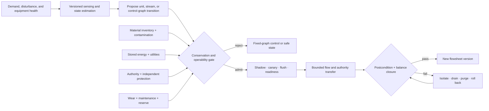
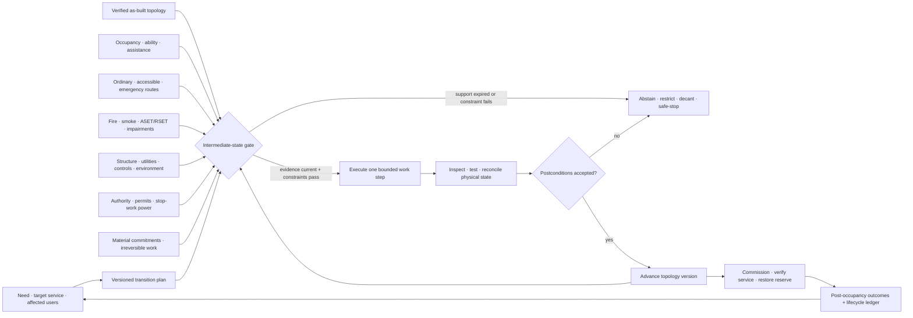

# Candidate 001 — Adaptive logical topology under changing flow

**Stage:** 1 — simulator contract, before model implementation  
**Status:** candidate; not approved as an architecture  
**Primary principle:** [P-005 — use-dependent topology](../../research/principle-registry.md#p-005--use-dependent-topology)  
**Adjacent principles:** [P-006 — homeostatic negative feedback](../../research/principle-registry.md#p-006--homeostatic-negative-feedback), [P-007 — prediction-error allocation](../../research/principle-registry.md#p-007--prediction-error-allocation), [P-009 — maintenance plane](../../research/principle-registry.md#p-009--maintenance-plane), [P-010 — structural offloading](../../research/principle-registry.md#p-010--structural-offloading-and-co-design)  
**Engineering null models:** [engineering analogue audit](../../research/audits/2026-08-05-engineering-analogues.md#p-005--use-dependent-topology), [chemical and process engineering audit](../../research/audits/2026-08-05-process-engineering.md)

## Scope and scientific boundary

This experiment asks whether changing an active logical graph is useful after
charging the costs that fixed-graph comparisons usually omit. It does **not**
test a neural model, establish a physical-energy saving, or validate a literal
slime-mold, fungal, synaptic, or astrocytic algorithm.

The biological leads are deliberately narrow:

- [C-027](../../research/claims.md#c-027) supports a local
  flow-reinforcement/decay model in the studied *Physarum* networks, not expert
  routing;
- [C-034](../../research/claims.md#c-034) supports coupled exploration,
  fusion, and transport in the studied fungal networks, not a digital graph;
- [C-021](../../research/claims.md#c-021) and
  [C-042](../../research/claims.md#c-042) support activity-dependent biological
  removal mechanisms in specific mouse preparations, not a general pruning
  policy; and
- [C-035](../../research/claims.md#c-035) motivates charging and testing
  reserve routes, although it is presently bundled under P-001 and P-006 rather
  than P-005.

Stage 1 is an engineering falsification test. A positive result permits a
small model-bearing Stage 2 proposal; it does not establish architectural
novelty by itself.

## Hypotheses

### Primary hypothesis H1

Under nonstationary and recurrent communication demand, a locally updated
logical topology with reinforcement, decay, hysteresis, and explicitly priced
reserve capacity can achieve both:

1. non-inferior timely delivered utility relative to the strongest
   fixed-topology adaptive-routing baseline; and
2. lower full-lifecycle joules per timely utility unit plus faster recovery
   than both adaptive routing on a fixed graph and periodic global topology
   re-optimization.

All compute, telemetry, data movement, migration, idle reserve, control, and
recovery costs count.

### Null hypothesis H0

Any apparent benefit is matched by standard adaptive routing or periodic graph
optimization once all methods receive equal budgets and reconfiguration costs
are included. Under H0, P-005 should remain an explanatory biological bundle,
not an AI architecture claim.

### Causal sub-hypothesis H1a

Changing topology, rather than merely changing edge weights or routes, causes
the gain. The full candidate must therefore outperform its frozen-topology
ablation with all other control logic intact.

## Stage-1 system model

### Logical modules and candidate graph

- There are $N=64$ logical modules and $K=4$ latent demand communities.
- The candidate supergraph contains every undirected module pair. This defines
  what may be activated; it does not provision every edge.
- At most $M=4N=256$ undirected edges may be active. The initial active graph
  is identical for every method, connected, and has degree eight at every node.
- Each active edge has $1\ \mathrm{Gbit/s}$ capacity, $50\ \mathrm{\mu s}$
  propagation latency, and one unit of provisioned link state. These are
  simulator defaults, not claims about a target device.
- Each request carries $4096\ \mathrm{byte}$, incurs $10^6$ declared service
  operations at its destination, and has a $10\ \mathrm{ms}$ end-to-end
  deadline. Sensitivity runs vary all four quantities.
- Routing and queuing are event-driven at microsecond resolution. Telemetry is
  aggregated in $\Delta t=1\ \mathrm{s}$ windows. A topology may change only at
  a $10\ \mathrm{s}$ control epoch boundary.

The initial graph, module placement, request trace, failures, random choices
available to a policy, and energy coefficient manifest are paired across
methods for each seed.

### Synthetic demand process

For regime $r$, each module has a balanced community label $z_i^r$. Requests
from module $i$ to module $j$ arrive as a Poisson process with rate

$$
\lambda_{ij}^{r}(t) = s(t)
\left[\lambda_{\mathrm{out}} +
(\lambda_{\mathrm{in}}-\lambda_{\mathrm{out}})
\mathbf{1}\{z_i^r=z_j^r\}\right].
$$

$\lambda$ is in requests/s; $s(t)$ is a dimensionless scale chosen so offered
load is 50%, 75%, or 95% of the fixed aggregate edge capacity; and the
indicator is dimensionless. The generator contains three balanced partitions:

- **A:** contiguous blocks of sixteen modules;
- **B:** interleaved groups defined by module index modulo four; and
- **C:** a seeded balanced random partition unseen during policy tuning.

The confirmatory trace is $3600\ \mathrm{s}$ long. Regime dwell time is
$50+G$ seconds, where $G\sim\operatorname{Geom}(p=0.01)$ is truncated at 250
seconds. At a transition there is 0.4 probability of
returning to the immediately previous regime; otherwise a different regime is
selected uniformly. Policies see arrivals and permitted telemetry, never the
regime label, transition time, future trace, or generator state.

Load scale follows a seeded three-state Markov chain over 50%, 75%, and 95%
offered load. A state persists each second with probability 0.98; on transition
one of the other states is selected uniformly. This produces bursts without
letting topology changes key directly on a scripted phase.

### Change and fault diagnostic suite

The stochastic trace is the confirmatory test. A separate paired diagnostic
suite isolates mechanisms:

1. stable A for 600 seconds;
2. abrupt A→B at an undisclosed time in $[200,400]$ seconds;
3. recurrent A→B→A with undisclosed dwell times of 150–300 seconds;
4. gradual A→C mixing, where the fraction of C traffic rises linearly from
   zero to one over 300 seconds;
5. a 50%→95% load burst lasting 60 seconds; and
6. one seeded active-edge failure every 600 seconds, lasting 10–50 seconds,
   plus one seeded module failure per 3600-second trace, lasting 30 seconds.

Failed capacity is unavailable to every method. Repair restores the edge or
module but not any topology state a method chose to delete. No method receives
advance failure notice.

### Why this task is adequate—and insufficient

It is adequate to test routing, structural change, reserve, recurrence, and
full cost accounting without confounding results with model training. It is
insufficient to claim improved learning, representation, or inference. Those
require Stage 2 with real modules and measured hardware energy.

## Process-domain stress track

The logical-network task can hide a structural mistake because bytes can be
copied or dropped cheaply and a graph edit can be treated as instantaneous.
Chemical process reconfiguration supplies a stricter complementary track. It
changes the active unit, stream, and control graph while inventory, stored
energy, contamination, actuator authority, protection independence, equipment
condition, reserve, and maintenance state continue to evolve
([C-501](../../research/claims.md#c-501),
[C-510](../../research/claims.md#c-510),
[C-512](../../research/claims.md#c-512)).

Editable source:
[conservation-qualified-reconfiguration.mmd](../../assets/diagrams/conservation-qualified-reconfiguration.mmd).

For component $i$, the transition ledger must close

$$
\Delta n_i
= \int_{t_0}^{t_1}
\left(
\sum_{j\in\mathcal I}F_jz_{ij}
-\sum_{j\in\mathcal O}F_jz_{ij}
+V\sum_r\nu_{ir}r_r
\right)dt + \varepsilon_i,
$$

where $n_i$ is mol, $F_j$ is mol/s, $z_{ij}$ and $\nu_{ir}$ are
dimensionless, $V$ is m³, $r_r$ is mol/(m³ s), and $\varepsilon_i$ is the
declared closure residual in mol. Energy closure uses the same interval and a
residual in J. A transition is inadmissible when closure uncertainty exceeds a
preregistered tolerance, any reachable transient leaves the operating or
protection envelope, ownership is ambiguous, or the rollback path is no longer
reachable.

The equal-budget comparison is the audit's E-PROC-09 track:

1. fixed installed graph with adaptive flows and tuned MPC/RTO;
2. fixed graph with ordinary multi-mode supervisory control and planned bypass;
3. offline reoptimized schedule with executable startup and shutdown sequence;
4. the held structural policy under identical installed units, reserve,
   sensors, estimation, controller work, flush material, energy, maintenance,
   and recovery authority; and
5. a trace-aware oracle reported only as an unattainable diagnostic ceiling.

Report useful product kg, utility J/kg, off-spec and purge kg, downtime h,
constraint violations, contamination, transition failures, proof-test and
maintenance work, and recovery s over paired demand and health traces. Reject
the process-domain residual if mode selection explains the result, balance
closure is omitted, graph construction or idle equipment is uncharged, or the
advantage disappears after one maintenance and one rollback cycle
([C-516](../../research/claims.md#c-516)). A pass refines H1; it does not create
a separate principle.

## Transported-inventory topology track

Add a paired task in which typed inventory remains in flight while demand
sinks move and edges are added, reinforced, isolated, or retired. The same
delivered flow may update future conductance, but raw traffic is never treated
as utility. Compare fixed multipath, backpressure, adaptive weights, periodic
global topology optimization, stateful make-before-break routing, and local
flow-linked edits at identical links, buffers, controller work, state,
telemetry, reserve, and energy.

Report type-specific conservation residual, duplicate/lost inventory,
contamination spread, deadline loss, construction and regression, compatibility
checks, transition joules, rollback, second-hit service, and recovery. Separate
rapid containment, route switching, structural bypass, and functional repair
([C-577](../../research/claims.md#c-577)–[C-581](../../research/claims.md#c-581)).
Reject the residual if ordinary stateful routing or the global optimizer ties,
if inventory hides in uncharged buffers, or if geometry and cleanup do not
change task outcome. This is the Candidate-001 side of the shared
[transported-field fixture](../../concept/07-cross-domain-convergence.md#transported-fields-are-not-messages).

## Occupied spatial topology track

The network experiment prices migration but still permits a graph edge to
change without walls, people, smoke, utilities, permits, or irreversible work.
The [built-environment audit](../../research/audits/2026-08-05-built-environment-urban-systems.md)
adds one deliberately hostile track: change physical and service topology while
people or critical services remain inside the affected boundary.

This track is applicable only when all of the following hold:

1. geometry, circulation, compartmentation, utility/control zoning, structural
   load path, or functional use actually changes;
2. occupants, critical service, or hazardous inventory remains present during
   at least one step;
3. material, legal, or temporal commitments make instantaneous rollback false;
4. accessible use, egress, tenability, structural/utility service, and authority
   must remain valid in every intermediate configuration; and
5. isolation plus a fixed pre-approved sequence is not already sufficient.

Editable source:
[occupancy-qualified-spatial-transition.mmd](../../assets/diagrams/occupancy-qualified-spatial-transition.mmd).
The [mathematical contract](../../math/occupied-spatial-transition.md) defines
the typed transition state, evidence-age and authority gates, scenario-specific
egress margin, group-visible service loss, irreversibility, and recovery with
reserve restoration.

### Matched arms

Use at least five arms on the same occupied reconfiguration tasks:

| ID | Arm | Required content |
| --- | --- | --- |
| BE0 | conventional fit-out | professional design and ordinary construction management |
| BE1 | modular/open system | service separation and prefabricated or replaceable components |
| BE2 | mature ordinary stack | BE1 plus permits, impairment control, configuration management, commissioning, and asset management |
| BE3 | ordinary stack + qualified observations | BE2 plus Candidate 014 evidence support, age, coverage, and invalidation |
| BE4 | full held contract | BE3 plus explicit intermediate-state gates, user-group service, commitments, safe-stop, and reserve restoration |

All arms receive identical target function, asset geometry, users and ability
profiles, code basis, hazards, sensors, professional review, staff time,
material, plant, construction windows, maintenance, and whole-life budget.
Life-safety and accessibility limits are feasibility constraints; neither may
be traded for mean energy, schedule, or cost.

### State and measurements

At every step, log current, target, and verified as-built topology; actual and
forecast occupancy; ordinary, accessible, construction, emergency, responder,
and goods routes; compartment and impairment state; scenario-specific ASET and
RSET; structure, utilities, controls, indoor environment, evidence support,
permits and authority; installed, removed, in-transit, reusable, waste, and
irreversible material; acceptance tests, defects, safe-stop reachability, and
reserve.

Report, without hiding subgroup distributions:

- hard life-safety, accessibility, structural, utility, and environmental
  violations;
- person-hours or service-unit-hours lost by user group;
- route impairments, untenable exposure, incorrect continuation, unnecessary
  stops, defects, rework, and recurrence;
- transition and recovery time, including time to restore reserve;
- energy, material, waste, whole-life GWP, present cost, and displaced burden;
- evidence collection, modelling, review, commissioning, and maintenance work;
  and
- component reuse yield after inspection, not planned disassembly alone.

### Rejection gate

Merge this track into ordinary asset management if the mature BE2 or BE3 arm
matches the protected-service and lifecycle frontier. Reject it immediately if
any protected-user constraint is violated, a claimed advantage depends on an
unverified model or ideal actuator, rollback ignores irreversible work, or
reopening is counted before defects and reserve are restored. A surviving
result refines Candidate 001; it does not create another principle.

## Methods

### Required standard engineering baselines

| ID | Method | What may adapt | Purpose |
| --- | --- | --- | --- |
| B0 | Dense provisioned reference | routes | reference only; its excess idle capacity is charged |
| B1 | Fixed sparse shortest path plus equal-cost multipath | routes on failure | basic sparse baseline |
| B2 | Fixed sparse proportional-fair multicommodity flow | flow rates and routes | established congestion/allocation baseline |
| B3 | Fixed topology with online edge weights and adaptive routing | weights, rates, routes | strongest baseline that adapts without rewiring |
| B4 | Periodic global topology optimizer | topology under the same per-epoch edit and migration ceilings as the candidate | tests whether ordinary graph re-optimization explains the gain |
| B5 | Trace-aware offline oracle | topology and routes with future knowledge | unattainable upper bound; never used for a superiority claim |
| B6 | Random valid edge swaps | topology under the same update budget | negative structural-control baseline |

B4 solves a declared min-cost capacitated graph/routing objective using only
the telemetry history available at its control epoch. Its optimization time,
memory traffic, and migration are charged. Its update interval is tuned on the
development split under the same controller budget as the candidate. B5 is
excluded from inferential comparisons.

### Candidate topology-update rule families

No final P-005 algorithm is assumed. The development phase may instantiate and
compare these rule **families**, subject to the same hard budgets:

1. **Local flow reinforcement and decay.** Each active edge holds a capacity or
   persistence score. Useful delivered flow raises it; an explicit decay term
   lowers it. Variants use raw flow, timely utility-bearing flow, or marginal
   congestion relief. Raw activation magnitude is not silently equated with
   usefulness.
2. **Hysteretic activation.** An inactive candidate is activated above an
   upper score and an active edge is retired below a distinct lower score.
   This tests whether two thresholds prevent destructive churn.
3. **Error-triggered frontier exploration.** A node with unresolved or dropped
   demand may spend a fixed exploration budget sampling an inactive incident
   edge. The signal may be queue residual, deadline loss, or unmet flow; these
   variants remain separate.
4. **Reserve-protected adaptation.** A declared fraction of active edge-time
   remains available as failover/exploration reserve. Minimum degree and bridge
   constraints prevent accidental disconnection.
5. **Maintenance-epoch adaptation.** Topology proposals accumulate locally but
   a slower auditable controller admits, rejects, or rolls them back only at
   the control boundary.

A generic score template is

$$
s_e(t+1)=s_e(t)+\eta_R R_e(t)-\eta_D D_e(t)+\eta_X X_e(t),
$$

where $s_e$ is dimensionless persistence score, $R_e$ is normalized useful
flow, $D_e$ is normalized inactivity or cost, $X_e$ is normalized exploration
or unresolved-demand signal, and the $\eta$ terms are dimensionless step
sizes. This equation defines a comparison space, not the selected rule. Every
instantiation must declare normalization, observation delay, thresholds,
connectivity constraints, and rollback semantics before confirmatory runs.

### Development and freeze protocol

- Ten development seeds may be used to select one candidate instantiation and
  tune each baseline.
- Every method receives the same maximum of 100 configuration evaluations and
  the same aggregate tuning compute in CPU-core-hours or GPU-hours.
- Selection uses a predeclared lexicographic objective: meet timely-utility
  feasibility, then minimize full energy per timely utility unit, then minimize
  recovery time.
- The chosen candidate, all baselines, coefficients, and analysis code are
  frozen before opening 30 confirmatory seeds.
- Partition C, confirmatory seeds, failure times, and stochastic traces remain
  unavailable during tuning.

## Equal-budget protocol

The following constraints are hard, not reporting suggestions.

1. **Topology budget:** at most 256 active edges and the same cumulative active
   edge-capacity integral in $\mathrm{Gbit}$ over the trace. Dense B0 is charged
   for its larger provisioned capacity and is not an equal-budget competitor.
2. **Update budget:** at most eight edge additions plus eight edge removals per
   10-second epoch. An edge-capacity reassignment counts as one removal and one
   addition. Unused update budget does not carry forward.
3. **Reserve budget:** all equal-budget competitors receive the same configured
   reserve fraction $\rho\in\{0,0.1,0.2\}$. Reserved provisioned capacity earns
   no free energy or area exemption.
4. **Controller budget:** identical observation fields, 1-second telemetry
   cadence, 10-second actuation cadence, controller state ceiling in bytes, and
   maximum controller operations per epoch. If a solver overruns, its update
   is delayed rather than completed off the clock.
5. **Compute budget:** identical module service capacity and placement.
   Routing, optimization, score updates, serialization, copying, and rollback
   are additional metered work.
6. **Migration budget:** an activated connection requiring endpoint state may
   move no more than the common bytes/epoch ceiling. Partial warm-up and cold
   starts behave identically across methods.
7. **Information budget:** no method sees latent communities, future arrivals,
   future failures, or oracle shortest paths. All control and telemetry bytes
   are logged.
8. **Tuning budget:** the same configuration count and tuning compute apply to
   candidate and baselines. B5 alone may use future information and is labeled
   an upper bound.

A method violating a hard budget is infeasible for that seed. It is not
retroactively normalized into compliance.

## Measurement contract

### Task service and quality

For request $q$ with declared dimensionless value $v_q$, arrival $a_q$,
completion $c_q$, and deadline $d_q$, timely delivered utility is

$$
Q_{\mathrm{timely}}=
\frac{\sum_q v_q\mathbf{1}\{c_q-a_q\le d_q\}}
{\sum_q v_q}.
$$

Report $Q_{\mathrm{timely}}$ as a fraction and percentage; throughput in
requests/s; dropped requests; deadline-miss percentage; and p50, p95, and p99
latency in milliseconds. Report offered load and completed utility per window
so dropping work cannot masquerade as efficiency.

### Compute

Report separately:

- declared task operations/request and total task operations;
- routing-table operations/request;
- controller and optimizer operations/epoch;
- serialization, migration, and rollback operations/event;
- measured CPU-core-seconds and GPU-seconds when an implementation exists; and
- peak and time-integrated controller memory in byte and byte-seconds.

An “operation” must be broken down by class when calibrated energy differs;
one undifferentiated FLOP count is insufficient.

### Data movement

Report payload byte, control/telemetry byte, migration byte, checkpoint byte,
and byte-hops separately. For memory, report cache, DRAM, and storage reads and
writes in byte whenever the execution platform exposes them. Do not count a
migration byte both as payload and migration.

### Migration and structural churn

Report edge additions, removals, capacity reassignments, and rollbacks per
hour; module or endpoint-state migrations; migrated byte; cold-start requests;
service interruption in milliseconds; topology edit distance per epoch; and
the fraction of updates reverted within 60 seconds. A delete followed by
re-creation is two paid changes, not reversible for free.

### Reserve and topology

Report provisioned reserve in $\mathrm{Gbit/s}$ and
$\mathrm{Gbit/s\!\cdot s}$; used reserve fraction; idle active-edge time in
edge-seconds; mean and maximum degree; diameter in hops; number of bridges;
disconnected module-seconds; and delivered byte-hops. Reserve is successful
only if it improves the full quality–energy–recovery frontier.

### Recovery

For every hidden change or fault at time $t_0$, define the target as 90% of the
lower of:

1. the method’s median timely utility during the 30 seconds before $t_0$; and
2. B5’s median timely utility during seconds 20–40 after $t_0$.

Recovery time $T_{90}$ is the number of seconds from $t_0$ to the first five
consecutive 1-second windows meeting the target. Report censored events when
the target is not reached before the next change. Also report utility deficit,

$$
L_{\mathrm{recovery}}=
\sum_{t=t_0}^{t_1}\max(0,Q_{\mathrm{target}}-Q_t)\Delta t,
$$

in utility-seconds, where $t_1$ is recovery or the next change.

### Energy and power

Stage 1 reports both event counts and a modeled energy estimate. Every result
must identify the coefficient manifest and target technology. A number derived
only from coefficients is labeled **modeled joules**, never measured joules.

The disjoint accounting boundary is

$$
E_{\mathrm{total}} = E_{\mathrm{task}} + E_{\mathrm{routing}}
+ E_{\mathrm{controller}} + E_{\mathrm{memory}}
+ E_{\mathrm{payload\ network}} + E_{\mathrm{control\ network}}
+ E_{\mathrm{migration}} + E_{\mathrm{idle/reserve}}.
$$

All terms are joules over the complete 3600-second trace. The migration term
contains serialization, copying, warm-up, and interruption-specific energy;
migration network bytes are excluded from the payload/control network terms to
avoid double counting. Idle/reserve power is integrated over wall time. Report
average and peak power in watts.

Primary energy efficiency is

$$
\epsilon_Q = \frac{E_{\mathrm{total}}}
{\sum_q v_q\mathbf{1}\{c_q-a_q\le d_q\}},
$$

in modeled joules per timely utility unit. Also report modeled J/offered
request, J/completed request, and the energy components. No component may be
silently omitted because it is difficult to measure.

### Physical validation boundary

The simulator may rank policies but cannot validate the absolute energy claim.
Before Stage 2 promotion, coefficients for arithmetic, memory, interconnect,
idle capacity, and migration must be calibrated on one named device and
software stack. Stage 2 must then measure end-to-end wall or rail energy and
report uncertainty, sampling rate, idle subtraction policy, and thermal state.

## Required ablations

Run the frozen candidate with exactly one change at a time:

1. freeze topology but retain adaptive routing and all score computation;
2. remove reinforcement;
3. remove decay;
4. replace hysteresis with one threshold;
5. remove frontier exploration;
6. set reserve to zero;
7. disable connectivity/bridge protection;
8. replace useful-flow signal with raw traffic volume;
9. remove the slow admission/rollback controller and apply local proposals
   immediately;
10. randomize valid edge proposals under the same rate; and
11. set migration, control, or idle-reserve coefficients to zero **for
    diagnosis only**, never as the headline result.

The first ablation is the causal test of P-005. The last one quantifies how
much an unpriced experiment would exaggerate the result.

## Sensitivity grid

At minimum, repeat the paired evaluation across:

- $N\in\{32,64,128\}$ modules with active edges fixed at $4N$;
- offered-load state sets centered at 50%, 75%, and 95%;
- mean regime dwell time in $\{30,100,300\}$ seconds;
- request sizes in $\{512,4096,65536\}$ byte;
- migration state in $\{0,1,16\}$ MiB per activated endpoint;
- reserve fraction $\rho\in\{0,0.1,0.2\}$; and
- energy manifests representing at least one movement-cheap and one
  movement-expensive target.

The full factorial may be reduced using a predeclared balanced design, but the
confirmatory default cell and all extremes must remain. Sensitivity runs are
reported as effect modification, not pooled into one favorable average.

## Statistical analysis

### Confirmatory comparisons

The frozen candidate is compared pairwise with B3 and B4 on the same 30 seeds,
arrival traces, changes, and failures. B0–B2 and B6 are diagnostic; B5 is an
upper bound.

Primary endpoints are:

1. paired difference in $Q_{\mathrm{timely}}$;
2. paired percentage change in $\epsilon_Q$; and
3. paired percentage change in median uncensored $T_{90}$ for abrupt and
   recurrent changes.

Use a hierarchical bootstrap with 10,000 resamples: resample seeds, then
change events within seeds. Report paired effect estimates and 95% confidence
intervals. A mixed-effects sensitivity analysis uses method, change type, load,
and their interactions as fixed effects and seed and regime transition as
random intercepts. Apply Holm correction to the two baseline comparisons
within each primary endpoint. Report censored recovery with a paired survival
analysis rather than deleting failures to recover.

All per-seed data, exclusions, infeasible runs, coefficient manifests, and
analysis code are retained. Means alone, unpaired error bars, and “best of
seed” selection are prohibited.

### Equivalence and minimum effects

- Timely utility is non-inferior only when the corrected 95% lower confidence
  bound for candidate minus baseline is above $-0.01$ absolute.
- A material energy gain requires the corrected 95% lower confidence bound for
  reduction in $\epsilon_Q$ to exceed 5% against both B3 and B4.
- A material adaptation gain requires the corrected 95% lower confidence bound
  for reduction in median $T_{90}$ to exceed 15% against B3 and not be worse
  than B4 by more than 10%.
- Candidate and baseline are practically equivalent when their corrected 95%
  intervals lie within ±1 percentage point timely utility, ±5% energy
  efficiency, and ±10% recovery time.

These are Stage-1 engineering thresholds, not predicted biological effect
sizes. They must be frozen before confirmatory traces are opened.

## Rejection and promotion rules

Reject the adaptive-topology architecture claim if **any** of the following
holds:

1. more than 1% of confirmatory seeds violate a hard resource, connectivity,
   or update budget;
2. timely utility fails the non-inferiority margin against B3 or B4;
3. full-lifecycle energy improvement fails the 5% minimum against either B3
   or B4;
4. recovery improvement fails the 15% minimum against B3 or is more than 10%
   worse than B4;
5. the full candidate does not materially outperform the frozen-topology
   ablation on either energy efficiency or recovery after multiplicity
   correction;
6. the advantage exists only when migration, control, or reserve energy is set
   to zero;
7. stable-demand overhead exceeds 5% energy relative to B3 without at least a
   1-percentage-point timely-utility improvement;
8. B4 lies within all declared equivalence margins, showing that ordinary
   periodic graph optimization explains the result; or
9. the sign of the energy effect reverses at both sensitivity extremes for
   request size or migration state.

Stage 1 may be promoted to a model-bearing Stage 2 only if none of the rejection
conditions holds, the primary effects meet their minimums, and results remain
directionally favorable in at least two module scales and two independent
energy manifests. Promotion means “worth testing with real modules,” not
“biological design validated.”

## Implementation prerequisites

No model code should be written for this candidate until these prerequisites
exist:

1. **Deterministic discrete-event simulator** with microsecond timestamps,
   seeded arrivals/failures, queues, capacities, and reproducible event order.
2. **Policy interface** separating route/rate decisions, topology proposals,
   admission/rollback, and oracle-only information.
3. **Baseline solvers** for shortest path/ECMP, proportional-fair flow,
   adaptive edge weighting, and budgeted periodic topology optimization.
4. **Workload generator** implementing the documented partitions,
   semi-Markov regimes, loads, recurrence, gradual change, and faults, with
   development and confirmatory seed manifests.
5. **Append-only event log** recording offered requests, queue events, routes,
   telemetry, controller work, topology edits, migrations, failures, and
   recovery thresholds. Every aggregate must be reproducible from this log.
6. **Cost-accounting schema** that assigns each operation and byte to exactly
   one energy category and rejects missing or double-counted events.
7. **Versioned energy manifests** with source, device, software stack,
   measurement date, units, uncertainty, and permitted extrapolation for every
   coefficient.
8. **Budget enforcement tests** covering active edges, capacity integral,
   controller work, update count, migration bytes, connectivity, and hidden
   information.
9. **Analysis harness** implementing paired seeds, hierarchical bootstrap,
   multiplicity correction, censored recovery analysis, and machine-readable
   rejection decisions.
10. **Reproducibility manifest** pinning code revision, configuration, solver,
    dependency versions, hardware, seeds, and raw-log checksums.

Only after a Stage-1 pass should a separate contract choose real expert/module
semantics, training data, hardware, and measured-energy instrumentation.

## Decision record produced by the experiment

The final Stage-1 report must end in exactly one disposition:

- **reject:** fixed topology plus standard adaptive routing or periodic
  optimization explains the result;
- **revise:** a specific mechanism or cost boundary failed, with a new
  preregistered contract required; or
- **promote:** adaptive topology clears the thresholds and may be tested in a
  small real modular system.

Regardless of disposition, the biological claims remain scoped observations.
They do not rise or fall with this engineering translation.

## Supply-chain operations-research track

**Domain status.** Evaluation refinement only; topology changes in logistics
are covered by mature operations-research methods. See the
[supply-chain audit](../../research/audits/2026-08-05-supply-chain-operations-research.md#exact-candidate-refinements).
Evidence: [C-627](../../research/claims.md#c-627),
[C-659](../../research/claims.md#c-659)–[C-678](../../research/claims.md#c-678).

**Executable state.** Carry qualification, setup, and contract delay; in-transit
work and inventory; reservations; stranded stock; switching cost; correlated
supplier and route failures; qualified reserve state; and recovery to delivered
service through every transition. An adjacency edit is not executable topology.

**Strongest OR nulls.** Correlation-aware pooling and safety stock,
postponement, min-cost transshipment and flow, capacitated/dynamic vehicle
routing, dual sourcing, two-stage stochastic and robust optimization, and
receding-horizon control with frozen commitments.

**Matched-budget test.** Reuse the audit's pooling/postponement, uncertainty-
aware control, and disruption experiments with identical demand, capacity,
travel, expiry, disruption, and measurement trajectories; equalize inventory,
qualified capacity, reserve, routes, observations, solve deadline, messages,
compute, and maintenance.

**Service and recovery measurements.** Report setup/qualification hours,
stranded/reserved/pipeline items, switching currency and joules, fill and OTIF,
$p_{95}$ delay, degraded-service area, backlog-clearance hours, reserve
depletion/replenishment, and service under a second disruption.

**Rejection gate.** Reject when gains require instantaneous movement, free
switching, unqualified nominal suppliers, ignored common causes, or recovery
defined only by nominal throughput; also reject if the best calibrated OR null
matches the lifecycle and tail-service frontier.
