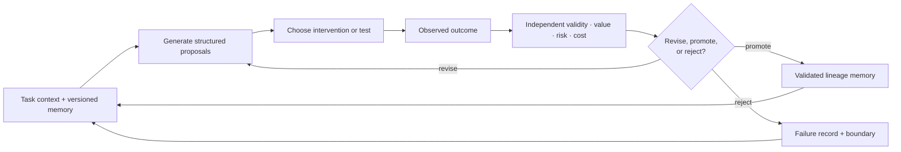

# Candidate 004: closed endogenous curriculum

**Stage:** 1 — synthetic falsification

**Status:** candidate composition; not an accepted project claim

**Primary question:** does a closed loop of structured proposal generation,
targeted intervention, independent evaluation, and versioned memory produce
useful transfer beyond copying or matched stochastic sampling when proposals,
environment interactions, evaluator calls, memory, time, and energy are held
constant?

## Why this experiment exists

Every candidate originates from learned structure, prior state, or stochastic
variation. This contract does not look for novelty without causal ancestry. It
asks which operations turn copied or recombined material into a useful new
behavior.

The evidence audit separates internally generated sequence structure
([C-061](../../research/claims.md#c-061)), uncertainty-directed exploration
([C-062](../../research/claims.md#c-062)), demonstration-induced narrowing
([C-063](../../research/claims.md#c-063)), causal imitation versus outcome
emulation ([C-064](../../research/claims.md#c-064)), regulated variability
([C-065](../../research/claims.md#c-065)), and memory-supported construction
([C-066](../../research/claims.md#c-066)). None establishes a complete artificial
curriculum. Together they justify one discriminating experiment in which those
operations can be removed separately.

The candidate composes existing principles rather than creating a creativity
module:

- temporary candidate state under
  [P-003](../../research/principle-registry.md#p-003--temporary-trace-before-commitment);
- diversity, selection, and protection under
  [P-004](../../research/principle-registry.md#p-004--diversity-selection-and-protection);
- value-directed acquisition under
  [P-007](../../research/principle-registry.md#p-007--prediction-error-allocation);
- a separate evaluation and maintenance path under
  [P-009](../../research/principle-registry.md#p-009--maintenance-plane); and
- versioned memory by information lifetime under
  [P-012](../../research/principle-registry.md#p-012--memory-matched-to-information-lifetime).

## Candidate loop



Editable source:
[`../../assets/diagrams/endogenous-curriculum-loop.mmd`](../../assets/diagrams/endogenous-curriculum-loop.mmd).

For task context $c_t$, accessible memory $m_t$, and stochastic input $\xi_t$,
the shared generator proposes

$$
z_{t,k}\sim q_\theta(z\mid c_t,m_t,\xi_{t,k}),
\qquad k=1,\ldots,K_t,
$$

where $K_t$ is the dimensionless number of proposals purchased at decision
step $t$. A proposal may be a causal hypothesis, intervention plan, or typed
program graph. The candidate loop then:

1. generates proposals from the same locked base generator used by sampling
   baselines;
2. predicts which unresolved distinction an intervention or executable test
   could settle;
3. buys the selected evidence within the interaction budget;
4. evaluates validity, task value, risk, duplication, and physical cost through
   an interface unavailable to the generator while proposing;
5. revises or rejects the proposal; and
6. promotes only validated records into versioned memory.

The generator cannot directly assign its own success label. The evaluator may
use ground-truth simulator outcomes, executable tests, or a locked scoring
model, depending on the track. Evaluator information becomes available to the
generator only through the same result record exposed to every method.

## Hypotheses and null

### H1 — targeted evidence

At equal proposal and interaction budgets, choosing interventions that
discriminate between live hypotheses improves held-out causal prediction or
task success relative to random interventions and uncertainty-free rollout.

### H2 — independent evaluation

At equal evaluator-call budgets, separating proposal from executable evaluation
reduces invalid and high-risk promotions relative to generator self-scoring.

### H3 — versioned lineage memory

At equal memory bytes, storing proposal ancestry, tests, failures, and boundary
conditions reduces duplicate failed search and improves recovery after a rule
change relative to a flat replay buffer.

### H4 — controlled variation

A learned proposal-variance controller improves the value–failure frontier over
fixed-temperature sampling only if its advantage survives identical proposal
counts and generator distributions.

### Joint null

The closed loop offers no material advantage once a strong sampler, active
learner, model-based planner, evolutionary search procedure, or retrieval
baseline receives the same base model, candidate count, interactions,
evaluator calls, memory, wall time, and energy. A tie merges the candidate into
the best conventional method; it does not preserve a separate biological name.

## Track A — causal mechanism discovery

### Environment family

Generate finite structural causal models from a held-out grammar of typed
mechanisms. Each episode contains:

- observable state variables $X_1,\ldots,X_n$ with declared units or normalized
  categories;
- hidden exogenous variables $U$;
- a directed acyclic mechanism graph $G$;
- observational samples;
- a finite intervention menu $\mathcal I$; and
- an episode-specific intervention budget $B_I$ in interaction-equivalents.

Training exposes individual mechanism primitives and some compositions. Test
episodes use new graph compositions, parameter regimes, and confounding
patterns generated from the same declared grammar. Exact test graphs and seeds
remain hidden until scoring.

An intervention $i\in\mathcal I$ has an explicitly declared cost $c_I(i)$ in
interaction-equivalents. The agent may request
$\operatorname{do}(X_j=x)$, a paired control, or another permitted measurement.
Its cumulative interaction cost must satisfy

$$
\sum_{t}c_I(i_t)\le B_I.
$$

The agent outputs a versioned hypothesis graph, calibrated predictions for
held-out interventions, and a policy for a downstream goal. Graph recovery is
diagnostic; interventional prediction and decision quality are primary because
multiple graphs may be observationally equivalent.

### Track-A splits

1. **Observed composition:** familiar primitive combination and parameter
   range; verifies the interface.
2. **Novel composition:** familiar primitives in an unseen causal graph.
3. **Hidden confounding:** observational correlations admit competing causal
   accounts.
4. **Intervention shift:** an intervention changes a mechanism parameter or
   invalidates a previously useful edge.
5. **Rule change:** the environment grammar remains but one stable mechanism is
   replaced midstream; tests recovery and memory invalidation.
6. **Adversarial redundancy:** many proposals are syntactic variants of the
   same hypothesis; tests duplicate control.

## Track B — compositional executable construction

### Task family

Use a typed dataflow language with a finite library of deterministic and
stochastic operators. Training demonstrations show operators, interface rules,
and selected short programs. Test tasks require graphs not present in the
demonstration corpus under canonical graph serialization.

Each task provides:

- an input/output type contract;
- visible training examples;
- a hidden test suite;
- a sandboxed interpreter;
- an operator and graph-size budget;
- a maximum evaluator-call count; and
- a risk label for forbidden effects such as out-of-bounds access, non-
  termination, or prohibited tool use.

A valid proposal must type-check, execute inside the sandbox, pass the hidden
tests, and remain inside resource and risk constraints. “Novel” means its
canonical program graph was absent from demonstrations and stored successful
solutions. Novelty receives no credit without validity and task value.

### Track-B regimes

1. **Direct retrieval:** a demonstrated graph already solves the task.
2. **Parameter adaptation:** topology is known; constants or operator settings
   change.
3. **Novel composition:** known operators require a new graph.
4. **Distractor demonstration:** copied steps contain causally irrelevant work.
5. **Sparse evaluator:** only a limited number of tests can be purchased.
6. **Rule revision:** an operator changes semantics and prior successes must be
   invalidated or repaired.
7. **Deceptive novelty:** many graph variants are distinct but equivalent,
   invalid, or more expensive than a known solution.

## Compared systems

All learned systems start from the same frozen or identically trained base
generator. Any method-specific trainable state is counted in parameter bytes,
training energy, and adaptation energy.

### B0 — imitation or behavioral cloning

Produce the highest-probability demonstrated action, hypothesis, or program
continuation. No stochastic proposal search and no self-selected intervention.

### B1 — retrieval and recombination

Retrieve the nearest demonstrations and compose their stored fragments using a
fixed beam. This tests whether explicit memory assembly explains the result
without an endogenous curriculum.

### B2 — matched stochastic sampling

Draw exactly the same number $K_t$ of proposals from the same generator with a
fixed preregistered temperature. Evaluate them with the same total evaluator
budget, but choose interventions or tests uniformly from the permitted set.

### B3 — adaptive sampling without targeted intervention

Allow a learned or bandit-controlled temperature and proposal allocation. Keep
evidence acquisition random or fixed. This isolates controlled variation from
experiment design.

### B4 — conventional active learning or experiment design

Use a tuned expected-information-gain, Bayesian experimental-design, or
query-by-committee policy appropriate to Track A. It receives the same
hypothesis representation and intervention menu.

### B5 — model-based planning

Use the shared learned dynamics model with tree search or model-predictive
control. It may simulate proposals but retains no versioned failure lineage
beyond the equal-size replay state.

### B6 — evolutionary or quality-diversity search

Use mutation, recombination, selection, and an archive at the same proposal,
evaluation, and memory budget. This is a strong conventional baseline for
Track B.

### B7 — generator self-evaluation

Use the candidate generator and revision loop but replace the independent
evaluator with its own predicted score. This isolates evaluator separation.

### C — closed endogenous curriculum

Use structured proposals, targeted acquisition, independent evaluation,
versioned lineage memory, and a learned variation controller. Each operation
is separately ablated below.

### O — oracle acquisition ceiling

Select the intervention or evaluator call with the greatest ground-truth
reduction in final task error. The oracle verifies scoring and upper-bounds the
value of acquisition; it is not a competitor.

## Equal-budget contract

For each paired episode, methods receive identical:

- demonstration records and order;
- base-generator architecture, parameters, and numeric precision;
- maximum generated candidates $K=\sum_tK_t$;
- environment interaction budget $B_I$;
- evaluator-call budget $B_V$;
- accessible memory bytes $B_M$;
- maximum serialized candidate and lineage bytes;
- wall-clock deadline and accelerator allocation;
- tool permissions and sandbox limits; and
- task-specific quality, risk, and latency envelope.

Methods may leave a budget unused. They may not convert unused evaluator calls
into additional environment interactions unless the conversion rule is fixed
before all runs and applied to every method. Report both allocated and consumed
budgets.

If sequential control makes exact wall-time matching impossible, run two
comparisons: equal logical budgets and equal measured joules. A method must
identify which claim each comparison supports.

## Candidate and memory records

Every proposal receives an immutable record:

```text
candidate_id
parent_candidate_ids
generator_version
context_and_memory_versions
stochastic_seed_or_sampling_record
predicted_distinctions
selected_intervention_or_test
measured_result
validity_and_risk_result
energy_latency_and_byte_cost
promotion_rejection_or_revision
invalidation_boundary
```

The memory baseline receives the same byte budget and may use a flat replay or
retrieval store. The candidate system must earn any benefit from lineage,
failure retention, and invalidation rather than from more storage.

## Ablations

1. remove targeted acquisition but keep structured proposals;
2. replace the independent evaluator with self-evaluation;
3. remove lineage and failure records while preserving successful memories;
4. replace learned variation control with fixed temperature;
5. remove revision and permit only accept/reject;
6. prevent memory promotion between episodes;
7. remove explicit duplicate detection;
8. provide targeted acquisition to the best stochastic baseline;
9. provide lineage memory to the best evolutionary baseline; and
10. randomize proposal ancestry labels to test whether lineage content rather
    than extra metadata produces the effect.

## Measurements

### Task value

- held-out interventional negative log likelihood and calibration for Track A;
- downstream policy return or regret under the discovered mechanism;
- hidden-test pass fraction for Track B;
- valid task solutions per qualified episode;
- adaptation after a mechanism or operator change; and
- worst-stratum performance across confounding, distractor, sparse-evaluator,
  and rule-revision regimes.

### Proposal behavior

- proposal count and valid-proposal fraction;
- duplicate fraction under canonical equivalence;
- fraction copied exactly from demonstrations;
- distinct valid solution structures;
- revision depth and lineage branching factor;
- invalid, unsafe, timed-out, and evaluator-rejected proposals; and
- contribution of each acquired observation to posterior or test-result change.

### Acquisition and evaluation

- interactions consumed and interaction-equivalent cost;
- evaluator calls and evaluator wall time;
- expected versus realized information or decision gain;
- intervention redundancy;
- time and energy to first valid solution; and
- quality after each cumulative budget decile.

### Memory and recovery

- hot and cold bytes;
- retrieval and write bytes per episode;
- duplicate failed branches avoided;
- false invalidation and stale-memory use;
- recovery events and joules after a rule change; and
- provenance coverage of promoted proposals.

### Risk

- constraint-violation and catastrophic-proposal fractions;
- expected calibration error by risk stratum;
- unsafe promotion count;
- abstention and escalation rates; and
- risk-weighted failure reported separately from task value.

No scalar “creativity score” is primary. Validity, novelty, value, risk, cost,
and transfer remain separate axes.

## Energy and latency accounting

For method $m$, total paired-episode energy is

$$
E_m = E_{m,\mathrm{base}}+E_{m,\mathrm{generate}}
    +E_{m,\mathrm{intervene}}+E_{m,\mathrm{evaluate}}
    +E_{m,\mathrm{memory}}+E_{m,\mathrm{adapt}}
    +E_{m,\mathrm{host}},
$$

where every term is measured in joules at the same declared board, node, or
facility boundary. $E_{m,\mathrm{base}}$ is the paired idle-plus-framework
energy charged under the frozen measurement contract. Report accelerator,
host, storage, and external-service energy separately when they cannot share a
physical meter.

For $N_Q$ qualified episodes, lifecycle energy per qualified episode is

$$
\bar E_{m,Q}
=\frac{E_{m,\mathrm{train}}+E_{m,\mathrm{setup}}+E_{m,\mathrm{index}}
      +E_{m,\mathrm{episodes}}+E_{m,\mathrm{recovery}}}{N_Q},
$$

with the numerator in joules and $N_Q$ a dimensionless episode count. Failed,
abstained, and unsafe episodes remain in energy totals even when they do not
enter the qualified-performance numerator.

Report median and p95 time to valid solution, intervention response latency,
evaluator latency, and end-to-end episode latency in seconds. Do not infer
energy from TDP or operation counts.

## Statistical plan

- Generate task instances and seeds before the confirmatory run and keep test
  graph/operator compositions hidden from method tuning.
- Pair every method on identical task instances, demonstrations, disturbances,
  and base-generator checkpoints.
- Tune hyperparameters on separate development families under the same total
  tuning energy cap.
- Report paired bootstrap confidence intervals across task instances and seeds
  for each primary axis.
- Correct the confirmatory family across H1–H4; label remaining comparisons
  exploratory.
- Publish every seed, failed run, budget overrun, unsafe proposal, and excluded
  episode with its preregistered exclusion reason.
- Repeat the winning comparison on a held-out environment grammar or operator
  library before changing a claim status.

## Promotion and rejection gates

Reject the closed-loop candidate if any of the following holds:

1. matched stochastic sampling reaches the same task, transfer, risk, and cost
   frontier;
2. conventional active learning explains Track-A gains at equal interaction
   cost;
3. evolutionary or quality-diversity search explains Track-B gains at equal
   proposal, evaluator, and memory budgets;
4. independent evaluation does not reduce invalid or unsafe promotion after
   its calls and energy are charged;
5. lineage memory does not reduce repeated failure or recovery cost at equal
   bytes;
6. novelty gains vanish under canonical equivalence or hidden tests;
7. advantages rely on future leakage, simulator state unavailable at decision
   time, or a stronger evaluator interface;
8. lifecycle energy or tail latency leaves the declared envelope; or
9. the result fails on the held-out grammar/library replication.

Promote only the operations that survive their ablations. A possible result is
that targeted experiment design wins while learned variation and lineage memory
do not; the architecture should then retain experiment design and retire the
rest of the composed story.

## Expected interpretation

- **Candidate wins both tracks:** proceed to a grounded curriculum integration
  with the surviving components only.
- **Active learning wins Track A; evolutionary search wins Track B:** merge the
  proposal into those conventional primitives and reuse their implementations.
- **Evaluation helps; endogenous acquisition does not:** retain the independent
  gate as a safety/quality mechanism, not a creativity mechanism.
- **Memory helps only after rule changes:** scope lineage memory to non-
  stationary regimes and charge its idle cost elsewhere.
- **Sampling matches all results:** reject the closed endogenous curriculum as
  unnecessary composition at the tested budgets.
