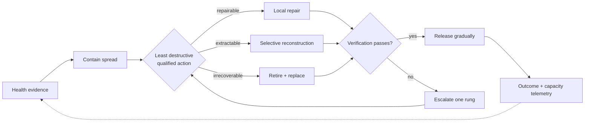
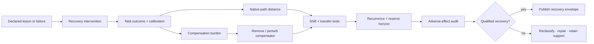

# Candidate 005: severity-ordered containment and triage

**Stage:** 1 — synthetic falsification

**Status:** held candidate; not an accepted project claim

**Primary question:** can a staged policy that contains spread, selects the
least destructive qualified intervention, verifies recovery, escalates on
failure, and replenishes retired capacity beat mature recovery mechanisms at
equal availability, reserve, storage, diagnostic, and lifecycle-energy budgets?

## Why this experiment exists

Cellular quality control does not perform one generic “repair” operation. The
audited evidence distinguishes fast load shedding ([C-087](../../research/claims.md#c-087)),
stress-specific maintenance capacity ([C-088](../../research/claims.md#c-088)),
dangerous restart before resolution ([C-089](../../research/claims.md#c-089)),
repair-versus-destruction triage ([C-090](../../research/claims.md#c-090)),
tag-dependent compartment routing ([C-091](../../research/claims.md#c-091)),
selective extraction ([C-092](../../research/claims.md#c-092)),
damage-amplified removal with a scoped trigger ([C-093](../../research/claims.md#c-093)),
repair before removal ([C-094](../../research/claims.md#c-094)), and retirement
coupled to replacement ([C-095](../../research/claims.md#c-095),
[C-096](../../research/claims.md#c-096)).

Those observations do not establish a new systems algorithm. Circuit breakers,
admission control, taint tracking, static isolation, checkpoints, replicas,
microreboots, garbage collection, scrubbing, rejuvenation, sequential tests,
and cost-sensitive repair/replace decisions already implement much of the
functional vocabulary. The experiment exists to determine whether the
**ordered composition** earns its added sensing and control cost under mixed,
partially observed faults.

The candidate composes existing bundles:

1. reversible tags and guarded commitment under
   [P-003](../../research/principle-registry.md#p-003--temporary-trace-before-commitment);
2. capacity regulation under
   [P-006](../../research/principle-registry.md#p-006--homeostatic-negative-feedback);
3. blast-radius boundaries under
   [P-008](../../research/principle-registry.md#p-008--compartmentalized-interaction); and
4. lifecycle control under
   [P-009](../../research/principle-registry.md#p-009--maintenance-plane).

## Candidate policy

Editable source:
[`../../assets/diagrams/severity-ordered-containment.mmd`](../../assets/diagrams/severity-ordered-containment.mmd).

Containment revokes or narrows interfaces before diagnosis is complete. It does
not prove corruption and does not authorize deletion. For component $i$, the
controller receives observable evidence $z_i$ and chooses action

$$
a_i\in\mathcal A=
\{\text{observe},\text{throttle},\text{quarantine},\text{repair},
\text{reconstruct},\text{retire+replace}\}.
$$

The action objective is reported, but a scalarized objective cannot hide the
underlying frontier:

$$
J(a\mid z_i)=
\mathbb E[L_{\mathrm{residual}}+L_{\mathrm{spread}}
+L_{\mathrm{collateral}}+L_{\mathrm{downtime}}\mid z_i,a]
+\lambda_E E_a+\lambda_W W_{\mathrm{lost},a}.
$$

Every $L$ term uses one declared task-loss unit. $E_a$ is action lifecycle
energy in joules; $W_{\mathrm{lost},a}$ is discarded or prevented useful work
in the benchmark work unit; $\lambda_E$ has task-loss units per joule; and
$\lambda_W$ has task-loss units per work unit. Results must also expose the raw
losses, energy, work, availability, and retained-capability axes.

## Controlled system

Use a stateful modular service or mixture-of-experts simulator with:

- eight replaceable modules behind typed interfaces;
- a shared versioned retrieval store;
- per-module checkpoints and independent restart boundaries;
- two warm spare slots shared across modules;
- observable task outcomes plus noisy local health features;
- a protected set of rare tasks that aggregate quality can conceal; and
- an event and energy ledger covering inference, probes, copies, reserve,
  migration, rebuild, validation, and operator intervention.

Each episode contains nominal traffic, a hidden fault time, an observation
delay, an intervention window, and a post-recovery horizon. The controller sees
only the observations permitted to its baseline; injected fault labels remain
available only to the evaluator and oracle.

## Factorial fault grid

Every policy receives the same randomized episode seeds. Cross these factors:

| Factor | Levels |
| --- | --- |
| spatial scope | one module; adjacent pair; diffuse shared-state fault |
| temporal profile | transient overload; persistent degradation; abrupt loss; slow decay |
| state readability | unreadable; readable but wrong; internally valid but semantically wrong |
| propagation | interface-contained; spreading through messages; spreading through shared retrieval |
| recoverability | retry repairable; checkpoint recoverable; reconstructable; irrecoverable without replacement |
| detector quality | calibrated independent noise; biased tags; correlated false tags; adversarial tag manipulation |
| regime familiarity | seen during policy fitting; held-out composition; held-out causal mechanism |

The grid deliberately contains cases where different actions should win.
Checkpoint recovery should dominate clean rollback faults; replica failover
should dominate isolated crash faults with valid replicas; immediate retirement
should dominate rapidly spreading irrecoverable faults. A policy that always
climbs the same ladder fails the experiment.

## Baselines

| ID | Baseline | Required strength |
| --- | --- | --- |
| B0 | no maintenance | records unmitigated fault cost |
| B1 | fixed periodic maintenance | frequency tuned on the same development set |
| B2 | static containment domains plus circuit breaker | same interface boundaries and throttle capacity |
| B3 | latest validated checkpoint rollback | same checkpoint frequency, storage, and validation budget |
| B4 | replica failover | same warm-reserve and state-transfer budget |
| B5 | per-component microrestart | same restart granularity and health observations |
| B6 | coded or redundant storage with integrity scrubbing | same persistent bytes and scan budget |
| B7 | conventional rejuvenation policy | periodic and condition-based variants tuned equally |
| B8 | sequential detector plus Bayesian repair/replace policy | same observations, actions, loss matrix, and fitting budget |
| B9 | oracle | true fault class and severity; upper bound, not a promotable comparator |

For common-mode semantic damage, also compare validated checkpoint families,
heterogeneous replicas where feasible, full retraining/rebuild, and the
constraint-guided functional reconstruction candidate from
[C-086](../../research/claims.md#c-086).

## Candidate components and ablations

Begin with B8, then add candidate components individually and cumulatively:

1. separate fast containment from slower diagnosis;
2. temporary fault tags with expiry and provenance;
3. input throttling before maintenance-capacity expansion;
4. interface quarantine instead of whole-service isolation;
5. bounded local repair before restart;
6. selective subcomponent reconstruction before whole-module replacement;
7. post-action verification before release;
8. gradual release with relapse monitoring;
9. escalation only after failed verification or stronger evidence; and
10. explicit replacement-capacity feedback after retirement.

Reverse the order in targeted ablations: repair before containment, immediate
replacement, parallel execution of all actions, release on local-health
recovery alone, and retirement without replenishment. Each component remains
only if it improves a preregistered outcome without moving cost outside the
measurement boundary.

## Matched budgets

Equalize across candidate and baselines:

- peak accelerator and CPU allocation;
- persistent checkpoint, replica, code, index, and log bytes;
- warm spare capacity and its idle power;
- health observations, diagnostic calls, and telemetry bytes;
- allowed task downtime and tail-latency envelope;
- rebuild, training, and validation opportunities;
- operator interventions; and
- wall-clock episode duration and task arrival stream.

If a baseline cannot use one resource category, report the unused allowance
rather than silently reallocating it. Measure wall-plug energy where possible;
otherwise name the device boundary and exclude facility-level conclusions.

## Measurements

### Lifecycle energy

For one episode,

$$
E_{\mathrm{life}}=E_{\mathrm{task}}+E_{\mathrm{sense}}
+E_{\mathrm{contain}}+E_{\mathrm{repair}}+E_{\mathrm{reconstruct}}
+E_{\mathrm{replace}}+E_{\mathrm{verify}}+E_{\mathrm{reserve}},
$$

where every term is measured in joules at the same boundary. Report useful
completed task work per joule only alongside raw work, service quality, and
failure outcomes.

### Spread and collateral loss

Define time-integrated spread as

$$
A_{\mathrm{spread}}=
\int_{t_0}^{t_{\mathrm{verified}}}
\sum_{j\ne i}w_j\mathbf 1[j\text{ affected by fault }i],dt.
$$

$t_0$ and $t_{\mathrm{verified}}$ are seconds; $w_j$ is a declared
dimensionless importance weight; therefore $A_{\mathrm{spread}}$ is measured in
weighted-component-seconds. Also report clean components quarantined,
restarted, overwritten, or deprived of traffic as separate counts and weighted
state bytes.

### Required outcome vector

Report at least:

1. time-weighted service quality and availability;
2. time to first containment and time to verified recovery, in seconds;
3. catastrophic-loss and relapse frequency;
4. false quarantine, destructive false action, and missed-fault rates;
5. retained rare-capability score and provenance integrity;
6. task work lost, checkpointed, replayed, or recomputed;
7. diagnostic, migration, and reconstruction bytes;
8. active, idle-reserve, and full lifecycle joules; and
9. operator interventions and unresolved abstentions.

No aggregate resilience score replaces the raw vector.

### Compensation-aware recovery qualification

Task recovery can be supplied by a larger fallback, alternate route, cache,
tool, human operator, permissive environment, or extra reserve rather than by
restoration of the failed capability ([C-316](../../research/claims.md#c-316)–[C-324](../../research/claims.md#c-324)).
Every arm therefore also reports:

1. the recovered task distribution, quality, and calibration;
2. distance from a justified reference mechanism, representation, route, or
   behavior—without assuming that historically older means better;
3. added joules, operations, bytes, latency, calls, permissions, and human time;
4. loss after removal or perturbation of the suspected compensating path;
5. transfer under task, environment, load, and sensor shift;
6. recurrence and hazard over a declared horizon and detection limit;
7. remaining margin under bounded disturbance; and
8. off-target regression, calibration loss, safety events, and schedule damage.

Editable source:
[compensation-aware-recovery.mmd](../../assets/diagrams/compensation-aware-recovery.mmd).

The method is rejected as redundant if ordinary multi-objective robustness,
resource accounting, and fault injection predict the same removal, transfer,
recurrence, or reserve failures with lower measurement overhead.

### Residual-capacity and redistributed-load qualification

For structural, routed, or dependency-bearing failures, also record cumulative
load/use history, damage/dependency posterior, observation detection limits,
current and post-contingency capacity, common-cause set, redistributed demand,
degraded-service vector, time to constraint, intervention, post-action
verification, and restored next-event reserve
([C-481](../../research/claims.md#c-481)–[C-500](../../research/claims.md#c-500)).
The schema loses if ordinary mechanics/reliability, asset management, and
network assignment predict the same failures more cheaply.

## Promotion criteria

The held candidate advances beyond Stage 1 only if, over preregistered seeds and
held-out fault compositions:

1. it is not Pareto-dominated by B3, B4, B5, B6, or B8 on quality,
   availability, $A_{\mathrm{spread}}$, destructive false actions, lifecycle
   energy, persistent bytes, and operator effort;
2. at least two ordered components contribute independently in ablations;
3. benefits persist after charging probes, copying, reserve, replacement, and
   verification;
4. it preserves rare capabilities and provenance rather than restoring only
   aggregate metrics; and
5. its release rule remains stable under delayed observations and correlated
   tag error.
6. apparent recovery survives support-removal and transfer tests, or is
   explicitly released as compensated operation with its recurring burden.

Advancement promotes the experiment to a higher-fidelity system. It does not
create a new `P-` principle.

## Rejection criteria

Reject the ordered candidate if any conclusion persists across the declared
fault distribution:

- checkpointing, replication, microrestart, scrubbing, or B8 dominates it;
- a static action ordering performs equally well;
- apparent benefit disappears under full lifecycle accounting;
- correlated tag error causes cascading quarantine or destructive retirement;
- local telemetry recovers while protected rare behavior remains damaged;
- retirement consumes capacity faster than verified replacement restores it;
- the controller cannot state a stable, measurable release condition; or
- wins require oracle fault labels unavailable at decision time.

Negative results remain useful: they identify which biological distinctions
collapse into ordinary systems mechanisms and which fault regimes select each
conventional baseline.
