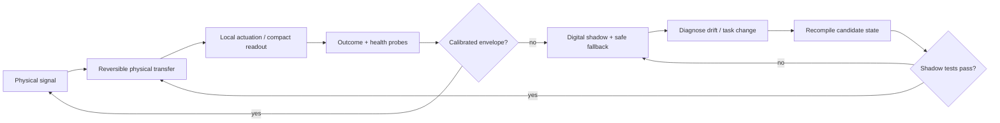
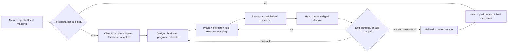

# Candidate 006: reversible physical skill compilation

**Stage:** 1 — substrate feasibility and lifecycle falsification

**Status:** held systems candidate; not an accepted project claim

**Primary question:** for a mature, frequent, physically coupled mapping, can a
rewritable local substrate with health probes, a versioned digital shadow, and
safe fallback improve the quality–risk–latency–lifecycle-energy frontier beyond
tuned passive mechanics, analog control, FPGA/ASIC execution, and matched
physical or digital reservoirs?

## Why this experiment exists

Physical systems already perform useful transformations. Passive morphology
can reduce active control ([C-112](../../research/claims.md#c-112)); compliant
bodies and physical reservoirs provide nonlinear dynamics and fading memory
([C-113](../../research/claims.md#c-113),
[C-114](../../research/claims.md#c-114)); mechanical structures can store logic
or trained response ([C-115](../../research/claims.md#c-115),
[C-116](../../research/claims.md#c-116)); reaction–diffusion and self-assembly
compile spatial outcomes into local interactions
([C-117](../../research/claims.md#c-117),
[C-118](../../research/claims.md#c-118)); and material history and healing
provide bounded memory and local repair ([C-119](../../research/claims.md#c-119),
[C-120](../../research/claims.md#c-120)).

Those are established substrate techniques, not evidence that a new AI
principle is required. The residual hypothesis [C-121](../../research/claims.md#c-121)
is narrower: **compilation across physics** may be useful when a stable learned
mapping is invoked often enough to repay design, programming, validation, and
maintenance while a digital shadow preserves auditability and exceptions.

## Qualification contract

A tested system qualifies only when all conditions hold:

1. Its input originates as a physical signal and its output affects the same
   local environment or produces a compact local readout.
2. The mapping is mature, repeated, and stable enough to have a measurable
   reuse horizon.
3. The physical path removes a conversion, transport, recurrent update, or
   command path instead of duplicating it.
4. The programmed material or geometry is rewritable, replaceable, or bypassed
   by a versioned digital implementation.
5. Health probes expose drift, damage, calibration loss, and out-of-envelope
   inputs.
6. Candidate and baselines share the same sensing, actuation, task, safety,
   response, payload, and measurement boundary.

## Candidate control loop

Editable source:
[`../../assets/diagrams/physical-skill-compilation.mmd`](../../assets/diagrams/physical-skill-compilation.mmd).

The physical substrate has state rather than “free computation.” A general
representation is

$$
M(z,\theta)\dot z=f(z,u,\theta,\xi),
\qquad
y=h(z,u,\theta)+\epsilon,
$$

where $z$ is substrate state, $u$ is physical input, $y$ is measured output,
$\theta$ is fabricated or programmed structure, $\xi$ is environmental state
and disturbance, $M$ is the substrate's storage or inertia operator, and
$\epsilon$ is readout noise. Units are declared per substrate; mixed mechanical,
electrical, chemical, or magnetic state cannot be hidden in a dimensionless
“activation.”

The maintained digital shadow stores the qualified mapping, calibration
envelope, substrate version, protected tests, fallback executable, and the
trace connecting outputs to substrate state.

## Experiment tracks

### Track A — local sensorimotor stabilization

Use a tactile or force-stabilization task with repeatable disturbances and a
declared out-of-envelope set. Hold payload, sensor placement, actuator
authority, geometry envelope, settling tolerance, and safety constraints
constant.

Compare:

- A0: rigid mechanism plus high-rate digital feedback;
- A1: tuned passive compliance;
- A2: optimized analog electronic controller;
- A3: FPGA/ASIC fixed controller;
- A4: fixed morphological or metamaterial transfer;
- A5: rewritable physical transfer with digital shadow and fallback; and
- A6: oracle-selected baseline per disturbance class.

Measure wall-plug joules per qualified disturbance, peak power, response and
settling time, overshoot, error-area, failure probability, mass, volume,
calibration time, drift, rewrite/reset cost, fallback frequency, and behavior
after controlled damage.

### Track B — physical versus digital reservoir

Feed the same raw physical time series and targets to:

- B0: direct sensor plus matched digital echo-state network;
- B1: sensor plus FPGA/ASIC reservoir;
- B2: proposed physical reservoir plus trained readout;
- B3: the same physical device used only as a sensor or filter before B0; and
- B4: a parameter-matched state-space model of the substrate plus the same
  readout.

Match effective state dimension, training examples, readout class, precision,
latency envelope, and accepted-output accuracy. Charge excitation, bias,
ADC/DAC, sampling, readout, temperature control, calibration, retry, and state
reset. Sweep temperature, mounting, aging, input rate, noise, and sensor
replacement. Report worst-slice accuracy and recalibration frequency.

### Track C — damage and functional healing

Inject controlled cracks, opens, stiffness changes, drift, and partial sensor
loss into an edge device or soft-robot substrate. Compare degraded routing,
redundant bypass, external detection plus repair, autonomous material healing,
and healing followed by behavioral recalibration.

Separate four recovery outcomes:

1. electrical or mechanical continuity;
2. calibrated analog transfer characteristics;
3. exact logical state where applicable; and
4. qualified task behavior.

Measure detection latency, healing time, transfer-function error, task recovery,
second-damage survival, consumed inventory, added mass, state copied, and full
lifecycle energy. Apparent crack closure is not functional recovery.

### Track D — local topology formation

Give identical modular tiles a changing communication workload. Compare
centralized placement/routing, distributed digital optimization, fixed local
heuristics, and physically mediated attachment or link adaptation. Predeclare
topology utility, convergence time, messages and bytes, movement or rewiring
energy, deadlock rate, assembly yield, tile-loss recovery, and reversal cost.

The physical mechanism contributes only if local interaction reduces global
state or communication while meeting the same topology and recovery contract.

### Track E — reversible phase or interaction-field compilation

Compile one stable, high-frequency, spatially local coordination mapping into
a reversible physical phase or interaction field. Before comparison, classify
the substrate as passive relaxation, continuously driven fixed dynamics,
feedback-controlled matter, or genuinely adaptive matter. The last label
requires an explicit outcome-driven policy update
([C-463](../../research/claims.md#c-463)–[C-480](../../research/claims.md#c-480)).

Compare the complete device with tuned passive mechanics, analog feedback,
FPGA/ASIC, distributed digital control, and a digital shadow that receives the
same sensing and calibration. Count fuel, light/field generation, pumps,
sensing, communication, computation, transduction, readout, reset, fabrication,
yield loss, drift, health probes, fallback, and retirement. Particle-scale
mechanical power is diagnostic only.

Editable source:
[phase-field-compilation.mmd](../../assets/diagrams/phase-field-compilation.mmd).

Retire the specialization if the digital shadow performs the real control
continuously, reset is destructive, system-level drive dominates, or an
ordinary hardware/control baseline ties the lifecycle frontier.

## Lifecycle accounting

For $N$ deployed uses,

$$
E_{\mathrm{life}}=
E_{\mathrm{design}}+E_{\mathrm{fabrication}}+E_{\mathrm{program}}
+\sum_{i=1}^{N}\left(
E_{\mathrm{drive},i}+E_{\mathrm{convert},i}+E_{\mathrm{read},i}
+E_{\mathrm{reset},i}+E_{\mathrm{maint},i}\right)
+E_{\mathrm{recovery}}.
$$

Every term is joules over one named device, node, or facility boundary.
Embodied manufacturing energy may be separately estimated when direct
measurement is unavailable, but it is never assigned zero. Also report
material mass, yield, discarded devices, lifetime cycles, and waste separately
from operational energy.

If a digital reference costs $E_d$ joules per qualified use and the physical
path costs $E_p$ joules per qualified use, the simplified break-even count is

$$
N_{\mathrm{break}}>
\frac{E_{\mathrm{design}}+E_{\mathrm{fabrication}}+E_{\mathrm{program}}
+E_{\mathrm{recovery}}}{E_d-E_p},
\qquad E_d>E_p.
$$

The actual experiment estimates break-even from measured time-varying costs,
yield, drift, reprogramming, fallback, and retirement. If $E_d\leq E_p$ or the
qualified lifetime ends before break-even, the candidate fails on energy even
if its fast-path power is lower.

## Required outcome vector

Report without scalar collapse:

1. task quality, calibration, protected-slice quality, and failure probability;
2. end-to-end response and settling-time distributions;
3. active, idle, conversion, readout, maintenance, fallback, and lifecycle
   joules;
4. traffic removed and added across each physical/digital boundary;
5. substrate mass, volume, fabrication yield, lifetime, fatigue, and waste;
6. programming, reset, calibration, revalidation, and replacement time;
7. drift rate and fraction of events outside the calibrated envelope;
8. fallback coverage and recovery success after injected damage; and
9. amortization horizon with uncertainty, including deployments that never
   break even.

Useful-work efficiency may be reported as

$$
\eta_{\mathrm{useful}}=
\frac{N_{\mathrm{accepted}}U_{\mathrm{task}}}{E_{\mathrm{life}}},
$$

where $N_{\mathrm{accepted}}$ is a count and $U_{\mathrm{task}}$ is a declared
task-utility unit. It does not replace joules per correct decision, stable metre,
valid assembly, or recovered function.

## Ablations

1. Remove rewritability and use the best fixed physical state.
2. Remove the digital shadow while preserving health probes.
3. Remove health probes and retain periodic calibration.
4. Replace learned recompilation with grid search or standard control tuning.
5. Keep the physical device only as a front-end and move recurrence digitally.
6. Exclude ADC/DAC and conversion cost only as a labeled boundary sensitivity.
7. Sweep reuse horizon, drift, temperature, damage rate, and task volatility.
8. Compare local versus centralized topology adaptation at matched messages.
9. Compare healing alone with healing plus automatic behavioral recalibration.
10. Replace the candidate with the best passive, analog, and FPGA/ASIC design
    discovered under the same engineering effort.

## Promotion criteria

Advance one track only when it:

1. produces a Pareto improvement over the best non-oracle conventional baseline
   on qualified behavior, risk, latency, lifecycle energy, and physical burden;
2. removes a measured conversion, transport, recurrent update, or command path;
3. reaches break-even before the lower bound of its qualified lifetime;
4. detects drift and damage before protected behavior violates its envelope;
5. falls back without losing version, provenance, or bounded authority; and
6. retains the advantage across held-out environment, aging, mounting, input
   rate, and damage conditions.

Different tracks advance independently. Success in a reservoir benchmark does
not validate self-healing or local assembly.

## Rejection criteria

Reject or narrow the candidate when:

- a tuned passive component or ordinary analog controller matches it;
- an FPGA/ASIC has lower lifecycle energy at equal quality and risk;
- a matched digital reservoir or physical-front-end ablation matches it;
- ADC/DAC, drive, readout, thermal control, or calibration dominates savings;
- reset, reprogramming, drift correction, or fallback prevents amortization;
- the task or environment changes before measured break-even;
- material healing restores continuity but not calibrated task behavior;
- topology formation reduces central messages but loses on convergence, yield,
  deadlock, recovery, or reversal; or
- the result depends on assigning fabrication, failed devices, reserve, or
  embodied cost to a different boundary.

Negative results still select the correct substrate: fixed mechanics, analog
control, FPGA/ASIC, a digital model, or no compilation at all.
