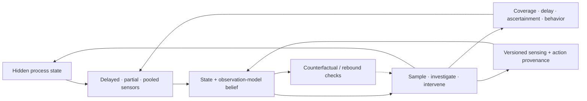

# Candidate 007: intervention-aware surveillance under endogenous observation

**Stage:** 1 — synthetic causal and observation-model falsification

**Status:** held composition; not an accepted project claim

**Primary question:** when sensing and response actions change both a hidden
fault process and its telemetry, does versioned sensing/action provenance plus
joint state and observation-model estimation improve decisions beyond robust
sequential detection, delay-aware nowcasting, value-of-information sampling,
and tuned POMDP or model-predictive control at matched sensing, investigation,
action, and energy cost?

## Why this experiment exists

Surveillance is not one detector. Site placement is resource allocation
([C-122](../../research/claims.md#c-122)); network-biased sentinels can trade
representativeness for early arrival ([C-123](../../research/claims.md#c-123));
robust residual detectors are strong conventional nulls
([C-124](../../research/claims.md#c-124)); current counts may be right-truncated
by changing report delay ([C-126](../../research/claims.md#c-126)); pooled
environmental signals can be early but weakly attributable
([C-127](../../research/claims.md#c-127)); behavioral proxies drift with platform
and policy ([C-128](../../research/claims.md#c-128)); and a separate probability
sample can reveal burden missing from event reports
([C-129](../../research/claims.md#c-129)).

The held candidate addresses the feedback boundary in
[C-131](../../research/claims.md#c-131) and
[C-132](../../research/claims.md#c-132): throttling, isolation, rollback,
warnings, altered sampling, and recovery actions can suppress or redirect the
telemetry later used to judge whether the hidden fault improved. A fall in
observed alerts is therefore not independent evidence of recovery.

This candidate composes [P-001](../../research/principle-registry.md#p-001--selective-allocation),
[P-007](../../research/principle-registry.md#p-007--prediction-error-allocation),
[P-009](../../research/principle-registry.md#p-009--maintenance-plane), and
[P-013](../../research/principle-registry.md#p-013--externalized-shared-state).
It is rejected as distinct if a conventional delay-aware POMDP, dual-control
policy, residual detector, and value-of-information sampler match it.

## Closed observation–action loop

Editable source:
[`../../assets/diagrams/endogenous-observation-loop.mmd`](../../assets/diagrams/endogenous-observation-loop.mmd).

Separate the hidden process and each observation channel:

$$
x_{t+1}=f(x_t,a_t,w_t),
$$

$$
y_{t+d_k}^{(k)}=
h_k\!\left(x_t,a_{0:t},c_t^{(k)},q_t^{(k)},\theta_t^{(k)}\right)
+v_t^{(k)}.
$$

Here $x_t$ is hidden fault state in one declared representation; $a_t$ is a
sensing or response action; $w_t$ is process disturbance; $y_t^{(k)}$ is the
native-unit observation from stream $k$; $d_k$ is its delay in seconds;
$c_t^{(k)}$ is dimensionless coverage; $q_t^{(k)}$ is dimensionless
ascertainment probability; $\theta_t^{(k)}$ contains versioned calibration,
aggregation, and platform state; and $v_t^{(k)}$ has the same unit as
$y_t^{(k)}$.

Streams with different units are never added directly. They update a shared
belief only through declared observation models:

$$
b_t(x)=p\!\left(x_t=x\mid y_{0:t}^{(1:K)},a_{0:t-1}\right).
$$

The candidate also estimates a no-action or alternative-action observation
path in randomized simulator replicas or shadow canaries. It must distinguish
“less telemetry because the fault diminished” from “less telemetry because the
controller hid, diverted, delayed, or stopped measuring it.”

## SCOPE benchmark

Build **Surveillance under Changing Observation, Policy, and Environment** as a
synthetic modular-service benchmark followed only after success by an isolated
shadow-service stage. A fault propagates over a dynamic modular graph. No online
policy receives fault labels, final revised data, future reports, or episode
class.

### Sensor streams

Every episode provides four native-unit streams:

1. delayed high-specificity diagnoses attributable to one instance;
2. early low-specificity syndromic residuals;
3. pooled regional telemetry without instance attribution; and
4. demand or behavioral telemetry coupled to warnings and service policy.

The evaluator retains hidden fault time, affected instances, causal graph, true
coverage, action effects, and final data revisions for scoring only.

### Factorial regimes

Independently vary:

| Factor | Levels |
| --- | --- |
| sensor coverage | 20%, 40%, 60%, 80%, 100% of instances |
| ascertainment | 0.20, 0.50, 0.75, 0.95 with abrupt and gradual drift |
| report delay | seconds to hours; stationary, backlog, and mid-episode shift |
| graph | assortativity, degree dispersion, community structure, rewiring |
| fault | propagation rate, local severity, source multiplicity, correlated causes |
| response capacity | analyst-minutes/hour, confirmatory tests/hour, restart/isolation slots |
| error cost | low/high missed-fault cost crossed with low/high false-action cost |
| proxy coupling | passive, policy-responsive, user-responsive, adversarially manipulated |
| action effect | changes propagation only, observation only, both, or neither |
| subgroup coverage | uniform, structured gaps, and Simpson-mixture reversal |

Preserve every data vintage. A detector never receives the final revised
history at the timestamp when an operational decision would have occurred.

## Baselines

### Sampling and placement

- S0: uniform sampling;
- S1: maximum geographic or graph coverage;
- S2: degree-, neighbor-, or centrality-biased sentinels;
- S3: submodular or value-of-information selection;
- S4: optimal-experimental-design or POMDP sensing action; and
- S5: oracle placement using hidden future propagation.

### Detection and state estimation

- D0: static threshold and SLO dashboard;
- D1: robust seasonal/count model with residual CUSUM or GLR;
- D2: Page–Hinkley/EWMA and scan-statistic variants;
- D3: delay-aware state-space nowcasting with calibrated intervals;
- D4: robust filter with coverage and ascertainment drift;
- D5: candidate joint hidden-state and observation-model estimator; and
- D6: oracle filter with true delay, coverage, and action effect.

### Response policies

- R0: fixed alarm-to-action rule;
- R1: tuned model-predictive controller;
- R2: delay-aware POMDP policy;
- R3: dual-control policy allowed the same safe shadow probes;
- R4: candidate policy with versioned sensing/action provenance and explicit
  counterfactual observation checks; and
- R5: oracle policy with hidden state.

Candidate 003 receives any active probe used here under its identical safety,
energy, and system-identification baseline. A routine production action cannot
be relabeled an identification probe after observing its result.

## Provenance contract and ablations

For each decision, record:

- data vintage, collection interval, availability timestamp, and missingness;
- sensor inclusion, catchment, coverage, and ascertainment estimate;
- observation-model, detector, sampler, and threshold versions;
- alert and confirmatory-test policy;
- action type, target, time, intensity, authority, and expected observation
  effect;
- rollback, release, and rebound-check rules; and
- bytes, latency, energy, analyst time, and useful work affected.

Ablate in turn:

1. sensing provenance only;
2. action provenance only;
3. observation-model version history;
4. counterfactual/shadow replicas;
5. confirmatory evidence;
6. coverage and ascertainment state;
7. delay nowcasting;
8. subgroup-specific evaluation; and
9. provenance storage while retaining equal model capacity as unstructured
   state.

The candidate must predict both hidden fault state and the no-action observation
path. Better fit to post-action telemetry alone is not a gain.

## Matched budgets and objective

Equalize samples, telemetry bytes, confirmatory tests, analyst minutes, action
slots, model capacity, training episodes, compute, storage, shadow replicas,
wall-clock horizon, and energy boundary. Unused resources remain unused.

An asymmetric cost objective may guide decisions:

$$
J(\pi)=\mathbb E_\pi\!\left[\sum_t
L_{\mathrm{miss}}I_t^{\mathrm{miss}}
+L_{\mathrm{false}}I_t^{\mathrm{false}}
+L_{\mathrm{delay}}\Delta t_t
+C_{\mathrm{sample},t}+C_{\mathrm{investigate},t}
+C_{\mathrm{action},t}\right].
$$

The indicators are dimensionless; $\Delta t_t$ is seconds;
$L_{\mathrm{delay}}$ is task-loss units per second; and all $C$ and remaining
$L$ terms use the same declared task-loss unit. Raw error, time, resource,
quality, subgroup, and energy axes remain separately reported.

## Required outcomes

1. Hidden-state log score, calibration, and interval coverage by delay,
   coverage, ascertainment, and prevalence regime.
2. Detection delay from latent propagation and separately from data arrival.
3. True and false alerts per 1,000 instance-hours and predictive value by base
   rate.
4. Analyst-minutes and confirmatory tests per true detection.
5. Faulted requests prevented, healthy requests disrupted, and useful work
   lost.
6. Bytes and joules per instance-hour for sensing, inference, investigation,
   action, rollback, and rebound monitoring.
7. Time and error to attribute a pooled alert to affected instances.
8. Counterfactual action-effect error on randomized simulator or shadow
   episodes.
9. Subgroup miss/false-action rates under structured coverage gaps.
10. Recovery and rebound prediction error after action release.
11. Frequency of self-induced apparent recovery and whether the policy catches
    it before release.

## Promotion criteria

Advance only if the candidate:

1. improves the quality–cost frontier beyond D1+D3+R2 and S3 at matched false
   alerts, investigation capacity, action authority, bytes, and joules;
2. retains its gain on operational data vintages rather than final histories;
3. identifies or abstains under changes in delay, coverage, ascertainment,
   graph, proxy behavior, and action effect;
4. reduces self-induced false recovery and rebound without excessive delayed
   release;
5. improves counterfactual action-effect estimates in randomized shadow
   episodes; and
6. preserves subgroup outcomes that aggregate utility can hide.

Passing advances the benchmark, not a new `P-` principle.

## Rejection criteria

Reject a distinct candidate if:

- a delay-aware POMDP/MPC matches the frontier;
- residual CUSUM/GLR plus nowcasting matches detection at equal false alerts and
  analyst time;
- maximum-coverage or value-of-information sampling matches placement;
- gains disappear on true data vintages;
- the controller interprets its own telemetry suppression as recovery;
- a coverage, ascertainment, graph, or proxy shift breaks calibration without
  detectable abstention;
- pooled or central sensors hide declared subgroup failures;
- adversarial proxy manipulation triggers costly action without direct
  evidence;
- provenance improves auditability but not estimation, uncertainty, or
  decisions; or
- active probing cannot beat Candidate 003's standard active-identification
  null under identical safety and cost.

If only provenance survives, retain it as a systems requirement rather than an
algorithmic novelty claim.
