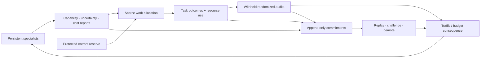

# Candidate 008: audit-backed contestable modular allocation

**Stage:** 1 — applicability and incentive-failure falsification

**Status:** held composition; not an accepted project claim

**Primary question:** when persistent specialists possess decision-relevant
private information, adapt under selection pressure, and can benefit from
misleading router-visible metrics, do unpredictable withheld audits, protected
entrant capacity, real future-traffic consequences, and contestable records
improve quality and resource allocation beyond calibrated routers, primal–dual
control, contextual bandits, and ordinary randomized evaluation at equal cost?

This contract is the direct falsification route for
[C-144](../../research/claims.md#c-144). Tests A–C already isolate its
applicability gate, strategic private-information regime, delayed randomized
audits, metric gaming, contestable records, and strongest engineering nulls.

## Applicability gate

Do not run a market-like mechanism merely because experts compete for routing.
All three conditions are necessary:

1. A module has allocation-relevant capability, uncertainty, or cost
   information that the router cannot cheaply measure directly.
2. The module has a persistent objective or selection pressure that can make a
   false report locally advantageous.
3. The allocator can impose a real consequence—future traffic, compute,
   admission, demotion, or another scarce opportunity cost—that the module
   cannot reset or evade freely.

If modules share one loss, expose their state, and cannot benefit from a false
report, the correct baseline is constrained optimization or online control.
Candidate 008 should tie or lose in that regime.

Economics supplies the boundaries. Shadow prices already coordinate declared
scarcity ([C-133](../../research/claims.md#c-133)); local route choice can impose
externalities ([C-134](../../research/claims.md#c-134)); auction truthfulness
needs explicit utility, identity, information, and transfers
([C-135](../../research/claims.md#c-135)); stable matching is not maximum task
quality ([C-138](../../research/claims.md#c-138)); metric pressure can shift
effort away from hidden objectives ([C-139](../../research/claims.md#c-139));
proper scores and peer agreement have scoped guarantees
([C-140](../../research/claims.md#c-140),
[C-141](../../research/claims.md#c-141)); and fixed identities do not solve
Sybil or allocator-credibility attacks ([C-143](../../research/claims.md#c-143)).

## Candidate loop

Editable source:
[`../../assets/diagrams/contestable-allocation-loop.mmd`](../../assets/diagrams/contestable-allocation-loop.mmd).

For module $i$, let hidden type $\theta_i$ contain current capability,
uncertainty, and resource cost. It reports $\hat\theta_i$, receives allocation
$x_i$, and produces outcome $y$. A system planner may optimize

$$
W(x)=\mathbb E[Q(x,y)]-\lambda_EE(x)-\lambda_LL(x),
$$

where $Q$ is task quality in a declared unit, $E$ is joules, $L$ is seconds,
$\lambda_E$ has quality units per joule, and $\lambda_L$ has quality units per
second. Report the raw frontier as well as any scalar objective.

A real consequence has utility

$$
u_i=T_i(\hat\theta,y)-C_i(x_i,\theta_i),
$$

where $T_i$ changes future scarce opportunity and $C_i$ is the module's real
cost in the same internal utility unit. A bookkeeping token that cannot affect
future allocation, capacity, survival, or update pressure does not satisfy the
contract.

The candidate stores report, allocation rule version, committed audit draw,
outcome vintage, resource measurement, consequence, lineage, and any challenge
or replay result. The record is evidence of what was recorded, not proof that
the router included every report or that the outcome channel was correct.

## Common benchmark

Use persistent specialists serving a nonstationary multitask stream. Each
specialist can observe a private cost/capability variable and emits a report
before allocation. Some modules update from future traffic and audit results,
so allocation creates selection pressure. Tasks include:

- directly measurable quality and energy;
- delayed quality available after several allocation epochs;
- protected rare and safety slices hidden from the public router metric;
- complementary module pairs;
- new entrants and duplicate identities;
- corrupted outcome channels; and
- correlated specialists sharing training data or gradients.

## Matched-budget contract

Equalize total model capacity, offered tasks, training/update opportunities,
router compute, evaluation calls, withheld labels, audit fraction, exploration
traffic, storage, bytes, energy, and wall-clock horizon.

Also equalize task arrival order, initial specialist checkpoints, permitted
reports, action latency, protected evaluator access, entrant opportunities,
outcome delay, and real future-traffic authority. Commit audit draws before a
module reports, but reveal no more audit information to the candidate than to
the baselines. Charge ledger writes, replay, lineage checks, privacy controls,
settlement, and challenges to the candidate arm. Charge equivalent ordinary
monitoring and evaluation to the conventional arms. Unused resources remain
unused and cannot be traded for extra labels, exploration, or a stronger
consequence.

Report compute and evaluation ceilings alongside realized joules, seconds,
bytes, labels, exploration tasks, and task opportunity transferred among
modules. A result is not matched if the candidate's audit outcome updates a
specialist while the corresponding baseline is denied the same independently
verified outcome.

## Baselines

- B0: oracle routing from hidden $\theta_i$;
- B1: calibrated nonstrategic router from observable features;
- B2: constrained optimizer or model-predictive allocation;
- B3: primal–dual shadow-price controller;
- B4: contextual bandit with uncertainty bonuses and restart handling;
- B5: fixed exploration floor plus ordinary randomized evaluation;
- B6: posted deterministic allocation and demotion rules;
- B7: correctly specified VCG, matching, or scoring mechanism only where its
  assumptions and real transfer model apply; and
- B8: Candidate 008.

## Decisive tests

### A — cooperative applicability control

Modules share the system objective, reveal their state, do not adapt reports,
and cannot benefit from lying. Compare every baseline at equal cost. Candidate
008 is expected to tie or lose after audit, ledger, and settlement overhead. A
win here indicates an unfair baseline or an ordinary routing feature mislabeled
as an incentive mechanism.

### B — hidden cost and strategic misreporting

Give modules private execution cost and future-traffic utility. Permit reports
to change allocation while the true cost is revealed only on withheld audits.
Sweep audit frequency, delay, report expressiveness, consequence strength,
outcome noise, and task nonstationarity.

Measure report calibration, total quality, joules, latency, misallocation,
audit cost, and the frequency with which locally profitable reports harm the
system. Reject if direct metering, a robust router, or a contextual bandit
matches the candidate.

### C — multitask metric gaming

Expose one quality metric to the router while holding out substitute objectives,
rare cases, and delayed outcomes. Allow specialists to adapt under traffic
selection. Compare visible-metric optimization, multiobjective router,
randomized audits, immutable protected evaluator, and Candidate 008.

The candidate must improve the vector of visible quality, hidden quality,
calibration, risk, energy, and latency. A visible-score win with protected-slice
loss fails.

### D — entrant capture, identity reset, and collusion

After incumbents accumulate traffic, introduce a superior newcomer, clone
identities, coordinated reporters, and a mediocre specialist that repeatedly
resets. Compare fixed exploration, restart-aware bandits, signed lineage and
duplicate detection, oracle lineage, and Candidate 008's protected entrant
reserve with lineage-bound consequence.

Measure admission delay for the superior entrant, wasted traffic to resets and
clones, collusive report gain, diversity, incumbent quality, and exploration
energy.

### E — allocator credibility and approximation

Vary solver approximation error and give the router pressure to favor a
short-term visible metric. In one treatment, allow audit outcomes or reports to
be omitted unless committed. Compare fixed posted rules, committed randomness,
independent allocation replay, trusted routing, and Candidate 008 with and
without commitments.

The record contributes only if replay detects relevant deviations and improves
report calibration or external outcomes enough to repay storage, latency, and
privacy cost.

## Threat and assumption matrix

| Threat | Candidate control | Boundary |
| --- | --- | --- |
| metric gaming | unpredictable protected audits and delayed outcomes | evaluator may itself be incomplete or corrupt |
| false identities | lineage-bound reputation and real admission cost | identity authority can fail or block legitimate entrants |
| collusion/shared error | correlation-aware audits and external anchors | correlated specialists may remain indistinguishable from agreement |
| allocator deviation | committed randomness, append-only reports/outcomes, replay | omitted uncommitted events remain invisible |
| entrant capture | protected trial capacity | exploration can be farmed by resets and clones |
| hidden execution cost | audits and direct metering samples | cost can change faster than audit cadence |
| approximate allocation | publish solver/version and replay approximation | truthfulness guarantees may fail under approximation |

## Required outcomes

1. Task quality by visible, delayed, rare, safety, and complementary-task slice.
2. Report calibration and proper score only where outcomes are independently
   verified.
3. Allocation regret against oracle and best conventional baseline.
4. Joules, seconds, and bytes per accepted task and per audit.
5. Tail latency, queueing, capacity violations, and utilization.
6. Hidden-objective degradation under selection pressure.
7. Entrant admission time, lineage diversity, reset/clone traffic, and
   incumbent displacement.
8. Detected and undetected allocator deviations.
9. Storage, replay latency, privacy exposure, and operator effort.
10. Total audit/evaluator cost and the reuse horizon needed to amortize it.

## Ablations

1. Remove private information.
2. Freeze modules so reports cannot adapt under selection.
3. Remove real future-traffic consequences while retaining tokens.
4. Replace reports with direct cost/capability predictors.
5. Replace randomized audits with predictable validation.
6. Remove protected entrant capacity.
7. Remove lineage binding and permit identity reset.
8. Remove append-only commitments while retaining the same stored byte budget.
9. Replace peer agreement with external outcomes, then reverse the comparison.
10. Sweep audit fraction, outcome delay, solver error, collusion, and reward-
    channel corruption.

## Statistical analysis plan

Freeze report formats, router and specialist update rules, audit fraction,
consequence schedule, identity policy, protected outcomes, practical-effect
margins, and analysis code on development streams. Confirmatory streams use
new task-order seeds, module initializations, hidden types, entrant arrivals,
outcome delays, collusion groups, and allocator-deviation schedules. Run every
arm from paired initial checkpoints on the same offered task stream and
precommitted audit schedule.

Treat a module population under one task-stream seed as the independent unit.
Requests from one persistent specialist are serially dependent and are not
counted as independent replicates. Estimate paired arm differences and
uncertainty by resampling task-stream seeds and, where independent populations
are nested within a seed, whole module lineages. Report time-resolved effects
as well as end-of-run totals so temporary audit gains are not confused with
stable incentive effects.

Test A is a negative control. Its expected tie must be assessed with a
predeclared equivalence margin on external quality, risk, and resource use;
failure to reject a difference does not establish equivalence. For Tests B--E,
the primary contrast is Candidate 008 against the strongest applicable
composed conventional baseline on the raw quality--risk--energy--latency
vector. Apply a declared multiplicity correction across the finite primary
test-by-outcome family. Calibration, collusion, subgroup, entrant, and
approximation slices not named before the holdout opens remain exploratory.

Delayed outcomes outstanding at the fixed horizon remain unresolved and are
reported by arm. Any weighting or imputation for selected missing outcomes
requires logged observation probabilities, an overlap check, a frozen model,
and a sensitivity analysis; otherwise no population claim is made for the
unobserved stratum. Report reset identities and colluding groups as clusters.
Audit-label leakage, recommitted randomness, dropped tasks, unsafe aborts, and
post-freeze rule changes are protocol deviations, not removable outliers.

## Promotion criteria

Advance only if:

1. Test A confirms the applicability gate by showing no distinct benefit in the
   cooperative directly observed regime.
2. In at least two of tests B–E, Candidate 008 improves a preregistered
   quality–risk–energy–latency frontier beyond the best composed baseline.
3. The improvement survives equal audit labels, exploration traffic, storage,
   evaluator compute, and future-traffic opportunity cost.
4. Protected objectives, rare cases, and entrants improve rather than only the
   public metric.
5. Benefits persist under delayed outcomes, collusion, false identities,
   approximate allocation, and a partially untrusted router.

Success retains a candidate composition. It does not create a market principle.

## Rejection criteria

Reject the candidate if:

- it beats cooperative routing only through extra evaluator data or compute;
- calibrated routing, primal–dual control, bandits, or randomized evaluation
  match it at equal cost;
- internal tokens have no enforceable opportunity consequence;
- audit pressure improves reports but not external task outcomes;
- protected quality or diversity falls while the public score rises;
- simple signed identity and restart-aware exploration match the lineage system;
- the ledger cannot detect omitted or biased allocation events;
- storage, privacy, replay, and evaluation cost dominate the gain; or
- the mechanism promises truthfulness, efficiency, participation, budget
  balance, and robustness outside a theorem that permits that bundle.

Negative results specify when ordinary cooperative control is sufficient and
prevent market vocabulary from entering the architecture without a strategic
information problem.
