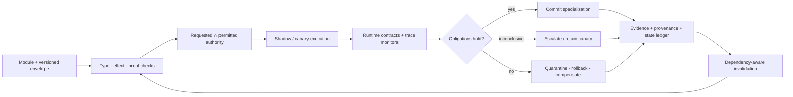

# Candidate 009: versioned graded assurance envelopes

**Stage:** 1 — composition, invalidation, and lifecycle falsification

**Status:** held systems composition; not an accepted project claim

**Primary question:** does binding distinct proofs, effects, capabilities,
empirical tests, runtime monitors, provenance, migration, compensation, and
dependency invalidation to one adaptive-module identity reduce unsafe
composition and collateral maintenance failure beyond typed APIs, sandbox/IAM,
CI/static analysis, production monitors, lineage, canaries, and transactions at
equal lifecycle budget?

## Why assurance must remain graded

The audit distinguishes guarantees that are commonly collapsed:

- a type theorem excludes one modeled error class, not arbitrary bad behavior
  ([C-145](../../research/claims.md#c-145));
- refinements prove encoded predicates rather than validating the specification
  ([C-146](../../research/claims.md#c-146));
- contracts monitor mediated obligations and assign blame
  ([C-147](../../research/claims.md#c-147));
- effects describe possible operations while capabilities grant authority
  ([C-148](../../research/claims.md#c-148));
- proof-carrying code depends on a policy, checker, semantics, and artifact
  binding ([C-149](../../research/claims.md#c-149));
- abstract interpretation exchanges precision for sound modeled coverage
  ([C-151](../../research/claims.md#c-151));
- runtime monitors classify observed prefixes, not arbitrary futures
  ([C-152](../../research/claims.md#c-152));
- transactions and compensation cover declared resources and do not reverse
  every external effect ([C-154](../../research/claims.md#c-154)); and
- provenance records derivation rather than truth
  ([C-156](../../research/claims.md#c-156)).

Candidate 009 does not claim a new proof method. Its hypothesis
[C-157](../../research/claims.md#c-157) is that adaptive systems benefit from a
single version-linked envelope because behavior, authority, evidence, state,
and dependencies change at different rates.

## Envelope contract

For each module version, record distinct fields:

1. **Artifact identity:** content digest, build/toolchain, code/model/data
   versions, dependency lock, signature.
2. **Proved interface:** types, shapes, protocols, refinements, ownership, and
   certificates, each naming the theorem and trusted base.
3. **Possible effects:** conservative effect set and requested resources.
4. **Granted authority:** explicit capabilities, scope, delegation, expiry,
   revocation, and complete-mediation boundary.
5. **Empirical envelope:** datasets/environments, calibration, uncertainty,
   failure rates, distribution limits, and known counterexamples.
6. **Runtime obligations:** event schema, temporal formula/version, response
   deadline, and true/false/inconclusive handling.
7. **Epistemic record:** training/source lineage, retrieval snapshot, claim-level
   evidence, source status, and retraction path.
8. **Update contract:** compatible predecessors/successors, state migration,
   invalidation cone, canary probes, rollback window, compensations, and
   irreversible effects.

Each field carries its own evidence class, scope, timestamp, version,
invalidation triggers, and measurement cost. An “assured” boolean is forbidden.

## Admission and maintenance flow

Editable source:
[`../../assets/diagrams/graded-assurance-envelope.mmd`](../../assets/diagrams/graded-assurance-envelope.mmd).

For module $m$, grant only

$$
\operatorname{Grant}(m)=
\operatorname{RequestEffects}(m)
\cap
\operatorname{PolicyAuthority}(m).
$$

The intersection is a policy statement. Capability enforcement and complete
mediation—not the notation—supply authority control. Any observed undeclared
effect triggers quarantine and envelope invalidation.

## Lifecycle budget

For envelope version $v$ over deployment horizon $H$,

$$
C_{\mathrm{life},v}=
C_{\mathrm{spec}}+C_{\mathrm{proof}}+C_{\mathrm{static}}
+C_{\mathrm{canary}}+C_{\mathrm{runtime}}+C_{\mathrm{provenance}}
+C_{\mathrm{migration}}+C_{\mathrm{invalidation}}
+\mathbb E[C_{\mathrm{rollback}}+C_{\mathrm{incident}}].
$$

Report engineer-hours, machine-hours, joules, bytes, and latency separately;
they are not dimensionally summed without declared conversion weights. Include
false rejection, delayed deployment, stale assurance, compensation failure,
and incidents outside the monitored boundary.

## Decisive experiments

### A — unsafe module composition

Build an adaptive tool-using service from replaceable modules. Inject interface
shape errors, protocol-order errors, hidden effects, stale capability grants,
shared-state aliasing, behavioral regressions, and dependency skew.

Compare:

- A0: schemas plus unit/integration tests;
- A1: typed APIs plus conventional IAM/sandbox and canary deployment;
- A2: A1 plus static analysis and runtime policy monitoring; and
- A3: the complete graded envelope and dependency-aware maintenance plane.

Equalize engineer-hours, CI CPU, runtime CPU/memory, storage, p99 latency budget,
and deployment opportunities. Measure unsafe admission, false rejection,
escaped authority violations, time to attribution, incident repair time,
collateral regression, and lifecycle energy. A3 must improve beyond A2.

### B — proof versus monitor placement

Choose invariants expressible statically and dynamically: tensor bounds, tool
argument ranges, permitted resource paths, state-machine order, and budget
limits. Allocate the same assurance budget among refinement/effect proof,
runtime contracts and trace monitors, mixed proof plus targeted monitoring, and
ordinary tests plus sandboxing.

Sweep event frequency, update rate, proof complexity, monitorability, crossing
count, and fault rarity. Report specification hours, proof/check time, runtime
overhead, p50/p99 latency, memory, false alarms, missed violations, response
delay, revalidation cost, and irreversible effects before response. The result
is a crossover map, not one universal winner.

### C — reversible specialization

Let a generic module specialize its cache, routing, tool policy, prompt,
retrieval index, or learned adapter. Inject state-schema changes, dependency
version skew, late behavioral regression, corrupt migration, and an external
side effect. Compare in-place hot update, blue-green/canary deployment,
checkpoint restore, transactions/sagas, and envelope-governed specialization.

Measure downtime, reserve, copied state, state loss, rollback success, detection
time, irreversible effects, compensation completeness, old-version
readability, and full lifecycle cost. “Reversible” fails if the external world
or new-format state cannot be restored inside the declared contract.

### D — factual and provenance boundary

Provide authentic false statements, retracted papers, copied citations, stale
versions, source conflicts, and invented references. Compare free-form
citations, schema-required citations, signed retrieval artifacts, lineage
graphs, and claim/evidence envelope records.

Measure citation existence, source/version identity, blind entailment,
retraction propagation, provenance coverage, false-source confidence, storage,
latency, and joules. Provenance fails if traceability rises while users become
more confident in false but authentic sources.

### E — maintenance invalidation

Change one dependency at a time: type, refinement axiom, effect handler,
capability policy, abstract summary, event schema, monitor formula, data source,
state migration, or learned weights. Compare full rebuild/retest, hand-authored
dependency rules, build-system dependency graphs, and envelope-derived
invalidation.

Measure affected-artifact recall and precision, unnecessary rechecks, stale
assurance escaping to production, time to valid redeployment, bytes, energy,
and operator effort. Include cross-layer changes, such as a retrieval snapshot
altering a factual claim without changing its output type.

## Required null stack

The strongest ordinary platform combines:

- typed schemas/APIs and protocol conformance;
- sandboxing, scoped IAM/capabilities, and network policy;
- ordinary CI tests, fuzzing, static analysis, and dependency scanning;
- production observability, runtime policy monitors, and incident alerts;
- artifact signing, software/data lineage, and deployment metadata;
- blue-green/canary rollout with transactions, checkpoints, and compensation;
- build-system invalidation and schema migration; and
- protected behavioral evaluation for learned components.

Candidate 009 is not distinct if this composed stack matches outcomes and cost.

## Ablations

1. Merge every assurance field into one pass/fail status.
2. Remove artifact binding while retaining a manifest.
3. Remove explicit trusted bases from proof fields.
4. Replace capabilities with prompt instructions.
5. Remove event coverage and inconclusive monitor verdicts.
6. Remove behavioral counterexamples and distribution boundaries.
7. Remove claim-level evidence while retaining artifact provenance.
8. Remove irreversible-effect declarations and compensation tests.
9. Remove dependency-derived invalidation.
10. Hold envelope bytes and compute constant but shuffle field/version links.

## Promotion criteria

Advance only if, at equal lifecycle budget:

1. A3 reduces unsafe admissions and collateral incidents beyond the complete
   ordinary null stack without excessive false rejection.
2. Graded fields improve attribution and response compared with a single
   “verified” label.
3. Capability enforcement blocks undeclared authority at complete mediation
   points, not through prompt compliance.
4. Runtime monitors report coverage and inconclusive states and act before
   declared irreversible harm limits.
5. Update and provenance invalidation catch cross-layer stale assurance at a
   favorable recall–precision–cost frontier.
6. Reversible specialization restores or compensates every effect named in its
   contract inside the declared window.

Success retains a systems composition; each field keeps its native guarantee.

## Rejection criteria

Reject or narrow when:

- the ordinary null stack matches outcomes and lifecycle cost;
- the envelope becomes stale documentation rather than checked artifact
  binding;
- proof fields cover trivial shapes but are presented as behavioral safety;
- authority relies on instructions rather than enforced capabilities;
- monitors omit channels or respond after irreversible effects;
- provenance raises confidence without source-quality or entailment checks;
- rollback cannot read new state or compensate external effects;
- invalidation misses more stale assurances than it saves in rechecks;
- engineer-hours, p99 latency, storage, or joules exceed avoided incident cost;
  or
- gains disappear after false rejection and delayed deployment are charged.
