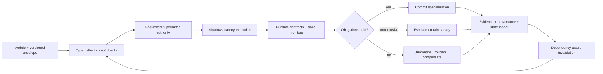

# Candidate 009: versioned graded assurance envelopes

**Stage:** 1 — composition, invalidation, and lifecycle falsification

**Status:** held systems composition; not an accepted project claim

**Primary question:** does binding distinct proofs, effects, capabilities,
empirical tests, runtime monitors, provenance, migration, compensation, and
dependency invalidation to one adaptive-module identity reduce unsafe
composition and collateral maintenance failure beyond typed APIs, sandbox/IAM,
CI/static analysis, production monitors, lineage, canaries, and transactions at
equal lifecycle budget?

## Why assurance must remain graded

The audit distinguishes guarantees that are commonly collapsed:

- a type theorem excludes one modeled error class, not arbitrary bad behavior
  ([C-145](../../research/claims.md#c-145));
- refinements prove encoded predicates rather than validating the specification
  ([C-146](../../research/claims.md#c-146));
- contracts monitor mediated obligations and assign blame
  ([C-147](../../research/claims.md#c-147));
- effects describe possible operations while capabilities grant authority
  ([C-148](../../research/claims.md#c-148));
- proof-carrying code depends on a policy, checker, semantics, and artifact
  binding ([C-149](../../research/claims.md#c-149));
- abstract interpretation exchanges precision for sound modeled coverage
  ([C-151](../../research/claims.md#c-151));
- runtime monitors classify observed prefixes, not arbitrary futures
  ([C-152](../../research/claims.md#c-152));
- transactions and compensation cover declared resources and do not reverse
  every external effect ([C-154](../../research/claims.md#c-154)); and
- provenance records derivation rather than truth
  ([C-156](../../research/claims.md#c-156)).

Candidate 009 does not claim a new proof method. Its hypothesis
[C-157](../../research/claims.md#c-157) is that adaptive systems benefit from a
single version-linked envelope because behavior, authority, evidence, state,
and dependencies change at different rates.

## Envelope contract

For each module version, record distinct fields:

1. **Artifact identity:** content digest, build/toolchain, code/model/data
   versions, dependency lock, signature.
2. **Proved interface:** types, shapes, protocols, refinements, ownership, and
   certificates, each naming the theorem and trusted base.
3. **Possible effects:** conservative effect set and requested resources.
4. **Granted authority:** explicit capabilities, scope, delegation, expiry,
   revocation, and complete-mediation boundary.
5. **Empirical envelope:** datasets/environments, calibration, uncertainty,
   failure rates, distribution limits, and known counterexamples.
6. **Runtime obligations:** event schema, temporal formula/version, response
   deadline, and true/false/inconclusive handling.
7. **Epistemic record:** training/source lineage, retrieval snapshot, claim-level
   evidence, source status, and retraction path.
8. **Update contract:** compatible predecessors/successors, state migration,
   invalidation cone, canary probes, rollback window, compensations, and
   irreversible effects.
9. **Security profile:** principal and workload identity, scoped capability,
   credential/key/attestation epoch, revocation freshness, approval-domain
   independence, observation age, named adversary, compromise horizon, and
   evidence for a clean recovery root.
10. **Scientific-claim assurance:** claim target; represented alternative set
    and search record; auxiliary, observation, and intervention dependencies;
    construction/tuning/selection/diagnostic/confirmation/replication access
    ancestry; named rival or error; method--failure-root graph; blocked evidence
    inheritance; discordant results; and purpose-qualified decision record.

The tenth field comes from the
[philosophy-of-science and theory-choice audit](../../research/audits/2026-08-21-philosophy-of-science-theory-choice.md).
It is not an ontology oracle or a new assurance method. “No rival found” remains
a finite search result. Within-support fit, prospective prediction, transfer,
causal effect, causal structure, mechanism, ontology, and formal proof remain
different targets. In particular, the envelope forbids automatic promotion
from fit to prediction, prediction to causation, causal effect to mechanism,
mechanism to unique ontology, or formal proof to empirical applicability.

The empirical envelope is itself a measurement result, not a free-form score.
It names the measurand or construct, procedure, calibration/reference state,
uncertainty budget and covariance, reproducibility conditions, decision rule,
intended use, and permitted action. Calibration, verification, and validation
remain separate, and metrological traceability is not substituted by artifact
lineage ([C-519](../../research/claims.md#c-519)–[C-531](../../research/claims.md#c-531)).
If a calibration, procedure, dataset, software build, decision rule, or stated
reference changes, the dependency cone is invalidated alongside the artifact
and behavioral envelopes ([C-534](../../research/claims.md#c-534),
[C-535](../../research/claims.md#c-535)).

For a structural transition, also version the receiver's competence state,
admission window, prior commitment, allowed next states, structural
postcondition, reopening trigger, resource ceiling, and rollback reachability.
An available signal does not grant authority to execute outside this envelope
([C-548](../../research/claims.md#c-548)–[C-551](../../research/claims.md#c-551),
[C-562](../../research/claims.md#c-562)).

Each field carries its own evidence class, scope, timestamp, version,
invalidation triggers, and measurement cost. An “assured” boolean is forbidden.
Authentication, authorization, detection, containment, and recovery remain
separate records: success in one field cannot silently satisfy another
([C-250](../../research/claims.md#c-250)–[C-267](../../research/claims.md#c-267)).

## Admission and maintenance flow

Editable source:
[`../../assets/diagrams/graded-assurance-envelope.mmd`](../../assets/diagrams/graded-assurance-envelope.mmd).

For module $m$, grant only

$$
\operatorname{Grant}(m)=
\operatorname{RequestEffects}(m)
\cap
\operatorname{PolicyAuthority}(m).
$$

The intersection is a policy statement. Capability enforcement and complete
mediation—not the notation—supply authority control. Any observed undeclared
effect triggers quarantine and envelope invalidation.

## Matched-budget lifecycle contract

For envelope version $v$ over deployment horizon $H$,

$$
C_{\mathrm{life},v}=
C_{\mathrm{spec}}+C_{\mathrm{proof}}+C_{\mathrm{static}}
+C_{\mathrm{canary}}+C_{\mathrm{runtime}}+C_{\mathrm{provenance}}
+C_{\mathrm{migration}}+C_{\mathrm{invalidation}}
+\mathbb E[C_{\mathrm{rollback}}+C_{\mathrm{incident}}].
$$

Report engineer-hours, machine-hours, joules, bytes, and latency separately;
they are not dimensionally summed without declared conversion weights. Include
false rejection, delayed deployment, stale assurance, compensation failure,
and incidents outside the monitored boundary.

Before evaluation, give the candidate and complete ordinary null stack the
same module versions, fault and attack opportunities, test data, deployment
windows, engineer-hours, CI machine-hours, runtime CPU and memory ceilings,
persistent storage, p99 latency envelope, canary capacity, rollback authority,
and observation horizon. Candidate-specific proof, envelope maintenance,
lineage, replay, invalidation, and reviewer work are charged to the candidate;
ordinary policy, CI, monitoring, incident-response, and migration work are
charged to the null. Unused budget remains unused and cannot be exchanged for
extra fault labels, broader authority, or delayed evaluation.

## Decisive experiments

### A — unsafe module composition

Build an adaptive tool-using service from replaceable modules. Inject interface
shape errors, protocol-order errors, hidden effects, stale capability grants,
shared-state aliasing, behavioral regressions, and dependency skew.

Compare:

- A0: schemas plus unit/integration tests;
- A1: typed APIs plus conventional IAM/sandbox and canary deployment;
- A2: A1 plus static analysis and runtime policy monitoring; and
- A3: the complete graded envelope and dependency-aware maintenance plane.

Equalize engineer-hours, CI CPU, runtime CPU/memory, storage, p99 latency budget,
and deployment opportunities. Measure unsafe admission, false rejection,
escaped authority violations, time to attribution, incident repair time,
collateral regression, and lifecycle energy. A3 must improve beyond A2.

### B — proof versus monitor placement

Choose invariants expressible statically and dynamically: tensor bounds, tool
argument ranges, permitted resource paths, state-machine order, and budget
limits. Allocate the same assurance budget among refinement/effect proof,
runtime contracts and trace monitors, mixed proof plus targeted monitoring, and
ordinary tests plus sandboxing.

Sweep event frequency, update rate, proof complexity, monitorability, crossing
count, and fault rarity. Report specification hours, proof/check time, runtime
overhead, p50/p99 latency, memory, false alarms, missed violations, response
delay, revalidation cost, and irreversible effects before response. The result
is a crossover map, not one universal winner.

### C — reversible specialization

Let a generic module specialize its cache, routing, tool policy, prompt,
retrieval index, or learned adapter. Inject state-schema changes, dependency
version skew, late behavioral regression, corrupt migration, and an external
side effect. Compare in-place hot update, blue-green/canary deployment,
checkpoint restore, transactions/sagas, and envelope-governed specialization.

Measure downtime, reserve, copied state, state loss, rollback success, detection
time, irreversible effects, compensation completeness, old-version
readability, and full lifecycle cost. “Reversible” fails if the external world
or new-format state cannot be restored inside the declared contract.

### D — factual and provenance boundary

Provide authentic false statements, retracted papers, copied citations, stale
versions, source conflicts, and invented references. Compare free-form
citations, schema-required citations, signed retrieval artifacts, lineage
graphs, and claim/evidence envelope records.

Measure citation existence, source/version identity, blind entailment,
retraction propagation, provenance coverage, false-source confidence, storage,
latency, and joules. Provenance fails if traceability rises while users become
more confident in false but authentic sources.

### E — maintenance invalidation

Change one dependency at a time: type, refinement axiom, effect handler,
capability policy, abstract summary, event schema, monitor formula, data source,
state migration, or learned weights. Compare full rebuild/retest, hand-authored
dependency rules, build-system dependency graphs, and envelope-derived
invalidation.

Measure affected-artifact recall and precision, unnecessary rechecks, stale
assurance escaping to production, time to valid redeployment, bytes, energy,
and operator effort. Include cross-layer changes, such as a retrieval snapshot
altering a factual claim without changing its output type.

### F — compromise-bounded assurance

Inject stolen credentials and sessions, compromised workloads, clock or epoch
rollback, stale policy caches, delegated authority, correlated approvers,
blinded telemetry, a poisoned backup, and a compromised signing root. Compare
the full envelope with mature short-lived IAM, PKI/HSM-backed policy, sandboxing,
service-mesh enforcement, conventional monitoring, and a rehearsed
isolate–reimage–restore–rotate–validate workflow.

Measure unauthorized actions per attack, weighted capability-seconds,
false denials per 1,000 legitimate requests, detection-to-containment seconds,
compromise-to-last-covered-acceptance seconds, secure recovery time, recurrence,
p50/p99 authorization latency, bytes, joules, and operator-hours. Retire the
security profile if credential lifetime tuning and conventional recovery match
the harm and recovery frontier at equal cost.

### G — scientific overpromotion and common-root assurance

Construct paired scientific records containing:

1. a model that fits but fails sealed prospective data;
2. predictively equivalent causal models that differ under intervention;
3. correct intervention response with a wrong internal component organization;
4. a how-possibly mechanism that fails component replacement or reconstitution;
5. one supported mechanism compatible with rival ontologies;
6. a checked theorem with a defective informal or physical mapping;
7. evidence secretly used during construction, tuning, or selection but labeled
   confirmation; and
8. three agreeing pipelines with one shared calibration, preprocessing, theory,
   code, data, or review fault root.

Compare a scalar confidence/verified label, ordinary provenance and validation,
an explicit evidence-type schema without cross-layer invalidation, and the full
envelope. Equalize candidate and evaluator calls, interventions, data, human
review, bytes, wall time, and energy. Measure cross-target promotion errors,
false unique identification, access-role misclassification, false robust
promotion, common-root localization, preserved discordance, time to downgrade
after a new rival or leaked access path, and downstream decisions made under
stale assurance.

Use the same evidence under two registered intended uses with different false-
accept and false-reject consequences. The evidence state must remain unchanged;
only a declared purpose-qualified decision may differ. Hidden scalarization or
unversioned theory-value weights are contract failures.

## Measurements and units

Use one cross-experiment outcome record while retaining each field's native
meaning and unit:

1. unsafe admissions, escaped authority violations, stale-assurance escapes,
   and irreversible effects as counts and events per 1,000 attempted
   deployments or authorized actions;
2. false rejection, false denial, inconclusive verdict, rollback failure,
   compensation failure, and recurrence as counts with their denominators;
3. weighted capability-seconds only with the predeclared capability weights
   and the raw action counts and durations in seconds;
4. detection, attribution, containment, rollback, migration, revalidation,
   redeployment, and secure-recovery time in seconds;
5. p50 and p99 task or authorization latency in milliseconds, plus task quality
   and protected-slice loss in their declared task units;
6. proof/checker, CI, canary, runtime, monitor, replay, migration, and incident
   energy in joules at one named boundary;
7. artifact, state, trace, lineage, checkpoint, and invalidation traffic in
   bytes, with peak CPU and memory reported separately;
8. specification, proof, review, incident, migration, and recovery effort in
   person-hours and machine-hours;
9. invalidation recall and precision against the injected dependency ground
   truth, together with unnecessary rechecks and missed stale artifacts; and
10. empirical-envelope calibration, interval coverage, provenance coverage,
    source identity, and blind entailment as separate fractions with explicit
    denominators.

Do not sum person-hours, machine-hours, joules, bytes, seconds, quality, and
risk without publishing conversion weights and a sensitivity analysis. A
better traceability fraction cannot compensate for a worse protected outcome.

## Required null stack

The strongest ordinary platform combines:

- typed schemas/APIs and protocol conformance;
- sandboxing, scoped IAM/capabilities, and network policy;
- ordinary CI tests, fuzzing, static analysis, and dependency scanning;
- production observability, runtime policy monitors, and incident alerts;
- artifact signing, software/data lineage, and deployment metadata;
- blue-green/canary rollout with transactions, checkpoints, and compensation;
- build-system invalidation and schema migration; and
- protected behavioral evaluation for learned components.
- short-lived workload identity, PKI/HSM or KMS, session revocation, and tested
  compromise rebuild and credential rotation.

Candidate 009 is not distinct if this composed stack matches outcomes and cost.

## Ablations

1. Merge every assurance field into one pass/fail status.
2. Remove artifact binding while retaining a manifest.
3. Remove explicit trusted bases from proof fields.
4. Replace capabilities with prompt instructions.
5. Remove event coverage and inconclusive monitor verdicts.
6. Remove behavioral counterexamples and distribution boundaries.
7. Remove claim-level evidence while retaining artifact provenance.
8. Remove irreversible-effect declarations and compensation tests.
9. Remove dependency-derived invalidation.
10. Hold envelope bytes and compute constant but shuffle field/version links.
11. Remove key/attestation epochs while keeping short credential lifetimes.
12. Share one identity, approval, telemetry, and recovery control plane while
    reporting the logical components as independent.
13. Remove the represented alternative-set and finite-search record.
14. Remove evidence-use/access ancestry while preserving timestamps.
15. Remove the method--failure-root graph while retaining method names.
16. Permit prediction, causation, mechanism, ontology, and proof fields to
    inherit from one confidence score.
17. Merge the evidence record with intended use, false-error consequences, and
    theory-value weights.

## Statistical analysis plan

Freeze envelope schemas, policies, checkers, monitors, dependency rules,
thresholds, practical-effect margins, and analysis code on development module
versions. The confirmatory split uses new versions, dependency graphs, fault
and attack seeds, update orders, source changes, and migration histories. Pair
the complete candidate and ordinary null stack on the same initial artifact,
state, workload, injected event, and observation horizon. The oracle injection
record is evaluator-only.

Treat the module-version by injected-event seed as the primary unit. Requests,
monitor ticks, and dependency nodes inside that unit are correlated
measurements, not independent replicates. Report paired arm differences with
uncertainty resampled at the module-version and injection level. For rare
unsafe admissions or authority escapes, publish event counts, denominators,
and interval estimates even when a cell has zero observed events. Analyze
detection, containment, redeployment, and secure recovery as time-to-event
outcomes; unresolved runs at the fixed horizon are right-censored and remain in
the unresolved fraction.

Each experiment A--G has a predeclared primary contrast against its strongest
applicable conventional arm. Apply one declared multiplicity procedure across
the finite primary outcome family; proof classes, monitor classes, dependency
types, attacks, and human-facing strata not named before the holdout opens are
exploratory. Claims that an ordinary stack is matched require a predeclared
equivalence margin; a nonsignificant difference alone is not equivalence.
Protected safety and authority outcomes use non-inferiority margins fixed in
their native units before any latency or energy improvement is considered.

Score invalidation precision and recall against the injected dependency graph
without counting one stale artifact repeatedly across descendant alerts.
Outstanding factual outcomes, selected incident reports, aborted deployments,
inconclusive monitor states, and failed migrations are reported by arm rather
than dropped. Human-facing results are stratified by the prespecified review or
accessibility condition. Every post-freeze exclusion, checker failure, and
missing measurement receives a protocol-deviation record and sensitivity
analysis.

## Promotion criteria

### Human-facing assurance gate

When a person reviews, authorizes, interrupts, or recovers an action, record
actual and pending mode, effective authority, changed state, response deadline,
checkpoint/compensation path, acknowledgement, resumption cue, and expiry.
Explanation, confidence, approval, and audit visibility remain separate from
proof, provenance, comprehension, executable control, and verified recovery
([C-399](../../research/claims.md#c-399)–[C-416](../../research/claims.md#c-416)).
Test at least one assistive-technology/accessibility stratum and charge
training, review, interruption, and rework.

Advance only if, at equal lifecycle budget:

1. A3 reduces unsafe admissions and collateral incidents beyond the complete
   ordinary null stack without excessive false rejection.
2. Graded fields improve attribution and response compared with a single
   “verified” label.
3. Capability enforcement blocks undeclared authority at complete mediation
   points, not through prompt compliance.
4. Runtime monitors report coverage and inconclusive states and act before
   declared irreversible harm limits.
5. Update and provenance invalidation catch cross-layer stale assurance at a
   favorable recall–precision–cost frontier.
6. Reversible specialization restores or compensates every effect named in its
   contract inside the declared window.
7. Scientific-claim assurance reduces cross-target promotion, false robustness,
   and stale uniqueness beyond the complete ordinary evidence/provenance stack;
   discovered rivals, access leakage, and common roots trigger the scoped
   downgrade without erasing unaffected observations or checked proofs.

Success retains a systems composition; each field keeps its native guarantee.

## Rejection criteria

Reject or narrow when:

- the ordinary null stack matches outcomes and lifecycle cost;
- the envelope becomes stale documentation rather than checked artifact
  binding;
- proof fields cover trivial shapes but are presented as behavioral safety;
- authority relies on instructions rather than enforced capabilities;
- monitors omit channels or respond after irreversible effects;
- provenance raises confidence without source-quality or entailment checks;
- fit, prediction, causal effect, causal structure, mechanism, ontology, or
  formal proof silently promotes another target;
- “no rival found” or the count of agreeing methods is treated as a uniqueness
  or independence certificate;
- discovered access leakage or a shared failure root does not reclassify and
  invalidate affected downstream assurance;
- changing intended use or false-error consequences rewrites the evidence
  record rather than a separate decision record;
- rollback cannot read new state or compensate external effects;
- invalidation misses more stale assurances than it saves in rechecks;
- engineer-hours, p99 latency, storage, or joules exceed avoided incident cost;
  or
- gains disappear after false rejection and delayed deployment are charged.

## Burden-qualified contestable-decision track

The [legal evidence/procedure audit](../../research/audits/2026-08-05-legal-evidence-procedure.md#candidate-coverage-and-exact-refinements)
requires separate authenticity, admissibility-for-purpose, weight,
sufficiency-under-burden, authority, review-standard, and finality fields. A
higher value in one cannot upgrade another. Rule, authority, purpose, burden,
record, or review-version changes invalidate only assurances that depend on
them and can narrow action authority immediately.

Evidence: [C-679](../../research/claims.md#c-679)–[C-704](../../research/claims.md#c-704).

Compare the complete record with typed workflow/provenance, calibrated
selective prediction, access control, independent review, rule graphs, and full
recomputation. Equalize evidence, authority, reviewer time, delay, compute,
storage, and energy. Reject the track if the extra grades are unused metadata,
if authenticity becomes truth, if admissibility becomes reliability, or if the
ordinary assurance stack matches protected outcomes and lifecycle cost. See
the [decision-record mathematics](../../math/contestable-decision-record.md).
