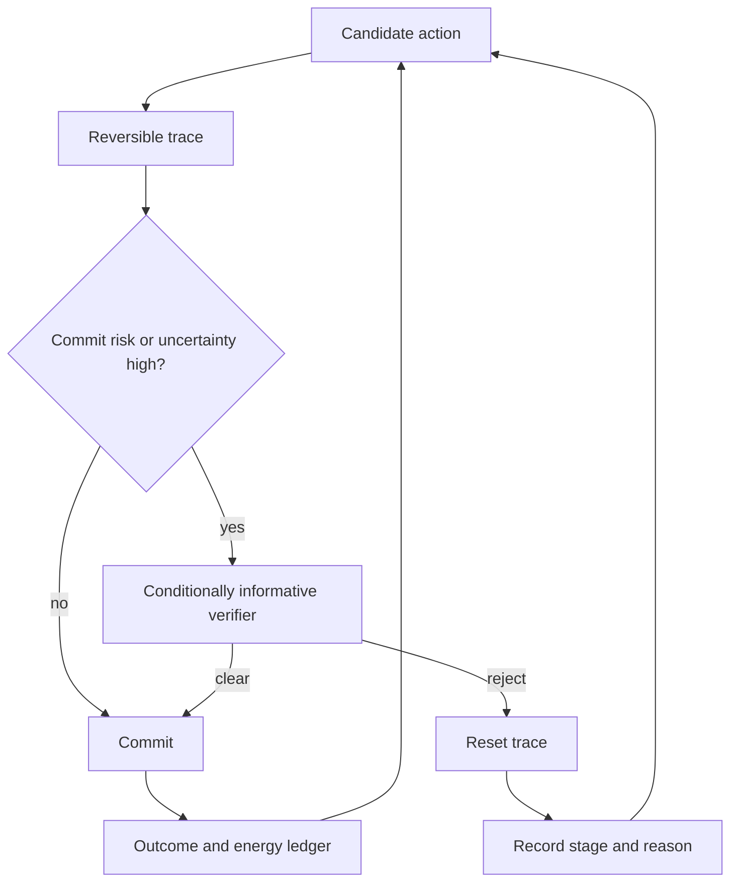

# Candidate 010: reset-coupled staged verification

**Stage:** 1 — synthetic falsification

**Status:** held composition; not an accepted project claim

**Primary question:** when false commitment is expensive, can a reversible
trace followed by a conditionally informative verifier and explicit reset beat
calibrated thresholds, cascades, sequential tests, abstention, retries, and
redundant verification at the same total budget?

**Executable status:** the [Candidate 010 workstation harness](../workstation/candidate-010/README.md)
passes 6 of 9 structural implementation gates. The complete 48-scenario implementation
test now runs across four isolated local task backends, alongside append-only
integrity, deterministic resume, and the external-meter contract. Freshly
sealed confirmation/held-out seeds, calibrated hardware measurements, and a
promotion evidence bundle are not present; no experimental claim has been
produced.

## Current executable limitations

The executable layer is narrower than the full protocol below:

- each factorial opportunity–arm receives a fresh isolated effect root, so the
  main run does not test concurrent shared-service contention; a separate
  longitudinal diagnostic now tests persistent transactional-KV and actuator
  histories through commit, reset, later commit, stale refusal, and a declared
  interruption after backend finalization and pending-receipt destination-file
  `fsync`, but before ledger append; its resume identity includes the
  full executable source bundle and it revalidates all durable generations
  against the ledger;
- complete ledger records and checkpoint replacements request file `fsync` and
  persistent identity, receipt, and final metadata use the same synced
  replacement path; truncated or ambiguous authority fails closed, but
  directory-entry persistence, torn-tail repair, arbitrary power-loss, and
  general filesystem crash recovery are not established;
- factorial and persistent output roots use ownership-checked exclusive writer
  leases; contention is refused before mutation, stale locks are never broken
  automatically, and concurrent shared-service behavior is not measured;
- the retry/rollback arm now executes two real effect lifecycles, and the
  validator recomputes both lifecycle snapshots and total work; the independent-
  verifier arm uses a separately implemented detector whose lineage is rebuilt
  from frozen input and output; both remain synthetic local comparators rather
  than deployed-system evidence;
- a separate eight-case fault campaign injects reset leakage, incomplete
  rollback, precommit effects, delayed cleanup, stale or corrupt verification,
  failed finalization, and an irreversible-effect sentinel; it is a diagnostic,
  not a measured external failure distribution;
- a strict source-bound seed-release validator and promotion-evidence builder
  exist, but no real frozen confirmation/held-out release or validated evidence
  bundle exists; and
- no interval-owned calibrated energy observation has been collected.
- no fresh immutable execution bootstrap yet proves that loaded ESM code,
  direct source hashes, the Node runtime, and installed dependencies share one
  frozen identity.

Every smoke and factorial raw record now crosses one executable event contract
before append and again before analysis or validation. The source freeze also
hashes the execution manifest and discovers production modules, registered
tests, and both sets of relative imports rather than trusting duplicated
hand-maintained lists. These controls make malformed evidence harder
to admit; they do not change the result status.

Accordingly, the 6/9 count describes structural gates only. It is neither a
scientific result nor evidence for the held composition.

## Why this experiment exists

Kinetic proofreading separates recognition from commitment. A candidate may
enter temporary driven states, leave through discriminatory rejection paths,
and consume time and fuel before a product is committed. That mechanism is
established for scoped biochemical networks ([C-159](../../research/claims.md#c-159)),
but it does not automatically transfer to software.

The residual systems hypothesis is narrower:

1. create a trace whose externally visible effects are still reversible;
2. invoke a later check only when expected commitment risk justifies it;
3. require that check to add conditional information or a distinct detector;
4. reset rejected traces before they become durable actions; and
5. preserve the rejection stage and reason for calibration and maintenance.

“Check twice” is not the mechanism. Repeating correlated evidence can merely
manufacture confidence.

## Candidate loop

Editable source:
[reset-coupled-verification.mmd](../../assets/diagrams/reset-coupled-verification.mmd).

## What must be distinct

The experiment treats these as separate operations:

- **recognition:** score evidence about the candidate;
- **temporary execution:** materialize enough state to expose failure without
  authorizing the irreversible effect;
- **verification:** obtain evidence not already counted by the proposer;
- **commitment:** cross the declared durability or authority boundary;
- **reset:** remove every state still inside the rollback boundary; and
- **provenance:** record which version, stage, detector, and evidence produced
  the decision.

A system that cannot name its commitment boundary is not eligible for this
test.

## Statistical null

For observations $z_1,\ldots,z_t$, the sequential probability-ratio null uses

$$
L_t = \sum_{i=1}^{t}
\log \frac{p(z_i\mid R,z_{<i})}{p(z_i\mid W,z_{<i})},
$$

where $L_t$ is a dimensionless cumulative log-likelihood ratio, $R$ denotes a
safe or correct candidate, $W$ denotes an unsafe or wrong candidate, and
$z_{<i}$ is the evidence already observed. Conditioning on $z_{<i}$ prevents
repeated correlated checks from being counted as independent evidence.

The proposed composition survives only if its temporary execution or distinct
verifier exposes information unavailable to the matched sequential test.

## Cost boundary

For arm $a$, charge the complete decision cost

$$
C_a = C_{\mathrm{observe},a}
    + C_{\mathrm{propose},a}
    + C_{\mathrm{verify},a}
    + C_{\mathrm{reset},a}
    + C_{\mathrm{maint},a}
    + C_{\mathrm{false\ commit},a}
    + C_{\mathrm{false\ reject},a}.
$$

Each $C$ is reported in both joules and wall time over the same run, except the
declared consequence terms, which are reported separately in task-native risk
units rather than silently converted into joules. Report

$$
E_{\mathrm{correct\ commit},a}
= \frac{E_{\mathrm{wall},a}}
       {N_{\mathrm{correct\ committed},a}},
$$

where $E_{\mathrm{wall},a}$ is measured wall energy in joules and
$N_{\mathrm{correct\ committed},a}$ is a dimensionless count. Rejected attempts,
failed resets, idle reserve, logging, and verifier startup remain inside the
boundary.

## Rollback boundary

Let $S_{\mathrm{pre}}$ be the state before a temporary action and
$S_{\mathrm{postreset}}$ the state after reset. Define rollback completeness

$$
r = 1 -
\frac{d(S_{\mathrm{pre}},S_{\mathrm{postreset}})}
     {d_{\max}},
\qquad 0 \le r \le 1,
$$

where $d$ is a declared task-specific distance and $d_{\max}>0$ is its maximum
relevant deviation. This score covers only modeled restorable state. Disclosure,
elapsed time, third-party reactions, physical damage, and other irreversible
effects are reported as separate binary or quantitative violations.

## Task family

Use a synthetic tool-execution environment with:

- cheap evidence streams whose correlation can be controlled;
- an optional expensive detector with controlled conditional information;
- actions divided into reversible preparation and irreversible commitment;
- configurable false-commit and false-reject consequences;
- injected verifier common-mode failures;
- measurable reset leakage and reset cost; and
- distribution shifts that change both evidence quality and base rate.

At least one track must use an actual isolated filesystem or transactional
service so the simulator's rollback score is checked against concrete state.

## Arms

1. one calibrated threshold;
2. a fixed-depth early-exit cascade;
3. a correctly conditioned sequential probability-ratio test;
4. selective classification with abstention;
5. retry plus rollback;
6. redundant or independently implemented verification;
7. the proposed reset-coupled staged composition; and
8. an oracle-information ceiling that is not eligible to win.

## Equalization

Every arm receives the same:

- candidate stream and consequence schedule;
- total observations and access to evidence channels;
- proposer and verifier model classes;
- maximum model operations and bytes moved;
- verifier-call allowance;
- rollback mechanism and storage allowance;
- wall-time deadline; and
- measured wall-energy boundary.

If an arm spends less on verification, it may use the remainder elsewhere;
unused budget is not treated as a benefit unless wall energy is actually lower.

## Factorial sweeps

Sweep at least:

- correlation among cheap checks;
- conditional mutual information supplied by the later verifier;
- false-commit to false-reject cost ratio;
- reset completeness and reset latency;
- reversible-trace cost;
- verifier common-mode error;
- base-rate shift;
- observation delay; and
- irreversible leakage before commitment;
- receiver competence state and version;
- early, valid, expired, and explicitly reopened commitment windows; and
- structural-write versus parameter-only commitment cost.

## Measurements

Report raw axes before any aggregate score:

- false commits and false rejects;
- expected and tail stopping time;
- calibration and abstention rate;
- verifier calls per committed action;
- rollback completeness and irreversible violations;
- joules per correct committed action;
- bytes moved and durable bytes written;
- maintenance and provenance overhead; and
- consequence-weighted loss using the preregistered task units.

## Confirmatory analysis and statistical plan

The confirmatory unit is one independently generated action opportunity with its
complete evidence, consequence, reset, rollback, and commitment record. Run all
eligible arms on paired opportunities from the same scenario seed and task
version. Repeated opportunities from one scenario, service instance, verifier,
or reset backend are clustered rather than counted as independent replication.
Confirmation holds out task templates, base-rate bands, evidence-correlation
regimes, verifier implementations, reset backends, consequence schedules, and
the concrete transactional or filesystem service. Random event splits within
one generated world are development diagnostics only.

Preregister the proposed composition's paired contrasts against the conditioned
sequential test, calibrated cascade, abstention, rollback, and independent-
verification nulls. The primary report gives paired effect estimates and
simultaneous confidence or credible intervals for consequence-weighted loss,
false commits, false rejects, rollback violations, joules per correct committed
action, and p99 stopping time. Calibration error, abstention, verifier calls,
bytes, and maintenance remain separately interval-estimated outcomes. Quantile
uncertainty and rare-violation intervals use scenario-level resampling or a
hierarchical model that preserves the paired and clustered design; meter,
calibration, and simulator uncertainty remain separate, and individual events
are not resampled as if independent.

Freeze one gatekeeping order before confirmation: first test noninferiority on
irreversible violations and false commits at the task-specific margins; then
test superiority on consequence-weighted loss; only then test energy, latency,
or verifier-call savings. Margins come from the declared consequence contract,
not a universal constant. Control family-wise error across the confirmatory
null contrasts and factorial regimes with a preregistered hierarchical or Holm
procedure. Report the full unadjusted effect/interval table as well as adjusted
decisions; no weighted aggregate may conceal a failed safety or parity gate.

Timeouts and opportunities still unresolved at the deadline are right-censored
for stopping-time analysis and failures for any deadline-dependent service
outcome. Verifier unavailability, missing evidence, aborted preparation,
incomplete rollback measurement, zero-commit strata, and energy-meter loss are
typed outcomes or missingness states, never silent exclusions. Preregister
best/worst-case and model-based sensitivity analyses when missingness can depend
on risk or arm. Denominators include every assigned opportunity and rejected or
reset attempt.

Escalation thresholds, stopping boundaries, calibration maps, abstention rules,
reset-completeness tests, rollback postconditions, and the final promotion gate
are learned only on development/validation data and frozen before held-out
release. The frozen decision is then applied mechanically to every confirmatory
stratum, including out-of-support abstention. Oracle information remains a
ceiling and is never part of the eligible win decision.

## Decisive predictions

The candidate predicts a Pareto improvement only where all three conditions
hold:

1. a later stage adds conditional information or a genuinely different failure
   detector;
2. a reversible trace exposes that information before commitment; and
3. reset plus verification costs less than the avoided false commitment.

It should tie or lose when evidence is independent and fully available to a
well-specified sequential test, when the later verifier is a correlated copy,
or when rollback is incomplete.

## Ablations

- remove the reset path;
- let temporary execution create externally visible side effects;
- replace the distinct verifier with a same-model resample;
- hide rejection-stage provenance;
- invoke verification on every case;
- remove risk-conditioned escalation; and
- train on the evaluation detector's exact failure distribution;
- replace the competence window with a fixed schedule; and
- allow reopening without revalidating rollback and the structural postcondition.

## Kill criteria

Reject the candidate composition if any of these holds:

- the conditioned sequential test or calibrated cascade matches its complete
  risk–latency–energy frontier;
- benefit disappears after rejected attempts and reset work are charged;
- verifier gains come only from additional compute or privileged evidence;
- correlated checks are counted as independent;
- irreversible effects occur before the declared commit boundary;
- rollback completeness falls below the preregistered task threshold; or
- provenance and maintenance cost erase the operational benefit.

## Promotion rule

Passing one synthetic task does not create a new principle. Promotion requires
the composition to beat the strongest null in at least two materially different
commitment domains, with the useful regime predicted from conditional
information, reversibility, and consequence ratios before results are observed.

## Evidence links

- [Chemistry and reaction-network audit](../../research/audits/2026-08-05-chemistry-reaction-networks-proofreading.md)
- [C-159](../../research/claims.md#c-159): scoped kinetic proofreading
- [C-160](../../research/claims.md#c-160): speed–error–dissipation frontier
- [C-170](../../research/claims.md#c-170): held systems hypothesis
- [C-548](../../research/claims.md#c-548)–[C-562](../../research/claims.md#c-562):
  competence, commitment, reopening, and developmental evidence boundaries
- [Developmental morphogenesis audit](../../research/audits/2026-08-05-developmental-morphogenesis.md)
- [P-003](../../research/principle-registry.md#p-003--temporary-trace-before-commitment)
- [P-007](../../research/principle-registry.md#p-007--prediction-error-allocation)
- [P-009](../../research/principle-registry.md#p-009--maintenance-plane)

## Burden-qualified contestable-decision track

The [legal evidence/procedure audit](../../research/audits/2026-08-05-legal-evidence-procedure.md#candidate-coverage-and-exact-refinements)
adds a harder adversarial-verification condition: affected parties or test
roles receive the adverse material, usable access, time, authority, and tools
to challenge it; contrary evidence and objections remain linked to the claim;
contaminating excluded information is isolated; and a failed gate has an
executable remedy before irreversible commitment.

Evidence: [C-679](../../research/claims.md#c-679)–[C-704](../../research/claims.md#c-704).

Cross unequal access, hidden favorable evidence, inadmissible contamination,
asymmetric false-action costs, time limits, reviewer dependence, and
irreversible effects. Compare ordinary red teams, two-person review, staged
testing, provenance, and full recomputation at equal information, attempts,
authority, human time, delay, compute, and joules. Reject if “adversarial” means
only another model prompt or if ordinary independent review matches the result.
