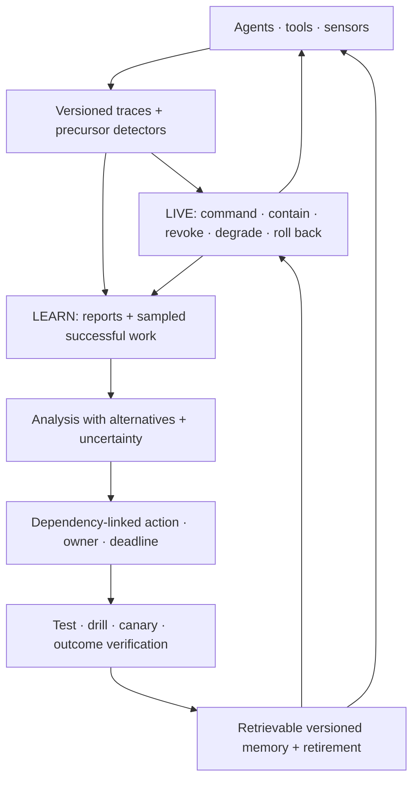

# Candidate 011: dual-loop operational assurance

**Stage:** 1 — multi-agent fault-injection falsification

**Status:** held systems composition; not an accepted project claim

**Primary question:** does an explicit live containment loop connected to a
separate longitudinal learning loop reduce tail containment time and recurrence
severity beyond a mature SRE and incident-management stack at equal authority,
compute, storage, interruption, and human-time budgets?

## Candidate boundary

The live loop and learning loop solve different problems:

1. **Live operation** detects, acknowledges, contains, degrades, revokes,
   escalates, rolls back, and restores under a deadline.
2. **Longitudinal learning** retains multi-perspective traces, samples
   precursors and successful adaptations, evaluates competing explanations,
   binds an accepted finding to a versioned change and test, verifies the
   outcome, retrieves it when applicable, and retires it when stale.

Containment without learning permits recurrence. Documentation without a fast
authority path permits damage before explanation is complete. The candidate is
the measured interface between the loops, not an organizational vocabulary.

## Candidate loop

Editable source:
[dual-loop-operational-assurance.mmd](../../assets/diagrams/dual-loop-operational-assurance.mmd).

## Observation model

Raw report count is not a safety metric. Over one declared exposure interval,

$$
N_{\mathrm{report}} = N_{\mathrm{precursor}}
p_{\mathrm{detect}}p_{\mathrm{report}}p_{\mathrm{retain}},
$$

where both $N$ terms are event counts and every $p$ is a dimensionless
stage-conditional probability. The factorization is diagnostic, not an
independence assumption. Severity, workload, identity, instrumentation,
incentives, and enforcement may change every factor.

The learning funnel is reported cohort by cohort:

$$
N_{\mathrm{verified}} = N_{\mathrm{report}}
p_{\mathrm{triage}}p_{\mathrm{analyze}}p_{\mathrm{action}}p_{\mathrm{verify}}.
$$

Completion at one stage does not establish effectiveness at the next. The
experiment records attrition reasons and verified outcome change, not ticket
closure.

## Latency model

For a fault onset defined by the simulator,

$$
T_{\mathrm{contain}} = T_{\mathrm{detect}} + T_{\mathrm{classify}}
+ T_{\mathrm{authorize}} + T_{\mathrm{act}}.
$$

Every term is measured in seconds. Report p50, p95, and p99. Faster authority
may increase false stops, contradictory commands, or expert load, so latency is
never reported alone.

## Task family

Use modular-agent environments with injected:

- correlated tool and model faults;
- conflicting or delayed observations;
- an unavailable coordinator or specialist;
- changing objectives during response;
- communication overload and alert floods;
- authority-gradient cases where a low-status module holds decisive evidence;
- precursors with a known exposure denominator; and
- recurrence after renamed components, changed versions, and shifted symptoms.

## Arms

1. free-form multi-agent chat and logging;
2. one fixed central supervisor;
3. mature SRE telemetry, on-call roles, runbooks, IAM, circuit breakers,
   canaries, postmortems, action tracking, and searchable memory;
4. deterministic interlocks plus ordinary incident command;
5. the dual-loop composition; and
6. a topology-reduced ceiling that removes the injected dependency when
   possible but is not eligible to hide lost task utility.

## Equalization

Hold constant:

- model versions, context, tools, and permissions;
- total compute, bytes moved, retained bytes, and wall energy;
- human or expert minutes;
- response deadlines and interruption budget;
- maximum containment and revocation authority;
- protected-test and drill count;
- simulator exposure and post-event labels; and
- topology and common-mode fault distribution.

## Experimental tracks

1. **Incident topology:** vary coupling, opacity, slack, common-mode failure,
   handoffs, and spans of control.
2. **Challenge and escalation:** vary authority gradient, expert availability,
   acknowledgement rules, false-stop cost, and irreversible-action deadline.
3. **Near-miss observation:** compare complete telemetry, protected reports,
   punitive attribution, and trajectory mining against known precursors.
4. **Adaptive procedure:** compare static text, executable checks, and recorded
   expert deviation under routine and rare changed-interface conditions.
5. **Memory across versions:** reintroduce causal families after renaming and
   migration, then measure applicability-triggered retrieval and stale harm.
6. **Success sampling:** allocate a fixed analysis budget across failures,
   near misses, ordinary success, and demanding successful adaptations.

## Measurements

Report raw axes:

- p50/p95/p99 containment and restoration time;
- unsafe actions and consequence before containment;
- false stops and lost task utility;
- contradictory commands and handoff information loss;
- communication, expert, reviewer, storage, and energy cost;
- precursor recall conditional on exposure;
- report duplication, privacy leakage, and strategic reporting;
- verified corrective-change rate;
- recurrence severity and time to applicability-triggered retrieval;
- stale-lesson harm and retirement latency; and
- retained bytes per prevented recurrence.

## Required ablations

- disconnect the learning loop from live retrieval;
- retain only the accepted incident narrative, dropping conflicting traces;
- close actions without outcome verification;
- remove version and dependency links;
- remove expiry and retirement;
- let escalation transfer authority without acknowledgement or deadline;
- sample only failures; and
- replace protected reporting with complete automatic telemetry.

## Kill criteria

Reject the composition if:

- the mature SRE stack matches containment, recurrence, and retrieval at no
  greater human, compute, storage, energy, or false-stop cost;
- explicit roles increase coordination traffic or tail containment;
- near-miss mining raises report volume without denominator-adjusted precursor
  recall or verified changes;
- dependency-linked memory retrieves more stale lessons than useful ones;
- adaptive procedure overrides create more consequential bypasses than they
  prevent fixation failures;
- topological simplification or deterministic interlocks dominate at matched
  task utility; or
- results depend on uncharged staffing, authority, telemetry, or labels.

## Promotion rule

### Interruption and resumption gate

Live response must count interruption duration, resumption latency, rework,
stress/effort measures, and person-minutes rather than treating acknowledgement
as effective intervention. A human responder must receive timely actual and
pending mode, effective authority, changed state, executable containment or
recovery, a resumption cue, and evidence that the intended state changed
([C-396](../../research/claims.md#c-396)–[C-416](../../research/claims.md#c-416)).

The candidate remains a composition of existing principles unless the link
between live response and versioned learning produces a reproducible frontier
gain across at least two materially different fault topologies. A failure
merges each useful component into ordinary SRE, incident command, provenance,
and maintenance practice.

## Evidence links

- [High-reliability organizations audit](../../research/audits/2026-08-05-high-reliability-organizations-incident-learning.md)
- [C-173](../../research/claims.md#c-173)–[C-185](../../research/claims.md#c-185)
- [P-002](../../research/principle-registry.md#p-002--local-autonomy-with-exception-escalation)
- [P-003](../../research/principle-registry.md#p-003--temporary-trace-before-commitment)
- [P-009](../../research/principle-registry.md#p-009--maintenance-plane)
- [P-013](../../research/principle-registry.md#p-013--externalized-shared-state)
