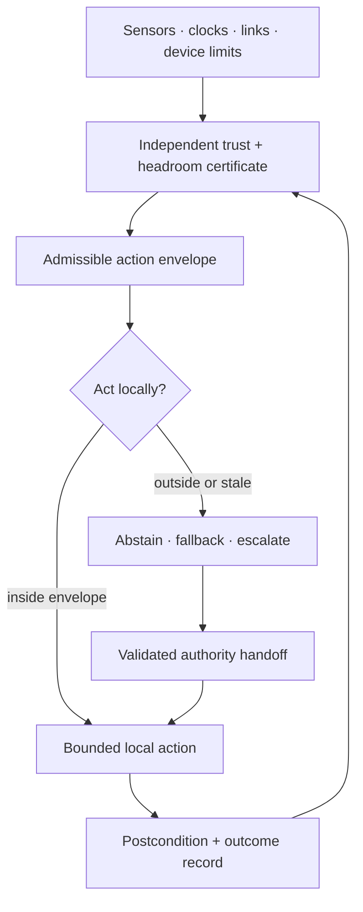
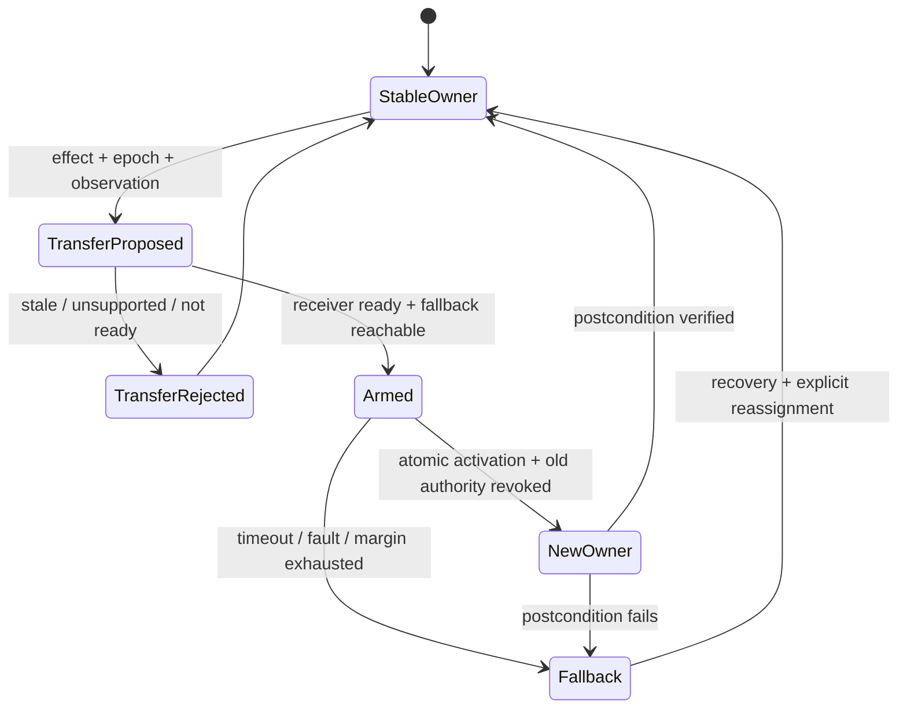
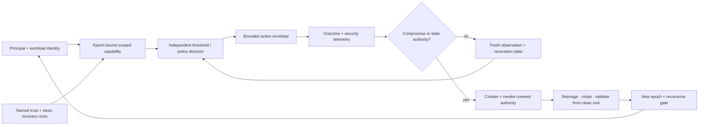

# Candidate 012: latency-qualified authority envelopes

**Stage:** 1 — hybrid-control and fault-injection falsification

**Status:** held systems composition; not an accepted project claim

**Primary question:** does continuously restricting a controller's action set
from observation age, integrity, mode, physical headroom, and coordination
state improve the service–risk frontier beyond static protection hierarchies,
supervisory control, constrained control, barrier functions, and runtime
assurance at equal sensing, reserve, authority, and lifecycle cost?

## Candidate statement

Controller $i$ receives a time-varying admissible action set

$$
\mathcal U_i(t)=\mathcal E_i\!\left(
\tau_i(t),q_i(t),m_i(t),b_i(t),c_i(t)
\right),
\qquad u_i(t)\in\mathcal U_i(t).
$$

Here:

- $\tau_i$ is observation age in seconds;
- $q_i$ is a declared integrity or trust state with component-specific units;
- $m_i$ is a discrete or probabilistic mode estimate;
- $b_i$ is a vector of physical or computational headroom with declared units;
- $c_i$ is communication and coordination availability;
- $\mathcal E_i$ is a certified set-valued map; and
- $u_i$ is the selected physical or logical action.

No scalarization is implied. Every component retains its unit, range,
timestamp, provenance, and uncertainty. Stale evidence, lost integrity,
reduced headroom, or lost coordination should shrink authority to a local safe
fallback. Wider actions require a validated handoff and checked postcondition.

For embodied action, the envelope additionally binds body/tool, attachment and
payload, contact state, sensor/actuator calibration, plant-confidence region,
task Jacobian, impedance/passivity, and actuation-delay versions. A tool or
contact change can shrink authority even when telemetry age is low. Inject
counterfactual plant swaps and reject this refinement if robust/adaptive MPC,
operational-space impedance control, or gain scheduling matches service and
risk at equal sensing and lifecycle cost
([C-599](../../research/claims.md#c-599),
[C-603](../../research/claims.md#c-603)–[C-606](../../research/claims.md#c-606)).

For adaptive intervention, the envelope additionally binds commanded schedule,
realized internal state, engagement, benefit and protected-harm endpoints,
population/task/context support, adaptation, dependence, withdrawal risk,
reserve, observation age, and uncertainty. It is a qualified region rather
than one fixed threshold ([C-611](../../research/claims.md#c-611)–[C-613](../../research/claims.md#c-613)).
Authority may contract to hold, taper, stop, rescue, or observe; withdrawal
risk can make abrupt removal unsafe even when adding more intervention is also
unsafe ([C-619](../../research/claims.md#c-619)). The track must beat Bayesian
PK/PD or equivalent state estimation plus chance-constrained MPC/POMDP,
ordinary safety monitors, and staged decommissioning.

## Candidate loop

Editable source:
[latency-qualified-authority.mmd](../../assets/diagrams/latency-qualified-authority.mmd).

The certificate cannot be self-asserted solely by the learned policy seeking
wider authority. Simple independent limits, trip paths, and fallbacks remain
enforced.

## Validated asynchronous authority transfer

A handoff is a typed state transition while the controlled system continues to
evolve. Its record carries:

1. controlled effect, transfer ID, and monotonic epoch;
2. authenticated outgoing and incoming controller versions;
3. actual and pending mode with activation and cancel conditions;
4. Candidate 014 observation packet, integrity, clocks, and uncertainty;
5. current trajectory, constraints, physical/computational headroom, and
   time-to-boundary in native units;
6. active faults, unavailable functions, and outstanding commands/effects;
7. versioned fallback controller, reachable set, deadline, and reserve;
8. proposed authority scope, start, expiry, revocation, and renewal;
9. acknowledgement plus machine self-test or human readiness evidence;
10. exclusive activation event preventing both double owner and no owner;
11. observed postcondition proving the intended owner, mode, and effect; and
12. immutable software, data, configuration, clock, and outcome lineage.

Editable source:
[asynchronous-authority-transfer.mmd](../../assets/diagrams/asynchronous-authority-transfer.mmd).

The record may produce only validated transfer, continued current authority,
or qualified fallback. It does not widen the available actions. Retire its
name if explicit mode annunciation, an independent runtime-assurance monitor,
an epoch lease, ordinary arbitration, Candidate 014, and the recoverable-
initiative contract match its failures and outcomes at equal cost
([C-445](../../research/claims.md#c-445)–[C-461](../../research/claims.md#c-461)).

## Compromise-bounded authority profile

Physical or logical headroom is not a security claim. Every authority decision
therefore also carries

$$
S_i(t)=
(p_i,w_i,a_i,e_i,f_i,d_i,\mathcal A_i,h_i,r_i),
$$

where $p_i$ and $w_i$ identify the principal and workload; $a_i$ is the scoped
capability; $e_i$ is the credential, key, and attestation epoch; $f_i$ is
revocation freshness in seconds; $d_i$ records independent approval domains;
$\mathcal A_i$ names the adversary model; $h_i$ is the assumed compromise
horizon in seconds; and $r_i$ identifies the clean recovery root and its
evidence. These are typed fields rather than inputs to an unexplained trust
score.

An accepted action must satisfy both the physical/computational envelope
$\mathcal U_i(t)$ and the security profile $S_i(t)$. Authentication does not
establish authorization or safe effect ([C-250](../../research/claims.md#c-250));
an alert does not contain an actor ([C-262](../../research/claims.md#c-262)); and
availability restoration does not establish compromise recovery
([C-265](../../research/claims.md#c-265)).

Editable source:
[compromise-bounded-authority.mmd](../../assets/diagrams/compromise-bounded-authority.mmd).

## Strongest nulls

- coordinated primary and backup protection;
- static and adaptive setting groups;
- wide-area remedial-action schemes;
- gain-scheduled and hybrid supervisory control;
- constrained and robust model-predictive control;
- control-barrier-function safety filters;
- runtime-assurance architectures;
- event-triggered distributed control; and
- named restoration runbooks with prerequisites and authority transfer.
- mature IAM with short-lived workload credentials, capability confinement,
  PKI/HSM or KMS, session revocation, monitoring, and tested reimage/rotation.

## Common accounting vector

Every arm reports

$$
\mathbf J=(J_{\mathrm{service}},J_{\mathrm{damage}},J_{\mathrm{false}},
J_{\mathrm{latency}},J_{\mathrm{energy}},J_{\mathrm{communication}},
J_{\mathrm{reserve}},J_{\mathrm{human}},J_{\mathrm{recovery}}).
$$

The components use declared task units: service delivered or shed, damage
proxy, unnecessary actions, seconds, joules, bytes, held capacity and duration,
operator or expert minutes, and time to a declared recovered state. Publish a
Pareto frontier. Any scalar weights are fixed before evaluation.

## Task family

Begin with power-grid simulation because it exposes hard physical constraints,
then require transfer to a modular compute or robotic-control system. Inject:

- local faults requiring selective fast action;
- stale, missing, delayed, or spoofed telemetry;
- clock and communication degradation;
- topology and mode-estimation errors;
- actuator saturation and limited energy duration;
- correlated hidden protection failures;
- islanding or partition with later reconnection;
- second events during incomplete replenishment; and
- restoration sequences with changing authority.

## Arms

1. fixed local authority with static fallback;
2. monolithic global controller;
3. coordinated static hierarchy;
4. adaptive settings or gain scheduling;
5. constrained/robust MPC or equivalent task-domain controller;
6. barrier-function or runtime-assurance safety filter;
7. proposed latency-qualified envelope; and
8. oracle-state ceiling, reported but ineligible to win.

## Equalization

All arms receive identical:

- sensors, clocks, sample streams, and missing-data process;
- communication topology, bandwidth, jitter, loss, and security;
- maximum actuator set and physical authority;
- reserve, headroom, current or thermal limit, response energy, and duration;
- online compute, memory, deadline, and device power;
- topology and contingency knowledge available at decision time;
- training events and simulator access; and
- post-event labels and offline tuning.

## Experimental tracks

1. local fault clearing and selectivity;
2. adaptive authority under observability loss;
3. fast response under saturation and finite energy;
4. state estimation under model-consistent false data;
5. flexible demand and reserve with rebound and a second event;
6. controlled partition and constrained reconnection;
7. staged restoration with named prerequisites; and
8. an end-to-end cascade combining hidden failures, communication loss,
   limited reserve, operator delay, and recovery.
9. a compromise track with stolen active sessions, workload compromise,
   key/clock rollback, stale cache or delegation, correlated approval domains,
   compromised telemetry, dirty restore, and attacker recurrence.
10. a state- and withdrawal-qualified intervention track crossing schedule,
    delayed benefit/harm, subgroup response, adaptation, stale evidence,
    support removal, taper, rebound, and post-removal reserve.

## Measurements

- task service retained and correctly shed or refused;
- damage or constraint-violation exposure;
- false and missed actions;
- p50/p95/p99 detection, authorization, action, and recovery latency;
- envelope shrink/expand transition errors;
- unsafe action under stale or corrupted evidence;
- energy, communication, reserve, and human cost;
- headroom and replenishment at the second event;
- current and post-contingency capacity in native units;
- common-cause dependencies and redistributed load/demand;
- degraded-service vector, affected strata, and exposure duration;
- post-action verified next-event reserve;
- inconsistent concurrent authority;
- recovery quality after restoration or reconnection;
- benefit, protected-harm, adaptation, dependence, withdrawal, rebound, and
  native-capability vectors over the declared intervention/removal horizon;
- weighted capability-seconds, revocation exposure in seconds, secure recovery
  time, credential-rotation completeness, and recurrence after the declared
  clean state.

## Required ablations

- remove observation age;
- remove integrity state;
- remove physical headroom and duration;
- remove coordination state;
- let the policy self-certify;
- keep authority fixed after communication loss;
- remove postcondition checks;
- remove envelope rollback and provenance; and
- replace the learned policy with the same envelope around a conventional
  controller;
- remove identity/key/attestation epochs while retaining ordinary short-lived
  credentials; and
- collapse identity, approval, telemetry, and recovery roots into one failure
  domain while leaving their logical labels unchanged;
- collapse command, realized state, engagement, benefit, and harm into one
  intervention score; and
- remove the withdrawal/removal-rate state while keeping adaptation.

## Kill criteria

Reject the candidate if:

- a static hierarchy, constrained controller, barrier function, or runtime
  assurance matches the frontier;
- envelope transitions create more unsafe transients or inconsistent action;
- degraded modes ever broaden authority without an independently verified
  reason;
- certificate and controller share an unmodeled common failure;
- benefit disappears under topology error, saturation, common-mode failure,
  or communication loss;
- update, validation, reserve, communication, and recovery costs erase gains;
  or
- gains require privileged labels, wider actuators, extra sensors, or oracle
  state.
- mature IAM plus conventional rebuild/rotate/validate matches compromise
  impact and secure recovery at lower lifecycle cost.

## Promotion rule

### Effective-authority and handoff gate

Do not credit “human authority” from an approval control alone. Fault injection
must test whether the person observes actual and pending mode before the
deadline, correctly identifies current authority, can execute the intervention,
sees the resulting state delta, and can recover or compensate when reversal is
impossible. Include stale displays, silent automation override, automation
surprise, inaccessible controls, interruption, and expired emergency authority
([C-399](../../research/claims.md#c-399),
[C-400](../../research/claims.md#c-400),
[C-405](../../research/claims.md#c-405),
[C-415](../../research/claims.md#c-415)–[C-416](../../research/claims.md#c-416)).

Passing the grid simulator does not establish transfer. The candidate must
predict useful authority changes from measured latency, integrity, headroom,
and coordination, beat the strongest applicable controller in two distinct
domains, and preserve simple independent safety limits.

## Evidence links

- [Power-grid audit](../../research/audits/2026-08-05-power-grids-protection-and-recovery.md)
- [C-186](../../research/claims.md#c-186)–[C-203](../../research/claims.md#c-203)
- [C-250](../../research/claims.md#c-250)–[C-267](../../research/claims.md#c-267)
- [Security and cryptography audit](../../research/audits/2026-08-05-security-cryptography.md)
- [Pharmacology and toxicology audit](../../research/audits/2026-08-05-pharmacology-toxicology.md)
- [C-607](../../research/claims.md#c-607)–[C-626](../../research/claims.md#c-626)
- [P-002](../../research/principle-registry.md#p-002--local-autonomy-with-exception-escalation)
- [P-006](../../research/principle-registry.md#p-006--homeostatic-negative-feedback)
- [P-008](../../research/principle-registry.md#p-008--compartmentalized-interaction)
- [P-009](../../research/principle-registry.md#p-009--maintenance-plane)

## Supply-chain operations-research track

**Domain status.** Physical-authority refinement only. See the
[supply-chain audit](../../research/audits/2026-08-05-supply-chain-operations-research.md#exact-candidate-refinements).
Evidence: [C-627](../../research/claims.md#c-627),
[C-659](../../research/claims.md#c-659)–[C-678](../../research/claims.md#c-678).

**Authority fields.** Qualify authority by forecast vintage, age of inventory
and capacity evidence, physical lead time, pipeline and frozen commitments,
qualified reserve, perishability/condition, route availability, setup and
qualification, and revocation time. Fast messages do not create fast physical
authority.

**Strongest OR nulls.** Queueing admission, dynamic vehicle routing, two-stage
stochastic planning, robust/CVaR and chance-constrained control, receding-
horizon MPC with nonanticipativity, dual sourcing, and qualified reserve.

**Matched-budget test.** Use paired uncertainty and disruption trajectories;
equalize evidence, inventory, capacity, reserve, routes, forecast access,
message bytes, compute deadline, switching rights, and maintenance. Cross stale
evidence, frozen commitments, common-cause outage, and revocation delay.

**Service and recovery measurements.** Report infeasible or stale-authority
actions, false-positive switching, unit fill/OTIF, service shortfall, $p_{95}$
delay, plan churn, stranded items, reserve depletion/replenishment,
backlog-clearance hours, and second-event service.

**Rejection gate.** Reject if authority is inferred from message latency alone,
if actions violate frozen commitments or physical lead time, if qualification
and common causes are omitted, or if calibrated stochastic/robust control
matches the safety–service frontier.
