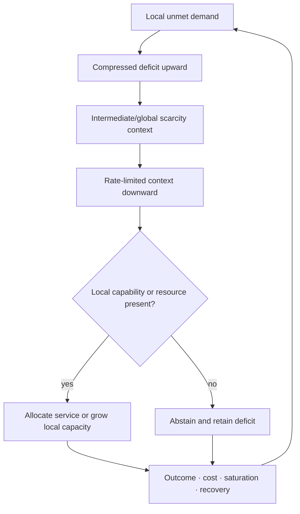

# Candidate 013: bidirectional deficit–capability routing

**Stage:** 1 — distributed-allocation falsification

**Status:** held composition; not an accepted project claim

**Primary question:** under heterogeneous moving demand and resource patches,
does compressed deficit-up/context-down signaling with a local capability gate
beat delayed centralized optimization, backpressure, primal–dual allocation,
and learned routing at equal compute, messages, state, capacity, and
reconfiguration cost?

## Biological observation

In a scoped Arabidopsis nitrogen-response loop, nitrogen-starved roots emit CEP
signals, shoot receptors induce descending CEPD signals, and high-affinity
nitrate uptake is enhanced where roots also encounter nitrate
([C-207](../../research/claims.md#c-207)). The loop combines:

1. local deficit reporting;
2. integration at another scale;
3. a compact return context; and
4. local opportunity gating before expensive uptake.

This is not a new principle by itself. Backpressure and primal–dual control can
express the same causal structure. The experiment exists to decide whether the
particular separation of signals and local gate leaves any systems advantage.

## Candidate loop

Editable source:
[deficit-capability-routing.mmd](../../assets/diagrams/deficit-capability-routing.mmd).

## State and units

For module $i$ at time $t$, define:

- $d_i(t)\ge0$: unmet demand in task units per second;
- $a_i(t)\in[0,1]$: dimensionless local capability availability;
- $u_i(t)\ge0$: allocated service in compute-seconds per second or watts;
- $B(t)$: total service budget in the same unit as $u_i$;
- $g(t)$: a rate-limited global or intermediate scarcity code in bits; and
- $\tau_{\uparrow,i}$ and $\tau_{\downarrow,i}$: upward and downward delays in
  seconds.

Allocation obeys

$$
\sum_{i=1}^{n}u_i(t)\le B(t),
\qquad
u_i(t)=0\ \text{when}\ a_i(t)=0,
$$

unless an arm explicitly pays to create or move capability. The second
constraint is the discriminating local gate: a global deficit signal cannot
activate a receiver that lacks the requested resource or permitted action.

### Typed inventory and opportunity lifetime

For each resource type $k$, retain separate available inventory $s_{ik}(t)$ in
task-native units, gross incoming/outgoing flow, transformation loss, expiry,
and delivered useful amount. A bidirectional gross flow is not net fulfillment,
and an average system gain cannot hide a harmed or indispensable participant
([C-571](../../research/claims.md#c-571),
[C-580](../../research/claims.md#c-580),
[C-584](../../research/claims.md#c-584)).

Extend the factorial suite with type compatibility, patch lifetime, transport
delay, intermediate toxicity, leakage, local storage, partner deletion, and
strategic withholding. Compare typed queues, backpressure, primal–dual shadow
prices, and the candidate after giving every arm the same type, lifetime, and
local-feasibility information. Reject the refinement if the local gate is only
an ordinary feasibility constraint or if the stronger nulls match element-
specific fulfillment, starvation, messages, dependency concentration, and
joules. This is the Candidate-013 side of the shared
[transported-field fixture](../../concept/07-cross-domain-convergence.md#transported-fields-are-not-messages).

## Task family

Use a modular service and embodied-sensing simulator where:

- demand and usable resource patches move independently;
- modules see local demand and local capability but not the full state;
- an intermediate controller receives compressed delayed deficits;
- links fail or change topology;
- capacity can be allocated reversibly or grown with an explicit migration and
  retirement cost;
- some modules can strategically over-report demand; and
- a second demand wave arrives before all capacity is replenished.

## Arms

1. static capacity allocation;
2. delayed centralized optimizer with full reported state;
3. tuned backpressure routing;
4. tuned primal–dual shadow-price allocation;
5. learned router with the same observations and state budget;
6. deficit-up/context-down/local-capability gating; and
7. an oracle-state ceiling that is ineligible to win.

## Equalization

Every arm receives the same:

- task arrivals, resource patches, and topology sequence;
- maximum active and reserve capacity;
- compute and wall-energy boundary;
- delivered-message and stored-state byte budget;
- reconfiguration, migration, and growth operations;
- observation delay and loss process;
- training events and simulator access; and
- permitted enforcement against dishonest demand.

## Factorial sweeps

Sweep:

- demand heterogeneity and burstiness;
- resource-patch lifetime and motion;
- upward and downward delay;
- topology churn and partition;
- context-code bit rate;
- local-capability false positive and false negative rates;
- reversible movement versus slow structural growth;
- strategic over-reporting and identity changes;
- reserve fraction; and
- second-event timing.

## Measurements

Report raw axes:

- fulfilled demand and cumulative unmet demand;
- tail starvation by module and task class;
- cumulative regret against the oracle ceiling;
- oscillation amplitude and recovery after a patch switch;
- messages, state bytes, compute, and wall energy;
- active and idle capacity;
- migration, growth, rollback, and retirement cost;
- capability-gate errors;
- concentration of allocation and monopolization; and
- second-event service after incomplete replenishment.

## Required ablations

- remove the upward deficit signal;
- remove the downward context;
- remove the local capability gate;
- replace receiver-specific context decoding with one shared scalar;
- make all messages instantaneous;
- forbid strategic reporting;
- keep topology fixed;
- replace structural growth with reversible capacity movement; and
- remove outcome-based demand calibration.

## Decisive predictions

The held composition predicts value only where global context is useful but a
full state map is too expensive or stale, and where local capability prevents
wasted global activation. It should lose when the centralized optimizer has
fresh state, when capability is uniform, or when backpressure already carries
the necessary deficit and feasibility information at lower cost.

## Kill criteria

Reject distinctiveness if:

- backpressure or primal–dual control ties or wins the complete frontier;
- the benefit is only extra messages, state, compute, reserve, or oracle labels;
- delay causes unstable over-allocation after a patch disappears;
- strategic modules monopolize capacity without detectable consequence;
- the local gate merely duplicates an existing feasibility constraint; or
- slow growth cannot amortize before resource patches move.

## Promotion rule

Passing the plant-derived task is insufficient. The composition must predict
its useful regime from context bandwidth, state staleness, capability
heterogeneity, and patch lifetime, then reproduce the gain in a second domain.
Otherwise it merges into backpressure, primal–dual allocation, ordinary
feasibility gating, and the existing principle bundles.

## Evidence links

- [Plant distributed-control audit](../../research/audits/2026-08-05-plant-distributed-control.md)
- [Microbial ecology and biofilms audit](../../research/audits/2026-08-05-microbial-ecology-biofilms.md)
- [Fungal networks and resource allocation audit](../../research/audits/2026-08-05-fungal-networks-resource-allocation.md)
- [C-563](../../research/claims.md#c-563)–[C-585](../../research/claims.md#c-585)
- [C-204](../../research/claims.md#c-204)–[C-217](../../research/claims.md#c-217)
- [P-001](../../research/principle-registry.md#p-001--selective-allocation)
- [P-005](../../research/principle-registry.md#p-005--use-dependent-topology)
- [P-006](../../research/principle-registry.md#p-006--homeostatic-negative-feedback)
- [P-011](../../research/principle-registry.md#p-011--transient-communication-coalitions)

## Supply-chain operations-research track

**Domain status.** Mandatory operations-research stress track. See the
[supply-chain audit](../../research/audits/2026-08-05-supply-chain-operations-research.md#exact-candidate-refinements).
Evidence: [C-627](../../research/claims.md#c-627),
[C-659](../../research/claims.md#c-659)–[C-678](../../research/claims.md#c-678).

**Typed state.** Keep forecast, request, accepted demand, backlog, lost sale,
on-hand, reserved, pipeline, inventory position, local serviceability,
qualified capacity, allocation, dispatch, and realized service separate.

**Strongest OR nulls.** Base-stock and multi-echelon inventory, Jackson and
general queueing/scheduling, max-weight/backpressure, min-cost flow and
transshipment, stochastic/robust optimization, and capacitated dynamic VRP or
receding-horizon dispatch.

**Matched-budget test.** Run paired queueing and multi-echelon/transshipment
scenarios with identical arrival, service, demand, lead-time, route, failure,
and reservation trajectories; equalize observations, messages, compute,
inventory, qualified capacity, switching, and admission authority.

**Service and recovery measurements.** Report throughput jobs/hour, mean and
$p_{95}/p_{99}$ delay, queue area job-hours, deadline service, unit/order fill,
OTIF, backlog item-hours, lost demand, transfer kilometres/items, infeasible
dispatches, source-service loss, joules/job, and recovery after failures.

**Rejection gate.** Reject if gains vanish after matching admission, capacity,
information, and switching; if movement is instantaneous; if source opportunity
cost is omitted; or if a mature queueing, flow, inventory, or dynamic-routing
null ties the tail-service frontier.
