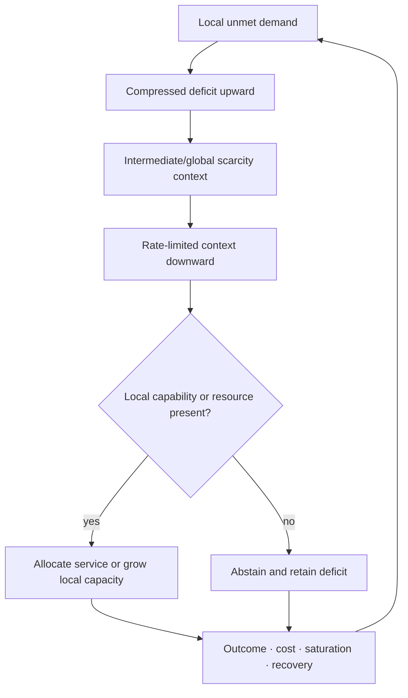

# Candidate 013: bidirectional deficit–capability routing

**Stage:** 1 — distributed-allocation falsification

**Status:** held composition; not an accepted project claim

**Primary question:** under heterogeneous moving demand and typed resource
patches, does compressed vector deficit-up/context-down signaling with a local
joint-capability gate beat delayed centralized optimization, multi-resource
backpressure, vector primal–dual allocation, and learned routing at equal
compute, messages, state, capacity, and reconfiguration cost?

## Biological observation

In a scoped Arabidopsis nitrogen-response loop, nitrogen-starved roots emit CEP
signals, shoot receptors induce descending CEPD signals, and high-affinity
nitrate uptake is enhanced where roots also encounter nitrate
([C-207](../../research/claims.md#c-207)). The loop combines:

1. local deficit reporting;
2. integration at another scale;
3. a compact return context; and
4. local opportunity gating before expensive uptake.

This is not a new principle by itself. Backpressure and primal–dual control can
express the same causal structure. The experiment exists to decide whether the
particular separation of signals and local gate leaves any systems advantage.

## Candidate loop

Editable source:
[deficit-capability-routing.mmd](../../assets/diagrams/deficit-capability-routing.mmd).

## State and units

For module $i$ at time $t$, define:

- $d_i(t)\ge0$: unmet demand in task units per second;
- $a_i(t)\in[0,1]$: dimensionless scalar capability availability for the
  single-resource special case;
- $u_i(t)\ge0$: allocated service in compute-seconds per second or watts;
- $B(t)$: total service budget in the same unit as $u_i$;
- $g(t)$: a rate-limited scalar global or intermediate scarcity code in bits;
  and
- $\tau_{\uparrow,i}$ and $\tau_{\downarrow,i}$: upward and downward delays in
  seconds.

Allocation obeys

$$
\sum_{i=1}^{n}u_i(t)\le B(t),
\qquad
u_i(t)=0\ \text{when}\ a_i(t)=0,
$$

unless an arm explicitly pays to create or move capability. The second
constraint is the discriminating local gate: a global deficit signal cannot
activate a receiver that lacks the requested resource or permitted action.

For the multi-resource case, let $k\in\{1,\ldots,K\}$ index resource types and
$j\in\{1,\ldots,J\}$ index service classes. Define:

- $a_{ik}(t)\in[0,1]$: local availability of resource type $k$;
- $U^{\mathrm{usable}}_{ik}(t)$: amount of resource $k$ deliverable before the
  applicable deadline, in its task-native unit;
- $\nu_{jk}\ge0$: resource-$k$ units required per unit of service $j$;
- $q_{ij}(t)\ge0$: executable service-$j$ units; and
- $\mathbf g(t)$: a byte-limited vector scarcity code carrying typed scarcity,
  release-time, and uncertainty context.

The local gate becomes a jointly feasible service set:

$$
\mathcal F_i(t)=
\left\{
\mathbf q_i\ge0:
\sum_j \nu_{jk}q_{ij}(t)
\le U^{\mathrm{usable}}_{ik}(t)
\quad\text{for every required }k
\right\}.
$$

The scalar gate is the $K=1$ special case. Passing $K$ independent binary gates
does not establish joint feasibility when resources expire, share transport,
or must arrive in the same service window. Partial substitution, internal
storage, transformation, and upper or toxicity bounds must be declared rather
than forced into a fixed-proportion model.

### Typed inventory and opportunity lifetime

For each resource type $k$, retain separate total, labile, reachable, reserved,
pipeline, delivered, internally stored, expired, and lost states in task-native
units. A record or total stock is not deliverable flux; a reservation of one
resource is not an executable service bundle. A bidirectional gross flow is not
net fulfillment, and an average system gain cannot hide a harmed or
indispensable participant
([C-571](../../research/claims.md#c-571),
[C-580](../../research/claims.md#c-580),
[C-584](../../research/claims.md#c-584)).

Extend the factorial suite with type compatibility, patch lifetime, transport
delay, intermediate toxicity, leakage, local storage, partner deletion, and
strategic withholding. Also vary complementarity, partial substitution,
resource co-location, transport mechanism, release kinetics, and service
windows. Compare typed queues, multi-resource backpressure, vector primal–dual
shadow prices, and the candidate after giving every arm the same type,
lifetime, form, and local-feasibility information. Reject the refinement if the
local gate is only an ordinary feasibility constraint or if the stronger nulls
match bundle-specific fulfillment, starvation, stranded allocation, losses,
messages, dependency concentration, and joules. This is the Candidate-013 side
of the shared
[transported-field fixture](../../concept/07-cross-domain-convergence.md#transported-fields-are-not-messages).

## Task family

Use a modular service and embodied-sensing simulator where:

- demand and usable resource patches move independently;
- service classes require declared bundles of one or more resource types;
- modules see local demand and local capability but not the full state;
- an intermediate controller receives compressed delayed deficits;
- links fail or change topology;
- capacity can be allocated reversibly or grown with an explicit migration and
  retirement cost;
- some modules can strategically over-report demand; and
- a second demand wave arrives before all capacity is replenished.

## Arms

1. static capacity allocation;
2. delayed centralized optimizer with full reported state;
3. tuned single- and multi-resource backpressure routing;
4. tuned vector primal–dual shadow-price allocation;
5. a declared bottleneck or dominant-resource allocator;
6. learned router with the same observations and state budget;
7. scalar deficit-up/context-down/local-capability gating;
8. vector deficit-up/context-down/joint-capability gating; and
9. an oracle-state ceiling that is ineligible to win.

## Equalization

Every arm receives the same:

- task arrivals, resource patches, and topology sequence;
- resource forms, transport/release process, compatibility, and service windows;
- maximum active and reserve capacity;
- compute and wall-energy boundary;
- delivered-message and stored-state byte budget;
- reconfiguration, migration, and growth operations;
- observation delay and loss process;
- training events and simulator access; and
- permitted enforcement against dishonest demand.

## Factorial sweeps

Sweep:

- demand heterogeneity and burstiness;
- number of required resource types and bundle stoichiometry;
- strict complementarity versus declared partial substitution;
- co-located, independent, and anticorrelated resource patches;
- total stock versus labile, reachable, and deliverable resource state;
- transport, release, transformation, storage, expiry, and toxicity regimes;
- synchronized versus mistimed resource pulses and service windows;
- resource-patch lifetime and motion;
- upward and downward delay;
- topology churn and partition;
- context-code bit rate;
- local-capability false positive and false negative rates;
- reversible movement versus slow structural growth;
- strategic over-reporting and identity changes;
- reserve fraction; and
- second-event timing.

## Measurements

Report raw axes:

- fulfilled demand and cumulative unmet demand;
- jointly executable and completed service bundles;
- resource-specific delivery and uptake;
- stranded reservations, expired or mistimed resources, and transformation or
  transport loss;
- bottleneck identity and switching frequency;
- tail starvation by module and task class;
- cumulative regret against the oracle ceiling;
- oscillation amplitude and recovery after a patch switch;
- messages, state bytes, compute, and wall energy;
- active and idle capacity;
- migration, growth, rollback, and retirement cost;
- capability-gate errors;
- concentration of allocation and monopolization; and
- residual resource state and second-event service after incomplete
  replenishment.

## Confirmatory analysis and statistical plan

The confirmatory unit is an independently generated demand/resource episode
containing the complete arrival stream, patch motion and lifetime, topology,
messages, allocations, reconfiguration, replenishment, and second event. Pair
arms on the same episode seed and initial inventory. Repeated episodes sharing a
topology, demand family, patch generator, strategic identity, or simulator world
are clustered. Hold out whole demand families, resource-motion laws, patch-
lifetime bands, topology/partition regimes, strategic behaviors, second-event
timings, and the required second application domain; random requests from one
episode do not cross development and confirmation splits.

Preregister paired contrasts against tuned backpressure, tuned primal--dual
allocation, the delayed centralized optimizer, and the learned router. Report
paired effects and simultaneous intervals for fulfilled and cumulative unmet
demand, completed service bundles, stranded resource, transport/transformation
loss, worst-stratum starvation, oracle regret, oscillation/recovery, second-
event service, messages/state bytes, wall energy, active/idle capacity,
migration/growth/retirement cost, gate errors, and monopolization. Analyze time
series with episode-level or block-resampled uncertainty that preserves bursts
and topology dependence. Report module/task-stratified effects and tail
intervals; the oracle supplies regret only and is ineligible to win.

Freeze a gatekeeping order: no hard capacity, stability, starvation, or
strategic-monopolization failure; noninferior fulfilled demand and tail service
under task-specific margins; improved unmet demand, recovery, or second-event
service; then lower communication, state, capacity, or energy cost. Control
family-wise error over eligible comparator contrasts, primary service/cost
outcomes, factorial regimes, and the two confirmation domains with a
preregistered hierarchical procedure. Publish the complete effect/interval
matrix and adjusted decisions rather than a single routing score.

Unserved or expired requests remain unmet demand, not missing data. Jobs still
open at the horizon, patch lifetimes extending beyond observation, incomplete
growth/retirement, and unresolved second events are right-censored only for
their time-to-event analyses and retain their service/cost consequences.
Message loss, partitions, unknown topology, and unavailable local capability
are assigned experimental conditions. Instrument or log loss is a typed
missingness state with preregistered sensitivity analysis; all assigned episodes
remain in denominators.

Deficit encoding, context rate, receiver decoder, capability gate, demand-
calibration rule, strategic enforcement, reserve target, movement/growth
threshold, rollback, and retirement policy are tuned on development/validation
episodes and frozen before confirmation. Apply the frozen policy without
retuning to every held-out regime and to the second domain, including support-
qualified fallback. Promotion uses that frozen cross-domain decision, not the
best post-hoc sweep cell.

## Required ablations

- remove the upward deficit signal;
- remove the downward context;
- remove the local capability gate;
- replace the joint feasible set with independent per-resource gates;
- collapse resource form, deliverable flux, and total stock into one number;
- remove service windows while preserving season or episode totals;
- treat every resource as freely substitutable;
- replace receiver-specific context decoding with one shared scalar;
- make all messages instantaneous;
- forbid strategic reporting;
- keep topology fixed;
- replace structural growth with reversible capacity movement; and
- remove outcome-based demand calibration.

## Decisive predictions

The held composition predicts value only where global context is useful but a
full state map is too expensive or stale, and where local capability prevents
wasted global activation or stranded complementary resources. It should lose
when the centralized optimizer has fresh state, when capability is uniform,
when resources are genuinely substitutable, or when multi-resource
backpressure or vector shadow prices already carry the necessary deficit and
feasibility information at lower cost.

## Kill criteria

Reject distinctiveness if:

- multi-resource backpressure, vector primal–dual control, or receding-horizon
  optimization ties or wins the complete frontier;
- the benefit is only extra messages, state, compute, reserve, or oracle labels;
- total stock, measured concentration, structural growth, allocation, or uptake
  is counted as realized service;
- the candidate strands or expires one resource while claiming service from
  another;
- gains disappear when transport kinetics and service windows are represented;
- delay causes unstable over-allocation after a patch disappears;
- strategic modules monopolize capacity without detectable consequence;
- the local gate merely duplicates an existing feasibility constraint; or
- slow growth cannot amortize before resource patches move.

## Promotion rule

Passing the plant-derived task is insufficient. The composition must predict
its useful regime from context bandwidth, state staleness, capability
heterogeneity, and patch lifetime, then reproduce the gain in a second domain.
Otherwise it merges into backpressure, primal–dual allocation, ordinary
feasibility gating, and the existing principle bundles.

## Soil/crop multi-resource stress track

**Domain status.** Mandatory global-coverage stress track; it does not add a
principle. See the
[soil/crop audit](../../research/audits/2026-08-21-soil-crop-multiresource-colimitation.md)
and the
[material/service mathematics](../../math/material-service-state.md).

**State firewall.** Keep total stock, labile or exchangeable pool, solution
concentration, transportable flux, receiver uptake, internal storage,
physiological conversion, harvested outcome, loss, and residual state
separate. For the cross-domain simulator these become total, released,
reachable, delivered, accepted, internally buffered, executed, realized,
lost, and residual resource states.

**Limitation labels.** Use factorial and, where necessary, sequential
interventions to distinguish no limitation, one-resource limitation,
independent co-limitation, simultaneous co-limitation, serial limitation,
super- or sub-additivity, and aggregation across differently limited modules.
A positive interaction contrast is not by itself a mechanism label.

**Strongest domain nulls.** Factorial response surfaces, dynamic marginal-
return allocation, mechanistic transport-plus-uptake models, balanced-nutrient
models, calibrated crop-system simulators, multi-resource backpressure, vector
primal–dual control, and stochastic or receding-horizon optimization.

### Workstation contract

#### WS-SCL-01 — limitation-form falsifier

Generate paired noisy factorial episodes for no limitation, single-resource
limitation, independent and simultaneous co-limitation, serial limitation in
both orders, super- and sub-additivity, and mixtures where different modules
are singly limited by different resources. Compare a scalar bottleneck label,
an ordinary factorial response model, the typed state contract, and the
candidate inference layer. Report the category confusion matrix, calibrated
category probability, interaction-effect error, and false simultaneous-
co-limitation rate. Reject any refinement that cannot distinguish serial from
simultaneous cases or receives labels unavailable to its nulls.

#### WS-SCL-02 — complementary-resource routing

Tasks require two to five typed resources with declared stoichiometry. Vary
spatial correlation, release time, decay, transport latency, partial
substitution, conversion loss, and service window. Sweep the dimensionless
opportunity ratio

$$
\frac{T_{\mathrm{patch}}}
{\tau_{\uparrow}+\tau_{\downarrow}+\tau_{\mathrm{act}}}
\in\{0.25,0.5,1,2,4\}.
$$

Run every eligible arm in the main arm list on paired episodes. Report
completed bundle service, unmet demand, tail starvation, stranded commitment,
expiry/loss, messages, stored state, compute, wall energy, switching, and
monopolization. Reject vector gating if an ordinary vector controller matches
its complete frontier.

#### WS-SCL-03 — same stock, different deliverability

Construct paired soil-like episodes with identical total resource inventory
but different moisture, density, binding/buffer capacity, receiver density, and
uptake kinetics. Compare a total-stock gate, a solution-concentration gate, a
mechanistic supply/uptake model, and the typed contract. Report deliverable-flux
error, phantom-capability decisions, realized service, unused stock, and
lifecycle cost. Merge the contract into the ordinary mechanistic null if it
does not reduce false service claims.

#### WS-SCL-04 — timing and irreversible windows

Give all arms identical episode-total resource quantities but vary delivery
across early, commitment-critical, and completion windows. Include late
abundance after a missed window and storable versus non-storable resources.
Report window-qualified service, missed-window loss, stranded input, residual
pool, and second-event service. A policy fails if episode-total utilization
improves while realized service declines.

#### WS-SCL-05 — structural proliferation versus capture

Allow slow capability growth toward mobile and immobile patches, reversible
resource movement, or no growth. Charge construction, maintenance, retirement,
and delayed availability. Run a morphology-only scoring ablation. Structural
growth earns no benefit unless greater delivered flux and endpoint service
amortize its lifecycle cost before the patch disappears.

#### WS-SCL-06 — external response confirmation

Use the public 71-site, 4–14-year standardized grassland factorial dataset and
analysis code at
[Dryad](https://doi.org/10.5061/dryad.vdncjsz50). Freeze limitation-category
logic before inspecting confirmation sites; hold out complete sites, years,
precipitation bands, and continents. Reconstruct treatment effects and
interaction contrasts, then compare scalar and typed representations on
held-out limitation form and effect calibration. The released aggregate data
validate response typing only; they cannot validate root transport or routing.

#### WS-SCL-07 — non-agricultural transfer

Repeat WS-SCL-02 with service tasks requiring compute, memory, accelerator
time, network bandwidth, and an energy/thermal envelope. Preserve the
complementarity and timing regimes while removing crop semantics. Promotion
requires the useful regime to be predicted from state staleness, bundle
complementarity, action latency, and resource lifetime in both domains.

**Execution order.** Implement WS-SCL-01 and WS-SCL-02 first as deterministic
synthetic fixtures, then the transport, timing, and structural tracks. Lock the
external dataset by DOI and SHA-256 before WS-SCL-06. Apply the existing paired-
seed, held-out-family, multiplicity, energy, checkpoint, and hash-chain
requirements to every workstation-ready manifest.

## Evidence links

- [Plant distributed-control audit](../../research/audits/2026-08-05-plant-distributed-control.md)
- [Microbial ecology and biofilms audit](../../research/audits/2026-08-05-microbial-ecology-biofilms.md)
- [Fungal networks and resource allocation audit](../../research/audits/2026-08-05-fungal-networks-resource-allocation.md)
- [Soil/crop multi-resource co-limitation audit](../../research/audits/2026-08-21-soil-crop-multiresource-colimitation.md)
- [C-563](../../research/claims.md#c-563)–[C-585](../../research/claims.md#c-585)
- [C-204](../../research/claims.md#c-204)–[C-217](../../research/claims.md#c-217)
- [P-001](../../research/principle-registry.md#p-001--selective-allocation)
- [P-005](../../research/principle-registry.md#p-005--use-dependent-topology)
- [P-006](../../research/principle-registry.md#p-006--homeostatic-negative-feedback)
- [P-011](../../research/principle-registry.md#p-011--transient-communication-coalitions)

## Supply-chain operations-research track

**Domain status.** Mandatory operations-research stress track. See the
[supply-chain audit](../../research/audits/2026-08-05-supply-chain-operations-research.md#exact-candidate-refinements).
Evidence: [C-627](../../research/claims.md#c-627),
[C-659](../../research/claims.md#c-659)–[C-678](../../research/claims.md#c-678).

**Typed state.** Keep forecast, request, accepted demand, backlog, lost sale,
on-hand, reserved, pipeline, inventory position, local serviceability,
qualified capacity, allocation, dispatch, and realized service separate.

**Strongest OR nulls.** Base-stock and multi-echelon inventory, Jackson and
general queueing/scheduling, max-weight/backpressure, min-cost flow and
transshipment, stochastic/robust optimization, and capacitated dynamic VRP or
receding-horizon dispatch.

**Matched-budget test.** Run paired queueing and multi-echelon/transshipment
scenarios with identical arrival, service, demand, lead-time, route, failure,
and reservation trajectories; equalize observations, messages, compute,
inventory, qualified capacity, switching, and admission authority.

**Service and recovery measurements.** Report throughput jobs/hour, mean and
$p_{95}/p_{99}$ delay, queue area job-hours, deadline service, unit/order fill,
OTIF, backlog item-hours, lost demand, transfer kilometres/items, infeasible
dispatches, source-service loss, joules/job, and recovery after failures.

**Rejection gate.** Reject if gains vanish after matching admission, capacity,
information, and switching; if movement is instantaneous; if source opportunity
cost is omitted; or if a mature queueing, flow, inventory, or dynamic-routing
null ties the tail-service frontier.
