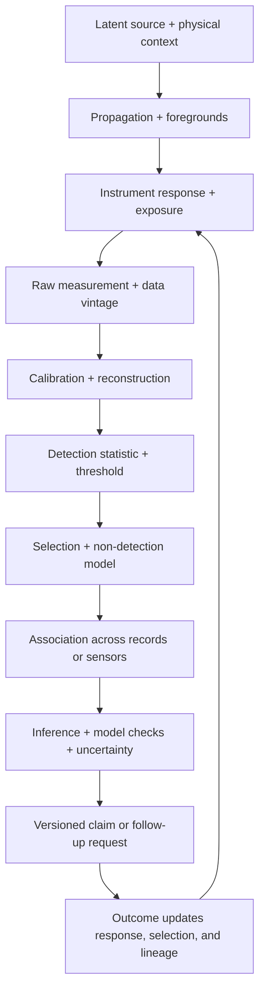

# Candidate 014: versioned observation contracts

**Stage:** 1 — synthetic inverse-problem and selection falsification

**Status:** held systems composition; not an accepted project claim

**Primary question:** does carrying response, exposure, detection, selection,
association, uncertainty, and data-vintage dependencies with every inferred
claim reduce false certainty, association errors, and wasted follow-up beyond a
typed evidence schema plus standard calibrated likelihood, lineage, predictive
checks, simulation calibration, and value-of-information scheduling?

## Why this experiment exists

Remote science never observes a latent source directly. Propagation,
foregrounds, instrument response, exposure, thresholds, selection, and record
association intervene before inference. Astronomy makes this chain unusually
visible, but each component already has mature statistical and engineering
methods.

The held residual is therefore not “astronomical reasoning.” It is a versioned
contract that prevents downstream modules from silently dropping the
observation and selection conditions that make a claim valid.

## Observation chain

Editable source:
[versioned-observation-contract.mmd](../../assets/diagrams/versioned-observation-contract.mmd).

## Mathematical boundary

Let latent target parameters be $\theta$, nuisance state be $\eta$, raw
measurement be $y$, and observation response be $H_v$ at version $v$:

$$
y = H_v(\theta,\eta)+\epsilon,
$$

where units of $y$ and $H_v$ match and $\epsilon$ follows a declared noise and
background model. For analyzed samples selected by event $S=1$,

$$
p(\theta,\eta\mid y,S=1,v)
\propto
p(y,S=1\mid\theta,\eta,v)p(\theta,\eta\mid v).
$$

The selection term cannot be replaced by a constant unless detection and
inclusion probability are actually constant over the declared region.

For records $r_1$ and $r_2$, a fusion step must preserve an association
hypothesis $A$ and dependence state $D$:

$$
p(\theta\mid r_1,r_2)
=\sum_A\int p(\theta,A,D\mid r_1,r_2)\,dD.
$$

Different sensors do not imply conditional independence. Shared clocks,
calibration, simulators, catalogs, preprocessing, priors, or trained models can
create common-mode evidence.

For observation $k$, retain a support certificate

$$
\mathcal S_k=(\Omega_k,[t_k^-,t_k^+],\ell_k,\delta_k,M_k,P_k,I_k),
$$

where $\Omega_k$ is spatial support in metres, square metres, cubic metres, or
an explicit graph subset; $[t_k^-,t_k^+]$ is its integration interval in
seconds; $\ell_k$ is reporting latency in seconds; $\delta_k$ is resolution in
declared units; $M_k$ is the observation and preprocessing version; $P_k$ is
preservation or censoring state; and $I_k$ records interventions that may have
changed both system and observation. Fusion across unlike certificates requires
a declared transformation and overlap calculation.

## Contract fields

Every derived claim or alert carries:

- raw artifact identifiers and immutable data vintage;
- sensor, response, calibration, coordinate, and clock versions;
- exposure and missingness window;
- detection statistic, searched family, threshold, and multiplicity policy;
- selection and non-detection model with validity region;
- association candidates, probabilities, and common dependencies;
- likelihood or estimator version plus priors and nuisance treatment;
- reconstruction and regularization choices;
- uncertainty class: measurement, calibration, selection, model,
  association, computation, or finite realization;
- predictive, injection/recovery, and simulation-calibration results;
- supersession and retraction relations; and
- permitted follow-up action and expiry;
- qualified population membership and risk-set denominator;
- entry cohort, lifecycle age/stage, calendar period, role, and location;
- replication/descendant, retirement, and migration events;
- record production, survival, discovery, retention, and coding dependencies;
- projection transition matrix, scenario range, and stationarity assumptions;
- frozen forecast, coding, hyperparameter, holdout, and data-vintage boundary.

## Task family

Build a synthetic multi-sensor world with a known latent population and:

- response blur, distortion, drift, and calibration changes;
- heteroscedastic background and missing exposures;
- thresholds whose efficiency varies with source and context;
- non-detections with known detection power;
- duplicate and ambiguous records across sensors;
- shared calibration and preprocessing common modes;
- large rare-event searches over time, location, and templates;
- alerts revised after delayed observations;
- adaptive follow-up that changes the future sample; and
- mixed per-event, rolling-window, delayed-label, and retained-log supports;
- exact degeneracies and finite-realization uncertainty that more exposure
  cannot remove.

## Arms

1. end-to-end learned inverse with confidence;
2. typed records plus provenance only;
3. calibrated likelihood and explicit selection function;
4. graded assurance envelope plus surveillance observation schema;
5. complete conventional stack with lineage, injection/recovery, predictive
   checks, simulation calibration, multiplicity correction, and
   value-of-information scheduling;
6. proposed versioned observation contract; and
7. oracle latent-state ceiling, reported but ineligible to win.

## Equalization

Hold constant:

- sensor streams, exposures, missingness, and follow-up opportunities;
- model classes, training events, and simulator access;
- compute, bytes moved, retained bytes, wall time, and wall energy;
- false-alert and reviewer budgets;
- maximum follow-up actions and actuation authority;
- calibration artifacts and update opportunities; and
- information available at each decision time.

## Experimental tracks

1. learned inverse versus correct and misspecified forward models;
2. population inference with selection on noisy measurements;
3. cross-sensor association under ambiguity and common modes;
4. rare-event search with changing template and time-space families;
5. versioned alerts, revisions, supersession, and subscriber lag;
6. mechanistic model comparison with omitted alternatives; and
7. adaptive follow-up under policy-induced selection and confirmation bias.
8. support-qualified fusion across local probes, rolling aggregates, delayed
   expert labels, and post-intervention telemetry.
9. cohort-component monitoring under entry shocks, lifecycle aging, migration,
   nonstationary transitions, selected record survival, and prospective
   temporal/place/lineage holdouts.

## Measurements

- interval and posterior coverage by source and context stratum;
- calibration, bias, and reconstruction artifacts;
- population-parameter error under selection;
- false associations, missed associations, and common-mode overcounting;
- family-wise or false-discovery error over the complete search;
- alert precision, recall, latency, revision rate, and downstream wasted work;
- non-detection interpretation errors;
- stale-contract and superseded-claim use;
- follow-up value, diversity, and self-confirmation rate;
- compute, storage, reviewer time, messages, and joules; and
- abstention on structurally non-identifiable directions.

## Required ablations

- drop the response version;
- drop the selection function;
- treat non-detection as zero;
- multiply sensor likelihoods as independent;
- omit the searched-family multiplicity record;
- collapse all uncertainty into one score;
- drop data vintage and supersession;
- let adaptive follow-up train and evaluate on its own selected sample; and
- drop support intervals, preservation state, or intervention history; and
- omit negative injection/recovery and predictive-check results.

## Kill criteria

Reject the composition if:

- the complete conventional stack matches every error and cost frontier;
- gains come only from extra metadata bytes, compute, simulations, or labels;
- the contract is carried but ignored at decision time;
- a version mismatch does not trigger abstention or invalidation;
- follow-up policy increases confirmation bias or misses novel classes;
- uncertainty remains overconfident under response misspecification; or
- association and selection dependencies cannot be propagated without making
  the system less accurate or operationally unusable.
- a standard hierarchical state-space model, event-time schema, or the simple
  rule “never aggregate unlike windows” matches support-qualified fusion.

## Promotion rule

This candidate is expected to merge into graded assurance, surveillance, and
standard statistical practice unless the dependency-bearing contract produces
a reproducible advantage across at least two observation modalities and one
adaptive-follow-up setting at equal lifecycle cost.

## Evidence links

- [Astronomy remote-inference audit](../../research/audits/2026-08-05-astronomy-remote-inference.md)
- [Geology and geomorphology audit](../../research/audits/2026-08-05-geology-geomorphology.md)
- [C-218](../../research/claims.md#c-218)–[C-231](../../research/claims.md#c-231)
- [C-232](../../research/claims.md#c-232)–[C-249](../../research/claims.md#c-249)
- [Quantitative history and demography audit](../../research/audits/2026-08-05-quantitative-history-demography.md)
- [C-417](../../research/claims.md#c-417)–[C-444](../../research/claims.md#c-444)
- [P-001](../../research/principle-registry.md#p-001--selective-allocation)
- [P-003](../../research/principle-registry.md#p-003--temporary-trace-before-commitment)
- [P-007](../../research/principle-registry.md#p-007--prediction-error-allocation)
- [P-008](../../research/principle-registry.md#p-008--compartmentalized-interaction)
- [P-009](../../research/principle-registry.md#p-009--maintenance-plane)
- [P-013](../../research/principle-registry.md#p-013--externalized-shared-state)
