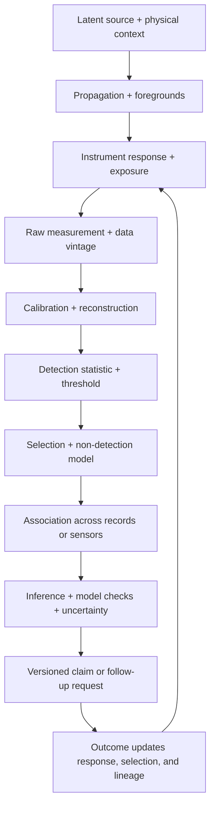
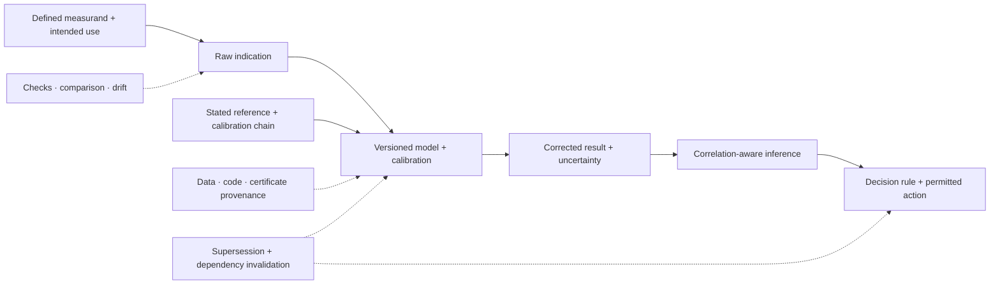

# Candidate 014: versioned observation contracts

**Stage:** 1 — synthetic inverse-problem and selection falsification

**Status:** held systems composition; not an accepted project claim

**Primary question:** does carrying response, exposure, detection, selection,
association, uncertainty, and data-vintage dependencies with every inferred
claim reduce false certainty, association errors, and wasted follow-up beyond a
typed evidence schema plus standard calibrated likelihood, lineage, predictive
checks, simulation calibration, and value-of-information scheduling?

## Why this experiment exists

Remote science never observes a latent source directly. Propagation,
foregrounds, instrument response, exposure, thresholds, selection, and record
association intervene before inference. Astronomy makes this chain unusually
visible, but each component already has mature statistical and engineering
methods.

The held residual is therefore not “astronomical reasoning.” It is a versioned
contract that prevents downstream modules from silently dropping the
observation and selection conditions that make a claim valid.

## Observation chain

Editable source:
[versioned-observation-contract.mmd](../../assets/diagrams/versioned-observation-contract.mmd).

## Mathematical boundary

Let latent target parameters be $\theta$, nuisance state be $\eta$, raw
measurement be $y$, and observation response be $H_v$ at version $v$:

$$
y = H_v(\theta,\eta)+\epsilon,
$$

where units of $y$ and $H_v$ match and $\epsilon$ follows a declared noise and
background model. For analyzed samples selected by event $S=1$,

$$
p(\theta,\eta\mid y,S=1,v)
\propto
p(y,S=1\mid\theta,\eta,v)p(\theta,\eta\mid v).
$$

The selection term cannot be replaced by a constant unless detection and
inclusion probability are actually constant over the declared region.

For records $r_1$ and $r_2$, a fusion step must preserve an association
hypothesis $A$ and dependence state $D$:

$$
p(\theta\mid r_1,r_2)
=\sum_A\int p(\theta,A,D\mid r_1,r_2)\,dD.
$$

Different sensors do not imply conditional independence. Shared clocks,
calibration, simulators, catalogs, preprocessing, priors, or trained models can
create common-mode evidence.

For observation $k$, retain a support certificate

$$
\mathcal S_k=(\Omega_k,[t_k^-,t_k^+],\ell_k,\delta_k,M_k,P_k,I_k),
$$

where $\Omega_k$ is spatial support in metres, square metres, cubic metres, or
an explicit graph subset; $[t_k^-,t_k^+]$ is its integration interval in
seconds; $\ell_k$ is reporting latency in seconds; $\delta_k$ is resolution in
declared units; $M_k$ is the observation and preprocessing version; $P_k$ is
preservation or censoring state; and $I_k$ records interventions that may have
changed both system and observation. Fusion across unlike certificates requires
a declared transformation and overlap calculation.

## Contract fields

Every derived claim or alert carries:

- exact measurand or construct, object/population, state, interval, location,
  conditions, intended use, target uncertainty, and permitted action;
- quantity kind, unit or reference scale, sign convention, aggregation, and
  raw indication or sample identity;
- measurement procedure/model, instrument configuration, environment,
  firmware, clock, preprocessing, software build, and numerical precision;
- calibration relation, stated reference, certificate, date, scope,
  corrections, uncertainty contribution, and drift/check status;
- complete uncertainty budget, covariance assumptions, coverage method,
  repeatability/reproducibility conditions, and unresolved effects;
- decision rule, tolerance/specification version, guard band, and owner of
  false-accept and false-reject costs;
- raw artifact identifiers and immutable data vintage;
- sensor, response, calibration, coordinate, and clock versions;
- exposure and missingness window;
- detection statistic, searched family, threshold, and multiplicity policy;
- selection and non-detection model with validity region;
- association candidates, probabilities, and common dependencies;
- likelihood or estimator version plus priors and nuisance treatment;
- reconstruction and regularization choices;
- uncertainty class: measurement, calibration, selection, model,
  association, computation, or finite realization;
- predictive, injection/recovery, and simulation-calibration results;
- supersession and retraction relations; and
- permitted follow-up action and expiry;
- qualified population membership and risk-set denominator;
- entry cohort, lifecycle age/stage, calendar period, role, and location;
- replication/descendant, retirement, and migration events;
- record production, survival, discovery, retention, and coding dependencies;
- projection transition matrix, scenario range, and stationarity assumptions;
- frozen forecast, coding, hyperparameter, holdout, and data-vintage boundary;
- cumulative load/use and intervention history for path-dependent assets;
- damage/dependency posterior, detection limits, current/post-contingency
  capacity, and post-action reserve verification;
- receiver competence state and version, eligibility-window support, prior
  exposures, commitment state, permitted next states, reopening trigger, and
  structural postcondition;
- body/tool, attachment, payload, contact, sensor/actuator, task-Jacobian,
  impedance/passivity, delay, safety-envelope, and controller/estimator binding
  versions;
- commanded intervention amount, schedule, route, delivery, adherence, and
  realized internal-exposure estimate with units, support, and uncertainty;
- engagement/activation, proximal response, benefit, and each protected-harm
  endpoint as separate measurements with delays and validity regions;
- adaptation, tolerance/sensitization, dependence, withdrawal, taper, rescue,
  rebound, recurrence, and post-removal surveillance state; and
- population/subgroup, co-intervention, context, interaction reference model,
  response scale, schedule, and benchmark-response decision model.

## Metrological completeness and invalidation

The contract must distinguish a raw indication from a measurement result,
metrological traceability from artifact lineage, calibration from validation,
and uncertainty from error ([C-519](../../research/claims.md#c-519)–[C-524](../../research/claims.md#c-524)).
It must also preserve shared covariance rather than multiplying correlated
sensor evidence as if it were independent ([C-525](../../research/claims.md#c-525),
[C-533](../../research/claims.md#c-533)).

Editable source:
[metrological-observation-contract.mmd](../../assets/diagrams/metrological-observation-contract.mmd).

Let the dependency graph $G=(V,E)$ contain raw-data, calibration, software,
model, transformation, result, and decision versions. If $(a,b)\in E$, node
$b$ depends on node $a$. A changed or failed dependency $a$ defines the
invalidation cone

$$
\mathcal I(a)=\{v\in V:a\leadsto v\}.
$$

Every $v\in\mathcal I(a)$ must be re-evaluated, restricted, superseded, or
withdrawn before its action remains eligible. Provenance identifies the cone;
it does not prove that a value inside it is true or fit for use
([C-534](../../research/claims.md#c-534)). The held residual is whether this
cross-layer invalidation prevents more stale decisions than a complete
metrology, statistics, and content-addressed provenance stack at the same
sensor, compute, storage, review, and latency budget
([C-535](../../research/claims.md#c-535)).

## Task family

Build a synthetic multi-sensor world with a known latent population and:

- response blur, distortion, drift, and calibration changes;
- heteroscedastic background and missing exposures;
- thresholds whose efficiency varies with source and context;
- non-detections with known detection power;
- duplicate and ambiguous records across sensors;
- shared calibration and preprocessing common modes;
- large rare-event searches over time, location, and templates;
- alerts revised after delayed observations;
- adaptive follow-up that changes the future sample; and
- mixed per-event, rolling-window, delayed-label, and retained-log supports;
- exact degeneracies and finite-realization uncertainty that more exposure
  cannot remove.

## Arms

1. end-to-end learned inverse with confidence;
2. typed records plus provenance only;
3. calibrated likelihood and explicit selection function;
4. graded assurance envelope plus surveillance observation schema;
5. complete conventional stack with lineage, injection/recovery, predictive
   checks, simulation calibration, multiplicity correction, and
   value-of-information scheduling;
6. proposed versioned observation contract; and
7. oracle latent-state ceiling, reported but ineligible to win.

## Equalization

Hold constant:

- sensor streams, exposures, missingness, and follow-up opportunities;
- model classes, training events, and simulator access;
- compute, bytes moved, retained bytes, wall time, and wall energy;
- false-alert and reviewer budgets;
- maximum follow-up actions and actuation authority;
- calibration artifacts and update opportunities; and
- information available at each decision time.

## Experimental tracks

1. learned inverse versus correct and misspecified forward models;
2. population inference with selection on noisy measurements;
3. cross-sensor association under ambiguity and common modes;
4. rare-event search with changing template and time-space families;
5. versioned alerts, revisions, supersession, and subscriber lag;
6. mechanistic model comparison with omitted alternatives; and
7. adaptive follow-up under policy-induced selection and confirmation bias.
8. support-qualified fusion across local probes, rolling aggregates, delayed
   expert labels, and post-intervention telemetry.
9. cohort-component monitoring under entry shocks, lifecycle aging, migration,
   nonstationary transitions, selected record survival, and prospective
   temporal/place/lineage holdouts.
10. calibration-chain, covariance, drift, decision-rule, and downstream-
    invalidation changes under a fixed measurement and review budget.
11. identical signals delivered to receivers with different histories,
    competence windows, commitments, and observation support.
12. counterfactual body, tool, attachment, payload, sensor, delay, contact, and
    impedance swaps with selective dependency invalidation.
13. adaptive intervention under exposure lag, heterogeneous response, selected
    observation, tolerance/sensitization, abrupt versus tapered removal,
    rebound, and delayed multi-endpoint harm.

## Measurements

- interval and posterior coverage by source and context stratum;
- calibration, bias, and reconstruction artifacts;
- population-parameter error under selection;
- false associations, missed associations, and common-mode overcounting;
- family-wise or false-discovery error over the complete search;
- alert precision, recall, latency, revision rate, and downstream wasted work;
- non-detection interpretation errors;
- stale-contract and superseded-claim use;
- follow-up value, diversity, and self-confirmation rate;
- compute, storage, reviewer time, messages, and joules;
- abstention on structurally non-identifiable directions; and
- commanded-versus-realized intervention error, engagement calibration,
  benefit/harm coverage, subgroup tail risk, adaptation-state error,
  withdrawal/rebound events, and post-removal native capability and reserve.

## Confirmatory analysis and statistical plan

The confirmatory unit is an independently generated latent-world replicate with
its complete exposures, sensor records, non-detections, associations, searched
family, alerts/revisions, follow-up actions, delayed outcomes, intervention
history, and downstream uses. Pair arms on the same latent world, sensor and
calibration realization, missingness process, search opportunities, reviewer
budget, and follow-up choices available at each decision time. Cluster records
that share a source, sensor, calibration chain, preprocessing lineage, cohort,
receiver, site, or adaptive policy. Hold out complete response/calibration
lineages, sensors, source/context strata, spatial and future-time blocks, latent
classes, search families, cohorts, receivers, counterfactual dependencies, and
intervention/removal regimes; random records from one lineage cannot cross
splits.

Preregister paired contrasts against the calibrated likelihood/selection arm
and the complete conventional stack. Estimate paired effects with simultaneous
intervals for stratum coverage, calibration and bias, population-parameter
error, false/missed association, complete-family error, alert precision/recall
and wasted work, stale-contract use, invalidation recall, self-confirmation,
abstention, benefit/harm coverage, subgroup tail risk, and compute/storage/
reviewer/joule cost. Hierarchical or cluster-resampled uncertainty must retain
shared calibration, covariance, selection, and adaptive-follow-up dependence.
Propagate Monte Carlo, calibration, measurement, and model-form uncertainty
separately where identifiable.

Use a frozen gatekeeping order: required coverage and family-wise or false-
discovery control must pass in every hard-gated stratum; stale/superseded use and
unsafe intervention outcomes must be noninferior at task-specific margins; then
test improved inference, invalidation, or follow-up value; resource reductions
are tested last. Preregister the eligible primary outcomes and control
multiplicity across comparator contrasts, thirteen tracks, strata, searched
families, and endpoint groups with a hierarchical closed or family-wise
procedure. Report raw effect sizes and intervals, adjusted decisions, and the
complete searched family; do not select the uncertainty score after release.

Missing exposure, non-detection, ambiguous association, delayed label,
unobserved follow-up, record supersession, and post-intervention loss to
follow-up are different states. A non-detection is never imputed as zero, and an
unseen outcome is never counted as a negative event. Event times and outcomes
unresolved at the horizon are right-censored with their selection history
retained. Any inverse-probability, selection, or imputation model and its
best/worst-case sensitivity are preregistered; every assigned latent world and
follow-up opportunity remains in the appropriate denominator.

Response and selection models, calibration/covariance versions, association
rules, searched families, alert thresholds, support/abstention gates,
supersession and dependency invalidation, receiver-competence handling,
follow-up policy, and intervention/removal decision rule are fitted only on
development/validation worlds and frozen before confirmation. Apply the frozen
contract and decision mechanically to all held-out records, receivers, and
future-time blocks, including required abstention when support is absent. The
oracle latent state is a ceiling and cannot determine promotion.

## Required ablations

- drop the response version;
- drop the selection function;
- treat non-detection as zero;
- multiply sensor likelihoods as independent;
- omit the searched-family multiplicity record;
- collapse all uncertainty into one score;
- drop data vintage and supersession;
- let adaptive follow-up train and evaluate on its own selected sample;
- drop support intervals, preservation state, or intervention history;
- omit negative injection/recovery and predictive-check results;
- replace the measurand with a bare metric name;
- treat calibration, verification, and validation as one boolean;
- delete shared covariance while retaining marginal uncertainties;
- record provenance without dependency-triggered re-evaluation; and
- drop receiver history, competence version, or window support while retaining
  the external signal;
- retain observation metadata while deleting plant/controller dependencies;
- replace the intervention chain with commanded amount or cumulative amount;
- merge engagement, benefit, and harm into one score; and
- delete adaptation/withdrawal and removal-rate fields while retaining ordinary
  outcome monitoring.

## Kill criteria

Reject the composition if:

- the complete conventional stack matches every error and cost frontier;
- gains come only from extra metadata bytes, compute, simulations, or labels;
- the contract is carried but ignored at decision time;
- a version mismatch does not trigger abstention or invalidation;
- follow-up policy increases confirmation bias or misses novel classes;
- uncertainty remains overconfident under response misspecification; or
- association and selection dependencies cannot be propagated without making
  the system less accurate or operationally unusable;
- a standard hierarchical state-space model, event-time schema, or the simple
  rule “never aggregate unlike windows” matches support-qualified fusion; or
- a complete conventional metrology, statistics, and content-addressed
  provenance stack matches empirical coverage, invalidation recall, stale-
  decision exposure, and lifecycle cost.

## Promotion rule

This candidate is expected to merge into graded assurance, surveillance, and
standard statistical practice unless the dependency-bearing contract produces
a reproducible advantage across at least two observation modalities and one
adaptive-follow-up setting at equal lifecycle cost.

## Evidence links

- [Astronomy remote-inference audit](../../research/audits/2026-08-05-astronomy-remote-inference.md)
- [Geology and geomorphology audit](../../research/audits/2026-08-05-geology-geomorphology.md)
- [C-218](../../research/claims.md#c-218)–[C-231](../../research/claims.md#c-231)
- [C-232](../../research/claims.md#c-232)–[C-249](../../research/claims.md#c-249)
- [Quantitative history and demography audit](../../research/audits/2026-08-05-quantitative-history-demography.md)
- [C-417](../../research/claims.md#c-417)–[C-444](../../research/claims.md#c-444)
- [Metrology and measurement-science audit](../../research/audits/2026-08-05-metrology-measurement-science.md)
- [C-519](../../research/claims.md#c-519)–[C-538](../../research/claims.md#c-538)
- [Measurement-contract mathematics](../../math/measurement-contract.md)
- [Developmental morphogenesis audit](../../research/audits/2026-08-05-developmental-morphogenesis.md)
- [C-539](../../research/claims.md#c-539)–[C-562](../../research/claims.md#c-562)
- [Animal navigation and sensory-ecology audit](../../research/audits/2026-08-05-animal-navigation-sensory-ecology.md)
- [Biomechanics and motor-control audit](../../research/audits/2026-08-05-biomechanics-motor-control.md)
- [C-586](../../research/claims.md#c-586)–[C-606](../../research/claims.md#c-606)
- [Pharmacology and toxicology audit](../../research/audits/2026-08-05-pharmacology-toxicology.md)
- [C-607](../../research/claims.md#c-607)–[C-626](../../research/claims.md#c-626)
- [State-qualified intervention mathematics](../../math/state-qualified-intervention.md)
- [P-001](../../research/principle-registry.md#p-001--selective-allocation)
- [P-003](../../research/principle-registry.md#p-003--temporary-trace-before-commitment)
- [P-007](../../research/principle-registry.md#p-007--prediction-error-allocation)
- [P-008](../../research/principle-registry.md#p-008--compartmentalized-interaction)
- [P-009](../../research/principle-registry.md#p-009--maintenance-plane)
- [P-013](../../research/principle-registry.md#p-013--externalized-shared-state)

## Supply-chain operations-research track

**Domain status.** Central material/service observation refinement. See the
[supply-chain audit](../../research/audits/2026-08-05-supply-chain-operations-research.md#exact-candidate-refinements).
Evidence: [C-627](../../research/claims.md#c-627),
[C-659](../../research/claims.md#c-659)–[C-678](../../research/claims.md#c-678).

**Contract fields.** Add event versus availability time, forecast vintage,
demand censored by stockout, physical reconciliation, allocation/reservation,
uncertain pipeline ETA, age/condition, supplier common-cause groups,
returns/recovery yield, and service-definition version. Record integrity does
not establish physical truth.

**Strongest OR nulls.** Event-sourced physical ledgers, inventory
reconciliation, age-structured inventory and FEFO, stochastic-life MPC,
survival/censoring models, and typed versioned service-level metrics.

**Matched-budget test.** Run the audit's state-firewall and perishability tests
on paired stale-record, hidden-reservation, uncertain-arrival, expiry,
stockout-censorship, substitution, cancellation, and metric-version changes;
equalize observations, inventory, capacity, compute, and audit effort.

**Service and recovery measurements.** Report phantom-availability items,
infeasible commitments, service-estimation and reconciliation error, unsafe or
invalid issues, true versus reported fill/OTIF, $p_{95}$ delay, expiry
items/kilograms, verified return yield, latency, joules, and audit hours.

**Rejection gate.** Reject if an ordinary typed event ledger plus
age-structured inventory and versioned metrics matches decisions and evidence
quality, or if the candidate counts records, forecasts, allocations, shipments,
or returns as physical availability or realized service.

## Burden-qualified contestable-decision track

The [legal evidence/procedure audit](../../research/audits/2026-08-05-legal-evidence-procedure.md#candidate-coverage-and-exact-refinements)
adds jurisdiction/rule authority, proponent, permitted purpose, burden bearer,
authentication and custody, disclosure/access state, admissibility ruling,
objection, contrary evidence, weight, sufficiency, decision authority, review
state, remedy, and finality/reopening fields. Preserve excluded items and their
rulings for contamination and review tests without making them decision input.

Evidence: [C-679](../../research/claims.md#c-679)–[C-704](../../research/claims.md#c-704).

Ablate each field and change authority, purpose, burden, rule, contrary
evidence, or review standard after downstream reuse. Compare a complete typed
evidence schema, provenance DAG, rule/citation graph, selective classifier, and
full recomputation. Equalize records, bytes, reviewer time, delay, compute, and
energy. Reject if the contract merely stores legal labels, if a complete
conventional schema matches invalidation/review, or if reason text is treated
as faithful causal introspection.
