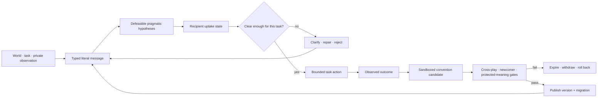

# Candidate 015: versioned, repairable conventions

**Stage:** 1 — semantic-drift, cross-play, and lifecycle falsification

**Status:** held systems composition; not an accepted project claim

**Primary question:** can heterogeneous agents adapt local message forms under
task and population drift while preserving explicit meaning, acknowledgement,
repair, compatibility, and rollback better than a fixed typed protocol with a
schema registry and mature migration practice at equal complete budget?

## Candidate statement

The runtime keeps literal content, inferred intention, partner state,
acknowledgement, evidence, and authority as separate fields. An agent may use a
local shorthand only inside a declared scope. Durable publication requires
measured uptake, independent interpretation, cross-play, protected-meaning
tests, compatibility, and a prepared rollback.

The candidate is a lifecycle composition, not a claim that “language” is one
mechanism. Formal composition, pragmatic inference, repair, timing, channel
coding, cultural transmission, grounding, and convention formation retain
their own assumptions and null models
([C-268](../../research/claims.md#c-268)–[C-281](../../research/claims.md#c-281)).

## Message and convention contract

| Field | Meaning | Lifetime | Release condition |
| --- | --- | --- | --- |
| message identity and lineage | immutable message plus quoted, repaired, and superseded links | archive | identity never reused |
| sender, recipient, session | authenticated actor and intended coalition | turn/session | access policy passes |
| literal payload and schema | typed content under one protocol version | release | conformance tests pass |
| referent or goal | external entity, state, query, action, or constraint | task-defined | provenance or resolver exists |
| epistemic status | observation, hypothesis, request, inference, decision, or correction | claim-defined | syntax cannot upgrade it |
| confidence and domain | quantified uncertainty and calibration regime | model version | calibration evidence exists |
| pragmatic hypotheses | ranked intended meanings beyond literal content | turn/session | consequential ambiguity triggers clarification |
| acknowledgement state | received, parsed, understood-enough, accepted, rejected, unresolved | session/task | only the recipient supplies uptake evidence |
| repair lineage | trouble source, correction, resolver, and outcome | session/archive | original remains inspectable |
| convention candidate | local form mapped to explicit semantics and scope | sandbox/session | promotion gates pass |
| protocol status | experimental, published, deprecated, withdrawn | release/archive | maintenance decision recorded |
| expiry and rollback | expiration and last compatible mapping | field-specific | rollback tested before release |

The contract deliberately spends redundancy on audit and recovery. A lower-risk
path may compress fields only by referencing an immutable record from which
they can be reconstructed.

## Lifecycle

Editable source:
[versioned-repairable-conventions.mmd](../../assets/diagrams/versioned-repairable-conventions.mmd).

## Promotion gates

1. **Denotation:** independent interpreters recover the declared referent,
   action, query, or constraint on held-out examples.
2. **Systematic transfer:** novel combinations are separated from memorized
   messages and evaluated by task outcome.
3. **Cross-play:** older, newer, and independently trained agents communicate
   without co-training with the proposer.
4. **Repair:** corrupted, underspecified, and version-mismatched messages yield
   bounded clarification or safe rejection, not silent commitment.
5. **Incentives:** pragmatic expectations cannot grant authority to malicious
   or partially aligned senders.
6. **Protected meanings:** rare, safety-critical, and subgroup-specific
   distinctions survive transmission.
7. **Compatibility:** negotiation, migration, dual-read/write where needed,
   expiry, and rollback are exercised.
8. **Cost:** message, compute, storage, repair, migration, and review improve
   the declared frontier beyond the complete null stack.

## Cost vector

Report

$$
\mathbf c=
(B_{\mathrm{tx}},T_{50},T_{99},E_{\mathrm{enc}},E_{\mathrm{dec}},
N_{\mathrm{repair}},S_{\mathrm{state}},H_{\mathrm{review}}),
$$

where $B_{\mathrm{tx}}$ is transmitted bits per completed task; $T_{50}$ and
$T_{99}$ are milliseconds; encoder and decoder energies are joules per
completed task; $N_{\mathrm{repair}}$ is a count; $S_{\mathrm{state}}$ is
retained bytes; and $H_{\mathrm{review}}$ is human minutes. Semantic and safety
constraints remain visible rather than becoming cheap scalar penalties.

## Strongest null stack

- fixed typed protocol or domain-specific language;
- schema registry, semantic versioning, compatibility tests, and migration;
- authenticated identity, scoped authorization, and provenance;
- acknowledgements, NACKs, retry, timeouts, and bounded clarification;
- calibrated literal and probabilistic reference resolution;
- append-only logs, version vectors, replicated partner state, and expiry;
- standard compression and forward-error correction; and
- human-authored protocol governance with canary release and rollback.

## Equal-budget experiment family

### A — composition and reference

Use typed primitives, nested relations, lexical ambiguity, hidden sender
observations, asymmetric histories, and cooperative through adversarial
incentives. Compare an end-to-end sequence model, typed DSL, semantic parser,
literal listener, calibrated pragmatic model, emergent code, direct
clarification, and the candidate. Match examples, optimizer work, storage,
messages, and inference compute. Measure exact denotation, novel-combination
success, calibration, regret, deception, clarification, and authority errors.

### B — false common ground and repair

Inject packet loss, delayed delivery, stale schemas, private observations,
misleading receipts, malformed or deceptive messages, and population churn.
Compare assumed shared context, replicated blackboard, append-only log with
acknowledgements/version vectors, schema NACK/retry, threshold clarification,
and the candidate. Measure false-common-ground commitments, contradictory
actions, repair precision/recall, loops, tail latency, state bytes, repair
traffic, and partition recovery.

### C — timing and noisy channels

Vary compute/network delay, simultaneous discoveries, urgent interrupts,
channel error, bandwidth, shared-prior drift, tail importance, and decoder
mismatch. Compare central priority queue, leases, actor mailboxes, learned
turn-taking, raw typed messages, standard compression plus error correction,
learned task codecs, emergent codes, and the candidate. Measure collisions,
deadline misses, starvation, transmitted bits, native-unit distortion,
catastrophic-tail errors, encoder/decoder energy, repair bytes, and wasted work.

### D — transmission, drift, and grounding

Run independent chains and interacting populations with turnover, task change,
minority meanings, adversaries, novel objects, non-shared sensors, and embodied
actions. Compare fixed-reference training, distillation, Bayesian iterated
learning, naming games, explicit schema migration, external IDs plus state
estimation, active grounding, and the candidate. Measure rare-meaning retention,
cross-play, newcomer sample complexity, drift, subgroup compatibility,
counterfactual action, rollback, and cumulative cost.

### E — strategic adoption

Vary topology, status, incentives, coordinated manipulators, and turnover; seed
useful, neutral, ambiguous, and harmful variants at equal frequency. Compare
popularity adoption, outcome selection, controlled standards governance, and
the candidate. Measure adoption curves, task utility, subgroup error,
manipulation, fragmentation, migration burden, and rollback time.

## Ablations

1. Collapse literal payload and inferred intention.
2. Treat delivery acknowledgement as understanding or acceptance.
3. Remove partner/session scope from common-ground state.
4. Promote a convention from frequency alone.
5. Remove explicit referent or action mapping.
6. Remove newcomer and independently trained cross-play.
7. Remove protected rare meanings.
8. Remove version negotiation and dual-read/write.
9. Overwrite repaired messages instead of retaining lineage.
10. Count transmitted tokens while omitting decoder, synchronization, repair,
    migration, and human-review cost.

## Promotion rule

### Interaction stability and recovery gate

For human-facing conventions, compare adaptive presentation with a polished
stable interface and a user-adaptable baseline. Preserve location or other
operational invariants where possible; expose version, changed mapping,
effective action, undo/compensation, resumption state, and rollback. Preference,
trust, acceptance, comprehension, correctness, and accessibility are separate
outcomes ([C-401](../../research/claims.md#c-401),
[C-406](../../research/claims.md#c-406),
[C-409](../../research/claims.md#c-409),
[C-411](../../research/claims.md#c-411)–[C-414](../../research/claims.md#c-414)).

Advance only if the candidate improves transfer or adaptation under genuine
requirement or population drift while reducing silent semantic failure, and
does so beyond the complete fixed-protocol null at equal end-to-end budget.
Wins must survive heterogeneous agents, asymmetric context, protected meanings,
adversarial senders, newcomer admission, version skew, and rollback.

## Kill criteria

Reject or narrow the candidate when:

- learned forms cannot compile to explicit testable denotation or action;
- reward rises while cross-play, newcomer learning, or protected meanings fall;
- pragmatic inference bypasses schema, provenance, or authority;
- repair loops create unbounded latency or denial of service;
- standard scheduling, coding, entity registries, replicated logs, or explicit
  schema migration match the outcome at lower lifecycle cost;
- consensus or centrality promotes harmful forms;
- old agents cannot negotiate, interpret, or safely reject the new version;
- rollback cannot reconstruct former mappings and affected messages; or
- surface brevity disappears after decoder, repair, synchronization, migration,
  storage, and review cost are charged.

## Evidence links

- [Linguistics and communication audit](../../research/audits/2026-08-05-linguistics-communication.md)
- [P-002](../../research/principle-registry.md#p-002--local-autonomy-with-exception-escalation)
- [P-003](../../research/principle-registry.md#p-003--temporary-trace-before-commitment)
- [P-007](../../research/principle-registry.md#p-007--prediction-error-allocation)
- [P-009](../../research/principle-registry.md#p-009--maintenance-plane)
- [P-011](../../research/principle-registry.md#p-011--transient-communication-coalitions)
- [P-012](../../research/principle-registry.md#p-012--memory-matched-to-information-lifetime)
- [P-013](../../research/principle-registry.md#p-013--externalized-shared-state)
