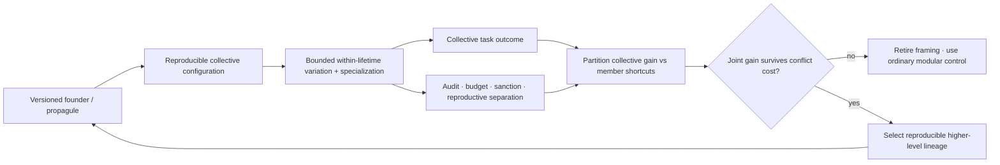

# Candidate 016: conflict-bounded unit transition

**Stage:** 1 — multilevel-selection and lifecycle falsification

**Status:** held integration hypothesis; not an accepted project claim

**Primary question:** when modules can improve their own measured reward by
damaging collective performance, does a reproducible collective lifecycle plus
costed conflict control create heritable higher-level capability beyond ordinary
modularity, permissions, tests, routing, checkpoints, and ensemble selection?

## Candidate statement

A cooperating collection is treated as a candidate higher-level unit only when
the experiment defines:

1. the collective boundary and membership;
2. a reproducible founder or child configuration;
3. inherited versus within-lifetime state;
4. variation among collective descendants;
5. a task-native collective performance measure;
6. member-level incentives and identifiable shortcuts;
7. conflict-control mechanism and complete cost; and
8. the event by which one collective lineage yields descendants.

Cooperation, aggregation, specialization, or an API boundary alone is
insufficient. The residual requires measurable heritable variation in
collective performance and conflict controls whose cost does not erase the
joint gain ([C-282](../../research/claims.md#c-282)–[C-301](../../research/claims.md#c-301)).

## Lifecycle

Editable source:
[conflict-bounded-unit-transition.mmd](../../assets/diagrams/conflict-bounded-unit-transition.mmd).

The founder is not a generic destructive bottleneck. A demographic contraction
normally loses variation. The tested operation is a versioned reproduction
boundary that may prevent parasitic local state from being inherited while
preserving declared capability.

## Selection accounting

For collective lineages $k$, let $Z_k$ be collective performance in one
task-native unit and $W_k$ the dimensionless number or weight of admitted child
configurations. The Price accounting identity is

$$
\Delta\bar Z=
\frac{\operatorname{Cov}(W_k,Z_k)}{\bar W}
+\frac{\mathbb E[W_k\Delta Z_k]}{\bar W}.
$$

The covariance term measures selection among declared collectives; the second
term measures change during transmission. A nested partition separately reports
member-level and collective-level covariance. This identity does not identify a
cause; lineage definition, descendant relation, sampling, and observation
window are fixed before the run.

Net lifecycle benefit remains a vector. Report collective task value and risk,
member reward, inherited defect rate, capability coverage, between-lineage
heritability, enforcement joules, bytes, latency, false sanctions, interface
traffic, replicated state, founder failures, replacement time, and recovery
after removal of a specialist.

## Strongest nulls

- one modular system with typed interfaces, permissions, tests, and monitoring;
- fixed sparse mixture-of-experts with ordinary load balancing;
- checkpoint/version control and clean child deployments;
- ensemble or population selection on collective task outcome;
- population-based training and quality-diversity search;
- independent modules with centralized external evaluation;
- ordinary incentive-compatible or audit-backed allocation where applicable;
- capability isolation, sandboxing, quotas, and least privilege; and
- a capacity-matched monolith with no internal reward competition.

## Matched-budget and resource parity

Construct paired arms from the same founder state, task sequence, member reward
schedule, shortcut opportunities, fault injections, and descendant slots.
Equalize active model capacity, training and evaluation episodes, optimizer
updates, environment interactions, evaluator calls, storage bytes, interface
and audit traffic, wall time, measured joules, reserve capacity, and operator
person-minutes. Validation, sanctions, failed founders, clean-room child
construction, replacement, and recovery are charged to the arm that invokes
them. Unused allowances are reported and cannot be exchanged after outcomes
are observed.

## Experimental tracks

### A — reproductive boundary versus ordinary versioning

Alternate periods of within-lifetime specialization with child creation. Inject
useful local adaptations, parasitic optimizer/router state, correlated defects,
rare capabilities, founder corruption, and a returning regime. Compare full
state inheritance, checkpoint/versioning, ensemble resampling, truncation
selection, isolated capabilities, and the proposed founder contract.

Measure inherited defects per child, retained capability coverage, rare-role
loss, diversity, recovery, state bytes, validation work, and joules. Reject the
candidate if ordinary clean deployment gives the same result or if founder loss
and reduced variation erase the governance benefit.

### B — higher-level performance under member shortcuts

Create repeated collective lineages whose modules receive local reward and can
take shortcuts that improve it while harming protected collective outcomes.
Vary group formation, lineage mixing, observability, relatedness of initial
state, task coupling, and shortcut payoff. Compare no control, permissions and
tests, quotas, independent audits, sanctions, reproductive separation, and the
complete candidate.

Report the predeclared between/within selection partition, collective
heritability, shortcut prevalence, false punishment, useful deviation lost,
task value, tail risk, enforcement energy, and operator effort. Aggregate reward
without positive cost-adjusted between-collective selection is a failure.

The producer–product locality refinement tests
[C-171](../../research/claims.md#c-171). Give modules opportunities to emit a
shareable useful artifact while faster free riders can consume it without
producing it. Cross group size, producer occupancy, mixing, and measured
leakage. Compare a global pool, an ordinary logical sandbox, cryptographic
provenance with per-lineage reward, quotas, sharded group evaluation, and—only
where location and transport are real—a physically co-located or
substrate-enforced compartment. All arms inherit the matched budgets and frozen
confirmatory decisions above; additionally charge physical boundary, transport,
material, and leakage-control costs to the arm that incurs them. Report producer
survival, useful artifacts per eligible opportunity, free-rider fraction,
misattributed credit, stochastic extinction, and joules per accepted useful
artifact. Reject the locality refinement if explicit provenance, quotas,
sandboxing, or sharded evaluation reaches the same or better frontier.

### C — specialization without false individuality

Under repeated tasks and component turnover, compare a capacity-matched
monolith, routed experts, reversible plugins, specialized collectives, and the
candidate. Remove specialists, change interfaces, introduce newcomers, and
shift task niches. Measure joules per successful episode, boundary bytes,
replicated state, unique contribution, correlated failure, regeneration time,
rollback, and replacement.

The candidate fails if ordinary routing or a modular monolith supplies the same
specialization and recovery frontier without a reproductive lifecycle.

## Outcomes and measurements

Report the following by lineage, generation, task family, shortcut regime, and
fault stratum:

| Outcome | Unit and denominator |
| --- | --- |
| collective task value and protected loss | declared task-native unit per episode |
| between-lineage and transmission terms | the task-native unit per declared generation from the preregistered Price partition |
| member shortcut prevalence | shortcut events per eligible member-opportunity |
| inherited defects and founder failures | defects per admitted child and fraction of attempted founders |
| collective heritability and capability coverage | dimensionless estimate and fraction of registered capabilities |
| rare-role loss and useful deviation suppressed | capability counts and fraction of eligible deviations |
| enforcement and validation work | joules, machine-seconds, and person-minutes per admitted child |
| boundary and replicated state | transmitted bytes per episode and retained bytes per collective |
| false sanctions | count per audited member-action |
| completion, replacement, and recovery time | seconds from registered trigger to terminal state |
| specialist-removal degradation and common-mode failure | task-native loss and failure fraction |

Headline collective reward never substitutes for the member/collective
partition, protected outcomes, or complete lifecycle costs.

## Confirmatory analysis and statistical plan

Pair candidate and null arms on founder, task and fault seed, shortcut payoff,
member initialization, turnover schedule, and descendant opportunity. Freeze
the collective boundary, descendant relation, Price partition, validation
tests, and conflict-control policy before revealing held-out task families,
member compositions, returning regimes, and common-mode faults. Treat a lineage
or independently generated collective as the sampling unit; episodes and
members nested inside one lineage are not independent replicates.

The confirmatory contrast is the candidate against ordinary clean versioning
plus permissions, tests, external evaluation, and population selection. Report
paired effects and uncertainty for protected collective performance, the
between-lineage component, transmission change, and the complete cost vector.
Use a hierarchical model or lineage-level bootstrap that resamples intact
lineages and descendant clusters. For covariance and heritability estimates,
report interval estimates and sensitivity to the preregistered weighting and
observation window rather than interpreting the accounting identity causally.

Preregister one primary contrast per experimental track. Gate downstream
mechanism claims on the corresponding task/protection result and control the
remaining track-level familywise error with a declared multiplicity procedure. Report
founder corruption, rare-role loss, and common-mode failure separately rather
than averaging them into frequent benign episodes.

Extinct lineages, child-construction failures, unadmitted children, specialist
loss, and inability to recover by the horizon remain outcomes. Recovery and
replacement times are right-censored at the registered horizon; missing audit
telemetry and missing descendants are tabulated by arm and cause. The primary
analysis uses no successful-lineage or complete-case filter and includes
bounded sensitivity analyses where a task-native outcome is genuinely
unobserved.

Apply the promotion and kill criteria to the held-out lineage-level estimates
and their uncertainty intervals exactly as preregistered. Acceptance margins
must be derived from the task contract, measurement resolution, or baseline
variation before allocation. Post-hoc lineage definitions or observation
windows can produce only exploratory results.

## Ablations

1. Remove the reproducible child configuration.
2. Inherit every within-lifetime state change.
3. Apply a narrow founder reset without protected capability checks.
4. Select collectives by aggregate reward without member-level accounting.
5. Remove individually profitable shortcuts from the environment.
6. Remove conflict control while keeping the higher-level label.
7. Hide enforcement energy, false sanctions, or interface traffic.
8. Increase logical participant count without independent failure domains.
9. Remove lineage turnover and descendant creation.
10. Compare only against individually optimized modules, omitting a centralized
    outcome evaluator and standard permissions/tests.
11. Break producer–product co-location while retaining the same group labels,
    access rights, selection rule, and resource ceilings.

## Promotion rule

Advance only when a stable positive between-collective selection component and
reproducible collective capability survive member-level conflict, turnover,
founder loss, common-mode faults, and complete enforcement cost in at least two
task families. A win must exceed ordinary versioning plus permissions, tests,
external evaluation, and population selection.

## Kill criteria

Reject or merge the candidate when:

- no unambiguous collective reproduction event can be defined;
- collective performance is not inherited beyond transient co-adaptation;
- demographic narrowing merely removes useful diversity;
- apparent higher-level gain is ordinary checkpoint hygiene or ensemble
  selection;
- policing suppresses useful deviation or becomes the dominant failure source;
- high shared ancestry creates correlated vulnerability;
- within-unit shortcuts dominate after the accounting partition;
- a standard permission/test stack matches the frontier; or
- selection, validation, reserve, replacement, and recovery consume the gain.

## Evidence links

- [Paleobiology and major-transitions audit](../../research/audits/2026-08-05-paleobiology-major-transitions.md)
- [C-171 — physical locality and producer–product credit](../../research/claims.md#c-171)
- [Chemistry and reaction-networks audit](../../research/audits/2026-08-05-chemistry-reaction-networks-proofreading.md)
- [P-004](../../research/principle-registry.md#p-004--diversity-selection-and-protection)
- [P-008](../../research/principle-registry.md#p-008--compartmentalized-interaction)
- [P-009](../../research/principle-registry.md#p-009--maintenance-plane)
- [P-012](../../research/principle-registry.md#p-012--memory-matched-to-information-lifetime)
