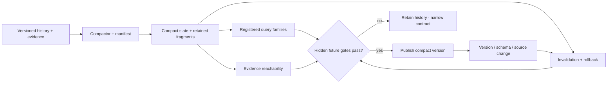

# Candidate 017: contract-preserving semantic compaction

**Stage:** 1 — hidden-query, invalidation, and rollback falsification

**Status:** held storage composition; not an accepted project claim

**Primary question:** can a system shrink long observation, action, version,
and evidence histories while preserving declared query, evidence, rollback,
uncertainty, and invalidation contracts better than snapshots, materialized
views, key compaction, lossless compression, and cold archives at equal complete
budget?

## Candidate statement

The compactor may preserve a finite registered contract, not “all future
meaning.” For history $H$, compact state $Z=C_\phi(H)$, query family
$\mathcal Q$, invalidation family $\mathcal I$, and evidence relation $L$,
require

$$
\Pr_{q\sim\mathcal D_Q}[d(q(H),q(Z))>\epsilon_q]\leq\delta,
$$

$$
\operatorname{Recall}_L(Z)\geq r_L,
\qquad
\operatorname{Success}_{\mathcal I}(Z)\geq r_I.
$$

$d$ and $\epsilon_q$ use the query's native unit; $\delta$, $r_L$, and $r_I$
are dimensionless. The byte reduction

$$
\rho_B=1-\frac{|Z|+|M_Z|}{|H|+|M_H|}
$$

includes manifests, indexes, retained fragments, replicas, and backups. The
query distribution has a preregistered out-of-distribution split.

## Lifecycle

Editable source:
[semantic-compaction-contract.mmd](../../assets/diagrams/semantic-compaction-contract.mmd).

## Strongest nulls

1. full version/event history with ordinary indexes;
2. current-state snapshot plus retained suffix log;
3. materialized views for registered queries;
4. key-based log compaction and tombstones;
5. lossless compression and deduplication;
6. TTL/retention tiers with a full cold archive;
7. extractive summaries retaining cited source spans; and
8. Candidate 014's observation contract without learned compaction.

All arms receive equal hot/cold physical bytes, index and metadata bytes,
maintenance bandwidth, compaction work, human policy time, and rollback horizon.

## Experiment

Use streams containing factual corrections, late observations, conflicting
sources, policy changes, tool outcomes, model updates, privacy deletion, and
legal holds. Freeze the compactor before generating hidden future queries,
invalidation requests, rollback requests, and rare safety/audit questions.

Measure physical bytes, compaction joules, foreground p99 interference,
query-native error and calibration, evidence-link precision/recall, rollback
horizon, invalidation precision/recall, erasure success, audit reconstruction
time, and degradation after summary or source-fragment corruption.

Every compact version emits a machine-readable manifest naming the query,
evidence, uncertainty, retention, deletion, and rollback obligations it claims.
Unsupported questions must be rejected rather than reconstructed from invented
detail.

## Ablations

1. Remove the manifest.
2. Train and test on the same query families.
3. Omit rare safety and evidence questions.
4. Exclude metadata, source fragments, or backups from $\rho_B$.
5. Preserve query output but remove evidence links.
6. Preserve current queries but remove invalidation.
7. Preserve average error but omit tail or subgroup error.
8. Change source/schema versions without revalidation.
9. Corrupt the compact summary without a retained fallback.
10. Compare only with raw unindexed history.

## Promotion and kill rules

Advance only if one frozen policy improves the storage–maintenance-energy–query
frontier across at least three workload families and two hardware profiles,
while rare obligations, evidence reachability, rollback, invalidation, and
failure degradation meet preregistered thresholds.

Retire when snapshots, views, cold archive, or Candidate 014 match it; metadata
and compute erase the gain; exact future queries must be known; current-state
by key is the only preserved contract; or summary drift destroys reproducibility.

## Evidence links

- [Database and storage audit](../../research/audits/2026-08-05-databases-storage.md)
- [C-325](../../research/claims.md#c-325)–[C-342](../../research/claims.md#c-342)
- [Candidate 009](009-graded-assurance-envelopes.md)
- [Candidate 011](011-dual-loop-operational-assurance.md)
- [Candidate 014](014-versioned-observation-contract.md)

## Supply-chain operations-research track

**Domain status.** Query-contract refinement, not an inventory-compression
analogy. See the
[supply-chain audit](../../research/audits/2026-08-05-supply-chain-operations-research.md#exact-candidate-refinements).
Evidence: [C-627](../../research/claims.md#c-627),
[C-659](../../research/claims.md#c-659)–[C-678](../../research/claims.md#c-678).

**Preserved queries.** Declare before compaction every order/inventory history
needed to reconstruct provenance, lead-time and delay distributions, lost-sales
censoring, expiry/condition, returns and recovery yield, disruption/recovery,
and service-definition versions.

**Strongest OR/storage nulls.** Lossless event logs, snapshots, materialized
views, cold archive, ordinary compression with retained raw fragments,
age-structured inventory, service/censoring models, and repairable-item
ledgers.

**Matched-budget test.** Replay identical demand, expiry, return, disruption,
and metric-version histories across complete log, snapshot/archive, ordinary
compression, and candidate compaction; equalize storage bytes, query compute,
maintenance, rebuild time, and retained metadata.

**Service and recovery measurements.** Report query error, unreconstructable
service decisions, lost-sales and lead-time estimation error, fill/OTIF
reconstruction, expiry/condition mistakes, recovery-yield error,
backlog-clearance error, restore hours, bytes, joules, and human audit hours.

**Rejection gate.** Reject if required future queries must be guessed after
compression, if service/recovery evidence cannot be reconstructed, or if a
complete log plus snapshots/cold archive matches the storage–query–maintenance
frontier.
