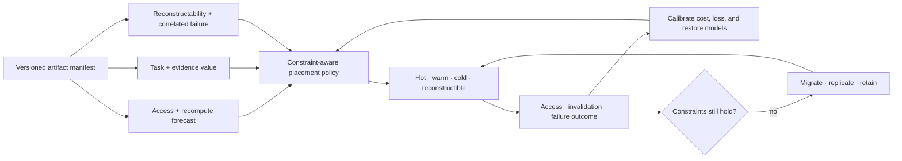

# Candidate 018: value- and reconstructability-aware artifact tiering

**Stage:** 1 — leakage-free placement and lifecycle falsification

**Status:** held storage policy; not an accepted project claim

**Primary question:** do task/evidence value and reconstructability add
generalizable placement information beyond access, size, miss cost, device
economics, and fault-domain-aware storage?

## Candidate statement

For artifact $i$, tier $j$, and planning horizon $h$, estimate access and
recomputation cost, task loss if unavailable or stale, evidence value, and
reconstructability under correlated failures. If converted into one objective,

$$
U_{ij}=
-\widehat C_{ij}^{\mathrm{store}}
-\widehat C_{ij}^{\mathrm{move}}
-\widehat C_{ij}^{\mathrm{access}}
-\widehat L_{ij}^{\mathrm{unavailable}}
-\widehat L_{ij}^{\mathrm{stale}}
+\widehat V_{ij}^{\mathrm{evidence}}.
$$

Conversion weights are preregistered. Native bytes, seconds, joules, currency,
task loss, evidence recall, and loss probability remain reported. Capacity,
bandwidth, endurance, locality, privacy, and failure-domain separation are hard
constraints rather than hidden penalties.

## Control loop

Editable source:
[value-aware-artifact-tiering.mmd](../../assets/diagrams/value-aware-artifact-tiering.mmd).

## Strongest nulls

1. LRU and LFU;
2. ARC and W-TinyLFU;
3. size-aware and miss-cost-aware caching;
4. a static optimizer with the same forecasts;
5. economic break-even tiering from access rate and device price;
6. replication/erasure-coded fault-domain placement;
7. P-001/P-012 lifecycle policy without semantic/evidence features; and
8. an offline future-trace oracle, reported only as an upper bound.

## Experiment

Artifacts include raw observations, evidence-linked claims, summaries,
checkpoints, model deltas, replay episodes, indexes, and reconstructible views.
Traces include stationary skew, scans, bursty changes, delayed corrections,
rare safety audits, rollback, source invalidation, regional loss, latent
corruption, and correlated software failure.

Value labels use only information available at decision time. Ablate access,
recompute, task-loss, evidence, and failure-correlation features. Replay the
same traces through every arm with equal physical capacity, bandwidth,
metadata, forecast work, policy compute, tuning opportunities, and migration
allowance.

Report task-native loss, evidence/invalidation success, restore and p99 access
latency, hot/cold bytes, movement bytes, endurance writes, joules, currency,
policy CPU/memory, and calibration of every predicted component.

## Ablations

1. Remove access forecast.
2. Remove recomputation cost.
3. Remove task-loss prediction.
4. Remove evidence/invalidation value.
5. Treat logical replicas as independent despite common failure.
6. Use future labels or future trace features.
7. Exclude metadata and migration from cost.
8. Collapse stale and unavailable loss.
9. Replace constraints with soft penalties.
10. Keep rare artifacts hot through handwritten task IDs.

## Promotion and kill rules

Advance only if semantic/evidence and reconstructability features improve an
out-of-sample Pareto frontier over the strongest cost-aware policy across
stationary and shifted workloads while meeting capacity, privacy, failure, and
tail-latency constraints.

Retire if an ordinary engineered feature vector matches it; gains require
future labels or handcrafted task IDs; migration and metadata erase savings;
one workload-specific threshold is required; or the policy reduces to P-001,
P-012, and Candidate 014 metadata.

## Evidence links

- [Database and storage audit](../../research/audits/2026-08-05-databases-storage.md)
- [C-325](../../research/claims.md#c-325)–[C-342](../../research/claims.md#c-342)
- [P-001](../../research/principle-registry.md#p-001--selective-allocation)
- [P-009](../../research/principle-registry.md#p-009--maintenance-plane)
- [P-012](../../research/principle-registry.md#p-012--memory-matched-to-information-lifetime)
- [P-013](../../research/principle-registry.md#p-013--externalized-shared-state)
