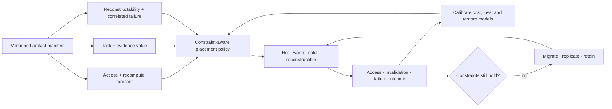

# Candidate 018: value- and reconstructability-aware artifact tiering

**Stage:** 1 — leakage-free placement and lifecycle falsification

**Status:** held storage policy; not an accepted project claim

**Primary question:** do task/evidence value and reconstructability add
generalizable placement information beyond access, size, miss cost, device
economics, and fault-domain-aware storage?

## Candidate statement

For artifact $i$, tier $j$, and planning horizon $h$, estimate access and
recomputation cost, task loss if unavailable or stale, evidence value, and
reconstructability under correlated failures. If converted into one objective,

$$
U_{ij}=
-\widehat C_{ij}^{\mathrm{store}}
-\widehat C_{ij}^{\mathrm{move}}
-\widehat C_{ij}^{\mathrm{access}}
-\widehat L_{ij}^{\mathrm{unavailable}}
-\widehat L_{ij}^{\mathrm{stale}}
+\widehat V_{ij}^{\mathrm{evidence}}.
$$

Conversion weights are preregistered. Native bytes, seconds, joules, currency,
task loss, evidence recall, and loss probability remain reported. Capacity,
bandwidth, endurance, locality, privacy, and failure-domain separation are hard
constraints rather than hidden penalties.

## Control loop

Editable source:
[value-aware-artifact-tiering.mmd](../../assets/diagrams/value-aware-artifact-tiering.mmd).

## Strongest nulls

1. LRU and LFU;
2. ARC and W-TinyLFU;
3. size-aware and miss-cost-aware caching;
4. a static optimizer with the same forecasts;
5. economic break-even tiering from access rate and device price;
6. replication/erasure-coded fault-domain placement;
7. P-001/P-012 lifecycle policy without semantic/evidence features; and
8. an offline future-trace oracle, reported only as an upper bound.

## Matched-budget and resource parity

Replay the same artifact births, accesses, corrections, invalidations,
failures, rebuild opportunities, and device conditions through every policy.
Equalize usable physical capacity by tier, redundancy and failure domains,
network and migration bandwidth, forecast inputs, policy-update opportunities,
CPU and memory allowance, storage and metadata bytes, device endurance,
measured energy, wall time, and operator person-minutes. Charge failed
migrations, verification, reconciliation, restore, and policy maintenance to
the invoking arm. The future-trace oracle is not eligible for promotion and
receives no hidden resource advantage.

## Experiment

Artifacts include raw observations, evidence-linked claims, summaries,
checkpoints, model deltas, replay episodes, indexes, and reconstructible views.
Traces include stationary skew, scans, bursty changes, delayed corrections,
rare safety audits, rollback, source invalidation, regional loss, latent
corruption, and correlated software failure.

Replica diversity is credited only from measured failure-domain,
administrative, software, and threat correlations, not from nominal copy count
([C-792](../../research/claims.md#c-792)). The existing correlated-failure
replay therefore carries those correlation labels into reconstructability,
restore-cost, and loss estimates; Ablation 5 tests the error created by treating
logical replicas as independent despite shared failure.

Value labels use only information available at decision time. Ablate access,
recompute, task-loss, evidence, and failure-correlation features. Replay the
same traces through every arm with equal physical capacity, bandwidth,
metadata, forecast work, policy compute, tuning opportunities, and migration
allowance.

Report task-native loss, evidence/invalidation success, restore and p99 access
latency, hot/cold bytes, movement bytes, endurance writes, joules, currency,
policy CPU/memory, and calibration of every predicted component.

## Outcomes and measurements

Report every result by workload, artifact class, placement tier, failure
domain, decision-time information stratum, and held-out regime:

| Outcome | Unit and denominator |
| --- | --- |
| task loss from unavailable or stale artifacts | declared task-native unit per eligible access or task |
| evidence and invalidation success | successful requests per registered request |
| artifact availability and loss | fraction of required accesses and irrecoverable artifacts per failure event |
| access and restore latency | median and p99 milliseconds for access; seconds to verified restoration |
| placement and metadata footprint | hot, warm, cold, replica, index, and policy-state bytes |
| movement and endurance | bytes moved and device writes per declared interval |
| policy and lifecycle energy | joules for forecasting, placement, movement, access, verification, and restore |
| monetary cost | currency and price date per declared interval |
| policy compute | CPU-seconds and peak memory bytes |
| prediction calibration | dimensionless calibration measure separately for access, cost, loss, and reconstructability |
| privacy, locality, capacity, and failure-domain violations | count per eligible decision |
| human maintenance | operator person-minutes per policy interval |

Keep unavailable and stale loss separate. A scalar utility is secondary to the
native-unit vector and is analyzed only under preregistered conversion weights.

## Confirmatory analysis and statistical plan

Pair policies on the complete trace, artifact identity, decision-time feature
history, device state, correlated-failure seed, correction schedule, and
migration opportunity. Freeze forecasts, policy parameters, constraints, and
conversion weights before revealing held-out workloads, time blocks, artifact
classes, hardware profiles, and failure-domain combinations. The independent
unit is an independently generated trace or deployment interval; repeated
accesses within it remain clustered.

The confirmatory comparison is the candidate against the strongest ordinary
cost-, miss-, and correlation-aware placement policy under matched resources.
Estimate paired differences and uncertainty with a trace-level hierarchical
model or block bootstrap that preserves bursts and failure episodes. Report
task-native loss, evidence/invalidation success, constraint violations, and the
complete resource vector together. Forecast calibration is evaluated only on
predictions recorded before access or failure outcomes.

Preregister one primary contrast for each held-out workload family and gate
feature-mechanism conclusions on the corresponding outcome result. Control the
remaining familywise error across workloads, artifact classes, and failure
regimes with a declared multiplicity procedure. Rare audit, rollback, and correlated-loss
events remain separate endpoints rather than being diluted by common cache
hits.

Irrecoverable artifacts, latent corruption discovered late, access failure,
and constraint violation are outcomes. Incomplete restore is right-censored at
the registered horizon. Missing task/evidence labels are tabulated by arm and
cause and are not filled with future information; use preregistered bounds or
sensitivity models for genuinely unobserved loss. Include artifacts still in
migration in both resource and availability accounting.

Apply the promotion and retirement rules once to the frozen held-out analysis.
Any required margin must be derived ex ante from an operational constraint,
measurement resolution, or baseline variability. A policy tuned after seeing
the held-out trace or dependent on future labels is rejected for confirmatory
purposes, regardless of its retrospective score.

## Ablations

1. Remove access forecast.
2. Remove recomputation cost.
3. Remove task-loss prediction.
4. Remove evidence/invalidation value.
5. Treat logical replicas as independent despite common failure.
6. Use future labels or future trace features.
7. Exclude metadata and migration from cost.
8. Collapse stale and unavailable loss.
9. Replace constraints with soft penalties.
10. Keep rare artifacts hot through handwritten task IDs.

## Promotion and kill rules

Advance only if semantic/evidence and reconstructability features improve an
out-of-sample Pareto frontier over the strongest cost-aware policy across
stationary and shifted workloads while meeting capacity, privacy, failure, and
tail-latency constraints.

Retire if an ordinary engineered feature vector matches it; gains require
future labels or handcrafted task IDs; migration and metadata erase savings;
one workload-specific threshold is required; or the policy reduces to P-001,
P-012, and Candidate 014 metadata.

## Evidence links

- [Database and storage audit](../../research/audits/2026-08-05-databases-storage.md)
- [C-325](../../research/claims.md#c-325)–[C-342](../../research/claims.md#c-342)
- [P-001](../../research/principle-registry.md#p-001--selective-allocation)
- [P-009](../../research/principle-registry.md#p-009--maintenance-plane)
- [P-012](../../research/principle-registry.md#p-012--memory-matched-to-information-lifetime)
- [P-013](../../research/principle-registry.md#p-013--externalized-shared-state)

## Supply-chain operations-research track

**Domain status.** Inventory placement is a mature analogy, not evidence for
semantic tiering. See the
[supply-chain audit](../../research/audits/2026-08-05-supply-chain-operations-research.md#exact-candidate-refinements).
Evidence: [C-627](../../research/claims.md#c-627),
[C-659](../../research/claims.md#c-659)–[C-678](../../research/claims.md#c-678).

**Cost boundary.** Keep holding, movement, restore, expiry, stockout,
reconciliation, switching, access/lead-time uncertainty, and correlated
failure-domain costs explicit; reconstructability cannot stand in for physical
availability.

**Strongest OR/storage nulls.** Correlation-aware inventory placement and
safety stock, pooling/postponement, economic tiering, miss-cost caching,
ARC/TinyLFU, coded placement, stochastic allocation, and receding-horizon
rebalancing.

**Matched-budget test.** Use paired demand, access, lead-time, expiry, movement,
and correlated-failure trajectories; equalize capacity, redundancy, network,
forecast access, migration authority, compute, storage, and maintenance across
ordinary cost-aware and candidate policies.

**Service and recovery measurements.** Report unit fill/availability, tail
access latency, stockout/miss events, restore and backlog-clearance hours,
movement bytes or items, expiry, reconciliation error, correlated-loss impact,
switching cost, joules, and human maintenance.

**Rejection gate.** Reject if semantic value adds no out-of-sample information
beyond engineered cost/reconstructability features, if future labels leak, if
correlated failures are ignored, or if ordinary placement/tiering matches the
service–recovery–lifecycle frontier.
