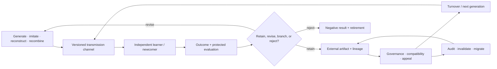

# Candidate 019: audited cumulative inheritance

**Stage:** 1 — turnover, transmission, and governance falsification

**Status:** held population-level composition; not an accepted project claim

**Primary question:** can a population retain and recombine validated capability
across agent turnover better than a centralized continual learner with ordinary
versioning, retrieval, search, and governance at equal cumulative effort?

## Candidate statement

Generation, transmission, evaluation, lineage, external state, and governance
are separately observable and versioned. A later generation is not credited
with accumulation merely because its headline score rises. Protected functions,
rare skills, compatibility, task value, and complete learning/coordination cost
must survive turnover ([C-343](../../research/claims.md#c-343)–[C-367](../../research/claims.md#c-367)).

The [learning-science and skill-acquisition audit](../../research/audits/2026-08-05-learning-science-skill-acquisition.md)
adds an outcome firewall: a teaching channel is credited only for independently
measured acquisition, delayed retention, novel transfer, fluency, calibration,
motivation, and total teacher-plus-learner effort. Fluent imitation while the
teacher, trace, or answer remains available is not inherited capability.
Evidence: [C-627](../../research/claims.md#c-627)–[C-658](../../research/claims.md#c-658).



Editable source:
[audited-cumulative-inheritance.mmd](../../assets/diagrams/audited-cumulative-inheritance.mmd).

## Accumulation ledger

For learner generation $g$,

$$
K_{g+1}=q_gK_g+I_g+R_g-D_g,
$$

where $K_g$ is validated capability in a declared task unit, $q_g$ the
dimensionless retained fraction, $I_g$ independently generated improvement,
$R_g$ validated recombination gain, and $D_g$ degradation or compatibility loss
in the same task unit. The terms need not be additive outside the registered
test suite; raw protected-capability outcomes remain visible.

Accessible model count is not raw population size. For exposure weights $\pi_i$
over possible teachers or source lineages,

$$
N_{\mathrm{eff}}=\frac{1}{\sum_i\pi_i^2}.
$$

This dimensionless concentration measure does not establish competence,
independence, or cultural complexity.

## Typed teaching and learning contract

Every transmission event declares exactly which channel was available:

```text
literal action trace
outcome-only observation
authored explanation
contrastive cases
interactive question, hint, and feedback
versioned artifact plus executable tests
```

A record carries teacher/source identity and version, learner identity and
prior support state, content and answer exposure, channel type, event and
availability times, attempts, hints, feedback, confidence before feedback,
cost, and the later tests that can invalidate the transmission. Mixed channels
remain decomposable; “instruction” is not one treatment.

For learner generation $g$, retention delay $\Delta$, and preregistered
transfer-distance stratum $d$, report

$$
Y_g(\Delta,d)=
\left[A_g,R_g(\Delta),T_g(\Delta,d),F_g(\Delta),
\operatorname{BS}_g(\Delta),M_g,C_g\right],
$$

where $A$, $R$, and $T$ are score-unit changes for acquisition, retention, and
transfer; $F$ is correct tasks/s with its error rate; $\operatorname{BS}$ is
dimensionless Brier score; $M$ keeps voluntary persistence, return, and
self-report separate; and $C_g$ is a lifecycle cost vector. The cost vector
contains at least

$$
C_g=\left[
\tau_{g,L},\tau_{g,T},N_{g,\mathrm{example}},N_{g,\mathrm{attempt}},
N_{g,\mathrm{hint}},B_{g,\mathrm{feedback}},B_{g,\mathrm{artifact}},
N_{g,\mathrm{update}},E_g
\right],
$$

with learner time $\tau_{g,L}$ and teacher/evaluator time $\tau_{g,T}$ in
seconds, counts $N$ dimensionless, feedback and artifact volume $B$ in bytes,
and measured energy $E_g$ in joules at a declared boundary. Preparation,
interaction, correction, assessment, migration, maintenance, and failed or
abandoned learners stay in the denominator and cost ledger.

Preregister acquisition at the immediate unaided post-test; retention,
fluency, calibration, and motivation at each declared delay; transfer at both a
delay and distance stratum; and cumulative cost through the longest reported
outcome and turnover. The cost clock cannot stop when teaching ends.

## Strongest null stack

- one centralized continual learner with the same cumulative examples and work;
- ordinary replay, self-distillation, checkpoints, and version control;
- retrieval from a maintained component and document repository;
- semantic search and explicit branch/merge development;
- Candidate 004's endogenous curriculum without population turnover;
- Candidate 015's fixed/versioned communication protocol;
- quality-diversity or population search under centralized evaluation;
- fixed IAM/policy-as-code, randomized audits, and Candidate 011 governance;
- standard databases/workflow engines for external state;
- human-authored migration and compatibility tests;
- a versioned artifact plus executable tests with no interactive teacher;
- matched rereading/replay and retrieval with identical attempts, hints,
  correction, and elapsed time;
- tuned fixed, spaced-repetition, and forgetting-curve review schedules;
- a standard knowledge-tracing tutor with the same item bank; and
- fixed worked examples, fading, mastery criteria, and curriculum order with
  every extra opportunity charged.

## Matched-budget and resource parity

Pair population and centralized arms on initial capability, task and item
sequence, source artifacts, answer exposure, feedback information, teacher and
learner availability, turnover schedule, evaluation calls, and perturbation
seeds. Equalize cumulative examples, attempts, hints, response opportunities,
optimizer updates, environment interactions, model capacity, storage and
artifact bytes, communication, learner seconds, teacher/evaluator seconds,
wall time, measured joules, governance work, and maintenance through the
longest outcome horizon. Failed and abandoned learners, preparation, migration,
compatibility work, and second-turnover costs remain charged. Parallel agents
do not create additional free search or evaluation.

## Experiment family

### A — inheritance across turnover

Use replacement microsocieties of artificial agents on compositional design,
repair, planning, and tool tasks. Vary whether learners receive actions,
outcomes, explanations, artifacts, tests, or combinations. Match cumulative
examples, attempts, hints, feedback information, optimizer work, environment
interactions, learner time, teacher/evaluator time, wall time, storage, and
maintenance. After each replacement, remove access to the source teacher and
training trace before testing immediate acquisition, retention at declared
delays, near and novel transfer, fluency, calibration, motivation/return,
protected-capability retention, new capability, recombination, rare-skill loss,
compatibility, newcomer sample complexity, task value, and lifecycle joules.

### B — imitation, reconstruction, and teaching channels

Compare literal trace imitation, outcome-only reconstruction, authored
explanation, contrastive cases, interactive questions/hints/feedback, versioned
artifact plus executable tests, and the full candidate. Hold content and answer
exposure visible; factorially vary support fading where feasible. Corrupt
demonstrations, hide causal steps, change tools, insert irrelevant actions, and
test after the source becomes unavailable. The winner is channel-, learner-,
skill-, horizon-, and task-dependent; Candidate 019 fails if one ordinary
artifact plus tests transfers capability equally well at matched total
teacher-plus-learner effort.

### C — model choice under sparse and strategic evidence

Vary direct evaluation cost, payoff noise, prestige/popularity cues, correlated
majorities, metric gaming, and newcomer visibility. Compare direct evaluation,
calibrated routing/bandits, random exploration, Candidate 008, and the candidate.
Measure regret, calibration, manipulation, protected minority capability,
evaluation work, and propagation of shared error.

### D — external scaffolds and governance

Compare internal state, scratchpads, repositories, workflow engines, static
contracts/IAM, reward shaping, randomized audits, Candidate 011, and endogenous
monitor/sanction/appeal/exit. Count write, index, read, verify, migrate, recovery,
enforcement, false-sanction, appeal, capture, and coordination costs. Retire the
cultural framing if conventional systems match it.

### E — network diversity, recombination, and path dependence

Compare fully connected, isolated, star, partially connected, scheduled
isolation/exchange, dynamic random, and centralized quality-diversity search.
Replay identical seeds and early choices. Measure $N_{\mathrm{eff}}$, independent
solutions, recombination gain, diffusion delay, duplicate work, seed-sensitive
basins, migration cost, and final Pareto coverage.

### F — historical observation boundary

Generate synthetic behavior and pass it through use, discard, preservation,
recovery, classification, and time averaging. Compare naive artifact-frequency
inference, a typed hierarchical/state-space model, Candidate 014, and the
candidate's lineage record. Measure coverage, calibration, mechanism
identifiability, and correct abstention under equifinal histories.

### G — retention and novel transfer through turnover

Teach prerequisite-rich skills to generation $g$, then replace every active
learner and expose generation $g+1$ through one registered channel. Test
unaided acquisition immediately, retention after fixed wall-clock and
interaction-count delays, and four separate strata: trained form, near variant,
changed representation/tool/context, and novel causal composition. Repeat a
second turnover without the original teacher or answer traces. Include
misleading fluency cues, helped answers, irrelevant demonstration steps,
schema drift, and rare protected skills.

Compare interactive teaching, artifact plus tests, fixed and spaced review,
knowledge tracing, Candidate 004 without population turnover, and centralized
continual learning at identical cumulative examples, response opportunities,
feedback, teacher/evaluator and learner seconds, storage, updates, wall time,
and joules. Score source retrieval, relational mapping, target adaptation, and
execution separately. Reject inheritance if the effect is immediate imitation,
test-format matching, answer leakage, more instruction, or persistent access to
the original source.

## Outcomes and measurements

Report outcomes by generation, learner lineage, teaching channel, skill,
retention delay, transfer-distance stratum, task family, and protected group:

| Outcome | Unit and denominator |
| --- | --- |
| unaided acquisition, delayed retention, and transfer | score-unit change and success fraction per registered item or task |
| fluency and execution error | correct tasks per second and error fraction |
| probabilistic calibration | dimensionless Brier score or declared calibration error |
| validated capability retained, generated, degraded, or recombined | declared task-native capability units per generation |
| protected and rare-skill retention | success fraction within each registered stratum |
| newcomer sample complexity | examples, attempts, hints, and feedback bytes to criterion |
| accessible lineage diversity | dimensionless $N_{\mathrm{eff}}$ with exposure weights reported |
| compatibility, migration, repair, and governance events | counts per generation and seconds to resolution |
| learner and teacher/evaluator effort | seconds per learner and per validated capability unit |
| artifacts, communication, and retained state | bytes per generation |
| training, evaluation, transmission, and maintenance energy | joules at the declared boundary per generation |
| voluntary persistence and return | attempt or return fraction, reported separately from self-report scales |

Immediate helped performance is never substituted for unaided delayed
retention or novel transfer. Numerators, eligible denominators, unavailable
sources, and attrition remain visible for every generation.

## Confirmatory analysis and statistical plan

Pair arms on initial learner state, source lineage, task/item seed, teaching
content, answer exposure, feedback, turnover, and evaluation schedule. Freeze
channel assignments, support fading, lineage definitions, outcome code, and
cost accounting before revealing held-out teachers, source artifacts, task
families, representation/tool changes, novel causal compositions, and second-
turnover tests. Treat an independently initialized lineage or replacement
microsociety as the sampling unit; learners, items, and repeated delays within
one lineage remain clustered.

The co-primary comparisons are against the complete centralized continual-
learning null and the versioned-artifact-plus-tests null under matched cumulative
effort. Estimate paired effects and uncertainty with a hierarchical model or
lineage-level cluster bootstrap across generations. Delayed novel transfer and
protected-capability retention are analyzed jointly with the lifecycle resource
vector; immediate acquisition alone cannot satisfy the confirmatory contrast.

Preregister one primary delay and transfer-distance stratum for each task
family. Gate recombination and teaching-channel mechanism claims on those
outcomes and control the remaining comparisons across delays, channels,
families, and transfer strata with a declared multiplicity procedure. Rare
skills, protected groups, manipulation, and correlated-error endpoints remain
separate even when estimates are imprecise.

Abandonment, failure to return, inability to reach the unaided test, lineage
collapse, and loss of the source teacher are outcomes rather than exclusions.
Retention or recovery not observed by the registered horizon is right-censored;
record missing telemetry and inaccessible artifacts by arm and cause. The
primary analysis uses no completer-only filter and includes bounded sensitivity
analyses for non-random missing task outcomes.

Apply the existing promotion and kill rules ex ante to the frozen held-out
estimates and uncertainty intervals. Criteria and meaningful margins must come
from the registered task, retention, safety, or measurement contract before
allocation. New channels, delays, or transfer definitions introduced after
unblinding are exploratory and require a new independent evaluation.

## Ablations

1. Merge generation and transmission into one operation.
2. Credit popularity as independent evaluation.
3. Remove negative results and failed lineages.
4. Remove source/channel identity.
5. Treat raw population size as accessible diversity.
6. Fully connect every agent throughout the run.
7. Remove rare and subgroup capabilities from the test suite.
8. Remove compatibility, migration, and retirement.
9. Remove governance cost, appeals, and capture tests.
10. Infer learning mechanism directly from retained artifacts.
11. Collapse all teaching channels into one instruction label.
12. Leave the teacher, demonstrations, or answer-bearing trace available during
    retention and transfer tests.
13. Replace skill-local support and fading with one global learner score.
14. Score immediate acquisition while hiding delayed retention and novel
    transfer.
15. Exclude teacher preparation, interaction, correction, assessment, failed
    learners, or learner time from cumulative effort.

## Promotion and kill rules

Advance only if the population method retains and recombines more validated
capability across real turnover than the complete centralized null at matched
cumulative work, and the result survives rare-skill, manipulation, network,
schema-drift, governance, and artifact-observation tests in at least two task
families. The result must also beat a versioned artifact plus executable tests
and tuned conventional instructional schedulers on delayed retention and novel
transfer after the original teacher and answer traces are unavailable, without
worsening fluency, calibration, motivation, protected outcomes, or lifecycle
cost.

Retire if improvement disappears under equal total learning time; accumulation
comes from more parallel search; documents fail under interpretation drift;
prestige or majority cues propagate correlated error; sanctions/capture dominate;
ordinary versioning, retrieval, search, workflow, and governance match the
frontier; gains are helped-answer or test-format leakage; only immediate
acquisition improves; one tuned fixed/spaced/knowledge-tracing schedule matches
the result; or teacher-plus-learner effort, attrition, and maintenance erase the
advantage.

## Evidence links

- [Cultural evolution and archaeology audit](../../research/audits/2026-08-05-cultural-evolution-archaeology.md)
- [Learning science and skill acquisition audit](../../research/audits/2026-08-05-learning-science-skill-acquisition.md)
- [Candidate 004](004-closed-endogenous-curriculum.md)
- [Candidate 008](008-contestable-modular-allocation.md)
- [Candidate 011](011-dual-loop-operational-assurance.md)
- [Candidate 014](014-versioned-observation-contract.md)
- [Candidate 015](015-versioned-repairable-conventions.md)
