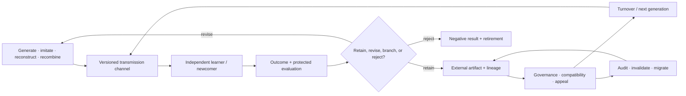

# Candidate 019: audited cumulative inheritance

**Stage:** 1 — turnover, transmission, and governance falsification

**Status:** held population-level composition; not an accepted project claim

**Primary question:** can a population retain and recombine validated capability
across agent turnover better than a centralized continual learner with ordinary
versioning, retrieval, search, and governance at equal cumulative effort?

## Candidate statement

Generation, transmission, evaluation, lineage, external state, and governance
are separately observable and versioned. A later generation is not credited
with accumulation merely because its headline score rises. Protected functions,
rare skills, compatibility, task value, and complete learning/coordination cost
must survive turnover ([C-343](../../research/claims.md#c-343)–[C-367](../../research/claims.md#c-367)).

Editable source:
[audited-cumulative-inheritance.mmd](../../assets/diagrams/audited-cumulative-inheritance.mmd).

## Accumulation ledger

For learner generation $g$,

$$
K_{g+1}=q_gK_g+I_g+R_g-D_g,
$$

where $K_g$ is validated capability in a declared task unit, $q_g$ the
dimensionless retained fraction, $I_g$ independently generated improvement,
$R_g$ validated recombination gain, and $D_g$ degradation or compatibility loss
in the same task unit. The terms need not be additive outside the registered
test suite; raw protected-capability outcomes remain visible.

Accessible model count is not raw population size. For exposure weights $\pi_i$
over possible teachers or source lineages,

$$
N_{\mathrm{eff}}=\frac{1}{\sum_i\pi_i^2}.
$$

This dimensionless concentration measure does not establish competence,
independence, or cultural complexity.

## Strongest null stack

- one centralized continual learner with the same cumulative examples and work;
- ordinary replay, self-distillation, checkpoints, and version control;
- retrieval from a maintained component and document repository;
- semantic search and explicit branch/merge development;
- Candidate 004's endogenous curriculum without population turnover;
- Candidate 015's fixed/versioned communication protocol;
- quality-diversity or population search under centralized evaluation;
- fixed IAM/policy-as-code, randomized audits, and Candidate 011 governance;
- standard databases/workflow engines for external state; and
- human-authored migration and compatibility tests.

## Experiment family

### A — inheritance across turnover

Use replacement microsocieties of artificial agents on compositional design,
repair, planning, and tool tasks. Vary whether learners receive actions,
outcomes, explanations, artifacts, tests, or combinations. Match cumulative
examples, optimizer work, environment interactions, wall time, storage, and
human maintenance. Measure protected-capability retention, new capability,
recombination, rare-skill loss, compatibility, calibration, newcomer sample
complexity, task value, and lifecycle joules.

### B — imitation, reconstruction, and teaching channels

Compare literal trace imitation, outcome-only reconstruction, authored
instruction, interactive teaching, code/artifact transfer, and the full
candidate. Corrupt demonstrations, hide causal steps, change tools, and insert
irrelevant actions. The winner is channel- and task-dependent; Candidate 019
fails if one ordinary artifact plus tests transfers capability equally well.

### C — model choice under sparse and strategic evidence

Vary direct evaluation cost, payoff noise, prestige/popularity cues, correlated
majorities, metric gaming, and newcomer visibility. Compare direct evaluation,
calibrated routing/bandits, random exploration, Candidate 008, and the candidate.
Measure regret, calibration, manipulation, protected minority capability,
evaluation work, and propagation of shared error.

### D — external scaffolds and governance

Compare internal state, scratchpads, repositories, workflow engines, static
contracts/IAM, reward shaping, randomized audits, Candidate 011, and endogenous
monitor/sanction/appeal/exit. Count write, index, read, verify, migrate, recovery,
enforcement, false-sanction, appeal, capture, and coordination costs. Retire the
cultural framing if conventional systems match it.

### E — network diversity, recombination, and path dependence

Compare fully connected, isolated, star, partially connected, scheduled
isolation/exchange, dynamic random, and centralized quality-diversity search.
Replay identical seeds and early choices. Measure $N_{\mathrm{eff}}$, independent
solutions, recombination gain, diffusion delay, duplicate work, seed-sensitive
basins, migration cost, and final Pareto coverage.

### F — historical observation boundary

Generate synthetic behavior and pass it through use, discard, preservation,
recovery, classification, and time averaging. Compare naive artifact-frequency
inference, a typed hierarchical/state-space model, Candidate 014, and the
candidate's lineage record. Measure coverage, calibration, mechanism
identifiability, and correct abstention under equifinal histories.

## Ablations

1. Merge generation and transmission into one operation.
2. Credit popularity as independent evaluation.
3. Remove negative results and failed lineages.
4. Remove source/channel identity.
5. Treat raw population size as accessible diversity.
6. Fully connect every agent throughout the run.
7. Remove rare and subgroup capabilities from the test suite.
8. Remove compatibility, migration, and retirement.
9. Remove governance cost, appeals, and capture tests.
10. Infer learning mechanism directly from retained artifacts.

## Promotion and kill rules

Advance only if the population method retains and recombines more validated
capability across real turnover than the complete centralized null at matched
cumulative work, and the result survives rare-skill, manipulation, network,
schema-drift, governance, and artifact-observation tests in at least two task
families.

Retire if improvement disappears under equal total learning time; accumulation
comes from more parallel search; documents fail under interpretation drift;
prestige or majority cues propagate correlated error; sanctions/capture dominate;
or ordinary versioning, retrieval, search, workflow, and governance match the
frontier.

## Evidence links

- [Cultural evolution and archaeology audit](../../research/audits/2026-08-05-cultural-evolution-archaeology.md)
- [Candidate 004](004-closed-endogenous-curriculum.md)
- [Candidate 008](008-contestable-modular-allocation.md)
- [Candidate 011](011-dual-loop-operational-assurance.md)
- [Candidate 014](014-versioned-observation-contract.md)
- [Candidate 015](015-versioned-repairable-conventions.md)
