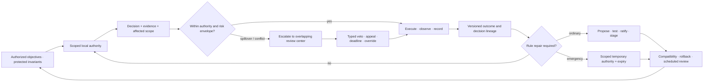

# Candidate 020: constitutionalized multi-level control plane

**Stage:** 1 — authority, aggregation, and rule-repair falsification

**Status:** held institutional composition; not an accepted project principle

**Primary question:** when persistent modules have asymmetric information,
partially conflicting incentives, or externally authorized standing, does
scoped multi-level authority with typed veto, contestable agenda, revocable
delegation, and versioned rule repair outperform ordinary systems governance?

## Applicability gate

Do not run this candidate when modules share one objective, cannot benefit from
misreporting, expose directly verifiable state, and operate under one
authorized owner. In that regime, constrained optimization, IAM, workflows,
and ordinary review should win. Political vocabulary does not create a
mechanism ([C-368](../../research/claims.md#c-368)–[C-395](../../research/claims.md#c-395)).

The candidate is applicable only when at least one of the following is real
and measurable:

1. persistent private information that matters to a shared decision;
2. local incentives that can benefit from a misleading report or agenda;
3. cross-boundary spillovers that no single local controller observes;
4. externally authorized protected interests that aggregate reward may not
   trade away; or
5. higher-order rules that must resist ordinary updates yet remain repairable.

## Control lifecycle

Editable source:
[constitutional-control-plane.mmd](../../assets/diagrams/constitutional-control-plane.mmd).

## Comparison vector

Report outcomes as

$$
\mathbf z=(Q,E,T,B,H_{\max},G,C,R,U),
$$

where $Q$ is task quality in a declared task unit, $E$ energy in joules, $T$
latency in seconds, $B$ communication in bytes, $H_{\max}$ worst protected-
interest loss in the task unit, $G$ unresolved-decision time in seconds, $C$
capture/influence diagnostics as declared dimensionless indices, $R$ rule
changes per $10^3$ episodes, and $U$ human oversight in person-minutes. Do not
collapse these units without authorized conversion weights and sensitivity
analysis.

Delegation concentration uses the Herfindahl index

$$
H_d=\sum_{i=1}^{n}w_i^2,
$$

where $w_i\ge0$ is proxy $i$'s fraction of active decision weight and
$\sum_iw_i=1$. $H_d$ is dimensionless and says nothing by itself about
competence, legitimacy, or correctness.

## Strongest null stack

1. one declared objective plus non-tradable constraints;
2. calibrated prediction and uncertainty;
3. typed IAM/capabilities and deterministic interlocks;
4. constrained or model-predictive control with spillover terms;
5. independent test ownership and randomized withheld evaluation;
6. static separation of duties and conflict disclosure;
7. fixed typed protocols, schema registry, and compatibility tests;
8. append-only decision, evidence, and change lineage;
9. mature incident command, rollback, and postmortems;
10. switching-cost-aware exploration and protected canaries; and
11. human authorization of standing, protected interests, exceptions, and
    amendment rules.

## Matched-budget and resource parity

Pair governance arms on objectives and protected invariants, private
information, proposal set and order, evaluator assignments, shocks, fault and
capture seeds, action authority, and decision deadlines. Equalize observations,
models, sensors, actuators, reserve, proposal and evaluator calls, messages,
compute, storage, deployment windows, measured energy, enforcement capacity,
accessibility support, and human person-minutes. Charge appeals, recusals,
replacement reviewers, veto delay, emergency handoff, rollback, compatibility,
and rule maintenance to the arm that invokes them. An unresolved decision or
unused authority budget is reported rather than silently replaced after the
outcome is known.

## Experiment families

### A — aggregation, strategy, and agenda

Cross binary agreement, restricted preference domains, cycles, correlated
errors, private stakes, omitted alternatives, proposal order, and fallback.
Compare constrained optimization, scoring, pairwise/Condorcet rules,
randomized choice, independent proposal channels, and the candidate at equal
observations, proposal calls, messages, and compute.

### B — delegation and revocation

Cross topic competence, correlated misinformation, cycles, super-proxies,
compromise, and identity reset. Compare direct choice, calibrated competence
routing, local delegation, optimized delegation, and capped revocable
delegation. Measure error, calibration, $H_d$, cycle rate, revocation latency,
error amplification, bytes, and joules.

### C — central, local, and overlapping authority

Use heterogeneous local demand, shared scarcity, spillovers, correlated faults,
and local capture. Compare global control, hierarchy/sharding, local autonomy
with exception escalation, and overlapping centers at equal models, sensors,
actuators, reserve, compute, and communication.

### D — typed veto and protected-interest frontier

Cross rare catastrophic protected loss with benign noisy warnings. Compare
scalar reward, hard constraints, quorum, independent veto, and typed veto with
scope, evidence, appeal, deadline, override, and expiry. Include status-quo
harm and gridlock; retire this component if ordinary constraints dominate.

### E — capture and collective-action pressure

Give persistent modules costly maintenance contributions and private influence
over proposals, tests, telemetry, or evaluators. Cross real expertise with
connection so capture can be distinguished from competent influence. Compare
central provision, fixed contracts, separation of duties, evaluator rotation,
independent raw evidence, and Candidate 008.

### F — constitutional repair and emergency authority

Expose immutable rules, administrator overwrite, policy-as-code, and the
candidate to legitimate drift, incumbent self-dealing, urgent hazards, stale
emergency state, and irreversible transitions. Equalize tests, reviewers,
deployment windows, and storage; measure unauthorized change, rule churn,
severe-harm escape, rollback, emergency duration, and restoration latency.

### G — human participation and path dependence

Where humans authorize objectives, compare representative review, direct
participation, deliberative sampling, and stratified contestable review at
equal person-minutes and accessibility support. Separately randomize early
exposure, evaluator assignment, conventions, and authority, then match final
conditions and ablate reinforcement mechanisms.

## Confirmatory analysis and statistical plan

Pair arms on scenario seed, information allocation, proposal order, reviewer
and proxy identities, protected-interest exposure, faults, shocks, and action
opportunities. Freeze standing, authority, conflict and recusal rules,
aggregation and veto procedures, emergency expiry, outcome definitions, and
human-authorized conversion weights before revealing held-out task families,
strategic identities, correlated-model failures, rare protected harms, and
legitimate rule drift. Treat an independently generated scenario or governance
lineage as the sampling unit; decisions, appeals, and participants within it
remain clustered.

The confirmatory comparison is the candidate against constrained optimization
plus typed IAM, deterministic interlocks, independent evaluation, append-only
lineage, and ordinary incident governance under the matched resource vector.
Estimate paired effects and uncertainty with a scenario-level hierarchical
model or cluster bootstrap. Report task quality, worst protected-interest loss,
unresolved-decision time, capture diagnostics, authority violations, and the
complete lifecycle vector; a higher decision count or amendment rate is not a
benefit by itself. Tail and severe-harm outcomes receive direct interval or
bound estimates rather than normal approximations when sparse.

Preregister one primary contrast for each experiment family and a gate from
task/protected outcomes to mechanism claims. Control familywise error across
governance forms, perturbations, and outcome strata with a declared
multiplicity procedure. Distinct protected interests, procedural outcomes,
status-quo harm, and common-cause failure remain visible and are not averaged
away by aggregate reward.

Unresolved decisions, incomplete appeals or remedies, unavailable reviewers,
emergency authority still active at the horizon, failed rollback, and denied
practical participation are outcomes. Decision and restoration times are
right-censored at the preregistered horizon; missing telemetry, undisclosed
conflicts discovered later, and inaccessible participants are tabulated by arm
and cause. Use bounded sensitivity analyses for remaining missing outcomes and
do not make a completer-only analysis primary.

Apply the applicability gate before the experiment and the promotion or kill
rules once to the held-out estimates and uncertainty intervals. Protected-
interest definitions, conversion weights, and acceptance margins must be
human-authorized or derived from the task contract, measurement resolution, or
baseline variability before allocation. Post-hoc changes to standing, burden,
or decision rules cannot support confirmation.

## Ablations

1. Replace scoped authority with one global administrator.
2. Remove agenda/proposal lineage.
3. Remove veto scope, evidence, deadline, or appeal one at a time.
4. Make delegation irrevocable or unbounded.
5. Hide evaluator/proposer dependency edges.
6. Merge ordinary and constitutional rule updates.
7. Remove emergency expiry and checked handoff.
8. Replace protected outcomes with one mean reward.
9. Remove human attention and participation cost.
10. Remove shared-model/data correlation from the threat model.

## Promotion and kill rules

Advance only in systems that pass the applicability gate, improve task-native
or protected outcomes in at least two independent task families, beat the full
null stack at equal end-to-end cost, survive correlated-model and strategic-
identity attacks, and preserve normative commitments as explicit human-
authorized inputs.

Merge or retire when modules share one loss and directly verifiable state;
constrained optimization plus IAM and policy-as-code matches the frontier; a
veto merely freezes a harmful status quo; delegation loses after competence
and correlation controls; amendment activity substitutes for repair quality;
or participation increases activity without information, inclusion,
protection, or decision gains.

## Evidence links

- [Social-choice and institutional-governance audit](../../research/audits/2026-08-05-social-choice-institutions.md)
- [Candidate 008](008-contestable-modular-allocation.md)
- [Candidate 011](011-dual-loop-operational-assurance.md)
- [Candidate 012](012-latency-qualified-authority.md)
- [Candidate 015](015-versioned-repairable-conventions.md)
- [Candidate 016](016-conflict-bounded-unit-transition.md)

## Supply-chain operations-research track

**Applicability.** Invoke governance only when separate organizations or agents
possess strategic private information, distinct rights, or enforceable
contracts. See the
[supply-chain audit](../../research/audits/2026-08-05-supply-chain-operations-research.md#exact-candidate-refinements).
Evidence: [C-627](../../research/claims.md#c-627),
[C-659](../../research/claims.md#c-659)–[C-678](../../research/claims.md#c-678).

**Strongest OR nulls.** Centralized stochastic/robust optimization, admission
and feasibility control, contract-constrained allocation, min-cost flow,
inventory and sourcing optimization, and direct measurement of supplier
reliability and common-cause dependence.

**Matched-budget test.** Cross cooperative versus strategic suppliers, private
capacity/cost information, correlated outages, qualification delay, and
contractual rights; equalize data, inventory, qualified capacity, reserve,
routes, messages, compute, enforcement, and human governance across centralized
control and constitutionalized arms.

**Service and recovery measurements.** Report feasible commitments, unit
fill/OTIF, tail delay, service disparity across protected counterparties,
qualified deliverable capacity, degraded-service area, backlog-clearance and
reserve-restoration hours, second-event service, currency, joules, and human
governance hours.

**Rejection gate.** Reject the governance transfer when actors share one loss
and directly verifiable state, when supplier diversity is only nominal, or when
centralized optimization plus ordinary contracts/admission matches service,
rights, and recovery outcomes at lower lifecycle cost.

## Burden-qualified contestable-decision track

The [legal evidence/procedure audit](../../research/audits/2026-08-05-legal-evidence-procedure.md#candidate-coverage-and-exact-refinements)
adds a conflict registry, recusal trigger, independently assigned replacement,
practical notice/access/response state, affected-interest and burden records,
reason requirement, typed appeal/review, executable remedy, and protected
procedural outcomes that cannot be traded silently for aggregate reward.

Evidence: [C-679](../../research/claims.md#c-679)–[C-704](../../research/claims.md#c-704).

Inject self-reported and hidden conflicts, correlated reviewers, unusable
notice, unequal response capacity, emergency deadlines, selected appeals,
incomplete remedies, and finality/reopening limits. Compare ordinary separation
of duties, conflict-of-interest controls, independent review, access-control
workflows, and calibrated decision rules under equal authority, information,
human effort, delay, compute, and energy. Reject if governance is invoked
without distinct protected interests or if the conventional stack matches both
task and procedural outcomes.
