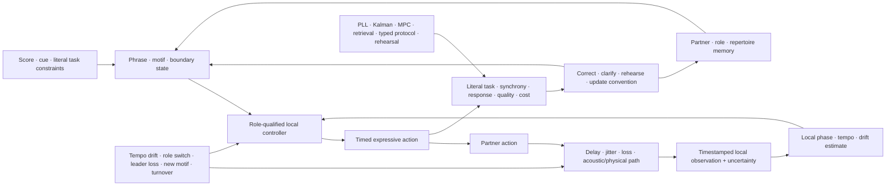

# Fixture F-001 — Shared-clock-free predictive co-adaptation

- **Status:** benchmark fixture; no new principle or candidate
- **Primary owners:** [Candidate 002](../candidates/002-multiscale-context-broadcast.md),
[Candidate 015](../candidates/015-versioned-repairable-conventions.md), and
[Candidate 019](../candidates/019-audited-cumulative-inheritance.md)
- **Evidence source:** [music cognition and improvisation audit](../../research/audits/2026-08-05-music-cognition-improvisation.md)
- **Mathematics:** [predictive temporal co-adaptation](../../math/predictive-temporal-coadaptation.md)

## Question

Can locally clocked agents maintain literal phrase constraints, bounded relative
timing, role correctness, and useful partner response while tempo,
microtiming, delay, packet loss, roles, motifs, leaders, and partners change?
Does the full composition beat conventional estimation, control, retrieval,
and explicit protocol state after all adaptation and communication costs?

The fixture does not test whether output sounds “creative.” It separately
measures timing control, sequence prediction, partner identification, phrase
response, convention repair, turnover, and cost.

## Information boundary

The simulator retains a global event clock only for paired scoring and
disturbance injection. No agent receives it. Each agent sees:

1. its own drifting local clock;
2. delayed, jittered, noisy, or missing partner events;
3. the literal task constraints and its current role/version;
4. its own action and local outcome history;
5. messages admitted by the common byte/rate budget; and
6. its bounded partner, phrase, and repertoire memory.

Agents never see hidden tempo, partner policy identity, future events,
perturbation time, evaluator alignments, or another agent's internal state.

Editable source:
[shared-clock-free-coadaptation.mmd](../../assets/diagrams/shared-clock-free-coadaptation.mmd).

## Scenario generator

Use duets and quartets with event-level acoustic or symbolic interfaces. The
confirmatory suite crosses:

- stable tempo, linear ramps, piecewise drift, phase jumps, syncopation,
  missing pulses, and nonperiodic control sequences;
- expressive microtiming whose signed deviations carry a phrase or role cue;
- symmetric and asymmetric delay, correlated jitter, burst loss, and stale
  acknowledgement;
- fixed roles, announced switching, ambiguous switching, leader failure, and
  simultaneous claims to leadership;
- exact, transformed, and novel motifs with leakage-audited train/evaluation
  families;
- familiar partners, unseen policies, mixed-version partners, and full partner
  turnover; and
- within-population conventions, cross-population exchange, repair, and one
  protected literal meaning that must not drift.

Development and confirmatory seeds, motif families, partner policies, delay
processes, role-switch times, and protected messages are frozen separately.

## Arms

| ID | Method | Added state |
| --- | --- | --- |
| B0 | fixed-gain pairwise phase correction | phase and fixed correction gain |
| B1 | tuned PLL or adaptive oscillator | phase, frequency, confidence |
| B2 | Kalman/state-space online identification | declared timing and delay state |
| B3 | distributed MPC | horizon state and constrained local actions |
| B4 | centralized conductor | privileged coordinator, paid clock/traffic/infrastructure |
| B5 | B2/B3 + transformation-aware retrieval | partner/motif cases under the common memory budget |
| B6 | B5 + typed role/version protocol and repair | explicit messages, acknowledgements, expiry, rollback |
| F1 | full fixture composition | local phase plus multiscale phrase, partner memory, repair, turnover |
| O0 | trace-aware oracle | hidden-state ceiling; never an inferential competitor |

Every baseline is tuned under the same configuration count and compute budget.
B4 may coordinate centrally but pays every message, synchronization operation,
failure domain, and recovery action. O0 is labeled unattainable.

## Equal-budget contract

All inferential arms receive identical:

1. sensor and action interfaces, uncertainty, and event availability;
2. parameter, working-state, partner-memory, and replay-byte ceilings;
3. update frequency, compute operations, wall-clock deadline, and actuator
   budget;
4. training examples, partner interactions, rehearsal events, evaluator
   queries, and hyperparameter trials;
5. explicit message rate and cumulative byte budget;
6. disturbance, partner, role, and motif trajectories for every paired seed;
7. fallback, checkpoint, recovery, and post-event observation window; and
8. wall-power or calibrated device-energy boundary.

An over-budget arm is infeasible for that seed. It is not normalized into
compliance afterward.

## Measurements

Report at least:

- signed pairwise onset error, median and $p_{95}$ absolute onset error in
  milliseconds, circular phase error in radians, and missed/duplicated events;
- literal constraint success, phrase-response accuracy, calibration, protected-
  meaning failure, role violation, false role switch, and unresolved repair;
- recovery seconds after each timing, delay, role, leader, motif, and partner
  perturbation, with censoring retained;
- familiar-to-unseen partner gap and retention after delayed partner return;
- messages/event, bytes/event, parameter and memory bytes, evaluator queries,
  adaptation and rehearsal events, and decision latency;
- sensing, estimation, prediction, retrieval, communication, action,
  adaptation, rehearsal, and recovery joules; and
- blinded coherence/expressivity judgments as a separate secondary outcome.

No weighted “musicality” or “coordination” score may replace the vector.

## Ablations

Run F1 with each of these removed while holding all other resources fixed:

1. local persistent phase state;
2. phrase/motif hierarchy;
3. partner-specific memory;
4. typed role and convention state;
5. repair and explicit acknowledgement;
6. turnover rehearsal;
7. uncertainty propagation; and
8. separate timing and phrase-error loops.

An ablation earns causal credit only if its removal harms the preregistered
target outcome without gifting its resource budget to another component.

## Analysis

Use at least 30 paired confirmatory seeds per preregistered scenario family.
Resample seed, ensemble, and perturbation event hierarchically. Report paired
effects and 95% intervals against B2, B3, and B6 with multiplicity correction.
Partner identity, motif family, delay regime, ensemble size, and role-change
type are effect modifiers rather than pooled nuisance variables.

Non-inferiority margins for literal success and protected meaning, material
improvement thresholds for timing/recovery, and the full energy/communication
acceptance rule must be frozen before confirmatory seeds are opened.

## Rejection rule

Retire the residual and keep the fixture as a negative result if any applies:

1. B2/B3 matches timing, perturbation recovery, and energy;
2. B6 matches phrase response, role safety, repair, and partner turnover;
3. F1 uses the evaluator clock, hidden tempo, future role, or partner identity;
4. familiar-partner gain disappears on new motifs or is explained by retrieval;
5. timing gains reduce literal task success or protected-meaning retention;
6. any claimed advantage disappears after messages, rehearsal, evaluator work,
   adaptation, recovery, and centralized infrastructure are charged;
7. no ablation isolates value beyond the complete conventional stack; or
8. the advantage fails on unseen partners and at least two distinct delay/
   tempo regimes.

A pass allows the owning candidates to cite one shared benchmark result. It
does not create Candidate 021 or a music-specific principle.
