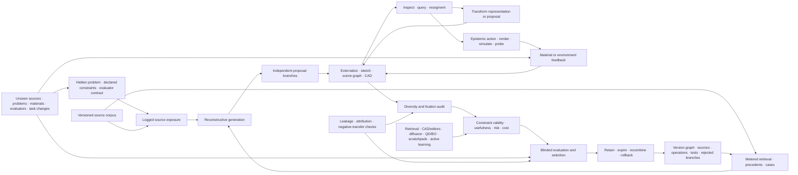

# Fixture F-002 — Versioned reconstructive design

- **Status:** benchmark fixture; no new principle or candidate
- **Primary owners:** [Candidate 004](../candidates/004-closed-endogenous-curriculum.md)
  and [Candidate 019](../candidates/019-audited-cumulative-inheritance.md)
- **Constraint owners:** [Candidate 014](../candidates/014-versioned-observation-contract.md)
  and [Candidate 017](../candidates/017-contract-preserving-semantic-compaction.md)
- **Evidence source:** [visual art and design cognition audit](../../research/audits/2026-08-05-visual-art-design-cognition.md)
- **Mathematics:** [versioned reconstructive design contract](../../math/versioned-reconstructive-design.md)

## Evidence links

The direct evidence range is [C-842](../../research/claims.md#c-842)–[C-860](../../research/claims.md#c-860). The range supplies traceability to the scoped source claims; the fixture remains a joint engineering test.

## Question

Can a system reconstruct from declared exposure, externalize editable state,
inspect and transform that state, buy informative tests, incorporate material
feedback, preserve independent branches, and select a valid proposal while
retaining attributable lineage? Does the complete loop beat mature retrieval,
generation, optimization, interactive-tool, and version-control stacks at the
same lifecycle budget on unseen problems, sources, materials, and evaluators?

This fixture tests reconstructive creativity directly. Nothing is scored as
novel without a declared comparison history. Copying or analogy can preserve a
useful relation, transform it, or induce fixation and negative transfer.
Correctness and usefulness come from constraint satisfaction, tests, observed
outcomes, and qualified evaluation—not distance from a source.

## Construct and information boundary

The evaluator maintains the complete source, problem, material, constraint,
and derivation trace for scoring. A tested method receives only its assigned:

1. pre-task source exposure, logged independently of retrieval;
2. retrieval interface, with every query and returned version charged;
3. visible brief and visible constraint subset;
4. editable representations and transformations allowed by its arm;
5. simulation, rendering, sensing, or fabrication actions under a common
   action budget;
6. returned observations at declared fidelity and uncertainty;
7. evaluator access admitted by the common query budget; and
8. its own retained versions, tests, attribution, and lineage records.

Methods never receive hidden constraints, source-family labels, material
parameters, failure cases, evaluator identities, future task changes, or the
benchmark's true influence graph. Training contamination and prior exposure
are audited separately from in-task retrieval.

Editable source:
[versioned-reconstructive-design.mmd](../../assets/diagrams/versioned-reconstructive-design.mmd).

## Task families and hidden splits

The confirmatory suite contains three task families with distinct truth
conditions:

1. **Visual reconstruction.** Reconstruct a scene after controlled exposure.
   Score object identity, spatial relations, topology, scale, source memory,
   attribution, and delayed reconstruction.
2. **Functional design.** Produce an artifact that must satisfy hidden
   geometry, load, thermal, accessibility, manufacturability, user, and failure
   constraints in simulation and selected physical tests.
3. **Open visual communication.** Produce a graphic for heterogeneous viewers.
   Score comprehension, delayed recall, error, accessibility, and observer-
   qualified preference separately.

Freeze development and confirmatory partitions across:

- source families, styles, precedent density, and analogical distance;
- problem structures, visible/hidden constraint ratios, and change points;
- representation formats and lossy conversion paths;
- simulated and physical materials, constitutive regimes, and tool errors;
- evaluator populations, expertise, context, and objective disagreement; and
- actor/tool turnover, archive damage, and delayed reconstruction horizons.

At least one confirmatory stratum combines an unseen problem family, unseen
material regime, and unseen evaluator population. No development result from
that joint stratum is reusable.

## Operational loop

Each episode follows a typed, inspectable sequence:

1. **Reconstruct.** Generate proposals from declared exposure, explicit
   retrieval results, task state, and retained lineage.
2. **Externalize.** Commit each branch to an editable representation with a
   declared fidelity and operation set.
3. **Inspect.** Query, resegment, compare, or measure the representation;
   register any newly perceived relation before editing.
4. **Transform.** Revise content or change representation while logging parent,
   operation, losses, actor, sources, and timestamp.
5. **Evaluate.** Buy simulations, renders, user queries, or physical probes;
   incorporate material feedback with uncertainty.
6. **Select.** Apply hard validity gates, then blinded multi-objective
   evaluation and a preregistered selection rule.
7. **Retain.** Preserve the selected version, rejected branches, tests,
   attribution, dependencies, expiry, and rollback path.

Generation, epistemic action, representation change, material feedback,
evaluation, and retention must have distinct event types. A generic “reasoning
step” cannot receive causal credit for all six.

## Mature null stack and arms

| ID | Method | Required implementation |
| --- | --- | --- |
| B0 | exact/approximate retrieval and case-based design | catalogs, precedents, nearest neighbors, source attribution |
| B1 | editor/CAD workflow | layers, constraints, parametric edits, undo/redo, branches, ordinary version control |
| B2 | diffusion or comparable generative model | conditional sampling, inpainting, interpolation, prompt ensembles, rejection sampling |
| B3 | explicit search and optimization | beam or Monte Carlo search, evolutionary search, quality-diversity, Bayesian optimization |
| B4 | external-workspace stack | scratchpad, shared canvas/blackboard, structured intermediate serialization, retrieval augmentation |
| B5 | active evidence stack | active learning, value of information, simulation/digital twin, experiment design, physical probing |
| B6 | complete ordinary composition | B0–B5 plus independent reranking and Git/W3C-PROV-like lineage |
| F1 | full reconstructive fixture composition | versioned loop, source/exposure separation, private branches, typed feedback, fixation monitor, retained lineage |
| O0 | trace-aware oracle | hidden constraints and true derivation graph; unattainable ceiling only |

B0–B5 are diagnostic baselines and may be combined. B6 is the decisive
competitor: F1 earns no credit for beating an intentionally incomplete tool.
Every arm uses the same underlying pretrained model where technically possible;
otherwise model capacity, training data, and pretraining compute are reported
and bounded before the run.

## Equal-budget contract

All inferential arms receive identical:

1. source-exposure count and duration, retrieval-query and returned-byte
   ceilings, and source-version cutoff;
2. parameter, working-state, archive, and lineage-byte ceilings;
3. proposal count, branch count, transformation count, and operation set;
4. simulation, render, sensor, physical probe, and evaluator-query counts;
5. training examples, adaptation events, hyperparameter trials, and random
   seeds;
6. human preparation, operation, critique, and evaluation time in seconds;
7. compute operations, wall-clock deadline, peak bytes, and calibrated energy
   boundary in joules;
8. physical material and waste budgets in kilograms and facility-use time in
   seconds; and
9. checkpoint, failure recovery, post-selection observation, and delayed
   reconstruction windows.

An arm that exceeds any binding ceiling is infeasible for that paired instance.
It is not normalized into compliance afterward. If exact matching is
impossible, preregister the Pareto-frontier comparison instead.

## Measurements

Report the full vector, never a single creativity score:

- constraint validity and every task-native margin, violation, failure mode,
  and safety breach;
- novelty relative to the frozen declared history under task-native and
  independent representations;
- valid proposal count, category/behavior coverage, pairwise diversity, and
  independent-branch survival;
- copying/analogy distance, structural transfer, fixation toward each example,
  and outcome-specific negative transfer;
- registered reinterpretation events, information gain in bits, informative
  actions per episode, and decision value per action cost;
- representation conversion loss, reversibility, missing relations, recovery
  after an early wrong turn, and rollback success;
- task utility, observer- and context-qualified evaluation, risk, calibration,
  selected-proposal regret, and realized post-selection outcome;
- source-attribution precision/recall, lineage-edge precision/recall, rejected-
  branch retention, dependency invalidation, and delayed reconstructability;
- source/retrieval/proposal/evaluator/probe counts, human and wall time in
  seconds, storage in bytes, energy in joules, material/waste in kilograms,
  and recovery cost; and
- transfer gaps for new problem, source, material, evaluator, representation,
  actor, and tool regimes.

Novelty, validity, usefulness, aesthetic response, and selection quality remain
separate even when a deployment decision uses an explicit weighted rule.

## Ablations

Run F1 with each component removed while keeping its budget unavailable:

1. separation of passive source exposure from active retrieval;
2. editable external representation;
3. inspection/resegmentation before transformation;
4. representation-format change;
5. epistemic action choice;
6. material/environment feedback;
7. parallel independent proposal branches;
8. fixation and negative-transfer monitoring;
9. hidden-constraint validity gate;
10. independent blinded evaluator and explicit selection rule;
11. source attribution and operation-level provenance;
12. rejected-branch retention; and
13. version lineage, invalidation, rollback, and turnover reconstruction.

Also run source substitution, source removal, history scrambling, exemplar
timing, shared-versus-private branch reveal, critique timing, evaluator swap,
material swap, and representation-conversion interventions. An ablation is
diagnostic only if it isolates its preregistered target without reallocating
compute, queries, proposals, or human time.

## Analysis and leakage control

Use at least 30 paired confirmatory instances per preregistered task-and-hidden-
regime stratum. Resample problem family, source family, material, evaluator,
actor, and random seed hierarchically. Report paired effects and 95% intervals
against B6, with multiplicity correction for the frozen primary outcomes.

Before opening confirmatory results:

1. inventory pretraining and task-specific exposure as far as technically
   observable;
2. freeze source hashes, version cutoffs, contamination probes, retrieval logs,
   hidden constraints, material parameters, and evaluator assignments;
3. require source, operation, parent, test, and actor records for every retained
   version;
4. keep the generator blind to novelty embeddings, hidden evaluator scores,
   true influence edges, and final constraint tests; and
5. freeze non-inferiority margins for validity and harm plus material
   improvement thresholds for selection regret, transfer, reconstruction, and
   lifecycle cost.

## Decisive retirement rules

Retire the composed residual and preserve F-002 as a negative benchmark if any
of the following applies:

1. B6 matches F1 on hidden constraint validity, selection regret, transfer,
   retained lineage, and lifecycle cost;
2. retrieval/case-based design explains the gain once source exposure and
   in-task retrieval are separated;
3. editor/CAD state plus ordinary version control matches reinterpretation,
   recovery, rollback, and delayed reconstruction;
4. diffusion sampling plus reranking matches valid novelty at the same proposal
   and evaluator budget;
5. beam, quality-diversity, evolutionary, or Bayesian optimization matches
   proposal coverage and selected outcome;
6. scratchpads or shared canvases match externalization while private pooling
   yields equal quality with less fixation;
7. active learning or value-of-information baselines match epistemic-action and
   material-feedback gains;
8. the advantage disappears on unseen problems, sources, materials,
   evaluators, representations, actors, or tools;
9. novelty depends on omitting relevant exposure or changing the declared
   history, metric, or embedding after results are visible;
10. copying or analogy increases fixation or negative transfer without a
    compensating preregistered validity or utility gain;
11. attribution, provenance, rejected branches, or dependency invalidation are
    incomplete enough to prevent independent reconstruction;
12. no single ablation identifies value beyond the complete ordinary stack;
13. hidden evaluator access, contamination, unlogged retrieval, or true-lineage
    leakage can explain the gain; or
14. any advantage vanishes after human labor, failed proposals, physical
    material, waste, evaluation, retention, and recovery are charged.

A pass allows the four owning candidates to cite one shared benchmark result.
It does not create a new principle, candidate, or general claim about
creativity.
