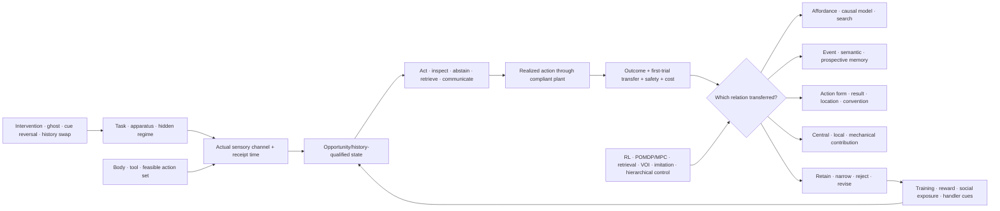

# Fixture F-003 — Opportunity- and history-qualified adaptive action

- **Status:** benchmark fixture; no new principle or candidate
- **Primary owners:** [Candidate 004](../candidates/004-closed-endogenous-curriculum.md),
  [Candidate 006](../candidates/006-reversible-physical-skill.md),
  [Candidate 007](../candidates/007-endogenous-observation-surveillance.md),
  [Candidate 014](../candidates/014-versioned-observation-contract.md),
  [Candidate 018](../candidates/018-value-reconstructability-aware-tiering.md), and
  [Candidate 019](../candidates/019-audited-cumulative-inheritance.md)
- **Evidence source:** [comparative cognition and tool-use audit](../../research/audits/2026-08-05-comparative-cognition-tool-use.md)
- **Mathematics:** [opportunity- and history-qualified action](../../math/opportunity-history-qualified-action.md)

## Evidence links

The direct evidence range is [C-804](../../research/claims.md#c-804)–[C-841](../../research/claims.md#c-841). The range supplies traceability to the scoped source claims; the fixture remains a joint engineering test.

## Question

Does a proposed adaptive system preserve and transfer the functional relation
in a task when material, geometry, cues, body, history, delay, demonstrator, or
control locus changes? Can the result be distinguished from affordance search,
ordinary reinforcement learning and planning, retrieval, value of information,
goal-conditioned imitation, centralized replay, passive mechanics, and
hierarchical control after all data, interaction, human, and energy costs are
charged?

The fixture is a test grammar. It does not aggregate species into a rank or
replace eight distinct constructs with a single “intelligence” score.

## Information and opportunity boundary

For every paired episode, publish the task/opportunity/history record
$\Omega=(X,S,A,H,R,C,\tau,U)$ defined in the
[mathematical contract](../../math/opportunity-history-qualified-action.md).
The runtime input contains only observations whose receipt time has passed.
The evaluator separately records hidden apparatus state, functional relation,
intervention identity, training regime, and paired counterfactual seed.

The record must include:

1. the actual sensory channel, including handler, demonstrator, apparatus,
   odor, sound, metadata, and residual-outcome cues;
2. the feasible motor set under the current body, tool, contact, payload, and
   sensor-use constraints;
3. all prior training, task exposure, social exposure, shaping, reward,
   deprivation, exclusion, and stopping rules;
4. commanded and realized actions with timestamps, units, failures, and
   actuator or material cost;
5. the intervention, randomization unit, site, partner or demonstrator, and
   control condition; and
6. episode, agent, dyad, group, and population identifiers needed to avoid
   treating repeated trials as independent agents.

Editable source:
[opportunity-history-qualified-action.mmd](../../assets/diagrams/opportunity-history-qualified-action.mmd).

## Eight diagnostic tracks

| ID | Held question | Required changes | Decisive ordinary nulls |
| --- | --- | --- | --- |
| T1 | affordance and manufacture transfer | material fracture, rigidity, length, geometry, waste, tool cost | learned affordances, retrieval, model-based RL, beam/MCTS search, program synthesis |
| T2 | causal transfer ladder | functional inversion, surface-cue reversal, novel equivalence, hidden connector, impossible control | feature RL, object-centric world model, retrieval, test-time reinforcement |
| T3 | future resource reservation | delayed use, room/context change, distractor, current/future goal conflict, carrying cost | value table, successor representation, MPC/POMDP, episodic retrieval |
| T4 | event memory | unique what–where–when event, changing decay law, post-encoding update, exception | semantic decay plus spatial memory, recurrent state, nearest-event retrieval, database |
| T5 | costed uncertainty control | perceptual versus memory difficulty, private versus public cue, abstain/repeat/sense/query cost | calibrated logits, ensembles, conformal/selective prediction, VOI/POMDP |
| T6 | copy-target decomposition | action form, result, trajectory, identity, embodiment, efficiency, causal relevance | behavior cloning, goal-conditioned imitation, inverse RL, ghost/result controls |
| T7 | social acquisition and cumulative work | rare independent discovery, correct/inefficient/adversarial seeds, network and teacher turnover | curriculum/shaping, central replay, explicit workflow artifacts, retrieval |
| T8 | local, central, and mechanical control | occlusion, contact, delay, load, segment loss, sensor failure, morphology change | centralized control, standard hierarchy, local reflexes, passive compliance |

Each track has separate development and confirmatory generators. A mechanism
may pass one track and fail another; passing is never inherited from a nearby
construct.

## Scenario generator

Freeze factorial scenario families before confirmatory evaluation:

- at least two task families per track, with leakage-audited training and test
  relations;
- familiar, rematerialized, regeometrized, cue-reversed, function-inverted,
  and impossible instances;
- at least two plant geometries and a body/tool swap that changes feasible
  sensing or action while preserving the intended outcome;
- naive, conventionally trained, overtrained, differently rewarded, socially
  exposed, and history-swapped agents;
- fixed, unreliable, absent, inefficient, and adversarial demonstrators, with
  ghost and result-only controls where applicable;
- immediate, delayed, interrupted, and context-separated use;
- low and high sensor noise, delay, occlusion, packet loss, and residual cues;
  and
- familiar and held-out sites, handlers, simulator builds, model families, and
  hardware classes.

Keep the first confirmatory trial as a distinct estimand. Later learning curves
remain useful, but they cannot be reported as zero-shot transfer.

## Arms

| ID | Method | Purpose |
| --- | --- | --- |
| B0 | model-free RL with declared task features | learned association and trial-course null |
| B1 | model-based RL or POMDP/MPC | explicit dynamics, belief, planning, and delayed choice |
| B2 | affordance model plus retrieval and budgeted tree search | object use, manufacture, and recombination null |
| B3 | factorized semantic/spatial/event cache | prospective and event-memory null |
| B4 | calibrated selective prediction plus value of information | uncertainty, checking, and acquisition null |
| B5 | behavior cloning, goal-conditioned imitation, and inverse RL | action-form, result, and inferred-goal nulls |
| B6 | central replay, curriculum, and versioned workflow artifacts | population acquisition and inheritance null |
| B7 | centralized, hierarchical, local-reflex, and passive-plant controllers | control-locus and mechanics nulls |
| F3 | full opportunity/history-qualified composition | proposed state, transfer, memory, social, and control composition |
| O0 | trace-aware oracle | hidden-state ceiling; never an inferential competitor |

All baselines receive serious tuning under the common configuration and compute
budget. The strongest baseline may differ by track; F3 must beat that baseline,
not an average of weak arms.

## Equal-budget contract

All inferential arms receive identical:

1. causally available sensor events, timestamps, calibration, and missingness;
2. feasible command and realized-action interfaces for the current plant;
3. training episodes, demonstrations, labeled outcomes, environment steps,
   resets, and intervention opportunities;
4. parameter, working-state, event-memory, replay, and external-storage bytes;
5. planning expansions, simulator rollouts, evaluator calls, update frequency,
   wall-clock deadline, and hyperparameter trials;
6. explicit communication rate, cumulative bytes, and partner access;
7. actuator work, material inventory, damage, unsafe-contact, carrying, and
   replacement budgets;
8. human shaping, demonstration, annotation, correction, and supervision in
   person-hours; and
9. wall-power or calibrated device-energy boundary, including sensing,
   interaction, communication, adaptation, recovery, and unused reservations.

An over-budget method is infeasible for that seed. Do not normalize it into
compliance afterward or gift an ablation's freed resources to another module.

## Measurements

Report a vector, stratified by track and opportunity/history condition:

- first-trial and terminal literal success, intervention-sensitive choice,
  exact functional relation, material waste, unsafe contacts, attempts, and
  abandoned or redundant actions;
- the full surface/material/relation/history/plant/social/delay transfer
  vector, including negative transfer and cue-reversal errors;
- action and manufacture latency in seconds, path and endpoint error in native
  units, recovery time in seconds, override latency, and stability violations;
- event-memory accuracy, update propagation, retained exception accuracy,
  calibration, risk–coverage–cost surfaces, queries, and abstentions;
- action-form, result, trajectory, identity, and causal-relevance uptake under
  ghost, result-only, inefficient, and novel-action controls;
- population task value, independent execution, diversity, lock-in, teacher
  dependence, turnover recovery, and cumulative work;
- model, memory, replay, and external-state bytes; planning expansions;
  messages and bytes; human person-hours; sensor-on time; and actuator wear;
  and
- training, demonstration, search, inference, sensing, interaction,
  communication, storage, adaptation, recovery, and total lifecycle joules.

No weighted “cognition,” “flexibility,” or “intelligence” scalar may replace
the vector.

## Ablations

Run F3 with each of these removed while all other resources remain fixed:

1. explicit actual-channel and receipt-time state;
2. feasible-action and plant-version state;
3. training, reward, and social-exposure history;
4. first-trial versus later-adaptation separation;
5. intervention and functional-relation labels;
6. bound event memory;
7. demonstration-component decomposition;
8. costed uncertainty and explicit abstention;
9. local state and local sensing; and
10. population lineage and cumulative-work accounting.

An ablation earns causal credit only when it damages its preregistered target
outcome. If removal changes only the narrative label, delete the component.

## Analysis

Randomize and analyze at the unit receiving the intervention. Use hierarchical
models or hierarchical bootstrap across seed, model instance, plant, agent,
dyad/group, site, and scenario as applicable. Repeated episodes do not create
new independent agents.

Preregister paired contrasts against the strongest track-specific baseline,
95% intervals, multiplicity control, non-inferiority margins for protected
literal outcomes, material-improvement thresholds, and minimum transfer
strata. Report failures, exclusions, first trials, stopping rules, unused
budget, and complete trial courses.

A claimed residual must replicate across at least two task families, plant
geometries, acquisition histories, model families, and hardware classes.

## Rejection rule

Retire the architectural residual and preserve the measurement contract when
any relevant condition holds:

1. affordance learning plus search matches tool or manufacture transfer;
2. feature or model-based RL matches intervention-sensitive transfer;
3. a value table, successor representation, POMDP, or retrieval matches future
   preparation;
4. semantic decay plus spatial memory matches the event-memory result;
5. calibrated confidence or ordinary value of information matches checking;
6. goal-conditioned imitation or result learning explains social acquisition;
7. curriculum or centralized replay matches population learning at lower
   cumulative cost;
8. passive mechanics or standard hierarchical control matches local control;
9. gain disappears after an actual sensory cue, feasible action, training
   history, reward schedule, site, handler, or first-trial confound is exposed;
10. improvement requires more data, demonstrations, search, interaction,
    storage, communication, human effort, damage, or lifecycle energy;
11. no ablation isolates value beyond the complete conventional stack; or
12. the result fails the frozen cross-task, cross-plant, cross-history,
    cross-model, or cross-hardware replication requirement.

A pass refines the owning candidates. It does not create Candidate 021 or a
species-derived architecture label.
