# Fixture F-004 — Versioned proof discovery and verification

- **Status:** benchmark fixture; no new principle or candidate
- **Candidate owners:**
  [004 — closed endogenous curriculum](../candidates/004-closed-endogenous-curriculum.md),
  [009 — graded assurance envelopes](../candidates/009-graded-assurance-envelopes.md),
  [010 — reset-coupled staged verification](../candidates/010-reset-coupled-staged-verification.md),
  [011 — dual-loop operational assurance](../candidates/011-dual-loop-operational-assurance.md),
  [014 — versioned observation contracts](../candidates/014-versioned-observation-contract.md),
  [017 — contract-preserving semantic compaction](../candidates/017-contract-preserving-semantic-compaction.md),
  and [019 — audited cumulative inheritance](../candidates/019-audited-cumulative-inheritance.md)
- **Evidence source:**
  [mathematical-practice and proof-discovery audit](../../research/audits/2026-08-05-mathematical-practice-proof-discovery.md)
- **Mathematics:**
  [proof-discovery and verification contract](../../math/proof-discovery-verification-contract.md)

## Evidence links

The direct evidence range is [C-861](../../research/claims.md#c-861)–[C-880](../../research/claims.md#c-880). The range supplies traceability to the scoped source claims; the fixture remains a joint engineering test.

## Question

At equal lifecycle budget, does a versioned
**propose–challenge–decompose–prove–check–publish–invalidate** system discover,
verify, maintain, and transfer more valid results than the complete relevant
formal-methods and mathematical-review stack? Does any advantage survive
immutable problem and library identity, dependency-safe leakage controls,
hidden task families, independent certificate checking, definition and library
changes, human-effort accounting, and electrical-energy accounting?

The fixture separates candidate production from acceptance. A conjecture may
be interesting without being true; finite tests may support it without proving
it; a formal proof may check while formalizing the wrong statement; and a
published checked result may become invalid when one of its versioned
dependencies changes.

## Identity and acceptance boundary

Before any arm receives an instance, seal the identity envelope $I_e$ defined
in the [mathematical contract](../../math/proof-discovery-verification-contract.md):

1. exact problem statement, definitions, encodings, declared logic, semantics,
   and admitted axioms;
2. accessible theorem, definition, tactic, proof, example, counterexample, and
   source-library versions;
3. retrieval index, corpus cutoff, generated-family identity, and training,
   prompt, retrieval, evaluation, proof-trace, and human-hint access;
4. solver, parser, elaborator, preprocessor, certificate calculus, checker,
   build tool, and hardware versions; and
5. hidden-family generator, paired random seed, resource ceilings, and release
   schedule.

Every input, proposal, proof DAG, model, certificate, checker verdict,
publication, dependency change, repair, and retraction is append-only and bound
to immutable hashes. Hash equality establishes byte identity only; independent
statement review and adversarial examples test whether the encoding captures
the intended problem.

```mermaid
flowchart LR
    identity["Immutable identity<br/>problem · definitions · logic · library · corpus · checker"] --> propose["PROPOSE<br/>conjecture · analogy · abstraction · candidate proof"]
    split["Dependency-safe split<br/>ancestor · sibling · restatement · source isolation"] --> propose
    propose --> challenge["CHALLENGE<br/>examples · countermodels · adversarial cases · critique"]
    challenge -->|"valid counterexample"| refuted["REFUTED<br/>typed counterexample + domain witness"]
    challenge -->|"survives finite tests"| tested["TESTED<br/>support range + precision + generator"]
    challenge --> revise["Revise statement · definition · abstraction"]
    revise --> propose
    challenge --> decompose["DECOMPOSE<br/>goal DAG · lemmas · interfaces · side conditions"]
    abstraction["Abstraction obligations<br/>soundness · adequacy · reconstruction · excluded cases"] --> decompose
    decompose --> prove["PROVE<br/>proof term · solver trace · model · exact finite reduction"]
    prove --> check["CHECK<br/>independent kernel or certificate checker"]
    separation["Generator/checker separation<br/>different identity · frozen input hash · explicit shared roots"] --> check
    check -->|"accepted certificate"| proved["PROVED<br/>scoped proposition + dependency closure"]
    check -->|"failed or unsupported"| unknown["UNKNOWN<br/>timeout · incomplete theory · malformed certificate"]
    refuted --> publish["PUBLISH<br/>versioned artifact · state · evidence · provenance · cost"]
    tested --> publish
    proved --> publish
    unknown --> publish
    disputed["DISPUTED<br/>formalization · assumptions · significance · review"] --> publish
    publish --> registry["Release registry<br/>proved · refuted · tested · unknown · disputed · retracted"]
    registry --> change["Dependency, definition, checker, or library change"]
    change --> invalidate["INVALIDATE<br/>reverse dependency closure · quarantine · recheck"]
    invalidate --> retracted["RETRACTED<br/>superseded state + reason + affected versions"]
    invalidate --> challenge
    nulls["Mature null stack<br/>ITP · ATP · CDCL · SMT · CP/MIP · model finding · CEGAR/CEGIS<br/>formal libraries · learned guidance · exact numerics · peer review"] --> compare{"Equal lifecycle budget<br/>hidden families · human-hours · joules"}
    registry --> compare
    compare --> retain["Retain only measured residual<br/>otherwise retire composition"]
```

Editable source:
[versioned-proof-discovery-lifecycle.mmd](../../assets/diagrams/versioned-proof-discovery-lifecycle.mmd).

## Typed artifact states

Every published artifact has exactly one current lifecycle state while retaining
its full state history.

| State | Minimum admissible record | Explicitly does not establish |
| --- | --- | --- |
| `proposed` | statement, definitions, ancestry, transformation, obligations, identity envelope | empirical support, derivability, significance |
| `tested` | test generator or finite range, samples, precision, seeds, outcomes, failures | truth outside the tested region |
| `proved` | exact proposition, complete dependency closure, reconstructible proof DAG, accepted proof or refutation certificate, checker identity | faithful formalization, physical truth, importance |
| `refuted` | admissible counterexample with domain witness or checked refutation bound to the exact statement | the unique or best repaired statement |
| `unknown` | timeout, incomplete theory, unsupported result, malformed certificate, or unresolved obligation | truth or falsity |
| `disputed` | challenge target, version, reason, evidence, reviewer identity, and response deadline | that the checked derivation has already failed |
| `retracted` | superseded version, invalidating event, reverse-dependency closure, quarantine and repair record | deletion of the historical artifact |

`Sat`, `unsat`, `unknown`, numerical agreement, peer acceptance, and kernel
acceptance remain distinct evidence events. No text-only confidence label can
promote an artifact to `proved` or `refuted`.

## Hidden task families

Freeze development, public validation, and sealed confirmatory generators. The
confirmatory suite contains at least these families:

1. **Conjecture and analogy.** Combinatorics, algebra, number sequences, graph
   properties, and small programs with true statements, attractive false
   generalizations, distant structural analogs, surface-matched distractors,
   isomorphic ancestors, and definition shifts.
2. **Abstraction and representation.** Matched problems expressed as algebra,
   term graphs, diagrams, tables, geometric objects, executable constraints,
   and quotient structures; hidden cases expose lost side conditions,
   degeneracy, unsound orbit merging, or failed round trips.
3. **Proof decomposition.** Theorems with planted useful, irrelevant,
   circular, incompatible, and globally coupled lemma interfaces. The evaluator
   knows the complete target dependency DAG but never reveals it to an arm.
4. **Automated reasoning.** First-order theorem proving, propositional SAT,
   SMT over declared theories, constraint programming, mixed-integer models,
   bounded model finding, and synthesis tasks with satisfiable, unsatisfiable,
   unknown, timeout, and malformed-certificate cases.
5. **Experimental exactification.** Numerical identities, interval bounds,
   symbolic relations, finite enumeration, and reflective computations with
   ill conditioning, precision traps, adversarial inputs, and exact finite
   reductions.
6. **Library and publication lifecycle.** Multi-release formal libraries with
   definition changes, theorem migrations, contributor or model turnover,
   stale indexes, broken proof ancestors, seeded checker or preprocessing
   defects, reviewer disagreement, and delayed retractions.

Each family has unseen construction grammars, source lineages, proof shapes,
definitions, and release changes. At least one confirmatory stratum combines a
new task grammar, ancestor-disjoint corpus, definition shift, and unseen library
version. Public-query feedback cannot be reused in that stratum.

## Lifecycle under test

Each episode must expose seven different operations and records:

1. **Propose.** Emit a typed conjecture, analogy mapping, abstraction,
   decomposition, program, model, or proof candidate with ancestry and explicit
   transformation operators.
2. **Challenge.** Search examples, adversarial inputs, smallest models,
   countermodels, constraint violations, precision changes, and independent
   critiques. A counterexample includes a domain-membership witness.
3. **Decompose.** Commit a goal DAG whose edges name premises, interfaces, side
   conditions, and local reconstruction functions. Abstractions carry
   soundness, adequacy, reconstruction, and excluded-case obligations.
4. **Prove.** Produce proof terms, derivation traces, models, refutations,
   exact finite reductions, interval certificates, or explicitly unresolved
   obligations without collapsing them into prose confidence.
5. **Check.** Bind every certificate to the exact input and preprocessing
   trace, then replay it with a separately identified kernel or checker.
   Publish shared trust roots between producer and checker.
6. **Publish.** Release immutable artifacts with typed state, exact
   dependencies, evidence, certificates, provenance, review, human effort,
   compute, storage, and energy.
7. **Invalidate.** On any definition, axiom, theorem, tactic, parser,
   preprocessor, checker, or library change, compute the reverse dependency
   closure; quarantine affected claims; rebuild, repair, dispute, or retract
   them as new versions.

The evaluator must be able to reconstruct the published root proof from the
submitted DAG in topological order. A bag of correct lemmas, opaque solver
success, or same-process replay does not meet that obligation.

## Mature null stack and arms

| ID | Method | Required competitive implementation |
| --- | --- | --- |
| B0 | interactive theorem proving | Lean/Coq/Isabelle/HOL/Mizar/Metamath-like environment, proof state, tactics, simplification, decision procedures, hammers, small kernel |
| B1 | saturation automated theorem proving | resolution or superposition, term indexing, subsumption, rewriting, splitting, tuned schedules, proof DAG extraction |
| B2 | SAT/CDCL | watched literals, implication graph, conflict analysis, learned clauses, restarts, preprocessing, independently checkable DRAT/LRAT-like refutation |
| B3 | SMT/DPLL(T) | declared SMT-LIB logic, Boolean/theory propagation, conflict lemmas, incremental solving, models, proofs where supported, preserved `unknown` |
| B4 | CP, MIP, and model finding | propagation, branch-and-bound/cut, symmetry breaking, portfolio solving, bounded countermodels, explicit finite-domain boundary |
| B5 | CEGAR and CEGIS | abstraction or candidate refinement from typed counterexamples, regression preservation, exact repair constraints |
| B6 | formal library engineering | versioned definitions/theorems, indexes, dependency graph, minimal premise slices, CI, rebuild, migration, ordinary source control |
| B7 | learned tactic and premise guidance | retrieval, kNN/dense premise selection, learned policy/value, beam/best-first/MCTS/RL search, kernel acceptance, dependency-safe training |
| B8 | numerical and exhaustive exactification | computer algebra, exact arithmetic, interval arithmetic, PSLQ-like search, exhaustive finite checking, proof-producing reflection, independent recomputation |
| B9 | ordinary mathematical review | named lemmas, seminars, adversarial reading, peer review, replication, issue tracker, independent formal-library review, versioned publication |
| B10 | complete ordinary composition | all relevant B0–B9 components, task-specific portfolios, immutable inputs, certificates, Git/CI, dependency rebuild, and conventional release governance |
| F4 | versioned proof-discovery lifecycle | full proposed composition with typed state, ancestry, challenge, proof-DAG reconstruction, independent checking, publication, and invalidation |
| O0 | trace-aware oracle | target dependency graph, hidden families, planted faults, and true ancestry; unattainable ceiling only |

Diagnostic comparisons may isolate B0–B9, but B10 is the decisive competitor.
F4 earns no credit for beating an intentionally incomplete prover, solver,
library, or review process. Use identical underlying models, libraries, kernels,
and solvers where technically possible; otherwise bound capacity, pretraining,
formalization, and implementation differences before results are opened.

## Equal-budget contract

All inferential arms receive identical or preregistered Pareto-bounded:

1. immutable problem, definition, logic, axiom, library, corpus, retrieval
   index, checker, and task-generator versions;
2. training items and tokens, worked examples, proof traces, common premises,
   source cutoff, human hints, and allowed public-query history;
3. candidate statements, analogy mappings, abstractions, decompositions,
   repair attempts, restarts, and retained rejected branches;
4. generated examples, test and counterexample calls, finite-enumeration range,
   solver calls, precision schedule, and evaluation queries;
5. accessible theorems and definitions, premise count, tactic vocabulary,
   proof-search nodes, generated clauses, conflicts, propagations, and theory
   calls where comparable;
6. generator, model, parameter, context, working-state, index, library, proof,
   certificate, log, and archive bytes;
7. certificate generation, independent checking, I/O, rebuild, migration,
   invalidation, repair, and delayed recheck work;
8. human statement design, formalization, modeling, hinting, steering,
   reviewing, checking, release, maintenance, and repair in person-hours;
9. CPU/GPU/accelerator time, wall deadline, peak memory, hyperparameter trials,
   random seeds, and hardware configuration; and
10. calibrated training-through-repair electrical energy in joules at one
    declared boundary, with facility exclusions stated.

An arm exceeding a binding ceiling is infeasible for that paired instance. Do
not divide an over-budget score by cost after the run, hide failed proposals,
or reallocate the budget removed by an ablation.

## Measurements

Report the full vector by hidden task family and lifecycle phase:

- proposed, tested, proved, refuted, unknown, disputed, and retracted artifact
  counts; exact checked theorem IDs; bad acceptances and good rejections;
- finite-test range and precision, adversarial-test survival, counterexample
  validity, smallest-counterexample rank, counterexample time, and repair
  regression rate;
- abstraction obligations generated, proved, refuted, or left open; lost side
  conditions; concretization failures; and semantic round-trip error;
- goal-DAG nodes and edges, branching, open obligations, useful and unused
  lemmas, cycles, complete root reconstruction, proof robustness, and proof
  size in bytes;
- proof, model, refutation, interval, and exhaustive-reduction certificate
  coverage; certificate bytes; generation, I/O, and checker seconds; checker
  peak bytes; and shared producer/checker trust roots;
- source, ancestor, restatement, generated-sibling, theorem-dependency,
  formalization, retrieval, evaluator, and human-feedback leakage rates;
- closure and calibration on seen, ancestor-disjoint, definition-shifted,
  symbol-renamed, new-theory, new-library, and hidden-construction families;
- reverse-dependency invalidation precision and recall, quarantine latency,
  stale artifact-hours, rebuild and repair time, recurrent bad acceptance, and
  delayed independent reconstructability;
- novelty against the frozen accessible corpus, task-native importance or
  utility, reviewer disagreement, and formalization fidelity, kept separate
  from checked correctness; and
- all data, nodes, clauses, conflicts, calls, parameters, state bytes,
  certificate bytes, CPU/wall seconds, person-hours, peak bytes, and lifecycle
  joules, including failures, maintenance, and retractions.

No weighted “reasoning,” “creativity,” “rigor,” or “mathematical intelligence”
scalar may replace these outcomes.

## Ablations

Run F4 with each component removed while its unused resource remains unused:

1. immutable problem and definition identity;
2. immutable library, corpus, checker, and preprocessing identity;
3. ancestor-, sibling-, restatement-, and dependency-safe data partitions;
4. proposal ancestry and typed transformation records;
5. adversarial example, counterexample, and smallest-model challenge;
6. explicit abstraction soundness, adequacy, reconstruction, and excluded-case
   obligations;
7. decomposed proof DAG and local parent-reconstruction functions;
8. generator/checker process separation and shared-root disclosure;
9. certificates bound to the exact input and preprocessing trace;
10. distinct `proved`, `refuted`, `tested`, `unknown`, `disputed`, and
    `retracted` states;
11. immutable publication plus reverse-dependency invalidation; and
12. formalization, review, checking, maintenance, person-hour, and joule
    accounting.

Also intervene on abstraction choice, representation, premise access,
counterexample order, decomposition hints, checker diversity, certificate
format, review independence, definition changes, dependency faults, contributor
turnover, and release cadence. An ablation is informative only when it isolates
its preregistered target without changing accessible evidence or moving cost to
an unmetered human or tool.

## Leakage and analysis protocol

Before confirmatory evaluation:

1. group exact duplicates, symbol renamings, restatements, specializations,
   isomorphic generated siblings, proof ancestors, source-equivalent
   formalizations, and dependency-closing lemmas;
2. freeze train, prompt, retrieval, proof-trace, evaluator, and human-access
   registers, then reject any task whose group crosses into a hidden family;
3. freeze problem, library, corpus, build, checker, hardware, resource, fault,
   and release hashes and escrow the hidden generators;
4. keep generators blind to hidden tests, target proof DAGs, planted faults,
   final reviewer verdicts, and true ancestry;
5. rate-limit evaluation feedback and treat every public query, correction, or
   failed submission as future training exposure; and
6. preregister primary outcomes, multiplicity control, non-inferiority margins
   for bad acceptance and checked correctness, and material-improvement
   thresholds for transfer, reconstructability, invalidation, and lifecycle
   cost.

Use at least 30 paired confirmatory instances per primary task-family and
hidden-regime stratum. Resample construction family, theorem or formula,
library version, definition shift, planted fault, model or solver seed, and
reviewer assignment hierarchically. Report paired effects and 95% intervals
against B10, all exclusions and stopping rules, the complete trial course, and
separate discovery, checking, publication, and maintenance costs.

## Hard retirement rules

Retire the composed residual and preserve F-004 as a negative benchmark if any
relevant rule fires:

1. B10 matches F4 on checked proofs/refutations, bad acceptance, hidden-family
   transfer, proof-DAG reconstruction, invalidation, and lifecycle cost;
2. an interactive prover with hammers and ordinary library tooling matches the
   result once human formalization and theorem-library access are equalized;
3. a tuned saturation prover or portfolio matches closure, proof size, and
   transfer at the same search, checking, and energy budget;
4. CDCL with standard clause learning, restarts, preprocessing, and certificate
   checking matches the claimed conflict-memory or repair advantage;
5. DPLL(T), CP, MIP, or bounded model finding matches modular reasoning,
   countermodels, or `unknown` handling under the same encoding and theory;
6. CEGAR, CEGIS, property-based testing, or adversarial model finding matches
   counterexample localization and hidden-case repair;
7. an ordinary formal library, dependency graph, CI rebuild, Git history, and
   review workflow matches inheritance, turnover recovery, and invalidation;
8. learned tactic/premise guidance, kNN retrieval, hammers, or tuned search
   matches proposal and proof performance on dependency-safe splits;
9. exact arithmetic, interval methods, computer algebra, exhaustive checking,
   or reflection matches experimental discovery and exactification;
10. ordinary peer review plus independent formal checking matches fault
    detection, significance judgment, and repair at equal person-hours;
11. the gain disappears on ancestor-disjoint, definition-shifted, new-theory,
    new-library, symbol-renamed, or hidden-construction families;
12. finite tests, numerical residuals, solver exit codes, informal arguments,
    or reviewer confidence are promoted beyond their typed evidence state;
13. a proof DAG cannot reconstruct the root from immutable dependencies, an
    abstraction drops a decisive case, or a certificate does not bind the
    exact input and preprocessing trace;
14. generator and checker share an unreported fault root, or hidden tests,
    target proofs, formalizer hints, ancestry, dependencies, or reviewer
    feedback can explain the result;
15. a dependency change leaves affected releases unquarantined, retraction
    overwrites history, or the reverse-dependency closure cannot be rebuilt;
16. no ablation identifies value beyond the complete mature stack; or
17. the advantage vanishes after failed searches, formalization, review,
    certificate generation/checking, storage, rebuild, repair, person-hours,
    peak memory, and lifecycle joules are charged.

A pass lets the seven owner candidates cite one shared benchmark result. It
does not create another principle or candidate, and each candidate still needs
its own non-mathematical acceptance tests.
