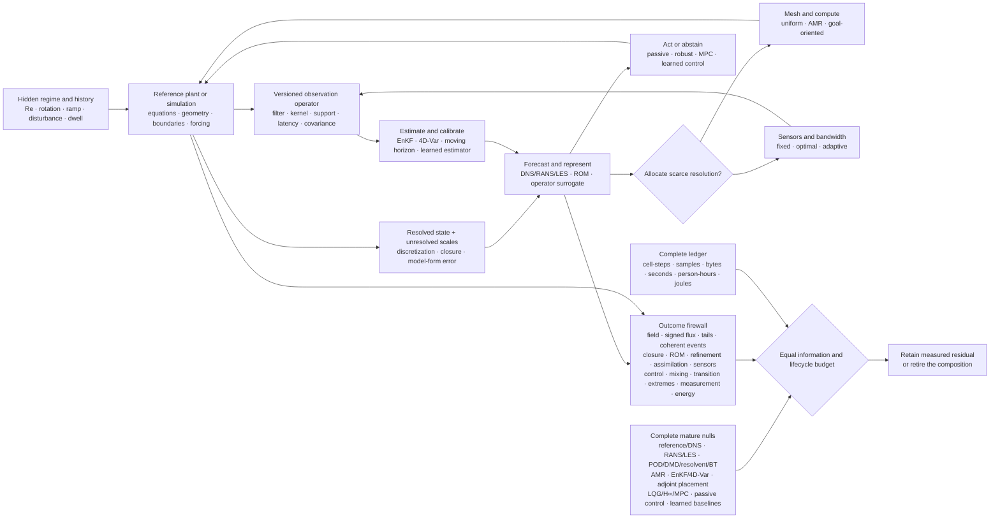

# Fixture F-005 — Regime-qualified flow inference and control

- **Status:** hostile benchmark fixture; no new principle or candidate
- **Primary owners:** [Candidate 002](../candidates/002-multiscale-context-broadcast.md),
  [Candidate 003](../candidates/003-recovery-dynamics-fragility.md),
  [Candidate 006](../candidates/006-reversible-physical-skill.md),
  [Candidate 007](../candidates/007-endogenous-observation-surveillance.md),
  [Candidate 012](../candidates/012-latency-qualified-authority.md), and
  [Candidate 014](../candidates/014-versioned-observation-contract.md)
- **Evidence source:** [fluid-dynamics and turbulence audit](../../research/audits/2026-08-05-fluid-dynamics-turbulence.md)
- **Mathematics:** [regime-qualified flow contract](../../math/regime-qualified-flow-contract.md)

## Question

Can a proposed system allocate resolution, sensing, inference, and control
while unresolved scales, closure and discretization error, partial observation,
regime shift, intermittency, transitions, and extremes are all active? Does any
residual remain after comparison with mature simulation, closure, reduction,
assimilation, sensor-placement, robust-control, passive-control, and complete
learned baselines at equal information and lifecycle cost?

Known governing equations provide no benchmark credit. Every arm must survive
the same hidden regimes, operator mismatches, budget ceilings, measurement
support, stability limits, and natural-distribution tail evaluation.

## Identity and leakage boundary

Freeze the episode identity $I_e$, regime/history record $R_e$, and
detector/filter/operator/support identity $J$ from the
[mathematical contract](../../math/regime-qualified-flow-contract.md). Publish
hashes for geometry, equations, constitutive assumptions, initial/boundary
conditions, forcing, solver/grid/time step, observation/calibration process,
data lineage, actuator interface, and every quantity of interest.

The evaluator withholds regime labels, truth fields, closure terms, numerical
error, future forcing, transition class, extreme-event times, sensor faults, and
physical plant parameters unless a track explicitly exposes them. Training and
test splits group neighboring time windows, forcing realizations, geometries,
solver lineages, grids, and derived snapshots so correlated states cannot cross
the boundary.

Editable source:
[regime-qualified-flow-inference-control.mmd](../../assets/diagrams/regime-qualified-flow-inference-control.mmd).

## Ten adversarial tracks

| ID | Construct under pressure | Hidden changes | Decisive outcomes |
| --- | --- | --- | --- |
| T1 | signed multiscale transfer | 2D/3D/rotating regime, forcing band, flux reversal, local backscatter | spectrum, signed flux by scale, forward/backscatter events, conservation, tails |
| T2 | closure portability | solver, grid, order, geometry, boundary treatment, forcing, $Re$ | field/QoI error, realizability, convergence, support-conditioned calibration, coupled stability |
| T3 | target-qualified reduced state | forcing, actuator, weak-energy control direction, transition/extreme target | reconstruction, rollout horizon, response, control value, event timing, return-period bias |
| T4 | adaptive resolution and compute | moving shock/vortex/front, displaced target sensitivity, load imbalance | target error at equal work, regrids, subcycles, rejected steps, bytes, wall seconds, joules |
| T5 | observation and assimilation | unmatched truth model, kernel, exposure, latency, drift, dropout, boundary error | posterior coverage, innovations, observable/unobservable error, recovery, decision value |
| T6 | adaptive sensor placement | regime, geometry, relevant mode, correlated failure, bandwidth, intrusion | field reconstruction, classification, tail warning, control, calibration and maintenance |
| T7 | closed-loop control | delay, saturation, noise, actuator/plant failure, duty cycle, $Re$ | stability, constraints, task value, fallback, gross benefit, net lifecycle energy |
| T8 | transport and mixing | initial scalar, $Pe$, $Sc$, diffusivity, reaction, sampling scale | variance, mix norm, dissipation, reaction completion, residence tails, remnant concentration |
| T9 | path-dependent transition | disturbance amplitude/shape, ramp direction/rate, dwell, censoring, coexistence | event likelihood, class hazards, turbulent fraction, warning lead, false alarms, abstention |
| T10 | extremes and precursors | threshold, averaging window, return period, forcing, unseen event mechanism | exceedance calibration, effective samples, weighted bias, lead time, false alarms, natural-stream validation |

All tracks share the same resource ledger but keep their outcomes separate. A
method can pass one track and fail another; no adjacent success is inherited.

## Hidden regime generator

The sealed confirmatory generator crosses:

1. two- and three-dimensional, rotating, wall-bounded, separated, transitional,
   scalar-transport, and controlled flow families where physically appropriate;
2. Reynolds, Péclet, Schmidt, and Rossby numbers outside interpolation bands,
   plus held-out forcing spectra, amplitudes, phases, and boundary histories;
3. unseen geometries, mesh families, spatial order, time integrators, closure
   locations, wall/boundary treatments, and numerical precision;
4. forward cascade, inverse cascade, dual-transfer, intermittent burst, quiet,
   coherent-event, and detector-ambiguous strata;
5. nominal, drifting, correlated, delayed, averaged, clipped, missing, failed,
   and physically intrusive observation channels;
6. gradual, abrupt, noise-triggered, finite-amplitude, coexistence, hysteretic,
   puff-decay, puff-splitting, and censored transition histories;
7. ordinary and rare forcing streams with an untouched natural-distribution
   evaluation stream for tail probabilities; and
8. at least two solver codes, physical or hardware-in-the-loop plants, model
   families, and hardware/accelerator classes.

Development arms never see confirmatory regime labels, target-sensitive regions,
true closure terms, exact event detector, planted sensor/actuator faults, or
future disturbances. The reference and measurement pipeline remain separately
implemented where feasible to avoid a shared-model inverse crime.

## Mature null stack and arms

| ID | Method | Required competitive implementation |
| --- | --- | --- |
| B0 | verified reference simulation | DNS or best feasible resolved/reference simulation with grid/time convergence, conservation, and uncertainty |
| B1 | classical coarse simulation and closure | RANS, LES, hybrid RANS–LES, dynamic subgrid/wall models, closure ensembles, and model-form perturbations |
| B2 | reduced-order modelling | POD/Galerkin, balanced POD or balanced truncation, DMD, resolvent, reduced basis, operator inference, and stabilization/closure |
| B3 | adaptive resolution | uniform refinement, Richardson studies, residual/feature AMR, adjoint or goal-oriented error estimation, and fixed schedules |
| B4 | assimilation and smoothing | Kalman/ensemble Kalman filter, 3D/4D-Var, adjoint, smoother, particle/hybrid filter, and moving-horizon estimation |
| B5 | sensor placement | random/uniform, QR-pivot, D-optimal, Fisher-information, observability-Gramian, adjoint, and greedy placement under physical constraints |
| B6 | robust and optimal control | LQG/LQR, $H_\infty$, MPC, adjoint optimization, opposition, extremum seeking, open-loop periodic, and runtime fallback |
| B7 | passive and no-action control | no control, passive geometry/material modification, and identical sensing with control disabled |
| B8 | complete learned baselines | finite-volume/Fourier/neural operators, DeepONet, graph surrogate, PINN, autoregressive emulator, learned closure/ROM/allocator/sensor/controller |
| B9 | rare-event methods | direct Monte Carlo, extreme-value models, adaptive multilevel splitting, genealogical/importance sampling, and generic/dynamics-informed precursors |
| B10 | complete conventional composition | strongest compatible B0–B9 modules with calibrated uncertainty, monitoring, versioned data, and ordinary engineering safeguards |
| F5 | regime-qualified composition | proposed allocation, inference, sensing, memory/history, monitoring, and control composition |
| O0 | trace-aware oracle | hidden state, regimes, closure truth, target sensitivity, event times, and faults; ceiling only |

B10 is the decisive comparator. F5 earns no credit for beating an incomplete
closure, ROM, estimator, sensor layout, or controller. Use identical training
fields, model capacity, observations, actuators, and solvers where possible;
otherwise preregister bounded differences before any confirmatory result opens.

## Equal-budget contract

Every inferential arm receives identical or preregistered Pareto-bounded:

1. causally available fields, sensors, spatial/temporal support, timestamps,
   calibration, missingness, forcing, boundary information, and regime hints;
2. training trajectories, physical experiments, forcing realizations, labels,
   closure/reference calls, rollout horizon, data precision, and augmentation;
3. trainable parameters, resolved degrees of freedom, ROM rank, closure state,
   context/state bytes, stored trajectories, checkpoints, and indexes;
4. mesh cell-steps across all levels, subcycles, rejected/repeated steps,
   remaps, refluxes, nonlinear/linear iterations, and reference solves;
5. sensor count, locations, intrusion, sample rate, exposure, bandwidth,
   synchronization, calibration, movement, failures, and maintenance access;
6. actuator count, authority, bandwidth, delay, work, saturation, wear, passive
   hardware, safety monitor, override, and repair access;
7. optimization steps, gradients, adjoints, ensemble members, assimilation
   cycles, planning horizons, rollouts, evaluator calls, and tuning trials;
8. CPU/GPU/accelerator time, wall deadline, peak memory, bytes moved/stored,
   network traffic, hardware, software stack, seeds, and failure allowance;
9. human setup, meshing, modeling, labeling, calibration, tuning, supervision,
   inspection, maintenance, and incident response in person-hours; and
10. facility, sensing, actuation, computation, networking, storage, auxiliary,
    installation, embodied, calibration, maintenance, replacement, and
    end-of-life energy in joules under one declared service interval.

An arm exceeding a binding ceiling is infeasible for that seed. Do not divide
an over-budget score by cost afterward, hide failed runs, omit reference-data
generation, or donate resources removed by an ablation to another component.

## Outcome firewall

Report all of these outcome families separately by track and hidden regime:

1. **Field:** variable, norm, point/support distinction, horizon, spatial map,
   spectral error, conservation residual, and uncertainty.
2. **Flux:** invariant, filter/spectral identity, signed transfer by scale,
   forward/backscatter event calibration, forcing and dissipation ranges.
3. **Tail:** high-order structure functions, derivative/dissipation/enstrophy
   tails, confidence intervals, autocorrelation, and effective sample size.
4. **Coherent event:** detector/filter/frame identity, occurrence, geometry,
   amplitude, lifetime, transport, conditional target effect, and null detector.
5. **Closure:** in- and out-of-support field/QoI error, realizability,
   invariants, support distance, solver stability, convergence, and uncertainty.
6. **ROM:** reconstruction, autonomous rollout, stability horizon, unseen
   forcing response, target preservation, closure, rank, and sacrificed targets.
7. **Refinement:** target error, cells and cell-steps, regrids, subcycles,
   rejected steps, transfer/synchronization, load balance, wall time, and joules.
8. **Assimilation:** posterior coverage, innovation whiteness, observable and
   unobservable errors, structural bias, outage recovery, and decision value.
9. **Sensor:** physical feasibility, reconstruction, regime classification,
   warning/control value, failure robustness, intrusion, bandwidth, and upkeep.
10. **Control:** closed-loop task value, stability, constraint violations,
    latency, authority, fallback, actuator work, gross saving, and net saving.
11. **Mixing:** variance, multiscale mix norm, scalar dissipation, reaction
    completion, residence-time distribution, and remnant at operational support.
12. **Transition:** class, path/history, event-time likelihood, hazard,
    turbulent fraction, lead time, false alarm, abstention, and censoring.
13. **Extreme:** threshold/window identity, exceedance probability, return
    period and interval, weight degeneracy, precursor calibration, and burden.
14. **Measurement:** calibration, transfer function, spatial/time averaging,
    synchronization, covariance, uncertainty propagation, and instrument drift.
15. **Energy and resources:** every count, byte, second, person-hour, power row,
    operational joule row, embodied/maintenance row, and service-life assumption.

No scalar average may compensate for wrong flux direction, an unstable control
stratum, a missed extreme, an uncalibrated posterior, or negative net energy.

## Required ablations

Run F5 with each component removed while its freed resource remains unused:

1. regime and path-history state;
2. explicit closure/discretization/model-form separation;
3. detector/filter/operator/support identity;
4. signed invariant-specific flux messages;
5. tail- and event-conditioned allocation;
6. target-qualified ROM objective;
7. goal-oriented mesh/compute allocation;
8. adaptive sensor allocation;
9. observability-aware state and covariance calibration;
10. latency/authority-qualified control and abstention;
11. transition-class and competing-hazard state;
12. natural-distribution tail calibration; and
13. complete lifecycle energy and human-work accounting.

Also intervene on solver, grid/order, closure location, filter, detector,
observation kernel, sensor layout, estimator covariance, ROM rank, refinement
indicator, target location, delay, actuator authority, fallback, ramp history,
tail threshold, and resource price. An ablation is causal only when it isolates
its registered target without altering accessible evidence.

## Analysis and calibration

Preregister paired primary contrasts against B10, protected non-inferiority
margins for conservation, stability, posterior and tail calibration, constraint
violations, and net energy, plus multiplicity control across outcome families.
Use hierarchical analysis over flow family, geometry, regime, forcing,
trajectory, sensor/actuator configuration, solver/grid lineage, model seed,
hardware, and physical run. Adjacent snapshots are not independent samples.

Use at least 30 independent paired confirmatory realizations per primary hidden
regime stratum unless a preregistered power or rare-event calculation demands
more. For tails, report effective rather than nominal sample size and validate
weighted estimators on the sealed natural stream. For transitions, treat right
censoring and competing events explicitly. Report all exclusions, outages,
solver failures, controller overrides, early stops, and full trial courses.

## Hard retirement rules

Retire the proposed composition and preserve F-005 as a negative benchmark if
any relevant condition fires:

1. B10 matches F5 on the preregistered vector at equal information, control
   authority, human work, and lifecycle energy;
2. verified reference simulation or a conventional converged solver explains
   the gain once discretization and reference error are exposed;
3. RANS/LES, a classical/dynamic closure, or a closure-uncertainty ensemble
   matches out-of-support QoI error, realizability, and coupled stability;
4. a learned closure wins only on its label solver/grid, loses after refinement,
   or relies on cancellation between closure and numerical error;
5. POD, DMD, resolvent, balanced truncation/POD, reduced basis, or operator
   inference matches the declared target at the same rank and rollout budget;
6. a ROM reconstructs snapshots but loses rollout, control, transition, or tail
   fidelity, or an aggregate hides a sacrificed target;
7. uniform, residual, feature, or goal-oriented AMR/error estimation matches
   target error after cell-steps, regrids, synchronization, and joules are charged;
8. EnKF, 4D-Var, a smoother, particle/hybrid filter, or moving-horizon estimator
   matches reconstruction and calibration under the actual observation operator;
9. a shared truth/estimator model, grid, forcing, boundary, random stream, or
   preprocessing path creates an inverse crime;
10. QR, D-optimal, Fisher, Gramian, adjoint, greedy, random, or uniform sensors
    match value under hidden regime shift and physical feasibility constraints;
11. LQG/LQR, $H_\infty$, MPC, adjoint, opposition, extremum seeking, open-loop,
    passive control, or no control matches task value, stability, and net energy;
12. a controller has an unstable/unsafe hidden stratum, depends on undeclared
    latency or authority, or yields non-positive service-interval net energy;
13. a spectrum match hides wrong signed flux, a mean match hides tail failure,
    or coherent-event identity changes under reasonable detector/filter choices;
14. visible filamentation disappears as mixing benefit when diffusion, reaction,
    residence tails, or operational sampling support are measured;
15. a state-only threshold, survival/semi-Markov model, change-point detector,
    or bifurcation tracker matches path-conditioned transition warning;
16. direct Monte Carlo, extreme-value analysis, splitting, genealogical or
    importance sampling matches tails, or enriched frequency is left unweighted;
17. any gain disappears on hidden geometry, forcing, regime, solver, grid,
    observation, transition, model, physical plant, or hardware strata;
18. no ablation isolates value beyond the mature stack; or
19. the advantage disappears after failures, data/reference generation,
    sensing, actuation, communication, calibration, maintenance, human work,
    facility load, embodied cost, and lifecycle joules are charged.

A pass refines the six owner candidates only on the literal outcomes passed.
It does not create another principle or candidate.
