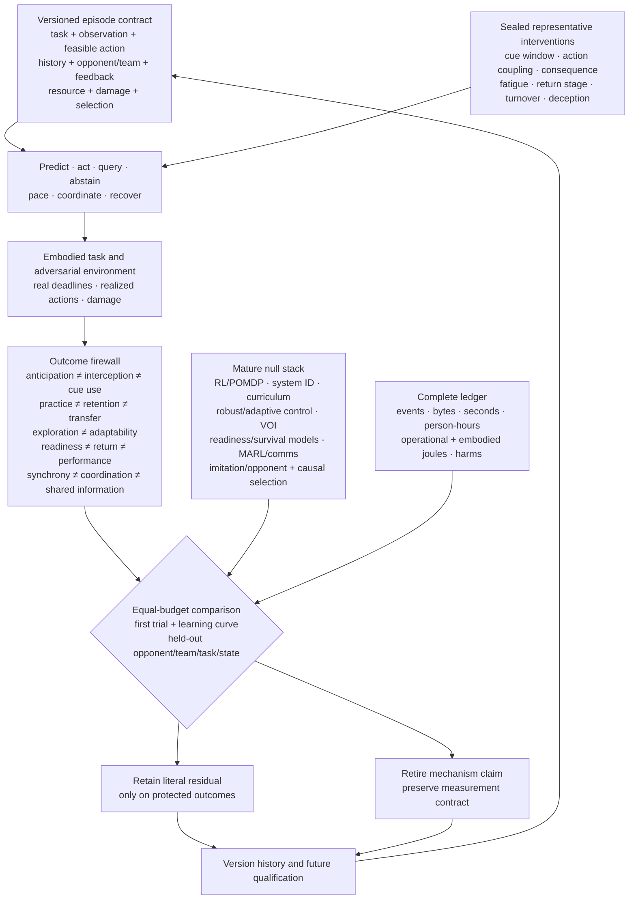

# Fixture F-006 — Representative adaptive performance

- **Status:** hostile benchmark fixture; no new principle or candidate
- **Primary owners:** [Candidate 002](../candidates/002-multiscale-context-broadcast.md),
  [Candidate 004](../candidates/004-closed-endogenous-curriculum.md),
  [Candidate 006](../candidates/006-reversible-physical-skill.md),
  [Candidate 007](../candidates/007-endogenous-observation-surveillance.md),
  [Candidate 009](../candidates/009-graded-assurance-envelopes.md),
  [Candidate 012](../candidates/012-latency-qualified-authority.md),
  [Candidate 014](../candidates/014-versioned-observation-contract.md), and
  [Candidate 019](../candidates/019-audited-cumulative-inheritance.md)
- **Evidence source:** [sports expertise, adaptive performance, and team
  coordination audit](../../research/audits/2026-08-05-sports-expertise-team-coordination.md)
- **Mathematics:** [representative adaptive-performance contract](../../math/representative-adaptive-performance.md)

## Question

Does a proposed adaptive system preserve useful performance when the available
cues, feasible actions, deadlines, consequences, opponent and teammate
policies, feedback, fatigue or resource state, damage, and opportunity history
change? Can the residual be distinguished from mature prediction, retrieval,
reinforcement learning, partial-observation planning, system identification,
curriculum, robust control, selective prediction, readiness and survival
models, staged assurance, multi-agent protocols, imitation, opponent models,
and causal selection models at equal complete cost?

The fixture uses sport as a high-pressure experimental grammar. It does not
turn sport labels, elite status, synchrony, realism, or training hours into
mechanisms.

## Versioned comparison boundary

Every episode publishes the record
$\mathcal K=(X,O,A,H,M,F,R,D,G,C,U,B)$ defined in the
[mathematical contract](../../math/representative-adaptive-performance.md).
The runtime input contains only information actually received before the
decision deadline. The evaluator separately stores hidden physical state,
withheld cues, true opponent/team policy, intervention identity, damage and
resource state, selection policy, counterfactual seed, and future outcomes.

The record must expose:

1. the actual observation channel, support, viewpoint, occlusion, latency,
   noise, missingness, metadata, and residual outcome cues;
2. the feasible action set, morphology or actuator state, authority, equipment,
   deadline, downstream response, consequence, and realized action;
3. practice, feedback, coaching, opponent, teammate, fault, injury, selection,
   exclusion, reward, retry, and stopping history;
4. current resource, fatigue, sleep or recovery, damage, diagnostic
   uncertainty, protected envelope, and return stage;
5. opponent and teammate identities, role assignment, known policy history,
   turnover, communication channel, and common environmental information;
6. randomized task manipulation, paired control, first target trial, later
   updates, evaluator access, and all postdecision opportunities; and
7. action, episode, agent, dyad, team, site, season, and cohort identifiers so
   repeated events cannot masquerade as independent systems.

Editable source:
[representative-resource-qualified-performance.mmd](../../assets/diagrams/representative-resource-qualified-performance.mmd).

## Outcome firewall

These outcomes are analyzed separately; success on one cannot stand in for an
adjacent construct.

| Outcome | Required measurement | Forbidden substitution |
| --- | --- | --- |
| anticipation | proper score by cue window and opponent, calibration, commitment latency | expert label, fast reaction, or endpoint success |
| physical interception | success, movement onset, trajectory, endpoint error, unsafe contact | video, label, or joystick judgment |
| cue use | randomized removal, neutralization, conflict, or timing intervention with residual information audited | gaze, attention, feature saliency, or correlation |
| practice performance | literal acquisition curve by attempt and exposure time while feedback is present | end-of-practice score as learning |
| delayed retention | scaffold-free performance after registered delays in hours or days | immediate post-practice performance |
| transfer | complete source-to-target matrix over cue, action, task, opponent, feedback, resource, and damage changes | retention on the practiced task |
| exploration | action and outcome entropy, action--outcome information, feasible coverage, later utility, and cost | raw action variance or entropy alone |
| adaptability and recovery | perturbation loss, recovery time, overshoot, recurrence, and residual damage | stationary accuracy or one later endpoint |
| pacing | full output or action-intensity trajectory, remaining work, opponent state, feedback, and terminal outcome | final completion time alone |
| fatigue and readiness | task-specific capacity change, calibrated state error, admissible-action envelope, abstention, and recovery | duration, workload ratio, wellness score, or one sensor |
| staged return | false promotion, false withholding, stage dwell, recurrence, rollback, availability, and collateral loss | calendar time, one symmetry score, or initial return |
| team coordination and shared information | intervention-conditioned compensation, task-variable stability, predictive belief score, messages, repair, turnover, and cross-play | synchrony, proximity, similar behavior, or questionnaire agreement |
| deception | matched genuine/deceptive causal contrast, opponent log loss, calibration, exploitability, regret, abstention, and adaptation time | surprise, confidence, or classification accuracy alone |
| talent prediction | prospective new-cohort calibration, later capability, false-negative recovery, opportunity, attrition, injury, and subgroup error | current rank, selected-cohort accuracy, tenure, or practice hours |
| complete efficiency | protected outcome vector plus events, bytes, seconds, person-hours, joules, damage, replacements, and opportunity | success per trial, device joules, or metabolic energy alone |

## Eight adversarial tracks

The track identities match E-SPORT-01 through E-SPORT-08 in the source audit.

| ID | Construct under pressure | Sealed manipulations | Primary outcomes |
| --- | --- | --- | --- |
| T1 | cue-time anticipation and coupled interception | three or more cue windows; spatial/channel ablation; familiar and held-out opponents; genuine/deceptive actions; label, joystick, partial movement, and full interception | bits/event, calibration, commitment milliseconds, endpoint metres, unsafe events, joules/event |
| T2 | representative-task transfer | visual fidelity, actual action coupling, downstream opponent response, deadline, consequence, and physical resource state | full transfer matrix, target regret, calibration, adaptation samples, safety, complete cost |
| T3 | history-qualified variability | initial skill/history; blocked, random, progressive, error-amplifying, adaptive schedules; retry cost; feedback; target shift; washout | practice curve, delayed retention, near/far transfer, action/outcome information, failure cost, learner variance |
| T4 | fatigue-aware pacing and reserve | independently induced resource states, known/uncertain remaining work, stationary/changing opponents, accurate/perturbed feedback, recovery interval | reward, power/action trajectory, state error, readiness envelope, recovery, recurrence, unsafe events, joules |
| T5 | reversible return to operation | protected, modified, controlled, full-load, adversarial stages; hidden recurrent faults; support removal; new fault classes | false promotion/withholding, stage dwell, recurrence, rollback, collateral loss, availability, review hours, joules |
| T6 | local/global team coordination | delay, bandwidth, common input, observation asymmetry, targeted local perturbation, role reassignment, teammate turnover, never-co-trained cross-play | task quality, task-variable variance, lagged compensation, belief score, messages, repair, dropout recovery, energy |
| T7 | adversarial cue and opponent policy | action frequency, disguise, false early cues, change points, identity, novel and colluding opponents with matched terminal outcomes | bits/opponent action, calibration, exploitability, regret, abstention utility, adaptation time, adversarial failures |
| T8 | selection, development, and complete cost | prospective cohorts; threshold-near randomized opportunity where admissible; maturity, practice, coaching, injury, dropout; selected and unselected follow-up | calibration, later capability, false-negative recovery, opportunity, attrition, injury, human hours, facility/embodied/lifecycle joules |

Each track has distinct development and sealed confirmatory generators. Passing
one track grants no credit on another.

## Track protocols

### T1 — Cue-time intervention ladder

Preserve event frequencies, viewing geometry, downstream action opportunity,
and consequence while crossing cue time, channel, opponent, deception, and
response mode. Run the first held-out-opponent trial separately from later
adaptation. Compare calibrated temporal prediction, nearest-neighbor retrieval,
hierarchical prior-plus-kinematics models, POMDP prediction, robust channel
dropout, and the full composition. Retain only a residual that survives
cue conflict and improves the latency--accuracy--risk frontier in full
interception, not only symbolic judgment.

### T2 — Representative-task causal ladder

Cross visual similarity, observation support, feasible response, body or
actuator dynamics, opponent response, deadline, consequence, and resource
state factorially. Test every training-to-target pair. Include domain
randomization, augmentation, robust optimization, system identification,
automatic curriculum, and equal-sample target fine-tuning. A claim survives
only when a named manipulated dimension prospectively predicts held-out
transfer beyond measured distribution distance; “more realistic” is not an
estimand.

### T3 — History-qualified variability schedule

Stratify initial capability and exposure history before assigning fixed,
blocked, random, progressive, error-amplifying, adaptive, or
uncertainty-directed schedules. Match attempt count, criterion-task exposure,
elapsed practice, perturbation dose, feedback bits, evaluator queries, and
energy. Freeze immediate acquisition, washout, delayed retention, first-trial
near/far transfer, later learning, failure cost, and individual variance.
Retire any schedule that increases action entropy without outcome information
or transfer.

### T4 — Fatigue-aware pacing and reserve control

Induce distinct resource pathways that produce similar elapsed workload; cross
known and uncertain remaining work, steady and changing opponents, truthful
and perturbed feedback, recovery intervals, and blinded safe limits. Compare
state-space and workload/readiness models, Kalman and particle filters,
fitness--fatigue models, system identification, MPC, constrained or
risk-sensitive RL, rate limiting, robust/adaptive control, and fixed reserve.
Require prediction under unseen resource pathways, safe pacing, calibrated
admissibility, recovery, and recurrence outcomes.

### T5 — Reversible return-to-operation gate

Progress faulted or damaged systems through protected, modified, controlled,
full-load, and adversarial stages. Seed hidden recurrence, delayed failure, and
support removal. Compare time-only gates, single health/readiness scores,
survival and competing-risk models, conventional canaries, reliability
thresholds, runtime assurance, and hand-authored staged rollout. Promotion must
be reversible; return to participation, full operation, and sustained prior
performance remain different outcomes.

### T6 — Local/global team coordination under turnover

Cross communication latency and bandwidth, observation asymmetry, common
environmental input, role reassignment, teammate dropout, novel teammates,
adversarial opponents, and targeted perturbations to one agent. Compare
centralized MPC, decentralized feedback, consensus, blackboards, typed
messages, acknowledgements, role protocols, MARL, learned communication, and
independent common-state controllers. Require intervention-conditioned
reciprocal compensation, stable task variables, never-co-trained cross-play,
and repair after turnover; synchrony alone fails.

### T7 — Adversarial cue and opponent-policy audit

Hold terminal outcomes and visible evidence constant where possible while
varying genuine frequency, disguise, early false cues, policy change points,
identity, coordination, and collusion. Compare Bayesian opponent models,
fictitious play, recurrent policies, imitation and inverse models,
population self-play, robust classification, conformal abstention, retrieval,
and explicit opponent identification. Retain only calibrated adaptation to new
deceptive policies at equal interactions, memory, search depth, and latency.

### T8 — Selection, learning, and complete-cost trial

Run prospective multi-cohort evaluation with registered interventions on
additional opportunity near policy thresholds when safe and admissible.
Measure maturation or system age, capability, coaching or supervision,
practice, faults/injury, attrition, exclusion, and later outcomes for selected
and initially unselected units. Compare current-performance ranking,
age/state-adjusted regression, causal selection and uplift models, calibrated
survival models, threshold lottery, and broad-development policy. A model must
predict new cohorts without creating its own apparent validity through unequal
opportunity.

## Mature null stack and arms

| ID | Method | Required competitive implementation |
| --- | --- | --- |
| B0 | calibrated prediction and retrieval | temporal classifier, sequence model, hierarchical prior, nearest-neighbor and opponent-conditioned episodic retrieval |
| B1 | RL and partial-observation control | model-free and model-based RL, recurrent world model, POMDP planning, options, MPC, and constrained/risk-sensitive objectives |
| B2 | system identification and adaptive control | state-space models, Kalman/particle filters, online system ID, robust/adaptive control, rate limits, reserve margins, and change detection |
| B3 | transfer and curriculum | augmentation, domain randomization, robust optimization, fixed and automatic curriculum, Bayesian experimental design, active learning, and equal-sample fine-tuning |
| B4 | exploration and selective information | entropy bonuses, novelty and quality-diversity search, random perturbation, calibrated ensembles, conformal/selective prediction, abstention, and value of information |
| B5 | workload, readiness, and return | workload-history models, fitness--fatigue models, state-space readiness, survival/competing-risk models, canaries, staged rollout, rollback, and runtime assurance |
| B6 | team control and communication | centralized/decentralized control, consensus, shared display, blackboard, typed protocol, acknowledgement, MARL, and learned communication |
| B7 | imitation and opponent models | behavior cloning, goal-conditioned imitation, inverse RL, Bayesian opponent model, fictitious play, recurrent opponent model, self-play, and retrieval |
| B8 | causal selection and development | adjusted prospective regression, causal selection/uplift model, calibrated survival model, threshold lottery, and broad-development policy |
| B9 | complete conventional composition | strongest compatible B0--B8 modules with explicit state, monitoring, abstention, staged safeguards, versioned records, and full ledger |
| F6 | representative adaptive composition | proposed context, curriculum, physical action, surveillance, assurance, authority, observation, and inheritance modules |
| O0 | trace-aware oracle | hidden state, opponent/team policy, true damage/resource state, intervention, future event, and selection counterfactual; ceiling only |

B9 is decisive. F6 receives no credit for beating an intentionally incomplete
predictor, controller, estimator, communication protocol, or selection model.

## Sealed scenario generator

Freeze before confirmatory evaluation:

1. at least two task families per track, two model families, two sites or
   simulator lineages, two hardware classes, and independent counterfactual
   seeds;
2. first target trial, later target learning, delayed retention, near transfer,
   far transfer, and return after washout as separate windows;
3. actual observation and action opportunities, including occlusion, support,
   latency, body/actuator swap, authority, deadline, consequence, and downstream
   opponent response;
4. representative-task factors varied independently rather than by one realism
   label;
5. naive, conventionally trained, overtrained, differently rewarded,
   differently coached, previously damaged, selected, excluded, and
   history-swapped systems;
6. fresh, depleted, recovering, misestimated, damaged, recurrent-fault, and
   support-dependent resource states with matched elapsed workload controls;
7. stable and changing opponents, genuine and deceptive cues, known and novel
   identities, collusion, teammate turnover, role reassignment, observation
   asymmetry, and common-input controls;
8. accurate, delayed, sparse, misleading, absent, and autonomy-supporting
   feedback schedules; and
9. selection policies that alter access, exposure, supervision, opponent
   quality, failure risk, attrition, and observability of later capability.

No development arm may see confirmatory opponent identities, teammate
assignments, cue-conflict schedule, fault class, target mapping, selection
counterfactual, or future resource trajectory.

## Equal-budget contract

Every inferential arm receives identical or preregistered componentwise
ceilings for:

1. causally available observations, pixels or sensor samples, timestamps,
   calibration, support, missingness, opponent/team identities, and feedback;
2. feasible action and communication interfaces, authority, deadline,
   consequence, actuator work, damage allowance, canary load, and rollback;
3. training events, unique outcomes, environment steps, demonstrations,
   practice attempts, retention tests, target samples, resets, and opponent
   interactions;
4. parameters, working state, optimizer state, replay, event memory, external
   storage, checkpoints, and total bytes moved or stored;
5. optimization steps, planning expansions, rollouts, self-play generations,
   evaluator calls, readiness probes, search depth, tuning trials, and seeds;
6. communication messages, cumulative bits and bytes, latency, shared-memory
   access, rehearsal, partner access, and centralized compute;
7. wall deadline, CPU/GPU/accelerator time, facility or simulator hours,
   sensing time, recovery time, equipment access, and replacement inventory;
8. design, coaching, demonstration, annotation, evaluation, calibration,
   supervision, monitoring, medical/safety review, repair, and incident response
   in role-stratified person-hours;
9. training, inference, sensing, actuation, communication, facility, recovery,
   maintenance, replacement, and amortized embodied energy in joules under one
   service interval; and
10. unsafe events, damage or injury, attrition, exclusions, failed runs, false
    withholding, and opportunity given or withheld.

An arm that crosses any binding ceiling is infeasible for that seed. Do not
normalize it back into compliance, discard failed attempts, treat human effort
as free, or donate resources freed by an ablation to another module.

## Required ablations

Run F6 with each component removed while its released budget remains unused:

1. actual-channel identity, support, and receipt time;
2. feasible-action, morphology/actuator, authority, and consequence state;
3. acquisition, feedback, opponent, teammate, damage, and selection history;
4. first target trial versus later adaptation separation;
5. vector-valued representative-distance record;
6. explicit opponent policy and adversarial cue state;
7. teammate belief, role, turnover, and communication state;
8. resource/fatigue estimator and pacing state;
9. damage state, graded envelope, reversible promotion, and rollback;
10. costed query, selective prediction, and abstention;
11. opportunity and selection-policy record; and
12. complete human-work, lifecycle-energy, harm, and withheld-opportunity
    accounting.

Also intervene separately on cue timing, viewing geometry, action coupling,
deadline, consequence, feedback timing, opponent response, perturbation dose,
remaining work, resource pathway, return support, team common input, message
bandwidth, opponent disguise, and development opportunity. An ablation receives
causal credit only when it changes its registered literal outcome without
changing the evidence or resources available to the remaining modules.

## Analysis

Randomize and analyze at the unit receiving each intervention. Use hierarchical
models or hierarchical bootstrap across event, episode, system instance,
opponent, teammate/dyad, team, task, site, cohort, model seed, and hardware as
appropriate. Repeated actions do not create independent systems; selected
survivors do not represent excluded cohorts.

Preregister the strongest track-specific baseline, protected outcomes,
improvement and non-inferiority margins, 95% intervals, multiplicity control,
minimum transfer strata, failure ceilings, and stopping rules. Report every
exclusion, first trial, later update, target exposure, abstention, override,
rollback, recurrent failure, dropout, missing follow-up, unused budget, and
complete trial course.

A residual must replicate across at least two task families, target changes,
opponent populations, acquisition histories, resource/damage pathways, model
families, sites, and hardware classes. T6 additionally requires never-co-trained
cross-play; T8 requires prospective out-of-cohort validation and outcomes for
both selected and initially unselected units.

## Hard retirement rules

Retire the proposed mechanism or composition and preserve F-006 as a negative
benchmark when any relevant condition fires:

1. B9 matches F6 on the preregistered protected vector at equal observation,
   action, interaction, human-work, harm, and lifecycle-energy budgets;
2. calibrated temporal prediction, retrieval, a hierarchical cue model, or a
   POMDP accounts for anticipation after opponent and response conditioning;
3. symbolic prediction improves while full physical interception, safety, or
   the latency--accuracy frontier does not;
4. a cue claim disappears under removal, neutralization, timing, residual-cue,
   genuine/deceptive, or held-out-opponent controls;
5. domain randomization, augmentation, system identification, robust
   optimization, curriculum, or equal-sample fine-tuning matches the complete
   transfer matrix;
6. “representativeness” is a surface label, one unregistered scalar, or a
   post-hoc explanation rather than a manipulated dimension;
7. practice improvement fails delayed retention or first-trial transfer, or
   later target learning is reported as zero-shot capability;
8. fixed augmentation, random search, novelty, entropy, quality-diversity,
   Bayesian design, or an ordinary adaptive curriculum matches the variability
   schedule at equal perturbation dose and criterion exposure;
9. action variability rises without action--outcome information, useful
   coverage, retention, or transfer;
10. state-space estimation, workload/readiness models, system identification,
    MPC, robust/adaptive control, risk-sensitive RL, rate limiting, or fixed
    reserve matches pacing and recovery under unseen resource pathways;
11. elapsed workload, one sensor, wellness score, or workload ratio drives a
    result that fails task-specific prospective calibration;
12. a time gate, single health score, survival model, conventional canary,
    reliability threshold, runtime assurance, or hand-authored staged rollout
    matches false-promotion, recurrence, availability, and rollback outcomes;
13. a return gate cannot safely regress after deterioration or confuses
    participation, full operation, and sustained prior performance;
14. centralized/decentralized control, consensus, shared displays, blackboards,
    explicit protocols, MARL, or independent common-input controllers match
    perturbation response, cross-play, turnover recovery, and complete cost;
15. synchrony, proximity, similar trajectories, or communication reduction is
    reported without causal compensation, task stability, repair, and outcome;
16. Bayesian opponent models, fictitious play, imitation, recurrent policies,
    population self-play, robust classification, conformal abstention, explicit
    identity, or retrieval matches deceptive-opponent adaptation;
17. confidence rises while calibration, regret, exploitability, or safety
    worsens under cue conflict;
18. adjusted regression, a causal selection model, calibrated survival model,
    threshold lottery, or broad-development policy matches prospective talent
    prediction and development efficiency;
19. a selection model is validated only on selected survivors, hides false
    negatives or attrition, or creates its apparent accuracy by allocating
    different opportunity after selection;
20. any gain vanishes after actual observation/action opportunity, first-trial
    separation, task manipulation, acquisition history, opponent/team policy,
    feedback, resource, damage, selection, site, model, or hardware is exposed;
21. no preregistered ablation isolates value beyond the mature stack; or
22. the advantage disappears after failed runs, search, sensing, interaction,
    communication, facility load, supervision, safety/medical work, recovery,
    maintenance, equipment, damage, opportunity, role-stratified person-hours,
    and complete lifecycle joules are charged.

A pass refines only the owner candidates on the literal tracks passed. It does
not create another principle or candidate.
