# Fixture F-007 — Operator-qualified optical inference

- **Status:** hostile benchmark fixture; no new principle or candidate
- **Primary owners:**
  [Candidate 001 — adaptive topology](../candidates/001-adaptive-topology.md),
  [Candidate 006 — reversible physical skill](../candidates/006-reversible-physical-skill.md),
  [Candidate 007 — endogenous observation surveillance](../candidates/007-endogenous-observation-surveillance.md),
  [Candidate 010 — reset-coupled staged verification](../candidates/010-reset-coupled-staged-verification.md),
  [Candidate 014 — versioned observation contract](../candidates/014-versioned-observation-contract.md),
  [Candidate 017 — contract-preserving semantic compaction](../candidates/017-contract-preserving-semantic-compaction.md),
  and [Candidate 018 — value- and reconstructability-aware tiering](../candidates/018-value-reconstructability-aware-tiering.md)
- **Evidence source:**
  [optics, photonics, and inverse-sensing audit](../../research/audits/2026-08-05-optics-photonics-inverse-sensing.md)
- **Mathematics:**
  [operator-qualified optical inference contract](../../math/operator-qualified-optical-inference.md)

## Question

At equal information, hardware, safety, labor, and lifecycle-energy budgets, can
a versioned **measure–infer–intervene–monitor–route–retain** system improve the
task-quality, calibration, latency, risk, and energy frontier beyond the
complete mature inverse-sensing and heterogeneous-compute stack?

The fixture does not award credit for reconstructed pixel count, carrier
frequency, nominal optical operations, core-only energy, or visually plausible
detail. It tests whether retaining the physical measurement operator, exposing
ambiguity, buying new evidence selectively, monitoring drift, routing only
matched transforms, and preserving future-query obligations produce a measured
residual after ordinary methods are fully represented.

## Identity, evidence, and leakage boundary

Before any arm sees an episode, seal the identity envelope $I_{e,t}$ from the
[mathematical contract](../../math/operator-qualified-optical-inference.md):

1. scene or latent-state generator, materials, dynamics, ground-truth method,
   and task-query versions;
2. aperture, wavelength, field of view, coherence, illumination, masks, optical
   train, alignment, detector, sampling, exposure, and readout versions;
3. calibrated forward operator, uncertainty, noise law, saturation and dead-time
   masks, preprocessing lineage, timestamps, and validity envelope;
4. reconstruction code, priors, training corpus, simulator, retrieval index,
   calibration data, source cutoff, and model checkpoint;
5. optical device, die, package, firmware, converter, digital accelerator,
   control stack, temperature, age, and maintenance history;
6. active-action interface, photon and dose ceilings, actuator limits, safety
   interlocks, fallback, and incident-response policy; and
7. hidden-regime generator, paired seed, resource ceilings, future-query release,
   and analysis plan.

Hashes bind byte identity; calibration evidence binds physical meaning. The
evaluator withholds true scene state, null-space pair membership, prior-shift
class, phase-equivalence class, compound-noise parameters, future acquisitions,
drift cause, device rank, thermal disturbance, future queries, and incident
request unless a track explicitly exposes them.

Train, validation, and confirmatory partitions group neighboring frames,
repeated scenes, material batches, optical designs, simulator lineages, device
wafers, dies, packages, calibration descendants, and derived reconstructions.
Ground truth and evaluation use an independently qualified acquisition or
physical standard where feasible. Shared simulator, calibration, preprocessing,
or noise code between a method and its evaluator is reported as a possible
inverse crime.

```mermaid
flowchart LR
    world["Hidden physical state<br/>scene · phase · spectrum · dynamics"] --> operator["Versioned measurement operator<br/>aperture · illumination · optics · detector · calibration"]
    action["Costed sensing action<br/>pattern · angle · wavelength · exposure"] --> operator
    regime["Hidden regime<br/>photon flux · background · drift · temperature · saturation"] --> operator
    operator --> raw["Raw observation + metadata<br/>counts · timestamps · masks · covariance · operator version"]
    raw --> ambiguity["Physical limits<br/>diffraction · shot noise · null space · phase ambiguity"]
    ambiguity --> reconstruct["Qualified inference<br/>inverse method · prior · uncertainty · abstention"]
    reconstruct --> query{"More information worth its cost?"}
    query -->|"yes, safe"| action
    query -->|"no"| decide["Decision or retained artifact"]
    monitor["Reference channel + residual monitor<br/>drift · alignment · gain · thermal state"] --> operator
    monitor --> gate{"Inside validity envelope?"}
    gate -->|"no"| recover["Recalibrate · reroute · digital fallback · reset"]
    recover --> operator
    route["Operator-qualified route<br/>passive optics · photonic core · digital accelerator"] --> transform["Physical or digital transform"]
    raw --> route
    transform --> reconstruct
    compact["Query-registered compaction<br/>raw · calibrated sufficient state · task output"] --> decide
    raw --> compact
    nulls["Mature null stack<br/>inverse methods · uncertainty · phase retrieval · compressed sensing<br/>computational imaging · AO/control · digital accelerators · passive optics"] --> compare{"Matched information + hardware + lifecycle budget"}
    decide --> firewall["Separate outcome firewall<br/>aperture · photons · phase · priors · drift · saturation · fusion<br/>transform · conversion · analog error · fabrication · safety · lifecycle"]
    ledger["Complete ledger<br/>samples · photons · dose · bytes · seconds · person-hours · joules"] --> compare
    fabrication["Device population<br/>yield · mismatch · trimming · thermal control · aging"] --> route
    firewall --> compare
    compare --> verdict["Retain measured residual<br/>or retire the composition"]
```

Editable source:
[operator-qualified-physical-inference.mmd](../../assets/diagrams/operator-qualified-physical-inference.mmd).

## Eight adversarial tracks

The track identities match E-OPTIC-01 through E-OPTIC-08 in the source audit.
They share an identity envelope and resource ledger, but no track inherits
success from another.

| ID | Construct under pressure | Sealed manipulations | Primary outcomes |
| --- | --- | --- | --- |
| T1 | null-space honesty | task-distinct states with indistinguishable likelihoods; aperture, phase, noise, and withheld measurement changes | false specificity, alternative coverage, abstention, added evidence, task loss |
| T2 | prior-mismatch super-resolution | source separation, positivity, sparsity, texture, motion, photon count, and independent higher-information truth | false detail, localization, truth fidelity, posterior coverage, perceptual score |
| T3 | active photon allocation | materials, dynamics, information topology, background, dose sensitivity, actuator cost, and unsafe shortcuts | utility per detected photon, joule, second, and dose unit; coverage and safety |
| T4 | multiplex crossover | detector noise, flux, occupancy, background, crosstalk, saturation, detector area, and integration time | complete direct-versus-multiplex Pareto surface, calibration, dynamic range |
| T5 | drift-aware reconstruction | temperature, wavelength, source power, alignment, detector gain, aging, scene shift, and combined causes | attribution, delay, false alarm, pre-detection loss, recovery, samples, joules |
| T6 | optical/digital crossover | operator shape, batch, sparsity, precision, input origin, output size, reuse, utilization, and duty cycle | accepted-output quality, p95 latency, conversion/readout, every power rail, lifecycle joules |
| T7 | multi-device fabrication and thermal audit | wafer, die, package, fabrication variation, trimming, thermal crosstalk, age, and device-blind evaluation | yield, transfer error, tuning power, stability, task quality, calibration and embodied cost |
| T8 | physical compaction under future queries | raw capture, digital compression, learned semantic compression, optical preprocessing, new query, and incident request | query recoverability, uncertainty honesty, reacquisition feasibility, storage, lifecycle cost |

## Track protocols

### T1 — Null-space honesty

Construct physical and simulated pairs whose calibrated likelihoods are
indistinguishable within a preregistered power threshold while their task
answers differ. Cross finite aperture, defocus, missing phase, occlusion,
sampling, and photon regimes. Compare maximum-likelihood and maximum-a-
posteriori inversion, variational and sampling-based Bayesian inference,
calibrated selective prediction, and active experiment design. A method passes
only when it exposes the unresolved equivalence class, returns calibrated
bounds, abstains, or purchases a decisive measurement within budget.

### T2 — Prior-mismatch super-resolution ladder

Cross scene families that do and do not satisfy positivity, sparsity, separation,
band-limit, texture, motion, and training-distribution assumptions. Use an
independent higher-information acquisition for truth. Compare direct low-
resolution task inference, deconvolution, total variation, sparse recovery,
multi-frame reconstruction, phase retrieval, a learned inverse, and a
generative prior. Report measured localization or task performance, posterior
coverage, and false-detail rate independently from perceptual quality.

### T3 — Active photon allocation

Give every policy the same source, aperture, detector, safe-dose ceiling,
actuator, calibration, maximum incident and detected photon counts, wall time,
and compute. Compare fixed optimal design, passive sensing, random codes,
greedy value of information, Bayesian experiment design, POMDP planning,
model-predictive control, and the proposed policy. Hold out materials and
dynamics. Unsafe exposure, simulator exploitation, unmetered scouting, or a
gain that vanishes after source, control, and inference energy is charged fails.

### T4 — Multiplex crossover map

On the same instrument, vary detector noise, photon flux, background, spectral
or spatial occupancy, crosstalk, full well, dead time, and pile-up. Compare
multiplexed and direct acquisition at equal aperture, detector area, incident
photons, exposure, and task. Publish the complete regime surface, including
unfavorable regions and transition uncertainty. Compare any learned router with
an oracle ceiling and a simple analytical threshold fixed on development data.

### T5 — Drift-aware reconstruction

Inject temperature, wavelength, source-power, alignment, detector-gain, aging,
and scene-distribution changes independently and jointly. Compare fixed and
periodic calibration, normalized-residual triggers, independent reference
channels, online joint estimation, adaptive optics or control, staged
reverification, route reset, and digital fallback. Require cause-qualified
detection, a declared validity envelope, safe behavior before attribution,
bounded recovery, and a complete calibration ledger.

### T6 — Optical/digital crossover

Implement the same operator and accepted-output task on the photonic path and
the strongest available GPU, FPGA, ASIC, or DSP path. Sweep matrix shape, batch,
sparsity, effective precision, input origin, output dimension, operator reuse,
programming rate, utilization, and duty cycle. Measure integration, encoding,
source, modulation, propagation, detection, ADC/DAC, transfer, host control,
digital completion, warm-up, idle, thermal stabilization, and cooling. A
component-level operations-per-joule number is not an end-to-end result.

### T7 — Multi-device fabrication and thermal audit

Preregister device and wafer counts before fabrication. Characterize every die,
including failures, for transfer function, insertion loss, effective precision,
yield, trimming, tuning, thermal crosstalk, aging, and task quality. Blind the
task team to device selection. Compare nominal-model training, device-ensemble
training, per-device calibration, in-situ optimization, static compensation,
and digital fallback. Include fabrication, packaging, failed dies, calibration,
replacement, thermal control, and human tuning in the lifecycle denominator.

### T8 — Physical compaction under future queries

Compare full raw retention, lossless and conventional lossy compression,
learned semantic compression, task-specific optical processing, and hybrid
retention. Match current-task quality, storage, acquisition, and lifecycle
budgets. After every encoder and policy is frozen, reveal unseen task queries,
a calibration challenge, and an incident-investigation request. Score each
query class, uncertainty reconstruction, lineage, and feasibility of new
acquisition. Average current-task accuracy cannot hide an irrecoverable future
obligation.

## Mature null stack and arms

| ID | Method | Required competitive implementation |
| --- | --- | --- |
| B0 | conventional calibrated imaging | matched aperture and detector, direct Nyquist sampling, focused optics, raster scan, multiexposure HDR, and standard acquisition |
| B1 | inverse methods and uncertainty | maximum likelihood, MAP, Tikhonov, total variation, sparse and low-rank recovery, variational inference, posterior sampling, uncertainty calibration, and abstention |
| B2 | phase retrieval and computational imaging | alternating projections, Wirtinger-type methods, phase diversity, ptychography, blind/non-blind deconvolution, coded aperture, lensless, and learned reconstruction |
| B3 | compressed sensing and priors | matched direct sampling, sparse and structured recovery, learned and diffusion priors, prior-mismatch tests, and exact measurement-ensemble conditions |
| B4 | active sensing and control | passive and fixed designs, greedy value of information, Bayesian design, POMDP planning, model-predictive control, adaptive optics, and safe fallback |
| B5 | calibration and fusion | open-loop and periodic calibration, residual-triggered calibration, reference channels, in-situ optimization, Kalman/factor-graph fusion, covariance intersection, and single-sensor fallback |
| B6 | digital and passive hardware | strongest matched GPU, FPGA, ASIC, or DSP with the same precision and reuse; conventional lens; passive fixed optical transform; complete data movement |
| B7 | hybrid optical/digital co-design | workload-aware route, calibrated physical model, conversion, monitoring, device-aware training, compensation, thermal control, fallback, and query-aware retention |
| B8 | complete conventional composition | strongest compatible B0–B7 components with versioned metadata, uncertainty, monitoring, safety interlocks, lifecycle accounting, and ordinary engineering safeguards |
| F7 | operator-qualified composition | full measure–infer–intervene–monitor–route–retain proposal under test |
| O0 | trace-aware oracle | true latent state, operator, noise, phase, drift cause, future observation, device quality, and future queries; unattainable ceiling only |

B8 is decisive. F7 receives no credit for beating an intentionally incomplete
inverse solver, phase-retrieval method, active controller, calibration routine,
digital accelerator, passive optical path, or hybrid system.

## Hidden operator and regime generator

Freeze development, public validation, and sealed confirmatory generators with:

1. at least two physical instruments or independently implemented simulators,
   two scene families, two sites, two hardware classes, and multiple devices;
2. aperture, numerical aperture, wavelength, field of view, coherence, sampling
   pitch, exposure, defocus, aberration, occlusion, and phase variants;
3. photon-limited, background-limited, read-noise-limited, fixed-pattern,
   coherent-noise, saturated, dead-time, pile-up, and mixed detector regimes;
4. identifiable, ill-conditioned, rank-deficient, phase-ambiguous, and
   task-equivalent measurement operators with hidden null-space pairs;
5. seen and held-out sparsity, positivity, separation, texture, motion,
   material, spectrum, reflectance, and generative-prior families;
6. fixed, drifting, misaligned, temperature-shifted, wavelength-shifted,
   source-shifted, detector-gain-shifted, aging, and compound-change episodes;
7. direct, multiplexed, coded, active, passive, optical-core, digital-only, and
   hybrid routes across workload shape, reuse, utilization, and duty cycle;
8. wafer, die, package, trimming, tuning, thermal-crosstalk, and device-age
   strata, including failures and maintenance events; and
9. current queries, sealed future queries, incident reconstruction, and cases
   where physical preprocessing removed information required later.

No development arm sees confirmatory operator versions, null-space pair labels,
prior-family shifts, drift cause, device ranking, fabrication yield, future
queries, or hidden safety sensitivity. Measurement and reconstruction code are
independently implemented where feasible.

## Equal information, hardware, and lifecycle budget

Every inferential arm receives identical or preregistered componentwise ceilings
for:

1. physical scenes, simulation calls, calibration targets, labels, independent
   truth acquisitions, training examples, and unique material instances;
2. aperture, wavelengths, source, incident and detected photons, exposure,
   detector area, pixels, full well, count rate, read noise, dynamic range,
   field of view, and acquisition time;
3. active illumination patterns, dose by safety band, source duty cycle,
   actuator cycles, movement, wear, risk allowance, and safe fallbacks;
4. causally available raw measurements, phase or intensity channels, timestamps,
   operator metadata, calibration covariance, masks, reference channels, and
   preprocessing lineage;
5. model parameters, prior data, optimizer state, working memory, retained raw
   data, compressed artifacts, indexes, checkpoints, and bytes moved or stored;
6. inverse-solver iterations, posterior samples, planning expansions, control
   steps, reconstruction calls, calibration attempts, tuning trials, evaluator
   queries, and random seeds;
7. fabricated devices, wafers, dies, packages, test structures, replacements,
   yield losses, trimming operations, tuning channels, and thermal-control access;
8. optical cores, passive elements, converters, digital accelerators, host CPUs,
   memory, interconnect, software stack, batch, precision, operator reuse,
   utilization, duty cycle, and wall deadline;
9. design, data collection, fabrication, alignment, labeling, calibration,
   tuning, safety review, supervision, inspection, maintenance, repair, and
   incident response in role-stratified person-hours; and
10. source, modulation, propagation, detection, conversion, transfer, control,
    digital compute, thermal stabilization, cooling, facility, calibration,
    maintenance, fabrication, packaging, replacement, recovery, and end-of-life
    energy in joules over one declared service interval.

An arm exceeding a binding ceiling is infeasible for that paired episode. Do
not divide an over-budget score by cost after the run, omit failed acquisitions
or devices, report only core energy, or donate a removed component's budget to
an ablation.

## Outcome firewall

Report these outcome families separately by track, hidden operator, regime,
device, and route:

1. **Aperture and diffraction:** wavelength [m], aperture [m], numerical
   aperture, field of view [sr], sampling [m], coherence, singular spectrum,
   task-qualified resolution [m or task-native], and effective measured modes.
2. **Photons and shot noise:** incident, transmitted, absorbed, and detected
   photons [photon]; background and dark counts; measured noise law; SNR;
   information and accepted decisions per detected photon.
3. **Phase ambiguity:** equivalence class, ambiguity errors, intervention that
   resolves it, posterior mass across alternatives, and false specificity.
4. **Prior dependence:** prior family and version, measured-versus-prior
   attribution, held-out-family truth fidelity, false-detail rate, coverage,
   perceptual score, and task utility.
5. **Calibration and drift:** operator version, parameter covariance, reference
   residual, shift cause, detection delay [s], false alarms, pre-detection loss,
   recovery [s], samples, and energy [J].
6. **Saturation and dynamic range:** full well [count], count-rate ceiling,
   read noise [electron rms], dark signal, ADC range [bit], saturation fraction,
   dead-time and pile-up loss, and clipping policy.
7. **Fusion covariance:** marginal covariance, cross-covariance or bound,
   spatial/temporal alignment error, common-mode failure, calibration, and
   single-sensor fallback.
8. **Optical transform:** exact operator, shape, batch, sparsity, precision,
   input origin, output dimension, programming rate, reuse, utilization,
   propagation loss, and accepted task quality.
9. **Conversion and readout:** encoding, source, modulation, detection, ADC,
   DAC, memory transfer, host control, latency [s], throughput [accepted/s],
   and energy [J] as separate rows.
10. **Analog error:** bias, covariance, tail error, crosstalk, depth and fan-in
    accumulation, quantization interaction, calibration, and task consequence.
11. **Fabrication:** every-device transfer function, yield, failed dies,
    trimming [s], process and package variation, calibration, replacement, and
    embodied energy [J].
12. **Thermal work:** tuning power [W], stabilization and cooling energy [J],
    temperature [K], thermal crosstalk, stability, aging, maintenance, and
    temperature-qualified task loss.
13. **Active-illumination safety:** photons [photon], dose [task-native], source
    power [W], exposure [s], actuator wear [cycle], risk, constraint violation,
    override, and fallback.
14. **Full lifecycle:** accepted outputs, wall seconds, state and traffic bytes,
    role-stratified person-hours, every operational-energy row [J], facility and
    cooling [J], embodied and replacement [J], service life, and exclusions.

No weighted score may let perceptual quality erase false detail, task accuracy
erase miscalibration, optical-core savings erase conversion or thermal work, or
mean device quality erase failed dies.

## Required ablations and interventions

Run F7 with each component removed while its released resource remains unused:

1. immutable operator version and calibration lineage;
2. aperture, wavelength, sampling, exposure, and physical-support metadata;
3. explicit null-space and phase-ambiguity representation;
4. separation of measurement, prior, calibration, and intervention uncertainty;
5. saturation, dead-time, pile-up, and dynamic-range masks;
6. costed active measurement and safe passive fallback;
7. independent reference channel and typed drift attribution;
8. validity envelope, staged recalibration, reset, and digital fallback;
9. operator/workload-qualified optical, passive, hybrid, or digital routing;
10. conversion, readout, data movement, idle, warm-up, and thermal accounting;
11. device-population, fabrication-yield, trimming, tuning, and aging state;
12. fusion cross-covariance and common-mode failure state;
13. registered future queries and raw-data recovery obligations; and
14. complete person-hour, safety, failure, and lifecycle-energy accounting.

Also intervene independently on aperture, wavelength, phase, photon count,
background, read noise, prior family, active-action availability, exposure,
saturation, operator calibration, drift cause, fusion correlation, matrix shape,
precision, operator reuse, conversion placement, device identity, temperature,
age, retention tier, and future query. An ablation is causal only when it changes
its registered target without changing accessible evidence or moving work to an
unmetered human, simulator, digital processor, or optical component.

## Analysis and acceptance

Preregister paired primary contrasts against B8, protected non-inferiority
margins for false specificity, posterior coverage, safety, saturation,
calibration, task quality, and query recovery, plus material-improvement margins
for latency and lifecycle energy. Control multiplicity across track and outcome
families. Analyze episode, physical scene, material, operator, device, wafer,
site, model seed, hardware run, and future query hierarchically; adjacent pixels,
frames, wavelengths, and repeated readings are not independent systems.

Use at least 30 independent paired confirmatory episodes per primary hidden
regime stratum unless a preregistered power calculation demands more. T7 must
include a preregistered multi-device population and every fabricated die. T8
must freeze every encoder before revealing future queries. Report complete
trial courses, missing data, exclusions, failed acquisitions, saturated frames,
unsafe-action blocks, abstentions, fallbacks, recalibrations, device failures,
human interventions, and unused budget.

A track passes only on its literal protected outcomes. The fixture passes as a
composition only if the residual replicates across at least two scene families,
operator families, sites or independently implemented simulators, model
families, hardware classes, devices, and hidden regime shifts.

## Hard retirement rules

Retire the proposed mechanism or composition and preserve F-007 as a negative
benchmark when any relevant rule fires:

1. B8 matches F7 on the preregistered protected vector at equal information,
   hardware, safety, person-hours, and lifecycle joules;
2. calibrated maximum-likelihood, MAP, variational, or sampling-based inverse
   inference matches ambiguity handling and task quality under the same operator;
3. posterior predictive checks, calibrated selective prediction, or abstention
   matches null-space honesty without additional sensing;
4. the method confidently separates task-distinct states with indistinguishable
   calibrated likelihoods and no new evidence;
5. Tikhonov, total variation, sparse or low-rank recovery, phase retrieval,
   deconvolution, multi-frame reconstruction, or a matched learned prior explains
   a super-resolution result;
6. perceptual quality rises while false detail, truth fidelity, task loss, or
   uncertainty calibration worsens under prior shift;
7. a super-resolution result disappears after aperture, wavelength, photons,
   sampling, exposure, motion, positivity, sparsity, or separation is exposed;
8. fixed optimal design, greedy value of information, Bayesian experiment
   design, POMDP planning, model-predictive control, or exhaustive scanning
   matches active sensing at the same photon, dose, time, risk, and energy budget;
9. an active policy violates a dose or safety ceiling, exploits simulator error,
   or lacks a safe passive fallback;
10. direct acquisition matches multiplexing after detector noise, photon flux,
    occupancy, background, crosstalk, saturation, area, and time are equalized;
11. a multiplex or coded-aperture claim reports only one favorable noise regime
    or hides reconstruction conditioning and calibration;
12. fixed, periodic, residual-triggered, reference-channel, online joint-fit,
    adaptive-control, or staged recalibration matches drift performance;
13. the monitor confuses scene shift with operator, source, alignment, detector,
    or thermal drift, or cannot fall back inside its safety deadline;
14. covariance-aware Kalman filtering, a factor graph, robust fusion, covariance
    intersection, or a single-sensor fallback matches fusion quality and safety;
15. a matched GPU, FPGA, ASIC, or DSP matches optical or hybrid quality, p95
    latency, and lifecycle energy once exact precision, reuse, utilization,
    conversion, memory traffic, control, cooling, and idle are charged;
16. a conventional lens or passive fixed optical transform matches the claimed
    physical computation at the same aperture, detector, photons, and task;
17. nominal optical parallelism, propagation time, carrier bandwidth, or analog
    multiply count is substituted for accepted end-to-end outputs;
18. device-aware training, per-device calibration, in-situ optimization, static
    compensation, or digital fallback matches the multi-device result;
19. the result depends on a selected die, excludes failures, or loses under
    hidden temperature, thermal crosstalk, fabrication, package, or aging strata;
20. raw retention, conventional compression, or ordinary query-registered
    semantic compression matches future-query recovery at the same storage and
    lifecycle budget;
21. physical preprocessing irreversibly removes a registered or sealed incident
    query while reporting only current-task quality;
22. any gain disappears under a hidden operator, likelihood, prior, calibration,
    scene, material, device, site, workload, safety, or future-query regime;
23. no preregistered ablation isolates value beyond the complete mature stack;
    or
24. the advantage disappears after failed runs and devices, search, raw capture,
    source, conversion, readout, data movement, calibration, thermal control,
    facility load, maintenance, replacement, incident response, role-stratified
    person-hours, and complete lifecycle joules are charged.

A pass refines only the named candidate owners on the literal tracks passed. It
does not promote another principle or candidate.
